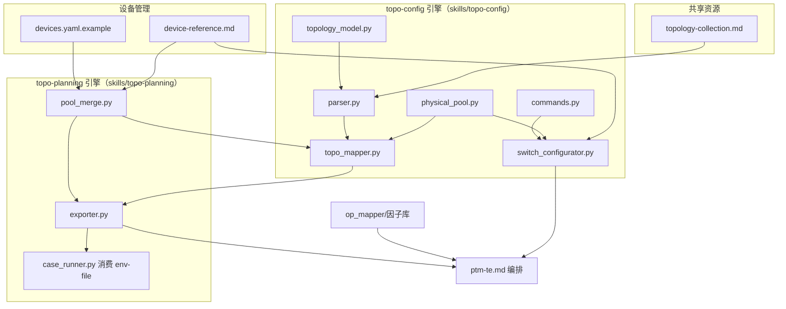

# 依赖映射 — CR-038（PPPoE 链路规划能力）

## 1. 模块依赖方向（允许）

## 2. 模块 → 文件所有权（单写规则）

| 模块 | 文件 | 主要写入 Story | 依赖方向 |
|---|---|---|---|
| 接口模型 | topology_model.py | STORY-038-13（加 interface_kind/instance/trex_instance） | 被 parser/mapper/exporter 读 |
| 解析器 | parser.py | STORY-038-13（透传 interface_kind/trex_instance） | 读 topology_model |
| 映射器 | topo_mapper.py | STORY-038-01 | 读 topology_model/parser/physical_pool |
| 物理池加载 | physical_pool.py | STORY-038-13 | 读 physical_pool.yaml |
| 命令模板 | commands.py | STORY-038-03 | 被 switch_configurator 读 |
| 交换机配置 | switch_configurator.py | STORY-038-04 | 读 commands/physical_pool |
| 归并 | pool_merge.py | STORY-038-02 + STORY-038-13（串行） | 读 devices/ledger/device-reference |
| 导出 | exporter.py | STORY-038-06 + STORY-038-13（串行） | 读 mapper 输出 + physical_pool + ipam |
| 执行消费 | case_runner.py | STORY-038-07 | 读 env-file（不反向依赖） |
| 设备模板 | devices.yaml.example | STORY-038-08 | 被 pool_merge 读 |
| 平台别名 | device-reference.md | STORY-038-09 | 被 pool_merge/switch_configurator 读 |
| 拓扑建模 | topology-collection.md | STORY-038-12 | 被 parser 读 |
| 编排 | agents/ptm-te.md | STORY-038-11 | 编排下游（不反向） |

## 3. 禁止依赖

| 禁止项 | 原因 |
|---|---|
| exporter / case_runner 反向依赖 topo_mapper 内部实现细节 | 走 MappingResult 数据契约，不依赖回溯内部状态 |
| switch_configurator 直接写 physical_pool.yaml | 只读台账，写入走 topo_mapper `_commit_allocation` |
| devices.yaml 承载 SW 接线/端口 | 接线归属 physical_pool.yaml（单源） |
| 独立配置承载 ip pool 段 | 与 DQ-038-05「同源一致」冲突 |
| `${ENV.sw.*}` 占位符进入 env-file | DQ-038-02 明确不新增 |
| PPPoE 动态地址进入 env-file 静态 IPAM | R-C-006 |
| pool_merge 反向依赖 exporter | 归并在导出前，单向 |
| 改动 GE1_1~4 实例 | 安全约束 R-C-004 |

## 4. 依赖与 Wave 对应（详见 DEVELOPMENT-PLAN-CR-038.yaml）

| Wave | Story | 依赖 |
|---|---|---|
| W1 地基（并行，文件互斥） | STORY-038-01/02/03/08/09/12 | — |
| W2 能力（部分依赖 W1） | STORY-038-04/05/06 | S04→S03；S06→S01,S02 |
| W3 透传（依赖 W2） | STORY-038-07/13 | S07→S06；S13→S02,S06 |
| W4 验证/集成（依赖 W2/W3） | STORY-038-10/11 | S10→S03,S04,S05,S06,S13；S11→S06,S13 |

## 5. 修订记录

| 版本 | 日期 | 修订人 | 变更要点 |
|------|------|--------|---------|
| 0.1 | 2026-08-15 | meta-se | 初稿：依赖方向 + 文件所有权 + 禁止依赖 |
