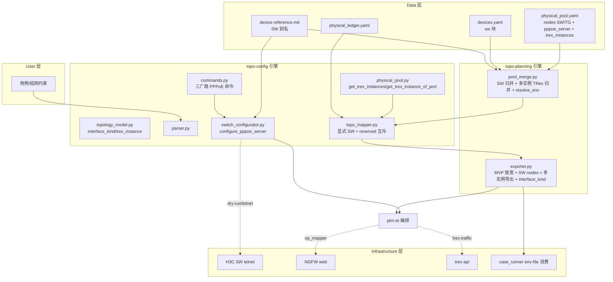

# HLD — ptm-te 集成 PPPoE 链路规划能力（CR-038）

## 修订记录

| 版本 | 日期 | 修订人 | 变更要点 |
|------|------|--------|---------|
| 0.1 | 2026-08-15 | meta-se | 初稿：承接 CP2 七项决策，SW 映射 + PPPoE 配置 + 环回 env-file + 多实例 TRex + 显式 SW 优先级确定性算法 |

## 1. 问题定义

### 1.1 问题陈述

CR-037 交付了「逻辑 topo → 物理 topo 映射 + env-file 生成」，但 MVP 边界显式限定为**单 TG + 单 DUT 直连**（exporter `_validate_mvp_topology` 对含 SW/Mock/PC 或多节点拓扑报 `TOPO_NODE_COUNT_UNSUPPORTED`）。CR-038 突破该边界，兑现 CR-037 HLD §1.3「后续 CR 扩展」承诺，交付 **PPPoE 链路规划能力**：SW 节点显式映射 + PPPoE Server/Client 配置 + 环回拓扑 env-file + 多实例 TRex。

参考场景（已人工调通）：TG1 TE 实例 → SW2 → DUT2 TE0_8 →(PPPoE 拨号)→ SW3(pppoe-server) GE0/1 → SW3 GE0/9 → SW1 → TG1 TE2_1，双向发流 0 丢包。

### 1.2 价值

- 使 topo 引擎从「单链路直连」扩展为「含 SW 的多节点环回」通用能力，覆盖 PPPoE 拨号测试场景。
- PPPoE Server（SW 侧）/ Client（NGFW 侧）配置可自动生成，替换人工调通链路的手工配置。

### 1.3 目标（量化成功标准）

| 编号 | 目标 | 度量 |
|---|---|---|
| G1 | SW 显式节点映射成功率 100% | 逻辑 SW 节点在 physical_pool 有候选时 device_mapping status=matched |
| G2 | 显式 SW 优先于自动透传 | 含显式 SW 拓扑中，自动透传永不占用显式 SW 候选（R-F-018 单测覆盖） |
| G3 | PPPoE 命令三厂商覆盖 | H3C 真机验证通过；ruijie/huawei dry-run diff 供人工核对（SM-038-02） |
| G4 | 环回 env-file 可导出 | TG+DUT+SW 环回拓扑不报 TOPO_NODE_COUNT_UNSUPPORTED，links 含环回端点对 |
| G5 | 多实例 TRex 正确导出 | tg1 产出 trex_instance/trex_sync_port/trex_async_port + trex_api_url；未声明回退单值 |
| G6 | 双向发流 0 丢包 | tg_verify_traffic_loss loss=0（真机，独立 runtime_authorization） |
| G7 | 回归无破坏 | CR-037 node2_dut1_tg1_linkN 场景原行为不变（R-NF-004） |

### 1.4 约束

- 不得修改 REQUIREMENTS-CR-038 / MVP-SCOPE-CR-038 / USE-CASES-CR-038（meta-pm 产物）。
- 凭据 `${ENV_VAR}` 占位（ADR-02）；local-user 密码保持 cipher 密文；默认 dry-run。
- GE1_1~4 实例禁改动（只操作 TE 实例与 TE2_1~4 端口）。
- 真机下发（H3C telnet / NGFW web / trex）为独立 runtime_authorization，CP 批准不隐含。
- 沿用 CR-037 三层文件结构、ledger 占用闭环、ADR-09 产物契约、install 安装链路。

### 1.5 非目标（Out of Scope）

- 固化单条 PPPoE 环回链路（交付形态是通用引擎能力）。
- `${ENV.sw.*}` 占位符（SW 不进 port_mapping，DEF-038-01）。
- ngfw-pppoe factor-library（设计层因子，DEF-038-02）。
- PPPoE Server 强制 VRF（首版全局路由域，DEF-038-03）。
- SW 配置回滚闭环（首版只做下发 + 台账占用，DEF-038-04）。
- ptm-atomic CLI 本体修改（沿用 CR-033/037 边界）。
- 多 DUT 拓扑（本 CR 仍单 DUT）。

### 1.6 关键假设

- A-038-001：SW 进 env-file nodes 不进 port_mapping（CP2 已确认）。
- A-038-002：PPPoE Server 首版全局路由域，VRF 可选（CP2 已确认）。
- A-038-003：env-file links 无向，发流方向由用例指定（CP2 已确认）。
- RA-038-005：physical_pool SW1/SW2 已预留，PPPoE Server SW3 接线由 P-038-03 提供。

### 1.7 缺失信息

- 无 BLOCKING 缺失。ptm-atomic PPPoE op 可用性列为 RA-038-001（LLD 阶段核实，DQ-038-03 三选一闭环），非本 HLD 阻塞项。

## 2. 候选架构方案对比

| 维度 | 方案 A（推荐）：扩展现有 topo 引擎 | 方案 B：独立 PPPoE 规划器 | 方案 C：固化单链路脚本 |
|---|---|---|---|
| 核心思路 | 在 CR-037 topo-config/topo-planning 上增量扩展 SW 映射 + PPPoE 配置 + 环回导出 + 多实例 TRex | 新建独立 PPPoE 规划模块，与 topo 引擎并列 | 硬编码参考场景 6 设备链路 |
| 优点 | 复用映射/台账/产物/安装链路；通用节点类型判定；最简增量 | 职责隔离 | 实现最快 |
| 缺点 | 需协调显式 SW 与自动透传、exporter 文件所有权 | 第三产物面 + 重复映射逻辑；与 CR-037 架构割裂 | 违背「通用能力」边界（用户拍板）；无扩展性 |
| 复杂度 | 中（增量） | 高（新建 + 双引擎） | 低但不可复用 |
| 成本 | 中 | 高 | 低 |
| 扩展性 | 高（节点类型判定） | 中 | 无 |
| 风险 | 文件所有权冲突（exporter/pool_merge 多 Story 共享） | 与 topo 引擎数据源不一致 | 参考场景任何变化即失效 |
| 适用前提 | 复用 CR-037 引擎（本 CR 前提成立） | 需要彻底独立交付形态时 | 仅一次性验证（已排除） |

**结论**：采用方案 A。方案 B 作为治理备选（当 PPPoE 能力需要与 topo 引擎彻底解耦交付时切换）；方案 C 已被用户边界（交付形态=扩展 topo 引擎）排除，仅作范围回退记录。

## 3. 蓝图承接

见 `docs/design/BLUEPRINT-CR-038.md`。核心承接：

- 能力域：topo-config 引擎 + topo-planning 引擎 + 设备管理 + 执行编排 4 域。
- 数据归属单源：PPPoE 数据源（physical_pool `pppoe_server` 块）、多实例 TRex（physical_pool `trex_instances`）、SW 接线（physical_pool）、SW 设备块（devices.yaml）、SW 平台别名（device-reference.md）。
- 依赖方向：topo-config 为底层引擎，topo-planning 消费其产出，禁止反向依赖（见 DEPENDENCY-MAP-CR-038.md）。

蓝图适用性判定：**required**（跨 4 能力域 + 数据归属 + 依赖方向，非单 Feature 小改）。

## 4. 架构灰区与方案形成记录

4 个灰区（AGA-038-01~04）全部经 advisor table 收敛为 agent 默认确定性契约，无新增用户决策。完整记录见 `process/discussions/CP3-HLD-DISCUSSION-LOG.md`，恢复点 `process/checks/CP3-DISCUSSION-CHECKPOINT.json`。

| 灰区 | 结论 | 落地章节 |
|---|---|---|
| AGA-038-01 显式 SW vs 自动透传 | reserved 集互斥（explicit_sw_reserved 从透传候选池剔除） | §4.1 / §10.1 |
| AGA-038-02 多实例 TRex 契约 | pool 侧 trex_instances 为准按 name 合并 | §4.2 / §10.2 |
| AGA-038-03 PPPoE 数据源 + 命令族 | physical_pool `pppoe_server` 块 + 三厂商命令 | §4.3 / §10.4 |
| AGA-038-04 环回 env-file 放行 | 1 TG + 1 DUT + N SW + links 校验 + interface_kind | §4.4 / §10.3 |

## 5. 推荐方案总览

### 5.1 系统思路

在 CR-037「逻辑 topo → 物理 topo 映射 → env-file」主链路上做 4 处增量扩展：

1. **映射层（topo_mapper）**：支持显式 `node_type=SW` 节点匹配，并以 reserved 集保证显式 SW 优先于自动 L2 透传。
2. **归并层（pool_merge）**：SW 节点归并 + 多实例 TRex 归并（`trex_instances` + 接口 `instance`）+ `${TG_*}` 占位符解析。
3. **配置层（switch_configurator + commands）**：新增 PPPoE Server 命令族（三厂商），数据源 = physical_pool `pppoe_server` 块。
4. **导出层（exporter）**：MVP 放宽到 1 TG + 1 DUT + N SW，SW 进 nodes 不进 port_mapping，多实例导出 + interface_kind 透传。

### 5.2 关键架构风格

- **单写规则**：每个文件一个主要写入 Story（见 DEPENDENCY-MAP）；exporter.py / pool_merge.py 被多 Story 共享时通过 Wave 串行。
- **数据源同源**：PPPoE 数据源、TRex 实例、SW 接线均以 physical_pool.yaml 为单一真相源。
- **向后兼容**：node2 系列（无 trex_instances）回退单值 api_server；无 interface_kind 默认 physical。

### 5.3 核心能力边界

| 能力 | 边界内 | 边界外 |
|---|---|---|
| SW 映射 | node_type=SW 显式匹配 + role 保留 + 显式优先 | 多 DUT、Mock 进 env-file |
| PPPoE 配置 | Server（SW）+ Client（NGFW op） | factor-library、强制 VRF |
| 环回导出 | 1TG+1DUT+N SW | 多 DUT、固化链路 |
| 多实例 TRex | 单 TG 主机多实例 | 跨主机实例拆分 |

### 5.4 关键依赖

- 复用 CR-037：topo_mapper / pool_merge / exporter / install / 三层文件结构 / ledger 闭环。
- 复用 ADR-09（env-file `${ENV.*}` 9 类硬契约，SW 只扩展 nodes 不扩展占位符）。
- 复用 ADR-02（凭据占位）、device-reference（平台别名唯一真相源）。

### 5.5 适用条件

- physical_pool.yaml 已含 SW 节点（node_type=SW）与 TG `trex_instances`（多实例时）。
- 参考场景为单 DUT 环回；多 DUT 需后续 CR。

## 6. 适用性矩阵

| 维度 | 评估 | 结论 |
|---|---|---|
| 用户目标 | 参考场景 6 设备环回可跑通 + 引擎通用性 | 匹配（方案 A） |
| 项目成熟度 | 复用 CR-037 已验证引擎，增量风险低 | 匹配 |
| 认知负担 | 4 处增量，无新抽象层 | 低 |
| 验证条件 | fixture dry-run + H3C 真机（独立授权） | 可达 |
| 回退成本 | 增量可单独回退；exporter 放行保留 Mock/多 DUT 拒绝 | 低 |

## 7. Use Case → Architecture Traceability

| UC | 场景 | 架构落点 | 需求 |
|---|---|---|---|
| UC-038-01 规划 PPPoE 拓扑 | SW 显式映射 + role 识别 + 显式优先 | topo_mapper `_backtrack`/`_try_l2_pass_through`/`_build_result` | R-F-001/002/011/018 |
| UC-038-02 生成 PPPoE 配置 | Server 命令族 + 数据源契约 | commands.py + switch_configurator.py + physical_pool `pppoe_server` | R-F-003/004/019 |
| UC-038-03 PPPoE Client 拨号 | NGFW 侧 op 映射 | op_mapper（ptm-atomic 执行层） | R-F-005 |
| UC-038-04 导出环回 env-file | MVP 放宽 + SW nodes + 多实例 + interface_kind | exporter.py + physical_pool.py + pool_merge.py + case_runner.py | R-F-006/007/008/013~017 |
| UC-038-05 SW 设备台账 | devices.yaml sw 块 + device-reference SW 别名 | device-management 模板/参考 | R-F-009/010 |
| UC-038-06 验证 PPPoE 链路 | 双向发流 0 丢包 | trex-traffic | R-F-012 |

## 8. 关键场景模拟

### 8.1 参考场景（6 设备环回，正向）

```
逻辑拓扑：tg1(TE) --link1-- sw2 --link2-- dut1(TE0_8, interface_kind=pppoe)
          dut1 --link3-- sw3(pppoe-server) --link4-- sw1 --link5-- tg1(TE2_1)
```

1. **归并**：pool_merge 归并 physical_pool × devices.yaml，产出 SW1/SW2/SW3（含 SW3 `pppoe_server` 块）+ TG1（含 `trex_instances` GE/TE）。
2. **映射**：topo_mapper 预计算 `explicit_sw_reserved = {SW1,SW2,SW3}`；三个显式 SW 节点按 node_type=SW 匹配（role 保留：SW3=pppoe-server）；TG1/DUT2 正常匹配；无自动透传插入（全部 SW 显式）。
3. **配置生成**：switch_configurator 读 SW3 `pppoe_server` 块，生成 H3C PPPoE Server 命令（ip pool 163.0.0.0/24 + virtual-template + local-user cipher）。dry-run 输出 diff。
4. **导出**：exporter `_validate_mvp_topology` 通过（1TG+1DUT+3SW）；`nodes` 含 tg1/dut1/sw1/sw2/sw3；`port_mapping` 仅 tg/dut 双侧；links 去重后含环回端点对；dut1 pppoe 接口不产 ip、next_hop=null；tg1 产出 `trex_instance=TE` + sync/async + api_url。
5. **验证**：case_runner 加载 env-file（tg1/dut1 校验通过，swN 忽略）；trex 双向发流 loss=0。

### 8.2 显式 SW 优先（R-F-018 负向）

```
逻辑拓扑：tg1 --link1-- dut1（无直连 cable）+ 显式 sw1 节点（另有 link 连接）
```

映射时 `explicit_sw_reserved={SW1}` 使 `_try_l2_pass_through` 跳过 SW1，自动透传改用其他 SW 或失败；SW1 仅由显式逻辑节点占用，台账无冲突。

### 8.3 环回完整性（SCN-038-BND-004 边界）

links 含 `a-b` 与 `b-a` 重复端点对 → 去重；含 `x-x` 自环 → 报错；节点 degree=1（非闭环）→ 报闭环不完整。

## 9. 系统架构图



## 10. 高层模块与职责划分

### 10.1 topo_mapper.py（修改，R-F-001/002/018）

- `_backtrack` 前置：预计算 `explicit_sw_reserved`（所有显式逻辑 SW 节点的物理候选集）。
- `_try_l2_pass_through` 候选 SW = 全部 SW − explicit_sw_reserved − assigned_sws。
- `_build_result` 保留 `role`（SW 节点 role=pppoe-server 传递到 DeviceMapping）。
- 显式 SW 映射成功走既有 `_commit_allocation` 台账闭环。

### 10.2 physical_pool.py + pool_merge.py（修改，R-F-013/014）

- physical_pool.py 新增：`get_trex_instances(device_name)` → `{name: {api_server, hardware_platform, sync_port, async_port}}`；`get_trex_instance_of_port(device_name, port_id)` → 按 `interfaces[port].instance` 反查；`get_free_ports` 透传 `instance` + `trex_port`。
- pool_merge.py：`UnifiedNode.trex_instances` + `UnifiedInterface.instance`；`_merge_tg` 按 name 合并（pool 侧为准补 devices 侧 port_map/ports/service）；新增 `_resolve_env(value)` 解析 `${TG_HARDWARE_PLATFORM}`/`${TG_API_SERVER}`（解析不到保留原串 + warning）。

### 10.3 exporter.py（修改，R-F-006/007/015/016/017）

- `_validate_mvp_topology` 放宽：node_type ∈ {TG,DUT,SW}，恰好 1 TG + 1 DUT，SW 任意数量，Mock/PC 拒绝。
- `_build_nodes`：新增 `swN` 节点（host/brand/role/interfaces）；tg1 节点产出 `trex_instance`/`trex_sync_port`/`trex_async_port` + 保留 `trex_api_url`；dut1 接口读 `interface_kind`（默认 physical）。
- `_build_links`：去重（a-b/b-a）、自环检测、闭环完整性校验。
- `_resolve_ip_plan`：interface_kind=pppoe 接口跳过 ip 填充与完备性检查；next_hop 保持 None。
- 新增 `_resolve_tg_instance(tg_phys, logical_tg)`：逻辑 tg1 声明 `trex_instance` 时按名取实例，否则回退单值 api_server。

### 10.4 switch_configurator.py + commands.py（修改，R-F-003/004）

- commands.py 三厂商新增 PPPoE 命令族（H3C 参考实现；ruijie/huawei 供 dry-run diff）。
- switch_configurator.py 新增 `configure_pppoe_server(pppoe_config, dry_run)`，复用 `_build_*_commands` 模式；H3C 真机验证，ruijie/huawei dry-run diff。

### 10.5 topology_model.py + parser.py（修改，R-F-015/016）

- `InterfaceInfo` 新增 `interface_kind`（默认 physical）；`NodeInfo` 新增 `trex_instance`。
- parser `_parse_interface` 读 `interface_kind`；节点解析读 `trex_instance`。

### 10.6 其余模块

- case_runner.py：load_env_file 兼容额外 swN 节点（不破坏 tg1/dut1 校验）。
- devices.yaml.example：新增 `device_groups[].switch` 块。
- device-reference.md：新增 SW 平台别名映射。
- topology-collection.md：`node3_dut1_tg1_pppoe_link4` 的 pppoe 节点 Mock → 真实 SW（node_type=SW, role=pppoe-server）。
- agents/ptm-te.md：编排集成 PPPoE 链路规划场景。

## 11. 技术选型与理由

| 选型 | 选择 | 理由 |
|---|---|---|
| SW 建模 | 真实 SW 节点（node_type=SW, role=pppoe-server） | DQ-038-01，复用 SW 匹配/role，无 Mock→SW 替换特殊路径 |
| SW env-file 契约 | 进 nodes 不进 port_mapping | DQ-038-02，复用 CR-037 链路，case-execution 零适配 |
| PPPoE 数据源 | physical_pool `pppoe_server` 块 | DQ-038-05，设备台账同源，与 NGFW 拨号 163.0.0.x 同源 |
| PPPoE Client | ptm-atomic 原子操作 + op_mapper | DQ-038-03，拨号是运行时动作非设计变量 |
| 环回 links | 无向 | SGQ-038-02，与 CR-037 links 契约一致 |
| VRF | 首版全局路由域，可选 | SGQ-038-03，参考场景无 VRF |
| 多实例归并 | pool 侧为准按 name 合并 | 与 DQ-038-05 台账同源一致 |
| interface_kind 默认 | physical | 向后兼容，CR-037 无此字段 |

## 12. 关键流程

### 12.1 SW 显式映射（含优先级）

```
1. 解析逻辑拓扑 → NodeInfo（node_type=SW, role, interfaces）
2. 回溯前预计算 explicit_sw_reserved = 显式 SW 节点的物理候选集
3. _backtrack 逐节点匹配：SW 节点按 node_type=SW 匹配候选
4. _check_connectivity 对 TG/DUT 无直连 cable 时调用 _try_l2_pass_through
   → 候选 SW 排除 explicit_sw_reserved + assigned_sws
5. 映射成功 → _commit_allocation 写台账（env_name 占用）
6. _build_result 保留 role 标记
```

### 12.2 多实例 TRex 透传

```
physical_pool.yaml trex_instances + interfaces[].instance
  → physical_pool.get_trex_instances / get_trex_instance_of_port
  → pool_merge._merge_tg（按 name 合并，pool 侧为准补 devices 侧）
  → exporter._resolve_tg_instance（逻辑 trex_instance 声明 → 按名取；否则回退单值）
  → env-file nodes.tg1: trex_instance/trex_sync_port/trex_async_port/trex_api_url
```

### 12.3 PPPoE 配置生成

```
topo_mapper 产出 role=pppoe-server 的 DeviceMapping
  → switch_configurator.from_pool(sw_name)
  → configure_pppoe_server(pool.get_pppoe_server(sw_name))
  → commands.COMMANDS[brand]['pppoe_*'] 渲染
  → dry-run 输出 diff / 真机（独立授权）telnet 下发 + 台账占用
```

### 12.4 环回 env-file 导出

```
映射结果 + 逻辑拓扑
  → _validate_mvp_topology（1TG+1DUT+N SW 放行）
  → _build_port_mapping（仅 tg/dut）
  → _build_nodes（tg1 + dut1 + swN，interface_kind 透传，多实例导出）
  → _build_links（去重/自环/闭环校验）
  → 凭据检查（ADR-02）→ 原子落盘
```

## 13. 非功能需求设计

| NFR | 设计 |
|---|---|
| R-NF-001 三厂商口径 | H3C 真机验证；ruijie/huawei 仅 dry-run diff 供人工核对 |
| R-NF-002 结构化失败报告 | SW 无候选/接口不匹配/连通性冲突输出 reason（复用 build_failure_report 扩展） |
| R-NF-003 下发幂等 | 重复 dry-run 不重复占用台账（复用 ledger `allocated_to` 判定） |
| R-NF-004 回归无破坏 | node2 单值回退 + interface_kind 默认 physical + 无 trex_instances 时回退 api_server |
| 安全 | 凭据 `${ENV_VAR}`、cipher 密文、dry-run 默认、GE1_1~4 禁改动 |

## 14. 主要风险与应对

| 风险 | 影响 | 应对 |
|---|---|---|
| RA-038-001 ptm-atomic op 缺失 | Client 拨号无法落地 | DQ-038-03 三选一（op_mapper 映射/外部依赖/手工步骤），LLD 核实 |
| RA-038-002 H3C 命令厂商差异 | Server 命令不匹配真机 | H3C 参考实现 + dry-run diff + 真机独立授权 |
| RA-038-003 IPAM 语义冲突 | 动态地址污染静态 IPAM | ip pool 段作配置参数，动态地址不进静态 IPAM（R-C-006） |
| RA-038-004 环回组合爆炸 | 放宽边界引入组合复杂 | 首版覆盖参考场景 + 通用节点类型判定，不穷举组合 |
| RA-038-007 真机下发 × 无 teardown | 无自动撤销路径 | 登记风险接受；下发前人工核对 diff + 记录命令供手工回滚 |

## 15. ADR 候选决策点

见 `docs/design/ARCHITECTURE-DECISION-CR-038.md`。核心候选 ADR：

| ADR | 决策 |
|---|---|
| ADR-CR038-01 | 显式 SW 节点 reserved 集互斥（R-F-018） |
| ADR-CR038-02 | 多实例 TRex pool 侧为准按 name 合并（R-F-014） |
| ADR-CR038-03 | PPPoE 数据源 = physical_pool `pppoe_server` 块（R-F-019） |
| ADR-CR038-04 | 环回 env-file 放行 = 1TG+1DUT+N SW + links 校验（R-F-006） |
| ADR-CR038-05 | interface_kind 透传 + pppoe 不产 ip/next_hop=null（R-F-016/017） |

## 16. 分阶段落地建议（Wave）

| Wave | Story | 说明 |
|---|---|---|
| W1 地基（并行） | STORY-038-01/02/03/08/09/12 | SW 映射/归并/命令族/SW 设备/别名/建模，文件互斥 |
| W2 能力 | STORY-038-04/05/06 | PPPoE 下发/Client op/exporter MVP+SW，依赖 W1 |
| W3 透传 | STORY-038-07/13 | case_runner 兼容 + 多实例 TRex + interface_kind，依赖 W2 |
| W4 验证/集成 | STORY-038-10/11 | trex 验证 + ptm-te 编排，依赖 W2/W3 |

> 与 §19 工作量粗估、DEVELOPMENT-PLAN-CR-038.yaml 一一对应（13 Story / 4 Wave）。

## 17. Feature 级实现设计触发条件

| Feature | 适用性 | 触发原因 | lld_policy 基准 |
|---|---|---|---|
| F-CR038-E1 SW 映射与台账 | required | data-model（interface_kind 扩展）+ shared-story-boundary（topo_mapper/pool_merge） | 见 FEATURE-DESIGN-MATRIX |
| F-CR038-E2 PPPoE 配置 | required | external-interface（H3C telnet）+ security（cipher 密文） | 见矩阵 |
| F-CR038-E3 环回 env-file | required | cross-module-contract（exporter/case_runner 契约）+ data-model | 见矩阵 |
| F-CR038-E4 SW 设备管理 | waived | 模板/参考文档回填，模式既有 | technical-note / waived |
| F-CR038-E5 验证与集成 | waived | 编排为 prompt 级集成（沿用 CR-037 模式），验证由 meta-qa 在 CP7 承担，建模为文档回填；无跨模块数据/契约需 Feature DESIGN.md | technical-note / waived |

详细 Story 级 `feature_design_refs` 与 `lld_policy` 见 `docs/design/FEATURE-DESIGN-MATRIX-CR-038.md`。

## 18. 下沉到 Feature 设计的内容

以下不在 HLD 展开，由 `docs/features/<feature>/DESIGN.md` 承接（CP3 通过后生成）：

- `docs/features/cr038-sw-mapping/`：显式 SW reserved 集的具体实现、`_try_l2_pass_through` 跳过条件、role 传递、台账互斥单测。
- `docs/features/cr038-pppoe-config/`：三厂商 PPPoE 命令精确文本、`pppoe_server` schema 校验、cipher 密文处理、telnet 下发异常路径。
- `docs/features/cr038-loopback-envfile/`：环回 links 去重/自环/闭环算法、interface_kind 透传、多实例 TRex 导出、case_runner SW 契约。
- 各 Story 的 full-lld / technical-note 见矩阵。

## 19. 工作量粗估

| Story | 优先级 | 规模 | lld_policy |
|---|---|---|---|
| STORY-038-01 SW 显式映射+优先级 | P0 | 中 | full-lld |
| STORY-038-02 SW 归并 | P1 | 小 | technical-note |
| STORY-038-03 PPPoE 命令族+数据源 | P0 | 中 | full-lld |
| STORY-038-04 PPPoE 下发 | P0 | 小 | technical-note |
| STORY-038-05 PPPoE Client op | P0 | 小 | full-lld（外部接口） |
| STORY-038-06 exporter MVP+SW+环回 | P0 | 中 | full-lld |
| STORY-038-07 case_runner SW 契约 | P1 | 小 | technical-note |
| STORY-038-08 devices.yaml sw 块 | P1 | 小 | waived |
| STORY-038-09 device-reference SW 别名 | P1 | 小 | waived |
| STORY-038-10 trex 双向发流验证 | P0 | 小 | technical-note |
| STORY-038-11 ptm-te.md 编排 | P1 | 小 | technical-note |
| STORY-038-12 topology-collection 建模 | P1 | 小 | waived |
| STORY-038-13 多实例 TRex+interface_kind | P0 | 大 | full-lld |

> 13 Story / 4 Wave，与 §16、DEVELOPMENT-PLAN-CR-038.yaml 一致。

## 20. 待确认问题

| 编号 | 问题 | 状态 | 说明 |
|---|---|---|---|
| Q-038-001 | ptm-atomic PPPoE op 是否已暴露（RA-038-001） | OPEN | LLD 阶段核实，DQ-038-03 三选一闭环，不阻塞本 HLD |
| Q-038-002 | H3C 真机 PPPoE 命令与参考命令族差异 | OPEN | dry-run diff + 真机独立授权核对 |

> 均为 non-blocking-open，不进入 CP3 待决策清单（已由 DQ-038-03 / 真机授权路径覆盖）。

## 21. HLD 自审记录

| 检查项 | 结果 |
|---|---|
| 蓝图适用性判定写入 | required（§3 + BLUEPRINT-CR-038.md） |
| 候选方案 ≥2 + 对比 | 通过（方案 A/B/C） |
| 适用性矩阵 | 通过（§6） |
| UC→架构追踪 | 通过（§7） |
| 场景模拟 ≥2 | 通过（§8，3 个） |
| 架构图 Mermaid | 通过（§9） |
| ADR 候选 | 通过（§15 + ARCHITECTURE-DECISION-CR-038.md） |
| Story/Wave 一致性 | 通过（§16/§19 均 13 Story / 4 Wave） |
| 官方契约一致性（PLATFORM-CONTRACTS） | 通过（env-file ADR-09 契约仅扩展 nodes，不新增占位符） |
| Gotchas 相关 | 通过（links 去重/自环、interface_kind 默认、单值回退、台账互斥） |
| 架构灰区讨论证据 | 通过（CP3-HLD-DISCUSSION-LOG.md + CP3-DISCUSSION-CHECKPOINT.json） |
