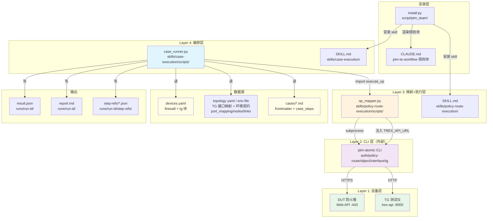

# CR-033 ptm-te 执行引擎高层设计（HLD）

## 修订记录

| 版本 | 日期 | 修订人 | 变更要点 |
|---|---|---|---|
| 1.0 | 2026-07-28 | meta-se | CR-033 HLD 初稿：候选方案对比 / 适用性矩阵 / UC->架构 traceability / 场景模拟 / Gotchas / ADR 候选 |
| 1.1 | 2026-07-28 | meta-se | CP3 评审反馈 P2/P4/P5/P8/P9 落实：P2 追加 §16.1 12 条改进->需求/Story 追溯表（补 #5->R-F-004/022..026, #8->R-F-006/018）；P4 Gotcha#3/§15/§21.12 ADR-05 收敛方案 a；P5 ST-EX-02 拆分（规则块留 Wave 1，安装验证并入 ST-EX-04）同步 §18/§19/Gotcha#10；P8 dry-run fw_login 行为明确（§13.3/Gotcha#8）；P9 UC-EX-09 traceability 补降级；§19 工作量分布修正 8S+6M+2L |
| 1.2 | 2026-07-28 | meta-se | CP3 二轮评审 R1-R6 落实：R1 §12.2 流程图 _build_exec_env 签名加 tg_api_server + 交叉引用 484/571 改为 case_runner 读 devices.yaml 传入 op_mapper（op_mapper 不直接读 devices.yaml）；R2 §13.1 性能数字注明 17 为 exec_v4.py 历史基线/24 为目标 + static-only 不可验证；R3 DA 表补 DA-006 topology yaml 假设；R4 ST-EX-14/EP-EX-08 从 FE-EX-03 移至 FE-EX-02（§3/§17 Epic 与 Story 列表同步）；R5 §16.1 追溯表补 #5/#10 分期维度注解；R6 §18 去掉 tg-device-modeling/DESIGN.md 选项（FE-EX-01 waived） |
| 1.3 | 2026-07-28 | meta-se | CP3 评审范围扩展：环境文件驱动 resolve_env_refs。§12.2 execute_op 流程加 env_topology + resolve_env_refs（顺序 resolve_env_refs->resolve_step_refs->validate_args->build_command）；§12.3 新增环境解析层设计（${ENV.*} 8 类占位符 + env_topology 契约 + DUT 接口预配置 + ptm-atomic 约束）；§12.1 [2] 设备准备 + 环境加载；ADR-09 新增（§15/§21.12 回写）；ADR-05 微调（环境文件优先）；ADR-08 补充（topology yaml 用途扩展）；Gotcha #11/#12/#13；DA-006 扩展 + DA-007；§16 Wave 3 加 ST-EX-17；§16.1 追溯表加环境文件驱动；§19 工作量加 ST-EX-17（17 Story）；UC-EX-11/SM-EX-12；§10 模块表 + §9 架构图 + §5 能力边界 + §11 技术选型同步 |
| 1.4 | 2026-07-28 | meta-se | CP3 三轮自检 P1/P3/P4 落实：P1 ST-EX-03 file_ownership 追加 op_mapper.py#resolve_env_refs（resolve_env_refs 归属 ST-EX-03）；P3 §12.3 明确 schema 消费方（用例生成未来+用例执行 CR-033）+ 载体暂用 topology yaml + §20 追加 O-04（schema 管理 skill/CLI 后续 CR 候选）；P4 §12.3 DUT 接口预配置清理顺序明确（先 ST-EX-06 mutation ops 逆序清理，再 ST-EX-17 框架预配置接口逆序还原） |
| 1.5 | 2026-07-28 | meta-se | CP3 四轮自检 S2/S3/S4 落实：S2 §14 风险矩阵补 RA-013（${ENV.*} 路径不匹配）/RA-014（环境文件缺失或字段不完整）；S3 §12.3 补用例迁移示例 PC-COMB-M4-01-01（改写前环境耦合/改写后 ${ENV.*} 通用）；S4 §16.1 覆盖校验数字 26->29 需求/16->17 Story |
| 1.6 | 2026-07-28 | meta-se | CP3 五轮评审 R15-R19 落实：R15 SCENARIOS/USE-CASES ${ENV.tg.tx_port}->${ENV.tg.port1}（4 处，与 HLD §12.3 命名一致）；R16 §12.3 占位符表补 ${ENV.dut.next_hop}->nodes.dut1.next_hop（8 类->9 类）+ env_topology 契约 nodes 补 next_hop + 迁移示例 next_hop_ip 统一用 ${ENV.dut.next_hop}；R17 §21.1 自审 16->17 Story；R18 §21.1 ADR 覆盖补全（9 条 ADR）；R19 §13.3 补 dry-run resolve_env_refs 指针（指向 Gotcha #12） |

## 1. 问题定义

### 问题陈述

ptm-te 测试执行依赖未入库的 `exec_v4.py`（473 行硬编码 17 用例 + DUT_URL/TG_URL），存在三类问题：
1. 硬编码风险：DUT/TG 地址硬编码，设备变更需改代码；重装后规则丢失（ARP 预热规则可被绕过）
2. 扩展性差：新增用例需改 Python 代码；不支持标签/关键字筛选；用例目录扁平
3. 可审计性弱：结果只有 PASS/FAIL 二态，无法区分 DUT 行为差异（known_issue）和脚本 bug

### 价值

- 新增用例零代码改动：测试执行工程师只需写 case_steps md 文件
- TG/NGFW 双目标路由与 max_loss/ARP预热/session 规则固化防重装回退
- 失败用例自动诊断，结果 PASS/FAIL/KNOWN_FAIL/ERROR 四态分级
- 消除 exec_v4.py 硬编码与重装回退风险

### 目标

1. 为 devices.yaml 新增 TG 类型设备建模（6 组合）
2. 新建 case-execution skill（op_mapper 模式，SKILL.md + case_runner.py 兼 CLI）
3. 落地全量 12 条执行改进（P0->P3 四期）
4. 消除 exec_v4.py 硬编码，迁移后废弃
5. 环境文件驱动（resolve_env_refs + ${ENV.*} + --env-file），用例与环境解耦，一次编写多环境执行（CP3 评审范围扩展）

### 成功标准（量化）

| 指标 ID | 指标 | 目标值 | 验收口径 |
|---|---|---|---|
| SM-EX-01 | TG 设备型号覆盖 | 6 组合 | device-reference.md 6 组合全覆盖 |
| SM-EX-02 | 用例执行入口 | 3 种 | case_runner.py 支持 --case-file/--cases-dir/--tag/--keyword |
| SM-EX-03 | 硬编码消除 | 0 | case_runner.py 无硬编码 IP |
| SM-EX-04 | 统一解析函数 | 1 个 | extract_payload(op_id, envelope) |
| SM-EX-05 | 规则固化 | ≥4 条 | install.py 规则块含 TG路由/max_loss/ARP预热/session |
| SM-EX-06 | 改进覆盖 | 12/12 | 12 条改进全量落地 |
| SM-EX-07 | ARP 预热覆盖 | 24/24 | 24 用例 warming_up step 合规 |
| SM-EX-08 | 结果分级 | 4 态 | PASS/FAIL/KNOWN_FAIL/ERROR |
| SM-EX-09 | 重装一致性 | 0 丢失 | 重装后规则+skill 存在 |
| SM-EX-10 | fw_logout op | 1 个 | op_mapper 含 fw_logout 映射 |
| SM-EX-11 | op_id 覆盖 | 22 个 | op_mapper EXPECTED_OP_COUNT=22（21+fw_logout） |
| SM-EX-12 | 环境文件驱动 | ${ENV.*} 占位符 9 类 | resolve_env_refs 支持 9 类 ${ENV.*} 占位符（tg.port1/port1.ip/port1.gw/url, dut.port1/port1.ip/url/next_hop, tg.ports[]） |

### 约束

- R-C-001：不改 ptm-atomic CLI 本体
- R-C-002：不引入 pytest/robot/外部 eval 框架
- R-C-003：不为 devices.yaml 引入 pydantic
- R-C-004：不做 HTML 报告
- R-C-005：不改 traffic-skill / ngfw-install skill
- R-C-006：不采集 TG 系统快照
- R-C-007：skill 源在 ptm-team canonical，install.py 安装回 ptm-te workspace
- R-C-008：24 用例 md 留 ptm-te workspace

### 非目标

- 改 ptm-atomic CLI 本体
- 引入 pytest/robot/外部 eval 框架
- 为 devices.yaml 引入 pydantic
- HTML 报告（进 BACKLOG）
- 改 traffic-skill / ngfw-install skill
- 采集 TG 系统快照
- 读取凭据 / secret / 账户
- 真实设备 --execute 写操作的自动授权

### 关键假设

| ID | 假设 | 关联需求 | 验证方式 |
|---|---|---|---|
| DA-001 | ptm-atomic CLI 已安装且在 PATH 中 | R-F-004 | case_runner 启动时 `which ptm-atomic` |
| DA-002 | 24 用例 md 的 case_steps 格式与 parse_steps 兼容 | R-F-004 | dry-run 模式批量校验 |
| DA-003 | devices.yaml 中 firewall.host 和 tg.api_server 字段存在 | R-F-005 | case_runner 启动时校验 |
| DA-004 | ptm-atomic 安装版暴露 fw_logout op | R-F-016 | 安装前 `ptm-atomic show fw_logout` |
| DA-005 | TG host 上 trex-api 服务已启动且 api_server 可达 | R-F-018 | 集成测试 |
| DA-006 | TG 用例执行时 --topology-yaml 指定的 topology yaml（或 --env-file）文件存在且含 port_mapping/nodes/links 完整环境契约 | R-F-018 + R-F-027 + ADR-08/09 | case_runner 启动时校验文件存在 + 字段完整性 |
| DA-007 | --env-file 的 port_mapping 覆盖用例引用的全部逻辑端口（port1/port2） | R-F-027 + ADR-09 | build_env_topology 校验 port_mapping 完整性 |

### 缺失信息

无 BLOCKING 缺失信息。CP2 已确认 6 DQ，4 SGQ 全部 resolved。

## 2. 候选架构方案对比

### 方案 A：op_mapper 模式（case_runner 直接 import op_mapper）  [推荐]

**核心思路**：case_runner.py 作为编排层，直接 import op_mapper 模块复用 execute_op/build_command/handle_rollback，新增用例解析/四态分级/报告生成/extract_payload 等编排逻辑。

**关键架构风格**：分层架构（编排层 -> 映射+执行层 -> CLI 层 -> 设备层），进程内函数调用。

**优点**：
- 性能好（无新进程开销）
- 复用 op_mapper 现有 21 op 映射 + step-refs + 回滚逻辑
- 单元测试容易（mock execute_op）
- 与 exec_v4.py subprocess 方式相比，消除重复 envelope 解析

**缺点**：
- case_runner 与 op_mapper 进程内耦合
- 跨 skill import 路径需显式声明

**复杂度**：中。case_runner.py 预计 800-1000 行，复用 op_mapper 不需要重写映射层。

**成本**：低。复用 op_mapper 现有逻辑，新增编排逻辑。

**扩展性**：高。新增 op 只需在 op_mapper 映射表添加，case_runner 自动复用。

**风险**：op_mapper 异常会影响 case_runner（通过异常处理缓解）。

**适用前提**：case-execution skill 与 policy-route-execution skill 同仓库（ptm-team canonical）。

### 方案 B：subprocess 模式（case_runner 通过 CLI 调用 op_mapper）

**核心思路**：case_runner.py 通过 subprocess 调用 `python op_mapper.py execute`，与 exec_v4.py 方式一致。

**优点**：
- 进程隔离，op_mapper 崩溃不影响 case_runner
- 与 exec_v4.py 一致，迁移成本低

**缺点**：
- 每次调用启动新 Python 进程，性能差（exec_v4.py 历史基线 17 用例 × 10 step = 170 次进程启动）
- envelope 解析重复（case_runner 和 op_mapper 各解析一次）
- step-refs 跨进程传递复杂
- 与 exec_v4.py 的历史包袱一致

**复杂度**：高。需处理进程间通信、step-refs 目录管理、envelope 重复解析。

**成本**：中。subprocess 调用逻辑已有（exec_v4.py），但维护成本高。

**扩展性**：低。每次新增 op 需确保 CLI 接口稳定。

**风险**：性能问题在 17+ 用例场景显著。

**适用前提**：case_runner 需独立部署到无 op_mapper 的环境。

### 方案 C：独立编排框架（引入 pytest/robot）

**核心思路**：引入 pytest 或 robot framework 作为用例执行框架，op_mapper 作为 fixture/library。

**优点**：
- 成熟框架，社区支持
- 内置用例发现/分级/报告

**缺点**：
- 与 R-C-002 冲突（不引入外部框架）
- 学习成本高
- 框架约束与 ptm-atomic envelope 不匹配

**复杂度**：高。需学习框架 + 适配层。

**成本**：高。框架引入 + 适配 + 培训。

**扩展性**：中。受框架约束。

**风险**：框架版本升级可能破坏适配。

**适用前提**：用户撤销 R-C-002 约束。

### 方案对比矩阵

| 维度 | 方案 A（import） | 方案 B（subprocess） | 方案 C（框架） |
|---|---|---|---|
| 优点 | 性能好/复用/易测试 | 进程隔离/迁移成本低 | 成熟/社区支持 |
| 缺点 | 进程内耦合 | 性能差/重复解析 | 与 R-C-002 冲突 |
| 复杂度 | 中 | 高 | 高 |
| 成本 | 低 | 中 | 高 |
| 扩展性 | 高 | 低 | 中 |
| 风险 | op_mapper 异常影响 | 性能问题 | 框架约束 |
| 适用前提 | 同仓库 | 独立部署 | 撤销 R-C-002 |

**推荐方案**：A（op_mapper 模式，case_runner 直接 import op_mapper）。

## 3. 蓝图承接

详见 `docs/design/BLUEPRINT-PTM-TE-EXEC.md`。

- Feature FE-EX-01（TG 设备建模）：EP-EX-01/02，ST-EX-01/03
- Feature FE-EX-02（case-execution 引擎）：EP-EX-03/04/05/08/09，ST-EX-04..12/14/15/16/17
- Feature FE-EX-03（规则固化与执行改进）：EP-EX-06/07，ST-EX-02/13

数据归属（AGA-02=A，用户已确认 2026-07-28）：devices.yaml tg 块只存元数据，接口拓扑留 traffic-skill topology yaml。case_runner 需 --topology-yaml 参数指定拓扑文件路径。

依赖方向：case-execution -> policy-route-execution（import）-> ptm-atomic（subprocess）-> DUT/TG（HTTP）。

## 4. 架构灰区与方案形成记录

详见 `process/discussions/CP3-HLD-DISCUSSION-LOG-CR033.md`。

| 灰区 ID | 问题 | 推荐方案 | 用户确认 |
|---|---|---|---|
| AGA-01 | case-execution 与 op_mapper 集成方式 | A（直接 import） | agent 默认处理 |
| AGA-02 | TG 设备数据归属 | A（devices.yaml 元数据 + topology yaml 接口） | **已确认**（AGAQ-01=A，2026-07-28T12:30:00+08:00） |
| AGA-03 | frontmatter 16 列冗余字段 | C（摘要 + case_runner 忽略冗余列） | agent 默认处理 |
| AGA-04 | extract_payload 抽象位置 | A（放在 case_runner.py） | agent 默认处理 |

advisor lane 汇总：lane-product / lane-architecture / lane-quality 一致推荐方案 A。

## 5. 推荐方案总览

### 系统思路

case_runner.py 作为编排层，直接 import op_mapper 模块复用映射+执行逻辑，新增用例发现/解析/四态分级/报告生成/extract_payload 等编排逻辑。devices.yaml 新增 tg 块存 TG 设备元数据，接口拓扑留 traffic-skill topology yaml。install.py 规则块固化 ≥4 条新规则防重装回退。

### 关键架构风格

分层架构（4 层）：
- Layer 4：编排层（case_runner.py）
- Layer 3：映射+执行层（op_mapper.py）
- Layer 2：CLI 层（ptm-atomic，外部依赖）
- Layer 1：设备层（DUT + TG）

### 核心能力边界

- case_runner.py：用例发现/解析/执行编排/四态分级/报告生成/extract_payload/retry/known_issue/warming_up/load_env_file/build_env_topology/preconfigure_dut_interfaces
- op_mapper.py：op_id->CLI 映射/build_command/execute_op/rollback/step-refs/STATE_INVALID 重连/resolve_env_refs（新增 fw_logout + TREX_API_URL 注入 + env_topology 参数）
- device-management：devices.yaml tg 块 + 6 组合型号对照
- install.py：规则块固化 + skill 安装

### 关键依赖

- case-execution -> policy-route-execution（import，AGA-01=A）
- case-execution -> device-management（读 devices.yaml）
- case-execution -> traffic-skill topology yaml（读接口映射）
- op_mapper -> ptm-atomic（subprocess）

### 适用条件

- case-execution skill 与 policy-route-execution skill 同仓库（ptm-team canonical）
- ptm-atomic CLI 已安装且在 PATH 中
- devices.yaml 含 firewall.host 和 tg.api_server
- traffic-skill topology yaml 含 TG 接口映射

## 6. 适用性矩阵

| 维度 | 评估 | 说明 |
|---|---|---|
| 用户目标 | 高匹配 | 消除硬编码 + 零代码新增用例 + 四态分级 |
| 项目成熟度 | 中匹配 | op_mapper 已有 21 op 映射，case_runner 是新建 |
| 认知负担 | 低 | 测试执行工程师只需写 case_steps md，不需懂 Python |
| 验证条件 | 高 | dry-run 默认门可静态校验，--execute 需 runtime_authorization |
| 回退成本 | 低 | exec_v4.py 保留废弃标记，可回退；方案 B（subprocess）作为备选 |

## 7. Use Case -> Architecture Traceability

| UC ID | 用例 | 架构组件 | 关联需求 |
|---|---|---|---|
| UC-EX-01 | TG 设备建模 | devices.yaml tg 块 + device-management SKILL.md + device-reference.md | R-F-001/002/003 |
| UC-EX-02 | 目录 glob 批量执行 | case_runner.py --cases-dir + op_mapper execute_op + 逆序清理 | R-F-004/005/007/015 |
| UC-EX-03 | 单用例执行调试 | case_runner.py --case-file | R-F-004 |
| UC-EX-04 | dry-run 校验 | case_runner.py dry_run=True + build_command | R-F-006 |
| UC-EX-05 | --execute 授权执行 | case_runner.py --execute --authorized + runtime_authorization + STATE_INVALID 重连 + ConnectTimeout 重试 | R-F-007/R-NF-002/004/005 |
| UC-EX-06 | 失败诊断与四态分级 | case_runner.py known_issue 解析 + 失败诊断 + report.md + extract_payload | R-F-010/011/012/013/014 |
| UC-EX-07 | ARP 预热自动清理 | case_runner.py warming_up/post_op 引擎强制 + install.py ARP 预热规则 | R-F-008/019 |
| UC-EX-08 | 规则固化与重装一致性 | install.py ptm-te-workflow 规则块 + op_mapper validate | R-F-019/R-NF-003 |
| UC-EX-09 | fw_logout 会话清理 | op_mapper fw_logout 映射（auth logout）+ case_runner cleanup 登出 + 降级 session 文件清理（ADR-04/DQ-02） | R-F-016/017 |
| UC-EX-10 | 用例结构化与标签执行 | case_runner.py --tag/--keyword + frontmatter 16 列 + 目录结构 | R-F-022/023/024/025/026 |
| UC-EX-11 | 多环境执行（CP3 评审范围扩展） | case_runner.py --env-file + op_mapper resolve_env_refs + ${ENV.*} + DUT 接口预配置 + TREX_API_URL 环境文件优先 | R-F-027/028/029 |

## 8. 关键场景模拟

### 场景 1：TG 设备建模 6 组合全覆盖（SCN-EX-01）

1. 测试平台开发者通过 device-management skill 在 devices.yaml 新增 tg 块
2. tg 块含 type:TG + host + serial_url + sub_type(ixia-c) + hardware_platform(EP) + ssh + api_server(10.113.52.253:8450)
3. device-reference.md 查阅确认 ixia-c × EP 组合存在
4. 重复 6 次，覆盖 ixia-c/trex × EP/C236/J1900 = 6 组合
5. 验证：device-reference.md 6 组合全覆盖，devices.yaml tg 块含全部字段

### 场景 2：目录 glob 批量执行用例（SCN-EX-02）

1. 测试执行工程师执行 `case_runner.py run --cases-dir cases/IPv4策略路由/ --devices-yaml devices.yaml --execute --authorized`
2. case_runner 扫描 cases/IPv4策略路由/ 下全部 .md 文件
3. case_runner 从 devices.yaml 读取 firewall.host（DUT_URL）和 tg.api_server（TREX_API_URL）
4. case_runner 调用 op_mapper execute_op 执行 fw_login_web_management 建立共享 session
5. 逐用例解析 case_steps YAML，按 step 执行 op
6. tg_* op 执行时，op_mapper _build_exec_env 注入 TREX_API_URL
7. 每用例结束后逆序清理 mutation ops
8. 全部用例结束后调用 fw_logout 登出
9. 输出 result.json（四态分级 + 清理记录 + runtime_authorization）+ report.md（四态统计 + 失败诊断）

### 场景 3：ARP 预热自动清理（SCN-EX-05）

1. 用例 step 含 warming_up:true（ARP 预热探测流）
2. case_runner 识别 warming_up:true，主 op（tg_start_traffic_stream）执行后强制执行 post_op（tg_stop_traffic_stream）
3. 即使 md 未写 post_op，case_runner 自动补充 tg_stop_traffic_stream，参数从主 op 继承（ports/txport/rxport/name）
4. 结果记入 result.json，warming_up step 标记 auto_post_op=true

### 场景 4：known_issue 四态分级（SCN-EX-09）

1. M4-01-09 STEP-007 删除被引用对象，DUT 行为是阻止删除（符合预期）
2. 用例 md 在 STEP-007 标注 known_issue:true
3. case_runner 执行 STEP-007，fw_delete_object 返回 eBeingReferenced
4. case_runner 识别 known_issue 标记，step 结果为 KNOWN_FAIL
5. 用例 overall 不因 known_issue 降级为 FAIL，记为 KNOWN_FAIL
6. report.md 含 KNOWN_FAIL 统计和 DUT 行为差异说明

## 9. 系统架构图



## 10. 高层模块与职责划分

| 模块 | 路径 | 职责 | CR-033 变更 |
|---|---|---|---|
| case_runner.py | skills/case-execution/scripts/ | 用例发现/解析/执行编排/四态分级/报告生成/extract_payload/retry/known_issue/warming_up/load_env_file/build_env_topology/preconfigure_dut_interfaces | **新建** |
| case-execution SKILL.md | skills/case-execution/ | skill 描述 + 使用说明 + 安全约束 | **新建** |
| op_mapper.py | skills/policy-route-execution/scripts/ | op_id->CLI 映射/build_command/execute_op/rollback/step-refs/STATE_INVALID 重连/resolve_env_refs | 新增 fw_logout + TREX_API_URL 注入 + resolve_env_refs（env_topology 参数） |
| device-management SKILL.md | skills/device-management/ | 设备清单管理 + 型号映射查表 | 新增 TG 流程段 + TG_SSH_PASSWORD |
| device-reference.md | skills/device-management/reference/ | 硬件系列到型号对照表 | 新增 TG 6 组合 |
| devices.yaml.example | skills/device-management/templates/ | 设备清单模板 | 新增 tg 块示例 |
| install.py | script/ptm_team/ | skill 安装 + 规则块渲染 | 新增 ≥4 条规则 + case-execution 安装 |
| topology yaml | skills/traffic-skill/configs/ | 组网拓扑（TG 接口映射）+ 环境参数解析契约（port_mapping/nodes/links） | 不改（R-C-005），case_runner 只读；--env-file 加载为 env_topology（ADR-09） |

## 11. 技术选型与理由

| 决策点 | 选型 | 理由 | 备选 | 切换条件 |
|---|---|---|---|---|
| 引擎形态 | skills/case-execution/（SKILL.md + case_runner.py） | 与既有 skill 结构一致；argparse CLI 易用 | 独立 Python 包 | 需独立版本管理时 |
| 集成方式 | case_runner 直接 import op_mapper（AGA-01=A） | 性能好/复用/易测试 | subprocess（方案 B） | 跨仓库部署 |
| TG 数据归属 | devices.yaml 元数据 + topology yaml 接口（AGA-02=A） | 与 firewall 块对称；职责清晰 | devices.yaml 含接口 | topology yaml 废弃 |
| 框架 | 不引入 pytest/robot，借鉴理念 | R-C-002 约束；保持轻量 | pytest/robot | 用户撤销 R-C-002 |
| TG 建模 | type:TG + api_server，不引入 pydantic | R-C-003 约束；保持轻量 | pydantic schema | 设备模型复杂度增加 |
| 报告格式 | result.json + report.md | R-C-004 约束；足够可审计 | HTML 报告 | 用户明确要求 |
| frontmatter 冗余 | 摘要 + case_runner 忽略冗余列（AGA-03=C） | DQ-05 确认 16 列；case_steps 是真相源 | 强一致校验 | 用户要求摘要与详细一致 |
| extract_payload 位置 | 放在 case_runner.py（AGA-04=A） | 消费侧逻辑；op_mapper 职责单一 | 放在 op_mapper | 多消费者 |
| fw_logout 实现 | op_mapper 映射 + 降级 session 清理（DQ-02） | 保证可用性 | 强制 ptm-atomic 升级 | ptm-atomic 升级 CR |
| 用例命名 | 编号正则匹配（DQ-06） | frontmatter 编号为唯一标识 | 下划线分隔 | 改变命名习惯 |
| 环境文件驱动 | resolve_env_refs + ${ENV.*} + --env-file（ADR-09） | 用例与环境解耦，一次编写多环境执行 | 硬编码 / 一次性适配脚本 | 无 |

## 12. 关键流程

### 12.1 case_runner 执行流程

```
case_runner.py run --cases-dir <dir> --devices-yaml <path> --topology-yaml <path> [--env-file <path>] [--execute --authorized] [--tag <tags>] [--keyword <kw>]
  │
  ├─ [1] 启动校验
  │   ├─ which ptm-atomic（DA-001）
  │   ├─ devices.yaml 含 firewall.host 和 tg.api_server（DA-003）
  │   ├─ topology yaml 存在且含 TG 接口映射（若用例含 TG step，ADR-08=A）
  │   └─ --env-file 存在且含 port_mapping/nodes/links 完整环境契约（DA-006/007，若用例含 ${ENV.*}，ADR-09）
  │
  ├─ [2] 设备准备 + 环境加载
  │   ├─ load_env_file(--env-file) -> env_topology（port_mapping/nodes/links，R-F-027）
  │   ├─ build_env_topology 校验 env-file 完整性（port_mapping 覆盖全部逻辑端口，DA-007）
  │   ├─ DUT 接口自动预配置：fw_update_interface 按 nodes.dut1.interfaces（R-F-028，--execute 模式）
  │   ├─ TREX_API_URL = ${ENV.tg.url}（环境文件优先，ADR-05）；env-file 缺失时 fallback devices.yaml tg.api_server
  │   └─ 用例后清理：逆序删除/还原 DUT 接口预配置（R-F-028）
  │
  ├─ [3] 用例发现
  │   ├─ --cases-dir: glob 扫描 .md 文件
  │   ├─ --case-file: 单用例
  │   ├─ --tag: 按 frontmatter tags 列精确过滤
  │   └─ --keyword: 按 frontmatter 关键词列模糊匹配
  │
  ├─ [4] 预登录（--execute 模式）
  │   ├─ 调用 op_mapper execute_op(fw_login_web_management, env_topology=env_topology)
  │   ├─ 建立 SHARED_SESSION
  │   └─ ConnectTimeout 重试 3 次（15/20/25s）
  │
  ├─ [5] 逐用例执行
  │   ├─ 解析 frontmatter 16 列（忽略测试步骤/预期结果列）
  │   ├─ 解析 case_steps YAML
  │   ├─ 逐 step 执行
  │   │   ├─ resolve_env_refs(args, env_topology) 插值 ${ENV.*}（ADR-09，在 resolve_step_refs 前）
  │   │   ├─ resolve_step_refs 插值 ${STEP-N.id}
  │   │   ├─ validate_args（resolve_env_refs/resolve_step_refs 后校验）
  │   │   ├─ op_mapper execute_op(env_topology=env_topology)（dry_run 或 --execute）
  │   │   ├─ tg_* op: _build_exec_env 注入 TREX_API_URL
  │   │   ├─ STATE_INVALID 自动重连 1 次
  │   │   ├─ ConnectTimeout 重试（TG 3 次 / DUT 1 次）
  │   │   ├─ 幂等容错（对象已存在/流不存在/被引用阻止）
  │   │   ├─ known_issue 标记 -> KNOWN_FAIL
  │   │   ├─ retry 字段 -> 轮询
  │   │   └─ warming_up:true -> 强制 post_op
  │   ├─ 逆序清理 mutation ops
  │   └─ 写 result.json
  │
  ├─ [6] fw_logout 会话清理
  │   ├─ op_mapper execute_op(fw_logout, env_topology=env_topology)
  │   ├─ 未暴露时降级清理 session 文件（DQ-02）
  │   └─ result.json 含 logout 状态
  │
  └─ [7] 生成 report.md
      ├─ 四态统计表
      ├─ 失败 step 诊断（error_type/error_code/reason/details/command）
      └─ 幂等容错记录
```

### 12.2 op_mapper TREX_API_URL 注入流程

```
op_mapper.execute_op(tg_* op_id, args, base_url, ...)
  │
  ├─ build_command(op_id, args, base_url, session_file, dry_run)
  │   └─ 组装 ptm-atomic run tg trex <action> [flags]
  │
  ├─ _build_exec_env(base_url, tg_api_server)
  │   ├─ 从 base_url 提取 DUT host -> NO_PROXY
  │   └─ 【新增】注入 tg_api_server（由 case_runner 从 devices.yaml 读取并传入）-> TREX_API_URL
  │
  └─ subprocess.run(command, env=_build_exec_env)
      └─ ptm-atomic 读 TREX_API_URL 环境变量，连接 TG api_server
```

### 12.2 op_mapper execute_op 流程（含 resolve_env_refs + TREX_API_URL 注入）

```
op_mapper.execute_op(op_id, args, base_url, ..., env_topology=None)
  │
  ├─ [1] resolve_env_refs(args, env_topology)
  │   ├─ 扫描 args 中 ${ENV.*} 占位符
  │   ├─ 按 env_topology（port_mapping/nodes/links）解析替换
  │   └─ 解析失败 -> 返回 VALIDATION_FAILED envelope
  │
  ├─ [2] resolve_step_refs(args, step_refs)
  │   └─ 插值 ${STEP-N.id}（既有逻辑）
  │
  ├─ [3] validate_args(op_id, args)
  │   └─ resolve_env_refs/resolve_step_refs 后校验参数完整性
  │
  ├─ [4] build_command(op_id, args, base_url, session_file, dry_run)
  │   └─ 组装 ptm-atomic run <family> <action> [flags]
  │
  ├─ [5] _build_exec_env(base_url, tg_api_server)
  │   ├─ 从 base_url 提取 DUT host -> NO_PROXY
  │   └─ 注入 tg_api_server -> TREX_API_URL（tg_api_server 来源：env_topology ${ENV.tg.url} 优先，devices.yaml tg.api_server fallback，ADR-05）
  │
  └─ [6] subprocess.run(command, env=_build_exec_env)
      └─ ptm-atomic 读 TREX_API_URL 环境变量，连接 TG api_server
```

**执行顺序**：resolve_env_refs -> resolve_step_refs -> validate_args -> build_command（ADR-09）。未含 ${ENV.*} 字面值原样透传（向后兼容）。

### 12.3 环境解析层设计（resolve_env_refs + ${ENV.*}，ADR-09，CP3 评审范围扩展）

**设计目标**：用例与环境解耦，用例只描述测试意图与逻辑拓扑角色（port1/port2），环境文件描述物理映射，执行框架在执行时自动桥接。换环境只需换 `--env-file`，不改用例、不改执行脚本（R-F-027）。

**env_topology 契约**（case_runner load_env_file 加载 --env-file，结构 port_mapping/nodes/links）：

| 字段 | 说明 | 示例 |
|---|---|---|
| port_mapping | 逻辑端口 -> 物理映射（port1/port2 不随环境变化） | `{port1: {tg: "1/1/1", dut: "eth0"}, port2: {tg: "1/1/2", dut: "eth1"}}` |
| nodes | 设备节点元数据 + 接口 IP/网关/下一跳 | `tg1: {trex_api_url, interfaces: {port1: {ip, gw}}}; dut1: {host, next_hop, interfaces: {port1: {ip}}}` |
| links | 组网连接拓扑 | `[{from: tg1.port1, to: dut1.port1, name: "link1"}]` |

**环境文件 schema 消费方与载体**：schema 消费方 = 用例生成（未来，CP3 范围外）+ 用例执行（CR-033，case_runner load_env_file 只读）。CR-033 暂用 topology yaml（skills/traffic-skill/configs/，ADR-08）作环境文件载体，case_runner 只读不写；统一 schema 管理 skill/CLI（含未来交换机 schema）作为后续 CR 候选（O-04，不阻塞 LLD）。

**${ENV.*} 占位符语法**：

| 占位符 | 解析目标 | 说明 |
|---|---|---|
| ${ENV.tg.port1} | port_mapping.port1.tg | TG 物理端口名 |
| ${ENV.tg.port1.ip} | nodes.tg1.interfaces.port1.ip | TG 端口 IP |
| ${ENV.tg.port1.gw} | nodes.tg1.interfaces.port1.gw | TG 端口网关 |
| ${ENV.dut.port1} | port_mapping.port1.dut | DUT 物理端口名 |
| ${ENV.dut.port1.ip} | nodes.dut1.interfaces.port1.ip | DUT 端口 IP |
| ${ENV.tg.url} | nodes.tg1.trex_api_url | TG api_server URL（TREX_API_URL 来源，ADR-05） |
| ${ENV.dut.url} | nodes.dut1.host | DUT URL |
| ${ENV.dut.next_hop} | nodes.dut1.next_hop | DUT 下一跳 IP（policy-route next_hop_ip，ADR-09） |
| ${ENV.tg.ports[port1,port2]} | [port_mapping.port1.tg, port_mapping.port2.tg] | 聚合数组 |

**参数分层原则**：环境相关参数（端口/IP/next_hop/URL）用 ${ENV.*} 占位符，禁止字面值；测试意图参数（op_id/期望结果/known_issue/warming_up）保持字面值。

**DUT 接口自动预配置**（R-F-028，ST-EX-17）：--execute 模式下，case_runner 按 nodes.dut1.interfaces 调用 fw_update_interface 预配置 DUT 接口 IP。**用例后清理顺序**：先执行 ST-EX-06 用例 case_steps mutation ops 逆序清理（run_cleanup），再执行 ST-EX-17 框架预配置接口逆序还原（preconfigure_dut_interfaces 的逆序清理）；确保用例写的 op 先回滚，框架预配置的接口后还原。详细清理逻辑由 ST-EX-17 full-lld 承载（CP5 后）。

**ptm-atomic 约束**：TG 操作仍经 ptm-atomic run tg trex <action> 原子操作下发，框架禁止直接调 TG REST API。环境文件驱动仅做参数解析与 TREX_API_URL 注入（_build_exec_env 环境变量），由 ptm-atomic 子进程消费。

**失败行为**：resolve_env_refs 解析失败（占位符无对应 env_topology 键）-> VALIDATION_FAILED envelope，step 标记 error。

**用例迁移示例（PC-COMB-M4-01-01）**：ST-EX-13 LLD 参照本示例将 24 用例改写为 ${ENV.*} 引用。

改写前（环境耦合，link3 写死）：

```yaml
- op_id: tg_config_interface
  args:
    interfaces: '[{"port":"2_3","ip":"192.168.101.1","gateway":"192.168.101.2"},{"port":"2_4","ip":"192.168.102.1","gateway":"192.168.102.2"}]'
- op_id: fw_config_policy_route
  args: {in_interface: "any", next_hop_ip: "192.168.102.1", source_network: "OBJ-SRC-192", ...}
- op_id: tg_apply_traffic_template
  args: {tx_port: "2_3", rx_port: "2_4", src_ip: "192.168.1.100", dst_ip: "10.0.0.1", ...}
```

改写后（环境无关，任意 link 通用）：

```yaml
- op_id: tg_config_interface
  args:
    interfaces: ${ENV.tg.ports[port1,port2]}   # 框架自动构造 port/ip/gateway 数组
- op_id: fw_config_policy_route
  args: {in_interface: "any", next_hop_ip: ${ENV.dut.next_hop},
         source_network: "OBJ-SRC-192", dst_network: "OBJ-DST-10", type: "ipv4"}
- op_id: tg_apply_traffic_template
  args: {tx_port: ${ENV.tg.port1}, rx_port: ${ENV.tg.port2},
         src_ip: "192.168.1.100", dst_ip: "10.0.0.1",   # 测试意图，字面值
         l4_protocol: "udp", l4_sport: 1234, l4_dport: 5678,
         traffic_mode: "count", rate: "100pps", count: 100}
- op_id: tg_start_traffic_stream
  args: {ports: "${ENV.tg.port1},${ENV.tg.port2}", txport: ${ENV.tg.port1}, rxport: ${ENV.tg.port2}, ...}
```

改写后同一用例在 link3（port1=2_3/port2=2_4）和 link4（port1=2_1/port2=2_2）均可执行，只需换 `--env-file`。src_ip/dst_ip/object_name 等测试意图参数保持字面值。

### 12.4 install.py 规则块渲染流程

```
install.py install ptm-te --component full
  │
  ├─ 安装 skills/case-execution/ -> workspace .claude/skills/case-execution/
  ├─ 安装 skills/policy-route-execution/ -> workspace .claude/skills/policy-route-execution/
  ├─ 安装 skills/device-management/ -> workspace .claude/skills/device-management/
  ├─ 安装 skills/trex-traffic/ -> workspace .claude/skills/trex-traffic/
  │
  └─ render_ptm_te_rule_body()
      ├─ 既有 8 条规则
      └─ 【新增 ≥4 条】
          ├─ TG 路由：case_runner 从 devices.yaml 读 tg.api_server 并传入 op_mapper，_build_exec_env 注入 TREX_API_URL
          ├─ max_loss：tg_verify_traffic_loss --max-loss 参数化，不硬编码
          ├─ ARP 预热：warming_up:true 时 case_runner 强制 post_op（引擎+规则双重保障）
          └─ session 生命周期：fw_logout 登出 + session 文件清理
```

## 13. 非功能需求设计

### 13.1 性能

- case_runner import op_mapper 无进程启动开销；exec_v4.py 历史基线为 17 用例 × 10 step，CR-033 目标用例数为 24；目标执行时间 < 5 分钟（含 op 间 2s 间隔）。该性能指标需 runtime 授权后验证；CP7 采用 static review + dry-run（DQ-01 推荐），此指标在 static-only 下不可直接验证
- TG op ConnectTimeout 重试 3 次（15/20/25s 递增），DUT op 失败重试 1 次（30s 等待）
- op 间 2s 间隔，用例间 8s 间隔（与 exec_v4.py 一致）

### 13.2 可扩展性

- 新增 op：op_mapper 映射表添加，case_runner 自动复用
- 新增用例：写 case_steps md 文件，零代码改动
- 新增设备：devices.yaml 添加 tg/firewall 块

### 13.3 可用性

- dry-run 默认门：不连接设备，可静态校验；dry-run 模式下 fw_login 等 mutation op 只构建命令并打印，不实际执行登录/写操作（fw_login 属 mutation op，dry-run 跳过所有 mutation op 的实际执行，仅校验命令可构建）
- dry-run 模式下 resolve_env_refs 仍执行（验证 ${ENV.*} 占位符解析正确性），仅跳过 mutation op 实际执行；详见 Gotcha #12（向后兼容：无 ${ENV.*} 字面值原样透传）
- STATE_INVALID 自动重连：最多 1 次
- ConnectTimeout 重试：TG 最多 3 次，DUT 最多 1 次
- 幂等容错：对象已存在/流不存在/被引用阻止视为期望状态

### 13.4 安全

- dry-run 默认门（SGA-01=A）：不执行写操作
- --execute --authorized 授权门：runtime_authorization 审计字段（who/scope/authorized_at/reason）
- 凭据安全：devices.yaml 凭据用 ${ENV_VAR} 占位，--password-env 传环境变量名
- session 路径：~/.local/state/ptm-atomic/ 下，不写入仓库目录
- NO_CREDENTIAL_READ / NO_PRODUCTION_WRITE / NO_EXTERNAL_PUBLISH

### 13.5 可维护性

- op_mapper 映射表模块级常量，单点维护
- case_runner 用例发现/解析/执行编排分层清晰
- install.py 规则块托管，重装不丢失
- 24 用例 md 目录结构化，frontmatter 16 列可审计

## 14. 主要风险与应对

| 风险 ID | 风险 | 影响 | 概率 | 严重度 | 缓解措施 | ADR |
|---|---|---|---|---|---|---|
| RISK-CR033-CROSS-REPO | 跨仓库回填后 workspace skill 与 canonical 不一致 | 重装后行为不一致 | 中 | 高 | install.py 安装后验证 + op_mapper validate | ADR-01 |
| RISK-CR033-DEVICE-WRITE | --execute 模式触发真实设备写操作 | 设备状态变更 | 中 | 高 | dry-run 默认门 + --execute 授权 + runtime_authorization 审计 | ADR-02 |
| RISK-CR033-MIGRATION-REGRESSION | exec_v4.py 迁移后 case_runner 行为不一致 | 用例执行结果偏差 | 中 | 中 | dry-run 校验 + 对比测试 + exec_v4.py 废弃标记 | ADR-03 |
| RA-004 | fw_logout op 在 ptm-atomic 安装版未暴露 | 登出失败 | 中 | 中 | 安装前验证 + 降级 session 文件清理（DQ-02） | ADR-04 |
| RA-005 | _build_exec_env 注入 TREX_API_URL 后 tg op 仍走旧地址 | tg op 走旧地址 | 低 | 中 | 集成测试验证 | ADR-05 |
| RA-008 | 重装后 ARP 预热规则被绕过 | warming_up 无 post_op 清理 | 低 | 中 | SGA-04=C 双重保障（规则+引擎） | ADR-06 |
| RA-009 | exec_v4.py 仍被误用 | 硬编码回退 | 低 | 低 | 废弃标记 + README 指向 case_runner | - |
| RA-010 | 24 用例目录迁移后路径变更导致 case_runner 找不到用例 | 执行失败 | 中 | 中 | 迁移后 dry-run 校验 + 旧 cases/upload/ 保留废弃标记 | - |
| RA-011 | 用例名称含连字符与文件名分隔符冲突 | 解析失败 | 中 | 低 | DQ-06 编号正则匹配 | ADR-07 |
| RA-012 | frontmatter 16 列补全工作量大 | 整改进度延迟 | 中 | 低 | DQ-05 8 必填+8 可选，缺失列填 N/A | - |
| RA-013 | 环境文件格式与 ${ENV.*} 占位符路径不匹配，resolve_env_refs 解析失败 | 用例执行中断 | 中 | 中 | dry-run 预校验全部 ${ENV.*} 能否解析；解析失败返回 VALIDATION_FAILED | ADR-09 |
| RA-014 | 环境文件缺失或 port_mapping/nodes/links 字段不完整 | env_topology 构建失败，DUT 接口预配置/TREX_API_URL 解析失败 | 中 | 中 | case_runner 启动校验（DA-006/007）；缺失时 fallback devices.yaml（TREX_API_URL）或报错终止（端口/IP） | ADR-09/ADR-05 |

## 15. ADR 候选决策点

详见 `docs/design/ARCHITECTURE-DECISION-PTM-TE-EXEC.md`。

| ADR ID | 决策点 | 推荐方案 | 备选 | 影响面 |
|---|---|---|---|---|
| ADR-01 | case-execution 与 op_mapper 集成方式 | A（直接 import） | B（subprocess） | case_runner 模块边界 |
| ADR-02 | dry-run 默认门与授权粒度 | dry-run 默认 + --execute 授权 | 三级授权 / 默认 --execute | 安全边界 |
| ADR-03 | exec_v4.py 迁移与废弃策略 | 迁移后加废弃标记，不删除 | 立即删除 | 回退成本 |
| ADR-04 | fw_logout op 实现与降级 | op_mapper 映射 + 降级 session 清理 | 强制 ptm-atomic 升级 | 会话清理可用性 |
| ADR-05 | TREX_API_URL 注入边界 | _build_exec_env 注入（方案 a 扩展签名，已定稿） | ptm-atomic 本体 / 环境变量直读（均不采用） | R-C-001 约束 |
| ADR-06 | ARP 预热双重保障 | 规则 + 引擎强制 | 只靠规则 / 只靠引擎 | 重装一致性 |
| ADR-07 | 用例命名与编号解析 | frontmatter 编号正则匹配 | 下划线分隔 | 解析可靠性 |
| ADR-08 | TG 设备数据归属 | devices.yaml 元数据 + topology yaml 接口 | devices.yaml 含接口 | 数据归属 |
| ADR-09 | 环境文件驱动 | resolve_env_refs + ${ENV.*} + --env-file | 硬编码 / 一次性适配脚本 | 用例与环境解耦（R-F-027/028/029） |

## 16. 分阶段落地建议

| 阶段 | 范围 | Story | 验证场景 | 里程碑 |
|---|---|---|---|---|
| Wave 1（P0） | TG 建模 + 规则固化 + op_mapper 增强 | ST-EX-01,02,03 | SCN-EX-01,18,19 | M1 |
| Wave 2（P0） | case_runner 核心引擎 | ST-EX-04,05,06,07 | SCN-EX-02,03,04,07,08,16 | M2 |
| Wave 3（P1） | 引擎增强 + 用例结构化 + 环境解析层 | ST-EX-08,09,10,11,12,15,16,17 | SCN-EX-05,09,10,17,21,22,23,24,26,27,28,29 | M3 |
| Wave 4（P2-P3） | 用例整改 + 消费侧 | ST-EX-13,14 | SCN-EX-20,25 | M4 |

### 16.1 12 条改进 -> 需求/Story 追溯表

12 条改进来源：ptm-te 从单用例到 17 用例全量执行复盘沉淀的改进建议（CR-033 §需求三）。分期与 CR-033 一致：P0（#1-#4）/ P1（#5,#10,#6）/ P2（#7,#11,#12 + #3 用例校验）/ P3（#8,#9）。

| 改进编号 | 改进要点 | 来源（17 用例复盘痛点） | 落实 Story | 关联需求 (R-F-) | 分期 |
|---|---|---|---|---|---|
| #1 | TREX_API_URL 注入（case_runner 从 devices.yaml 读 tg.api_server 传入 op_mapper._build_exec_env，ADR-05 方案 a） | TG_URL 硬编码，设备变更需改代码 | ST-EX-03 | R-F-018 | P0 |
| #2 | max_loss 参数化（install.py 规则块，不硬编码） | max_loss 硬编码 | ST-EX-02 | R-F-019 | P0 |
| #3 | ARP 预热（warming_up/post_op 引擎强制 + 规则双重保障 + 24 用例校验，ADR-06） | ARP 预热规则重装后丢失，warming_up 无 post_op 清理 | ST-EX-02（规则）/ ST-EX-08（引擎）/ ST-EX-13（24 用例校验） | R-F-008 / R-F-019 / R-F-021 | P0 + P2 |
| #4 | fw_logout session 生命周期（op_mapper 映射 + case_runner 登出 + 降级 + 规则，ADR-04） | session 未登出，残留 session 文件 | ST-EX-07 / ST-EX-02（session 规则） | R-F-016 / R-F-017 / R-F-019 | P0 |
| #5 | 用例文件驱动（零代码新增用例，case_steps md + 三入口 + 用例结构化） | 新增用例需改 Python 代码（exec_v4.py 硬编码 17 用例） | ST-EX-04 / ST-EX-15 | R-F-004 / R-F-022 / R-F-023 / R-F-024 / R-F-025 / R-F-026 | P1 |
| #6 | envelope 统一解析（extract_payload 按 op_id 提取字段） | 手动 extract_hitcount 重复，按 op_id 散落 | ST-EX-12 | R-F-014 | P1 |
| #7 | 失败自动诊断（error_type/code/reason/details/command） | 失败原因不可审计，只有 PASS/FAIL | ST-EX-11 | R-F-012 | P2 |
| #8 | TG dry-run 真实路由（dry-run 下 TG op 命令构建 + TREX_API_URL 注入校验） | dry-run 无法校验 TG 路由 | ST-EX-05 / ST-EX-03 | R-F-006 / R-F-018 | P3 |
| #9 | verify_loss 消费侧提取 tx/rx/loss_ratio | verify_loss 字段手动提取 | ST-EX-14 | R-F-020 | P3 |
| #10 | devices.yaml 取址（消除 DUT_URL/TG_URL 硬编码） | DUT_URL/TG_URL 硬编码 | ST-EX-04 | R-F-005 | P1 |
| #11 | 结构化报告（report.md 四态统计 + 诊断 + 容错） | 结果只有 PASS/FAIL 二态，无结构化报告 | ST-EX-11 | R-F-013 | P2 |
| #12 | known_issue 四态分级（PASS/FAIL/KNOWN_FAIL/ERROR） | 无法区分 DUT 行为差异（known_issue）和脚本 bug | ST-EX-10 | R-F-010 / R-F-011 | P2 |
| 环境文件驱动 | resolve_env_refs + ${ENV.*} + --env-file + DUT 接口预配置（CP3 评审范围扩展，ADR-09） | 用例与环境耦合，换环境需改用例 | ST-EX-03 / ST-EX-04 / ST-EX-17 / ST-EX-13 | R-F-027 / R-F-028 / R-F-029 | P1 |

**覆盖校验**：12 条改进 + 环境文件驱动（CP3 评审范围扩展，ADR-09）全量映射到 29 条功能需求（R-F-001..029）与 17 个 Story；环境文件驱动映射 R-F-027/028/029 -> ST-EX-03/04/17/13。#5（R-F-004/022..026）与 #8（R-F-006/018）来源在 REQUIREMENTS-PTM-TE-EXEC.md 来源列未显式标注，本表补全映射。

**分期维度注解**：#5/#10 改进整体分期为 P1，但承载 Story ST-EX-04 因同时含 P0 需求（R-F-004/005）提前到 Wave 2；改进分期与需求/Story 分期是两个维度，勿误读为 #5/#10 在 P1 才做。

## 17. Feature 级实现设计触发条件

| Feature | 是否需要 implementation-design | 触发原因 | 产物路径 | Story lld_policy |
|---|---|---|---|---|
| FE-EX-01（TG 设备建模） | waived | 单 Story 小改，SKILL.md + device-reference.md + devices.yaml.example 增量；HLD 已承载边界 | N/A | ST-EX-01: technical-note; ST-EX-03: full-lld（op_mapper 改动） |
| FE-EX-02（case-execution 引擎） | required | 跨模块契约（case_runner <-> op_mapper import）；数据模型（frontmatter 16 列 + case_steps YAML）；并发一致性（共享 session）；多个 Story 共享 Feature 合约；环境解析层契约（env_topology + ${ENV.*}，ADR-09） | docs/features/case-execution/DESIGN.md + TEST-PLAN.md + TASKS.md | ST-EX-04..12: full-lld; ST-EX-14,15,16: technical-note; ST-EX-17: full-lld（环境解析层） |
| FE-EX-03（规则固化与执行改进） | required | 跨模块（install.py 规则块 + 24 用例 md 整改）；迁移（24 用例目录迁移）；回滚（exec_v4.py 废弃标记） | docs/features/rule-fix-and-improvement/DESIGN.md + TEST-PLAN.md + TASKS.md | ST-EX-02: technical-note; ST-EX-13: full-lld |

## 18. 下沉到 Feature 设计的内容

以下内容不在 HLD 展开，由 `docs/features/<feature>/DESIGN.md` 承接：

| 下沉内容 | 承接 Feature | 承接路径 |
|---|---|---|
| case_runner.py 函数签名/类结构/异常处理详细设计 | FE-EX-02 | docs/features/case-execution/DESIGN.md |
| frontmatter 16 列解析逻辑/必填校验规则 | FE-EX-02 | docs/features/case-execution/DESIGN.md |
| case_steps YAML 解析逻辑/warming_up/post_op/retry/known_issue 字段格式 | FE-EX-02 | docs/features/case-execution/DESIGN.md |
| extract_payload(op_id, envelope) 按 op_id 的字段提取表 | FE-EX-02 | docs/features/case-execution/DESIGN.md |
| 四态分级判定矩阵/幂等容错规则 | FE-EX-02 | docs/features/case-execution/DESIGN.md |
| report.md 模板/失败诊断字段 | FE-EX-02 | docs/features/case-execution/DESIGN.md |
| op_mapper fw_logout 映射/TREX_API_URL 注入实现细节 | FE-EX-01 | ST-EX-03 LLD（FE-EX-01 waived，无 Feature 级 DESIGN.md） |
| install.py 规则块文本 | FE-EX-03 | docs/features/rule-fix-and-improvement/DESIGN.md |
| case-execution 安装验证（PTM_TE_SKILLS 含 case-execution） | FE-EX-02 | docs/features/case-execution/DESIGN.md |
| 环境解析层详细设计（resolve_env_refs 实现/${ENV.*} 解析规则/env_topology 契约/DUT 接口预配置流程） | FE-EX-02 | docs/features/case-execution/DESIGN.md（ST-EX-17 full-lld 承载） |
| 24 用例目录迁移映射表/重命名规则/frontmatter 补全规则 | FE-EX-03 | docs/features/rule-fix-and-improvement/DESIGN.md |
| devices.yaml tg 块 schema/6 组合型号对照 | FE-EX-01 | ST-EX-01 technical-note（FE-EX-01 waived，无 Feature 级 DESIGN.md） |

## 19. 工作量粗估

| Story | 工作量 | 说明 |
|---|---|---|
| ST-EX-01 | S | devices.yaml tg 块 + 6 组合 + SKILL.md 段 |
| ST-EX-02 | S | install.py 规则块（≥4 条） |
| ST-EX-03 | M | op_mapper TREX_API_URL 注入 + 验证 |
| ST-EX-04 | L | case_runner 核心（三入口 + 取址 + 解析 + case-execution 安装验证） |
| ST-EX-05 | M | dry-run 默认门 + --execute 授权门 |
| ST-EX-06 | M | 逆序清理 mutation ops |
| ST-EX-07 | M | fw_logout op + cleanup 登出 + 降级 |
| ST-EX-08 | M | warming_up/post_op 引擎强制 |
| ST-EX-09 | S | retry 轮询 |
| ST-EX-10 | S | known_issue 四态分级 |
| ST-EX-11 | M | 失败诊断 + 结构化报告 |
| ST-EX-12 | S | extract_payload 统一解析 |
| ST-EX-13 | L | 24 用例全量整改（目录+重命名+frontmatter+tags+ARP） |
| ST-EX-14 | S | verify_loss 消费侧提取 |
| ST-EX-15 | S | 用例目录结构 + 命名 + frontmatter 16 列约定 |
| ST-EX-16 | S | --tag/--keyword 标签执行 |
| ST-EX-17 | M | 环境解析层 + DUT 接口预配置（env_topology 契约 + ${ENV.*} 解析集成） |

**总计**：17 Story，4 Wave，工作量 8S + 7M + 2L = 约 17 人日。

**Story 数与 Wave 数一致性**：§16 分阶段落地 17 Story / 4 Wave，与本节一致。

## 20. 待确认问题

| 问题 ID | 问题 | 状态 | 决策引用 |
|---|---|---|---|
| O-01 | AGA-02 TG 设备数据归属（devices.yaml 元数据 vs 含接口拓扑） | RESOLVED（2026-07-28T12:30:00+08:00，AGAQ-01 用户确认 A） | ADR-08 |
| O-02 | fw_logout op 在 ptm-atomic 安装版是否暴露 | OPEN（安装前验证） | ADR-04 / DQ-02 |
| O-03 | 24 用例 known_issue 标注完整性 | OPEN（整改时同步检查） | DQ-03 / RA-003 |
| O-04 | 环境文件 schema 管理 skill/CLI（OPEN，后续 CR 候选） | OPEN（后续 CR 候选，不阻塞 LLD） | ADR-08/09 |

**O-04 说明**：环境文件 schema 需在用例生成（未来）+ 用例执行（CR-033）共用；建议新增公共 schema 管理 skill/CLI（未来还有交换机 schema）。CR-033 暂用 topology yaml（skills/traffic-skill/configs/）作载体，case_runner load_env_file 只读；schema 管理 skill/CLI 作为后续 CR 候选（CR-033 范围外），不阻塞 LLD。

## 21. HLD 自审记录

### 21.1 内部一致性检查

- ADR-01（import 集成）与 §9 系统架构图一致（case_runner -> op_mapper import）
- ADR-02（dry-run 默认门）与 §13.4 安全一致（dry-run 默认门 + --execute --authorized 授权门）
- ADR-03（exec_v4.py 废弃）与 §12.1 [1] 启动校验一致（exec_v4.py 保留废弃标记，which ptm-atomic 探测）
- ADR-04（fw_logout 降级）与 §12.1 case_runner 执行流程一致（finally -> fw_logout，ptm-atomic 未暴露时降级清理 session 文件）
- ADR-05（TREX_API_URL 注入，方案 a 环境文件优先）与 §12.2 _build_exec_env + §12.3 环境解析层一致（${ENV.tg.url} 优先，devices.yaml tg.api_server fallback）
- ADR-06（ARP 预热双重保障）与 §12.1 case_runner 执行流程一致（warming_up -> 强制 post_op）
- ADR-07（op_id 命名规范）与 §11 技术选型 + §12.2 build_command 一致（op_id 映射表模块级常量单点维护）
- ADR-08（TG 数据归属，用户已确认 A）与 §3 蓝图承接和 §10 模块表一致（devices.yaml 元数据 + topology yaml 接口 + --topology-yaml 参数）
- ADR-09（环境文件驱动）与 §12.2 execute_op 流程 + §12.3 环境解析层一致（resolve_env_refs -> resolve_step_refs -> validate_args -> build_command）
- §13.4 安全与 R-NF-001/002 一致（dry-run 默认门 + runtime_authorization）
- §19 工作量与 §16 分阶段落地 Story 数一致（17 Story / 4 Wave）

### 21.2 目标量化检查

- SM-EX-01..11 全部含可度量值（6 组合 / 3 种入口 / 0 硬编码 / 1 函数 / ≥4 规则 / 12/12 / 24/24 / 4 态 / 0 丢失 / 1 op / 22 op_id）
- 无"不少于 X"或"尽可能"表述

### 21.3 集成契约显式化检查

- case_runner -> op_mapper：import execute_op/build_command/handle_rollback（§1.3 依赖矩阵）
- case_runner -> devices.yaml：读 firewall.host + tg.api_server（§5 核心能力边界）
- case_runner -> topology yaml：读 TG 接口映射（§5）
- op_mapper -> ptm-atomic：subprocess（§1.1 模块层次）
- install.py -> workspace：安装 skill + 渲染规则块（§12.3）

### 21.4 相邻对象边界澄清检查

- case-execution vs policy-route-execution：编排层 vs 映射+执行层（§1.1）
- case-execution vs device-management：执行引擎 vs 设备清单管理（§10）
- case-execution vs traffic-skill/trex-traffic：只读 topology yaml，不 import 代码（§3 禁止依赖）
- case-execution vs ngfw-install：不依赖（R-C-005）

### 21.5 前置校验与失败路径检查

- case_runner 启动校验：which ptm-atomic / devices.yaml 字段 / topology yaml 存在（§12.1 [1]）
- dry-run 默认门：不执行写操作（§13.4）
- --execute 授权门：authorized=False 时返回 EXEC_FAILED（§13.4）
- STATE_INVALID 重连：最多 1 次（§13.3）
- ConnectTimeout 重试：TG 3 次 / DUT 1 次（§13.3）
- fw_logout 降级：session 文件清理（ADR-04）

### 21.6 回退决策可操作化检查

- AGA-01 方案 A -> B 切换条件：case_runner 需独立部署到无 op_mapper 的环境
- AGA-02 方案 A -> B 切换条件：traffic-skill topology yaml 废弃
- ADR-04 fw_logout 降级：ptm-atomic 未暴露 -> 清理 session 文件
- exec_v4.py 回退：迁移后保留废弃标记，可回退

### 21.7 理论依据可追溯检查

- 四态分级：ISTQB 测试结果分级（PASS/FAIL/KNOWN_FAIL/ERROR）
- 用例结构化：JTBD（测试执行工程师的"工作"是用例执行，不是写代码）
- ARP 预热双重保障：FMEA（故障模式分析，重装回退是已知故障模式）
- 风险矩阵：FMEA 风险优先级（概率 × 严重度）

### 21.8 遗留问题状态闭环检查

- O-01（AGA-02 数据归属）：RESOLVED（2026-07-28T12:30:00+08:00，AGAQ-01 用户确认 A）
- O-02（fw_logout 暴露）：OPEN，安装前验证
- O-03（known_issue 标注）：OPEN，整改时同步检查
- 全部 OPEN 项有明确状态和决策引用

### 21.9 Gotchas 检查

见 §Gotchas 章节。

### 21.10 修订记录检查

见头部修订记录表。

### 21.11 Story 拆解一致性检查

- §16 分阶段落地 17 Story / 4 Wave
- §19 工作量 17 Story
- BLUEPRINT §4 发布切片 17 Story / 4 Wave
- FEATURE-DESIGN-MATRIX 17 Story（9 full-lld + 8 technical-note）
- DEVELOPMENT-PLAN 17 Story / 4 Wave
- 一致

### 21.12 决策与产物形态对齐检查

- ADR-01（import）-> §9 架构图 case_runner -> op_mapper import
- ADR-02（dry-run 默认门）-> §12.1 [4] dry_run=True
- ADR-04（fw_logout 降级）-> §12.1 [5] 降级 session 清理
- ADR-05（TREX_API_URL 注入，方案 a 扩展签名，环境文件优先）-> §12.2 _build_exec_env 注入；§12.3 环境解析层（TREX_API_URL ${ENV.tg.url} 优先）；Gotcha #3 方案 a 定稿；Gotcha #13 ptm-atomic 约束
- ADR-06（ARP 预热双重保障）-> §12.1 [5] warming_up -> 强制 post_op
- ADR-08（TG 数据归属，topology yaml 用途扩展）-> §10 模块表 devices.yaml tg 块 + topology yaml 环境参数解析契约；§12.1 [1] 启动校验
- ADR-09（环境文件驱动）-> §12.2 execute_op 流程（resolve_env_refs）；§12.3 环境解析层设计；§12.1 [2] 设备准备 + 环境加载；Gotcha #11/#12/#13；DA-006/007

### 21.13 官方契约一致性检查

- ptm-atomic CLI 命令格式：`ptm-atomic run --base-url <url> [--session-file <path>] --format json <family> <action> [flags] [--execute]`（op_mapper.py 既有，未改）
- tg 族三层命令 `tg trex <action>`：op_mapper.py 既有，未改
- devices.yaml schema：与既有 firewall 块对称，新增 tg 块
- 不涉及 platform path / schema 发现机制

## Gotchas

### Gotcha #1: op_mapper EXPECTED_OP_COUNT 必须同步更新

新增 fw_logout op 后，`EXPECTED_OP_COUNT` 必须从 21 改为 22。否则 `validate_mapping_consistency()` 会报 "OP_ID_TO_SUBCOMMAND 应覆盖 21 个 op_id，实际 22 个"。

**规避**：ST-EX-07 实现 fw_logout 映射时，同步更新 `EXPECTED_OP_COUNT = 22` 和 `validate_mapping_consistency()` 中的 auth 族子命令校验（新增 logout action）。

### Gotcha #2: case_runner import op_mapper 的路径问题

case_runner.py 在 `skills/case-execution/scripts/`，op_mapper.py 在 `skills/policy-route-execution/scripts/`。直接 `import op_mapper` 会因 sys.path 不含对方目录而失败。

**规避**：case_runner.py 启动时通过 `sys.path.insert(0, os.path.join(os.path.dirname(__file__), '../../policy-route-execution/scripts'))` 显式添加 op_mapper 所在目录；或 install.py 安装时确保两个 skill 的 scripts 目录在同一 sys.path 下。

### Gotcha #3: TREX_API_URL 注入需从 devices.yaml 读取，但 _build_exec_env 当前只接收 base_url

op_mapper._build_exec_env(base_url) 当前签名只接收 base_url（DUT 地址），不接收 tg.api_server。注入 TREX_API_URL 需要扩展签名。

**规避（方案 a，已定稿，ADR-05）**：ST-EX-03 扩展 _build_exec_env 签名，新增 `tg_api_server: str = ""` 参数；case_runner 调用 execute_op 时从 devices.yaml 读 tg.api_server 并传入；_build_exec_env 将 tg_api_server 注入子进程环境为 TREX_API_URL。签名扩展实现细节由 ST-EX-03 full-lld 承载，HLD/ADR 只定方案。

**不采用方案 b（case_runner 启动时 export TREX_API_URL，_build_exec_env 从 os.environ 读取）**：理由是 b 需调用方手动 export 环境变量，破坏 op_mapper 单一职责（op_mapper 不应依赖调用方预设环境变量）；多调用方场景易遗漏 export 导致 tg op 走旧地址（RA-005）。方案 a 由 op_mapper 内部完成注入，职责内聚，调用方只需传参。

### Gotcha #4: fw_logout op 可能未在 ptm-atomic 安装版暴露

类似 fw_delete_object 问题（安装版 0.1.0 的 object 族仅暴露 config）。fw_logout 映射 `auth logout`，但 ptm-atomic 安装版可能未暴露 logout 子命令。

**规避**：ST-EX-07 安装前执行 `ptm-atomic show fw_logout` 验证；未暴露时降级为清理 session 文件（os.remove(session_file)），result.json 记录 logout=fallback_session_cleanup。

### Gotcha #5: 24 用例目录迁移后 case_runner --cases-dir 路径变更

24 用例从 cases/upload/ 迁移到 cases/三级/四级/五级/，case_runner --cases-dir 路径需同步更新。旧 cases/upload/ 保留废弃标记但不含 .md 文件，避免误执行。

**规避**：ST-EX-13 迁移后 dry-run 校验新路径下 24 用例全部解析成功；旧 cases/upload/ 只保留 README.md 废弃说明，不保留 .md 用例文件。

### Gotcha #6: 用例名称连字符与文件名分隔符冲突

文件名 `<编号>-<名称>.md`，编号含连字符（如 PC-M1-01-01），名称也含连字符（如"创建策略路由-有效参数"）。直接 split('-') 会解析错误。

**规避**：按 DQ-06，以 frontmatter 用例编号列为唯一标识；文件名解析时按编号前缀正则匹配 `^(PC-[A-Z0-9]+-\d+-\d+-\d+)`，剩余部分为名称。

### Gotcha #7: frontmatter 16 列中"测试步骤"和"预期结果"与 case_steps YAML 冗余

frontmatter 的"测试步骤"和"预期结果"列与 case_steps YAML 的 step_name/expected_result 冗余，可能导致信息不一致。

**规避**：按 AGA-03=C，case_runner 解析时忽略 frontmatter 这两列，只读 case_steps YAML；校验脚本检查 16 列存在性，不校验内容一致性。

### Gotcha #8: 共享 session 跨用例复用，fw_login_web_management step 需跳过

exec_v4.py v4 已实现：run_case 遇到 fw_login_web_management 标记 SKIP，复用共享 session。case_runner 需保留此行为。

**规避**：case_runner 预登录建立 SHARED_SESSION 后（--execute 模式），逐用例执行时遇 fw_login_web_management step 标记 skipped=true，不重复登录。dry-run 模式下不预登录（不建立共享 session），case_steps 中的 fw_login_web_management step 只构建命令并打印，不实际执行登录（dry-run 跳过所有 mutation op 的实际执行，仅校验命令可构建）。

### Gotcha #9: TG op timeout 需大于 DUT op timeout

tg_config_interface 含 ARP 学习耗时，exec_v4.py 给 90s；DUT op 给 45s。case_runner 需按 target 区分 timeout。

**规避**：case_runner 按 step.target 设置 timeout：TG op 90s，DUT op 45s（与 exec_v4.py 一致）。

### Gotcha #10: install.py 规则块更新后需验证重装一致性

install.py 新增 ≥4 条规则后，重装可能因规则块 ID 冲突或正则匹配失败而丢失规则。

**规避**：ST-EX-02 实现规则块后，执行 install.py install -> uninstall -> install 循环验证规则块不丢失；ST-EX-04 实现 case-execution 安装验证后，循环验证 case-execution skill 安装不丢失；op_mapper validate 通过。

### Gotcha #11: YAML 1.1 整数陷阱（端口名必须加引号）  [ADR-09，CP3 评审范围扩展]

env-file 中 port_mapping 的物理端口名（如 "1/1/1"）若不加引号，YAML 1.1 解析器可能将其解析为整数或日期。env_topology 加载时端口名变成数字，导致 ${ENV.tg.port1} 解析为错误值。

**规避**：ST-EX-17 load_env_file 实现时，port_mapping 中所有物理端口名必须用引号包裹（如 `tg: "1/1/1"`）；build_env_topology 校验端口名为字符串类型，非字符串时报 VALIDATION_FAILED。

### Gotcha #12: 向后兼容——无 ${ENV.*} 字面值原样透传  [ADR-09]

resolve_env_refs 对未含 ${ENV.*} 占位符的 args 必须原样透传，否则既有用例（未改写为 ${ENV.*}）会因 env_topology 缺失而失败。

**规避**：resolve_env_refs 先扫描 args 是否含 ${ENV.*} 前缀，无则直接返回原 args；env_topology=None 时也原样透传。dry-run 模式下 resolve_env_refs 也执行（验证解析正确性）。

### Gotcha #13: ptm-atomic 约束——框架禁止直接调 TG REST API  [ADR-05/09]

环境文件驱动仅做参数解析与 TREX_API_URL 注入（_build_exec_env 环境变量）。TG 操作必须经 ptm-atomic run tg trex <action> 原子操作下发，框架不得绕过 ptm-atomic 直接调 TG REST API。

**规避**：ST-EX-03/17 实现时，resolve_env_refs 只解析参数，不发起网络请求；TREX_API_URL 经 _build_exec_env 注入子进程环境变量，由 ptm-atomic 子进程消费；code review 检查无 requests/urllib 直接调 TG 的代码。
