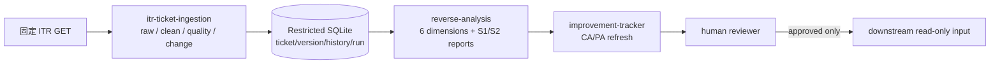
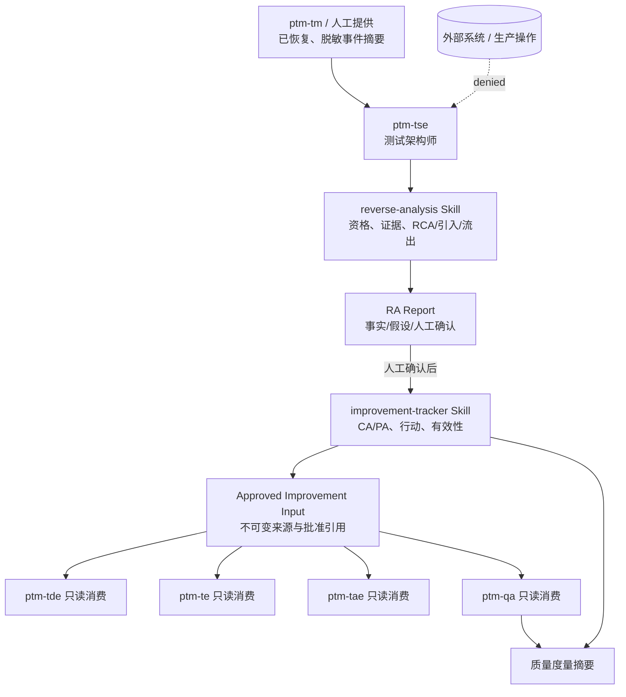
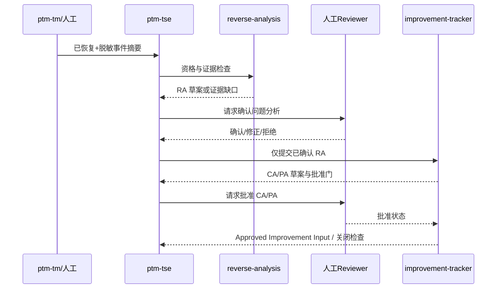

# 高层设计（HLD）：ptm-tse 现网问题逆向分析能力

> CP3 已于 2026-07-16 通过（四边界模型 + 7 项可信治理契约）。Story 拆解与实现已获授权。

## 修订记录

| 版本 | 日期 | 修订人 | 变更要点 |
|---|---|---|---|
| 1.0 | 2026-07-15 | host-orchestrator（用户批准的 inline meta-se fallback） | 初始 HLD：架构灰区、候选方案、双 Skill 推荐方案、跨 Agent 契约和 CP3 决策。 |
| 1.2 | 2026-07-16 | host-orchestrator | REV-03 评审整改草案：加入清洗层、SQLite 版本/变更追踪、S1 新增分析、S2 更新分析、六维分析与环比/同比；须经新的 CP2 后再进入 CP3。 |

## REV-03 架构整改（本节优先于 v1.0 冲突表述）

**取代清单**：本节完整取代旧版 §3、§4、§6、§7、§8、§9、§10 的存储选择、§11、§12 的安全/可靠性条目、§13、§14 中与“无外部读取/三模块/四 Story”冲突的表述。旧版只保留 v1.0 审计追溯，不得作为 CP3/Story 输入。

### S1 / S2 统一数据链路

```text
S1：受控摄取 → 原始快照 → 清洗/质量标记 → SQLite 版本化记录 → 六维分析 → 报告/CA-PA 候选 → 人工审批
S2：增量摄取 → 清洗/质量标记 → 变更检测/冲突处理 → SQLite 合并+历史 → 增量重算/环比同比 → 更新报告/措施复核 → 人工审批
```

### 推荐边界与数据模型

| 边界 | 职责 | 输入 | 输出 | 禁止行为 |
|---|---|---|---|---|
| `itr-ticket-ingestion` Skill | 固定 ITR GET、原始快照、字段映射、清洗、质量标记、变更检测与合并 | allowlist 请求、旧版本 | cleaned record、batch、change set | 凭据/写入/分析结论 |
| SQLite 数据 owner | `ticket`、`ticket_version`、`ingestion_batch`、`change_history`、`analysis_run`、`measure_link` 的单写 | cleaned record/change set | 版本化查询与时间窗口数据集 | 覆盖历史/写 Git/process |
| `reverse-analysis` Skill | 六维分析与逐单/批量报告 | 版本化数据集 | facts/hypotheses、指标、差异报告 | 确认根因或修改措施状态 |
| `improvement-tracker` Skill | CA/PA 候选、受影响措施提示、人工审批状态 | 分析报告/change set | 待批准措施/Approved Input | 自动分发、建任务或关闭 |

`ticket` 至少含 `source_ticket_id`、`first_seen_at`、`last_seen_at`、`source_updated_at`、`quality_flag`；`ticket_version` 和 `change_history` 保存 `previous_status`、字段差异和批次引用。去重键为 `source_ticket_id`；无该键或同键冲突进入人工处理队列，不自动合并。

### 分析方法建议

| 维度 | 方法 | ITR/模型输入 | 输出 |
|---|---|---|---|
| 根因 | 事实/假设分离 + 5 Whys/鱼骨候选 + reviewer 确认 | `root_cause`、时间/责任字段、证据引用 | 根因可信度、证据缺口 |
| 产品质量 | 按产品/模块/严重度/状态聚合的数量、占比、Pareto 与趋势；有可信分母后才启用缺陷密度 | `product`、`module`、`severity`、`status` | Top 风险模块/质量趋势 |
| 流出 | 控制层逃逸矩阵 | 测试/发布/监控相关字段和人工补充 | escape point、最近拦截点 |
| 漏测 | PPDCS/覆盖盲区归类 | `test_missed_analysis`、`test_missed_phase` | 漏测模式、建议测试设计方法 |
| 改进 | CAPA：纠正/预防、Owner、验收、有效性 | `improvement_measures`、分析结论 | 待批准 CA/PA、措施影响范围 |
| 环比/同比 | 完整月份/季度窗口的同口径聚合 | `openeddate`、`resolveddate`、版本化状态 | 基数、绝对变化、变化率、N/A/可信度 |

增量分析默认只重算受变更影响的单问题单与受影响聚合窗口；当映射规则、分析规则或时间口径版本变化时，升级为全量重算并保留 `analysis_run` 版本。措施刷新只产生“保持/完成/需复核/失效”提示，人工 reviewer 是唯一状态变更者。

### 追溯、模拟、架构图与风险（替代旧 §6–§14）

| UC / 模拟 | 路径 | 成功输出 | 失败/回退 |
|---|---|---|---|
| UC-RA-07 / SIM-S1 | ingestion → raw → clean/quality → SQLite → six-dimension analysis → tracker | 首次报告、CA/PA 草案 | schema/quality 失败不合并、不产出结论 |
| UC-RA-08 / SIM-S2 | incremental ingestion → change set → version/history → affected recompute → comparison → tracker refresh | 新增/变更列表、环比同比、措施复核提示 | 无稳定 ID/冲突不合并；窗口不足 N/A |
| UC-RA-02/03 | SQLite dataset → reverse-analysis → reviewer | 事实/假设、根因/流出草案 | 证据不足保持草案 |
| UC-RA-04/05 | analysis/change set → improvement-tracker → reviewer | 已批准输入、有效性闭环 | 未批准不分发/不关闭 |



| 模块 | 单写职责 | 关键输出 | 禁止 |
|---|---|---|---|
| `itr-ticket-ingestion` | raw snapshot、字段映射、quality flag、change set | cleaned record | 凭据/写入/分析结论 |
| SQLite data owner | ticket、ticket_version、change_history、analysis_run | 版本化时间窗口数据集 | 覆盖历史/Git/process 写入 |
| `reverse-analysis` | 六维聚合、逐单/批量/差异报告 | facts/hypotheses、指标、报告草案 | 确认根因/审批措施 |
| `improvement-tracker` | CA/PA 候选和受影响措施提示 | draft/review-needed | 自动分发/关闭 |

| 风险 / ADR | 应对 / 决定 |
|---|---|
| schema drift、网络失败 | batch fail，保留历史，不产生报告；schema version fixture |
| 变更检测冲突 | `source_ticket_id`、版本/字段差异、人工冲突队列；无稳定 ID 禁止合并 |
| 不可比窗口 | 完整同口径窗口、基数/可信度/N-A 原因；规则变更全量重算 |
| ADR-RA-05 | SQLite 为唯一规范化/历史数据 owner；raw 不进 Git/process |
| ADR-RA-06 | 四边界模型；S2 的 change detection/merge 属于 ingestion，分析只消费版本化数据集 |

### 可信分析治理约束（CP3 阻断）

| 契约 | HLD 约束 | 失败行为 | LLD 展开 |
|---|---|---|---|
| `IngestionQualityReport` | 每个 batch 记录输入/输出、空值/异常/重复/冲突、映射版本、quality 状态和可分析比例 | `blocked`，不得创建可信分析 | 阈值、枚举、渲染 schema |
| `AnalysisRunManifest` | 报告绑定 batch/version、映射/规则版本、窗口、重算模式和报告引用 | 不可复现则不发布 | SQLite/JSON schema |
| `MetricDefinition` | 指标定义分子、分母、过滤、窗口、截至日、口径版本和 N/A 条件 | 无可信分母降级为数量/占比/Pareto/趋势，不称缺陷密度 | chart data/计算表达式 |
| 根因四层 | `raw_statement → AI candidate → evidence-backed → reviewer-confirmed`，不可自动跃迁 | 无证据/审核停留候选 | 5-Whys/鱼骨提示词、阈值 |
| 流出控制证据 | candidate/confirmed escape layer 分离；确认必须有关联控制证据 | 无证据仅报告候选 | 控制矩阵字段 |
| `MeasureBaseline` | 刷新关联措施版本、范围、审批/实施/有效性证据和观察窗 | 无基线=`needs-baseline`，不判失效 | 状态迁移/提示规则 |
| 敏感字段策略 | raw/cleaned/report 分类、最小化、脱敏/剔除和审查；raw 不进 Git/process | 未分类字段不进 LLM/正文 | 分类词典、掩码算法 |

上述对象、失败语义、唯一数据 owner 和禁止结论是 HLD 固定契约；字段级枚举、清洗阈值、图表 schema、算法参数、PPDCS 映射和评分权重必须在 LLD 版本化，并由每个 `analysis_run` 引用版本。

## 1. 问题定义

### 问题陈述

`ptm-tse` 当前只有测试架构师角色定义，无法把已恢复现网问题中的证据、根因、引入点、流出控制失效和改进动作持续地转化为测试/质量改进。单纯 RCA 或 postmortem 不足以保证 CA/PA 被批准、验证和跟踪，且若缺少授权边界，AI 建议容易被误解为可执行的生产修复。

### 核心价值

在不连接生产系统且不替代人工判断的前提下，将每个合格 P1/P2 事件变为可审计的 `RA Report` 与已批准改进输入，使同类问题能被更早、更低成本地拦截。

### 目标与成功标准

| 优先级 | 目标 | 度量方式 |
|---|---|---|
| P0 | 对合格 P1 恢复事件形成安全、证据化的 RA 报告 | P1 分析覆盖率 100%；任何报告均能区分事实、假设和人工确认 |
| P0 | 防止未经批准建议流入下游或生产 | fixture 中 100% 拒绝 credential/runtime/production 写入请求；未批准 CA/PA 分发数为 0 |
| P1 | 建立改进闭环 | 72h 启动 ≥90%；已批准改进的有效性完成率 ≥80% |

- [ ] CP7 fixture/dry-run 证明 3 线阈值、批准状态和关闭规则都不可绕过。
- [ ] CP7 验证中不存在将 fixture-only 或文件化能力表述为 runtime-ready 的事实差异。

### 约束、非目标与假设

| 类型 | 约束内容 |
|---|---|
| 技术 | 只使用 Agent、Skill 和文件化工件；首版不依赖外部 API 或常驻服务。 |
| 安全 | deny-by-default：无凭据、无外部读取、无生产写入、无自动缓解或修复。 |
| 治理 | 人工 reviewer 是事实确认、CA/PA 批准、分发和关闭的唯一授权方。 |
| 验证 | 使用 static、fixture、dry-run、人工审查；30 天观察仅作为人工业务证据。 |

**非目标**：实时事件响应、TAC/工单/设备集成、内部问题分析、通知渠道、自动消费/修改下游 Agent 产物。

**关键假设**：`ptm-tm` 或人工可以提供脱敏摘要；下游先以“文件化已批准输入”而不是 API/写入来消费改进；未来 runtime 能力必须由独立 CR 授权。

**缺失信息**：无 BLOCKING 缺失；CP3 必须确认 Skill 切分、交接对象和首版自动化等级。

## 2. 架构灰区与方案形成记录

**CP3 讨论日志**：`process/discussions/CP3-HLD-DISCUSSION-LOG-CR030.md`
**CP3 讨论恢复点**：`process/checks/CP3-DISCUSSION-CHECKPOINT-CR030.json`

| 灰区 ID | 关键问题 | 为什么会影响架构 | 影响面 | 推荐讨论顺序 | canonical refs | 状态 |
|---|---|---|---|---|---|---|
| AGA-RA-01 | 分析和跟踪是否分离？ | 决定 Skill 单一职责、数据 owner 和 Story 并行度 | 模块、数据、验证 | 1 | REQ-007..009；ST-RA-03/04 | pending CP3 |
| AGA-RA-02 | 改进输入是文件契约还是直接操作下游？ | 决定调用方向、权限与单写规则 | 模块、安全、文档 | 2 | REQ-008、011；SCN-RA-04 | pending CP3 |
| AGA-RA-03 | 首版自动化到什么等级？ | 决定能否引入运行时/通知/外部依赖 | 安全、验证、交付 | 3 | SGA-RA-03；REQ-010/011 | pending CP3 |
| AGA-RA-04 | 长观察期如何验证？ | 决定真实业务观察与自动化证据的关系 | 验证、度量、维护 | 4 | REQ-009/013；SCN-RA-05 | pending CP3 |

### Advisor Table（inline 审视；未伪造子 Agent 观点）

| Option | Pros | Cons | Impact Surface | Recommendation | Assumptions / When to switch |
|---|---|---|---|---|---|
| A. 两个 Skill + 文件化批准输入 | 分离分析/状态职责；最小授权；可独立 fixture；下游单向消费 | 文件数量更多；需定义 schema | Agent、Skill、数据、测试、文档 | **推荐** | 适用于当前无 runtime、需强审计；若仅剩 2 个强耦合 Story 可改为单 Skill |
| B. 单一大 Skill | 初版文件少、调用简单 | 分析/批准/跟踪耦合；难验证权限和状态边界 | Skill、数据、维护 | 条件备选 | 仅当 CP5 证实跟踪无独立状态/接口时采用 |
| C. 外部工单/API 编排 | 自动化和通知效率高 | 需要凭据、数据分类、运行授权和运行时验证 | 安全、平台、发布 | 不推荐本期 | 仅在独立 runtime/security CR 通过后评估 |

| 类型 | 来源 | 影响的 HLD 章节 | 处理结果 | 说明 |
|---|---|---|---|---|
| 方案形成输入 | 产品：CP2 范围；架构：单写/契约；质量：fixture/观察窗；文档：可审计 | §3–§12 | adopted | 由 host inline 形成，用户禁止子 Agent，CP3 仍需用户决策。 |
| HLD 后评审意见 | CP3 review | 全文 | pending | 不倒填为前置讨论。 |

### Deferred Architecture Ideas

| ID | 想法 / 风险 / 扩展方向 | 来源 | 延后原因 | 触发切换或重启条件 |
|---|---|---|---|---|
| DAI-RA-01 | 外部证据/工单 adapter | AGA-RA-02 | 未授权凭据与 runtime | 独立 runtime/security CR approved |
| DAI-RA-02 | 通知与自动提醒 | AGA-RA-03 | 未授权调度/外部写入 | 5 个 RA 闭环样本 + runtime CR |

## 3. 候选架构方案对比

> ⚠️ 本节的方案 A/B、比较矩阵和推荐结论已被 REV-03 四边界模型取代，仅保留 v1.0 审计追溯。

### 方案 A：审批门控的双 Skill 文件工作流（推荐）

`ptm-tse` 接收已脱敏输入，调用 `reverse-analysis` 形成 RA 草案；人工确认后，调用 `improvement-tracker` 管理 CA/PA、已批准改进输入和关闭条件。下游 Agent 只读取 Approved Improvement Input，不被直接调用或修改。

| 维度 | 评估 |
|---|---|
| 优点 | 明确 owner/状态；批准前不能分发；无 runtime 依赖；可按规则独立验证。 |
| 缺点 | 需要维护报告、输入和跟踪三类文件契约。 |
| 复杂度 | standard |
| 实施成本 | 中等，预计 4 个强耦合 Story。 |
| 可扩展性 | 未来可新增只读 adapter 或通知 adapter，但需独立授权。 |
| 风险 | 契约设计不当会导致下游不消费或文件冗余。 |
| 适用前提 | 人工 reviewer 可用；下游可先做只读文件化消费。 |

### 方案 B：单一全流程 Skill

一个 Skill 从资格检查到关闭全部执行。

| 维度 | 评估 |
|---|---|
| 优点 | 初期目录少，触发词与调用链短。 |
| 缺点 | 报告结论、行动状态和消费者边界混在一起；违反时难定位。 |
| 复杂度 | medium |
| 实施成本 | 低到中等。 |
| 可扩展性 | 低；后续拆分需要迁移状态/模板。 |
| 风险 | 容易把建议、批准和执行混淆。 |
| 适用前提 | 跟踪只是报告内附录、无独立消费者和无独立状态。 |

### 方案对比矩阵

| 维度 | 方案 A | 方案 B |
|---|---|---|
| 人工审批可见性 | 高 | 中 |
| 数据 owner 清晰度 | 高 | 低 |
| 禁止能力验证 | 高 | 中 |
| 首版文件数 | 中 | 高（更少） |
| 下游演进能力 | 高 | 低 |
| 当前约束适配 | ✅ | ⚠️ |

**推荐方案**：方案 A。它以少量文件化契约换取可审计状态和安全边界，符合 CP2 已确认的“无外部系统、人工确认、文件化交接”范围。

## 4. 推荐方案总览

> ⚠️ 本节的“双 Skill / 4 Story / 无外部读取”表述已被 REV-03 取代，仅保留 v1.0 审计追溯。

**复杂度模式**：`standard`。

| 判定维度 | 依据 | 结论 |
|---|---|---|
| 需求规模 | 13 条需求、7 个场景 | 需要结构化设计 |
| 角色数量 | 3 persona、5 个 Agent 边界 | 存在跨 Agent 契约 |
| 状态流转 | RA、Proposal、Action 三个状态机 | 需要显式 owner |
| 平台适配 | Codex / Claude Code / Qoder | 只使用文件协议，避免平台专属 runtime |
| Story 拆解 | 4 个强耦合 Story | CP3 后必须拆分，但不需要拆分 HLD |

**系统核心思路**：将“建议”与“批准后的改进输入”分成不同对象。AI 负责整理、映射和起草，人工 reviewer 写入确认状态；没有确认状态，数据不能跨 Feature/Agent 流动。所有外部/运行时需求一律拒绝并转独立授权 CR。

**核心边界**：做资格/证据、分析、CA/PA、批准输入、跟踪；不做采集、修复、下游写入、通知、内部问题。

**HLD 拆分检查**：不拆分。尽管有两个 Skill，二者共享 RA/Approval 状态模型、同一安全 ADR、同一 4 Story 发布切片且必须同 Wave 验证；当前不满足独立交付反信号。

## 5. 适用性矩阵

| 适用性维度 | 当前项目判断 | 推荐方案如何适配 | 不适配信号 | When to switch |
|---|---|---|---|---|
| 用户目标 | 需要把问题转为预防闭环，不是做运维自动化 | 文件化报告/输入建立可审计桥梁 | 用户要求实时处置 | 新建 runtime HLD/CR |
| 项目成熟度 | 多 Agent 基线不齐，ptm-tse planned | 先以弱耦合契约接入 | 所有下游已有稳定 API | 评估 adapter |
| 认知负担 | reviewer 需理解结论与状态 | 双 Skill 清晰区分“分析”和“跟踪” | 文件过多导致操作错误 | CP5 可合并为单 Skill |
| 验证条件 | 当前无生产环境授权 | fixture/dry-run 覆盖规则，人工记录观察窗 | 需要真实数据证明 | 启动受控 runtime CR |
| 回退成本 | 新能力未实现，无存量数据 | 删除/停用新 Skill，不影响现有 Agent | 已有 RA 历史需保留 | 版本化模板迁移 |

| 方案选择 | 优化了什么 | 牺牲了什么 | 接受理由 | 切换条件 |
|---|---|---|---|---|
| 双 Skill + 文件契约 | 安全、审计、测试边界、下游演进 | 更多模板和文件 | 当前风险与治理要求高于文件数量成本 | 5 份样本后评估自动化或合并 |

## 6. Use Case → Architecture Traceability

> ⚠️ 本节已被 REV-03 的 UC-RA-07/08 追溯表取代，仅保留 v1.0 审计追溯。

| Use Case | 支撑模块 / 组件 | 关键流程 | 异常 / 失败路径 | 验证方式 |
|---|---|---|---|---|
| UC-RA-01/02/06 | ptm-tse + reverse-analysis | eligibility → evidence assessment → RA draft | insufficient / forbidden → no conclusion | SCN-RA-01/02/06/07 fixture |
| UC-RA-03 | reverse-analysis + reviewer state | fact/hypothesis → RCA/introduction/escape → confirm | missing approval → draft | SCN-RA-03 manual fixture |
| UC-RA-04 | improvement-tracker + Approved Input | proposal → approval → immutable input | unapproved / consumer unavailable | SCN-RA-04 contract fixture |
| UC-RA-05 | improvement-tracker | action → effectiveness → close gate | missing condition → open | SCN-RA-05 boundary fixture |

## 7. 关键场景模拟

> ⚠️ 本节已被 REV-03 的 S1/S2/窗口模拟取代，仅保留 v1.0 审计追溯。

| 模拟 ID | 场景 | 推荐架构执行路径 | 预期输出 | 失败 / 回退路径 | 结果 |
|---|---|---|---|---|---|
| SIM-RA-01 | P1 已恢复、三条证据线 | ptm-tse → reverse-analysis → RA draft → reviewer | confirmed analysis 或 evidence gap | 无三线则保持 draft | PASS |
| SIM-RA-02 | CA/PA 待批准 | reviewer → improvement-tracker gate | 未批准不能创建 input | 返回 approval missing | PASS |
| SIM-RA-03 | 请求生产修复 | reverse-analysis authorization guard | refusal record + runtime CR 建议 | 不调用任何工具 | PASS |

## 8. 系统架构图

> ⚠️ 本图已被 REV-03 的 ITR → ingestion → SQLite → analysis → tracker 架构图取代。



## 9. 高层模块与职责划分

> ⚠️ 本表已被 REV-03 四边界模块表取代，仅保留 v1.0 审计追溯。

| 模块名称 | 类型 | 职责 | 输入 | 输出 | 依赖 |
|---|---|---|---|---|---|
| `ptm-tse` | Agent | 编排、提出澄清、呈现草案、等待人工确认 | 脱敏摘要、RA 状态 | 报告/输入引用 | 两个 Skill |
| `reverse-analysis` | Skill | 资格、证据、问题分析与报告草案 | 事件摘要、证据索引 | RA Report draft / gap | 文件协议 |
| `improvement-tracker` | Skill | CA/PA、批准输入、行动、有效性与关闭检查 | confirmed RA / reviewer approval | tracker / AII | RA Report |
| 下游消费者 | Agent | 读取已批准输入并决定自身工作 | AII | 自身产物或反馈引用 | 不反写 RA |

## 10. 技术选型与理由

> ⚠️ 本节“Markdown 主存储”表述已被 REV-03 的 SQLite 规范化数据 owner 取代。

| 选型类别 | 选择 | 备选方案 | 选择理由 | 风险 |
|---|---|---|---|---|
| 存储方案 | Markdown + YAML/JSON schema-light 工件 | 数据库 / 外部工单 | 与现有文件系统协议一致，无凭据和服务依赖 | 需要 schema/fixture 防漂移 |
| 平台协议 | Agent/Skill 发现机制 + 文件交接 | MCP/API | 当前跨平台且不授权 runtime | 自动化能力受限 |
| 验证模式 | static + fixture + dry-run + manual review | 真实生产回放 | 不作 runtime-ready 声明 | 需真实观察作后续证据 |
| 命名 | `reverse-analysis` / `improvement-tracker` 为推荐 canonical 名 | `*-skill` 后缀 | 与现有 `skills/<name>/SKILL.md` 目录约定一致 | CP3 应确认以避免蓝图别名残留 |

## 11. 关键流程

> ⚠️ 本时序图已被 REV-03 的 S1/S2 数据链路取代，仅保留 v1.0 审计追溯。



**异常路径**：证据不足、内部问题或越权请求均不进入后续步骤；只产出缺口/拒绝记录。消费者未就绪时 Approved Input 状态为 `blocked`，不自动重试或外部写入。

## 12. 非功能需求设计

| 质量特征 | 设计目标 | 实现手段 | 验证方式 |
|---|---|---|---|
| 安全性 | 0 个未授权外部/生产/凭据路径 | deny-by-default guard、禁止工具声明、批准状态门 | forbidden-request fixture + review |
| 可靠性 | 证据不足不产生确认结论 | 三线阈值、状态机前置条件 | negative fixture |
| 可审计性 | 100% 结论有证据/人工状态 | provenance、revision、approval_ref | report schema review |
| 可维护性 | 每个 Skill 单一职责且输出契约可独立 fixture | 分离 analysis/tracking、版本化模板 | contract tests |
| 可移植性 | Codex/Claude Code/Qoder 使用同一文件语义 | 不依赖运行时 adapter | 平台安装 dry-run |

## 13. 主要风险与应对

> ⚠️ 本表已被 REV-03 的 schema drift、合并冲突和不可比窗口风险表补充并优先适用。

| 风险 ID | 风险描述 | 概率 | 影响 | 应对策略 | 触发信号 |
|---|---|---|---|---|---|
| R-RA-01 | AI 将推测表述为根因 | 中 | 高 | 事实/假设标签、三线阈值、人工确认 | 无 evidence_ref 的 confirmed 结论 |
| R-RA-02 | 建议被当作生产修复 | 中 | 高 | 只产出草案/输入，禁止 runtime，拒绝 fixture | 出现生产命令或凭据请求 |
| R-RA-03 | 下游不消费或重复消费输入 | 中 | 中 | 统一 AII 版本/状态/consumer 字段 | consumer 状态 blocked 或重复来源 |
| R-RA-04 | 30 天观察无法自动验证 | 高 | 中 | 将真实观察与 fixture 分层 | CI 声称已验证真实复发 |

## 14. ADR 候选决策点

> ⚠️ 本表已补充并受 REV-03 ADR-RA-05/06 约束。

| ADR ID | 决策问题 | 建议决定 | 约束此决策的因素 |
|---|---|---|---|
| ADR-RA-01 | Skill 是否分离 | 双 Skill | 单写、审计、状态和验证边界 |
| ADR-RA-02 | 改进交接形态 | 文件化 AII | 无 runtime/credential、跨平台 |
| ADR-RA-03 | 自动化等级 | Level 1–2 | 人工判断和安全边界 |
| ADR-RA-04 | 长观察验证 | 人工观察 + fixture | 无真实环境授权 |

## 15. Gotchas

- 不要把“恢复后分析”误实现为实时事故响应；恢复、缓解和生产操作不属于本 Agent/Skill。
- 不要把 AI 推测、供应商建议或相似案例写成根因；只有 evidence ref 与人工确认能使结论进入 confirmed。
- 不要把 CA/PA 草案直接写入下游 Agent 文件或当作已执行任务；只有 Approved Improvement Input 可跨 Agent 流动。
- 不要以 CI fixture 代替 30 天真实观察；fixture 只能验证关闭规则，真实有效性必须保留人工业务证据。
- 不要因为“只读”而绕过授权；外部日志、工单和知识库读取仍需要独立 security/runtime CR。
