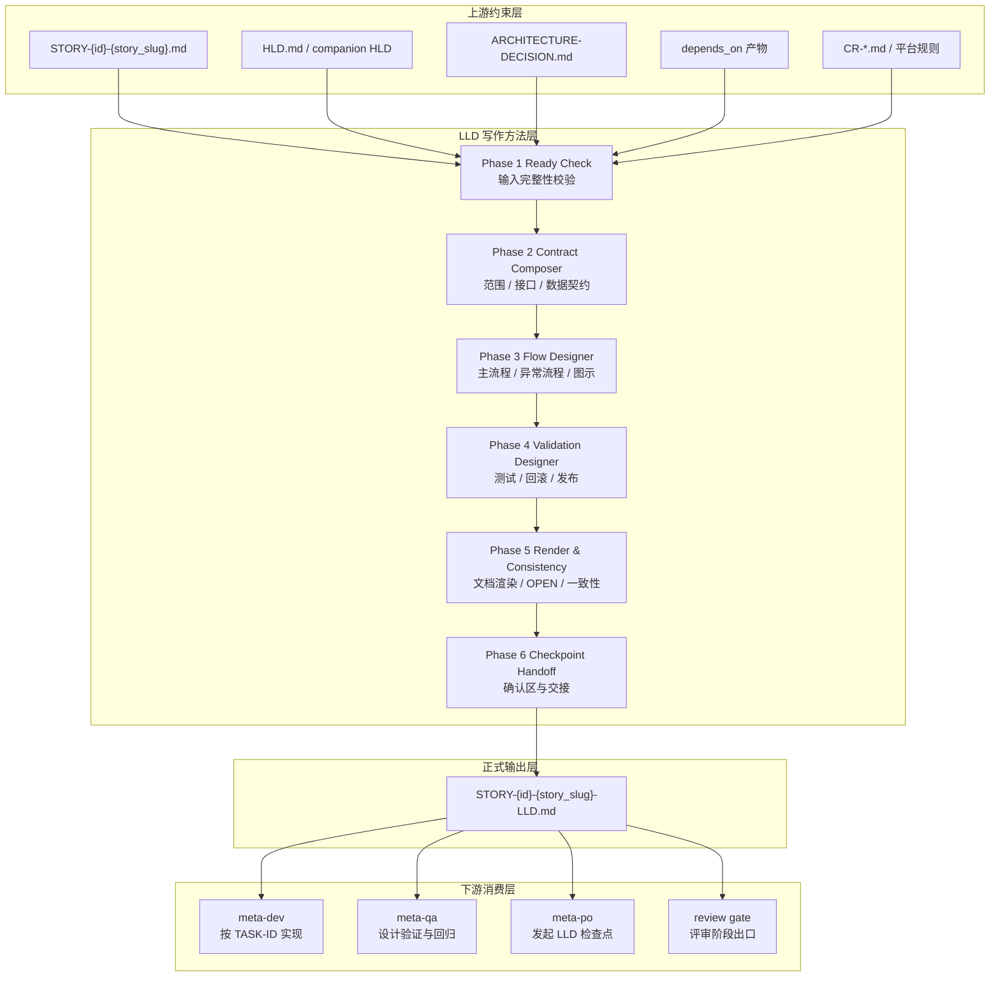
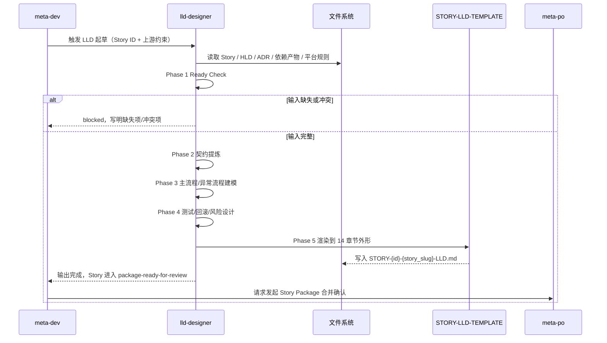

# 高层设计（HLD）：Story LLD 写作方法

> 本 HLD 是一个**专题 HLD**，聚焦 meta 项目的 Story 级 LLD 写作方法本身，而不是某个单一 Skill 的业务能力。
> 当前仓库缺少已确认的 `process/REQUIREMENTS.md`、`process/USE-CASES.md`、`process/REQUEST.md`，因此本文基于 `process/ANALYSIS-meta-flow-lld-writing.md`、现有 `lld-designer` / `meta-dev` 协议和 `STORY-LLD-TEMPLATE.md` 输出。

## 修订记录

| 版本 | 日期 | 修订人 | 关键变更 |
|------|------|--------|---------|
| 1.0 | 2026-04-23 | meta-se | 初稿：基于 LLD 写作专题分析，判定采用独立 HLD；补齐输入/输出契约、阶段处理流程、图示要求、失败路径、ADR 候选与落地建议 |
| 1.1 | 2026-04-23 | meta-se | 评审回应：①修复 §4/§5/§7.1 方法步骤数量不一致（补齐 Checkpoint Handoff 模块）；②新增 §3.4 "LLD 章节级输入/输出契约表"，把"明确的输入输出"下沉到每个 LLD 章节；③§7.1 阶段表补入原子步骤与检查项；④新增 §7.5 "图示类型选择指引"，明确时序图/流程图/状态图/结构图的使用场景；⑤§7.2 理论依据补入 `spec-driven-workflow-v1.instructions.md`；⑥§11 与 §12 的阶段-Story 对应关系显式化；⑦§13 追加本轮评审遗留问题 Q4–Q6 |
| 1.2 | 2026-04-23 | meta-se | 方法完备性增强：①新增 §3.5 "共享设计片段与 Story 类型"，引入 `process/shared/` 承载跨 Story 的数据模型/接口/协议，避免在多份 LLD 中漂移；②新增 Story 类型 `design-only`，允许设计性 Story 独立走 LLD 检查点；③新增 §3.6 "LLD 复杂度分级（Tier-S/M/L）"，按文件影响数/模块数/跨 Story 接口量化，Tier-S 允许章节合并；④§7.4 增加"HLD 反向修订触发规则"——同一 OPEN 问题出现在 ≥2 份 LLD 时自动升级为 HLD 级 CR；⑤新增 ADR-6/ADR-7/ADR-8；⑥新增遗留问题 Q7（Wave 级 LLD 契约对齐机制，留待 phase-2） |
| 1.3 | 2026-05-15 | meta-po | CR-004：将 Story 计划确认与 LLD 确认合并为 Story Package 确认；meta-dev 先为当前 Wave 产出 LLD 包，确认通过后复用同一子 agent 实现 |

---

## 1. 问题定义

### 问题陈述

当前 meta 项目的 LLD 设计已经建立了**“Story 先出 LLD，再实现”**的门禁，但“LLD 应该怎么写”仍存在 4 个结构性缺口：

1. **章节存在，契约不足**：`lld-designer` 和 `STORY-LLD-TEMPLATE.md` 已列出 14 个章节，但尚未把**必需输入、必需输出、各章节对下游的消费语义**定义成统一契约。
2. **主流程存在，异常流程不足**：现有规则强调“先写 LLD 再实现”，但没有把**输入缺失、边界不清、技术未定、图示是否必需**这些失败路径显式化。
3. **开发可写，验证难消费**：当前模板能指导 meta-dev 编码，但对 meta-qa、review gate、人工确认者来说，**测试入口、异常路径、Spike 升级项、回滚条件**还不够结构化。
4. **设计对象混层**：若把“LLD 写作方法”直接并入现有 `process/HLD.md` 或 `process/HLD-review-gate.md`，会把**use-case 发现、评审门禁、Story 级详细设计方法**三类不同对象混在一起，评审边界会变得模糊。

### 核心价值

为 meta 工作流建立一套**可机读、可评审、可交接、可直接指导实现与验证**的 LLD 写作方法，使 `STORY-*-LLD.md` 从“章节清单”升级为“带显式契约的设计对象”。

### 目标

| 优先级 | 目标 | 度量方式 |
|--------|------|---------|
| P0 | 明确 Story LLD 的输入契约 | 每份 LLD 生成前都完成 1 份输入清单校验；必读输入覆盖 Story、HLD/ADR、依赖产物、平台约束四类对象 |
| P0 | 明确 Story LLD 的输出契约 | 每份 LLD 至少向 4 类消费方交付可读信息：meta-dev、meta-qa、meta-po、review gate |
| P0 | 把写作流程固化为阶段化管道 | 主流程固定为 6 个阶段；每阶段都有输入、输出、失败行为 |
| P1 | 明确何时必须补图 | 满足“跨 3 个以上模块 / 存在异步或补偿路径 / 错误分支不可一眼看清”任一条件时，LLD 必须至少包含 1 张 Mermaid 图 |
| P1 | 明确未决问题升级机制 | 每份 LLD 中无法拍板的技术问题都必须标注为 `OPEN`，并给出 Spike 或人工决策去向 |
| P2 | 降低模板漂移 | `lld-designer`、`meta-dev`、`STORY-LLD-TEMPLATE.md` 对 LLD 章节和语义的描述保持 100% 一致 |

### 成功标准

- [ ] 每份 `STORY-*-LLD.md` 都能从文档内直接识别出 6 类输入来源：Story、HLD、ADR/架构约束、依赖 Story、平台规范、变更单/遗留约束
- [ ] 每份 `STORY-*-LLD.md` 都包含 4 类下游消费信息：实现入口、验证入口、人工确认点、回滚/发布边界
- [ ] LLD 写作主流程固定为 6 个阶段，且每个阶段都有显式失败路径（终止 / 回退 / 升级为 Spike / 请求人工确认）
- [ ] 当 Story 涉及 3 个以上模块、异步链路或显著异常路径时，LLD 必须包含至少 1 张 Mermaid 时序图或流程图
- [ ] `OPEN` 状态的问题不得以“默认先这样”隐式留在正文；必须写明处理动作（继续确认 / Spike / CR）
- [ ] 推荐方案不改变“14 章节外形”这一既有交付界面，避免在未确认前破坏下游兼容性

### 约束

| 类型 | 约束内容 |
|------|---------|
| 协议 | `STORY-{id}-{story_slug}-LLD.md confirmed=true` 前不得开始实现 |
| 工程 | 不引入新的通用 planner 或新的设计对象类型，优先在现有 `lld-designer` / `meta-dev` / 模板体系内增强 |
| 输出 | LLD 仍然以 Markdown + frontmatter 为主载体，图示统一采用 Mermaid |
| 治理 | 人工确认仍由 meta-po 发起；本 HLD 不替代 review gate 或人工检查点 |
| 兼容 | 优先保留现有 14 章节外形，只增强每章的语义要求与阶段流转 |
| 方法 | 设计必须显式区分“已决设计”“待决问题”“需要 Spike 的问题”，禁止伪确定性表述 |
| 输入现实 | 当前缺少正式 REQUIREMENTS / USE-CASES / REQUEST，本 HLD 只能作为“LLD 写作方法专题设计”，后续若上游正式输入补齐，可再做一轮对齐 |

### 非目标（Out of Scope）

- 重做 `use-case-discovery` 的问题定义与治理字段设计 → 属于 `process/HLD.md`
- 设计阶段出口并行评审门禁本身 → 属于 `process/HLD-review-gate.md`
- 直接实现 `lld-designer`、`meta-dev`、模板或静态校验器代码
- 为每一个具体 Story 编写具体 LLD 内容
- 把 LLD 降级为纯任务清单或纯 ADR 文档

### 关键假设

- `meta-dev` 仍是 Story LLD 的唯一生产者，`lld-designer` 仍是生成 LLD 的唯一正式 Skill
- `process/HLD.md` 与 `process/ARCHITECTURE-DECISION.md` 在进入 Story 执行时可作为上游约束存在
- `meta-qa`、review gate 与人工确认者都需要直接消费 `STORY-*-LLD.md`，而不是依赖 meta-dev 口头转述
- 当前最佳优化方向是**补强契约与流程**，而不是先改成全新的章节体系

### 缺失信息

| 优先级 | 缺失信息 | 影响范围 | 当前默认值 |
|--------|---------|---------|-----------|
| REQUIRED | `process/ARCHITECTURE-DECISION.md` 在哪些 Story 中可视为必需输入、哪些可为空 | 影响输入校验策略 | **默认：若 Story 涉及跨模块接口、平台协议或关键取舍，则 ADR 必读；否则可显式写“无新增 ADR 约束”** |
| REQUIRED | 是否需要为“简单 Story”设置免图阈值 | 影响模板长度与写作成本 | **默认：简单 Story 可无图，但一旦命中图示触发条件就必须补图** |
| OPTIONAL | 是否需要把 `DEV-LOG.md` 摘要作为 LLD 的伴随输出 | 影响交接格式 | **默认：交接摘要由 meta-dev 在实现环节写入，不放进 LLD 方法主契约** |

---

## 2. 候选架构方案对比

### 方案 A：并入现有 HLD

**核心思路**：把“LLD 写作方法”作为新章节合并进当前 `process/HLD.md` 或 `process/HLD-review-gate.md`。

| 维度 | 评估 |
|------|------|
| 优点 | 文档数量少；短期看起来集中 |
| 缺点 | 同时混入 use-case 发现、评审门禁、LLD 写作方法 3 类对象；职责跨层；评审人群和 ADR 集合不一致 |
| 复杂度 | low |
| 实施成本 | 低 |
| 可扩展性 | 低；后续改 LLD 方法时会污染无关 HLD |
| 风险 | 违反 HLD 拆分原则中的“核心产物 > 1”“职责跨层”信号 |
| 适用前提 | 只有在仓库尚未存在任何 HLD，且 LLD 方法只是配套附录时才勉强成立 |

### 方案 B：独立 HLD + 模板兼容增强（推荐）

**核心思路**：把“Story LLD 写作方法”定义为独立设计对象，单独成文；保留现有 14 章节外形，但为其补上输入/输出契约、阶段流程、图示规则和失败路径。

| 维度 | 评估 |
|------|------|
| 优点 | 单一对象、边界清晰；便于单独评审；能直接指导后续 skill/template/agent 修订 |
| 缺点 | 文档数量增加 1 份；需要在相关 HLD 中靠边界说明保持追溯 |
| 复杂度 | standard |
| 实施成本 | 中 |
| 可扩展性 | 高；后续可继续细化为模板整治或静态校验 Story |
| 风险 | 若不控制范围，容易从“写作方法”滑向“具体实现方案” |
| 适用前提 | 当前仓库已经把 HLD、review gate、Story LLD 分成独立对象，且 LLD 方法是跨 `meta-dev / meta-qa / meta-po` 的共享契约 |

### 方案 C：不写 HLD，直接修改 Skill/模板

**核心思路**：跳过高层设计，直接修 `lld-designer`、`meta-dev` 和 `STORY-LLD-TEMPLATE.md`。

| 维度 | 评估 |
|------|------|
| 优点 | 速度最快；感知上最“省事” |
| 缺点 | 缺少方案比较、边界声明、ADR 候选和跨 Agent 契约；后续容易再次漂移 |
| 复杂度 | low |
| 实施成本 | 低 |
| 可扩展性 | 低；更像一次性整改，不像稳定方法 |
| 风险 | 直接进入实现会绕过当前仓库强调的“设计前置”原则 |
| 适用前提 | 只适用于极小修订，不适用于这次跨 Agent 的方法重构 |

### 方案对比矩阵

| 维度 | 方案 A：并入现有 HLD | 方案 B：独立 HLD | 方案 C：直接改模板 |
|------|:---:|:---:|:---:|
| 产物边界清晰度 | ⭐ | ⭐⭐⭐⭐⭐ | ⭐⭐ |
| 评审可分派性 | ⭐ | ⭐⭐⭐⭐⭐ | ⭐⭐ |
| 对现有协议兼容性 | ⭐⭐ | ⭐⭐⭐⭐ | ⭐⭐⭐ |
| 后续 Story 拆解友好度 | ⭐ | ⭐⭐⭐⭐⭐ | ⭐⭐ |
| 短期改动成本 | ⭐⭐⭐⭐ | ⭐⭐⭐ | ⭐⭐⭐⭐⭐ |
| 综合 | 不推荐 | **推荐** | 备选整改路径 |

**推荐方案**：方案 B。理由：LLD 写作方法本身已经是独立设计对象，满足“核心产物 > 1”“职责跨层”“ADR 明显分簇”三个拆分信号，继续并入现有 HLD 只会把边界搞混。

---

## 3. 推荐方案总览

### 3.1 拆分判定结论

| 判定信号 | 观察结果 | 结论 |
|---------|---------|------|
| 核心产物 > 1 | 现有 `process/HLD.md` 聚焦 use-case-discovery；`process/HLD-review-gate.md` 聚焦评审门禁；本次对象聚焦 Story LLD 写作方法 | 必须拆分 |
| 职责跨层 | 写作方法属于产物内部行为；review gate 属于全局治理机制 | 必须拆分 |
| ADR 明显分簇 | “LLD 章节结构/图示阈值/Spike 规则” 与 “并行评审/严重级别聚合” 是两组不同 ADR | 必须拆分 |
| 交付顺序可独立 | 可先确认写作方法，再确认门禁；二者不需要同一轮评审通过 | 倾向拆分 |

**结论**：本次 HLD 应**单独写一篇**，不并入已有 `process/HLD.md` 或 `process/HLD-review-gate.md`。

### 3.2 输入契约

| 输入对象 | 生产者 | 必需性 | 用途 | 缺失行为 |
|---------|--------|-------|------|---------|
| `process/stories/STORY-{id}-{story_slug}.md` | meta-se | 必需 | 定义 Story 范围、验收标准、依赖关系 | 缺失即终止，进入 blocked |
| `process/HLD.md` 或相关 companion HLD | meta-se | 必需 | 提供上游边界、模块职责、架构约束 | 缺失即终止，进入 blocked |
| `process/ARCHITECTURE-DECISION.md` | meta-se | 条件必需 | 提供关键取舍、接口边界、平台规则 | 若 Story 命中关键取舍但 ADR 缺失，则 blocked |
| 前置 Story 产物 / 接口 | 上游 Story | 条件必需 | 约束兼容性、复用路径 | 缺失则写明阻塞依赖，不得假设接口 |
| `process/PLATFORM-INSTALL-SPEC.md` 或平台规则 | meta-se / meta-qa | 条件必需 | 约束安装结构或平台特有路径 | 若涉及平台目录且缺失，则 blocked |
| `process/changes/CR-*.md` | meta-po | 可选 | 约束变更背景与偏差说明 | 若存在必须读取；不得忽略 |
| 现有 `STORY-{id}-{story_slug}-LLD.md` | meta-dev | 更新场景必需 | 用于增量修订、版本递增和问题状态回写 | 更新场景下缺失则视为异常，需重新起草 |

### 3.3 输出契约

| 输出对象 | 主要消费者 | 必须承载的信息 | 交付条件 |
|---------|-----------|---------------|---------|
| `process/stories/STORY-{id}-{story_slug}-LLD.md` | meta-dev / meta-qa / meta-po / review gate | 设计范围、接口/数据契约、主/异常流程、测试设计、实施步骤、发布回滚、待决问题 | 每次 `lld-designer` 成功执行后生成或更新 |
| LLD 中的 TASK-ID 清单 | meta-dev | 原子实施顺序、目标文件、动作、详细描述 | 必须可直接指导编码 |
| LLD 中的验证设计 | meta-qa | 测试入口、边界值、错误路径、最小回归点 | 必须覆盖主流程与异常流程 |
| LLD 中的确认区 | meta-po / 用户 | 当前版本是否允许进入实现 | `confirmed=false` 时只允许评审，不允许实现 |
| LLD 中的 OPEN / Spike 项 | meta-po / meta-se / meta-dev | 仍未拍板的问题、默认处理动作、需要谁决策 | 不得为空转；必须指向下一动作 |

**总原则**：LLD 的唯一正式输出仍是 `STORY-{id}-{story_slug}-LLD.md`，其中 `story_slug` 复用 Story 标题生成的 kebab-case 稳定片段；该文档内部必须显式承载不同消费方需要的信息，而不是依赖 meta-dev 二次解释。

### 3.3.1 Story Package 合并确认契约（CR-004）

| 对象 | 生产者 | 状态 | 说明 |
|------|--------|------|------|
| Story Package 草案 | meta-se | `package-draft` | 包含当前 Wave 的 Story 边界、优先级、依赖、输出文件与 LLD 输入清单 |
| Wave LLD 包 | meta-dev | `package-ready-for-review` | 为当前 Wave 每个 Story 生成 `STORY-*-LLD.md`，但不得开始实现 |
| Story Package 确认 | meta-po / 用户 | `package-approved` 或回退 | 一次性确认 Story 边界、Wave 分组和对应 LLD 设计；确认不通过时回退到 story-planning 或 LLD 包修订 |
| 实现恢复 | meta-dev | `in-development` | Story Package 确认通过后，优先复用产出 LLD 包的同一 meta-dev 子 agent 继续实现 |

该契约替代旧的“Story 计划确认”和逐 Story “LLD 确认”双检查点，但不降低 LLD 门控强度：`STORY-*-LLD.md confirmed=true` 与 Story `status=package-approved` 同时成立后才允许实现。

### 3.4 LLD 章节级输入 / 输出契约

> 本表把"明确的输入输出"从方法层下沉到 LLD 章节层，解决 §3.2/§3.3 只说明方法级契约、不约束每章节产出的问题。
> 每一行说明：该章节消费什么上游对象、必须产出什么结构化内容、下游谁消费。

| 章节 | 必须消费的输入 | 必须产出的输出 | 主要消费方 | 图示是否默认必需 |
|------|---------------|---------------|-----------|----------------|
| 1 Goal | Story 目标、HLD 业务价值 | 单句目标陈述 + 不做事项列表 | meta-po / 人工确认 | 否 |
| 2 Requirements | Story 验收标准、HLD NFR | 结构化需求条目（带 ID） | meta-dev / meta-qa | 否 |
| 3 模块职责 | HLD §5、依赖 Story 接口 | 模块列表 + 输入/输出/依赖 | meta-dev | 跨 ≥3 模块时必需结构图 |
| 4 文件影响范围 | 现有仓库结构 | 新增/修改/删除文件的三列清单 | meta-dev / review gate | 否 |
| 5 数据模型 | HLD 数据约束 / ADR 数据决策 | 字段表（类型、约束、默认、变更动作） | meta-dev / meta-qa | 涉及状态机时必需状态图 |
| 6 API / Interface | HLD 接口边界、依赖 Story 接口 | 方法签名 + 入参 + 出参 + 错误码 | meta-dev / meta-qa | 跨服务调用时必需时序图 |
| 7 核心处理流程 | §6 接口 + §5 数据模型 | 主流程 + 异常流程 + 补偿路径文字 | meta-dev / meta-qa | **命中 §7.5 阈值必需** |
| 8 技术设计细节 | ADR、技术选型约束 | 关键取舍说明 + 引用 ADR-ID | meta-se / meta-dev | 否 |
| 9 安全与性能 | HLD NFR、平台约束 | 威胁项 + 性能目标 + 应对 | meta-qa | 否 |
| 10 测试设计 | §7 异常流程、验收标准 | 测试入口 + 边界值 + 错误路径 + 最小回归集 | meta-qa | 否 |
| 11 实施步骤 | §4 文件范围、§6 接口 | TASK-ID 列表（动作 + 目标文件 + 验证条目） | meta-dev | 否 |
| 12 风险 / 难点 | 依赖、技术未定点 | 风险表（概率/影响/应对/触发信号） | meta-po / meta-dev | 否 |
| 13 回滚与发布 | 平台规则、部署边界 | 回滚条件 + 开关 + 兼容策略 | meta-qa / meta-po | 否 |
| 14 DoD + 确认区 | §10 测试设计、§13 回滚 | 完成标准清单 + 人工确认区块 | meta-po / 用户 | 否 |

**强约束**：
- 第 6 行 `API/Interface` 输出**必须**在第 10 行 `测试设计` 中找到对应测试入口（契约-验证配对规则，回应评审规则 3）。
- 第 7 行 `核心处理流程` 的每条异常分支**必须**在第 10 行有对应错误路径测试（主/异常路径配对规则）。
- 第 11 行 TASK-ID **必须**覆盖第 4 行列出的全部文件影响，且每个 TASK 至少对应一条 §10 验证条目。

### 3.5 共享设计片段与 Story 类型

> 解决"横切对象（数据模型/共享接口/事件协议）在多份 LLD 中漂移"问题。

**3.5.1 共享设计片段（Shared Design Fragment）**

- **位置**：`process/shared/` 目录，命名如 `DATA-MODEL-{domain}.md`、`CONTRACT-{name}.md`、`PROTOCOL-{name}.md`
- **产出方**：由 meta-se 在 Story 拆解阶段识别横切对象后预先产出；或通过 `design-only` Story 由 meta-dev 产出
- **消费方**：相关 Story 的 LLD **以引用方式**使用，不得复制
- **变更规则**：共享片段变更走 `CR-*.md` 流程，变更会同时影响其引用的所有 Story LLD，需重新触发对应 LLD 检查点

**3.5.2 LLD 引用共享片段的契约**

LLD 中若引用共享片段，**必须**：
1. 在 §6 API/Interface 或 §5 数据模型中明确写出 `引用：process/shared/{file}#{section}` 的路径
2. 若本 Story 对共享片段有**差异化使用**（扩展/子集/约束），需在"差异说明"子节显式列出
3. 不得**重新描述**共享片段的同名对象（避免漂移）；发现描述不一致即视为一致性缺陷

**3.5.3 Story 类型扩展**

| Story 类型 | 产物 | 是否走 LLD 检查点 | 是否包含实现任务 |
|-----------|------|----------------|----------------|
| `feature`（默认） | `STORY-{id}-{story_slug}-LLD.md` + 代码/文档实现 | 是 | 是 |
| `design-only` | `STORY-{id}-{story_slug}-LLD.md` + `process/shared/*.md` 共享片段 | 是 | 否（TASK-ID 仅产出设计文件） |
| `refactor` | `STORY-{id}-{story_slug}-LLD.md` + 代码重构 | 是 | 是（无新功能） |
| `infra` | `STORY-{id}-{story_slug}-LLD.md` + 基础设施/工具链变更 | 是 | 是 |

`design-only` Story 的 LLD 章节允许弱化实现相关章节（§11 TASK-ID 可只含"产出共享片段"一条；§10 测试设计仅需覆盖共享片段的契约可验证性）。

### 3.6 LLD 复杂度分级（Tier-S/M/L）

> 解决"14 章节一刀切、小 Story 写作负担过高"问题。同时回应 Q1（简单 Story 图示阈值）。

**判定依据**（命中任一更高 Tier 条件即升级）：

| Tier | 文件影响数 | 涉及模块数 | 跨 Story 接口 | 异步/补偿路径 | 章节要求 |
|------|----------|----------|--------------|--------------|---------|
| **Tier-S** | ≤ 3 | 1 | 无 | 无 | 允许合并为 8 章：Goal / Requirements / 文件影响 / 接口 / 处理流程 / 测试 / DoD+回滚 / 确认区 |
| **Tier-M** | 4–10 | 2–3 | ≤ 1 | ≤ 1 | 使用完整 14 章节；图示按 §7.5 阈值判断 |
| **Tier-L** | > 10 | ≥ 4 | ≥ 2 | ≥ 2 | 使用完整 14 章节；**必须**至少 1 张时序图/状态图；强制关联共享片段 |

**规则**：
- LLD frontmatter 必须声明 `tier: S|M|L`；错误声明（例如 Tier-S 实际涉及 5 个模块）视为一致性缺陷，在 Phase 5 检查中拦截
- Tier 一旦确定，章节省略只允许按表内方案，不得自行裁剪
- Tier-L 的 LLD **必须**引用至少 1 个共享片段（若 Story 真的完全独立、不涉及横切，应先质疑 Story 拆解粒度）

---

**复杂度模式**：`standard`

| 判定维度 | 依据 | 结论 |
|---------|------|------|
| 需求规模 | 同时影响 `lld-designer`、模板、meta-dev、meta-qa、review gate 消费契约 | standard |
| 角色数量 | 生产者 1（meta-dev）+ 约束方 1（meta-se）+ 消费方 4（meta-dev/meta-qa/meta-po/review gate） | standard |
| 状态流转 | 起草 → 评审 → 确认 → 实现，且含 blocked / Spike 分支 | standard |
| 平台适配 | 文档形态无平台差异，但平台规则会影响输入契约 | standard |
| Story 拆解 | 后续至少拆成 Skill/模板/Agent 对齐 3 类 Story | standard |

**系统核心思路**：
> 把 Story LLD 写作方法收敛为“**输入校验 → 契约提炼 → 流程建模 → 验证/风险/回滚设计 → 文档渲染一致性检查 → 确认交接**”六阶段管道。
> 对外保持现有 14 章节文档外形，对内补齐语义契约、图示阈值、失败路径和消费边界。

**关键架构风格**：契约优先（contract-first）+ 文档即接口（document-as-interface）+ 阶段化管道（pipeline）

**核心能力边界**：
- 做：定义 Story LLD 必需输入、必需输出、图示规则、主/异常流程写法、OPEN/Spike 处理规则、下游消费语义
- 不做：替代具体 Story 的内容设计；替代 review gate；直接决定实现细节

**关键依赖**：
- `delivery/skills/lld-designer/SKILL.md`：写作方法的入口契约
- `delivery/skills/lld-designer/templates/STORY-LLD-TEMPLATE.md`：写作方法的主要承载模板
- `delivery/agents/meta-dev.md`：生成者状态机与就绪检查
- `process/HLD-review-gate.md`：消费已完成 LLD 的评审门禁机制
- `delivery/rules/AGENTS.md` / `CLAUDE.md` / `copilot-instructions.md`：门禁与边界规则

**产物形态**：
- 主题 HLD：1 份（本文件）
- 被约束 Skill：1 个（`lld-designer`）
- 被约束模板：1 个（`STORY-LLD-TEMPLATE.md`）
- 被约束 Agent：1 个主生产者（`meta-dev`）
- 主要消费方：4 类（meta-dev / meta-qa / meta-po / review gate）

---

## 4. 系统架构图



---

## 5. 高层模块与职责划分

| 模块名称 | 类型 | 职责 | 输入 | 输出 | 依赖 |
|---------|------|------|------|------|------|
| Phase 1 Ready Check | Method Step | 校验 Story、HLD、ADR、平台与依赖产物是否齐全且可消费 | Story / HLD / ADR / 依赖产物 / 平台规则 | `ready` / `blocked` 决策 | meta-dev 状态机 |
| Phase 2 Contract Composer | Method Step | 把 Story 目标翻译为 Goal、Requirements、文件影响范围、接口/数据契约 | Ready Check 通过后的输入包 | LLD 上半部分契约草案（§1–§6） | Story 卡片、HLD、ADR |
| Phase 3 Flow Designer | Method Step | 写清主流程、异常流程、补偿路径，并判断是否需要 Mermaid 图 | 契约草案、依赖接口 | §7 处理流程正文 + 图示 | HLD、依赖 Story |
| Phase 4 Validation Designer | Method Step | 生成测试入口、错误路径、回滚与发布策略 | 流程草案、平台约束 | §10 测试设计、§13 回滚、§12 风险 | meta-qa 消费需求 |
| Phase 5 Render & Consistency | Method Step | 将全部内容写入 14 章节外形，检查配对约束（接口↔测试、异常↔测试、TASK↔文件） | 全量设计草案 | 渲染后的 LLD 草稿 + 一致性报告 | 模板、§3.4 契约表 |
| Phase 6 Story Package Handoff | Method Step | 产出确认区、切换 Story 状态、交接 meta-po 发起 Story Package 确认 | 渲染后的 LLD 草稿 | `STORY-{id}-{story_slug}-LLD.md`（`confirmed=false`）+ `package-ready-for-review` 状态 | meta-po Story Package 检查点协议 |

**模块边界规则**：
- Ready Check 只负责判断“能不能写”，不负责替缺失输入脑补内容。
- Contract Composer 负责“写清楚是什么”，不越界成任务日志。
- Flow Designer 负责“写清楚怎么流转”，必须同时覆盖 happy path 与异常路径。
- Validation Designer 负责“写清楚怎么验”，不承担 review gate 的并行评审逻辑。
- Render & Decision 负责“落成正式工件”，不得把 `OPEN` 问题伪装成已决内容。
- Checkpoint Handoff 负责“交接给 meta-po 发起人工确认”，不自行判断是否放行；配对约束检查（接口↔测试、异常↔测试、TASK↔文件）在 Phase 5 完成后由本阶段复核。

### 5.1 14 章节外形与语义分组映射

| 语义分组 | 对应章节 | 目的 |
|---------|---------|------|
| 范围与约束契约 | 1 Goal, 2 Requirements | 写清楚为什么做、做到哪里为止 |
| 结构与接口契约 | 3 模块职责, 4 文件影响范围, 5 数据模型, 6 API/Interface | 写清楚改什么、接口怎么接 |
| 处理与决策契约 | 7 核心处理流程, 8 技术设计细节, 9 安全与性能 | 写清楚主路径、异常路径、关键取舍 |
| 验证与实施契约 | 10 测试设计, 11 实施步骤, 12 风险/难点 | 写清楚如何验证、如何落地、哪里可能卡住 |
| 交付与门禁契约 | 13 回滚与发布, 14 DoD, 人工确认区 | 写清楚如何发布、何时允许进入实现 |

**设计决定**：推荐方案保留 14 章节外形，不在 HLD 阶段把它压缩成新的章节数；但每一组都补上明确消费语义，解决“章节有了、契约没到位”的问题。

---

## 6. 技术选型与理由

| 选型类别 | 选择 | 备选方案 | 选择理由 | 风险 |
|---------|------|---------|---------|------|
| 设计载体 | Markdown + YAML frontmatter | JSON/YAML 独立规范文件 | 与现有仓库工件一致，易于 review 和 checkpoint | 若约束只写文字，仍可能出现语义漂移 |
| 图示语言 | Mermaid | draw.io / 图片附件 | 可与 Markdown 同仓维护，便于 AI 与人共同消费 | 复杂图容易过长 |
| 结构策略 | 保留 14 章节外形 + 语义增强 | 直接改为全新 10 章节 | 兼容现有 `lld-designer` / `meta-dev` / 模板 | 需要小心避免外形保留、语义仍旧漂移 |
| 未决问题处理 | OPEN + Spike/CR 显式升级 | 在正文中写“待定” | 避免伪确定性进入实现 | 若升级路径不清晰，仍会积压 |
| 输入校验方式 | Ready Check 表驱动 | 纯经验判断 | 让 blocked 条件稳定、可复用 | 规则太粗时会误拦截简单 Story |

---

## 7. 关键流程

### 主流程：Story LLD 起草与交接



### 扩展流程：图示判断、OPEN 问题与失败路径

```mermaid
flowchart TD
  A[开始 LLD 起草] --> B{输入是否完整?}
  B -- 否 --> B1[写 blocked 原因并停止]
  B -- 是 --> C{是否涉及 >=3 模块\n或异步/补偿/复杂异常路径?}
  C -- 是 --> C1[必须补 Mermaid 图]
  C -- 否 --> C2[可只写文字流程]
  C1 --> D{是否存在无法拍板的关键问题?}
  C2 --> D
  D -- 是 --> D1[标记 OPEN\n并指向 Spike / 人工确认 / CR]
  D -- 否 --> E[继续完成测试/回滚/DoD]
  D1 --> E
  E --> F{LLD 是否覆盖主流程+异常流程?}
  F -- 否 --> F1[返回流程设计阶段补齐]
  F -- 是 --> G[输出 STORY-{id}-{story_slug}-LLD.md]
```

### 7.1 阶段处理表

| 阶段 | 目标 | 主要输入 | 原子步骤 | 主要输出 | 退出检查项 | 失败行为 |
|------|------|---------|---------|---------|-----------|---------|
| Phase 1 Ready Check | 判断是否允许起草 | Story / HLD / ADR / 依赖 / 平台规则 | ①读取 Story frontmatter 与 `status`；②核对 HLD/companion HLD 存在性；③按 §7.4 前置条件逐行校验；④汇总缺失清单 | `ready` 或 `blocked` 决策 + 缺失清单 | 所有 REQUIRED 输入可读取且无冲突 | 终止并把缺失项回写 Story blocked 原因 |
| Phase 2 Contract Extraction | 写清 Goal / Requirements / 接口 / 数据 / 文件范围 | 已通过校验的输入包 | ①从 Story 抽取 Goal 与非目标；②将验收标准翻译为 REQ-ID 条目；③列出新增/修改/删除文件；④定义接口签名与数据模型字段；⑤标记未定接口为 OPEN | §1–§6 草案 | §3.4 中 §1–§6 各自产出均非空；接口与数据字段有类型与约束 | 若边界不清，进入 OPEN 或请求确认 |
| Phase 3 Flow Modeling | 写清主流程、异常路径、补偿动作、图示 | 契约草案、依赖接口 | ①写 happy path 步骤；②枚举异常分支（输入无效 / 依赖失败 / 超时 / 并发冲突）；③写补偿或回退动作；④按 §7.5 选择图类型并绘制 Mermaid | §7 流程正文 + 图示 | 每条异常分支都有处理动作；命中 §7.5 阈值的 Story 有对应图示 | 若流程无法闭环，返回 Phase 2 |
| Phase 4 Validation & Rollback | 设计测试、风险、发布回滚 | 流程草案、平台约束 | ①为每条接口方法写测试入口；②为每条异常分支写错误路径测试；③识别风险与触发信号；④写回滚条件与开关策略 | §10 测试设计 + §12 风险 + §13 回滚 | §10 条目能覆盖 §7 全部异常分支；§13 给出可触发的回滚条件 | 若无法验证，标记 blocked 或 OPEN |
| Phase 5 Render & Consistency | 映射到 14 章节外形 + 执行配对约束 | 全量设计草案、模板 | ①按模板渲染到 14 章节；②运行配对约束检查（§3.4 强约束）；③检查 OPEN 项是否全部带去向；④版本号与修订记录更新 | 完整 LLD 草稿 + 一致性报告 | 配对约束全部通过；无无去向的 OPEN；修订记录已追加 | 若不一致，返回对应阶段修订 |
| Phase 6 Story Package Handoff | 交接 Story Package 确认 | 完整 LLD 草稿 | ①写确认区（confirmed=false）；②更新 Story 状态为 `package-ready-for-review`；③通知 meta-po 发起 Story Package 合并确认 | `STORY-{id}-{story_slug}-LLD.md` + 状态切换 | Story 状态已切换；meta-po 已接收通知 | Story Package 未确认前不得实现 |

### 7.2 写作框架的理论依据

> 理论来源采用 **awesome-copilot 资源组合 + 本仓库既有门禁协议**，而不是重新发明一套全新 LLD 文体。
> 对应关系为：`spec-driven-workflow-v1.instructions.md` 负责**"未完成 design 不得 implement" 的流程门禁约束**，`create-specification` 负责**契约显式化**，`project-workflow-analysis-blueprint-generator` 负责**主/异常流程显式化**，`create-implementation-plan` 负责**实施步骤原子化**，`create-architectural-decision-record` 负责**决策留痕**，`create-technical-spike` 负责**未决问题升级**。

| 维度 | 方法来源 | 在本 HLD 中的落点 |
|------|---------|------------------|
| 流程门禁 | `spec-driven-workflow-v1.instructions.md` | §7.4 前置校验、§Phase 6 Checkpoint Handoff、约束中的 LLD 锁 |
| 契约 | Specification / Interface Contracts | §3 输入输出契约、§3.4 章节级契约、§5.1 结构与接口契约 |
| 流程 | Workflow Blueprint | §7 主流程、异常流程、§7.5 图示选择 |
| 实施 | Implementation Plan | §5.1 验证与实施契约、§11 分阶段落地 |
| 决策 | ADR | §10 ADR 候选决策点 |
| 未决问题 | Technical Spike | §7.3 回退决策、§14 Gotchas 中的 OPEN/Spike 规则 |

### 7.3 修改回退决策表

| 用户意图关键词 / 反馈类型 | 回退目标 | 理由 |
|-------------------------|---------|------|
| “这个 Story 其实不该这样拆” / Story 边界错误 | Phase 1 Ready Check | 上游输入边界改变，需重审是否允许继续写当前 LLD |
| “Goal / Requirements 写偏了” / 非目标写错 | Phase 2 Contract Extraction | 属于范围与契约重写 |
| “漏了接口 / 数据结构 / 依赖对象” | Phase 2 Contract Extraction | 接口契约变化会影响后续流程与测试 |
| “主流程不对” / “异常路径没覆盖” / “需要补时序图” | Phase 3 Flow Modeling | 属于流程建模层问题 |
| “测试入口不对” / “回滚策略不成立” / “风险漏写” | Phase 4 Validation & Rollback | 属于验证与交付边界问题 |
| “章节齐了但内容和章节名不匹配” / “模板映射不一致” | Phase 5 Render & Consistency | 语义与模板外形不一致 |
| “LLD 可以了，但先别实现，需要补确认说明” | Phase 6 Checkpoint Handoff | 不回退设计内容，只补门禁交接 |
| 多项同时修改 | 按最深回退点执行 | 保证上游变化能够重新驱动下游章节 |

### 7.4 前置校验与失败路径

| 前置条件 | 校验动作 | 失败行为 |
|---------|---------|---------|
| `STORY-{id}-{story_slug}.md` 存在且 `status=package-draft` 或 `package-approved` | 起草或恢复前读取 Story frontmatter 与验收标准 | 缺失或状态不匹配则终止执行并进入 blocked |
| `process/HLD.md` 或相关 companion HLD 已存在且可读取 | Ready Check 时解析 HLD 边界与约束 | 终止执行并提示先完成上游设计 |
| Story 命中关键取舍时 `ARCHITECTURE-DECISION.md` 可读取 | 校验是否涉及跨模块接口 / 平台协议 / 关键技术选择 | 缺失则 blocked，不得自行拍板 |
| 前置 Story 产物存在且接口兼容 | 检查 `depends_on` 对应对象 | 缺失或不兼容则 blocked，并写明依赖项 |
| 若涉及平台目录/安装结构，平台规则存在 | 检查平台规则或安装规范文件 | 缺失则 blocked |
| 存在无法拍板的问题时，已指定去向 | 检查 OPEN 项是否绑定 Spike / CR / 人工确认 | 未绑定去向则不得输出“完成态” LLD |

**HLD 反向修订触发规则**（新增）：

当 meta-po 在 LLD 检查点中发现以下任一信号时，必须**暂停当前 Story 的 LLD 确认**，先走 HLD 级 `CR-*.md` 流程：

1. **重复 OPEN 问题**：同一技术问题在 ≥ 2 份 Story LLD 中均以 OPEN 出现，说明 HLD 未拍板关键取舍
2. **重复共享片段缺失**：≥ 2 份 LLD 发现需要引用的共享片段不存在（例如都在重新定义同一数据模型）
3. **架构约束被绕过**：LLD 中出现与 `ARCHITECTURE-DECISION.md` 冲突的设计，说明 ADR 边界不清或 HLD 模块职责定义失效
4. **Tier-L Story 激增**：进入 story-execution 后连续 ≥ 3 个 Story 被判为 Tier-L，说明 HLD 拆解粒度过粗

触发后行为：meta-po 创建 `CR-HLD-*.md`，回到 `solution-design` 阶段修订 HLD，再按影响范围决定哪些 Story LLD 需要重走。

### 7.5 图示类型选择指引

> 回应用户要求：**"必要时需要提供时序图、流程图等形式"**。本节把"命中阈值就补图"进一步量化为"不同场景选择不同图类型"。

| Story 特征信号 | 推荐图类型 | Mermaid 语法 | 典型落点章节 | 必需性 |
|---------------|-----------|-------------|-------------|-------|
| 涉及 ≥2 个服务/组件间**调用关系**、含消息顺序或回调 | **时序图** | `sequenceDiagram` | §6 API、§7 核心流程 | 必需 |
| **单一模块内**多分支、多异常路径的处理逻辑 | **流程图** | `flowchart TD` | §7 核心流程 | 必需 |
| 数据或业务对象的**状态迁移**（如审核、发布、订单状态） | **状态图** | `stateDiagram-v2` | §5 数据模型、§7 核心流程 | 必需 |
| 跨 ≥3 个模块的**静态组件与依赖关系** | **组件/结构图** | `graph TD` 或 `C4Component` | §3 模块职责 | 必需 |
| 数据字段间的结构关系（外键、关联） | **ER 图** | `erDiagram` | §5 数据模型 | 条件必需 |
| 类/接口继承与方法分布（仅 OO 重构类 Story） | **类图** | `classDiagram` | §8 技术设计 | 可选 |
| 并行任务、Wave 执行顺序 | **甘特图** | `gantt` | §11 实施步骤 | 可选 |

**选择优先级规则（当同一 Story 命中多条）**：
1. 若同时涉及"跨模块调用"与"状态迁移" → **时序图 + 状态图** 两张都必需，不可合并。
2. 若流程包含异步/补偿分支 → **时序图（同步主路径）+ 流程图（异常/补偿路径）** 配对出现。
3. 同一章节内一张图能清晰表达时，不强制多图；但 §7 主流程与异常流程若无法在一张图内区分，必须拆为两张。

**反模式**：
- ❌ 只用文字描述多服务交互顺序 → 必须升级为时序图
- ❌ 用组件图代替时序图表达调用顺序 → 组件图只说明依赖，不表达时间
- ❌ 用 ASCII 画图或贴图片链接 → 统一采用 Mermaid，保证可 diff 与 review
- ❌ 图中节点超过 20 个 → 说明抽象层次太低，应先拆 Story 或分层绘图

---

## 8. 非功能需求设计

| 质量特征 | 设计目标 | 实现手段 | 验证方式 |
|---------|---------|---------|---------|
| 可追溯性 | 每个 LLD 都能追溯到输入来源与待决问题 | 输入清单、OPEN 状态、确认区 | 抽查文档是否能定位上游对象 |
| 可实现性 | meta-dev 可直接按文档实施 | TASK-ID、文件影响范围、接口契约 | 抽样检查是否存在“看不懂如何改”的 TASK |
| 可验证性 | meta-qa 可直接提炼验证入口 | 测试设计必须覆盖主/异常流程 | 抽样检查是否覆盖错误路径 |
| 一致性 | Skill、Agent、模板口径一致 | 保留 14 章节外形并统一语义映射 | 对照 `lld-designer` / `meta-dev` / 模板文本 |
| 可靠性 | 遇到缺失输入或未决问题时不误入实现 | Ready Check + blocked + OPEN/Spike 机制 | 检查失败路径是否显式存在 |
| 易读性 | 复杂 Story 需要图示辅助说明 | Mermaid 阈值规则 | 检查命中条件的文档是否补图 |

---

## 9. 主要风险与应对

| 风险 ID | 风险描述 | 概率 | 影响 | 应对策略 | 触发信号 |
|---------|---------|------|------|---------|---------|
| R1 | 只保留 14 章节外形，但没有真正补齐语义契约 | 中 | 高 | 用 §5.1 分组映射约束 Skill/模板/Agent 三处文本同步 | 三处文档对同一章节的定义不同 |
| R2 | 图示要求过重，导致简单 Story 写作负担过高 | 中 | 中 | 仅在命中阈值时强制补图 | 简单 Story 也被要求画复杂图 |
| R3 | OPEN 问题未升级，仍以默认值进入实现 | 高 | 高 | 强制写明 Spike / CR / 人工确认去向 | 文中出现“待定”“后续再说”但无动作 |
| R4 | LLD 变成纯任务清单，接口与异常路径被弱化 | 中 | 高 | 保持“契约组 + 流程组 + 验证组”完整性 | 文档只有 TASK-ID，没有接口/错误路径 |
| R5 | LLD 与 review gate 职责重叠 | 低 | 中 | 在非目标与相关 HLD 关系中显式切边界 | 同一规则在两份 HLD 中重复定义 |

---

## 10. ADR 候选决策点

> 以下决策建议沉淀为 `ARCHITECTURE-DECISION.md` 的候选记录。

| ADR ID | 决策问题 | 建议决定 | 约束此决策的因素 |
|--------|---------|---------|---------------|
| ADR-1 | LLD 写作方法是否并入现有 HLD | 否，独立成文 | 满足 HLD 拆分原则中的多项拆分信号 |
| ADR-2 | 是否重做 LLD 章节结构 | 暂不重做；保留 14 章节外形，仅增强语义契约 | 兼容现有 Skill / Agent / 模板与下游消费习惯 |
| ADR-3 | 复杂流程是否必须补图 | 是，命中阈值时必须补 Mermaid | 文字难以稳定表达异步、补偿、复杂异常路径 |
| ADR-4 | 未决技术问题如何处理 | 标记 OPEN，并升级为 Spike / CR / 人工确认，不得伪装成已决 | 避免伪确定性进入实现 |
| ADR-5 | LLD 是否只服务 meta-dev | 否，必须同时服务 meta-dev / meta-qa / meta-po / review gate | LLD 是阶段出口文档，不是开发私有笔记 |
| ADR-6 | 横切对象（数据模型/共享接口/协议）在哪里落盘 | 落盘到 `process/shared/*.md`，由 LLD 引用而非复制 | 避免多份 Story LLD 间同一对象的描述漂移 |
| ADR-7 | 是否允许纯设计性 Story（无实现任务） | 是，引入 `design-only` Story 类型 | 复杂特性需要先拍板共享设计再拆实现 Story，否则实现 Story 基础不稳 |
| ADR-8 | 小 Story 是否允许裁剪 14 章节 | 是，按 Tier-S/M/L 分级；Tier-S 允许合并为 8 章 | 避免小改动被迫写满 14 章节；量化判定避免自由裁剪 |

---

## 11. 分阶段落地建议

| 阶段 | 交付物 | 里程碑标志 | 前提条件 | 对应 Story |
|------|--------|---------|---------|-----------|
| 阶段 1 | 本 HLD 确认稿 | 对“独立成文 + 14 章节语义增强”达成一致 | 本 HLD 完成评审 | — （HLD 确认不拆 Story） |
| 阶段 2 | `lld-designer` Skill 契约修订 | Skill 中出现显式输入/输出/阶段处理/失败路径 | 阶段 1 完成 | Story-A |
| 阶段 3 | `STORY-LLD-TEMPLATE.md` 模板修订 | 模板体现图示阈值、OPEN/Spike、消费方语义、§3.4 章节级契约 | 阶段 2 完成 | Story-B |
| 阶段 4 | `meta-dev` / review gate / meta-qa 消费契约对齐 | 生产者与消费者对同一 LLD 语义一致 | 阶段 3 完成 | Story-C |
| 阶段 5 | 选取 1 个 Story 试点 | 试点 Story 的 LLD 能直接支持实现与验证 | 阶段 4 完成 | Story-D |

---

## 12. 工作量粗估

| 类别 | Story 数 | 预计 Wave 数 | 粗估工作量 | 对应阶段 |
|------|---------|------------|---------|---------|
| `lld-designer` Skill 修订（Story-A） | 1 | W1 | M | 阶段 2 |
| 模板修订（Story-B） | 1 | W1 | M | 阶段 3 |
| `meta-dev` / 消费方对齐（Story-C） | 1 | W2 | M | 阶段 4 |
| 试点 Story（Story-D） | 1 | W2 | S | 阶段 5 |
| **合计** | **4**（不含阶段 1 HLD 确认） | **2 个 Wave** | **M** | — |

---

## 13. 待确认问题

| 问题 ID | 问题描述 | 状态 | 优先级 | 影响范围 | 负责人 | 目标答复阶段 |
|---------|---------|------|--------|---------|--------|------------|
| Q1 | “简单 Story 可无图”的阈值是否要再量化为文件数/模块数/异常分支数 | OPEN | REQUIRED | 模板长度、写作成本 | meta-se / 用户 | 阶段 2 前 |
| Q2 | `ARCHITECTURE-DECISION.md` 缺失时，哪些 Story 可以继续写 LLD，哪些必须 blocked | OPEN | REQUIRED | Ready Check 策略 | meta-se | 阶段 2 前 |
| Q3 | 是否需要把 `DEV-LOG.md` 追加动作纳入 LLD 方法正式输出的一部分 | OPEN | OPTIONAL | 交接格式 | meta-dev / meta-po | 阶段 4 前 |
| Q4 | §3.4 章节级契约强约束（接口↔测试、异常↔测试、TASK↔文件）是否需要在 Phase 5 做**自动化静态校验**，还是仅靠 meta-dev 自检 | OPEN | REQUIRED | Phase 5 执行方式、是否新增校验脚本 | meta-se / meta-dev | 阶段 2 前 |
| Q5 | §7.5 图示类型选择中的"节点超过 20 个应拆图"是否需要量化为硬性上限（如 15/20/25），或改为经验值引导 | OPEN | OPTIONAL | 简单/中等 Story 的写作负担 | meta-se / 用户 | 阶段 3 前 |
| Q6 | Phase 6 Checkpoint Handoff 的"通知 meta-po"动作是通过文件状态变更自动触发，还是需要 meta-dev 显式调用 meta-po | OPEN | REQUIRED | Agent 协议与 STATE.md 机制 | meta-po / meta-dev | 阶段 4 前 |
| Q7 | Complex 模式下同 Wave 并行 Story 的 LLD 间契约一致性如何保证：是否引入 **Wave 级对齐检查点**（并行 LLD 先做交叉引用校验，再一并提交人工确认） | OPEN | OPTIONAL | 并行 Wave 执行效率 vs 一致性；可能新增 meta-po 聚合步骤 | meta-po / meta-se | phase-2（当前先以共享片段 + HLD 反向修订机制兜底） |

### 13.1 与相关 HLD 的关系

| HLD | 关系 | 本文不负责什么 |
|-----|------|---------------|
| `process/HLD.md` | 提供上游发现与治理字段背景，但不定义 Story LLD 写作方法 | 不负责 use-case 发现、产物类型识别 |
| `process/HLD-review-gate.md` | 消费完成态 LLD 作为阶段出口文档 | 不负责并行评审、严重级别聚合、放行门禁 |

---

## 14. Gotchas

1. **不要把 LLD 写成实现日志**：LLD 交付的是“准备如何做”，不是“已经做了什么”；出现已完成口吻会直接污染检查点判断。
2. **不要只有 TASK-ID 没有契约**：如果实施步骤很详细，但接口/数据/异常路径没写清，这份文档仍然不算合格 LLD。
3. **图不是装饰**：一旦命中异步、补偿或多模块复杂路径阈值，就必须补 Mermaid；不要拿长段文字替代本该有的时序/流程图。
4. **OPEN 问题必须带去向**：允许“不知道”，但不允许只写“待定”；每个 OPEN 都必须指向 Spike、CR 或人工确认。
5. **异常路径必须和测试设计成对出现**：只在流程里写失败分支、却不在测试设计里覆盖，meta-qa 仍然无法消费。
6. **章节外形兼容不等于语义可随意**：保留 14 章节是为了兼容现有协议，不代表可以把任何内容塞进任意章节。
7. **回退必须命中 §7.3 决策表**：评审或用户提出“修改”时，要映射到明确阶段，避免无限返工。
8. **不要越界到 review gate**：LLD 要写清确认区和交接条件，但不要把并行评审、严重级别聚合规则再写一遍。
9. **横切对象不要复制到每份 LLD**：数据模型、共享接口、事件协议一旦在 `process/shared/` 落盘，Story LLD 只能**引用 + 差异说明**，重新描述同名对象视为一致性缺陷。
10. **Tier 声明要诚实**：LLD frontmatter 的 `tier` 字段必须与文件影响数、模块数匹配；把 Tier-M 谎报为 Tier-S 以省章节的做法在 Phase 5 一致性检查中会被拦截。
11. **design-only Story 不是"光规划不落地"**：它产出**可被引用的共享片段**，是实打实的交付物；若最终没有产出任何 `process/shared/*.md` 或可复用设计对象，说明这个 Story 根本不该存在。

---

## 确认记录

**确认状态**：⬜ 待审核 → ✅ 已批准 / ❌ 需修改

**审核意见**：

**确认人**：
**确认时间**：
