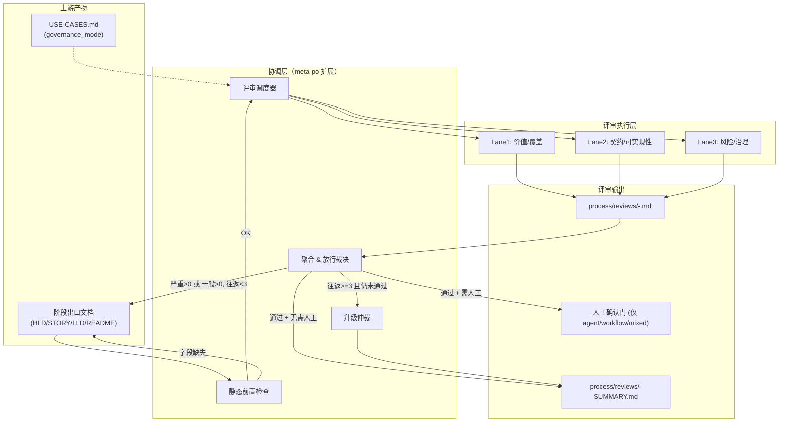
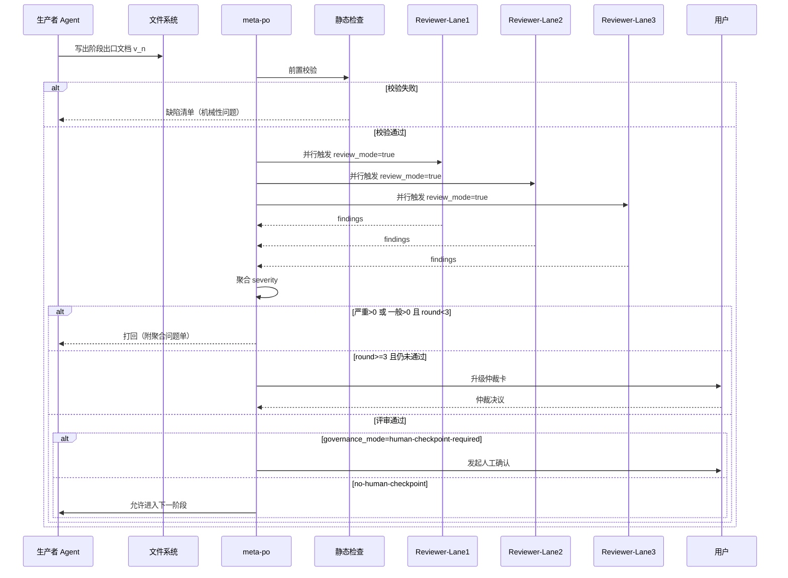

# 高层设计（HLD）：阶段出口文档并行评审门禁

> 从 `process/HLD.md`（use-case-discovery Skill）v1.8 中拆出。原文件中"并行评审 + 严重级别聚合 + 条件化人工确认"的整套治理机制，职责跨越 meta-po 调度与多 Agent review mode，已不属于单个 Skill 的范畴，独立成为本 HLD。

## 修订记录

| 版本 | 日期 | 修订人 | 关键变更 |
|------|------|--------|---------|
| 1.0 | 2026-04-23 | meta-se | 初稿：从 `HLD.md` v1.8 拆出（§5 M6/M7、§7.4、§10 ADR-13/14、§11 阶段 4/5、§12 Story 4/5/7）；同时回应原评审 S3/S4/S5，补入迭代上限与升级路径、review mode 建设成本章节、reviewer 分派重检 |
| 1.1 | 2026-05-15 | meta-po | CR-004：补充 Codex/Claude Code 平台确认协议、Story Package 合并确认与 agent 生命周期复用/关闭约束 |

---

## 1. 问题定义

### 问题陈述

meta 工作流当前在阶段出口文档产出后，默认由**文档生产者自审 + meta-po 口头放行 + 人工确认**一条链路推进。这条链路存在三类结构性问题：

1. **评审门缺失**：HLD / STORY-BACKLOG / LLD / README / USER-MANUAL 这些阶段出口文档，缺少由**文档生产者之外**的子 Agent 做结构化评审的环节，问题被推迟到人工确认或下游才暴露。
2. **人工确认压力过高**：把评审压力全部压到"人"的环节，人工确认变成"第一道真正的技术门"，本应在机器评审层过滤的问题全部堆到人身上。
3. **治理强度一刀切**：所有阶段出口文档统一走同一套确认路径，没有按目标产物类型（`tool / skill / agent / workflow / mixed`）分流，既过度治理了简单工具，又放过了复杂 Agent/Workflow 的门禁。

### 核心价值

为 meta 工作流提供一套**表驱动、可复用、跨阶段**的并行评审门禁机制：机器可聚合的结构化 findings + 统一严重级别 + 依据 `governance_mode` 的条件化人工确认。

### 目标

| 优先级 | 目标 | 度量方式 |
|--------|------|---------|
| P0 | 所有阶段出口文档在进入人工确认或下游前必须通过并行评审 | 每份阶段出口文档都有对应 `process/reviews/<doc>-*.md` |
| P0 | 评审结果使用统一严重级别聚合，规则唯一可机读 | 所有 findings 的 `severity ∈ {严重, 一般, 轻微}` |
| P0 | 根据 `USE-CASES.md.governance_mode` 决定是否在评审后追加人工确认 | `agent / workflow / mixed(含二者)` 100% 进入人工确认 |
| P1 | 评审死循环有明确上限与升级路径 | 同一文档最多往返 3 次；第 4 次自动升级 |
| P1 | reviewer 分派避免自评与利益冲突 | reviewer ∉ 文档生产者集合；且 README/USER-MANUAL 覆盖实现视角 |
| P2 | 支持渐进上线：先对 HLD / LLD 启用，再扩展到其他文档 | 阶段出口清单按 phase 配置 |

### 成功标准

- [ ] 每份阶段出口文档（HLD / STORY-BACKLOG / STORY-*-LLD / README / USER-MANUAL）均产出至少 3 条 lane 的评审结果
- [ ] 聚合规则固定为"严重=0 且 一般=0"判定通过，且轻微问题不阻断
- [ ] 评审往返 ≥ 3 轮仍未通过时，自动触发升级动作（由 meta-po 发起专项人工仲裁），不进入死循环
- [ ] reviewer 分派表在 ADR 中与实现脚本/提示词文件一一对应，不存在"表里有但提示词未落"的孤岛
- [ ] 对纯 `tool / skill` 产物，评审通过即可直接进入下一阶段，不默认触发人工确认

### 约束

| 类型 | 约束内容 |
|------|---------|
| 治理 | `meta-po` 保留唯一调度权；评审 Agent 只产出 findings，不直接改文档 |
| 职责 | 本 HLD 只负责评审门禁机制本身；`governance_mode` 字段来源是 `use-case-discovery` 的 HLD |
| 工程 | 不引入新的 reviewer / critic 专用 Agent，复用现有子 Agent 的 review mode |
| 协议 | review mode 提示词必须产出结构化 findings；禁止自由文本评论作为正式通过依据 |
| 交互 | 评审门禁只用于"阶段出口"文档，不覆盖日志/状态/追踪类工件 |

### 非目标（Out of Scope）

- 定义目标产物类型 `target_artifact_type` 与 `governance_mode` 的识别规则 → `use-case-discovery` 职责（见 `process/HLD.md`）
- 设计具体 LLD / 需求提取流程 → `hld-designer` 之外其他 Skill 的职责
- 实现 meta-po 的整体状态机（只扩展其评审协调能力）
- 代替人工确认（评审通过 ≠ 人工确认通过）

### 关键假设

- `USE-CASES.md` 已经稳定承载 `target_artifact_type` 与 `governance_mode` 字段
- 所有 reviewer Agent（meta-pm / meta-se / meta-dev / meta-qa / meta-doc）都可以扩展一个"review mode"
- reviewer 在相同评审框架下，口径偏差可通过严重级别定义 + 证据要求约束到可接受范围

### 缺失信息

| 优先级 | 缺失信息 | 影响范围 | 当前默认值 |
|--------|---------|---------|-----------|
| P1 | review mode 是嵌入现有 Agent 提示词的条件分支，还是独立小节被显式触发 | 影响 review mode 的实现成本 | **默认：独立小节 + `review_mode=true` 触发标志** |
| P1 | `process/reviews/` 目录下聚合摘要是否要写回 STATE.md | 影响追溯与恢复 | **默认：聚合结论的 severity 与 decision 回写 STATE.md** |
| OPTIONAL | 评审升级后的仲裁流程是否引入外部专家或仅由用户决定 | 影响升级路径 | **默认：升级后由 meta-po 生成仲裁卡并请用户决策** |

---

## 2. 候选架构方案对比

### 方案 A：专用 reviewer Agent

**核心思路**：新增 1–2 个专职 reviewer / critic Agent（借鉴 `gem-reviewer.agent.md` / `gem-critic.agent.md`），所有阶段出口文档统一由这些 Agent 评审。

| 维度 | 评估 |
|------|------|
| 优点 | 职责单一；口径最稳定；reviewer 能力可深度优化 |
| 缺点 | 引入新 Agent 与新编排层；与现有子 Agent 存在知识重复 |
| 复杂度 | medium |
| 实施成本 | 中 |
| 风险 | reviewer Agent 对业务上下文了解不足，易给出"通用正确但落地无力"的意见 |
| 适用前提 | 团队希望长期培养专职评审能力 |

### 方案 B：复用现有子 Agent 的 review mode（推荐）

**核心思路**：为 `meta-pm / meta-se / meta-dev / meta-qa / meta-doc` 各自扩展一个 review mode，通过 `review_mode=true` 调用进入评审态；评审输入是目标文档 + 上游工件，输出是结构化 findings。

| 维度 | 评估 |
|------|------|
| 优点 | 零新增 Agent；每个 reviewer 都带本职视角（如 meta-qa 天然关注风险）；成本集中于提示词 |
| 缺点 | 同一 Agent 需要维护生产态与评审态两套提示词，稍有耦合 |
| 复杂度 | medium |
| 实施成本 | 中（每个 Agent 新增 ~80 行提示词） |
| 风险 | review mode 与生产态混淆；需要明确调用契约避免误用 |
| 适用前提 | 希望尽量少引入新结构，且认可"本职视角即评审视角" |

### 方案 C：外部静态检查器（非 Agent）

**核心思路**：用脚本/静态校验代替 Agent 评审，检查 frontmatter 完整性、字段齐全、ADR↔章节交叉引用等。

| 维度 | 评估 |
|------|------|
| 优点 | 机械性问题零误判；运行快 |
| 缺点 | 无法评价"价值 / 风险 / 可实现性"等语义维度；覆盖度有限 |
| 复杂度 | low |
| 实施成本 | 低 |
| 风险 | 被当作"真正的评审"使用，导致语义缺陷漏网 |
| 适用前提 | 作为 A/B 的补充层，不作为主评审 |

### 方案对比矩阵

| 维度 | A 专用 reviewer | B 复用现有 Agent | C 静态检查 |
|------|:---:|:---:|:---:|
| 实施成本 | ⭐⭐ | ⭐⭐⭐⭐ | ⭐⭐⭐⭐⭐ |
| 语义评审能力 | ⭐⭐⭐⭐⭐ | ⭐⭐⭐⭐ | ⭐ |
| 业务上下文感知 | ⭐⭐ | ⭐⭐⭐⭐⭐ | ⭐ |
| 架构侵入性 | ⭐⭐ | ⭐⭐⭐⭐ | ⭐⭐⭐⭐⭐ |
| 长期可维护性 | ⭐⭐⭐ | ⭐⭐⭐⭐ | ⭐⭐⭐⭐ |
| **综合推荐** | 备选 | **推荐** | **补充层** |

**推荐方案**：B，并叠加 C 作为"机械性前置过滤层"（PR-style pre-check）。

---

## 3. 集成契约

### 3.1 与 use-case-discovery 的契约

| 维度 | 约定 |
|------|------|
| 字段依赖 | 消费 `USE-CASES.md.frontmatter.governance_mode` 与 `review_policy` |
| 调用方向 | `use-case-discovery` 不调用本机制；本机制由 `meta-po` 在阶段出口触发 |
| 字段缺失行为 | `governance_mode` 缺失 → 默认 `human-checkpoint-required`（最严） |

### 3.2 与 meta-po 的契约

| 维度 | 约定 |
|------|------|
| 调用方向 | meta-po → review-coordinator（本 HLD 新增能力，内嵌在 meta-po 提示词中） |
| 调用时机 | 任一阶段出口文档落盘后，由 meta-po 状态机自动触发 |
| 输入契约 | 目标文档路径 + 上游正式工件清单 + reviewer 分派表 + 严重级别定义 |
| 输出契约 | `process/reviews/<doc-id>-<reviewer>.md`（每个 reviewer 一份）+ `process/reviews/<doc-id>-SUMMARY.md`（聚合摘要） |
| 超时契约 | 单个 reviewer 超时 → 视为未完成，不得以"严重=0"直接放行 |
| 死循环保护 | 同一文档累计往返 ≥ 3 次且未通过 → 自动升级为 meta-po 仲裁卡 |
| 降级策略 | 无内联降级：评审未通过就不放行；不得以"口头已对齐"作为放行依据 |

### 3.3 与 reviewer Agent 的契约

| 维度 | 约定 |
|------|------|
| 调用方式 | `review_mode=true` 调用标志 + 目标文档 + 评审 Lane |
| 禁止行为 | reviewer 不得修改目标文档；不得自评自己生产的文档 |
| 输出格式 | 结构化 findings（见 §7.2） |
| 失败行为 | 无法得出结论时产出 1 条 `severity=严重` 的 BLOCKER finding，写明原因 |

---

## 4. 系统架构图

---

## 5. 高层模块与职责

| 模块 | 类型 | 职责 | 输入 | 输出 |
|------|------|------|------|------|
| M1：静态前置检查器 | 校验层 | 检查目标文档 frontmatter、章节完整性、锚点有效性 | 目标文档 | PASS / 缺陷清单 |
| M2：评审调度器 | 协调层 | 按文档类型查 reviewer 分派表，并行派发 | 目标文档 + 分派表 | 3 份 reviewer 任务 |
| M3：Reviewer review mode（×5） | 执行层 | 复用现有子 Agent，按 Lane 产出结构化 findings | 目标文档 + 上游工件 | `findings[]` |
| M4：聚合放行裁决器 | 决策层 | 按严重级别聚合，出具放行结论 | 3 份 findings | 放行 / 打回 / 升级 |
| M5：升级仲裁 | 兜底层 | 往返 ≥ 3 次仍未通过时，生成仲裁卡请求用户决策 | 历史 findings + 生产者答复 | 仲裁决议 |
| M6：reviewer 分派表 | 配置 | 按文档类型规定 3 条 Lane 的承担者，排除自评 | 表驱动 | — |
| M7：review mode 提示词注入 | 交付 | 为 5 个子 Agent 各补一个 "## Review Mode" 小节 | Agent 提示词文件 | 修订后的提示词 |

**模块边界规则**：
- M4 只做机器聚合，不做语义再判断
- 任一 reviewer 超时或无返回，M4 视为"未完成"，不得按"严重=0"直接放行
- M5 生成仲裁卡后，决策权归用户，不允许 meta-po 自行裁决并跳过

---

## 6. 技术选型与理由

| 选型类别 | 选择 | 备选 | 选择理由 | 风险 |
|---------|------|------|---------|------|
| 评审执行体 | 复用现有 5 个子 Agent 的 review mode | 新增专职 reviewer | 保持业务上下文感知，最少新增结构 | review mode 与生产态需提示词隔离 |
| 前置校验 | 轻量静态检查（frontmatter / 锚点 / 章节） | 完整 lint 框架 | 机械性缺陷提前过滤，Agent 不再为此花 token | 需要维护检查规则 |
| findings 格式 | Markdown + 结构化字段 | JSON / YAML | 人读 + 机器聚合兼顾 | 需定义 schema 并校验 |
| 严重级别 | 严重 / 一般 / 轻微 | BLOCKING/HIGH/LOW | 中文流程语境 | 需要清晰映射 |
| 聚合规则 | 严重=0 且 一般=0 才通过 | 加权评分 | 规则简单可机读 | 过严时需要升级路径兜底 |
| 死循环保护 | 同文档往返 ≥ 3 次自动升级 | 人工经验判断 | 保底不拖死流程 | 阈值需根据实践校准 |
| 调用标志 | `review_mode=true` 显式触发 | 从上下文隐式推断 | 避免误进入评审态 | 需在提示词中显式校验 |

---

## 7. 关键流程

### 7.1 主流程

### 7.2 findings 结构化格式

每个 reviewer 必须输出 0 条或多条 findings，每条 findings 字段：

| 字段 | 必填 | 说明 |
|------|:---:|------|
| `reviewer` | ✅ | 评审 Agent 名称 |
| `lane` | ✅ | 价值/覆盖 / 契约/可实现性 / 风险/治理 |
| `artifact` | ✅ | 被评审文档路径 + version |
| `finding_id` | ✅ | `<doc>-<reviewer>-<seq>` |
| `severity` | ✅ | 严重 / 一般 / 轻微 |
| `rule_ref` | ✅ | 对应的评审规则编号（如 AGENTS.md 评审规则第几条） |
| `title` | ✅ | 简短标题 |
| `evidence` | ✅ | 章节号 / 段落引用 / 字段名 / 冲突点 |
| `impact` | ✅ | 不修复的后果 |
| `recommendation` | ✅ | 修复建议 |
| `round` | ✅ | 当前是第几轮评审 |

### 7.3 严重级别定义

| 级别 | 定义 | 示例 | 聚合动作 |
|------|------|------|---------|
| **严重** | 破坏阶段门 / 集成契约 / 安全治理边界，若不修复下游无法安全继续 | HLD 与 ADR 结论自相矛盾；mixed 产物被判为 skill | **必须打回** |
| **一般** | 不阻断执行但显著提高返工概率；进入人工确认前必须修复 | 关键边界条件未覆盖；仅成功路径 | **必须打回** |
| **轻微** | 不影响推进，主要是表达/示例/局部补充 | 术语不统一；建议补对比表 | **可记录后放行** |

### 7.4 聚合放行规则

1. 任一 reviewer 有 `severity=严重` 的 finding ≥ 1 → **评审不通过**
2. 所有 reviewer 的 `严重=0`，但至少 1 条 `一般` → **评审不通过**
3. 所有 reviewer 的 `严重=0 且 一般=0` → **评审通过**（轻微记录后放行）
4. 任一 reviewer 超时未返回 → 视为"未完成"，不得按严重=0 判通过
5. 同一文档累计往返 ≥ 3 次仍未通过 → 自动升级为 meta-po 仲裁卡，由用户最终裁决

### 7.5 Reviewer 分派表（重检后）

> 原 HLD.md v1.7 §7.4 中 `README/USER-MANUAL` 缺少实现视角、`HLD.md` 的 Lane1 由 meta-pm 担任存在自评偏差（来自原 S5）。本版调整如下：

| 文档类型 | Lane 1：价值 / 覆盖 | Lane 2：契约 / 可实现性 | Lane 3：风险 / 治理 |
|---------|---------------------|-------------------------|-------------------|
| `USE-CASES.md` / `REQUIREMENTS.md` | **meta-se** | **meta-dev** | **meta-qa** |
| `HLD.md` | **meta-pm**（代言需求） | **meta-dev**（实现视角） | **meta-qa** |
| `STORY-BACKLOG.md` / `DEVELOPMENT-PLAN.yaml` | **meta-pm** | **meta-dev** | **meta-qa** |
| `STORY-*-LLD.md` | **meta-pm** | **meta-se** | **meta-qa** |
| `README.md` / `USER-MANUAL.md` | **meta-pm** | **meta-dev**（取代原 meta-se，以补实现视角） | **meta-qa** |

**分派规则**：
- reviewer ∉ 文档生产者集合（天然排除自评）
- `HLD.md` 由 meta-se 生产，meta-pm 评 Lane1（需求覆盖度），不存在 meta-pm 自评上游问题
- `README/USER-MANUAL` 由 meta-doc 生产，Lane2 改为 meta-dev，保证实现可行性评审不被 meta-se 垄断

### 7.6 前置校验失败路径

| 前置条件 | 校验动作 | 失败行为 |
|---------|---------|---------|
| 目标文档存在且 frontmatter 完整 | 静态检查 | 缺字段 → 打回生产者补齐，不进入 reviewer |
| 目标文档版本号单调递增 | 对比上一版 | 版本号回退 → 打回并提示版本策略 |
| `USE-CASES.md.governance_mode` 可解析 | 字段读取 | 缺失 → 默认 `human-checkpoint-required` 并在聚合摘要中标注 |
| reviewer Agent 可被 review_mode 调用 | 发起前 health check | 不可用 → 视为未完成，不得按"严重=0"放行 |
| 往返轮次 < 3 | 累计计数 | 第 4 次自动升级 |

---

## 8. 非功能需求设计

| 质量特征 | 设计目标 | 实现手段 | 验证方式 |
|---------|---------|---------|---------|
| 正确性 | 评审通过的文档不再有严重/一般问题 | 聚合规则 + 严重级别定义 | 随机抽样复查 |
| 可追溯性 | 每次评审有完整记录 | `process/reviews/` 持久化 findings 与聚合摘要 | 文件存在性 + 版本对应 |
| 活性保证 | 评审不进入死循环 | 往返 ≥ 3 次自动升级仲裁 | 模拟 4 轮未过，触发升级 |
| 可扩展性 | 新增阶段出口文档时能直接接入 | 分派表驱动；新增行即可 | 加一行验证可用 |
| 低侵入性 | 不破坏现有生产者流程 | review mode 仅增不改生产态 | A/B 对比生产态输出无回归 |
| 一致性 | reviewer 口径偏差在可控范围 | 严重级别 + 证据字段强约束；rule_ref 追溯 | 交叉复审同一文档差异 ≤ 10% |

---

## 9. 主要风险与应对

| ID | 风险 | 概率 | 影响 | 应对 |
|----|------|:---:|:---:|------|
| R1 | review mode 提示词与生产态提示词互相污染 | 中 | 高 | 用独立小节 + 显式 `review_mode=true` 触发；review mode 不得写入生产态输出路径 |
| R2 | 评审口径偏差：同类问题不同严重级别 | 中 | 中 | 严重级别定义 + rule_ref + 证据要求 + 抽样校对 |
| R3 | 往返次数上限设置不当导致过早升级 | 低 | 中 | 默认 3 次，留配置口；升级仲裁本身是兜底而非常态 |
| R4 | reviewer 延迟导致阶段门卡顿 | 中 | 中 | reviewer 超时判定 + 并行派发 + 轻量 Lane 设计 |
| R5 | 评审通过被误以为等同于人工确认通过 | 中 | 高 | 文档与 meta-po 提示词显式区分两个门禁 |
| R6 | 专用 reviewer / critic 的建设诱惑反复提出 | 低 | 中 | ADR-2 明确复用现有 Agent；如需新增需走 CR |

---

## 10. ADR 候选决策点

| ADR | 决策问题 | 建议决定 | 约束因素 |
|-----|---------|---------|---------|
| ADR-1 | 评审通过门槛 | **严重=0 且 一般=0**；轻微可备注放行 | 规则简单可机读；偏严通过升级路径兜底 |
| ADR-2 | 评审执行体 | **复用现有子 Agent 的 review mode**；不新增专职 reviewer | 保持业务上下文；最少侵入 |
| ADR-3 | 死循环保护 | **同一文档累计往返 ≥ 3 次自动升级仲裁** | 避免死循环；阈值可配 |
| ADR-4 | reviewer 自评 | **reviewer ∉ 文档生产者集合**；表驱动分派 | 排除自肯定偏差 |
| ADR-5 | README/USER-MANUAL 的 Lane2 | **由 meta-dev 承担（取代 meta-se）** | 保证实现可行性评审覆盖 |
| ADR-6 | review mode 调用方式 | **独立小节 + `review_mode=true` 显式触发** | 与生产态严格隔离 |
| ADR-7 | findings 格式 | **Markdown + 固定字段表**；必须含 evidence / rule_ref | 人读 + 机聚合 |
| ADR-8 | 聚合摘要持久化位置 | **`process/reviews/<doc>-SUMMARY.md`**；关键结论回写 STATE.md | 便于追溯 |
| ADR-9 | 与 `governance_mode` 的关系 | **评审通过后按 governance_mode 决定是否进入人工确认** | 治理分流 |
| ADR-10 | 是否引入静态前置检查 | **引入**（机械性问题不浪费 reviewer token） | 提升总体效率 |
| ADR-11 | 平台化人工确认 | **Claude Code 优先结构化选择；Codex 仅在当前工具面明确提供可用选择 UI 时使用结构化选择，否则默认 exact 文本** | 保留 Claude Code 方向键体验，同时避免 Codex 业务门禁因选择 UI 不可用或别名混排而误解 |
| ADR-12 | Story 与 LLD 确认合并 | **Story Package 确认一次性覆盖 Story 边界、Wave 分组与当前 Wave LLD 包** | 减少人工确认次数，同时不降低 LLD 门控强度 |
| ADR-13 | reviewer / worker 生命周期 | **同一任务复用同一 role 子 agent；检查点或交接完成后关闭** | 避免 Codex agent 超限与 token 漂移 |

### CR-004 平台确认补充

| 平台 | 首选确认方式 | 兜底方式 | 状态推进规则 |
|---|---|---|---|
| Claude Code | `ask_user` 结构化选择，上下方向键选择选项 | 无需默认兜底；异常时转人工文本 | 选择项命中才推进 |
| Codex | 仅在当前工具面明确提供可用的 `request_user_input` / 选择 UI 时使用结构化选择 | exact 文本只展示：`approve`、`修改: <具体修改点>`、`reject`；`1/通过`、`2/修改: ...`、`3/不通过` 仅作历史兼容别名 | 非 exact 输入不得推进 |
| 未知平台 | 不假设方向键能力 | Codex exact 文本协议 | 非 exact 输入不得推进 |

---

## 11. 分阶段落地建议

| 阶段 | 交付物 | 里程碑 | 前提 |
|------|--------|--------|------|
| 阶段 1 | `delivery/agents/meta-po.md` 扩展：评审调度器、聚合裁决、升级仲裁 | meta-po 可并行发起 + 聚合 + 升级 | 本 HLD 通过人工确认 |
| 阶段 2 | 为 `meta-pm / meta-se / meta-dev / meta-qa / meta-doc` 追加 `## Review Mode` 小节 | 5 个 Agent 都能按 `review_mode=true` 产出结构化 findings | 阶段 1 完成 |
| 阶段 3 | 评审结果模板 `templates/REVIEW-FINDINGS-TEMPLATE.md` + 聚合摘要模板 | 模板落地 | 阶段 2 完成 |
| 阶段 4 | 静态前置检查脚本（可最简实现：frontmatter 字段 + 锚点存在性） | CI 或本地可运行 | 阶段 1 完成（可并行） |
| 阶段 5 | 分派表文档化（`delivery/skills/README.md` 或专题文件） | 分派规则单一来源 | 阶段 2 完成 |
| 阶段 6 | 先试点 `HLD.md` + `STORY-*-LLD.md` 两类文档，灰度扩展到其他文档 | 两类文档实际过门禁 | 阶段 5 完成 |

---

## 12. 工作量粗估

| Story | Wave | 粗估 |
|-------|:---:|:---:|
| RG-1：meta-po 评审调度 + 聚合 + 升级仲裁 | W1 | M |
| RG-2：5 个子 Agent 的 review mode 扩展 | W1（可并行） | M+ |
| RG-3：findings / summary 模板与静态前置检查 | W1 | S |
| RG-4：分派表与文档、规则同步 | W2（依赖 RG-1/2） | S |
| **合计** | 2 Waves | **M+** |

---

## 13. 遗留问题

| ID | 状态 | 问题 | 当前处理 |
|----|------|------|---------|
| Q1 | ASSUMED | review mode 是独立小节还是条件分支 | 默认独立小节 + `review_mode=true` 显式触发 |
| Q2 | ASSUMED | 聚合摘要是否回写 STATE.md | 默认回写 decision + severity 摘要 |
| Q3 | OPEN | 升级仲裁是否需要外部专家 | 待首次触发仲裁后决定 |
| Q4 | OPEN | 对纯 `tool / skill` 的文档是否也启用并行评审 | 与 `HLD.md` Q6 绑定；默认"评审但不人工确认" |

---

## 14. 与 use-case-discovery HLD 的关系

| 关注点 | 本 HLD（评审门禁） | `process/HLD.md`（use-case-discovery） |
|--------|--------------------|--------------------------------------|
| 核心产物 | meta-po 评审协调 + reviewer review mode + 分派表 | use-case-discovery Skill + USE-CASES.md frontmatter |
| 输入依赖 | 本 HLD 消费 `USE-CASES.md.governance_mode` | 本 HLD 不修改 use-case-discovery |
| 部署顺序 | UCD 先出 `governance_mode`，再上线本 HLD | — |
| ADR 边界 | ADR-1~10 仅规范评审门禁 | ADR-1~12 规范 UCD 与产物类型 |

---

## 确认记录

**确认状态**：⬜ 待审核 → ✅ 已批准 / ❌ 需修改

**审核意见**：

**确认人**：
**确认时间**：
