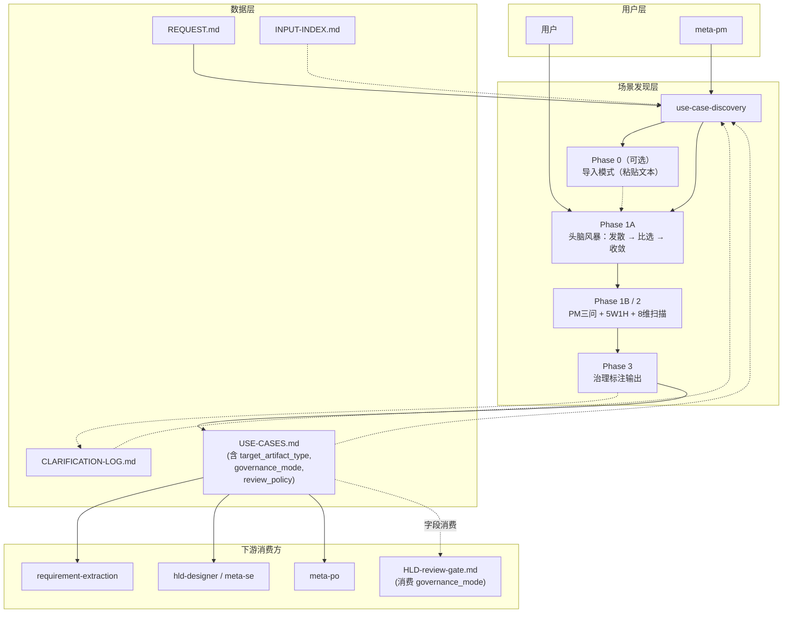
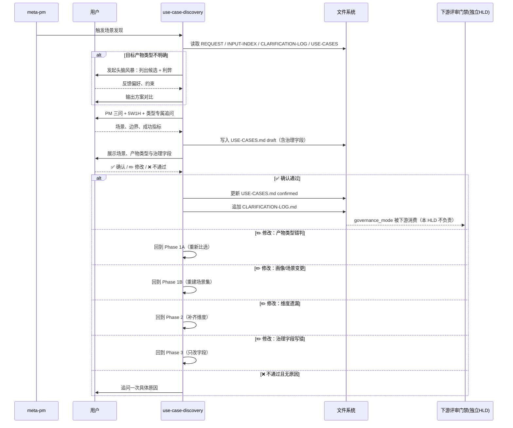

# 高层设计（HLD）：use-case-discovery Skill（产物类型感知增强）

> 基于用户需求描述输出。由 meta-se 在 solution-design 阶段生成。
> HLD 在人工确认后方可进入 Story 拆解阶段。
> **范围说明**：本 HLD 仅聚焦 `use-case-discovery` Skill 本身与产物类型感知；跨产物治理（并行评审门禁 / 聚合放行 / 条件化人工确认）已拆分到独立 HLD `process/HLD-review-gate.md`，两份 HLD 可并行评审。

## 修订记录

| 版本 | 日期 | 修订人 | 关键变更 |
|------|------|--------|---------|
| 1.0 | 2026-04-22 | meta-se | 初稿，方案 A/B/C 对比并选定 C（渐进式多维发现） |
| 1.1 | 2026-04-22 | meta-se | 基于 awesome-copilot 分析补充 §6/§10/§11/§14 借鉴清单 |
| 1.2 | 2026-04-22 | design-review | 设计评审后修订：①—⑪（细节见旧版归档） |
| 1.3 | 2026-04-22 | design-review | 根据用户答复收敛 Q4–Q8 |
| 1.4 | 2026-04-22 | design-review | 收敛 3 个二级决策（A/B/C） |
| 1.5 | 2026-04-22 | design-review | 二轮评审修订：补齐上下游契约等 |
| 1.6 | 2026-04-22 | design-review | 收敛 Q9：场景发现摘要写入 `CLARIFICATION-LOG.md` |
| 1.7 | 2026-04-23 | meta-se | 升级为产物类型感知方案 + 并行评审门禁 |
| 1.8 | 2026-04-23 | meta-se | 按仓库规范补齐修订记录精度 |
| 1.9 | 2026-04-23 | design-review | **按 α 方案拆分**：① 文首 `version` 对齐到 1.9；② §1 删除问题 4（评审门缺失）及相关目标；③ §3.1 删除"评审触发契约"与"人工检查点契约"中的评审执行细节，`governance_mode` 保留为下游标签；④ §4 删除 Review 子图；⑤ §5 删除 M6/M7；⑥ §7 删除 §7.4 并行评审机制；⑦ §10 删除 ADR-13/14；⑧ §11 删除原阶段 4/5；⑨ §12 回收为 3 个 Story；⑩ §13 修订 Q6/Q7 状态；⑪ §14 去除 reviewer 借鉴行并补 §14.1 编号；⑫ §1 量化成功标准；⑬ §7.2 补 mixed 判定规则；⑭ §7.3 时序图显性接回回退决策表分支；⑮ §14.2 Gotchas 聚焦 UCD，删除与评审门禁相关的一条。 |
| 2.0 | 2026-05-15 | meta-po | CR-004：参考 superpowers 的 one-question-at-a-time、2-3 方案比选与分段确认方法，补强头脑风暴；新增 production 交付出口路由约束 |

---

## 1. 问题定义

### 问题陈述

当前 `use-case-discovery` 已能发现和确认用户场景，但仍默认把"目标产物"当作统一对象来讨论，没有显式区分 **tool / skill / agent / workflow** 四类交付形态。这会带来三类核心问题：

1. **分析入口不准**：用户说"想做一个 meta 工作流产物"时，系统可能直接按通用场景访谈推进，却没有先判断应产出的是工具、Skill、Agent 还是多组件工作流。
2. **治理路径错误**：纯 `tool / skill` 与 `agent / workflow` 的治理要求不同；如果不先做产物分类，就容易把不该有人类 check 点的产物拉进人工审批，或把必须人工确认的 Agent / Workflow 直接放行。
3. **发散不足或收敛过早**：当用户自己也不确定最适合的产物形态时，现有流程缺少显式的"头脑风暴 → 选项比对 → 收敛"机制，容易把模糊目标过早固化为单一路径。

> 注：v1.7 中曾列出的"评审门缺失"问题，已拆分到 `HLD-review-gate.md`，本 HLD 不再承担其设计职责。

### 核心价值

为 meta-pm 提供一套**产物类型感知的场景分析框架**：先识别目标交付形态，再按不同治理强度设计后续路径，并把判断结果固化为下游可消费的正式字段，使下游设计、实现与治理都能据此分流。

### 目标

| 优先级 | 目标 | 度量方式 |
|--------|------|---------|
| P0 | 在场景发现阶段显式识别目标产物类型，并写入正式工件 | 每份 `USE-CASES.md` 都包含非空 `target_artifact_type` 与 `governance_mode` |
| P0 | 将纯 `tool / skill` 与 `agent / workflow` 分流到正确治理路径 | 产物类型 → governance_mode 的映射 100% 符合 §7.2 矩阵 |
| P1 | 在不确定目标形态时，引入头脑风暴机制并输出选项利弊 | 至少输出 2 个可选方案及适用边界；若只有 1 个必须写明"无备选的理由" |
| P1 | 下游可直接消费分类结果 | `requirement-extraction`、`hld-designer`、`meta-po` 均显式读取 `USE-CASES.md` 的治理字段 |
| P2 | 支持 draft 恢复与 confirmed 更新 | 中断后可从 `status=draft` 恢复；已 confirmed 更新必须递增 version |

### 成功标准

- [ ] **每个已识别用户画像**至少拥有 1 个完整场景（不是"至少 1 个画像"）
- [ ] **每个 P0 目标**至少 1 个量化成功指标（数字 / 百分比 / 字段集 / 耗时）
- [ ] 当用户目标不明确时，Skill 必须先给出**候选产物形态 + 利弊分析**，而不是直接替用户选定
- [ ] 每个场景包含全部 7 个必填字段：角色、触发条件、输入、处理逻辑、输出/结果、前置条件、排除情况
- [ ] `USE-CASES.md` frontmatter 必须包含 `target_artifact_type`、`governance_mode`、`review_policy`，且值属于规定枚举集
- [ ] 若 `target_artifact_type=mixed`，必须同时给出"拆分结论清单"（哪些能力拆为 tool / skill / agent / workflow）
- [ ] 再次触发时，若存在 `USE-CASES.md status=draft`，Skill 能从草稿恢复并继续，而不是重复从零开始访谈

### 约束

| 类型 | 约束内容 |
|------|---------|
| 技术 | 仅通过结构化对话和文件操作实现，不依赖外部 API 或额外 MCP 服务 |
| 业务 | 只负责场景发现、产物类型识别与治理路径标注，不越界到需求结构化、HLD / LLD 具体设计 |
| 治理 | `meta-po` 保留唯一编排权；本 Skill 只产出治理**提示**，不调度下游评审 |
| 协议 | 纯 `tool / skill` 默认 `governance_mode=no-human-checkpoint`；`agent / workflow` 默认 `human-checkpoint-required`；混合产物取最高治理级别 |
| 集成 | 场景发现结果必须通过正式工件 `USE-CASES.md` 交接给下游，不依赖 meta-pm 二次转述 |
| 交互 | 不确定信息优先与用户确认；若当前无法确认，必须显式记录假设与备选方案，不得静默拍板 |
| 语言 | 默认中文；仅当用户显式要求时切换英文 |

### 非目标（Out of Scope）

- 从场景提取结构化需求条目 → `requirement-extraction` 的职责
- 生成**针对已确认需求**的澄清问题 → `requirement-clarifier` 的职责
- 展开测试场景 → `scenario-expansion` 的职责
- 替代 `meta-po` 执行人工检查点或状态推进
- **设计并行评审门禁 / 聚合放行 / 条件化人工确认机制** → `HLD-review-gate.md` 的职责
- 为纯 `tool / skill` 默认增加人工检查点（若未来需要，只能通过 CR 单独显式开启）

### 关键假设

- meta-pm 在调用此 Skill 前已完成阶段零快速调研（`CLARIFICATION-LOG.md` 已初始化或可初始化）
- 用户能够至少描述"想解决什么问题"与"希望最终交付什么形态"中的一项；若两者都不清晰，先进入头脑风暴
- 当用户当前轮无法及时确认时，系统可按"最小风险默认值"推进，但必须把假设写入文档供后续确认

### 缺失信息

| 优先级 | 缺失信息 | 影响范围 | 当前默认值 |
|--------|---------|---------|-----------|
| OPTIONAL | 是否允许纯 `tool / skill` 项目按项目级 CR 主动开启人工检查点 | 影响少数高风险工具项目的治理策略 | **默认允许，通过 CR 显式升级** |

---

## 2. 候选架构方案对比

### 方案 A：通用场景发现 + 统一治理

**核心思路**：延续当前"先发现通用用户场景，再交由下游设计处理"的方式，不在场景阶段显式区分产物类型。

| 维度 | 评估 |
|------|------|
| 优点 | 改动最小；与当前结构最接近；实现成本低 |
| 缺点 | 用户场景与治理强度脱节；无法回答"为什么这个产物不需要 / 需要人工 check 点" |
| 复杂度 | low |
| 适用前提 | 交付形态非常单一的项目 |

### 方案 B：产物先分类、再刚性分流

**核心思路**：在场景访谈开始时必须先锁定 `tool / skill / agent / workflow` 之一，再使用不同的固定问卷。

| 维度 | 评估 |
|------|------|
| 优点 | 治理路径清晰；规则简单明确 |
| 缺点 | 用户一开始往往并不清楚最佳产物形态；过早锁定容易误分流 |
| 复杂度 | medium |
| 适用前提 | 用户已明确交付形态 |

### 方案 C：渐进式产物类型感知发现（推荐）

**核心思路**：先通过头脑风暴做"发散 → 比选 → 收敛"，形成**暂定产物假设**；随后按产物类型扩展场景，并在输出中写入治理提示。

| 维度 | 评估 |
|------|------|
| 优点 | 同时解决"产物类型不明确"与"治理规则不一致"；兼顾自然对话与治理精度 |
| 缺点 | 需要与 meta-pm 协同更新 `USE-CASES.md` 结构规范 |
| 复杂度 | standard |
| 适用前提 | **当前 meta 项目的默认方案** |

### CR-004 头脑风暴与交付出口补充

本方案借鉴 superpowers 的高层方法：先理解项目上下文，再一次只问一个关键问题，给出 2-3 个方案及 trade-off，按可读小块分段确认后再进入计划。meta-flow 不照搬其“每个任务新建子 agent”的实现方式；Codex 场景改为同任务复用同一子 agent，以控制 token 与 agent 数量。

新增交付出口约束：

| 模式 | 交付出口规则 |
|---|---|
| `meta-self-dev` / 明确优化 meta-flow 本身 | 允许写当前仓库 `delivery/` |
| `production` 且目标 README/docs 有交付说明 | 按目标项目说明输出 |
| `production` 且目标 README/docs 无交付说明 | 先提出推荐目录与理由，等待用户确认后再写 |

### 方案对比矩阵

| 维度 | A | B | C |
|------|:---:|:---:|:---:|
| 场景覆盖完整性 | ⭐⭐⭐ | ⭐⭐⭐⭐ | ⭐⭐⭐⭐⭐ |
| 治理路径准确性 | ⭐⭐ | ⭐⭐⭐⭐⭐ | ⭐⭐⭐⭐⭐ |
| 用户体验友好性 | ⭐⭐⭐⭐ | ⭐⭐ | ⭐⭐⭐⭐ |
| 适配模糊需求能力 | ⭐ | ⭐⭐ | ⭐⭐⭐⭐⭐ |
| 与现有结构兼容 | ⭐⭐⭐⭐ | ⭐⭐⭐ | ⭐⭐⭐⭐ |
| 综合 | — | — | **推荐** |

**推荐方案**：方案 C。理由：它允许先做头脑风暴和备选方案比对，再把分流结果固化到正式工件供下游稳定消费。

---

## 3. 推荐方案总览

### 3.1 与 meta-pm / meta-po 的集成契约

| 契约维度 | 约定 |
|---------|------|
| 调用方向 | `meta-pm`（调用方）→ `use-case-discovery`（执行方） |
| 调用时机 | meta-pm 完成阶段零快速调研后，进入场景发现环节 |
| 调用方式 | meta-pm 先输出 3–5 行引导文本，再触发 Skill；若用户目标形态不清，Skill 先进入"头脑风暴 + 方案比选"子流程 |
| 输入契约 | `REQUEST.md`（必读）+ `INPUT-INDEX.md`（若存在）+ `CLARIFICATION-LOG.md`（若存在）+ 现有 `USE-CASES.md`（若存在） |
| 输出契约 | `process/USE-CASES.md`（draft / confirmed）+ 会话级完成摘要；`USE-CASES.md` frontmatter 必须新增：`target_artifact_type`、`governance_mode`、`review_policy` |
| 治理字段语义 | `governance_mode` 取值：`no-human-checkpoint` / `human-checkpoint-required` / `highest-of-mixed`；`review_policy` 默认 `parallel-review-required`。**本 HLD 只产出这两个字段，字段消费者见 `HLD-review-gate.md`** |
| 下游衔接 | `requirement-extraction`、`hld-designer`、`meta-po` 直接读取 `USE-CASES.md` 中的产物类型与治理提示，禁止 meta-pm 二次转述 |
| 恢复契约 | 若存在 `USE-CASES.md status=draft`，默认进入"继续完善"；若已 `confirmed`，则进入"评审 / 更新"模式并在确认后递增 `version` |
| 日志契约 | Skill 在 Phase 3 退出时向 `CLARIFICATION-LOG.md` 追加场景发现摘要，并记录本轮产物类型判断 |
| 降级策略 | **无内联降级**：若 Skill 未被自动激活，meta-pm 必须终止并报错 |

---

**复杂度模式**：`standard`

| 判定维度 | 依据 | 结论 |
|---------|------|------|
| 需求规模 | 覆盖 `tool / skill / agent / workflow / mixed` 五类目标形态 | standard |
| 角色数量 | 1 个主发现角色（meta-pm）+ 1 个调用方 + 1 个治理消费方 | standard |
| 状态流转 | 头脑风暴 → 产物分类 → 场景扩展 → 治理标注 | standard |
| Story 拆解 | Skill 核心 + 模板 + meta-pm 集成 | standard |

**系统核心思路**：
> `use-case-discovery` 先通过头脑风暴找出最合适的产物形态，再按产物类型扩展场景并写入治理提示；下游文档的评审门禁由独立 HLD 负责消费这些字段。

**关键架构风格**：管道-过滤（发现）+ 决策路由（产物分类）+ 正式工件（治理标注）

**核心能力边界**：
- 做：引导 PM 与用户进行结构化场景对话；执行头脑风暴；识别目标产物类型；8 维度覆盖扫描；生成带治理字段的 `USE-CASES.md`
- 不做：直接产出 REQUIREMENTS / HLD / LLD；调度评审；执行人工确认

**关键依赖**：
- `meta-pm.md`：提供触发入口与 `USE-CASES.md` 结构规范
- `process/REQUEST.md`：场景发现的输入起点
- `process/INPUT-INDEX.md` / `process/CLARIFICATION-LOG.md`：可选的背景输入
- `process/USE-CASES.md`：若已存在，则作为恢复 / 更新的唯一真相源
- `skills/requirement-extraction/SKILL.md`：下游消费者，必须显式读取 `USE-CASES.md`

**产物形态**：
- Skill 数量：1（`use-case-discovery`）
- 私有参考文档：1（`references/8-dimensions-framework.md`，按需加载）
- 私有模板：1（`templates/USE-CASES-TEMPLATE.md`）
- 配套集成改动：2（`delivery/agents/meta-pm.md`、`delivery/skills/requirement-extraction/SKILL.md`）
- 目标平台：Copilot CLI / Claude Code / Codex（纯文本对话，无平台差异）

---

## 4. 系统架构图

---

## 5. 高层模块与职责划分

| 模块 | 类型 | 职责 | 输入 | 输出 | 依赖 |
|------|------|------|------|------|------|
| `Phase 0: 导入模式（可选）` | 执行阶段 | 检测用户是否提供已有用户故事 / PRD 片段；粘贴文本后解析为场景基线 | 粘贴文本 + `INPUT-INDEX.md`（若存在） | 场景基线雏形（内存） | — |
| `Phase 1A: 头脑风暴与产物假设` | 执行阶段 | 当目标形态不清时，引导在 `tool / skill / agent / workflow / mixed` 中发散备选，输出利弊与适用条件 | `REQUEST.md`、Phase 0 基线（可选） | 候选产物形态列表 + 暂定主选方案 | awesome-copilot 的"发散 → 收敛"模式 |
| `Phase 1B: 基线场景发现` | 执行阶段 | 以 PM 三问（谁用 / 什么问题 / 如何量化成功）+ 5W1H 建立初始场景集 | Phase 1A 产物、`CLARIFICATION-LOG.md`（可选）、现有 `USE-CASES.md`（可选） | 场景草稿 + 画像列表 + 初始产物分类 | `REQUEST.md` |
| `Phase 2: 产物类型感知扩展` | 执行阶段 | 按 `tool / skill / agent / workflow` 设置不同追问重点，并叠加 8 维覆盖扫描 | Phase 1B 草稿、自定义维度（可选） | 扩展场景集 + 覆盖维度标注 + 明确产物类型 | `references/8-dimensions-framework.md` |
| `Phase 3: 确认与治理输出` | 执行阶段 | 结构化呈现场景、产物类型和治理字段；写入 `USE-CASES.md`；追加摘要到 `CLARIFICATION-LOG.md` | 扩展场景集 | `USE-CASES.md`（draft / confirmed）+ `CLARIFICATION-LOG.md` 追加摘要 | `templates/USE-CASES-TEMPLATE.md` |
| `M5：meta-pm 集成适配` | 编排适配 | 在 `meta-pm.md` 中显式要求：先做阶段零调研，再进入本 Skill；若产物类型不清必须先做头脑风暴 | `delivery/agents/meta-pm.md` | 修订后的 meta-pm 契约 | 本 Skill 触发词契约 |
| `M6：下游契约适配` | 下游契约适配 | `requirement-extraction` 等下游显式读取 `target_artifact_type` 与 `governance_mode` | `USE-CASES.md` | 修订后的下游消费契约 | 正式工件内容契约 |

**模块边界规则**：
- `Phase 1A` 专门负责"产物形态发散与比选"；若目标产物已明确，可快速确认后跳过
- `Phase 1B` 只负责建立初始场景草稿；结束时以 `status: draft` 落盘到 `USE-CASES.md`
- `Phase 2` 必须同时处理**产物特定问题**与**8 维覆盖问题**
- `Phase 3` 只负责结构化渲染、治理标注和最终确认，不主动新增未讨论的新场景
- 若 `target_artifact_type = mixed`，则 `governance_mode` 必须写为 `highest-of-mixed`
- 评审门禁机制（原 M6/M7）已迁至 `HLD-review-gate.md`，本 HLD 不再承担

---

## 6. 技术选型与理由

| 选型类别 | 选择 | 备选方案 | 选择理由 | 风险 |
|---------|------|---------|---------|------|
| 执行形态 | 纯对话 Skill（`SKILL.md` 指令） | 代码脚本辅助 | 无平台依赖，零运行时成本 | 模型理解准确性依赖指令清晰度 |
| 输出格式 | Markdown + frontmatter 治理字段 | YAML / JSON | 与现有 meta-pm 契约兼容 | frontmatter 扩展需同步下游 |
| 模板机制 | Skill 私有模板（`templates/`） | 公共模板 / 内联 | 符合当前仓库实践 | 模板与 SKILL.md 需同步 |
| 头脑风暴机制 | **Spark → Compare → Converge** 三段式 | 纯自由问答 | 借鉴 awesome-copilot 成熟模式 | 若控制不好，可能拉长对话 |
| 产物分类承载位置 | `USE-CASES.md` frontmatter + "治理路径"附录 | 只放会话摘要 | 下游才能稳定消费 | 需要更新 `meta-pm.md` 规范 |
| 8 维度框架位置 | 独立 `references/8-dimensions-framework.md` | 内嵌于 SKILL.md | 保持 SKILL 主体可读 | 需维护引用一致性 |
| 对话语言 | 默认中文；用户要求时切换英文 | 自动检测 | 项目主语言为中文 | 英文场景需双语模板 |
| 恢复策略 | 优先读取现有 `USE-CASES.md` 做增量编辑 | 每次重建 | 避免丢失头脑风暴结论 | 需定义 confirmed 更新时的版本策略 |

---

## 7. 关键流程

### 7.1 用户场景分析框架

| 步骤 | 要回答的问题 | 输出 | 说明 |
|------|-------------|------|------|
| Step 1：问题锚定 | 用户想解决什么问题，谁使用，成功如何衡量？ | 问题描述 + Persona + Success Metrics | PM 三问起手，避免直接掉进"做什么形态" |
| Step 2：产物形态头脑风暴 | 更像 `tool`、`skill`、`agent`、`workflow` 还是混合形态？ | 候选产物列表 + 利弊对比 | 若不确定，至少给出 2 个备选及适用边界 |
| Step 3：暂定主选方案 | 当前最适合先按哪一种形态继续深挖？ | `target_artifact_type`（暂定） | 允许保留"mixed"或"待确认"，但不能留空 |
| Step 4：按类型深挖场景 | 用户实际会如何触发、交互、确认和交接？ | 场景草稿 + 类型专属问题答案 | tool/skill 关注输入输出；agent/workflow 关注状态流转 |
| Step 5：治理字段收敛 | 该形态在下游需要什么治理标签？ | `governance_mode` + `review_policy` | 标签含义由 `HLD-review-gate.md` 消费 |
| Step 6：正式工件输出 | 下游怎样消费这个判断？ | 写入 `USE-CASES.md` | 必须进入正式工件 |

### 7.2 产物类型感知分析矩阵

| 产物类型 | 判定规则（任一成立即归入该类） | 必问问题 | 治理字段默认值 |
|---------|-----------------------------|---------|---------------|
| `tool` | 产物主要以"命令 / 脚本 / 可执行单元"形态交付，且不自含多步编排 | 谁运行、输入输出、失败如何恢复、是否需要安装脚本 | `governance_mode=no-human-checkpoint` |
| `skill` | 产物是一份 `SKILL.md` + 模板 / 引用集合，在某个 Agent 平台内被触发 | 何时触发、输入输出契约、适用阶段、非目标、模板依赖 | `governance_mode=no-human-checkpoint` |
| `agent` | 产物是一个可自主执行多步决策的 Agent 提示词（或含状态机） | 谁调用、何时调用、状态机、自主决策边界、需要暂停等待谁确认 | `governance_mode=human-checkpoint-required` |
| `workflow` | 产物是一组按阶段编排的多 Agent/Skill 协作流程，涉及阶段门 | 阶段如何编排、并行/串行、哪几处需人工确认、失败如何回退 | `governance_mode=human-checkpoint-required` |
| `mixed` | **同时满足**以下两条：① 交付物里有 agent 或 workflow；② 交付物里也有 tool 或 skill | 哪些能力拆成 tool/skill/agent/workflow，各自边界 | `governance_mode=highest-of-mixed`（取最高） |

**mixed 的三条硬规则**：
1. 若交付物中**没有** agent 或 workflow，仅是多个 tool / skill 的集合 → 仍归为其中主导类型（`skill` 或 `tool`），不记为 mixed
2. 只要出现 agent 或 workflow 中任意一个，且另有 tool / skill 伴随 → 记为 mixed
3. mixed 必须在 `USE-CASES.md` 附录里给出"拆分结论清单"（子产物 → 子类型的映射）

### 7.3 主流程：发现 → 输出 → 下游消费

### 7.4 8 维度扫描框架（Phase 2 内部逻辑）

> 理论依据：Jobs-to-be-Done（D2/D3）+ Persona Matrix（D1）+ Journey Mapping（D4）+ Context of Use（D5/D6）+ FMEA（D7）+ Integration View（D8）。
> 这 8 维用于补漏，**不是**产物类型分类本身。

| 维度 ID | 维度名称 | 核心问题 | 典型遗漏场景 |
|---------|---------|---------|------------|
| D1 | 用户维度 | 还有哪些不同角色 / 权限级别的用户会用到？ | 管理员、只读用户、外部协作者 |
| D2 | 任务维度 | 用户在不同工作流阶段会触发哪些目标？ | 初始化、迁移、批量操作 |
| D3 | 动机维度 | 用户为什么使用？最在意什么？ | 节省时间、降低出错、增强可控性 |
| D4 | 时间维度 | 首次、日常、升级、退出各有什么场景？ | 首次配置、版本升级、迁移退出 |
| D5 | 环境维度 | 在哪些环境 / 工具 / 平台下使用？ | CI、离线环境、多平台 |
| D6 | 方式维度 | 有哪些不同输入方式或操作路径？ | 命令行、配置文件、交互式向导 |
| D7 | 异常维度 | 输入错误、权限不足、依赖缺失时怎样处理？ | 缺少必填项、超时、权限不足 |
| D8 | 集成维度 | 会与哪些系统 / 其他 Agent/Skill 交互？ | Git 钩子、CI 系统、其他 Skill |
| Dx | 自定义维度（可选） | 是否还有特定关注维度 | 会话级补充，不默认持久化 |

### 7.5 修改回退决策表

| 用户意图关键词 | 回退目标 | 理由 |
|---------------|---------|------|
| "其实更像一个 agent / workflow" | Phase 1A | 需要重新做产物比选 |
| 新增 / 遗漏了某类用户 / 画像 | Phase 1B | 画像变更会影响全部场景集 |
| 新增 / 遗漏了某个核心场景 | Phase 1B | 新场景需完整走 PM 三问 + 5W1H |
| 遗漏了某个维度（异常 / 集成 / 环境等） | Phase 2 | 属于维度级补全 |
| 下游反馈治理字段错误 | Phase 1A 或 Phase 3 | 类型错判回到 Phase 1A；字段写错回到 Phase 3 |
| 多项同时修改 | 按最深回退点执行 | 保证一致性 |

### 7.6 前置校验与失败路径

| 前置条件 | 校验动作 | 失败行为 |
|---------|---------|---------|
| `REQUEST.md` 存在且非空 | Skill 启动时读取并检测非空 | 终止执行并提示 PM：请先由 meta-po 初始化 |
| 现有 `USE-CASES.md` 为 `status: draft` | 启动时检测 frontmatter | 询问"继续完善 / 重开"；默认继续，不得静默覆盖 |
| `meta-pm.md` 中 `USE-CASES.md` 结构规范可解析 | 启动时校验模板字段 | 使用冻结兼容模板继续渲染，并提示维护者 |
| `CLARIFICATION-LOG.md` 追加格式可用 | 追加摘要前校验结构 | 不存在则初始化；结构异常则保留原内容追加新节 |
| 目标产物类型不明确且用户仍无法决策 | 头脑风暴后仍无结论 | 显式记录"主选方案 + 备选方案 + 取舍理由"，按最小风险方案推进 |
| 用户选择 ❌ 不通过 且未说明原因 | 空原因检测 | 追问一次具体原因 |

---

## 8. 非功能需求设计

| 质量特征 | 设计目标 | 实现手段 | 验证方式 |
|---------|---------|---------|---------|
| 可靠性 | 中途中断后可从草稿继续 | Phase 1B 结束即写入 draft；Phase 2 每轮追问后增量回写；重入时优先恢复 draft | 手动中断重进验证 |
| 一致性 | 产物类型、治理字段和正文场景保持一致 | 字段写入正式工件；收尾时自检"正文 ↔ frontmatter" | 人工核查 |
| 可追溯性 | 每次产物分类变更都有记录 | `CLARIFICATION-LOG.md` 追加场景发现摘要 | 回读日志 |
| 防遗漏 | 既覆盖 8 维度，也覆盖产物类型特有问题 | Phase 2 同时执行 8 维扫描与类型专属追问 | 审查 `USE-CASES.md` 覆盖自检表 |
| 易用性 | 用户可在不确定时先讨论选项，不被迫一次拍板 | 头脑风暴三段式；结构化确认选项 | 对话抽样 |
| 可维护性 | 新增产物类型或维度时不破坏现有流程 | 产物类型矩阵、维度表均表驱动 | 设计评审 |

---

## 9. 主要风险与应对

| 风险 ID | 风险描述 | 概率 | 影响 | 应对 | 触发信号 |
|---------|---------|:---:|:---:|------|---------|
| R1 | 用户与系统过早锁定错误产物类型 | 中 | 高 | 强制不明时先头脑风暴；允许 mixed 或备选 | 用户频繁改口 |
| R2 | 8 维与产物类型追问叠加后对话过长 | 中 | 中 | 先产物分类后做维度；每轮 ≤ 3 问题 | 用户拒答 |
| R3 | `USE-CASES.md` 新增字段后下游未同步消费 | 中 | 高 | 落地阶段同步改造 `requirement-extraction` 等 | 下游仍按旧模板解析 |
| R4 | 纯 `tool / skill` 被错加人工检查点 | 低 | 中 | `governance_mode` 默认规则 + 下游校验 | 下游对 skill 发起人工确认 |
| R5 | 场景发现摘要与澄清日志混杂 | 中 | 中 | 固定小节标题和字段模板 | 日志膨胀 |

---

## 10. ADR 候选决策点

| ADR ID | 决策问题 | 建议决定 | 约束因素 |
|--------|---------|---------|---------|
| ADR-1 | 覆盖自检表是内嵌正文还是作为末尾附录 | 作为 `USE-CASES.md` 末尾的可见附录章节，并保留机器可读锚点 | 人类可读 + 下游可解析 |
| ADR-2 | 8 维度框架是否单独放入 `references/` | 放入 `references/8-dimensions-framework.md` | SKILL 主体精简 |
| ADR-3 | 是否支持"导入模式" | 纳入 MVP，作为 Phase 0 可选入口 | 降低重复输入 |
| ADR-4 | 如何区分"场景发现完成"与"需求确认完成" | 本 Skill 只负责 `USE-CASES.md confirmed` | 单一职责 |
| ADR-5 | SKILL.md description 字段写法 | 采用 WHAT + WHEN + KEYWORDS 三段式 | 自动激活入口 |
| ADR-6 | 用户自定义维度是否持久化 | 会话级有效不持久化；常用维度通过 CR 正式化 | 保持灵活性 |
| ADR-7 | meta-pm 规范是否同步纳入覆盖自检表 | 是，作为正式兼容结构的可选附录 | 下游解析一致 |
| ADR-8 | `requirement-extraction` 是否直接消费 `USE-CASES.md` | 直接消费；meta-pm 不二次转述 | 单一真相源 |
| ADR-9 | draft / confirmed 的恢复策略 | draft 默认恢复；confirmed 进入更新模式并递增 `version` | 保护已确认产物 |
| ADR-10 | 场景发现摘要是否写入 `CLARIFICATION-LOG.md` | 写入，由 Skill 在 Phase 3 退出时追加 | 审计链路 |
| ADR-11 | 产物类型判断写在会话摘要还是正式工件 | **写入 `USE-CASES.md` frontmatter + 治理附录** | 否则下游无法稳定消费 |
| ADR-12 | 混合产物的治理级别如何判定 | **取最高治理级别**；只要包含 `agent / workflow` 就走人工检查点路径 | 避免漏掉高风险治理要求 |

> 原 ADR-13/14（并行评审相关）已迁至 `HLD-review-gate.md`。

---

## 11. 分阶段落地建议

| 阶段 | 交付物 | 里程碑标志 | 前提条件 |
|------|--------|---------|---------|
| 阶段 1 | `skills/use-case-discovery/SKILL.md`（新增 Phase 1A 头脑风暴、产物类型识别、治理字段输出） | Skill 可单独触发，并能输出治理字段 | 本 HLD 经人工确认 |
| 阶段 2 | `references/8-dimensions-framework.md` + `templates/USE-CASES-TEMPLATE.md`（扩展 frontmatter 与治理附录） | 模板与 `meta-pm.md` 新规范对齐 | 阶段 1 完成 |
| 阶段 3 | `delivery/agents/meta-pm.md` 集成改造 + `delivery/skills/requirement-extraction/SKILL.md` 下游契约改造 + `delivery/skills/README.md` 同步 | 下游链路能稳定消费产物类型与治理字段 | 阶段 2 完成 |

---

## 12. 工作量粗估

| 类别 | Story 数 | 预计 Wave 数 | 粗估工作量 |
|------|---------|------------|---------|
| Story 1：`use-case-discovery` 核心增强（头脑风暴 + 产物分类 + 治理字段） | 1 | W1 | M |
| Story 2：模板 / 引用增强（frontmatter、治理附录、8 维说明） | 1 | W1 | S |
| Story 3：`meta-pm.md` + 下游契约 + skills/README 同步 | 1 | W2（依赖 Story 1/2） | S |
| **合计** | **3** | **2 个 Wave** | **M** |

> 注：原 v1.7 中 Story 4/5/7（评审门禁相关）已迁移至 `HLD-review-gate.md`。

---

## 13. 遗留问题

| 问题 ID | 状态 | 问题描述 | 影响范围 | 当前处理 |
|---------|------|---------|---------|---------|
| Q1 | RESOLVED | 覆盖自检表是否同步到 `meta-pm.md` 规范 | 模板兼容性 | 已由 ADR-7 确认同步 |
| Q2 | RESOLVED | 8 维度扫描是否支持用户自定义维度 | 场景补漏灵活性 | 已由 ADR-6 确认允许（会话级） |
| Q3 | RESOLVED | 是否支持导入模式 | Phase 0 设计 | 已纳入 MVP |
| Q4 | RESOLVED | meta-pm 场景发现子流程如何处理 | 编排契约 | 已改为完全调用 Skill |
| Q5 | RESOLVED | 场景发现摘要是否写入 `CLARIFICATION-LOG.md` | 审计链路 | 已确认需要追加 |
| Q6 | MIGRATED | 纯 `tool / skill` 的交付文档是否也要并行评审 | documentation 阶段门禁 | 已迁出至 `HLD-review-gate.md` Q4，由该 HLD 统一决策 |
| Q7 | ASSUMED | 是否允许纯 `tool / skill` 项目显式升级到人工检查点 | 高风险工具治理 | 默认"允许通过 CR 升级" |
| Q8 | OPEN | `HLD-review-gate.md` 落地前，`governance_mode` 字段是否有空转风险 | 下游字段暂无消费者 | v1.9 产出字段但接受"字段先写好，消费者分阶段上线" |

---

## 确认记录

**确认状态**：⬜ 待审核 → ✅ 已批准 / ❌ 需修改

**审核意见**：

**确认人**：
**确认时间**：

---

## 14. Awesome-Copilot 资源借鉴清单

> 完整分析报告见 `process/ANALYSIS-meta-flow-awesome-copilot.md`。
> 以下为直接影响本 HLD 的关键借鉴条目；原评审相关借鉴（gem-reviewer / code-review-generic）已迁至 `HLD-review-gate.md`。

### 14.1 核心借鉴清单

| 借鉴源 | 资源路径 | 借鉴内容 | 影响章节 |
|-------|---------|---------|---------|
| `se-product-manager-advisor.agent.md` | `.input/agents/se-product-manager-advisor.agent.md` | **PM 三问框架**（Who / What problem / How to measure success）作为 Phase 1 开场标准化追问 | §5 Phase 1 模块、§7.3 主流程 |
| `prd/SKILL.md` | `.input/skills/prd/SKILL.md` | "Discovery = Interview，先问后写" 原则；三阶段命名（Discovery → Analysis → Output）| §3 系统核心思路、§11 分阶段落地 |
| `breakdown-feature-prd/SKILL.md` | `.input/skills/breakdown-feature-prd/SKILL.md` | **Given/When/Then** 格式作为场景描述字段的规范化写法 | §5 Phase 3 模块、§6 技术选型 |
| `agent-skills.instructions.md` | `.input/instructions/agent-skills.instructions.md` | SKILL.md ≤ 500 行硬上限；>5 步须拆 `references/`；description 字段 WHAT+WHEN+KEYWORDS | §3 产物形态、§6 技术选型、§10 ADR-2/ADR-5、§11 分阶段落地 |
| `prd.agent.md` | `.input/agents/prd.agent.md` | "Final Checklist" 确认模式；edge case 覆盖原则 | §7.4 覆盖扫描逻辑 |
| `simple-app-idea-generator.agent.md` | `.input/agents/simple-app-idea-generator.agent.md` | 头脑风暴采用"Spark → Dig Deeper → Reality Check"式发散后收敛 | §5 Phase 1A、§6 技术选型 |

### 14.2 SKILL.md Gotchas 候选清单

> 基于 `agent-skills.instructions.md`「Gotchas 是最高价值内容」的指导，下列为 SKILL.md 必须包含的实质性 Gotchas，LLD 阶段可增补：

1. **Never skip Phase 1**：即使用户粘贴了已有需求文档，也必须走 PM 三问建立画像和成功指标基线；否则 Phase 2 的 8 维扫描缺失锚点。
2. **维度不适用也要显式标注**：禁止静默跳过维度；标注"不适用"并写明理由是覆盖自检表的合法状态，未处理的维度则是缺陷。
3. **不要代替用户回答**：若用户无法给出某维度答案，追问一次后标记"待调研"，不要模型自行补全场景。
4. **draft 文件是状态机的唯一真相**：会话中断后只能从 `status: draft` 的 USE-CASES.md 恢复，禁止从会话历史重建。
5. **边界不要越线到 requirement-extraction**：场景里出现"应该支持 X 需求"的陈述时，仅记录为场景的"输入/输出"，不要拆解成需求条目。
6. **Given/When/Then 不是强制格式**：对非交互型场景（如数据迁移），可退化为"前置/处理/结果"三段式。
7. **Phase 3 的 ✏️ 修改必须命中回退决策表**：用户自由描述要映射到 §7.5 表格的明确类别，避免进入无限回退循环。
8. **先定产物治理，再谈后续 check 点**：只要目标产物包含 `agent / workflow`，就必须先写清人工确认位置；纯 `tool / skill` 不要默认继承这些 check 点。
9. **mixed 的判定走三条硬规则**：只有同时包含 "agent 或 workflow" 与 "tool 或 skill" 时才是 mixed；纯多 skill / 多 tool 聚合不算，避免 mixed 泛化。
