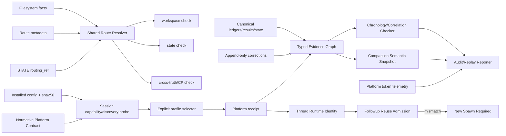
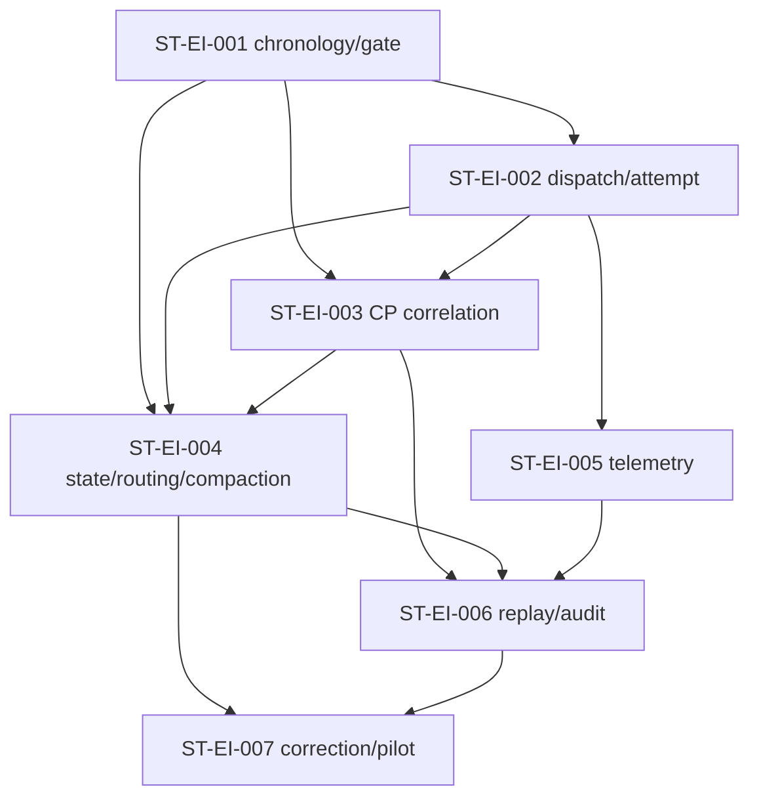

# CR-046 Evidence Integrity Dependency Map

## 修订记录

| 版本 | 日期 | 修订人 | 变更要点 |
|---|---|---|---|
| 1.0 | 2026-07-12 | meta-se-critical | 建立四个 Feature、七个 Story 和 shared truth/checker pipeline 的允许/禁止依赖。 |
| 1.1 | 2026-07-12 | meta-se-critical | 增加 custom-agent config/discovery/selector/receipt 证明链、Story 2 producer 与 Story 6 checker/replay 依赖，以及 CP0/6/7/8 消费关系。 |
| 1.2 | 2026-07-12 | meta-se / host-orchestrator | 接入规范性平台契约、D0 discovery、thread reuse receipt/new-spawn escalation 与 CR-046 A/B dogfooding依赖。 |

## 1. Feature 依赖关系

| From | To | 依赖类型 | 允许方向 | 原因 | 验证 / 监控 |
|---|---|---|---|---|---|
| FEAT-EI-GOVERNANCE | FEAT-EI-CORE | typed graph / validation API | allowed | route/state/compaction 需统一 identity 与 finding contract | contract tests |
| FEAT-EI-OBSERVABILITY | FEAT-EI-CORE | read-only validated snapshot | allowed | replay/audit 不可绕过 strict correlation | golden fixture |
| FEAT-EI-OBSERVABILITY | FEAT-EI-GOVERNANCE | read-only route/health/compaction manifest | allowed | audit 必须报告 shared truth 和 semantic preservation | audit fixture |
| FEAT-EI-CORRECTION | FEAT-EI-CORE | correction validation | allowed | correction 进入同一 typed graph | correction chain tests |
| FEAT-EI-CORRECTION | FEAT-EI-OBSERVABILITY | replay/audit consumption | allowed | post-close correction 必须可重放、可报告 | TC-EI-015/016 |
| FEAT-EI-CORE | existing producers | canonical read + checker response | allowed | 保留现有 ledgers/results/state owner | producer integration tests |
| existing producers | FEAT-EI-CORE | append fact then validate | allowed | 写后检查，不由 checker 代写 | schema/check tests |
| ST-EI-002 dispatch producer | platform capability/discovery API | session capability + profile discovery | allowed-required | 只有 live discovery 后才可提交指定 profile | CP0/CP6 negative fixtures |
| ST-EI-002 dispatch producer | platform dispatch API | explicit agent_type/profile selector | allowed-required | task_name/prompt 不能替代 selector | dispatch contract test |
| ST-EI-006 checker/replay | config manifest + capability probe + platform receipt | read-only correlation | allowed-required | verified 需四段证据和 requested/resolved strict equality | CP7/CP8 replay fixtures |
| ST-EI-002 dispatch producer | Codex Subagent Platform Contract | normative schema consumer | allowed-required | 平台当前事实与 required extension必须分层 | contract schema/golden fixtures |
| ST-EI-002 reuse admission | platform followup/resume API | immutable thread identity + reuse receipt | allowed-required | followup 只能继承；升级 new spawn | PC-08..13 |

## 2. 禁止依赖

| Forbidden ID | From | To | 禁止原因 | 替代路径 | 违反风险 |
|---|---|---|---|---|---|
| FD-EI-01 | OBSERVABILITY | canonical ledgers/results/state writer | reporter/replay 是派生消费者 | 只写 derived report | 报告污染 machine truth |
| FD-EI-02 | CORE | hand-written CP/CR summary | summary 非机器真相 | canonical result/ledger/checkpoint/state | schema PASS 掩盖时序冲突 |
| FD-EI-03 | GOVERNANCE | synthetic route facts | 隐式兼容导致 dangling ref 被 PASS | shared resolver + real metadata/explicit legacy | workspace/state split-brain |
| FD-EI-04 | compactor | untyped fallback identity | event_id/dispatch_id/run_id 语义不同 | typed node/edge manifest | restore 后 terminal chain 失真 |
| FD-EI-05 | CORRECTION | original history mutation | 违反 append-only | correction event + supersedes | 历史不可审计 |
| FD-EI-06 | pilot adapter | quant-lab lineage business modules | CR-046 无业务代码授权 | process evidence fixture only | 越权/业务回归 |
| FD-EI-07 | telemetry | inferred measured values | measured 只能来自平台 | proxy/unavailable | 成本报告虚假精度 |
| FD-EI-08 | state-transition | future human gate as current fact | phase work 尚未形成可审查产物 | in-progress state；产物完成后 open gate | 伪造门禁时序 |
| FD-EI-09 | dispatch producer | task_name/prompt/ledger self-report as profile selector | 自报不是平台 selection | explicit platform API selector | generic agent 被误报 custom agent |
| FD-EI-10 | attestation checker | execution completion as custom-agent proof | completion 与 profile/model attestation 正交 | bound platform receipt | 完成任务但运行错误 profile |
| FD-EI-11 | critical/debugger route | implicit generic fallback | 高风险 reasoning profile 不可静默降级 | BLOCKED 或用户重新选择可用 verified profile | 高风险任务由错误模型/effort 执行 |
| FD-EI-12 | capability probe | filesystem TOML scan as PROFILE_DISCOVERED | installed/configured 不等于 session discovered | D0 platform discovery | 重演“配置存在=生效”错误 |
| FD-EI-13 | followup/resume | ledger/handoff profile mutation | existing thread runtime identity 不变 | reuse receipt 或 new spawn lineage | 普通线程被误报 critical/debugger |

## 3. Shared truth dependency

Shared resolver 与 typed graph 是逻辑契约层，可由现有 Python 模块提供；它们不是新数据库或第二套 ledger。

## 4. 七 Story DAG

| Dependency | 类型 | 可否软化 | 理由 |
|---|---|---|---|
| 001 -> 002 | public identity/state-machine contract | 否 | dispatch temporal semantics 依赖 chronology 基线 |
| 002 -> 003 | identity/correlation | 否 | CP final ref 需 terminal attempt 模型 |
| 001+002+003 -> 004 | shared truth/finalization | 否 | cross-truth 与 compaction 必须消费完整 graph |
| 002 -> 005 | attribution | 是（schema-first） | telemetry schema 可先行，但完整聚合需 attempt identity |
| 003+004+005 -> 006 | report inputs | 否 | generated report 需全部维度 |
| 004+006 -> 007 | correction/replay acceptance | 否 | pilot 不能先于通用 lifecycle 与 current replay |

## 5. 循环风险与文件冲突输入

| Cycle/Conflict ID | 涉及对象 | 风险 | 当前处理 |
|---|---|---|---|
| CYCLE-EI-01 | checker -> reporter -> canonical writer | report 回写源 truth 形成自证循环 | forbidden；reporter 只写 derived artifact |
| CYCLE-EI-02 | correction -> replay -> correction | replay 自动产生 correction | forbidden；correction 必须由显式 lifecycle command/authorization 触发 |
| CYCLE-EI-03 | ledger self-report -> checker trusts ledger | producer 自称 resolved profile 形成自证循环 | receipt 必须来自平台边界并绑定 selector/config/attempt |
| CYCLE-EI-04 | Meta Flow required schema -> report says platform implemented | 期望契约形成自证循环 | CURRENT/session-observed/REQUIRED 三层分开；只有平台 receipt/fixture可升级 |
| CONFLICT-EI-01 | ST-EI-001/003/004 对 state-transition/cp checker | 同文件并发修改 | CP4 指定单 owner 或串行 merge 001 -> 003 -> 004 |
| CONFLICT-EI-02 | ST-EI-002/004 对 ledger compaction/event schema | identity contract 冲突 | 002 先冻结 schema，004 只消费并实现 preservation |
| CONFLICT-EI-03 | ST-EI-005/006 对 audit schema | token 字段与报告聚合冲突 | 005 拥有 usage contract，006 拥有 report projection |

## 6. 失败传播

| 失败源 | 下游必须行为 | 禁止行为 |
|---|---|---|
| route dangling/conflict | workspace/state/CP checker 全部 BLOCKED，指向相同 rule/ref | 某 checker WARN、另一 checker PASS |
| attempt chain invalid | CP correlation、audit、compaction apply 全部停止 | 跳过坏行继续给最终 PASS |
| provenance unavailable | as-executed 标 legacy/unavailable；current replay 可单独执行 | 合成 checker version/commit |
| semantic digest mismatch | 不替换源 ledger；保留诊断候选和 source hash | 继续 compact 并让 restore 猜测关系 |
| pilot 未授权 | 仅保留 adapter/fixture 设计，执行 BLOCKED | 访问 runtime/credentials 或 quant-lab 业务源码修改 |
| profile config missing/not discovered | CP0 capability precheck 或 story dispatch BLOCKED | 仅凭磁盘路径继续 |
| selector absent | 不得提交“指定 custom agent”；critical/debugger BLOCKED | 把 task_name/prompt 当 selector |
| receipt missing/mismatch/stale hash | execution 可单独记录，但 custom_agent_verified=false；strict gate BLOCKED | 追溯补造 receipt 或复用 reload 前 hash |
| D0 discovery unavailable | filesystem只到 CONFIG_VALIDATED；A-baseline诚实降级 | 扫描 TOML 后宣称 PROFILE_DISCOVERED |
| followup identity mismatch | deny reuse，profile升级 new spawn；required不可用则 BLOCKED | 改 ledger 把 default thread升级 critical |

## 7. CP 消费与负向 fixture 依赖

| Consumer | 必须消费 | 负向 fixture |
|---|---|---|
| CP0 | 安装配置 schema+sha256、当前会话 selector capability、profile discovery | 磁盘有配置但未发现；reload 后 discovery/config hash stale |
| CP6 | Story 2 producer 证据：requested profile、explicit selector submission、dispatch/attempt、receipt 或 honest unavailable；compat approval | task_name 冒充 selector；ledger 自报无 selector；receipt 缺失/错误 dispatch/config hash |
| CP7 | Story 6 strict checker/replay：requested/resolved/profile/model/effort/config/thread correlation、PC-01..17、A/B dogfooding，completion/attestation 正交 | profile/model mismatch；wrong receipt；followup mutation；无 receipt继承 critical；旧 hash reuse |
| CP8 | execution/profile/model 三轴汇总；A-baseline最高 READY_WITH_RISK；Conditional B required dispatch verified覆盖率=100% | degraded/unattested 被误报 verified；contract-ready 被误报 runtime-conformant |

## 8. DAG 验收

- 有向环数量 = `0`。
- 未注册 Story 依赖数量 = `0`。
- 高风险共享文件无 owner/merge-order 数量 = `0`（CP4 必须最终确认）。
- 禁止依赖命中数 = `0`。

## 9. Gotchas

- “只读索引”可以是 checker 的运行时派生结构，但不能持久化为与 canonical ledgers 竞争的第二真相源。
- DAG 是 CP3 技术输入，不是已批准的 DEVELOPMENT-PLAN；CP3 未批准前不得创建 Story 卡片或 LLD。
- capability-check/dispatch CLI 名称和参数只是 proposed contract；现有仓库未验证存在对应命令，不得在设计中写成已实现接口。
