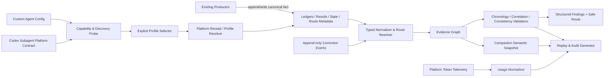

# 高层设计（HLD）：CR-046 Evidence Integrity, Replayability and Token Telemetry

> 基于 artifact-repo `docs/product/*` v1.3 与 CP2-R2 approved baseline。CP3-R3 已批准；三个 minor 作为 CP4/CP5 强制设计细化项，不改变已批准架构。

## 修订记录

| 版本 | 日期 | 修订人 | 变更要点 |
|---|---|---|---|
| 1.0 | 2026-07-12 | meta-se-critical | 初始 HLD：覆盖 typed evidence graph、dispatch/CP identities、route shared truth、compaction、correction、audit/replay/telemetry、七 Story DAG 和 CR-163 pilot 边界。 |
| 1.1 | 2026-07-12 | meta-se-critical / host-orchestrator | CP3 用户修订：将 Codex custom-agent 的 config 校验、live discovery、显式 selector、平台 receipt/resolved profile 与 model/effort attestation 收敛为 Story 2/6 的强验证链，并补 strict/compat、CP 消费和负向 fixture。 |
| 1.2 | 2026-07-12 | meta-se / host-orchestrator | CP3-R3 整改：新增规范性 Codex 子 Agent 平台契约、D0-D3 capability discovery 分层、不可变 ThreadRuntimeIdentity 与 followup reuse 约束，并冻结 A-baseline + Conditional-B 狗粮策略。 |
| 1.3 | 2026-07-12 | host-orchestrator | 记录 CP3-R3 用户批准；将 D0 freshness、followup no-receipt 负例和 legacy `codex_agent_name` D3 replay 分类下沉 CP4/CP5。 |

## 1. 问题定义

Meta Flow 当前能验证许多 schema，却不能一致证明事实发生顺序、平台 dispatch 的证据上限、CP final result 与真实 attempt 的关联、compaction 后语义等价、历史 checker 可重放性和 token 成本来源。已观测到四类实证缺口：R1 CP1/CP2 provenance 为空仍可 PASS；R2 checkpoint attempt 复用了 event identity；dispatch 只有 session observation、无 repository-verifiable receipt；workspace checker 在 `STATE.routing_ref` 目标缺失时仍把 local-directory 报为 OK。另有 state-transition checker 将合法的 solution-design 执行中间态误判为应已打开 CP3。

### 1.1 目标与成功标准

| 优先级 | 目标 | 度量方式 |
|---|---|---|
| P0 | 时序、身份、correlation 和 cross-truth 可机器证明 | TC-EI-001..009、014、018 中非法 fixture 拒绝率 `100%` |
| P0 | compaction/correction 保持 append-only 语义 | pre/post typed graph digest 相等；原历史 byte/hash mutation=`0` |
| P0 | audit/replay 不改写历史且 provenance 可解释 | TC-EI-011/012/016/017 全通过；R1 原 hash 保持不变 |
| P0 | route 与 gate 状态使用共享真相 | dangling routing_ref 被 PASS 次数=`0`；in-progress/open-gate fixture 判定准确率=`100%` |
| P0 | 指定 custom agent 的选择与实际解析可证明 | 指定 profile 的 config/discovery/selector/receipt 四段证据覆盖率=`100%`；verified receipt 的 profile/config/model/effort 匹配率=`100%`；无 selector/receipt 却标 verified 的次数=`0` |
| P0 | 平台扩展有显式、可移交、可验收的契约 | REQUIRED spawn/discovery/followup 字段与 CURRENT 能力差异覆盖率=`100%`；PC-01..PC-17 conformance fixture 定义=`17/17` |
| P0 | capability discovery 不把配置存在误作运行时可发现 | D2 config scan 被提升为 `PROFILE_DISCOVERED` 的次数=`0`；只有 D0 平台响应可建立 named-profile discovery |
| P0 | thread reuse 不允许账本改名伪造 profile 升级 | followup reuse 改变 immutable runtime identity 的接受次数=`0`；profile 不匹配时新 spawn 路由覆盖率=`100%` |
| P0 | token 度量不伪造 | measurement_status 覆盖=`100%`；measured-without-platform-source=`0` |
| P1 | CR-163 可作为独立授权的 acceptance pilot | 后续执行时 current replay `23/23 PASS` 且受保护业务源码 diff=`0` |

### 1.2 约束

- 不新增与现有 ledgers/results 平行的第二套治理真相源；typed evidence graph 是运行时/派生关联视图。
- 不伪造 receipt、checker identity 或 measured token telemetry；缺失必须用 unavailable/legacy/proxy 表达。
- `.codex/agents/*.toml` 存在、`task_name`、prompt 角色声明、agent/thread id 或 ledger 自报只能证明配置/请求/会话事实，不能单独证明平台选择了指定 custom agent 或实际模型。
- 官方 Codex 文档确认 custom agent 配置和线程协作能力，但当前公开契约没有给出可调用工具面的 profile selector、runtime discovery API 或 resolved-model receipt；这些能力在规范附录中明确标为 REQUIRED extension，不得写成 CURRENT。
- canonical JSON CR index 优先，legacy YAML 只读兼容，不得影响 canonical checker 结论。
- 本阶段不访问 runtime/credentials、不 publish、不 commit/push、不修改 quant-lab lineage 业务代码、不执行 CR-163 pilot。
- Python 入口和验证统一使用 `uv run`。

### 1.3 非目标与相邻对象边界

- 不重做现有 event ledger、CP result、state writer；本设计增加公共 identity/correlation/strict profile 契约。
- 不把 generated audit report 当作 machine truth；它是带 input hashes 的派生产物。
- 不把 post-close correction 变成任意 closed state 编辑；只允许 versioned allowlist patch event。
- 不在 CP3 创建 Story 卡、FEATURE-DESIGN-MATRIX、LLD 或 DEVELOPMENT-PLAN；本文仅给七个已批准产品 Story 的技术边界/DAG 输入。
- CR-163 仅是 acceptance adapter/fixture；通用 correction/replay 先在 Meta Flow 建立，pilot 另行授权和执行。

### 1.4 缺失信息

无 BLOCKING 产品信息。需由 CP3 人工决策的架构项为 DQ-01 typed evidence pipeline、DQ-02 local-directory route compatibility、DQ-03 correction lifecycle、DQ-04 custom-agent resolution/attestation、DQ-05 CR-046 dogfooding。DQ-05 推荐 A-baseline + Conditional-B：本 CR 不依赖外部平台扩展才能完成，但若 CP7 前 D0 discovery、selector、receipt 与 PC-01..17 全部可用，则另起已验证 `meta-qa-critical` 线程执行 Conditional-B。平台 receipt/token telemetry 的可用性可诚实表达为 unavailable；但当 route 明确要求 critical/debugger custom profile 时，selector/discovery/receipt 不可验证是 strict 阻断，而不是可静默接受的缺口。

## 2. Architecture Gray Areas 与方案形成记录

讨论日志：`process/discussions/CP3-CR046-HLD-DISCUSSION-LOG.md`  
恢复点：`process/checks/CP3-CR046-DISCUSSION-CHECKPOINT.json`

| 灰区 ID | 关键问题 | 为什么影响架构 | refs | 状态 |
|---|---|---|---|---|
| AGA-EI-01 | 是否建立共享 typed graph/correlation layer | 决定 checker 是否统一身份和失败语义，或继续各自解释 | REQ-EI-001..008, 019, 021 | recommended-pending-CP3 |
| AGA-EI-02 | local-directory 的 routing_ref 合法形态 | 决定 workspace/state 是否能消除 dangling-ref split-brain | CP2 approval condition, REQ-EI-008 | recommended-pending-CP3 |
| AGA-EI-03 | phase work 与 opened human gate 的状态表达 | 决定 post-approval checker 是否伪造未来 gate | REQ-EI-001/002 + observed CP2->CP3 transition | recommended-pending-CP3 |
| AGA-EI-04 | correction/replay/audit 是通用 contract 还是 pilot 特例 | 决定 closed history 是否可复用审计及是否耦合 quant-lab | REQ-EI-014..023 | recommended-pending-CP3 |
| AGA-EI-05 | 如何区分“拉起了通用子 Agent”和“平台确实解析了指定 custom profile/model” | 决定不同模型路由是否可证，以及 task_name/ledger 自证是否会被误接受 | REQ-EI-005/023, ST-EI-002/006 | recommended-pending-CP3 |
| AGA-EI-06 | CR-046 如何在当前不具备 selector/receipt 的会话中验证自身治理能力 | 决定 CP7/CP8 是否会临时降低证据标准，或反向依赖尚未交付的平台扩展 | ST-EI-002/006, platform contract §9 | recommended-pending-CP3 |

### Advisor table-first 输入

| Option | Pros | Cons | Impact Surface | Recommendation | Assumptions / When to switch |
|---|---|---|---|---|---|
| A. Existing truth + typed contract/checker pipeline | 不复制事实；统一 identity、routing、failure；渐进兼容 | 需协调多个既有模块与 fixture | checks/state/workspace/workflow/context/CLI/tests | 推荐 | 若文件规模导致 replay 超出性能 SLO，再加只读索引 |
| B. Checker-local correlation | 局部改动快 | 重复枚举和 split-brain；compaction/audit 难一致 | 每个 checker | 不推荐 | 仅适合单 checker 临时 hotfix，不适合 architecture-major CR |
| C. New evidence database | 查询/关系表达强 | 第二真相源、迁移/同步/回滚成本高 | 全系统与部署 | 不推荐 | 只有 canonical files 无法满足明确性能/并发 SLO 且另立 CR 时评估 |
| Route R1. real metadata for local-directory | ref 可解析、portable、checker 共用 | 需迁移 legacy local dirs | workspace/state/doctor/CP8 | 推荐 | metadata 不能部署时切 R2 |
| Route R2. explicit null + legacy mode | 不制造悬空 ref | state schema/checker 需支持明确降级 | state/workspace | 条件备选 | 只用于有期限迁移窗口；strict profile BLOCKED/WARN 明确 |
| Route R3. synthetic implicit route | 兼容最快 | 隐式事实不可审计，维持 split-brain | checker internals | 拒绝 | 无切换条件；不作为 executable target |
| Correction C1. versioned append-only event | 通用、可审计、保留原 history | schema/policy/checker 较多 | closed workflow/replay/pilot | 推荐 | schema 无法表达时 BLOCKED 并通过 CR 扩展 |
| Correction C2. new result supersedes old | 复用 result chain | 只适合“重新执行结果”，不适合任意允许字段 | CP results only | 条件备选 | 修正对象本身就是 CP result 且有真实新 execution 时 |
| Agent P1. config + live discovery + explicit selector + bound receipt | requested/resolved profile、config hash、model/effort 可机器证明 | 依赖平台发现和回执能力 | dispatch producer/checker/CP0/6/7/8 | 推荐 | selector/receipt 不可用时 critical/debugger BLOCKED |
| Agent P2. user-approved generic fallback | 普通任务仍可执行 | 只能 degraded/unattested，不能证明 custom agent/model | compatibility path | 条件备选 | 仅普通 profile 且用户显式批准；profile/config 变化即重做 probe |
| Dogfood D1. A-baseline + Conditional-B | 基线诚实且不被外部平台阻塞；平台能力到位时可完成真实自举验证 | 基线 CP7 最多 PASS_WITH_RISK，需清晰区分产品契约通过与 runtime attestation | CP6/CP7/CP8 | 推荐 | 仅当 D0 discovery + selector + receipts + PC-01..17 全通过时切 B |
| Dogfood D2. pure A | 不依赖外部平台；可确定完成 | 本 CR 无法证明 critical profile 实际生效 | CP7/CP8 | 可接受备选 | 平台扩展未在 CP7 前出现时保持 |
| Dogfood D3. pure B | 理想自举，runtime proof 最强 | 外部平台时序不可控，会把治理 CR 变成平台阻塞项 | CP6/CP7 | 不推荐作为基线 | 只有平台 extension 已成为 CURRENT 且 conformance 通过时采用 |

方案形成输入来自已批准 CP2-R2、用户对 routing decision 的强制要求、scope review findings 和本轮 host-observed state-transition failure；没有伪造 reviewer/subagent 意见。正式用户选择仍由 host-orchestrator 在 CP3 收集。

## 3. 候选架构方案

| 维度 | A. Typed contract on existing truth（推荐） | B. Checker-local patching | C. New evidence store |
|---|---|---|---|
| 用户意图 | 完整覆盖 chronology/attestation/replay/cost | 仅局部缓解 | 覆盖但超范围 |
| 实现复杂度 | high，一次性公共 contract | medium 初期、长期累积 | very high |
| 可验证性 | 共享 fixture/oracle，强 | checker 间结果可能冲突 | 强但需同步正确性证明 |
| 维护成本 | 中；单一 enums/graph/finding | 高；重复语义 | 高；新增存储生命周期 |
| legacy compatibility | 显式 strict/legacy profile | 隐式漂移 | 迁移复杂 |
| 回滚 | 关闭 enforce，保留 audit/旧 producer | 按 checker 回滚但不一致 | 数据迁移回滚高风险 |
| 权限/安全 | 全部在 process evidence 范围 | 同左 | 引入新持久化面 |

推荐 A。适用前提是 canonical files 仍是事实源、当前规模可在 CP/check/audit 命令中构建派生 typed graph。牺牲是前期需统一 schema/enums 和跨模块契约；换来无第二真相源、可重放和可生成 audit。

## 4. 推荐架构总览

架构风格：append-only event facts + typed correlation graph + deterministic validation pipeline + provenance-bearing derived reports。

### 模块职责

| 模块 | 职责 | 输入 | 输出 | 不负责 |
|---|---|---|---|---|
| Typed Normalizer | 解析 typed IDs/refs、schema versions、legacy classification | canonical facts | normalized nodes/edges | 写源文件、选择 gate |
| Shared Route Resolver | 结合 filesystem、routing_ref、metadata 产出 RouteTruth | project root/state/metadata | valid/local-compat/legacy/dangling/conflict | 猜测缺失 metadata |
| Evidence Graph Correlator | 关联 event/dispatch/attempt/check/gate/state/correction | normalized facts | typed graph + terminal selections | 报告展示 |
| Validators | 执行 chronology、closure、cross-truth、route/state invariants | graph + policies | structured findings/decision | 自动修历史 |
| Semantic Snapshot/Compactor Guard | compact 前后生成/比对 semantic digest | graph/source hash/policy | manifest + apply authorization | 用 fallback ID 恢复关系 |
| Replay Runner | 保存 as-executed/current-replay 与 diff class | inputs/checker registry | replay result | 改写历史 result |
| Audit Generator | 分维聚合 event/attempt/thread/outcome/token | validated snapshot + usage | machine-readable report + summary | 从行数推断其他维度 |
| Correction Lifecycle | allowlist 校验、append、supersedes、audit chain | closed target + request | correction event/check result | 任意 closed state edit |
| CR-163 Pilot Adapter | 将已授权 pilot 输入映射到通用 contract | pilot manifest | append set/replay evidence | quant-lab lineage 业务实现 |
| Custom-agent Capability/Receipt Resolver | 校验配置 sha256、当前会话 discovery/selector 能力，并比对平台 receipt 的 requested/resolved profile、config、model、effort | installed config、capability probe、dispatch request、platform receipt | verified/degraded/unavailable/mismatch + structured finding | 从 task_name、prompt 或 ledger 自报推导实际 profile/model |
| Codex Platform Contract Adapter | 区分 CURRENT 与 REQUIRED 能力，校验 discovery/spawn/followup request/receipt，并执行 PC-01..17 conformance fixtures | tool schema、D0 discovery 响应、config hash、platform receipts | capability classification、ThreadRuntimeIdentity、ReuseReceipt、fallback decision | 把设计期 REQUIRED 字段冒充当前平台已支持 |

## 5. 核心集成契约与失败路径

### 5.1 Producer -> checker

- 调用方向：现有 producer 写 canonical fact 后调用 checker；gate 前 host 再聚合检查。
- 输入：canonical relative refs、schema version、typed identity、timestamp、hash；不可传手写摘要替代。
- 输出：`rule_id/object_id/field/evidence_ref/severity/safe_route` 结构化 finding。
- 失败：任何 dangling ref、identity collision、terminal closure 缺失、decision/outcome 冲突均 FAIL/BLOCKED；不得静默修复。
- 消费方同步：ledger writers、CP result/ledger append、state router、handoff/dispatch producers、CLI 和 tests。

### 5.1A Specified custom-agent resolution

- 强类型标识：`canonical_role` 表达 Meta Flow 角色；`task_name` 只是任务标签；`requested_agent_profile` 是调用意图；`resolved_agent_profile` 只能来自平台 receipt；`agent_id/thread_id` 是执行实例，不隐含 profile/model。
- 调度前状态机：`PROFILE_REQUESTED -> CONFIG_VALIDATED -> PROFILE_DISCOVERED -> DISPATCH_SUBMITTED -> RECEIPT_RECEIVED -> PROFILE_RESOLVED -> RUNNING -> terminal`。配置校验必须生成 sha256；discovery 必须来自当前会话 capability probe；dispatch API 必须显式接受 `agent_type/profile` 等 selector。
- receipt 绑定：receipt 必须绑定 `receipt_id/time + dispatch_id + attempt_id + requested/resolved profile + config hash + model + reasoning effort + agent/thread id`。只有 requested/resolved/config/model/effort 全部与 validated request 相等才可 `custom_agent_verified=true`。
- 正交结论：`execution_completed` 与 `custom_agent_verified`/`model_attested` 分开；通用 Agent 完成任务不能自动提升 profile 证明，profile 已证明但执行失败也不能写 completed PASS。
- strict：profile 未安装、当前会话未发现、selector 缺失、receipt 缺失/错绑/stale/mismatch 均 fail-closed；required critical/debugger profile 禁止 generic fallback。
- compat：仅普通 profile 且用户显式批准时可用 generic fallback，必须写 approval/ref/reason、`degraded-unattested` 和 `custom_agent_verified=false`；撤回批准、会话 reload 或 config hash 改变后重新 probe。
- 当前 dogfooding：本会话 collaboration `spawn_agent` schema 只有 `task_name/message/fork_turns`，没有 profile selector/receipt。因此 CR-046 既有 dispatch 只能保留为 `session-observed/repository-unverifiable`，不得追溯补造 resolved profile/model。
- Story owner：ST-EI-002 实现 capability/config check、dispatch producer、receipt/attempt lifecycle；ST-EI-006 实现 strict checker、current replay 与 CP/result correlation。建议的 `capability-check` / `dispatch-check` 仅为 proposed interface，CP6 实现前不得写成现有 CLI。

#### Capability discovery 层级

- D0 `platform-session-list/resolve`：平台对当前会话返回 profile name、config hash、selector support 和 receipt support；只有 D0 可以建立 `PROFILE_DISCOVERED`。
- D1 tool schema introspection：只能证明当前工具是否暴露 selector/discovery/receipt 字段，不能证明某个已安装 profile 可被当前会话解析。
- D2 `.codex/agents/*.toml` scan：只能建立 `CONFIG_VALIDATED`，证明配置存在且 hash 可计算；不得推导 `PROFILE_DISCOVERED`。
- D3 task name、prompt、handoff 或 ledger 声明：只证明 requested/declared intent，不能证明平台 resolution。

#### Thread reuse 与 profile escalation

- 初次 spawn receipt 建立不可变 `ThreadRuntimeIdentity = thread_id + resolved_agent_profile + resolved_model + resolved_reasoning_effort + agent_config_hash + receipt_id`。
- `followup_task` 只能继承已证明的 ThreadRuntimeIdentity；必须返回 reuse receipt 并绑定原 spawn receipt。它不能把普通线程动态升级为 critical/debugger，也不能靠 ledger 改名产生升级事实。
- requested profile 与线程 identity 不一致时，required profile 必须新 spawn；preferred profile 可在用户批准下走 degraded generic fallback。若平台不提供 reuse receipt，则复用保持 `session-observed/unattested`，不可作为 strict profile 证明。

### 5.1B CR-046 dogfooding 策略

- 主选 A-baseline：CR-046 的 CP6/CP7 不假设外部 Codex 平台已经实现 REQUIRED extension。当前工具完成的工作可以证明 execution/session observation；Story 2/6 的 contract、adapter、checker 和 PC fixtures 可以在仓库中独立验证，但不能把通用线程写成已验证 critical profile。
- 基线结论上限：若 CP7 时仍无 D0 discovery/selector/receipt，功能与 contract fixture 可通过，但 runtime custom-agent attestation 为 unavailable；CP7 最高 `PASS_WITH_RISK`，CP8 最高 `READY_WITH_RISK`，风险明确归属于外部平台能力而非伪造成 Meta Flow PASS。
- Conditional-B 切换：只有平台 extension 在当前会话成为 CURRENT，D0 discovery、显式 selector、spawn/reuse receipts 均可用，且 PC-01..17=`17/17 PASS`，才新 spawn 已验证 `meta-qa-critical` 执行 CP7 runtime conformance；不得复用先前未证明 profile 的 QA 线程。
- 回退：任一 receipt 缺失、错绑、stale、model/config mismatch 或平台能力回退，立即恢复 A-baseline，保留已完成仓库验证，不重写历史 receipt 或 dispatch。

### 5.2 Shared RouteTruth

- 主选：`routing_ref` 对 symlink 与 local-directory 均指向真实 metadata。local-directory 最小 metadata 为 `schema_version`、`project_name`、`routing_mode`、`path_format`、project/process/link anchored relative paths；所有 checker 调同一 resolver。
- 当前观测：`process/.meta-flow-process.yaml` 不存在，但 workspace checker 报 local-directory OK；strict 契约下该状态是 `dangling` 并 BLOCKED。
- 备选 R2：明确 `routing_ref=null` 与 `legacy-local-directory` state，配 migration deadline；不得同时保留非空 dangling ref。
- migration：先生成/校验 metadata，再切 routing_ref/strict profile；不改变 process 内容。
- rollback：若 metadata 引入冲突，恢复先前 state hash，并进入 explicit legacy mode；不能回到 dangling non-null PASS。
- switch：metadata 无法安全、可移植地描述当前布局时切 R2；symlink migration 成熟且 artifact_root 已确认时切正式 symlink mode。

### 5.3 Phase-work vs gate-open

- `phase-in-progress` 合法状态：solution-design + active delegation + `pending_gate=null` + `next_action.type=delegate_solution_design|continue`。
- `gate-open` 只有在 HLD/ADR/capsule/auto result/Decision Brief/checklist 已生成且 host 真正发起审查后成立：`pending_gate=CP3`、checklist ref 存在、`next_action.type=await_user`。
- state-transition checker 必须区分“批准/自动 CP 后仍在执行 route 中间阶段”与“已抵达下一 required gate”。只有执行完成事件后才要求 gate-open 或合法 stop_reason。
- 失败 fixture：在 meta-se dispatch 正执行时强制 pending_gate=CP3 必须被拒绝为 future-fact；执行完成后仍无 gate/checklist 也必须拒绝。

### 5.4 Compaction/restore

compactor 先对完整 typed graph 生成 semantic manifest（source hash、typed node/edge digest、terminal selections、correction/health refs），产出 archive/candidate，再 restore 并重建 graph 比较。只有完全相等才能替换源 ledger并追加 marker。任一 mismatch 时源 ledger不变，返回可定位 finding。现有 `_event_range` 对 `event_id/dispatch_id/run_id` 的 fallback 只能用于人类显示，不能成为语义 identity。

### 5.5 Correction/replay/audit/telemetry

- correction 采用 versioned append-only schema、字段/对象 allowlist、author/reason/evidence/supersedes，无环检查；原对象 byte/hash 不变。
- replay registry 记录 checker name/version/commit、schema/policy/input hashes；不可得为 unavailable。R1 null-provenance 原结果是 negative fixture，strict profile 不可 fully replayable。
- audit report 由工具从 input manifest 生成，独立计数 event rows、attempts、threads、terminal outcomes；token 按 measured/proxy/unavailable 分组和归属。
- platform telemetry 缺失时 status=unavailable；文本/tokenizer 估算只能进入 proxy，不可填 measured 字段。

## 6. Use Case → Architecture Traceability

| Use Case | 模块 | 关键流程 | 失败路径 | 验证 |
|---|---|---|---|---|
| UC-EI-001 | graph + chronology/correlation + state/route | facts -> normalize -> graph -> validate | 时序/identity/route 冲突 BLOCKED | TC-EI-001/002/006..009/014/016 |
| UC-EI-002 | dispatch model + capability/profile resolver + compaction guard | config/probe/selector/attempt/receipt -> resolved profile -> terminal selection -> semantic snapshot | 未发现/无 selector/receipt mismatch => strict BLOCKED 或显式 degraded；open attempt blocks | TC-EI-003..005/014/018 + custom-profile negative fixtures |
| UC-EI-003 | checker registry + replay + correction | immutable input -> as-executed/current -> diff/correction | null provenance => legacy/unavailable | TC-EI-011/012/015/017 |
| UC-EI-004 | usage normalizer + audit | telemetry/proxy -> attribution -> dimensioned report | no source => unavailable | TC-EI-010/016 |
| UC-EI-005 | correction + pilot adapter | authorized manifest -> append-only set -> 23 replay | no auth/business diff/non-23 => BLOCKED/rollback append set | TC-EI-013/015 |

## 7. 关键场景模拟

| 模拟 ID | 场景 | 输入 / 前置 | 执行路径 | 预期输出 | 失败 / 回退 | 结果 |
|---|---|---|---|---|---|---|
| SIM-EI-01 | CP2 approved 后 solution-design 正执行，CP3 未打开 | active delegation、pending_gate=null、delegate action | state resolver -> phase-work invariant | 合法 in-progress；不要求 CP3 gate | 若伪造 pending_gate 或 checklist 缺失则拒绝；任务完成后 host 再 open gate | PASS |
| SIM-EI-02 | local-directory 且 routing_ref 悬空 | 当前 state ref + metadata target missing | shared route resolver -> workspace/state/CP checks | 三者一致输出 dangling/BLOCKED | 生成并验证 real metadata；或 explicit legacy null mode，不能 implicit PASS | PASS |
| SIM-EI-03 | retry ledger compact/restore | 多 event rows、2 attempts、1 terminal winner、correction/health refs | normalize -> snapshot -> compact -> restore -> digest compare | identities/edges/terminal/correction/health `100%` 等价 | mismatch 则不替换源，输出 rule/object/ref | PASS |
| SIM-EI-04 | R1 CP1/CP2 无 provenance | immutable R1 hashes、current checker registry | replay -> as-executed unavailable -> current strict | 原 hash 不变；not fully replayable；current finding 可复核 | 不允许补写历史 provenance；只能新 result/correction | PASS |
| SIM-EI-05 | session observed dispatch 无 receipt | agent/thread/tool session evidence，repo receipt absent | evidence-level classifier -> audit | session=true、repository=false、receipt=unavailable、platform-attested=false | 不得提升 verified；gate 依据 profile决定 BLOCKED/accepted limitation | PASS |
| SIM-EI-06 | 后续 CR-163 pilot | 独立授权 + immutable manifest + generic correction ready | adapter -> append correction/manifest -> current replay -> protected diff | 23/23 PASS、business diff=0、audit generated | 任一不满足：pilot NOT ACCEPTED；撤回/隔离 append set，不改原历史 | PASS（设计模拟，未执行） |
| SIM-EI-07 | 磁盘存在 custom config，但当前会话无 profile selector/discovery | `.codex/agents/meta-se-critical.toml` 存在；spawn schema 只有 task_name/message/fork_turns | config check PASS -> capability probe selector absent | execution capability 与 named-profile capability 分开；specified-profile route BLOCKED | 不得用 task_name/prompt/ledger 自报提升 verified | PASS |
| SIM-EI-08 | receipt 错绑或 reload 后 stale config hash | requested meta-qa-critical；receipt 指向错误 dispatch/model/hash | receipt resolver -> strict compare | `custom_agent_verified=false`，finding 指向 mismatch 字段；CP6/7/8 不放行严格结论 | 重新 discovery/dispatch；历史 receipt 不改写 | PASS |
| SIM-EI-09 | 配置已安装但平台 discovery 不可用 | D2 scan 找到 meta-qa-critical；D0 response unavailable | config validate -> capability classify | `CONFIG_VALIDATED`，`PROFILE_DISCOVERED=false`；strict dispatch 不放行 | 走 A-baseline 或等待平台 extension；不得由 D2 提升 D0 | PASS |
| SIM-EI-10 | 普通 QA 线程收到 critical followup | 原 ThreadRuntimeIdentity=meta-qa/terra；新 request=meta-qa-critical/sol | reuse admission -> identity compare | reuse rejected；required route 生成 new-spawn decision | preferred route仅经用户 waiver 可 degraded；ledger 改名不改变 identity | PASS |
| SIM-EI-11 | CR-046 CP7 自举验证 | Story 2/6 contract 已实现；平台 extension 可能可用或不可用 | 先执行 PC-01..17；满足 B 条件则新 spawn verified critical，否则 A-baseline | B: runtime attested；A: repository contract PASS_WITH_RISK、runtime unavailable | 能力回退时切 A，不阻塞 contract 交付且不伪造 attestation | PASS |

## 8. 非功能设计

| 质量属性 | 目标 | 设计 |
|---|---|---|
| Determinism | 同输入 hashes + checker identity 得到相同 canonical result | normalized ordering、explicit timezone、stable digest |
| Diagnosability | strict finding 定位覆盖 `100%` | rule/object/field/ref/safe_route 五元组 |
| Compatibility | legacy 可读、不静默重写 | versioned schemas + legacy/unavailable classification + audit->enforce |
| Security/authz | 未授权 runtime/credentials/publish 操作=`0` | filesystem evidence only；pilot execute 独立 authorization |
| Maintainability | 同义 identity/evidence/routing enum 定义源=`1` | shared modules and contract fixtures |
| Performance | 默认 CP/check 对 fixture 线性扫描；无持久第二索引 | 若实测超 SLO，另立只读索引 CR |

## 9. 迁移、灰度与回滚

1. Schema/normalizer 与 Codex platform-contract adapter 先以 audit mode 上线：读取 legacy/CURRENT tool schema，产出 warnings/findings，不改变原记录；默认 A-baseline。
2. Producers 增量写 provenance/attempt/measurement fields；R1 作为 immutable negative fixture；PC-01..17 验证 REQUIRED contract，但不得把 fixture PASS 当 runtime attestation。
3. Shared route resolver 上线：先审计 current local dirs；为合法 local-directory 写可移植 metadata 后再 enforce dangling-ref。
4. Strict chronology/correlation/compaction/correction/replay/audit fixture 通过后切 enforce；只有平台 extension 成为 CURRENT 且 conformance `17/17` 时启用 Conditional-B runtime dogfood。
5. CR-163 pilot 仅在另行授权后消费通用 contract。

回滚粒度：关闭 enforce 回 audit；保留新 append-only facts；不删除或重写已产生 evidence。route metadata 回滚必须进入 explicit legacy mode。compaction mismatch 不应用；correction 错误以新的 superseding correction 修复。

## 10. 七 Story 技术 DAG 与 Feature design 触发

技术依赖采用 `001 -> 002 -> 003 -> 004`，`002 -> 005`，`003+004+005 -> 006`，`004+006 -> 007`。ST-EI-002 拥有平台契约 adapter、discovery/spawn/followup producer 与 ThreadRuntimeIdentity；ST-EI-006 拥有 conformance checker、strict CP correlation 和 A/B dogfood 判定。七个 Story 数与产品基线一致，Wave 数尚未在 CP3 冻结，必须由 CP3 批准后的 CP4 planning 计算。

所有四个 Feature 都触发 Feature-level implementation design：CORE（public cross-module identity/security contract）、GOVERNANCE（state/routing/compaction/migration/rollback）、OBSERVABILITY（schema + multi-consumer report/telemetry）、CORRECTION（post-close mutation boundary + pilot adapter）。该判定是 CP4 输入，不在本阶段创建 Feature DESIGN/TASKS。

## 11. HLD 拆分评估

存在 Story >5 和 ADR 分簇信号，但保持单份 HLD：七个 Story 共用同一 typed evidence identity、RouteTruth、semantic snapshot 和 checker provenance 模型，拆分会产生双向引用和多个公共 schema owner。CR-163 仅为 adapter/acceptance 边界，尚不足以独立形成可授权实现 HLD；若未来扩大为跨仓迁移产品或引入运行时操作，必须通过新 CR 拆 companion HLD。

## 12. 风险与决策

| 风险 | 严重度 | 缓解 | 触发回退 |
|---|---|---|---|
| legacy evidence strict 化导致大面积失败 | HIGH | audit->enforce、legacy/unavailable 分类、fixture inventory | 未分类失败 >0 时停止 enforce |
| platform receipt/token 永远不可得 | MEDIUM | evidence/measurement 分层 | 不回退；保持 unavailable，避免虚假证明 |
| shared checker 改动面大 | HIGH | contract-first + golden fixtures + Story owner/merge order | cross-truth fixture 不一致时回 CP5 design |
| route metadata migration 描述错误 | HIGH | portable anchored paths + resolver dry-run | 任一 project mismatch/dangling 时 explicit legacy/BLOCKED |
| compaction 损坏关系 | BLOCKER | pre/post semantic digest and no-apply-on-mismatch | digest mismatch 立即保留源 ledger |
| pilot 越权 | BLOCKER | separate authorization + protected path diff | 无授权或业务 diff!=0 不执行/不接受 |
| 通用子 Agent 被误报为指定 custom profile/model | BLOCKER | config/live-discovery/selector/receipt 四段链；completion/attestation 正交 | 任一 selector/receipt/profile/config/model mismatch 时 strict BLOCKED |
| REQUIRED 平台扩展未在 CR-046 CP7 前交付 | HIGH | A-baseline 不依赖扩展；平台 contract 与 fixtures 独立验收；runtime attestation 明示 unavailable | 保持 CP7 PASS_WITH_RISK / CP8 READY_WITH_RISK，不临时降低证据标准 |
| followup 对既有线程改写 profile 标签造成伪升级 | BLOCKER | immutable ThreadRuntimeIdentity + reuse receipt + mismatch new-spawn | reuse receipt 缺失或 identity 不等时拒绝 strict reuse |

CP3 必须确认 `CR046-EI-ADR-001..011`，尤其 ADR-004 local-directory routing、ADR-003 phase-work/gate-open、ADR-010 platform contract/thread runtime identity 与 ADR-011 A-baseline + Conditional-B dogfooding。未确认前不得进入 Story planning。

## 13. 自审与 Gotchas

- 内部一致性：ADR、模块、流程、failure path、DAG 均使用同一 canonical truth/derived report 边界。
- 成功标准全部量化；场景模拟 `11/11 PASS`（设计模拟，不冒充执行证据）。
- 集成契约包含调用方向、时机、输入/输出、衔接、失败和同步范围。
- 相邻边界明确：checker vs producer、audit vs truth、correction vs mutation、pilot vs business implementation。
- Gotchas：不要用 `event_id` fallback 修复 attempt identity；不要把 `pending_gate` 当“将来会有门”的计划字段；不要把 unavailable 当失败后自动补造；不要让 local-directory compatibility 绕过 metadata/ref 一致性；不要把 `task_name`、prompt、agent id 或 ledger 自报当作平台 custom-agent selector/receipt；不要把 D2 配置扫描当 D0 runtime discovery；不要用 `followup_task` 或账本改名升级线程 profile；不要把 PC fixture PASS 当成平台 runtime attestation。
