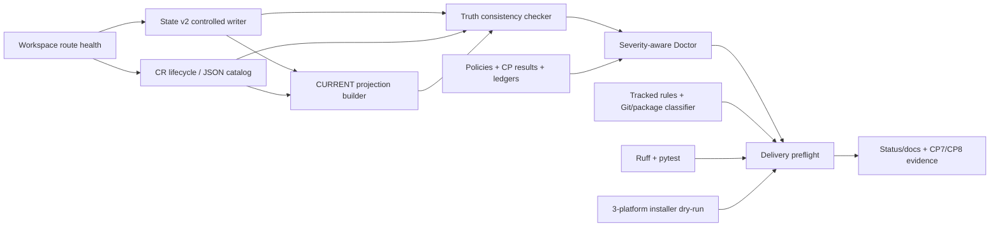

# CR-047 Workflow Truth and Delivery Governance HLD

## 修订记录

| 版本 | 日期 | 修订人 | 变更要点 |
|---|---|---|---|
| 1.1 | 2026-07-14 | host-orchestrator-inline / meta-se | CP3 R2：SC-WT-04 改为 `B0_pre/B0_cp7`；ST-WT-007 增加对象身份制 hash firewall 与子 CR 路由；新增叠加式 CP7/CP8 结论上限及 DQ-05/06。 |
| 1.0 | 2026-07-13 | host-orchestrator-inline / meta-se | 建立 CP3 候选架构、模块契约、失败路径、场景模拟、风险、3-Wave 落地与四项人工决策。 |

## 1. 问题定义与目标

### 1.1 问题

同一源码/artifact commit 在不同设备仍可能得到不同治理结论：State/CR/CURRENT 缺跨源校验，内部 docs 与本机路径混淆，Doctor 混用活动/冷历史预算，guardrail 依赖 ignored 根规则且不区分 cache，Ruff/pytest/三平台 dry-run 未形成确定门，CR-046 当前投影仍陈旧。CR-047 保持各 source owner 单写，以相对 ref、typed finding 和可重放验证证明一致。

### 1.2 可量化成功标准

| ID | 成功标准 | 验证 |
|---|---|---|
| SC-WT-01 | canonical cr-tracking blocker=0；legacy canonical YAML count=0；CR-033 candidate count=1 | `meta-flow check cr-tracking` + fixtures |
| SC-WT-02 | State/CR/CURRENT 关键 scalar/ref conflict count=0；closed/missing active CR fixture 100% 拒绝 | state/current consistency tests |
| SC-WT-03 | 内部产品/设计/质量 canonical writable copy count=1；clean clone link health=ok | workspace clean-clone fixture |
| SC-WT-04 | `B0_pre.observed=21` 仅作历史回归锚；CP7 开始采集动态 `B0_cp7`。终态 `blocking_active=0`、`unclassified=0`，每个 observed 对象有 lifecycle/read class+remediation ref，全部 delta 可解释；active/default-required 超预算仍为 blocker | Doctor report + baseline/delta fixtures |
| SC-WT-05 | Quality Model read-expansion source error=0；6 个历史 provenance 缺口全部有 correction/unavailable 解释 | quality/workflow Doctor |
| SC-WT-06 | clean archive guardrail exit=0；tracked/package cache fixture 100% 阻断；ignored-only cache 不永久阻断 | archive/local-tree fixtures |
| SC-WT-07 | Ruff findings=0；pytest 至少 377 tests + 70 subtests，failure=0 | `uv run` lint/test |
| SC-WT-08 | Codex/Claude/Qoder project full dry-run 3/3 exit=0，均显式 `--project-dir .` | installer matrix |
| SC-WT-09 | CR-046 7/7 Story 为 implemented + PASS_WITH_RISK；陈旧 CP2/0-implemented 声明=0；平台 receipt/独立 QA 风险仍 OPEN | evidence/status cross-check |
| SC-WT-10 | backup touched path count=0；quant-lab touched path count=0；历史原件未经无依据改写 | Git/path/hash audit |

## 2. 范围与约束

### 2.1 In Scope

- State/CR/CURRENT 关系与投影顺序；外置 `process` 与内部 `process/docs/**` 路由。
- Doctor severity/lifecycle/read、Quality source、read/run recovery。
- tracked rule/generated wrapper/cache、Ruff/pytest/installer preflight。
- README 非交互示例与 CR-046 current projection。

### 2.2 Out of Scope 与相邻边界

| 相邻对象 | 本 CR 不做 | 归属 / 触发条件 |
|---|---|---|
| Platform receipt producer | 不宣称平台已签发真实 receipt | 新平台证据和独立授权后 follow-up |
| CR-033 runtime trace | 不激活 OpenTelemetry/SaaS/runtime | 用户给出 C0 target 和运行授权后新 CR |
| CR-046 chronology | 不倒填原始 CP/Story/receipt/运行时间；不按目录前缀猜测 protected object | 只追加 correction/status projection；必须修改原件时立即拆子 CR |
| 独立 QA / platform attestation | 不把 inline fallback 或 fixture 写成独立/平台证明 | 新证据只解除对应风险；其他继承风险继续限制结论 |
| 用户 prelink backup | 不读、不删、不迁移、不修改 | 永久排除本 CR |
| quant-lab artifacts | 不修改业务状态、CR、ledger | 属于另一项目 owner |
| Git delivery | 不 commit、不 push | 需要用户另行明确授权 |

### 2.3 约束

- Python 命令仅使用 `uv run`；State 仅用 controlled writer，CR lifecycle 仅用 status-sync。
- process route 不健康时 fail-closed；所有 refs 使用 project-relative path。
- 历史证据修正 append-only，无法恢复即 `legacy/unavailable`，不伪造 PASS。
- CP3 后只允许 Story planning/设计；CP5 前禁止实现。

## 3. Architecture Gray Areas

| Gray Area | 已知事实 | 未决选择 | 推荐 | 状态 |
|---|---|---|---|---|
| AGA-WT-01 Truth ownership | State、CR、CURRENT 语义不同；当前缺跨源校验 | source-owned graph 或新总状态 | source-owned graph + read-only relation check | pending CP3-DQ-01 |
| AGA-WT-02 Internal docs route | artifact 已是 canonical；根内部 docs 在 clean clone 不稳定 | process-only 或兼容 symlink | `process/docs/**` only | pending CP3-DQ-02 |
| AGA-WT-03 Historical quality | 活动/历史对象混合预算；历史不可改写 | lifecycle-aware 或全局阈值/截断 | lifecycle/read-aware + summary/index/hash/correction | pending CP3-DQ-03 |
| AGA-WT-04 Delivery composition | 已有 checker/guardrail/installer；缺组合契约 | 扩展现有或新 orchestrator | 扩展现有可组合 preflight | pending CP3-DQ-04 |
| AGA-WT-05 Protected originals | CR-046/047 产物同目录，原则性“不改写”无法机器证明 | 对象身份 hash firewall 或人工/前缀审查 | manifest + CP6/CP7 双验；触碰原件拆子 CR | pending CP3-DQ-05 |
| AGA-WT-06 Evidence ceiling | 当前只获 inline fallback，且五项 CR-046 风险 OPEN | 显式叠加上限或隐含处理 | CP7≤PASS_WITH_RISK；CP8≤READY_WITH_RISK | pending CP3-DQ-06 |

## 4. Advisor 综合与候选方案

用户批准 inline fallback 后，Host Orchestrator 按 product/architecture/quality/docs 四视角完成 table-first synthesis，详见 discussion log；它不代表子 Agent 或平台 attestation。共同约束是：一次 link、owner 单写、typed severity、append-only history、artifact internal docs 与显式 project-dir。

| 方案 | 描述 | 优点 | 缺点 | 结论 |
|---|---|---|---|---|
| A | In-place contract convergence | 不新增 truth/orchestrator；复用 writer、status-sync、Doctor、guardrail、installer | 需要多模块契约同步与全面回归 | 推荐 |
| B | Central governance orchestrator | 单入口可统一编排 | 新状态/配置/失败恢复面，迁移和测试成本高 | 当前拒绝；多团队/多语言后重评 |
| C | Minimal point fixes | 只修 YAML、路径、README、Ruff | 快，但不会修复 owner/历史/clean-clone 结构性矛盾 | 不推荐；仅用于紧急局部回退 |

## 5. 推荐架构

核心数据流是单向的：路由健康是所有 process 读写前置；State 和 CR catalog 各自单写；CURRENT 可重建；consistency/Doctor/preflight 都是只读判定，不能为了 PASS 反写历史输入。

## 6. 模块与集成契约

| Module | 职责 | 调用方向 / 时机 / 触发 | 输入 | 输出 | 失败 / 降级 | 调用方同步范围 |
|---|---|---|---|---|---|---|
| M-WT-01 Workspace Router | metadata/target health | Host/CLI→router；process I/O 前 | roots、project name | health、relative refs | broken/conflict BLOCKED；不建本地替代 | CLI/tests/docs |
| M-WT-02 State/CR Resolver | 归一执行态与 lifecycle | checker/builder→resolver；check/preflight | State、CR JSON/formal/ledger | active/lifecycle facts | missing/terminal active ref fail | cr_tracking/state fixtures |
| M-WT-03 CURRENT Builder | 重建发现投影 | current-refresh→builder；source 写后 | State/CR refs、paths | CURRENT/typed refs | conflict 返回 stale refs，不猜测 | current.py/CLI/tests |
| M-WT-04 Truth Checker | 校验三源关系 | state/cr/workspace→checker；refresh 后 | facts+projection | field findings/exit | blocker 非零；Markdown 仅摘要 | checker/tests/diagnostics |
| M-WT-05 Quality Classifier | severity/lifecycle/read/provenance | Doctor→classifier；all/CP7/CP8 | policies、lifecycle、contexts/results/ledgers | typed counts/findings | current-required 不明=blocking | four Doctor lanes |
| M-WT-06 Recovery/Firewall | append-only recovery、identity/hash | CP6 前捕获；CP6/CP7 双验 | formal/evidence/ledger refs、hash | correction 或 manifest verdict | 身份不明/hash 变更→阻断/子 CR | schema/ledger/fixtures |
| M-WT-07 Rule/Cache Classifier | rule/cache 输入风险 | guardrail→classifier；archive/local/package | tracked/ignore/package sets | block/warn/absent | unknown package=blocking | guardrail/install fixtures |
| M-WT-08 Composite Preflight | 串行编排既有检查 | CI/release/operator→preflight | truth/Doctor/guardrail/lint/test/install | step verdict+Run refs | blocker 终止，warning 汇总 | scripts/CI/docs/Run ledger |
| M-WT-09 Status/Docs Projector | README、projection、ceiling | verified result→projector | install/formal evidence、QA/fallback/risks | docs/status+ceiling | unavailable 带风险；无合法 QA/fallback BLOCKED | README/matrix/release docs |

## 7. 数据与规则

### 7.1 Owner 与不可变性

| 数据 | Writer | 允许更新 | 禁止 |
|---|---|---|---|
| State v2 | controlled writer | allowlisted patch + updated_at | 由 STATE.md/CURRENT 反写 |
| CR catalog | status-sync/lifecycle API | formal status/gate/readiness + ledger | YAML canonical、candidate 自动 active |
| CURRENT | current-refresh | 全量重建 | 手工业务编辑、作为 source truth |
| CP/result/ledger history | typed append/correction | 新事件、summary/index/hash | 原位伪造时序/receipt/PASS |
| Internal docs | artifact `process/docs/**` | CR-controlled revision | 根内部副本并行写 |

### 7.2 Finding 严重度

| Severity | Exit | 典型条件 | 升降级规则 |
|---|---:|---|---|
| BLOCKED/ERROR/FAIL | nonzero | route broken、truth conflict、current required over-budget、tracked/package cache、lint/test/install fail | 只有证据证明已修复才清零 |
| WARN | zero but disclosed | legacy/unavailable、pure ignored local cache、空历史 ledger（若 policy 明确） | 进入 current/package/security scope 即升级 blocker |
| INFO | zero | count/route/success evidence | 不得替代验证证据 |

## 8. 关键流程与失败路径

### 8.1 Clean clone / link

1. 检查源码/artifact root，不读 backup；从源码根 link，写 anchor+relative metadata。
2. workspace check 确认 project、target、STATE、canonical docs；普通目录/断链/conflict 立即停止并给恢复路径。

### 8.2 State / CR / CURRENT 收敛

1. resolver 读取 State v2/JSON CR catalog；active 必须 formal 且非 terminal，candidate 不驱动 active。
2. controlled writer/status-sync 更新 source，current-refresh 重建；checker 比较 change/story/context/checkpoint/status，差异非零保留上一稳定 state。

### 8.3 Historical Doctor recovery

1. 保留 `B0_pre.observed=21` 历史快照；CP7 开始采集 `B0_cp7` 的 observed/classified/unclassified/blocking_active/warning/cold。
2. 先判定 `must_read/default-read/active`，再判 lifecycle/cold；current required 严格预算，closed/cold 原件保留。
3. 生成 compact summary/index/hash 或 archive ref；缺 provenance 追加 correction/unavailable。
4. 终态解释从 `B0_cp7` 起的全部新增/删除/重分类；`blocking_active`、`unclassified` 或无法解释 delta 任一非零即失败。

### 8.4 Delivery preflight

1. truth→Doctor→guardrail；cache 按 Git/package input 判定，不只看路径名。
2. Ruff→pytest（禁 cache/bytecode）→3-platform dry-run；真实命令写 Run event，blocker 终止，warning 入 CP8。

### 8.5 ST-WT-007 protected-original firewall

1. CP6 pre-implementation 从 CR-046 formal CR、evidence index、CP/Story refs 与 ledger attribution 生成 manifest；对象身份=`source_cr + object_type + canonical_ref + provenance_ref`，SHA256 仅作完整性锚，禁止 prefix-only allowlist。
2. 允许写 current projection、TEST-MATRIX/current-status 说明、新 append-only correction/index/hash 和 CR-047 自有证据；CR-046 protected originals 仅 `read|reference`。
3. CP6 完成首验、CP7 再验；成功要求 `protected_original_hash_changes=0`、`unauthorized_cr046_path_changes=0`。
4. 身份不明或 hash 变化时停止 ST-WT-007，结论为 `BLOCKED/NEEDS_DESIGN_CLARIFICATION`，按 ADR-WT-005 拆子 CR，禁止在 CR-047 内修改原件。

## 9. 非功能设计

| NFR | 设计 | 指标 |
|---|---|---|
| Determinism | refs 相对化、CURRENT 可重建、clean archive fixture | 同 HEAD/commit 关键 verdict 差异=0 |
| Auditability | typed result/ledger、object-identity manifest、original hash、append-only correction | protected original mutation=0；prefix-only identity=0 |
| Operability | finding 含对象、字段/路径、severity、命令/route | 每个 blocker 可操作字段覆盖率=100% |
| Context efficiency | capsule-first、active/default-read strict、cold summary/index | 活动对象预算 blocker=0 |
| Security/authorization | fail-closed；receipt/runtime/credentials 分离 | 越权动作=0；伪造 fixture rejection=100% |
| Portability | `uv run`、project-relative refs、显式 project-dir | 三平台 dry-run=3/3 |

## 10. Use Case → Architecture Traceability

| Use Case | Requirements | Module / ADR | Scenario | 目标 |
|---|---|---|---|---|
| UC-WT-001 | REQ-WT-001..003 | M-WT-02..04 / ADR-WT-001 | TC-WT-001 | truth conflict=0 |
| UC-WT-002 | REQ-WT-004..005 | M-WT-01 / ADR-WT-002 | TC-WT-002 | canonical copy=1 |
| UC-WT-003 | REQ-WT-006..008,017 | M-WT-05..06 / ADR-WT-003 | TC-WT-003 | Doctor blocker=0 |
| UC-WT-004 | REQ-WT-009..010 | M-WT-07..08 / ADR-WT-004 | TC-WT-004 | clean archive pass |
| UC-WT-005 | REQ-WT-011..012 | M-WT-08 / ADR-WT-004 | TC-WT-005 | Ruff 0 + regression pass |
| UC-WT-006 | REQ-WT-013..014 | M-WT-07..09 / ADR-WT-004 | TC-WT-006 | dry-run 3/3 |
| UC-WT-007 | REQ-WT-015..016 | M-WT-06,09 / ADR-WT-003,005,006 | TC-WT-007 | 7/7 + protected hash delta=0 + READY_WITH_RISK |

## 11. 架构场景模拟

| Simulation | Given / When | Expected | 失败路由 | 结论 |
|---|---|---|---|---|
| SIM-WT-01 stale CR | State→closed CR-037；truth check | lifecycle finding 非零；不刷新 CURRENT | state recovery/new CR | PASS |
| SIM-WT-02 clean clone | 两仓 clone 后 link/check | relative route，canonical copy=1 | broken/conflict BLOCKED | PASS |
| SIM-WT-03 cold budget | closed evidence 超活动预算 | 原件+summary/index/hash/correction | required-read 保持 blocker | PASS |
| SIM-WT-04 cache/rule | archive 无 wrapper；本机 ignored cache | tracked rule pass；ignored WARN；package block | 清理/移出 package | PASS |
| SIM-WT-05 full gate | 全部组合检查通过 | exit=0、Run refs、warning 单列 | blocker 按原 route 停止 | PASS |
| SIM-WT-06 receipt unavailable | fixture 拒伪造但无 receipt | 最高 READY_WITH_RISK、风险 OPEN | 平台 follow-up | PASS |
| SIM-WT-07 protected mutation | 同目录 original 被改 | 双验失败、无 prefix 放行、拆子 CR | BLOCKED/NEEDS_DESIGN_CLARIFICATION | PASS |
| SIM-WT-08 count drift | `B0_pre=21`，评审 observed=22 | 采集 `B0_cp7`；解释 delta；active 仍阻断 | unclassified/delta 阻断 | PASS |

## 12. 风险矩阵

| Risk | P/I | 触发 | 缓解 | Owner / 决策 |
|---|---|---|---|---|
| R-WT-01 truth duplication | M/H | lifecycle enum 分叉 | canonical helper+table fixture | DQ-01 |
| R-WT-02 ref break | M/H | archive 后 ref 失效 | 先查 ref graph/hash；留 index/redirect | DQ-03 |
| R-WT-03 hidden blocker | L/H | 新 finding 默认 WARN | unknown current/package/security=blocker | DQ-03/04 |
| R-WT-04 monolith | M/M | preflight 复制判断 | typed checker 独立；组合层只编排 | DQ-04 |
| R-WT-05 hardcoded docs | M/M | 外部只读根 docs | fixture；必要时另立 generated view | DQ-02 |
| R-WT-06 Ruff drift | L/M | auto-fix 改语义 | 分批 review+full regression | ST-WT-005 |
| R-WT-07 overclaim | M/H | fixture 写成 receipt | status cross-check+OPEN risk | ST-WT-007 |
| R-WT-08 contamination | L/H | staging 含排除路径 | allowlist+touched audit | CR constraint |
| R-WT-09 firewall error | L/H | prefix 识别同目录对象 | object identity+provenance+双验 | DQ-05 |

## 13. 分阶段落地与工作量

本 HLD 保持 7 个 Story、3 个 Wave；Story 数和 Wave 数与产品 Story Map/Release Slice 一致。

| Wave | Story（数量） | 依赖 | 产出 / 完成准则 |
|---|---|---|---|
| Wave 1 — Truth and Routing | ST-WT-001,002,007（3） | CP3/CP5 | truth checker、portable route、CR-046 projection + protected manifest/hash firewall；TC-001/002/007 |
| Wave 2 — Deterministic Quality | ST-WT-003,004,005（3） | Wave 1 truth contracts | Doctor/history、rule/cache guardrail、Ruff+pytest；TC-003..005 |
| Wave 3 — Operator Usability | ST-WT-006（1） | Wave 2 preflight contract | README 3-platform dry-run/cache preflight；TC-006 |

预估复杂度为 `complex`：跨 5 个 Feature、7 个 Story、状态/历史证据/交付门三类高影响契约。实现细节、文件清单和 LLD policy 在 CP3 后由 Feature Design Matrix 与 Development Plan 决定。

## 14. HLD 拆分评估

| 拆分信号 | 判断 |
|---|---|
| Story > 5 | 是（7），需评估 |
| 独立目标/审批人/release value | 否；共享一个 clean-clone truth/quality 目标与同一 CP8 |
| 独立回滚策略 | 否；quality/preflight 依赖 truth/routing contract |
| 共享 ADR/数据 owner | 强；四项 ADR 跨多个 Story |
| 文件可并行 | 部分可；由 CP4 file owner/DAG 解决 |

结论：保持一个 CR-scoped HLD；manifest 是 ST-WT-007 验证支撑对象，不是独立 release objective。若出现独立 release/owner/rollback，或必须修改 CR-046 protected original，按 ADR-WT-005 立即切换为子 CR/HLD。

## 15. 发布、迁移与回滚

- 按 Wave 1→2→3 迁移；schema 变更须兼容读或有 migration fixture；archive/correction 前记录 hash/ref graph。
- 回滚 checker/policy/code 并恢复上一投影；已追加审计事件只能再追加 correction。
- 有用户批准的有效 inline fallback 且其他验证满足时，CR-047 CP7 最高 `PASS_WITH_RISK`；既无独立 QA 也无有效 fallback 证据时为 `BLOCKED`。
- CR046-RISK-PLATFORM-RECEIPT-UNAVAILABLE、NO-INDEPENDENT-CP7-AGENT、TOKEN-TELEMETRY-UNAVAILABLE、REAL-PILOT-UNAUTHORIZED、WORKING-TREE-ONLY 独立叠加；任一仍 OPEN 时 CP8 最高 `READY_WITH_RISK`。关闭独立 QA 风险不会自动关闭其他上限。

## 16. CP3 决策请求

请在 CP3 对 CP3-DQ-01..06 逐项确认。推荐整体接受方案 A、对象身份制 firewall、动态 Doctor 基线与叠加式风险上限；修改任一 DQ 时，HLD/ADR/蓝图必须同轮修订并追加记录。

## 17. Gotchas

- State、CR、CURRENT 的“一致”是关系成立，不是字段相同；Doctor 绿只表示 blocker=0，warning 仍须披露。
- archive 是冷读路由，不是销毁历史；移动前必须验证所有 ref 和 hash。
- Doctor observed count 可变化，但 active/default-required 超预算不能借“合法新增”降级；所有 delta 必须可解释。
- CR-046/047 同目录混居；protected-object 身份不得只靠目录前缀，hash 变化不得在本 CR 内修补。
- ignored cache 进入 staging/package 即 BLOCKING；dry-run 不证明真实 agent/model/profile 已运行。
- CP3 批准不允许修改代码；CP5 全量设计证据通过后才进入实现。
