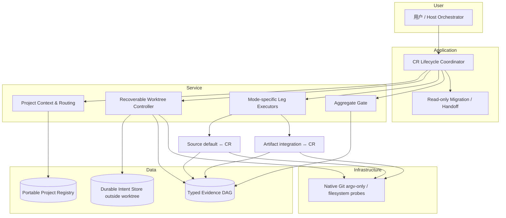

# CR-051 Artifact Worktree 高层设计

## 修订记录

| 版本 | 日期 | 修订人 | 变更要点 |
|---|---|---|---|
| 0.1.0 | 2026-07-18 | meta-se-critical | 首版：方案比较、模块契约、恢复协议、场景模拟、追溯与风险 |
| 0.1.1 | 2026-07-18 | meta-se-critical | 修正上下文和 UC-AW-004 聚合语义；补齐适用性、技术选型、Feature 触发、拆分检查与自审。 |
| 0.2.0 | 2026-07-18 | meta-se-critical | 按用户当前指令确认 DQ-01..03/ADR-AW-001..007；固化 capacity、durable store、manual-sync ops 三项 CP5/follow-up 契约。 |

## 1. 问题与目标

CR-051 要把项目文档和运行态从共享 artifact checkout 迁入项目长期 worktree，并让一次 CR 同时控制 source leg 与 artifact leg。artifact leg 的起止点是项目 integration，不是共享 artifact main；两条 leg 独立完成后再由单一聚合器给出整体结果。

用户价值是让每个项目只解析、修改并审计自己的 artifact 写入面，同时保留 source/artifact 两条 leg 的真实完成事实，避免 sibling 污染、错误关闭 CR 或把 shared main 变成单 CR 的隐式 target。

可量化成功标准：

1. 27/27 条 `REQ-AW-*` 和 15/15 条 `TC-AW-*` 均有架构落点。
2. source/artifact 两条必需 leg 只有全部 `PASS` 时整体为 `PASS`；聚合优先级固定为 `BLOCKED > FAIL > IN_PROGRESS > PASS`。
3. integration 首建必须以已观测的 `origin/main` 精确 OID create-only；已存在 integration 的路径中重建、reset、orphan 次数为 0。
4. 任一 worktree 切换必须产生 durable intent、前后新鲜观测和终态；命令退出码不得单独证明成功。
5. 自动恢复不得使用 `reset --hard`、`clean`、自动 stash、force、删分支或覆盖既有 ref，出现条件不满足时 100% 保留现场并进入 `RECOVERY_REQUIRED/BLOCKED`。
6. dry-run 的 Git/工作树写入次数为 0；所有 Git 调用保持 argv-only。

约束：沿用 CR-050 typed native Git 生命周期和授权边界；保留现有 control checkout + configurable sibling worktree；稀疏检出只优化容量，不构成安全边界；共享 main 与 integration 的同步是 CR 外人工动作。

非目标：不自动发布到共享 artifact main；不设计远端平台凭据；不把 source 与 artifact 强制为原子事务；不在本阶段创建正式 Story 卡或实施代码。

关键假设：既有 argv-only Git adapter、typed authorization 和 append-only evidence 边界可扩展；远端允许 ordinary exact ref update。当前没有阻断 HLD 的缺失信息；三个真实取舍已由用户当前指令批准，三个实现/运维契约保持 `non-blocking-open` 并路由 CP5/follow-up。

## 2. Architecture Gray Areas 与待决策项

| ID | 灰区 | 推荐方案 | 状态 / 切换条件 |
|---|---|---|---|
| AGA-CR051-01 | Git worktree 切换不是原子操作 | worktree 外 durable intent + 新鲜后观测 + 条件式自动返回；不满足则保留现场 | `CP3-CR051-DQ-01 approved`；durable store CP5 失败时禁用 auto switch |
| AGA-CR051-02 | evidence/result 多写者与 OID 自引用 | 单写 envelope、类型化 append-only payload DAG、发布绑定后置 | `CP3-CR051-DQ-02 approved`；仅同等不可变账本可触发后续切换 |
| AGA-CR051-03 | integration 首建与共享 main 同步 | 项目锁 + exact-OID create-only；main↔integration 仅显式人工同步 | `CP3-CR051-DQ-03 approved`；运维阈值只触发独立 helper CR 候选 |
| AGA-CR051-04 | worktree 拓扑与所有权 | 复用 control checkout + sibling worktree；portable registry 与 owned-path 为硬门禁 | `resolved-by-user`；发现平台不支持 worktree 时才重开 |

详细 advisor 表与回答追溯见 `process/discussions/CP3-CR051-HLD-DISCUSSION-LOG.md` 和 `process/checks/CP3-CR051-DISCUSSION-CHECKPOINT.json`；用户当前指令于 `2026-07-18T05:46:40Z` 批准 DQ-01..03 及 ADR-AW-001..007 推荐方案。该确认不授权运行。延后项仍是外部 forge adapter 与 bare control 拓扑。

## 3. 候选方案

| 方案 | 核心做法 | 优点 | 缺点 / 影响面 | 复杂度 / 成本 / 扩展性 | 风险与适用前提 | 结论 |
|---|---|---|---|---|---|---|
| A：扩展现有 typed lifecycle | 在 CR-050 生命周期旁增加 project context、recoverable worktree、mode-specific leg、aggregate gate | 最大复用 argv-only、exact OID、授权、新鲜观测和 append-only 证据；模型统一；改动边界可控 | 现有状态机需显式引入非原子切换与异构 leg；迁移期契约较密 | 中 / 中 / 可按 project 与 leg 扩展 | 必须冻结 mode override、单写和 recovery contract | 推荐 |
| B：独立 artifact-worktree 服务 | 新服务独立持久化 worktree 状态，再适配 CR-050 source leg | artifact 隔离清晰，可独立伸缩 | 重复状态机、授权、证据和恢复协议；跨服务一致性与漂移风险高；运维面扩大 | 高 / 高 / 独立部署强 | 仅 artifact 有独立团队、SLA 和发布节奏时成立 | 不选；条件成立时拆 HLD |
| C：外部 forge/脚本编排 | 由 forge workflow 或运维脚本协调双仓 | 平台可见性强 | 引入凭据与供应商依赖；本地恢复和 portable routing 变弱；超出范围 | 高 / 高 / 平台内扩展强 | 仅远端强制 PR/queue 且另获高风险授权时成立 | 条件备选 |

选择 A。它不是把两仓伪装成原子事务，而是在统一类型系统中保留各 leg 的真实语义和独立证据，再由纯聚合函数收敛结果。

### 3.1 适用性矩阵

| 维度 | 方案 A | 方案 B | 方案 C | 判定 |
|---|---|---|---|---|
| 用户目标 | 直接满足 project-first 与双 leg | 满足但引入第二套控制面 | 依赖外部平台旅程 | A |
| 项目成熟度 | 可复用既有 CR-050/native Git 边界 | 需新服务治理成熟度 | 需 forge、凭据和远端策略 | A |
| 认知负担 | 一个 typed lifecycle，多 mode | 两套 lifecycle 与 adapter | 本地/远端双控制面 | A |
| 验证条件 | 临时 bare remote + fault fixture 可闭环 | 需服务集成环境 | 需真实平台 fixture | A |
| 回退成本 | 可禁用自动 switch，保留 read-only/manual path | 拆除服务与数据迁移成本高 | 回退需撤销外部配置/凭据 | A |

## 4. 推荐架构



| 模块 | 单一职责 | 输入 | 输出 | 禁止事项 |
|---|---|---|---|---|
| Project Context & Routing | 解析项目根、source/artifact repo、control/worktree、namespace/sparse/owned-path | project id、portable registry | 规范化 context + ownership proof | 不执行 Git、不用设备绝对路径作持久身份 |
| Recoverable Worktree Controller | 执行 CP3-DC-01 切换/恢复状态机 | context、原/目标 ref 与 OID、授权 | observed terminal state、intent/evidence refs | 不以命令成功代替后观测；不强制清理 |
| Integration Bootstrap | 缺失时 create-only 创建 integration | project lock、fresh `origin/main` OID | created/already-exists/conflict | 已存在时不 reset/recreate/orphan |
| Mode-specific Leg Executors | 按 source/artifact 模式执行 begin/finish | typed leg request | 独立 leg result/evidence | artifact leg 不触碰共享 main |
| Aggregate Gate | 纯函数收敛必需 leg | fresh required-leg results | 单一 aggregate result | `PARTIAL` 不得作为终态成功 |
| Evidence DAG Writer | 单写 envelope、追加类型化 payload | observations/results | immutable refs + later publication binding | 不形成 OID 自引用，不覆盖旧证据 |
| Migration / Handoff | 只读生成迁移计划与人工步骤 | legacy layout + target context | manifest/plan | 不自动搬移、链接、切分支或同步 main |

调用方向固定为 Coordinator → Routing/Controller/Executors/Gate；Executor/Controller → Native Git 和 Evidence Writer；Gate 只读 leg result。下层不得回调 Coordinator，不得由 migration 绕过授权直接调用 Git。

### 4.1 技术选型与理由

| 选型 | 理由 | 拒绝/降级路径 |
|---|---|---|
| 既有 typed Python domain + schema validation | 延续 CR-050 contract，便于纯函数和 fixture 验证 | schema 不可向后兼容时在 CP4/Feature Design 阻断 |
| native Git argv-only adapter | 保留 exact OID、fresh observation 和无 shell-string 安全边界 | 远端强制 PR/queue 时切 forge adapter 后续 CR |
| worktree 外 append-only durable journal | 崩溃后仍能恢复 intent，且不受目标 checkout 中间态影响 | 无可靠持久化时禁用自动 switch |
| project-scoped local lock + remote exact-OID postcheck | 同时覆盖本地单写与远端竞态，不虚构跨仓事务 | 无法取得锁或 postcheck 不确定时 `BLOCKED` |
| pure aggregate function | 结果可复算，且不会在判定时触发 Git mutation | 输入 correlation 不完整时不投影 workflow |

## 5. 核心状态机与失败路径

### 5.1 CP3-DC-01：recoverable worktree switch

```text
REQUESTED
  -> PRECHECKED(identity, lock, clean, no-git-op, original/target refs+OIDs, permission)
  -> CAPACITY_PROVED(profile + upper_bound + 1.5x safety + fallback eligibility)
  -> INTENT_DURABLE(outside target worktree)
  -> SWITCH_IN_PROGRESS
  -> POST_OBSERVED(symbolic HEAD, OID, registration, clean)
  -> COMPLETED

任一步异常 -> FRESH_ERROR_OBSERVATION
  -> 条件式 RETURN_TO_INTEGRATION -> ROLLED_BACK
  -> 或 PRESERVE_WORKTREE_AND_CR_BRANCH -> RECOVERY_REQUIRED/BLOCKED
```

空间主路径必须证明 enumeration coverage、确定性 upper bound 与 `1.5x` safety factor；无权限、无法枚举、误差界未知均 fail closed。512MiB 只在 CP5 bounded-profile fixture 证明 `1.5x upper_bound <= 512MiB` 且 false-safe/underestimate 均为 0 时作为保守 floor/fallback；否则禁用 auto switch，未知 repo 不得静默放行。

intent store 位于目标 worktree 外，只用 store-local temp 执行 write、file fsync、atomic replace、parent-dir fsync、checksum/readback；任一步失败都在 Git mutation 前 `BLOCKED`。跨设备不得依赖 rename；CP5 必须覆盖 ENOSPC、EACCES、fsync/replace、torn/corrupt record、process kill、cross-device path，并证明恢复幂等。自动返回 integration 仍只在 clean、无 Git operation、original OID 稳定且权限/空间复检通过时允许。

### 5.2 Integration bootstrap

在项目锁内 fetch/observe `origin/main`，记录 exact OID；若 integration 不存在，以 create-only compare-and-set 创建；若并发创建或值冲突，则重新观测并分类为 `already-exists-compatible` 或 `BLOCKED`。存在路径只观测，不做对齐。

### 5.3 双腿与聚合

source leg 从 source default 开始/完成；artifact leg 从 project integration 开始/完成。聚合器仅消费当前 attempt 的 required-leg terminal/progress result，按 `BLOCKED > FAIL > IN_PROGRESS > PASS` 计算；任何缺失/陈旧 leg 视为 `IN_PROGRESS` 或 `BLOCKED`，不能得出 `PASS`。

### 5.4 Manual sync

共享 `main ↔ integration` 是 CR 外命令：显式选择方向、要求无活动 artifact CR、授权/锁/clean/新鲜 OID 前检、dry-run 预览、执行后新鲜观察。冲突保持现场并阻断，不替 CR 自动发布。

每次 manual-sync 记录频率、人工耗时和阻塞原因；单项目每周 `>=3` 次且连续 `4` 周，或中位耗时 `>10` 分钟，或可避免调度阻塞率 `>5%`，任一触发只创建独立“条件式同步助手”CR 候选，CR-051 不自动同步。

## 6. 关键接口契约

| 契约 | 最小字段 | 成功判据 | 降级 / 失败 |
|---|---|---|---|
| `ProjectContext` | project_id、repo identities、control/worktree paths、branch roles、ownership refs | identity 与 owned-path 一致 | context invalid，禁止 Git |
| `SwitchIntent` | operation_id、attempt、original/target ref+OID、capacity proof、phase、checksum | worktree 外 store-local temp 经 fsync/atomic replace/dir-fsync/readback 后 durable | 任一步失败即不切换；跨设备不依赖 rename |
| `LegResult` | operation_id、attempt、leg_kind、status、observed ref/OID、evidence refs | fresh 且 schema/identity 匹配 | 陈旧/错 attempt 不聚合 |
| `AggregateResult` | required legs、precedence、decision、input refs | 纯函数可复算且仅全 PASS 为 PASS | 输入缺失禁止成功 |
| `BootstrapResult` | observed origin/main OID、expected absence、actual ref/OID | create-only 后值等于 exact OID | 冲突重新观察后 BLOCKED |
| `MigrationManifest` | source/target mapping、prechecks、manual steps、rollback guidance | 只读、无副作用 | 不确定项列为人工步骤 |

## 7. 场景模拟

| Use Case | 模拟 | 关键路径 | 预期 |
|---|---|---|---|
| UC-AW-002 | artifact CR 开始，integration 尚不存在 | 路由 → 锁 → fresh origin/main OID → CAS create-only → durable intent → switch → post-observe | `PASS`；integration 精确指向观测 OID；共享 main 未被 CR 操作 |
| UC-AW-003 | source leg 已 PASS，artifact switch 后检查失败且自动返回条件不满足 | 两腿独立记录 → fresh error observation → 保留 worktree/CR branch → artifact `BLOCKED` → aggregate | `BLOCKED`；source PASS 不被抹除；无强制恢复 |
| UC-AW-004 | 同一 logical attempt 的 source/artifact required legs 都有 matching terminal result | correlation/required-set/mode-target 校验 → 两腿均 `PASS` → aggregate → workflow projection | overall=`PASS`；artifact completion target 仍是 integration；shared main mutation=0 |

补充失败模拟：人工请求 integration→main 但存在活动 artifact CR 时，manual-sync precheck 返回 `BLOCKED` 且零 Git 写入；空间估算失败在 intent 前 fail closed；命令返回 0 但 symbolic HEAD/OID 不匹配时判 `FAIL/BLOCKED`；重复 resume 只追加 fresh observation，不重复创建 ref。

## 8. 需求与测试追溯摘要

| 范围 | 架构落点 | 验证主题 |
|---|---|---|
| REQ-AW-001..003 | Routing、ProjectContext、portable registry | 项目优先布局、身份与所有权 |
| REQ-AW-004..007 | Worktree Controller、Bootstrap、durable intent | topology、create-only、切换/恢复 |
| REQ-AW-008..011 | Mode-specific Legs | source default 与 artifact integration 独立语义 |
| REQ-AW-012 | Aggregate Gate | 优先级、全腿 PASS、PARTIAL 非终态 |
| REQ-AW-013 | 所有 mutator 的 dry-run 契约 | 零副作用、计划可复核 |
| REQ-AW-014..015 | Migration/Handoff | 只读清单、人工迁移与恢复说明 |
| REQ-AW-016 | Evidence DAG Writer | 单写、追加、fresh refs、无自引用 |
| REQ-AW-017 | 分层验证接口 | unit/fixture/integration/manual 分层 |
| REQ-AW-C001..C005 | Authorization + hard prechecks + prohibited-op policy | 权限、clean/no-op、空间、禁止强制命令 |
| REQ-AW-NF001..NF005 | typed schema、portable paths、isolated worktree、argv-only、idempotency | 确定性、可移植、隔离、安全调用、恢复幂等 |

15 个 `TC-AW-*` 由以下验证簇完整覆盖：routing/ownership（3）、bootstrap/worktree switch/recovery（4）、source/artifact legs 与 aggregate（3）、manual sync/dry-run（2）、evidence/idempotency（2）、migration handoff（1），合计 15。CP4 应把每个 TC 展开到具体 Story/fixture；本 HLD 不替代 TEST-MATRIX。

## 9. NFR 与验证策略

| NFR | 指标 | 验证 |
|---|---|---|
| 确定性 | 相同 fresh inputs 的 aggregate/bootstrap 决策 100% 一致 | 纯函数与竞态 fixture |
| 可恢复性 | 每个 mutation attempt 有 1 个 checksum/readback 通过的 durable intent；持久化失败前 Git mutation=0 | ENOSPC/EACCES/fsync/replace/corruption/kill/cross-device fault injection |
| 安全性 | 禁止命令出现次数 0；Git shell-string 调用 0 | argv capture + dangerous-command scan |
| 隔离性 | CR 期间 artifact shared main 写入 0；owned-path 外写入 0 | repo fixture + path audit |
| 幂等性 | begin/finish/resume 重放不新增语义重复 ref，不覆盖证据 | repeated-run fixture |
| 可移植性 | 持久记录中的设备绝对路径 0 | schema validation |
| 可观察性 | leg/aggregate 决策 100% 引用 fresh observation/evidence | evidence graph validator |

验证分层：单元层覆盖状态转移和聚合；fixture 层覆盖 Git refs/worktrees/并发 CAS/磁盘与权限失败；集成层覆盖 source+artifact 双腿；人工层仅覆盖真实平台凭据、跨设备迁移和共享 main 同步授权。

### 9.1 Feature 级实现设计触发与下沉边界

| Feature | 判定 / 触发 | CP3 后下沉内容 | 建议 LLD policy |
|---|---|---|---|
| FEAT-AW-01 Routing | `required`：portable schema、legacy/new write conflict | schema、错误枚举、legacy dual-read fixture | `full-lld` |
| FEAT-AW-02 Worktree | `required`：非原子状态机、锁、空间/权限、恢复 | phase transition、lock protocol、fault injection | `full-lld` |
| FEAT-AW-03 Legs | `required`：CR-050 override、跨 repo/authz/OID contract | mode dispatch、leg request/result、cleanup proof | `full-lld` |
| FEAT-AW-04 Aggregate | `required`：single writer、correlation、PARTIAL 语义 | aggregate schema、projection guard、DAG validator | `full-lld` |
| FEAT-AW-05 Migration | `required`：manifest 与 deny-mutation contract | manifest schema、人工 checklist、rollback handoff | `technical-note`；若增加 mutation 升为 `full-lld` |

HLD 不展开字段级 schema、函数签名、锁实现、空间估算算法、权限 token 结构和 fixture 命令；这些分别进入 CP3 后的 Feature DESIGN / TEST-PLAN / TASKS 与 Story 设计证据。五个 Feature 当前均需 `implementation-design`，但本阶段不创建这些文件。

## 10. HLD 边界与初步落地

不拆多个 HLD：虽然核心能力包含五个 Feature，但它们共同交付一个“project-first artifact Git/worktree lifecycle capability”，共享 ProjectContext、SwitchIntent、Evidence DAG、聚合规则、ADR 集和发布价值；拆分会复制安全不变量并制造契约漂移。

| 拆分检查信号 | 当前观察 | 判定 |
|---|---|---|
| 核心产物 / 职责跨层 | 一个 lifecycle capability；不设计 host 全局编排机制 | 反信号 |
| Story 数与交付顺序 | 候选能力切片为 5，必须同一安全 contract 收敛 | 反信号 |
| ADR 分簇 / 双向引用 | routing、switch、leg、aggregate 共用 context/evidence/target override | 反信号 |
| 独立部署 / reviewer 差异 | 当前同一仓库、同一 CP3/CP7 评审面 | 反信号 |

只有 artifact 生命周期需要独立部署/独立团队 SLA，或外部 forge 成为唯一执行面时，才重开拆分决策并另走 CR。

本阶段仅建议 5 个候选 Story，不创建正式卡：

| 候选 | 设计证据建议 | 初步 Wave | 完成边界 |
|---|---|---|---|
| ST-AW-001 Context/route/schema | full-lld | W1 | portable context 与 schema |
| ST-AW-002 Worktree/bootstrap/recovery | full-lld | W2 | CP3-DC-01 与 CAS |
| ST-AW-003 Mode-specific legs | full-lld | W3 | 两腿独立终态 |
| ST-AW-004 Aggregate/evidence | full-lld | W3 | 单一聚合与证据 DAG |
| ST-AW-005 Migration/handoff | technical-note；若增加 mutation 则升 full-lld | W4 | 只读 manifest/人工步骤 |

W1 → W2 → W3 → W4；W3 的两个 Story 在共享 schema 冻结后可并行，但 Evidence Writer 保持单写。正式 FEATURE-DESIGN-MATRIX、TASK-ID 与 Story 卡由 CP3 通过后的 story-planning 生成。

## 11. 风险、切换与开放项

| ID | 风险 | 等级 | 应对 | 状态 |
|---|---|---|---|---|
| R-AW-01 | 非原子切换留下半完成现场 | 高 | durable intent、fresh observation、条件恢复、保留现场 | DQ-01 已批准；O-AW-01/02 待 CP5 |
| R-AW-02 | 多写者/自引用破坏证据真实性 | 高 | 单写 envelope、payload DAG、后置 publication binding | DQ-02 已批准；CP5 证明单写 |
| R-AW-03 | integration bootstrap/sync 竞态覆盖 ref | 高 | project lock、exact-OID create-only、人工同步 | DQ-03 已批准；O-AW-03 运维观察 |
| R-AW-04 | 稀疏检出被误当安全边界 | 中 | portable registry + owned-path 硬校验 | 已缓解 |
| R-AW-05 | CR-050 paired-default 语义误套 artifact | 高 | mode-specific applicability matrix 与契约测试 | 已缓解，CP4 复核 |
| R-AW-06 | 磁盘估算不可靠导致切换中断 | 中 | estimation failure fail closed，阈值取 max(512MiB,1.5×估算) | 已设计 |

| Open ID | 分类 | 细节 | Owner / 重访条件 |
|---|---|---|---|
| O-AW-01 | `non-blocking-open` | capacity estimator：deterministic upper bound、1.5x safety、512MiB bounded fallback、0 false-safe/underestimate | FEAT-AW-02 CP5 fixture；失败则禁用 auto switch |
| O-AW-02 | `non-blocking-open` | durable store：store-local temp、fsync/replace/dir-fsync/checksum/readback 与故障恢复 | FEAT-AW-02 CP5 fault matrix；失败则 mutation 前 BLOCKED |
| O-AW-03 | `non-blocking-open` | manual-sync 频率/耗时/阻塞成本 | 达任一阈值只创建条件式同步助手 follow-up CR candidate |

## 12. Gotchas

1. `git switch` 返回 0 不等于成功，必须重新读取 symbolic HEAD、OID、registration 和 clean 状态。
2. `PARTIAL` 是效果/进度描述，不是整体成功终态。
3. integration 已存在时不得“顺手对齐”到 `origin/main`；同步必须走 CR 外人工命令。
4. sparse-checkout 不证明目录所有权；任何 mutation 都必须先通过 registry 与 owned-path。
5. rollback 不是强制恢复；条件不满足时正确结果是保留现场并阻断。
6. 证据内容若直接嵌入自己的最终 OID 会形成自引用；应以 payload DAG 加后置绑定解决。

## 13. HLD 自审与 CP3 推荐结论

| 自审项 | 结果 | 证据摘要 |
|---|---|---|
| 两个以上真实方案与适用性 | PASS | 方案 A/B/C 具备不同控制面、成本与切换条件 |
| 蓝图/领域/依赖承接 | PASS | 五 Feature、对象 owner、允许/禁止方向均回链对应文档 |
| CP3-DC-01 | PASS | §5.1、UC-AW-003、NFR 与 R-AW-01 明确消费，未宣称原子 |
| UC 追溯与模拟 | PASS | UC-AW-002/003/004 全部走通；15 个 TC 分簇覆盖 |
| NFR/失败/降级 | PASS | 确定性、恢复、安全、隔离、幂等、可移植、可观察均量化 |
| 拆分与下游边界 | PASS | 拆分反信号、Feature 触发与不提前建 Story/实现均明确 |
| 决策与开放项分类 | PASS | DQ-01..03/ADR-AW-001..007 已批准；O-AW-01..03 non-blocking；0 blocker |

方案 A 与 `CP3-CR051-DQ-01..03`/ADR-AW-001..007 推荐决策已由用户当前指令批准；HLD 状态为 `confirmed`。Host 可回填 CP3 approval 后进入 CP3 后规划，但本批准不授权任何真实 Git/worktree/link/ref/remote/main-sync mutation；O-AW-01..03 必须在 CP5/follow-up 路由闭环。
