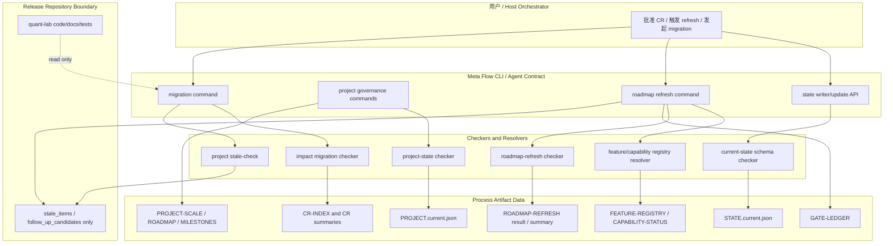
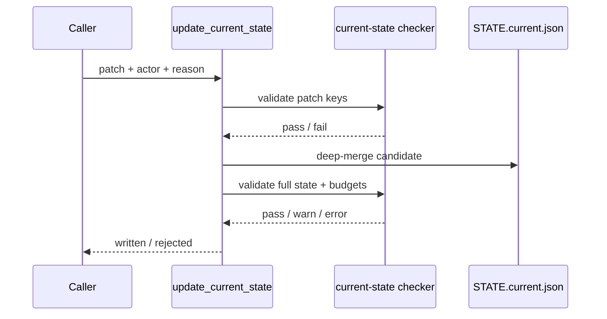
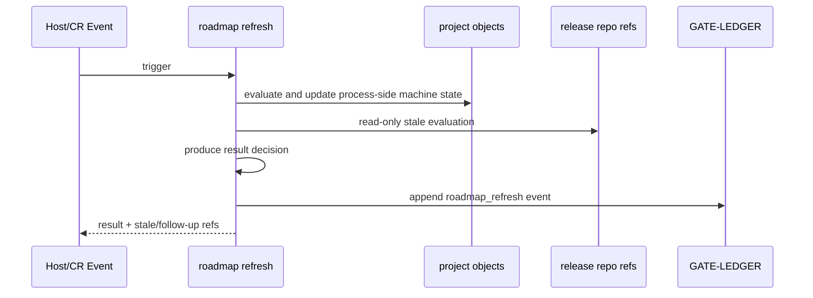

# 高层设计（HLD）：Meta Flow Project Governance and State Enforcement

## 修订记录

| 版本 | 日期 | 修订人 | 变更要点 |
|---|---|---|---|
| 1.0 | 2026-07-02 | meta-se | 基于已批准实施计划输出 HLD、架构灰区、候选方案、推荐方案、风险、ADR 和分阶段落地建议 |
| 1.1 | 2026-07-02 | host-orchestrator | 回写 ADR-PG-006 到 HLD ADR 候选表；将 Story / CR 编号映射决策纳入 CP3 待确认项 |

## 1. 问题定义

### 问题陈述

Meta Flow 的长期项目治理已经出现两个相互放大的风险：一是 `STATE.current.json` 作为默认机器入口缺少强制 allowlist 和预算，导致 agent 可绕过 writer 写入重型字段；二是项目级 roadmap、capability、impact surface、migration readiness 缺少标准化对象，导致 quant-lab 等长期项目的状态、影响面和后续事项无法稳定追踪。

### 核心价值

本设计把“轻量当前状态”和“项目级治理状态”拆开，并用 registry、独立 roadmap refresh result、stale-check 和 FU-RF follow-up 形成可审计、可迁移、可长期维护的治理闭环。

### 目标

| 优先级 | 目标 | 度量方式 |
|---|---|---|
| P0 | `STATE.current.json` 进入 allowlist + budget + controlled update 模式 | unknown 顶层字段在 audit 阶段 WARN、enforce 阶段 ERROR；`write_current_state()` 和内部 active change 更新均走校验 |
| P0 | agent 写契约禁止直编 current state | `delivery/rules/AGENT-SKILL-CONTRACT.md`、state-router skill、README 等契约均明确受控写入口 |
| P1 | 建立项目级轻量治理对象 | `process/project/`、`PROJECT.current.json`、`PROJECT-SCALE.yaml`、`ROADMAP.yaml`、`MILESTONES.yaml` 可被 checker 校验 |
| P1 | capability / feature refs 和 impact surface 归一 | refs 只引用 registry；路径类影响进入 `affected_paths`；unknown surface audit WARN / enforce ERROR |
| P1 | roadmap refresh 成为独立可验证机制 | `ROADMAP-REFRESH-*.result.json` 使用独立 checker；过程归档库自动更新，发布库只输出 stale / follow-up |
| P2 | quant-lab 迁移作为真实样本验证 | quant-lab current state、capability、impact surface、roadmap stale report 均有 dry-run / migration evidence |

### 成功标准

- [ ] `STATE.current.json` v2 allowlist 覆盖计划中列出的 15 个核心 / 可选字段，未知字段 enforce 模式写入失败。
- [ ] `next_action`、`source_refs`、`open_risks`、`authz_policy_refs`、`active_context_ref`、`pending_checklist_path`、`project_state_ref` 至少 7 类字段预算可被测试覆盖。
- [ ] `PROJECT.current.json` 总量预算不超过 16KB，且 `STATE.current.json` 只保存 `project_state_ref`。
- [ ] `impact_surface` 至少拆分为 14 个有限治理面枚举、`affected_paths`、`feature_refs`、`capability_refs` 四类语义。
- [ ] ROADMAP-REFRESH result 至少支持 `NO_CHANGE`、`UPDATED`、`UPDATED_WITH_DOC_IMPACTS`、`BLOCKED`、`FAILED` 五类 decision。
- [ ] quant-lab 迁移不会自动修改发布库代码、tests、`docs/design/*`、`docs/quality/*`、`docs/release/*`。

### 约束

| 类型 | 约束内容 |
|---|---|
| 范围 | 本轮只设计 meta-flow 自身项目治理能力，不修改产品场景文档，不实现代码 |
| 状态入口 | 默认机器状态入口必须是 `process/state/STATE.current.json`，不能回退到完整 `process/STATE.md` |
| 输出边界 | roadmap refresh 自动写入只覆盖过程归档库，不跨仓修改 quant-lab 发布库 |
| 兼容性 | 历史 CR impact_surface 漂移不能在普通 `cr check` 中刷屏，应通过 migration report 处理 |
| 安全 | 不读取 credential，不做 runtime / production write，不触发 trading |

### 非目标（Out of Scope）

- 不新增第二套上下文治理、result、ledger 或 capability 命名体系。
- 不新增 hot/warm/cold 术语层，不新增五档项目规模矩阵。
- 不直接修改 `process/policies/GATE-PROFILES.json`。
- 不复用 CP result checker 校验 ROADMAP-REFRESH。
- 不在 quant-lab migration 中自动修改 quant-lab 发布库正式代码、测试或正式文档。

### 关键假设

- 已批准实施计划是本轮设计的范围真相源。
- 后续正式 CR 会引用本文档和实施计划作为设计基线。
- project governance 的过程对象可以位于 process artifact repository，且目标项目发布库需要单独授权。
- registry YAML 可以成为 feature / capability refs 的机器真相源。

### 缺失信息

| 优先级 | 缺失信息 | 影响范围 | 决策所需时限 |
|---|---|---|---|
| REQUIRED | 后续正式 CR 编号与拆分是否采用计划中的 CR-A 到 CR-H | Story / CR tracking 命名 | Story 拆分前 |
| REQUIRED | `meta-flow ledger compact` 与 `meta-flow event compact` 的最终命令名 | FEAT-PG-002 CLI 设计 | FEAT-PG-002 LLD 前 |
| OPTIONAL | project stale-check 命令采用 `meta-flow project stale-check` 还是 `meta-flow check project-stale` | FEAT-PG-008 UX | FEAT-PG-008 LLD 前 |

## 2. 架构灰区与方案形成记录

本轮没有新开用户交互问题；以下灰区由已批准实施计划给出结论，保留为 CP3 / CR 分解可追踪证据。

| 灰区 ID | 关键问题 | 为什么会影响架构 | 影响面 | 推荐讨论顺序 | canonical refs | 状态 |
|---|---|---|---|---|---|---|
| AGA-PG-001 | current state 是黑名单补丁还是 allowlist enforcement | 决定默认入口是否能长期保持瘦身，也决定 writer/checker/API 边界 | 状态、契约、验证、安全 | 1 | 实施计划 §5 | resolved：选 allowlist + budget |
| AGA-PG-002 | project state 是否进入 current state | 决定项目级治理对象和 current state 的边界 | 数据、模块、维护成本 | 2 | 实施计划 §7.2 | resolved：独立 `PROJECT.current.json`，current 只存 ref |
| AGA-PG-003 | roadmap refresh 是否跨仓自动写发布库 | 决定权限边界、回滚策略和 stale/follow-up 形态 | 安全、运行授权、发布、验证 | 3 | 实施计划 §3、§11 | resolved：只自动写过程归档库 |
| AGA-PG-004 | capability / feature refs 是否允许自由字符串 | 决定迁移可信度和冲突检测能力 | 数据、依赖、验证 | 4 | 实施计划 §8、§9 | resolved：必须引用标准 registry |

### Advisor Table

| Option | Pros | Cons | Impact Surface | Recommendation | Assumptions / When to switch |
|---|---|---|---|---|---|
| A. P0 current-state enforcement 先行，再叠加 project governance / roadmap refresh | 最大化降低默认入口污染风险；后续对象有清晰依赖；quant-lab 迁移有稳定前置 | 初期 Story 数较多，需要更多 schema/checker 工作 | state、context、project-governance、roadmap、changes | 推荐 | 适用于长期治理和多项目迁移；若只修一次性状态文件可降级 |
| B. 先做 roadmap / project objects，再补 current-state enforcement | 较快展示 roadmap 能力 | project state 可能建立在不可信 current state 上，返工概率高 | project-governance、roadmap、state | 不推荐 | 仅当 current state 污染风险已由外部机制控制时切换 |
| C. 只修 quant-lab 样本，不建设通用治理机制 | 短期成本最低 | meta-flow 自身问题不闭环；后续项目重复漂移 | migration、state、quality | 不推荐 | 仅适用于一次性救火，不适用于本计划 |

## 3. 候选架构方案对比

### 方案 A：Enforcement-first 分层治理

**核心思路**：先冻结默认机器状态入口，再建立项目级 refs-only 状态、registry-backed refs、roadmap refresh 和 quant-lab migration。

| 维度 | 评估 |
|---|---|
| 优点 | 默认入口可信；Feature 边界清楚；过程库与发布库边界清楚；适合长期迁移 |
| 缺点 | 需要新增多个 schema/checker 和文档契约 |
| 复杂度 | high |
| 实施成本 | L |
| 可扩展性 | 高，可支持 meta-flow 和 quant-lab 后续项目治理 |
| 风险 | allowlist 误伤、registry 初始化成本、checker 增多 |
| 适用前提 | 用户接受分阶段落地和 audit -> enforce 灰度 |

### 方案 B：Project-governance-first 快速路线

**核心思路**：先新增 `PROJECT.current.json`、ROADMAP、MILESTONES 和 refresh result，再回补 current state enforcement。

| 维度 | 评估 |
|---|---|
| 优点 | 较快产生项目治理对象 |
| 缺点 | current state 仍可能被污染；project_state_ref 进入 allowlist 前链路不稳定 |
| 复杂度 | medium |
| 实施成本 | M |
| 可扩展性 | 中，后续仍需 P0 返工 |
| 风险 | 默认入口与 project object 口径漂移 |
| 适用前提 | current state 暂无污染或可接受短期手工治理 |

### 方案 C：Migration-first 样本驱动路线

**核心思路**：直接清理 quant-lab current state 和 impact_surface，以样本倒逼通用机制。

| 维度 | 评估 |
|---|---|
| 优点 | 快速暴露真实样本问题 |
| 缺点 | 缺少通用 schema/checker 前置，容易把样本特例固化进机制 |
| 复杂度 | medium |
| 实施成本 | M |
| 可扩展性 | 低到中 |
| 风险 | quant-lab 发布库边界、capability registry、impact migration 互相牵制 |
| 适用前提 | 仅用于 Spike，不适合作为实施主线 |

**推荐方案**：方案 A。理由：它把最核心的不变量 `STATE.current.json` 先收紧，再允许项目治理对象和迁移机制依赖这个可信入口。

## 4. 推荐方案总览

**复杂度模式**：`complex`

| 判定维度 | 依据 | 结论 |
|---|---|---|
| 需求规模 | 覆盖 P0/P1/P2、9 个 Feature、多个 schema/checker/CLI/契约 | complex |
| 状态流转 | audit -> enforce、refresh decision、migration lifecycle、stale lifecycle | complex |
| 数据边界 | current state、project state、registry、CR impact、roadmap result、ledger | complex |
| 平台适配 | meta-flow 自身 process artifact 与 quant-lab 发布库边界 | complex |
| Story 拆解 | 计划建议 CR-A 到 CR-H，至少 8 个实现切片 | complex |

**关键架构风格**：文件系统契约 + schema/checker + refs-only state + process-only cascade。

**核心能力边界**：

- 做：current state enforcement、project governance objects、registry-backed refs、impact normalization、roadmap refresh、FU-RF、stale-check、quant-lab migration readiness。
- 不做：跨仓自动修改发布库、第二套 result/ledger/context 体系、未授权 runtime 或 production write。

## 5. 适用性矩阵

| 适用性维度 | 当前项目判断 | 推荐方案如何适配 | 不适配信号 | When to switch |
|---|---|---|---|---|
| 用户目标 | 要长期可跟踪，不要临时稿 | 正式设计文档 + Feature ID + ADR + 风险追踪 | 只需要一次性文件清理 | 切到方案 C 或小 CR |
| 项目成熟度 | meta-flow 是长期多阶段治理系统 | refs-only 状态和 schema/checker 适合长期演进 | 项目生命周期缩短到单次交付 | 降低 project governance 范围 |
| 认知负担 | 当前术语和对象已多 | 复用现有 allowed_reads、ledger、CR tracking，不新增术语层 | 维护者无法区分 project state / current state | 增加 docs 和 doctor 输出，不改变核心架构 |
| 验证条件 | 可用单元测试、schema check、dry-run、migration report | 每个 Feature 都有 checker 或 report 入口 | checker 维护成本过高 | 合并 UX，不合并 schema 语义 |
| 回退成本 | current state enforcement 误伤风险高 | audit -> enforce 灰度 | audit 阶段 WARN 过多 | 延长 audit，补 registry / allowlist，不放弃 enforce |

## 6. Use Case → Architecture Traceability

| Use Case | 支撑模块 / 组件 | 关键流程 | 异常 / 失败路径 | 验证方式 | 备注 |
|---|---|---|---|---|---|
| UC-PG-001 防止 current state 膨胀 | FEAT-PG-001 | patch -> allowlist -> budget -> write -> check | unknown / over-budget 拒绝写入 | state checker、writer tests | P0 |
| UC-PG-002 项目级 roadmap 可被默认入口引用 | FEAT-PG-003 + FEAT-PG-001 | project objects -> `PROJECT.current.json` -> `project_state_ref` | project object invalid 时不更新 current ref | project state checker | P1 |
| UC-PG-003 按项目规模提供 gate profile 默认偏好 | FEAT-PG-003 | project scale -> `PROJECT-SCALE.yaml` -> default gate profile bias | 不直接修改 `GATE-PROFILES.json`；project scale 不等于单次 CR 授权 | project scale checker、workspace tests | P1 |
| UC-PG-004 归一 capability / feature 引用来源 | FEAT-PG-004 | refs -> registry resolver -> capability / feature check | refs 缺失 blocked finding，不自动创造 ID | capability / feature checker | P1 |
| UC-PG-005 拆分治理影响面、路径和能力引用 | FEAT-PG-005 + FEAT-PG-004 | legacy impact -> migration report -> normalized fields -> registry check | unknown surface enforce 失败；历史漂移只进 migration report | impact migration tests、cr check | P1 |
| UC-PG-006 roadmap refresh 不越权改发布库 | FEAT-PG-006 + FEAT-PG-007 + FEAT-PG-008 | trigger -> process updates -> stale/follow-up candidates -> Gate Ledger | release repo changes only as stale items / FU-RF | roadmap-refresh checker、stale-check、cr-tracking | P1 |
| UC-PG-007 quant-lab 真实迁移 | FEAT-PG-009 + FEAT-PG-004 + FEAT-PG-005 + FEAT-PG-006 | dry-run -> process-side migration -> stale report -> FU-RF | 需要发布库变更时转正式 CR；registry 缺失则 blocked | migration report / state check / capability check | P2 |

## 7. 关键场景模拟

| 模拟 ID | 场景 | 输入 / 前置条件 | 推荐架构执行路径 | 预期输出 | 失败 / 回退路径 | 结果 |
|---|---|---|---|---|---|---|
| SIM-PG-001 | agent 尝试写入 `last_actions` 到 current state | P0 enforce enabled | update API 校验 allowlist -> unknown key ERROR | 写入失败，提示重型内容写 ledger / summary | audit 阶段 WARN；enforce 阶段阻断 | PASS |
| SIM-PG-002 | roadmap refresh 发现 quant-lab TEST-STRATEGY 陈旧 | ROADMAP 声明 paper readiness，测试策略仍 backtest-only | refresh result 写 `UPDATED_WITH_DOC_IMPACTS`，发布库对象进入 stale / follow-up | 过程库更新，发布库不自动改 | 生成 FU-RF 或正式 CR 候选 | PASS |
| SIM-PG-003 | impact migration 遇到 `strategy-runner` capability 字符串但 registry 未注册 | FEAT-PG-004 registry 缺项 | resolver 返回 unresolved -> migration blocked finding | 不写 `capability_refs` | 先补 registry 或创建 follow-up | PASS |

## 8. 系统架构图

## 9. 高层模块与职责划分

| 模块名称 | 类型 | 职责 | 输入 | 输出 | 依赖 |
|---|---|---|---|---|---|
| current-state schema/checker | Tool / library | 校验 allowlist、字段预算、forbidden keys | `STATE.current.json`、patch | PASS/WARN/ERROR | 无 |
| state update API | Library / CLI | deep-merge patch，写前和写后校验 | patch、actor、reason | 更新后的 current state | current-state checker |
| project governance scaffold | CLI / workspace | 创建 `process/project/` 和项目对象 | workspace root | project objects | state update API |
| registry resolver | Tool / checker | 解析 feature/capability refs | registry YAML、refs | resolved / unresolved findings | project scaffold |
| impact migration | CLI / checker | 拆分 legacy impact_surface | CR index、registry | migration report / normalized fields | registry resolver |
| roadmap refresh | CLI / checker | 刷新过程侧 roadmap/project state 并输出 stale/follow-up | CR / project events | ROADMAP-REFRESH result / Gate Ledger event | project governance、registry |
| project stale-check | CLI / checker | 检测跨对象语义陈旧 | project state、roadmap、HLD/test/release refs | stale findings | roadmap refresh |
| quant-lab migration | Migration workflow | 用真实样本验证治理机制 | quant-lab process/release refs | migration report、stale report | P0/P1 modules |

## 10. 技术选型与理由

| 选型类别 | 选择 | 备选方案 | 选择理由 | 风险 |
|---|---|---|---|---|
| 状态契约 | JSON/YAML schema + Python checker | 仅文档约定 | 可机器校验，能进入 gate | schema 演进需要兼容策略 |
| 项目对象 | `PROJECT.current.json` + `process/project/*.yaml` | 扩展 `STATE.current.json` | 保持 default current state 瘦身 | 新对象需要额外 checker |
| Registry | YAML registry | Markdown register / Python 常量 | 机器可解析，适合 migration | 需要初始化和维护 |
| Roadmap Refresh Result | 独立 result schema | 复用 CP result | 决策语义不同，避免 CP 过度泛化 | 新 checker 增加维护成本 |
| 发布库处理 | stale/follow-up only | 自动修改发布库 | 符合授权边界，避免跨仓原子事务 | 用户需要后续 CR 才能修复正式文档 |

## 11. 关键流程

### 主流程：Current State 受控更新

### 主流程：Roadmap Refresh Cascade

## 12. 非功能需求设计

| 质量特征 | 设计目标 | 实现手段 | 验证方式 |
|---|---|---|---|
| 可维护性 | current state 不承载重型状态，字段有明确 owner | allowlist、field budgets、refs-only contract | state checker、contract guardrail |
| 安全性 | 不越权读取 credential，不自动写发布库 | process-only cascade、release repo read-only stale report | authz policy refs、roadmap refresh tests |
| 可验证性 | 每个治理能力都有 checker / result / report | 独立 schema、unit tests、dry-run migration | CP / story validation |
| 兼容性 | 历史 CR 不因旧 impact_surface 直接阻断 | 历史静默 + migration report，新 CR audit/enforce | impact migration report |
| 可扩展性 | 支持 meta-flow 和 quant-lab 以外项目 | project scale、registry、roadmap objects | multi-project fixture |

## 13. 主要风险与应对

| 风险 ID | 风险描述 | 概率 | 影响 | 应对策略 | 触发信号 |
|---|---|---|---|---|---|
| R-PG-001 | allowlist 误伤存量合法字段 | 中 | 高 | audit -> enforce，先 WARN 后 ERROR | audit report unknown 字段过多 |
| R-PG-002 | `PROJECT.current.json` 成为新巨型状态 | 中 | 高 | 16KB 预算、refs-only、checker | project state 超预算 |
| R-PG-003 | capability ID 被自由创造 | 中 | 高 | registry resolver，unresolved blocked finding | migration 输出未注册 ID |
| R-PG-004 | roadmap refresh 跨仓撕裂 | 低 | 高 | process-only cascade，发布库只 stale/follow-up | result 尝试写 release repo |
| R-PG-005 | impact_surface 历史漂移导致噪音 | 高 | 中 | 历史静默 + migration report，新 CR audit/enforce | 普通 cr check 大量旧 FAIL |
| R-PG-006 | checker 数量增加导致 UX 分散 | 中 | 中 | CLI UX 可聚合，schema 语义不合并 | 用户需要运行多个命令 |

## 14. ADR 候选决策点

| ADR ID | 决策问题 | 建议决定 | 约束此决策的因素 |
|---|---|---|---|
| ADR-PG-001 | current state 校验模型 | allowlist schema + field budgets，audit -> enforce | P0 默认入口瘦身 |
| ADR-PG-002 | project state 归属 | 独立 `PROJECT.current.json`，current state 只保留 ref | P1 项目治理与 P0 瘦身边界 |
| ADR-PG-003 | roadmap refresh 写入边界 | 只自动写过程归档库，发布库只输出 stale/follow-up | 跨仓授权和回滚风险 |
| ADR-PG-004 | refs 命名策略 | feature/capability refs 必须引用 YAML registry | migration 可信度和冲突检测 |
| ADR-PG-005 | roadmap refresh checker | 使用独立 result schema 和 checker，不复用 CP result | result 语义不同 |
| ADR-PG-006 | roadmap follow-up tracking 边界 | 使用 `FU-RF` / `SP-RF` / `RA-RF`，不写 `RELEASE-CONTEXT` | 项目治理 follow-up 与发布上下文隔离；落到 FEAT-PG-007 |

## 15. 分阶段落地建议

| 阶段 | 交付物 | 里程碑标志 | 前提条件 |
|---|---|---|---|
| W1 / CR-A | STATE.current enforcement | state check 可 audit/enforce；writer/update API 生效 | 当前计划获批 |
| W2 / CR-B-C | ledger compaction、project scaffold、PROJECT.current、PROJECT-SCALE、ROADMAP、MILESTONES | project objects 可被 checker 校验 | W1 audit 可用 |
| W3 / CR-D-E | registry-backed refs、impact_surface normalization | capability / feature refs 可解析；impact migration report 可运行 | W2 scaffold 和 registry 路径确定 |
| W4 / CR-F-G | ROADMAP-REFRESH result/checker/cascade、FU-RF、stale-check | refresh result 可写过程库并输出 stale/follow-up；FEAT-PG-007 承接 ADR-PG-006 | W3 audit 通过 |
| W5 / CR-H | quant-lab migration | quant-lab state / capability / impact / stale report 通过 dry-run | W1-W4 验收完成 |

## 16. 工作量粗估

| 类别 | Story 数 | 预计 Wave 数 | 粗估工作量 |
|---|---|---|---|
| State enforcement | 3-4 | W1 | L |
| Project governance objects | 3-4 | W2 | M |
| Registry and impact migration | 4-5 | W3 | L |
| Roadmap refresh / stale / FU-RF | 5-6 | W4 | L |
| Quant-lab migration | 3-5 | W5 | L |
| **合计** | **18-24** | **5 个 Wave** | **XL** |

## 17. Feature 级实现设计触发条件

| Feature | 是否需要 Feature 设计 | 触发原因 | 建议 lld_policy |
|---|---|---|---|
| FEAT-PG-001 | required | state schema、writer API、agent contract、安全边界 | full-lld |
| FEAT-PG-002 | required | ledger retention、archive/index、审计兼容 | full-lld |
| FEAT-PG-003 | required | 新 project objects、workspace scaffold、schema budget | full-lld |
| FEAT-PG-004 | required | registry schema、migration resolver、外部样本归一 | full-lld |
| FEAT-PG-005 | required | CR impact schema migration、audit/enforce | full-lld |
| FEAT-PG-006 | required | 独立 result、checker、process-only cascade、Gate Ledger | full-lld |
| FEAT-PG-007 | required | CR tracking regex、模板、状态查询 | technical-note 或 full-lld，取决于文件影响面 |
| FEAT-PG-008 | required | 跨对象 stale 语义检查 | full-lld |
| FEAT-PG-009 | required | 真实样本迁移、发布库只读边界、dry-run | full-lld |

## 18. 下沉到 Feature 设计的内容

以下内容不在 HLD 中展开到字段级或函数级，应由 Feature DESIGN / Story LLD 承接：

- `STATE.current.json` schema 的完整 JSON schema / Python dataclass 形态。
- `update_current_state()` 的 deep-merge 冲突、删除语义、错误码。
- `PROJECT.current.json`、`PROJECT-SCALE.yaml`、ROADMAP、MILESTONES 的完整 schema。
- registry YAML 字段和 quant-lab capability 初始注册项。
- impact migration 的路径分类规则和 blocked finding 格式。
- ROADMAP-REFRESH result schema、checker 错误枚举和 Gate Ledger event 字段兼容。
- stale-check 的语义规则集和 follow-up 生成策略。
- quant-lab migration dry-run 输入、输出、回滚与人工授权边界。

## 19. 待确认问题

| 问题 ID | 问题描述 | 优先级 | 影响范围 | 负责人 | 目标答复时间 |
|---|---|---|---|---|---|
| Q-PG-001 | 后续正式 CR 编号是否采用 CR-A 到 CR-H，还是映射为 CR-037+ | RESOLVED | Story / CR tracking | host-orchestrator / user | `CP3-CR037-DQ-07` 已确认：正式 Story / evidence 使用 `CR037-Sxx`，CR-A..CR-H 仅作计划 alias |
| Q-PG-002 | ledger compact 命令最终命名 | REQUIRED | FEAT-PG-002 CLI | user / implementation owner | FEAT-PG-002 LLD 前 |
| Q-PG-003 | stale-check 命令最终命名 | OPTIONAL | FEAT-PG-008 UX | user / implementation owner | FEAT-PG-008 LLD 前 |

## 20. HLD 自审记录

| 自审项 | 结果 | 证据 / 说明 |
|---|---|---|
| Architecture Gray Areas 已前置处理 | PASS | §2；灰区由已批准实施计划决策收敛 |
| Advisor table 已影响推荐方案 | PASS | §2、§3、§4 |
| 蓝图承接完整 | PASS | BLUEPRINT / DOMAIN-MAP / DEPENDENCY-MAP refs |
| 适用性矩阵完整 | PASS | §5 |
| Use Case → Architecture Traceability 完整 | PASS | §6 覆盖 UC-PG-001..007，编号与产品场景一致 |
| 关键场景模拟通过 | PASS | §7 |
| 优化 / 牺牲 / 切换条件明确 | PASS | §3、§5 |
| HLD / ADR / Risk / NFR 内部一致 | PASS | ADR 和风险均回写到方案、模块和阶段 |
