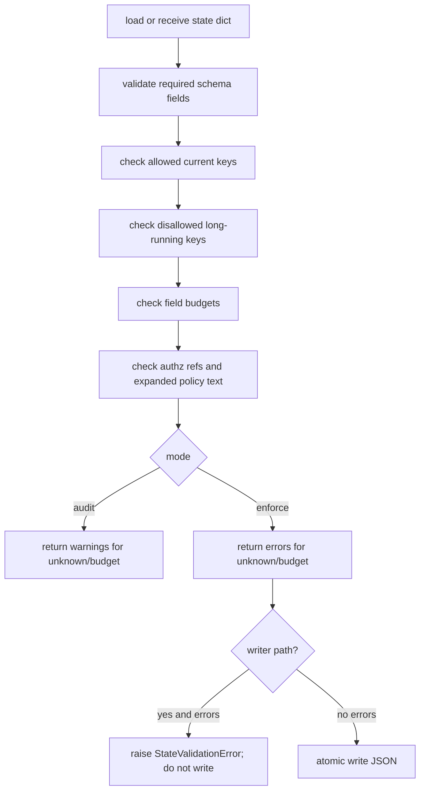

# LLD: CR037-S01 — current-state schema and budgets

## 0. 上游设计依据

| 来源 | 路径 / ID | 被本 LLD 消费的内容 |
|---|---|---|
| HLD | `process/docs/design/META-FLOW-PROJECT-GOVERNANCE-HLD.md` | P0 目标：`STATE.current.json` 进入 allowlist + budget + controlled update；未知字段 audit WARN / enforce ERROR；至少 7 类字段预算可测试。 |
| ADR | `process/docs/design/META-FLOW-PROJECT-GOVERNANCE-ARCHITECTURE-DECISION.md#ADR-PG-001` | `STATE.current.json` 使用 allowlist schema + field budgets，audit -> enforce；发现合法字段缺失时扩展 schema，不回退黑名单。 |
| Feature Matrix | `process/docs/design/META-FLOW-PROJECT-GOVERNANCE-FEATURE-DESIGN-MATRIX.md` | CR037-S01 为 full-lld，触发原因为 data-model / security / shared-story-boundary。 |
| Feature DESIGN | `process/docs/features/current-state-enforcement/DESIGN.md` | 以 `default_current_state()` 字段集为 allowlist 基线，补 explicit optional keys；`write_current_state()` 与后续 `update_current_state()` 共用校验。 |
| TEST-PLAN | `process/docs/features/current-state-enforcement/TEST-PLAN.md` | TP-CS-01..03、SEC-CS-TC-01..03：unknown key、field budget、secret-like 字段和 optional allowlist。 |
| TASKS | `process/docs/features/current-state-enforcement/TASKS.md` | T-CS-001、T-CS-002、T-CS-005、T-CS-007。 |
| 现有代码 | `meta_flow/state/current.py` | 当前已有 `default_current_state()`、`DISALLOWED_CURRENT_KEYS`、`write_current_state()`、`check_current_state()` 和总量预算检查。 |

## 1. Goal

为 `STATE.current.json` 定义可机器执行的 allowlist、explicit optional keys、字段预算和 audit/enforce 校验结果模型，并把该校验接入 `write_current_state()` 与 `meta-flow state check`，使 unknown field 在 audit 模式 WARN、在 enforce 模式 ERROR，合法但可膨胀字段受预算约束。

## 2. Requirements（Functional / Non-Functional）

### 2.1 Functional

- `ALLOWED_CURRENT_KEYS` 必须由 `default_current_state(project_root).keys()` 与 `EXPLICIT_OPTIONAL_CURRENT_KEYS` 组合生成，不再依赖黑名单作为主要治理方式。
- `EXPLICIT_OPTIONAL_CURRENT_KEYS` 至少包含 `pending_checklist_path` 与 `project_state_ref`，并保留后续 P1 project state 只在 current state 保存 ref 的边界。
- `validate_current_state(state, mode)` 必须校验 schema_version、required fields、unknown top-level keys、仍需保留的 disallowed long-running keys、field budgets、`authz_policy_refs` 类型和 expanded policy text。
- `mode="audit"` 时 unknown key 和预算超限返回 warning；`mode="enforce"` 时返回 error。secret-like unknown key（如 `token`、`credential`）在 enforce 下必须 error，且错误信息不得打印字段值。
- `write_current_state()` 在落盘前调用 enforce 校验；校验失败不写文件、不创建部分内容。
- `check_current_state()` / `meta-flow state check` 使用可配置 mode：默认 audit，enforce 用于 CP/CI 或显式参数。
- 字段预算至少覆盖 `next_action`、`source_refs`、`open_risks`、`authz_policy_refs`、`active_context_ref`、`pending_checklist_path`、`project_state_ref` 七类。

### 2.2 Non-Functional

- 兼容性：历史项目先 audit 后 enforce；audit 不阻断现有 workspace，但必须给出可定位的 warning。
- 安全性：current state 不保存凭据、账户、token、cookie、私钥或 policy 全文；错误输出只暴露字段名和预算，不暴露字段值。
- 可维护性：预算表集中在 `meta_flow/state/current.py`，可被测试直接引用；不得新增第二套 state schema 文件。
- 性能：`STATE.current.json` 总大小继续受 `DEFAULT_BUDGETS["state_current_max_bytes"]` / policy override 限制，字段预算校验为单次 JSON 遍历。
- 授权边界：本 Story 只设计 schema/checker，不修改 `process/quant-lab/**`，不进入实现。

## 3. 模块拆分与职责

| 模块 / 文件组 | 职责 | 说明 |
|---|---|---|
| `meta_flow/state/current.py` | 定义 allowlist、optional keys、budget config、validation result 和写前校验 | 本 Story primary owner。 |
| `meta_flow/cli.py` / state command wiring | 暴露 `meta-flow state check --mode audit|enforce` | 若 state command 仍由 `current.main()` 托管，CLI 仅需透传现有入口。 |
| `tests/test_state_v2.py` | 覆盖 unknown key、optional key、预算、secret-like 字段和写失败不落盘 | 本 Story primary test owner。 |
| `meta_flow/checks/token_budget.py` | 继续提供 artifact 总量预算 | 不新增预算系统；字段预算在 current state 模块内定义。 |

## 4. 代码结构与文件影响范围

| 动作 | 文件路径 | 变更内容 |
|---|---|---|
| 修改 | `meta_flow/state/current.py` | 新增 allowlist / optional keys / field budgets / `StateValidationFinding` / `StateValidationError` / `validate_current_state()`；增强 `write_current_state()` 和 `check_current_state()`。 |
| 修改 | `meta_flow/cli.py` | 若顶层 CLI 分发 state 子命令，需要保证 `state check --mode audit|enforce` 能透传；否则 N/A。 |
| 修改 | `tests/test_state_v2.py` | 增加 S01 schema 与预算单元测试。 |

## 5. 数据模型与持久化设计

| 对象 / 字段 | 类型 | 约束 | 说明 |
|---|---|---|---|
| `ALLOWED_CURRENT_KEYS` | `set[str]` | `default_current_state()` keys + explicit optional keys | 运行时生成或模块初始化时稳定生成均可，但测试必须验证包含默认字段。 |
| `EXPLICIT_OPTIONAL_CURRENT_KEYS` | `set[str]` | 初始包含 `pending_checklist_path`、`project_state_ref` | 只能用于已确认轻量 ref 字段；不得放入 long-running content。 |
| `CURRENT_FIELD_BUDGETS` | `dict[str, FieldBudget]` | 每个预算包含 `max_items` / `max_item_bytes` / `max_total_bytes` / `max_bytes` 中至少一个 | 预算值以测试可验证为准。 |
| `StateValidationFinding` | dataclass 或 dict | `level`、`code`、`field`、`message` | `message` 不包含敏感值。 |
| `StateValidationError` | Exception | 包含 findings 摘要 | 用于 writer enforce 失败。 |
| `STATE.current.json` | JSON file | 不新增重型持久化字段 | 仅保持已允许字段和 optional refs。 |

建议预算表：

| 字段 | 类型 | 预算 |
|---|---|---|
| `next_action` | dict / scalar text | `text` 最大 512 bytes，整体最大 768 bytes |
| `source_refs` | list[dict] | 最大 24 项，单项最大 256 bytes，总量最大 4096 bytes |
| `open_risks` | list[str] | 最大 16 项，单项最大 256 bytes，总量最大 2048 bytes |
| `authz_policy_refs` | list[str] | 最大 16 项，单项最大 128 bytes，总量最大 1024 bytes |
| `active_context_ref` | string | 最大 256 bytes |
| `pending_checklist_path` | string | 最大 256 bytes |
| `project_state_ref` | string | 最大 256 bytes |

## 6. API / Interface 设计

| 接口 / 入口 | 输入 | 输出 | 调用方 | 说明 |
|---|---|---|---|---|
| `validate_current_state(state, *, mode="audit")` | state dict；`mode in {"audit","enforce"}` | `(errors, warnings)` 或 list findings | `write_current_state()`、`check_current_state()`、后续 `update_current_state()` | 统一校验函数；S02 复用。 |
| `StateValidationError` | findings | exception message | `write_current_state()` | 写前 enforce 失败时抛出，调用方可测试定位。 |
| `write_current_state(project_root, state, *, force=False, validate=True)` | project root、完整 state | 写入路径 | init / migrate / tests / internal modules | 默认 enforce 校验；bootstrap 如需迁移旧状态也不得绕过 unknown/budget。 |
| `check_current_state(project_root, *, mode="audit")` | project root、mode | `(errors, warnings)` | `meta-flow state check` | audit 下 unknown/budget 为 warning；enforce 下为 error。 |
| `meta-flow state check --mode audit|enforce` | CLI 参数 | exit code + WARN/ERROR lines | CP/CI、维护者 | audit 有 warning 仍 exit 0；enforce 有 error exit 1。 |

## 7. 核心处理流程



异常路径：

1. JSON 文件不存在或 invalid JSON：`check_current_state()` 保持 ERROR。
2. unknown top-level key：audit WARN / enforce ERROR。
3. disallowed long-running key：audit 和 enforce 均 ERROR，保留现有强约束。
4. budget exceeded：audit WARN / enforce ERROR；不得自动截断。
5. `write_current_state()` 校验失败：不写 `STATE.current.json`，不 touch ledgers。

## 8. 技术设计细节

- 关键算法 / 规则：
  - `ALLOWED_CURRENT_KEYS = set(default_current_state(Path(".")).keys()) | EXPLICIT_OPTIONAL_CURRENT_KEYS`；若不希望在模块加载时调用 `Path(".")`，可用常量表与单元测试校验其等于默认字段集。
  - unknown key 只比较顶层字段；嵌套字段通过该字段对应预算和类型约束治理，不在本 Story 设计完整 JSON Schema。
  - `source_refs` 的单项预算按 `json.dumps(item, ensure_ascii=False, sort_keys=True)` 后的 UTF-8 byte length 计算。
  - `next_action` 既允许 dict，也兼容 legacy scalar；最终预算按 `next_action.text` 和整体 JSON 两层校验。
  - secret-like 字段名只做字段名判断，例如 top-level key 包含 `token`、`credential`、`secret`、`password`、`cookie`、`private_key`；错误中不得包含值。
- 依赖选择与复用点：
  - 复用 `load_budgets()` 的总量预算；字段预算不进入 artifact budget，避免把 state schema 与全局 token budget 混成第二套配置。
  - 保留 `DISALLOWED_CURRENT_KEYS` 作为兼容性硬拦截，但它不是 allowlist 的替代品。
- 兼容性处理：
  - `migrate_legacy_state()` 产出的 `pending_checklist_path` 必须在 allowlist 内。
  - `project_state_ref` 先作为 optional key 放行，供 CR037-S05/S06 使用。
  - audit 默认用于历史 workspace；enforce 用于 writer 和 CP/CI。
- 图示类型选择：本 Story 包含 writer / checker 异常分支，使用流程图。

## 9. 安全与性能设计

| 维度 | 设计措施 | 验证方式 |
|---|---|---|
| 安全 | unknown secret-like 字段在 enforce 下 ERROR；错误不打印值；`expanded_text` 继续强制 ERROR。 | `tests/test_state_v2.py` secret fixture；CLI 输出断言。 |
| 权限 | 不新增 credential/runtime/publish/quant-lab 写权限；只校验本地 process state 文件。 | CP5/CP6 审查写入范围。 |
| 性能 | 单次遍历顶层字段和受预算字段；总量预算继续使用文件 stat。 | 单元测试不需要性能基准；代码审查确认无递归全仓扫描。 |
| 可维护性 | 预算表集中、字段 owner 通过测试固定；新增 optional key 必须补测试。 | budget table tests。 |

## 10. 测试设计

| 测试场景 | 前置条件 | 操作 | 预期结果 | 验证方式 |
|---|---|---|---|---|
| unknown key audit | fixture state 增加 `last_actions` | `check_current_state(mode="audit")` | errors 为空，warnings 包含 unknown key | pytest unit |
| unknown key enforce | 同上 | `check_current_state(mode="enforce")` / `write_current_state()` | enforce error；writer 不落盘 | pytest unit |
| optional keys allowed | state 包含 `pending_checklist_path`、`project_state_ref` | validate enforce | 无 unknown finding | pytest unit |
| list budget exceeded | `source_refs` 超 max_items 或 max_total_bytes | validate audit/enforce | audit WARN / enforce ERROR | pytest parametrized |
| scalar budget exceeded | `next_action.text` 超 512 bytes | validate enforce | ERROR 且不截断 | pytest unit |
| secret-like unknown | state 包含 `token` 字段且值为伪 secret | validate enforce | ERROR message 只含字段名，不含值 | pytest unit |
| existing disallowed key | state 包含 `history` | validate audit | ERROR，保持现有行为 | regression |
| CLI mode | workspace 写入 unknown key | `meta-flow state check --mode audit|enforce` | audit exit 0 + WARN；enforce exit 1 + ERROR | CLI test |

## 11. 实施步骤

| TASK-ID | 动作 | 目标文件 | 详细描述 | 对应测试 |
|---|---|---|---|---|
| T-CS-001 | 修改 | `meta_flow/state/current.py` | 定义 `EXPLICIT_OPTIONAL_CURRENT_KEYS`、`ALLOWED_CURRENT_KEYS`、`CURRENT_FIELD_BUDGETS` 和 finding/error 类型。 | optional keys / budget table tests |
| T-CS-002 | 修改 | `meta_flow/state/current.py` | 实现 `validate_current_state()`，并将 `write_current_state()` 接入 enforce 校验。 | unknown enforce、writer no-write tests |
| T-CS-005 | 修改 | `meta_flow/state/current.py` / `meta_flow/cli.py` | 扩展 `check_current_state()` 和 state CLI mode 参数，输出 WARN/ERROR。 | CLI mode tests |
| T-CS-007 | 修改 | `tests/test_state_v2.py` | 增加 unknown field、budget、secret-like、optional key、disallowed regression fixtures。 | 全部 S01 测试 |

## 12. 风险、难点与预研建议

### 12.1 实现灰区与取舍记录

| Clarification ID | 问题 | 选项与推荐 | 决策 / 答案 | 影响面 | 证据 | 重访条件 |
|---|---|---|---|---|---|---|
| N/A | 无阻断型 clarification。预算值属于实现可收敛细节，按 HLD “至少 7 类字段预算可测试”与本 LLD 表格执行。 | 推荐采用本 LLD 预算表；备选为只做总量预算，但不满足 HLD 成功标准。 | agent 默认处理，CP5 可审查。 | 接口 / 测试 / 安全 | HLD 成功标准、Feature DESIGN field budget 设计点 | 若 CP5 指出预算值过严或过松，修改本 LLD 后再确认。 |

| 风险 / 难点 | 影响 | 缓解措施 / 预研建议 |
|---|---|---|
| allowlist 误伤存量合法字段 | 历史 workspace audit warning 增多 | audit -> enforce；合法字段必须补 owner、预算和测试，不回退自由字段。 |
| 预算值过严 | agent 状态摘要无法表达必要 refs | CP5/CP7 通过 fixture 调整预算；重型正文仍必须进 ledger/result/ref。 |
| writer 校验影响 bootstrap | 初始化或迁移失败 | 确保 `default_current_state()` 和 `migrate_legacy_state()` 产出字段均在 allowlist。 |

### OPEN / Spike 跟踪

| ID | 类型（OPEN / Spike） | 问题 | 下一动作 | 责任方 |
|---|---|---|---|---|
| N/A | N/A | 无开放项。 | N/A | N/A |

## 13. 回滚与发布策略

- 发布方式：随 CR037-S01 实现进入 W1；默认先以 audit mode 可见，writer enforce 只影响受控写入口。
- 回滚触发条件：CP7 发现合法初始化 / 迁移 state 被误判且无法通过 optional key 修复；或 CLI audit/enforce mode 导致现有 `state check` 兼容性破坏。
- 回滚动作：保留 finding 类型和测试，临时将 CLI 默认回到 audit；不得回滚到仅黑名单补丁。必要时追加 explicit optional key 和预算测试。

## 14. Definition of Done

- [ ] 14 个章节全部填写完成。
- [ ] `ALLOWED_CURRENT_KEYS`、`EXPLICIT_OPTIONAL_CURRENT_KEYS`、`CURRENT_FIELD_BUDGETS`、`validate_current_state()`、`StateValidationError` 的接口可由实现直接落地。
- [ ] `write_current_state()` 写前校验失败不落盘。
- [ ] `meta-flow state check --mode audit|enforce` 的 WARN/ERROR 与 exit code 可测试。
- [ ] 测试覆盖 unknown key、disallowed key、optional key、7 类字段预算、secret-like 字段和 writer no-write。
- [ ] 无阻断型 clarification candidate。
- [ ] `confirmed=false` 时不进入实现。

## 人工确认区

> **CP5 — Story 设计证据可实现性门**
> 本 LLD 需与 CR037-S00..S13 的设计证据统一确认。用户统一确认全部目标 Story 的设计证据后，仍需满足当前 Wave、依赖门控与文件所有权门控方可进入实现。

**CP5 checklist 摘要**：

| # | 检查项 | 状态 | 证据 |
|---|---|---|---|
| 1 | LLD 覆盖 AC | 待检查 | 第 2 / 10 / 14 节 |
| 2 | 与 HLD / ADR 一致 | 待检查 | 第 0 / 8 / 12 节 |
| 3 | 文件影响范围明确 | 待检查 | 第 4 / 11 节 |
| 4 | 接口契约完整 | 待检查 | 第 6 节 |
| 5 | 测试与 dev_gate 可计算 | 待检查 | 第 10 / 14 节 |
| 6 | clarification queue 已收敛 | 待检查 | 第 12.1 节 |

**人工确认回复**：

请直接回复以下任一整行：

```text
approve
修改: <具体修改点>
reject
```

**人工审查结果回填**：

- 结论：`approved | changes_requested | rejected`
- 审查人：
- 审查时间：
- 修改意见：
- 风险接受项：
