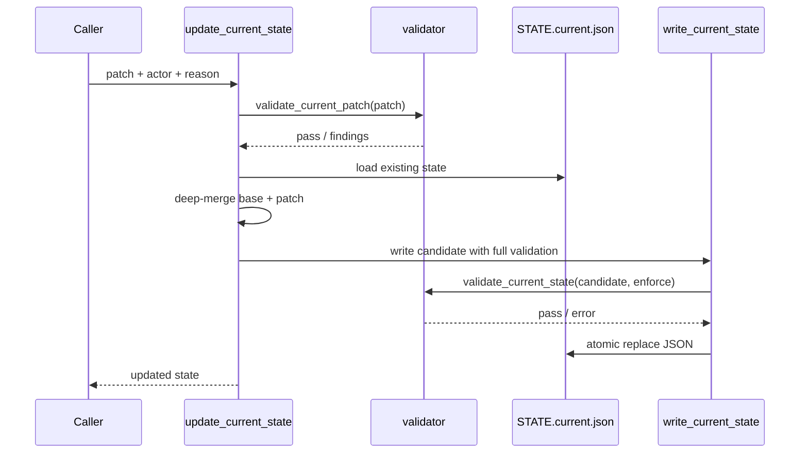

# LLD: CR037-S02 — controlled update API and writer refactor

## 0. 上游设计依据

| 来源 | 路径 / ID | 被本 LLD 消费的内容 |
|---|---|---|
| HLD | `process/docs/design/META-FLOW-PROJECT-GOVERNANCE-HLD.md` | Current State 受控更新流程：caller -> `update_current_state` -> checker -> deep-merge -> full state validate -> written / rejected。 |
| ADR | `process/docs/design/META-FLOW-PROJECT-GOVERNANCE-ARCHITECTURE-DECISION.md#ADR-PG-001` | allowlist schema + field budgets；audit -> enforce；不回退黑名单。 |
| Feature Matrix | `process/docs/design/META-FLOW-PROJECT-GOVERNANCE-FEATURE-DESIGN-MATRIX.md` | CR037-S02 为 full-lld，触发原因 cross-module-contract / rollback。 |
| Feature DESIGN | `process/docs/features/current-state-enforcement/DESIGN.md` | `update_current_state(project_root, patch)` 使用 deep-merge，patch key 必须 allowlist；内部 active change 更新收敛到受控 API。 |
| TEST-PLAN | `process/docs/features/current-state-enforcement/TEST-PLAN.md` | TP-CS-04、TP-CS-05：deep-merge、patch key allowlist、CR lifecycle 不再 direct write。 |
| TASKS | `process/docs/features/current-state-enforcement/TASKS.md` | T-CS-003、T-CS-004、T-CS-007；BLK-CS-002 要求 LLD 明确删除语义。 |
| 现有代码 | `meta_flow/state/current.py`、`meta_flow/workflow/cr_lifecycle.py` | 当前 `write_current_state()` 写完整 state；`_update_current_active_change()` 直接读写 JSON 文件。 |

## 1. Goal

新增受控 `update_current_state()` API，定义 patch allowlist、deep-merge、禁止删除、失败不落盘和 render 策略，并将 `cr_lifecycle._update_current_active_change()` 从直接写 JSON 收敛到该 API。

## 2. Requirements（Functional / Non-Functional）

### 2.1 Functional

- 新增 `update_current_state(project_root, patch, *, actor="", reason="", mode="enforce", render=False)`，读取现有 current state，校验 patch 顶层 key，deep-merge 生成 candidate，完整校验 candidate，成功后写盘并返回 candidate。
- patch 顶层 key 必须属于 CR037-S01 的 allowlist；unknown patch key 在 enforce 下抛 `StateValidationError`，不落盘。
- deep-merge 仅对 dict 执行递归合并；list、string、bool、null、number 均按字段整体替换。
- 删除语义：本 Story 明确禁止通过 `None` 或 sentinel 删除字段。需要删除字段时后续单独设计 `remove_current_state_keys()` 或迁移逻辑；当前 patch 中 `None` 表示写入 JSON null，且该字段必须 allowlist。
- 写入失败不落盘：patch 校验失败、candidate 校验失败、JSON 读写异常均不得产生半写；已有 state 文件内容保持不变。
- `_update_current_active_change()` 必须调用 `current.update_current_state()` 更新 `active_change`、`active_context_ref`、`current_phase`、`next_action`、`updated_at`。
- `write_current_state()` 继续承担完整写入；`update_current_state()` 不绕过 `write_current_state()` 的 full-state validate。

### 2.2 Non-Functional

- 回滚性：S02 改造必须保持 bootstrap CR 行为可测试；若 update 失败，CR lifecycle 调用方应收到异常并阻断后续 summary/index/render 依赖。
- 可观测性：错误包含 patch key、validation code、actor/reason 摘要，但不包含敏感字段值。
- 幂等性：同一 patch 重复执行应得到相同 state 内容，除非 patch 显式传入新的 `updated_at`。
- 授权边界：不写 `process/quant-lab/**`，不触发 runtime、publish、credential 或 production write。

## 3. 模块拆分与职责

| 模块 / 文件组 | 职责 | 说明 |
|---|---|---|
| `meta_flow/state/current.py` | 实现 deep-merge、patch validation、受控 update API 和原子写入复用 | 依赖 S01 的 schema / validation。 |
| `meta_flow/workflow/cr_lifecycle.py` | 移除 `_update_current_active_change()` 的直接 JSON 写入，改调用 state API | 本 Story primary owner。 |
| `tests/test_state_v2.py` | 覆盖 `update_current_state()` patch allowlist、deep-merge、禁止删除和 no-write | 可与 S01 测试同文件。 |
| `tests/test_cr_lifecycle.py` | 覆盖 bootstrap / active change 更新通过受控 API | integration regression。 |

## 4. 代码结构与文件影响范围

| 动作 | 文件路径 | 变更内容 |
|---|---|---|
| 修改 | `meta_flow/state/current.py` | 新增 `_deep_merge_current_state()`、`validate_current_patch()`、`update_current_state()`；必要时增强 `write_current_state()` 支持 internal validated candidate。 |
| 修改 | `meta_flow/workflow/cr_lifecycle.py` | `_update_current_active_change()` 调用 `meta_flow.state.current.update_current_state()`，删除直接 `current_path.write_text()` 路径。 |
| 修改 | `tests/test_state_v2.py` | 新增 update API unit tests。 |
| 修改 | `tests/test_cr_lifecycle.py` | 新增或调整 active change 更新 integration test，证明不再依赖 direct write。 |

## 5. 数据模型与持久化设计

| 对象 / 字段 | 类型 | 约束 | 说明 |
|---|---|---|---|
| `CurrentStatePatch` | `dict[str, Any]` | 顶层 key 必须 allowlist；嵌套 key 只在 dict 字段内 deep-merge | 不新增正式 TypedDict，除非实现期认为可读性收益明显。 |
| `actor` | string | 最大 128 bytes，默认空 | 仅用于错误上下文 / debug，不写入 state。 |
| `reason` | string | 最大 256 bytes，默认空 | 仅用于错误上下文 / debug，不写入 state。 |
| candidate state | dict | 由 existing state deep-merge patch 得到 | 通过 S01 full-state validate 后才持久化。 |
| `STATE.current.json` | JSON file | 成功时整体 JSON 写入；失败时保持原文件 | 不新增 patch log。审计事件如后续需要应走 ledger，非本 Story。 |

无新增独立持久化文件；不新增 `STATE.current.patch.log`、`PROJECT-LEDGER` 或其他第二套审计机制。

## 6. API / Interface 设计

| 接口 / 入口 | 输入 | 输出 | 调用方 | 说明 |
|---|---|---|---|---|
| `update_current_state(project_root, patch, *, actor="", reason="", mode="enforce", render=False)` | project root、allowlist patch | 更新后的 state dict | `cr_lifecycle`、后续 state-router / internal modules | S02 主接口；失败抛 `StateValidationError` 或 IO/JSON error。 |
| `validate_current_patch(patch, *, mode="enforce")` | patch dict | findings | `update_current_state()` | 仅校验 patch 顶层 key 和 patch 局部预算可预检项。 |
| `_deep_merge_current_state(base, patch)` | base dict、patch dict | candidate dict | `update_current_state()` | dict 递归；list/scalar/null 整体替换；禁止删除。 |
| `_update_current_active_change(project_root, cr_id, context_ref)` | project root、CR id、context ref | None | `bootstrap_cr()` | 内部调用点改为受控 API。 |
| `write_current_state(project_root, state, *, force=False, validate=True)` | full state | Path | `update_current_state()`、init、migrate | 作为最终 full-state validate + write 入口。 |

每个接口对应测试：见第 10 节 TP-S02-01..06。

## 7. 核心处理流程



异常路径：

1. patch 不是 dict：抛 `TypeError` 或 `StateValidationError(code="invalid_patch")`。
2. patch 顶层 unknown key：抛 `StateValidationError(code="unknown_patch_key")`；不读写 candidate。
3. candidate 超预算：抛 `StateValidationError(code="budget_exceeded")`；原文件保持不变。
4. current state 文件缺失或 invalid JSON：沿用 `FileNotFoundError` / `JSONDecodeError` 或转换为 state error；调用方不得静默创建第二份 state。
5. render 失败：若 `render=True`，state JSON 已成功写入后 render summary 失败应向调用方暴露；不得回滚 JSON，因为 `STATE.md` 是人类摘要。

## 8. 技术设计细节

- deep-merge 规则：
  - 若 base[field] 和 patch[field] 都是 dict，则递归合并。
  - 若 patch[field] 是 list / scalar / None，则替换整个字段。
  - 不支持删除。`None` 不是删除指令；该字段若不允许 null，应由 full-state validate 报错。
- 原子写入：
  - 推荐实现使用同目录临时文件 + `Path.replace()`；若沿用直接 `write_text()`，必须先完成全部校验，避免 validation 失败后落盘。
  - `ensure_base_ledgers()` 只在成功写入后执行，避免失败状态下产生误导性副作用。
- 调用收敛：
  - `cr_lifecycle._update_current_active_change()` 不再构造 path 直接写 JSON；改为：
    - patch: `active_change`、`active_context_ref`、`current_phase`、`next_action`、`updated_at`
    - actor: `meta_flow.workflow.cr_lifecycle`
    - reason: `bootstrap active change`
  - 保留函数名以减少外部调用面变更。
- 兼容性处理：
  - S02 依赖 S01；若 S01 未实现，S02 不应独立落地。
  - `mode` 默认 enforce，防止内部 writer 成为 audit 绕过口。
- 图示类型选择：跨 `cr_lifecycle`、state API、validator、file writer，使用时序图。

## 9. 安全与性能设计

| 维度 | 设计措施 | 验证方式 |
|---|---|---|
| 安全 | patch key allowlist；candidate full validation；错误不打印值；不新增 patch log。 | unknown patch / secret-like patch tests。 |
| 权限 | 只写 `process/state/STATE.current.json` 和既有 generated `process/STATE.md`（当 render=True）；不写 quant-lab。 | 文件影响审查。 |
| 性能 | 只加载一个 JSON 文件并 deep-copy / merge；无全仓扫描。 | 代码审查；unit fixture。 |
| 回滚 | 校验失败不落盘；render 失败不回滚 JSON。 | no-write tests；render failure 可通过 monkeypatch 覆盖。 |

## 10. 测试设计

| 测试场景 | 前置条件 | 操作 | 预期结果 | 验证方式 |
|---|---|---|---|---|
| TP-S02-01 patch allowlist | existing state 有默认字段 | `update_current_state({"last_actions": []})` | 抛 `StateValidationError`，文件内容不变 | `tests/test_state_v2.py` |
| TP-S02-02 deep-merge dict | existing `next_action={"type":"old","text":"old"}` | patch `{"next_action":{"text":"new"}}` | `type` 保留，`text` 更新 | unit |
| TP-S02-03 replace list | existing `source_refs=[a]` | patch `{"source_refs":[b]}` | 列表整体替换为 `[b]` | unit |
| TP-S02-04 no delete semantics | patch `{"active_context_ref": None}` | full validation 接受或拒绝 null，但不删除 key | unit；按 S01 字段类型约束断言 |
| TP-S02-05 candidate budget fail | patch 使 `next_action.text` 超预算 | 抛 error，原文件 byte-for-byte 不变 | unit |
| TP-S02-06 lifecycle refactor | bootstrap CR fixture | 调用 `bootstrap_cr()` 或 `_update_current_active_change()` | active_change/context_ref 更新，且测试可 monkeypatch `update_current_state()` 证明调用受控 API | `tests/test_cr_lifecycle.py` |
| TP-S02-07 missing state | 无 `STATE.current.json` | `update_current_state()` | 抛 FileNotFoundError / state error，不创建新文件 | unit |

## 11. 实施步骤

| TASK-ID | 动作 | 目标文件 | 详细描述 | 对应测试 |
|---|---|---|---|---|
| T-CS-003 | 修改 | `meta_flow/state/current.py` | 创建 `validate_current_patch()`、`_deep_merge_current_state()`、`update_current_state()`，复用 S01 validation 和 writer。 | TP-S02-01..05、07 |
| T-CS-004 | 修改 | `meta_flow/workflow/cr_lifecycle.py` | 将 `_update_current_active_change()` 改为调用 `current.update_current_state()`，删除 direct JSON write。 | TP-S02-06 |
| T-CS-007 | 修改 | `tests/test_state_v2.py` / `tests/test_cr_lifecycle.py` | 增加 update API 与 lifecycle convergence tests。 | TP-S02-01..07 |

## 12. 风险、难点与预研建议

### 12.1 实现灰区与取舍记录

| Clarification ID | 问题 | 选项与推荐 | 决策 / 答案 | 影响面 | 证据 | 重访条件 |
|---|---|---|---|---|---|---|
| LCQ-CR037-S02-01 | deep-merge 是否支持删除语义。 | 推荐：本 Story 禁止 patch 删除，`None` 表示写入 null 并交由 full validation 判断；备选 A：约定 `{"field": {"__delete__": true}}`；备选 B：允许 `None` 删除。推荐方案最小且避免误删，备选会扩大 API 与测试面。 | 已按 Feature TASKS 的推荐处理，不阻断 LLD。 | 接口 / 测试 / 回滚 / 跨 Story 契约 | `process/docs/features/current-state-enforcement/TASKS.md` BLK-CS-002 推荐“LLD 中明确禁止 patch 删除”。 | 若 CP5 要求删除能力，必须修改本 LLD 并补 API / rollback tests。 |

| 风险 / 难点 | 影响 | 缓解措施 / 预研建议 |
|---|---|---|
| API 默认 enforce 影响 bootstrap | 初始化流程可能因 optional key 缺失失败 | S01 先保证 bootstrap/migrate 字段在 allowlist；S02 依赖 S01。 |
| deep-merge 嵌套行为被误解 | 调用方以为 list 可追加 | 文档和测试明确 list 整体替换，不提供 append。 |
| direct write 未完全收敛 | enforcement 被内部路径绕过 | `tests/test_cr_lifecycle.py` monkeypatch / behavior test 证明调用 `update_current_state()`。 |

### OPEN / Spike 跟踪

| ID | 类型（OPEN / Spike） | 问题 | 下一动作 | 责任方 |
|---|---|---|---|---|
| N/A | N/A | 无开放项；删除语义已在本 LLD 决策为禁止。 | N/A | N/A |

## 13. 回滚与发布策略

- 发布方式：在 CR037-S01 schema/validation 完成后实施；S02 不应独立先行。
- 回滚触发条件：bootstrap / CR lifecycle integration 在 CP7 出现不可接受回归，或 update API 误写导致 state 文件损坏。
- 回滚动作：保留 S01 validation；临时恢复 `_update_current_active_change()` 的直接写入只允许作为修复分支的短期 fallback，并必须在 CP7 标记风险；正式回滚方案应修正 allowlist / patch validation，不取消受控 API 方向。

## 14. Definition of Done

- [ ] 14 个章节全部填写完成。
- [ ] `update_current_state()`、`validate_current_patch()`、deep-merge 和禁止删除语义可直接实现。
- [ ] `_update_current_active_change()` 不再直接写 `STATE.current.json`。
- [ ] 测试覆盖 allowlist patch、dict deep-merge、list replacement、禁止删除、budget fail no-write、missing state 和 lifecycle convergence。
- [ ] 无阻断型 clarification candidate；删除语义已收敛为“禁止 patch 删除”。
- [ ] `confirmed=false` 时不进入实现。

## 人工确认区

> **CP5 — Story 设计证据可实现性门**
> 本 LLD 需与 CR037-S00..S13 的设计证据统一确认。用户统一确认全部目标 Story 的设计证据后，仍需满足当前 Wave、依赖门控与文件所有权门控方可进入实现。

**CP5 checklist 摘要**：

| # | 检查项 | 状态 | 证据 |
|---|---|---|---|
| 1 | LLD 覆盖 AC | 待检查 | 第 2 / 10 / 14 节 |
| 2 | 与 HLD / ADR 一致 | 待检查 | 第 0 / 8 / 12 节 |
| 3 | 文件影响范围明确 | 待检查 | 第 4 / 11 节 |
| 4 | 接口契约完整 | 待检查 | 第 6 节 |
| 5 | 测试与 dev_gate 可计算 | 待检查 | 第 10 / 14 节 |
| 6 | clarification queue 已收敛 | 待检查 | 第 12.1 节 |

**人工确认回复**：

请直接回复以下任一整行：

```text
approve
修改: <具体修改点>
reject
```

**人工审查结果回填**：

- 结论：`approved | changes_requested | rejected`
- 审查人：
- 审查时间：
- 修改意见：
- 风险接受项：
