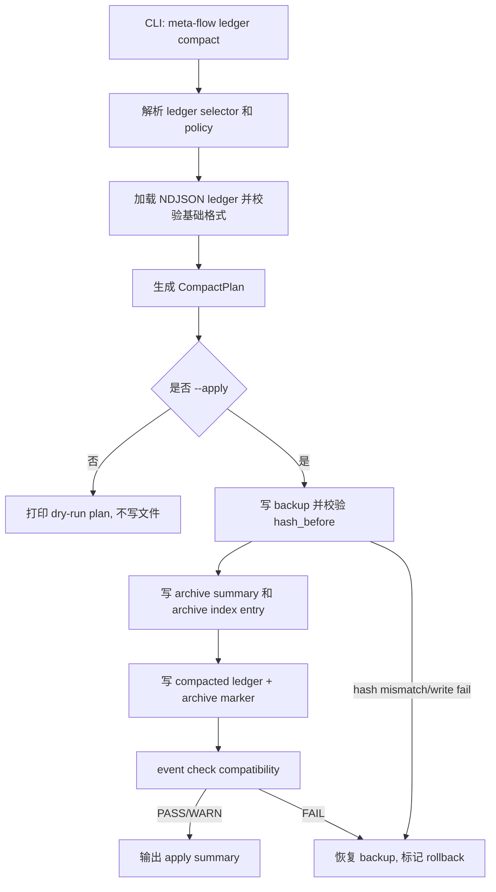

# LLD: CR037-S04 - ledger compaction policy and CLI

本文档是 CR037-S04 的 Story 级设计证据。它只供 CP5 统一审查使用；`confirmed=false` 且 CP5 未通过前不得进入实现。

## 0. 上游设计依据

| 来源 | 路径 / ID | 被本 LLD 消费的内容 |
|---|---|---|
| Handoff | `process/handoffs/CR037-CP5-LLD-BATCH-B-HANDOFF.md` | 本 Story 写入范围、只产出 LLD、不进入实现、不得修改代码/测试/STATE/ledger。 |
| CP5 Context | `process/context/CP5-CR-037-LLD-CONTEXT.yaml` | CR-037 当前处于 CP5 pending；CP5 approved 前不授权实现、runtime、publish、quant-lab 写入。 |
| Story Card | `process/stories/STORY-CR037-S04-ledger-compaction-policy-and-cli.md` | 验收标准：不复用 `state compact`、默认 dry-run、显式 apply、archive index/hash/rollback 可审计。 |
| HLD | `process/docs/design/META-FLOW-PROJECT-GOVERNANCE-HLD.md` | FEAT-PG-002 是 P0.5 ledger hygiene；`state compact` 语义是 state render/check；ledger compaction 需独立设计。 |
| ADR | `process/docs/design/META-FLOW-PROJECT-GOVERNANCE-ARCHITECTURE-DECISION.md` | 不新增第二套 ledger/result 体系；roadmap refresh 等事件仍写现有 event ledger，可被通用 compact 处理。 |
| Feature Matrix | `process/docs/design/META-FLOW-PROJECT-GOVERNANCE-FEATURE-DESIGN-MATRIX.md` | CR037-S04 `lld_policy.required_level=full-lld`；DQ-FD-003 推荐命令名 `meta-flow ledger compact`。 |
| Feature DESIGN | `process/docs/features/ledger-compaction/DESIGN.md` | retention policy、archive summary/index、dry-run/apply、event checker compatibility、恢复路径。 |
| Feature TEST-PLAN | `process/docs/features/ledger-compaction/TEST-PLAN.md` | TP-LC-01..06、SEC-LC-TC-01..03、MAN-LC-01..02。 |
| Feature TASKS | `process/docs/features/ledger-compaction/TASKS.md` | T-LC-001..007 的实现顺序、文件所有权和阻塞项。 |
| Existing Code | `meta_flow/state/event_ledger.py`、`meta_flow/state/current.py`、`meta_flow/cli.py` | 当前已有 `meta-flow event append/check/list` 和 `meta-flow state compact`；尚无 ledger compact 子命令。 |

## 1. Goal

新增独立的 ledger compaction 设计，使维护者通过 `meta-flow ledger compact` 对 process event ledgers 进行可审计的 dry-run、archive、apply 和 rollback，同时明确它与 `meta-flow state compact` 的职责边界。

## 2. Requirements（Functional / Non-Functional）

### 2.1 Functional

- F-S04-01：新增独立 CLI 域 `meta-flow ledger compact`，不得把 ledger 压缩挂到 `state compact`。
- F-S04-02：默认执行 dry-run，只输出 compact plan，不写 ledger、archive 或 index。
- F-S04-03：显式 `--apply` 后才允许写入 compacted ledger、backup、archive summary 和 archive index。
- F-S04-04：支持已知 ledger type（checkpoint、handoff、dispatch、run、gate）和显式 `--ledger <path>`；`--ledger all` 只覆盖 allowlist 中的 process/state ledger。
- F-S04-05：读取独立 retention policy，不复用 context `default_context` 或 state budget。
- F-S04-06：compacted ledger 必须保留最近窗口内原始事件，并用 archive marker 指向 archive summary/index。
- F-S04-07：archive index 必须记录 source ledger、range、event count、hash before/after、summary ref、backup ref、restore hint。
- F-S04-08：event checker 必须接受 compact marker，或在 apply 后先运行 compatibility check，失败则回滚。
- F-S04-09：rollback 通过 backup ref 和 archive index 恢复 apply 前 ledger，不依赖不可追踪的手工操作。
- F-S04-10：`state compact` help 文案只澄清其职责是 render + check，不改变其现有行为。

### 2.2 Non-Functional

- N-S04-01：审计性：apply 前后 hash、计数、范围和输出路径可复核。
- N-S04-02：安全性：不静默删除历史；无 `--apply` 不写文件；不处理 `process/quant-lab/**`。
- N-S04-03：兼容性：未压缩 ledger 继续按现有 `event check` 工作；压缩后 marker 不破坏 required field 校验。
- N-S04-04：性能：planner 以流式读取 NDJSON 为目标，避免把长期 ledger 的完整正文复制进 archive summary。
- N-S04-05：可恢复性：任意 apply 必须先写 backup，并在校验失败时自动恢复。

## 3. 模块拆分与职责

| 模块 / 文件组 | 职责 | 说明 |
|---|---|---|
| `meta_flow/state/event_ledger.py` | 承载 ledger path/type 解析、event load/check、compact planner、archive marker compatibility。 | 保持现有 append/check/list 语义；新增 compact 能力时不得改变普通 event 行的 required fields。 |
| `meta_flow/state/ledger_compaction.py`（建议新建） | 承载 retention policy、dry-run plan、archive/index、apply/backup/rollback 的核心实现。 | 将复杂压缩逻辑从 `event_ledger.py` 中拆出，降低现有 event CLI 回归风险。 |
| `meta_flow/cli.py` | 注册新的顶层 `ledger` 命令或路由到 ledger compaction main。 | 推荐 `meta-flow ledger compact`；`event compact` 仅作为未采纳备选。 |
| `meta_flow/state/current.py` | 保持 `state compact` 为 render + check，并在 help 中澄清“不压缩 ledger”。 | 职责边界：state compact 管 STATE human summary；ledger compact 管 NDJSON event ledger。 |
| `process/policies/LEDGER-RETENTION.yaml` | 运行时 policy 位置，用于声明 retention 默认值和 ledger allowlist。 | 本 Story LLD 设计路径；实现时可提供模板或默认内置值。 |
| `process/archive/ledger/**` | apply 时生成 archive summary、index、backup 和 restore hints。 | 运行时输出，不在 LLD 阶段创建。 |
| `tests/**` | 覆盖 CLI、policy、dry-run、apply、checker compatibility、rollback 和 path guard。 | 本阶段不写测试，只定义入口。 |

## 4. 代码结构与文件影响范围

| 动作 | 文件路径 | 变更内容 |
|---|---|---|
| 创建 | `meta_flow/state/ledger_compaction.py` | 定义 retention policy loader、compact planner、archive writer、apply/rollback coordinator、结果数据结构。 |
| 修改 | `meta_flow/state/event_ledger.py` | 增加 compact marker compatibility；复用 ledger path/type 解析；必要时暴露 checker helper。 |
| 修改 | `meta_flow/cli.py` | 新增 `ledger` 顶层命令路由，支持 `compact` 子命令。 |
| 修改 | `meta_flow/state/current.py` | 更新 help 文案，说明 `state compact` 只 render/check state，不压缩 ledger。 |
| 创建 | `process/policies/LEDGER-RETENTION.yaml` 或模板 | 声明 policy schema 和默认策略；若实现选择内置默认值，也必须提供可审查示例。 |
| 创建 | `tests/test_cr037_ledger_compaction.py` | 覆盖 TP-LC-01..06、SEC-LC-TC-01..03。 |
| 运行时创建 | `process/archive/ledger/<ledger_type>/<period>.summary.json` | 保存压缩摘要，不复制完整原始长日志。 |
| 运行时创建 | `process/archive/ledger/ledger-archive-index.json` | 追加/更新 archive index 条目，记录 hash、range、summary_ref、backup_ref、restore_hint。 |

## 5. 数据模型与持久化设计

| 对象 / 字段 | 类型 | 约束 | 说明 |
|---|---|---|---|
| `LEDGER-RETENTION.yaml.schema_version` | integer | 必填，初始为 `1`。 | 支持后续兼容升级。 |
| `LEDGER-RETENTION.yaml.default.window_days` | integer | 推荐默认 90；必须大于 0。 | 保留最近时间窗口内原始事件。 |
| `LEDGER-RETENTION.yaml.default.keep_latest_n_events` | integer | 推荐默认 500；必须大于 0。 | 防止无 timestamp ledger 被过度压缩。 |
| `LEDGER-RETENTION.yaml.default.keep_latest_n_cr` | integer | 推荐默认 20；适用于 CR ledger 或含 CR refs 的事件。 | 默认值作为 CP5 clarification candidate，不阻断 LLD。 |
| `LEDGER-RETENTION.yaml.ledgers[]` | array | 只允许 process/state allowlist 或显式路径。 | 不自动处理 `process/quant-lab/**`。 |
| `CompactPlan` | object | 包含 source ledger、candidate rows、kept rows、archived rows、writes、warnings。 | dry-run 输出，不持久化写入。 |
| `ArchiveSummary` | JSON | 只包含统计、event_type 分布、range、hash、sample ids，不包含完整长正文。 | 保护上下文预算和隐私边界。 |
| `ArchiveIndexEntry` | JSON | `source_ledger`、`ledger_type`、`range`、`event_count`、`hash_before`、`hash_after`、`summary_ref`、`backup_ref`、`restore_hint`、`created_at`。 | 审计和 rollback 的机器入口。 |
| `ArchiveMarker` | NDJSON event object | `event_type="ledger_compacted"`，含 `archive_ref`、`index_ref`、`range`、`event_count`、`hash_before`。 | 必须满足 `validate_event_ledger()` 的 required field 规则；对 typed ledger 补齐对应字段或 checker 特判。 |

持久化边界：LLD 阶段不创建 policy、archive 或 index；实现阶段只有 `--apply` 才写 `process/archive/ledger/**` 和 compacted ledger。

## 6. API / Interface 设计

| 接口 / 入口 | 输入 | 输出 | 调用方 | 说明 |
|---|---|---|---|---|
| `meta-flow ledger compact --ledger <type|path|all> [--policy PATH] [--project-root PATH]` | ledger selector、policy path、默认 dry-run。 | `CompactPlan` 的人类摘要；退出码 0/1。 | 维护者、CI、meta-qa。 | 无 `--apply` 不写文件；对应 TP-LC-01、TP-LC-03、SEC-LC-TC-01。 |
| `meta-flow ledger compact ... --apply` | dry-run 同参 + apply 授权。 | archive summary/index、backup、compacted ledger、post-check result。 | 维护者、CI。 | 写前 backup，写后 event check；对应 TP-LC-04..06。 |
| `load_retention_policy(path)` | YAML policy 或空。 | typed policy + warnings。 | compact planner。 | invalid policy 返回 error，不进入 apply；对应 TP-LC-02。 |
| `plan_ledger_compaction(path, policy)` | ledger path、typed policy。 | `CompactPlan`。 | CLI、测试。 | 不写文件；对 malformed ledger 返回 FAIL。 |
| `apply_compaction(plan)` | 已验证 plan。 | `ArchiveIndexEntry` + post-check status。 | CLI。 | hash mismatch、write failure、checker failure 均 rollback。 |
| `validate_event_ledger(path, ledger_type=...)` | compacted ledger。 | errors、warnings。 | apply 后自检、CP7。 | marker 兼容验证；对应 TP-LC-05。 |
| `meta-flow state compact` | `--project-root`、`--force`。 | state render/check。 | 现有调用方。 | 不压缩 ledger；help 文案澄清；对应 TP-LC-01 negative。 |

## 7. 核心处理流程



处理顺序：

1. CLI 解析 ledger selector，拒绝 `process/quant-lab/**` 和不在 allowlist 的隐式 all 范围。
2. policy loader 读取 `LEDGER-RETENTION.yaml` 或内置默认 policy，校验字段和默认值。
3. planner 读取 ledger，识别可归档事件范围，生成 dry-run plan。
4. 无 `--apply` 时只打印 plan，不创建目录、不写 archive、不改 ledger。
5. 有 `--apply` 时先写 backup，再写 summary/index，再写 compacted ledger。
6. 写后运行 event checker；失败立即恢复 backup，并输出 rollback 证据。

## 8. 技术设计细节

- 关键算法 / 规则：
  - retention 采用“时间窗口 + 最新 N 条 + 类型特定保留”三层取并集，避免 timestamp 缺失导致误删。
  - archive marker 必须被视为正常 event 行或 checker 显式兼容；不允许 marker 破坏 duplicate id、required field、timestamp 检查。
  - `--ledger all` 只映射 `KNOWN_LEDGER_RELS` 和 `BASE_LEDGER_RELS` 中的 process/state ledger，不递归扫描任意目录。
  - apply 必须以 `hash_before` 比对作为乐观锁；ledger 在 dry-run 与 apply 之间变化时 abort。
- 依赖选择与复用点：
  - 复用 `meta_flow.state.event_ledger.ledger_path()`、`load_events()`、`validate_event_ledger()`。
  - 复用 `meta_flow.cli` 的顶层命令分发风格。
  - 不复用 `meta_flow.state.current.main("compact")`，只更新其帮助文案。
- 兼容性处理：
  - 旧 ledger 无需迁移即可继续 check/list。
  - 压缩只在显式 apply 后发生，且产生 backup/restore_hint。
  - 如果某类 typed ledger required fields 无法由通用 marker 满足，则 checker 对 `event_type="ledger_compacted"` 做类型级豁免，但仍要求 `event_id`、timestamp、archive refs。
- 图示类型选择：流程图；本 Story 涉及 CLI、policy、ledger、archive、checker 和 rollback 多模块补偿路径。

### state compact 与 ledger compact 职责边界

| 命令 | 职责 | 明确不负责 | 写入对象 |
|---|---|---|---|
| `meta-flow state compact` | 从 `STATE.current.json` render `STATE.md` 并运行 state check。 | 不读取、不压缩、不归档 NDJSON ledger。 | `process/STATE.md`，以及 state check 输出。 |
| `meta-flow ledger compact` | 对 NDJSON process event ledger 做 retention、archive、index、backup、rollback。 | 不渲染 current state；不修改 `STATE.current.json`；不改变 event 业务语义。 | 显式 `--apply` 时写 ledger、backup、archive summary/index。 |

## 9. 安全与性能设计

| 维度 | 设计措施 | 验证方式 |
|---|---|---|
| 安全 | 默认 dry-run；`--apply` 才写入；apply 前写 backup；hash mismatch abort；不处理 `process/quant-lab/**`。 | SEC-LC-TC-01..03、TP-LC-06。 |
| 审计 | archive index 记录 hash、range、event_count、summary_ref、backup_ref、restore_hint。 | TP-LC-04、MAN-LC-02。 |
| 权限 | 不访问 credentials，不做 runtime/publish/live，不跨仓写发布库。 | path guard fixture、人工审查。 |
| 性能 | planner 设计为可流式；summary 不复制完整原始长日志；`--ledger all` 使用 allowlist 而非递归扫描。 | 长 ledger fixture、summary size assertion。 |
| 兼容 | marker compatibility 由 event checker 覆盖；失败自动 rollback。 | TP-LC-05、TP-LC-06。 |

## 10. 测试设计

| 测试场景 | 前置条件 | 操作 | 预期结果 | 验证方式 |
|---|---|---|---|---|
| TP-LC-01 CLI 职责分离 | 测试环境有 meta-flow CLI。 | 执行 `meta-flow state compact --help` 与 `meta-flow ledger compact --help`。 | state help 说明只 render/check；ledger help 说明压缩 ledger。 | CLI test + MAN-LC-01。 |
| TP-LC-02 retention policy 校验 | 准备合法/非法 `LEDGER-RETENTION.yaml`。 | 调用 policy loader 或 CLI dry-run。 | 合法 PASS；非法字段/负数 ERROR，不进入 apply。 | unit test。 |
| TP-LC-03 dry-run 不写入 | tmp ledger 有多条事件。 | `meta-flow ledger compact --ledger <path>`。 | 输出 plan；ledger hash 不变；无 archive/index 文件。 | integration test。 |
| TP-LC-04 apply 生成 archive/index | tmp ledger 命中 retention。 | `meta-flow ledger compact --ledger <path> --apply`。 | 创建 backup、summary、index；ledger 保留窗口事件和 marker。 | integration test。 |
| TP-LC-05 compacted ledger event check | TP-LC-04 输出存在。 | `meta-flow event check --ledger <path> --type <type>`。 | OK 或仅允许非阻断 WARN；无 marker required-field ERROR。 | integration test。 |
| TP-LC-06 write failure/hash mismatch rollback | apply 前后模拟 ledger 变化或 archive 写失败。 | 执行 `--apply`。 | abort；原 ledger hash 恢复；输出 rollback 证据。 | integration negative fixture。 |
| SEC-LC-TC-03 path guard | ledger path 指向 `process/quant-lab/**`。 | 执行 dry-run/apply。 | 拒绝或要求未授权范围说明；本 Story 不处理。 | path guard test。 |
| MAN-LC-02 archive summary 审查 | apply 后生成 summary。 | 人工审查 summary。 | summary 只含统计、范围、hash、refs，不含完整长日志或凭据。 | manual QA。 |

## 11. 实施步骤

| TASK-ID | 动作 | 目标文件 | 详细描述 | 对应测试 |
|---|---|---|---|---|
| T-LC-001 | 创建 | `process/policies/LEDGER-RETENTION.yaml` 或 schema/template | 定义 policy schema、默认 retention、ledger allowlist、非法字段处理。 | TP-LC-02 |
| T-LC-002 | 创建 | `meta_flow/state/ledger_compaction.py` | 实现 policy loader、ledger selector、dry-run planner 和 `CompactPlan`。 | TP-LC-02、TP-LC-03 |
| T-LC-003 | 创建 | `meta_flow/state/ledger_compaction.py` | 实现 archive summary/index 生成，summary 禁止复制完整长正文。 | TP-LC-04、MAN-LC-02 |
| T-LC-004 | 修改 | `meta_flow/state/ledger_compaction.py` | 实现 apply、backup、hash_before 检查、write failure rollback。 | TP-LC-06 |
| T-LC-005 | 修改 | `meta_flow/cli.py` | 注册 `ledger compact` CLI；默认 dry-run；支持 `--apply`、`--policy`、`--ledger`、`--project-root`。 | TP-LC-01、TP-LC-03 |
| T-LC-006 | 修改 | `meta_flow/state/event_ledger.py` | 增加 archive marker compatibility；确保 compacted ledger 可 check/list。 | TP-LC-05 |
| T-LC-007 | 修改 | `meta_flow/state/current.py` | 更新 `state compact` help，澄清其不压缩 ledger。 | TP-LC-01 |
| T-LC-008 | 创建 | `tests/test_cr037_ledger_compaction.py` | 增加 CLI、policy、dry-run、apply、rollback、path guard 回归测试。 | TP-LC-01..06、SEC-LC-TC-03 |

## 12. 风险、难点与预研建议

### 12.1 实现灰区与取舍记录

| Clarification ID | 问题 | 选项与推荐 | 决策 / 答案 | 影响面 | 证据 | 重访条件 |
|---|---|---|---|---|---|---|
| LCQ-CR037-S04-01 | ledger compact 命令最终命名是否采用 `meta-flow ledger compact`。 | 推荐：`meta-flow ledger compact`，对象清晰且与 Story AC 一致；备选：`meta-flow event compact`，更贴近现有 `event` CLI 但容易把 append/check/list 与 retention 混在一起。 | pending；blocks_lld=false；本 LLD 按推荐方案起草，CP5 若改名只需同步 CLI/测试/文档。 | 接口、测试、文档、用户 UX。 | Feature Matrix DQ-FD-003、Feature DESIGN DQ-LC-01。 | CP5 人工确认要求改名，或实现发现顶层 `ledger` 与 CLI 分层冲突。 |
| LCQ-CR037-S04-02 | retention 默认值是否冻结为 `window_days=90`、`keep_latest_n_events=500`、`keep_latest_n_cr=20`。 | 推荐：采用这些保守默认值并允许 policy 覆盖；备选：只提供 schema，不内置默认值；备选二：按 ledger type 配置不同默认。 | pending；blocks_lld=false；默认值不影响接口可实现性，实现可通过 policy 覆盖。 | 数据模型、测试 fixture、运维策略。 | Feature TASKS BLK-LC-001 要求 LLD 给出默认值和切换条件。 | CP5 指定不同 retention；真实 ledger 规模测试显示默认窗口过大或过小。 |

| 风险 / 难点 | 影响 | 缓解措施 / 预研建议 |
|---|---|---|
| marker 破坏 typed ledger required fields | apply 后 event check FAIL，影响 CP7。 | 优先让 marker 满足通用 `event_id/event_type/timestamp`；typed ledger 必要字段使用 compact marker 兼容分支，并加 TP-LC-05。 |
| archive summary 过度复制原文 | 形成新膨胀源或泄露敏感上下文。 | summary 只存统计、range、hash、sample ids；完整恢复依赖 backup/archive raw ref，不复制正文。 |
| apply 期间 ledger 被并发写入 | 压缩丢事件。 | `hash_before` 乐观锁；hash mismatch abort；未来如需并发锁另开 CR。 |
| 命令名与 `event` 域重叠 | 用户混淆。 | help 文案明确：`event` 管 append/check/list，`ledger compact` 管 retention/archive。 |

### OPEN / Spike 跟踪

| ID | 类型（OPEN / Spike） | 问题 | 下一动作 | 责任方 |
|---|---|---|---|---|
| O-S04-01 | OPEN | 命令名最终确认。 | host-orchestrator 汇总到 CP5 决策项；默认接受推荐时使用 `meta-flow ledger compact`。 | host-orchestrator / user |
| O-S04-02 | OPEN | retention 默认值是否符合长期项目真实 ledger 规模。 | CP5 可接受推荐默认；实现/验证阶段用 fixture 和实际 ledger size 调整 policy 示例。 | meta-dev / meta-qa |

## 13. 回滚与发布策略

- 发布方式：随 CR037-S04 实现进入普通 story-execution；先合入代码、schema/template 和测试，不在 CP5 阶段写运行时 archive。
- 回滚触发条件：CLI apply 后 event check FAIL、hash mismatch、archive 写入失败、用户发现 compacted ledger 审计不可恢复。
- 回滚动作：apply 流程自动恢复 backup；代码层回滚可移除 `ledger` CLI 路由和 `ledger_compaction.py`，保留原 `event` 与 `state compact` 行为不受影响；已生成 archive/index 由 restore_hint 指向人工处理。

## 14. Definition of Done

- [ ] 14 个章节全部填写完成。
- [ ] `state compact` 与 `ledger compact` 职责边界明确。
- [ ] `meta-flow ledger compact` CLI、policy、archive、marker、rollback、checker compatibility 均有接口和测试入口。
- [ ] 文件影响范围、接口、测试与 TASK-ID 可一一追踪。
- [ ] archive index、hash_before/hash_after、backup_ref、restore_hint 设计完整。
- [ ] 默认 dry-run 和显式 `--apply` 安全边界已覆盖。
- [ ] `process/quant-lab/**` 禁止范围已写入设计和测试。
- [ ] 实现灰区已写入 clarification candidate，且 blocks_lld=false。
- [ ] `confirmed=false` 时不进入实现。

## 人工确认区

> **CP5 - Story 设计证据可实现性门**
> host-orchestrator 收齐全部目标 Story 的完整 LLD、Story 技术说明或 waived 证据、CP4 自动预检摘要和 CP5 自动预检后，再生成并提示用户审查 `process/checkpoints/CP5-ALL-STORIES-LLD-BATCH.md`。

**CP5 checklist 摘要**：

| # | 检查项 | 状态 | 证据 |
|---|---|---|---|
| 1 | LLD 覆盖 AC | 待检查 | 第 2 / 8 / 10 / 14 节 |
| 2 | 与 HLD / ADR 一致 | 待检查 | 第 0 / 3 / 8 / 12 节 |
| 3 | 文件影响范围明确 | 待检查 | 第 4 / 11 节 |
| 4 | 接口契约完整 | 待检查 | 第 6 节 |
| 5 | 测试与 dev_gate 可计算 | 待检查 | 第 10 / 14 节 |
| 6 | clarification queue 已收敛 | 待检查 | 第 12.1 节 |

**人工确认回复**：

```text
approve
修改: <具体修改点>
reject
```

**人工审查结果回填**：

- 结论：`approved | changes_requested | rejected`
- 审查人：
- 审查时间：
- 修改意见：
- 风险接受项：
