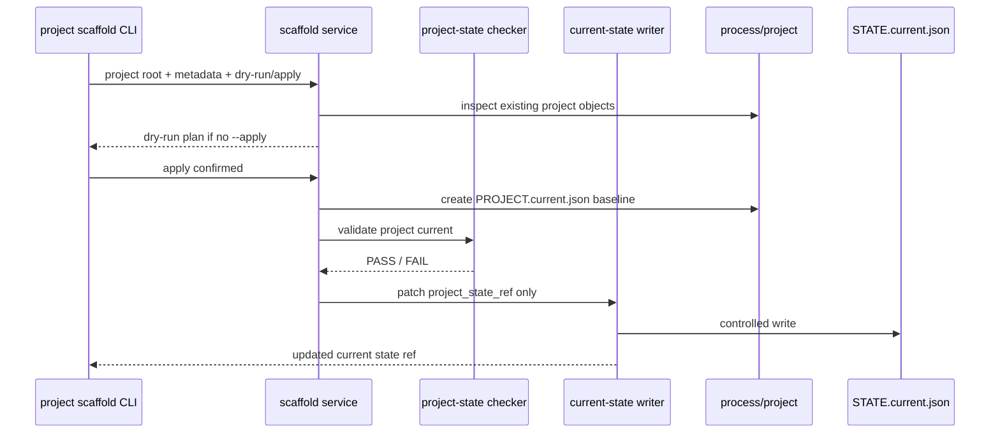

# LLD: CR037-S05 - project scaffold and PROJECT.current

本文档是 CR037-S05 的 Story 级设计证据。它只供 CP5 统一审查使用；`confirmed=false` 且 CP5 未通过前不得进入实现。

## 0. 上游设计依据

| 来源 | 路径 / ID | 被本 LLD 消费的内容 |
|---|---|---|
| Handoff | `process/handoffs/CR037-CP5-LLD-BATCH-B-HANDOFF.md` | 本 Story 只允许写 LLD；不得改代码、测试、STATE、ledger、其他 Story。 |
| CP5 Context | `process/context/CP5-CR-037-LLD-CONTEXT.yaml` | 当前为 CP5 LLD 批次，不授权实现；CR037-S05 依赖 CR037-S01/S02。 |
| Story Card | `process/stories/STORY-CR037-S05-project-scaffold-and-project-current.md` | 验收标准：bootstrap/workspace check 覆盖 `process/project/`；`PROJECT.current.json` 有 allowlist/budget；`STATE.current.json` 只通过 `project_state_ref` 指向项目状态。 |
| HLD | `process/docs/design/META-FLOW-PROJECT-GOVERNANCE-HLD.md` | ADR-PG-002、UC-PG-002、成功标准：`PROJECT.current.json` 不超过 16KB，current state 只保存 ref。 |
| ADR | `process/docs/design/META-FLOW-PROJECT-GOVERNANCE-ARCHITECTURE-DECISION.md` | `PROJECT.current.json` 独立存在；不得把 project fields 放入 `STATE.current.json`。 |
| Feature Matrix | `process/docs/design/META-FLOW-PROJECT-GOVERNANCE-FEATURE-DESIGN-MATRIX.md` | CR037-S05 `full-lld`；触发原因 data-model / workspace-scaffold。 |
| Feature DESIGN | `process/docs/features/project-state-governance/DESIGN.md` | `process/project/` 对象族、PROJECT.current refs-only schema、scaffold dry-run/apply、current writer contract。 |
| Feature TEST-PLAN | `process/docs/features/project-state-governance/TEST-PLAN.md` | PSG-UT-01/02、PSG-INT-01..03、PSG-CON-02、PSG-SEC-01/02/04、PSG-MAN-01/03。 |
| Feature TASKS | `process/docs/features/project-state-governance/TASKS.md` | PSG-TASK-001、004、005、006、008；FEAT-PG-001 writer/checker 是前置依赖。 |
| Existing Code | `meta_flow/workspace/routing.py`、`meta_flow/state/current.py` | 当前 workspace route health 和 current state v2 已存在；`process/project/` scaffold 尚未标准化。 |

## 1. Goal

为 Meta Flow 项目治理新增 `process/project/` scaffold 和 refs-only `PROJECT.current.json`，使 `STATE.current.json` 仅保存 `project_state_ref`，从而把长期项目治理状态从默认机器入口中剥离。

## 2. Requirements（Functional / Non-Functional）

### 2.1 Functional

- F-S05-01：workspace bootstrap/check 必须识别并校验 `process/project/` scaffold。
- F-S05-02：新增 `PROJECT.current.json` schema，字段必须 allowlist，unknown top-level field 为 ERROR。
- F-S05-03：`PROJECT.current.json` 总量预算为 16KB，超预算为 ERROR。
- F-S05-04：`PROJECT.current.json` 只能保存摘要和 refs，不得内嵌完整 HLD、完整 transcript、历史 ledger、roadmap 全文或 credentials。
- F-S05-05：`STATE.current.json` 只通过 `project_state_ref` 指向 `PROJECT.current.json`，不得内嵌 project fields。
- F-S05-06：scaffold 支持 dry-run/apply 两阶段；默认 dry-run；apply 时冲突不覆盖。
- F-S05-07：apply 创建 `process/project/PROJECT.current.json` 的最小 baseline，并为 CR037-S06 后续对象预留 `scale_ref`、`roadmap_ref`、`milestones_ref`。
- F-S05-08：只有 project current 校验通过后，才允许调用 CR037-S02 的 current-state writer 写入 `project_state_ref`。
- F-S05-09：断 ref、预算超限、forbidden fields、已存在冲突必须输出明确 finding。

### 2.2 Non-Functional

- N-S05-01：可维护性：项目长期状态外链到 project objects，默认 current state 保持轻量。
- N-S05-02：兼容性：已有没有 `project_state_ref` 的 current state 在 audit 阶段可 WARN；enforce 阶段按上游策略处理。
- N-S05-03：安全性：scaffold 不静默覆盖用户文件；不自动修改发布库；不处理 `process/quant-lab/**`。
- N-S05-04：可验证性：schema、budget、ref contract、dry-run/apply、冲突保护均有自动化测试入口。
- N-S05-05：可恢复性：scaffold apply 是幂等创建；冲突时 fail，不产生半写入 current state ref。

## 3. 模块拆分与职责

| 模块 / 文件组 | 职责 | 说明 |
|---|---|---|
| `meta_flow/project/state.py`（建议新建） | 定义 `PROJECT.current.json` schema、allowlist、budget、forbidden fields、reader/checker。 | 新建 `meta_flow/project/` 是因为 Story 卡片 primary owner 包含该路径，且 project objects 不属于 current state 内部实现。 |
| `meta_flow/project/scaffold.py`（建议新建） | 生成 scaffold plan、执行 apply、冲突检测、幂等创建。 | 默认 dry-run；apply 不覆盖已有不同内容文件。 |
| `meta_flow/workspace/routing.py` | 将 `process/project/` 纳入 workspace/process route health 或 scaffold dirs。 | 现有 `PROCESS_SCAFFOLD_DIRS` 未包含 `project`，需新增。 |
| `meta_flow/state/current.py` | 通过 CR037-S01/S02 的 allowlist/writer 支持 `project_state_ref` 字段。 | 本 Story 不直接绕过 writer 写 `STATE.current.json`。 |
| `meta_flow/cli.py` | 暴露 project scaffold/check 入口。 | 推荐 CLI 为 `meta-flow project scaffold` / `meta-flow project check`；若 CLI 聚合另有上游决策，可保持服务 API 不变。 |
| `process/project/PROJECT.current.json` | 项目级轻量当前状态。 | 运行时 scaffold 输出；本 LLD 阶段不创建。 |
| `tests/**` | 覆盖 schema、budget、scaffold、writer contract、manual refs trace。 | 本阶段不写测试，只定义入口。 |

## 4. 代码结构与文件影响范围

| 动作 | 文件路径 | 变更内容 |
|---|---|---|
| 创建 | `meta_flow/project/__init__.py` | 建立 project governance 模块命名空间。 |
| 创建 | `meta_flow/project/state.py` | 定义 `PROJECT.current.json` allowlist、16KB budget、forbidden fields、reader/checker 和 finding。 |
| 创建 | `meta_flow/project/scaffold.py` | 定义 dry-run/apply scaffold plan、冲突检测、最小 baseline 写入。 |
| 修改 | `meta_flow/workspace/routing.py` | 将 `project` 加入 process scaffold/health 检查，保证 bootstrap/workspace check 覆盖 `process/project/`。 |
| 修改 | `meta_flow/state/current.py` | 通过上游 writer/checker 支持 `project_state_ref` allowlist；禁止 project fields 内嵌。 |
| 修改 | `meta_flow/cli.py` | 增加 `project scaffold/check` 或等价路由到 project module。 |
| 创建 | `tests/test_cr037_project_current.py` | 覆盖 PROJECT.current schema、budget、forbidden fields、scaffold、current ref contract。 |
| 运行时创建 | `process/project/PROJECT.current.json` | scaffold apply 后生成最小 refs-only project current。 |

## 5. 数据模型与持久化设计

### `PROJECT.current.json` schema v1

| 对象 / 字段 | 类型 | 约束 | 说明 |
|---|---|---|---|
| `schema_version` | integer | 必填，初始为 `1`。 | schema 兼容版本。 |
| `project_id` | string | 必填，匹配 `STATE.current.json.project_id` 或 workspace metadata。 | 机器 ID。 |
| `project_name` | string | 必填，非空，短文本。 | 人类可读名称。 |
| `project_uid` | string | 可选，稳定 ID；若存在必须短文本。 | 支持跨路径识别。 |
| `scale_ref` | string | 可选，必须是相对路径，推荐 `process/project/PROJECT-SCALE.yaml`。 | CR037-S06 写入/校验。 |
| `roadmap_ref` | string | 可选，必须是相对路径，推荐 `process/project/ROADMAP.yaml`。 | CR037-S06 写入/校验。 |
| `milestones_ref` | string | 可选，必须是相对路径，推荐 `process/project/MILESTONES.yaml`。 | CR037-S06 写入/校验。 |
| `active_governance_refs` | array[string] | 可选，最多 20 项；只存 refs。 | 指向当前 governance evidence，不内嵌正文。 |
| `source_refs` | array[object] | 可选，最多 20 项；每项 `{kind,path}`。 | 追踪上游 HLD/ADR/Feature Matrix。 |
| `updated_at` | string | 必填，ISO timestamp。 | 更新时间。 |

### Allowlist / forbidden / budget

| 规则 | 约束 |
|---|---|
| Allowlist | 只允许上表字段；unknown top-level field 为 ERROR。 |
| Budget | 文件 UTF-8 bytes <= 16KB。 |
| Forbidden fields | `history`、`ledger`、`transcript`、`full_hld`、`full_roadmap`、`credentials`、`secret`、`token`、`private_key` 等字段名或 credential-like key 为 ERROR。 |
| Refs-only | roadmap、milestone、scale、docs、evidence 只能通过 ref 保存；不得内嵌对象全文。 |
| Path | refs 使用项目相对路径，不写设备相关绝对路径。 |

### `STATE.current.json` integration

| 对象 / 字段 | 类型 | 约束 | 说明 |
|---|---|---|---|
| `project_state_ref` | string | 可选/后续必填；相对路径；推荐 `process/project/PROJECT.current.json`。 | 唯一允许进入 current state 的 project governance 字段。 |

持久化边界：本 Story 实现阶段会创建 runtime scaffold；LLD 阶段不创建 `process/project/` 文件。

## 6. API / Interface 设计

| 接口 / 入口 | 输入 | 输出 | 调用方 | 说明 |
|---|---|---|---|---|
| `meta-flow project scaffold --project-root PATH [--project-id ID] [--project-name NAME]` | project root、id/name、默认 dry-run。 | scaffold plan。 | Host Orchestrator、维护者、CI。 | 不写文件；对应 PSG-INT-01。 |
| `meta-flow project scaffold ... --apply` | 同上 + apply 授权。 | created file list、project-state check result、可选 writer result。 | Host Orchestrator、维护者。 | 冲突 fail，不覆盖；对应 PSG-INT-02/03。 |
| `meta-flow project check --project-root PATH` | project root。 | finding list + PASS/FAIL。 | CI、meta-qa、workspace check。 | 覆盖 schema、budget、ref、forbidden fields。 |
| `validate_project_current(path)` | `PROJECT.current.json` path。 | errors、warnings、typed object。 | project checker、reader。 | 对应 PSG-UT-01/02。 |
| `build_project_scaffold_plan(root, metadata)` | workspace root、project metadata。 | create/update/noop/conflict plan。 | CLI、workspace bootstrap。 | 无副作用。 |
| `apply_project_scaffold(plan)` | 已验证 plan。 | created paths 或 conflict findings。 | CLI。 | 不覆盖已有不同内容。 |
| `write_current_state(project_state_ref)` | ref patch、actor、reason。 | updated `STATE.current.json`。 | scaffold apply。 | 必须调用 CR037-S02 writer；不得直接写文件。 |

## 7. 核心处理流程



处理顺序：

1. CLI 或 bootstrap 调用 scaffold service，默认 dry-run。
2. scaffold service 检查 `process/project/` 是否存在、目标文件是否冲突。
3. dry-run 输出 plan，不创建文件、不写 current state。
4. apply 创建最小 `PROJECT.current.json`，若文件已存在且内容不同则 fail。
5. project checker 校验 allowlist、budget、forbidden fields、relative refs。
6. 校验通过后，通过 CR037-S02 controlled writer 写入 `STATE.current.json.project_state_ref`。
7. 写入失败或校验失败时，不留下指向 invalid project current 的 current ref。

## 8. 技术设计细节

- 关键算法 / 规则：
  - scaffold plan 对每个目标文件给出 `create | noop | conflict`，只有所有目标无 conflict 才允许 apply。
  - `PROJECT.current.json` budget 使用文件实际 UTF-8 bytes，而不是 Python object 长度。
  - refs 必须是项目相对路径；绝对路径、`..` 越界路径、`process/quant-lab/**` 在本 Story 中为 ERROR。
  - current state patch 只能包含 `project_state_ref`，不能包含 `project_name`、`roadmap`、`milestones` 等 project fields。
- 依赖选择与复用点：
  - 复用 `meta_flow/workspace/routing.py` 的 route health 概念，新增 project scaffold health。
  - 复用 CR037-S01/S02 的 current-state allowlist 和 writer；本 Story 不自建第二套 current writer。
  - 复用 `meta_flow/cli.py` 顶层分发模式。
- 兼容性处理：
  - 对已有 workspace，缺少 `process/project/` 在 audit/check 阶段可作为 WARN；执行 scaffold 后应 PASS。
  - 如果 CR037-S01/S02 尚未进入实现，S05 实现必须等待 dev_gate；LLD 不阻断，因为 DAG 已声明依赖。
  - 若 existing `process/project/PROJECT.current.json` 已存在且符合 schema，scaffold apply 为 noop。
- 图示类型选择：时序图；本 Story 涉及 CLI、scaffold、checker、writer、filesystem 多模块交互。

### PROJECT.current refs-only 约束

| 允许进入 `PROJECT.current.json` | 不允许进入 `PROJECT.current.json` | 原因 |
|---|---|---|
| `scale_ref`、`roadmap_ref`、`milestones_ref`、`source_refs`、`active_governance_refs` | 完整 roadmap items、完整 HLD、完整 LLD、完整 TEST-MATRIX、ledger 正文、transcript | 保持 16KB budget，防止 project current 成为新的巨型状态。 |
| 短字段：project id/name/uid、updated_at | credentials、token、private key、cookie、账户信息 | 安全边界。 |
| 相对路径 refs | 设备相关绝对路径、越界路径、quant-lab 发布库写入路径 | 保持 artifact 可迁移，避免未授权跨仓写入。 |

## 9. 安全与性能设计

| 维度 | 设计措施 | 验证方式 |
|---|---|---|
| 安全 | 默认 dry-run；apply 不覆盖冲突文件；禁止 credential-like fields；不处理 `process/quant-lab/**`。 | PSG-SEC-01、PSG-SEC-02。 |
| 授权 | `STATE.current.json` 只通过 controlled writer 写 `project_state_ref`；不直接修改发布库。 | PSG-CON-02、PSG-SEC-04。 |
| 性能 | `PROJECT.current.json` <= 16KB；只保存 refs；checker 不读取完整 HLD/LLD/transcript。 | PSG-UT-02。 |
| 可恢复 | scaffold 冲突时 fail，不产生半写；current ref 只在 project check PASS 后写入。 | PSG-INT-03。 |
| 兼容 | 缺少 project scaffold 时先 WARN/blocked finding，不破坏现有 current state check。 | PSG-INT-02、PSG-MAN-03。 |

## 10. 测试设计

| 测试场景 | 前置条件 | 操作 | 预期结果 | 验证方式 |
|---|---|---|---|---|
| PSG-UT-01 最小合法 project current | 准备最小 JSON。 | 调用 `validate_project_current()`。 | PASS，budget PASS。 | unit test。 |
| PSG-UT-02 unknown/forbidden/over-budget | 准备含 unknown field、长文本、credential-like key 的 JSON。 | 调用 checker。 | ERROR，包含字段路径和错误码。 | unit/security test。 |
| PSG-INT-01 dry-run scaffold | 空 tmp workspace。 | `meta-flow project scaffold --project-root <tmp>`。 | 输出 create plan；不创建 `process/project/`。 | integration CLI test。 |
| PSG-INT-02 apply scaffold | 空 tmp workspace，current writer 可用。 | `meta-flow project scaffold --project-root <tmp> --apply`。 | 创建 `PROJECT.current.json`，project check PASS，current state 只写 `project_state_ref`。 | integration + contract test。 |
| PSG-INT-03 冲突不覆盖 | tmp workspace 中预置不同内容 `PROJECT.current.json`。 | 执行 apply。 | FAIL；原文件 hash 不变；不写 current ref。 | integration/security test。 |
| PSG-CON-02 current ref contract | CR037-S02 writer 可用。 | scaffold apply 提交 patch。 | patch 只含 `project_state_ref`；writer 拒绝 project fields。 | contract test。 |
| PSG-SEC-04 直接内嵌 project fields | 构造 current state patch 含 roadmap/project fields。 | 调用 writer/checker。 | ERROR。 | contract/security test。 |
| PSG-MAN-03 ref 可追踪 | scaffold 输出存在。 | 人工从 current `project_state_ref` 追踪到 `PROJECT.current.json`。 | 路径清晰；断链有明确错误。 | manual QA。 |

## 11. 实施步骤

| TASK-ID | 动作 | 目标文件 | 详细描述 | 对应测试 |
|---|---|---|---|---|
| PSG-TASK-001 | 创建 | `meta_flow/project/state.py` | 定义 `PROJECT.current.json` schema、allowlist、16KB budget、forbidden fields、错误码。 | PSG-UT-01、PSG-UT-02 |
| PSG-TASK-004 | 创建 | `meta_flow/project/scaffold.py` | 实现 scaffold dry-run/apply、plan、conflict detection、baseline JSON。 | PSG-INT-01、PSG-INT-03 |
| PSG-TASK-004 | 修改 | `meta_flow/cli.py` | 增加 `project scaffold` 和 `project check` 路由。 | PSG-INT-01、PSG-INT-02 |
| PSG-TASK-004 | 修改 | `meta_flow/workspace/routing.py` | 将 `project` 加入 process scaffold/health 检查。 | PSG-INT-02 |
| PSG-TASK-005 | 修改 | `meta_flow/state/current.py` 或 CR037-S02 writer 模块 | 支持 `project_state_ref` allowlist，并确保写入走 controlled writer。 | PSG-CON-02、PSG-SEC-04 |
| PSG-TASK-006 | 创建 | `meta_flow/project/state.py` | 实现 project-state checker 和 finding model。 | PSG-UT-01、PSG-UT-02 |
| PSG-TASK-008 | 创建 | `tests/test_cr037_project_current.py` | 增加 schema、budget、dry-run/apply、conflict、current ref contract 测试。 | PSG-UT/INT/CON/SEC |

## 12. 风险、难点与预研建议

### 12.1 实现灰区与取舍记录

| Clarification ID | 问题 | 选项与推荐 | 决策 / 答案 | 影响面 | 证据 | 重访条件 |
|---|---|---|---|---|---|---|
| LCQ-CR037-S05-01 | project scaffold CLI 是否固定为 `meta-flow project scaffold/check`。 | 推荐：`meta-flow project scaffold` 和 `meta-flow project check`，与 project governance 子域一致；备选：挂到 `meta-flow workspace bootstrap/check`，减少顶层命令但会混淆 workspace route 与 project objects。 | pending；blocks_lld=false；本 LLD 以服务 API 为稳定契约，CLI 可在 CP5 后按确认命名同步。 | 接口、文档、测试、CLI UX。 | Feature DESIGN PSG-IF-01/02；Story AC 要求 bootstrap/workspace check 覆盖 project。 | CP5 要求 CLI 全部聚合到 workspace，或实现发现顶层 project 命令与 S06/S12 冲突。 |

| 风险 / 难点 | 影响 | 缓解措施 / 预研建议 |
|---|---|---|
| FEAT-PG-001/S02 writer 未完成 | S05 无法安全写 `project_state_ref`。 | Story DAG 已依赖 CR037-S01/S02；实现阶段必须等 dev_gate，LLD 只定义 contract。 |
| PROJECT.current 成为新巨型状态 | 违背 current state 瘦身目标。 | 16KB budget、allowlist、forbidden fields、refs-only checker。 |
| scaffold 覆盖用户文件 | 数据丢失。 | 默认 dry-run；apply conflict fail；不生成 silent merge。 |
| project refs 使用绝对路径 | 跨机器不可迁移。 | checker 拒绝绝对路径和 `..` 越界路径。 |

### OPEN / Spike 跟踪

| ID | 类型（OPEN / Spike） | 问题 | 下一动作 | 责任方 |
|---|---|---|---|---|
| O-S05-01 | OPEN | CLI 是否最终固定为 `project scaffold/check` 或合并到 workspace 命令。 | host-orchestrator 汇总到 CP5；若无修改意见，按推荐方案实现。 | host-orchestrator / user |

## 13. 回滚与发布策略

- 发布方式：CR037-S05 在 CR037-S01/S02 通过 CP6/CP7 后进入 W2 实现；先提供 checker/scaffold/contract tests，再由后续 S06 写入 scale/roadmap refs。
- 回滚触发条件：project checker 误伤合法 baseline、scaffold 冲突处理错误、current state 出现 project fields 内嵌、`project_state_ref` 断链。
- 回滚动作：移除 `project` CLI 路由和 project module；删除未被 current state 引用的 runtime scaffold candidate；通过 CR037-S02 writer 移除或修正 `project_state_ref`；不得手工直接编辑 `STATE.current.json`。

## 14. Definition of Done

- [ ] 14 个章节全部填写完成。
- [ ] `PROJECT.current.json` schema、allowlist、16KB budget、forbidden fields 明确。
- [ ] `STATE.current.json` refs-only 约束明确：只保存 `project_state_ref`。
- [ ] scaffold dry-run/apply、冲突不覆盖、writer contract、断 ref 失败路径均有测试入口。
- [ ] 文件影响范围、接口、测试与 TASK-ID 可一一追踪。
- [ ] CR037-S01/S02 依赖和 dev_gate 已明确，未绕过 writer。
- [ ] 实现灰区已写入 clarification candidate，且 blocks_lld=false。
- [ ] `confirmed=false` 时不进入实现。

## 人工确认区

> **CP5 - Story 设计证据可实现性门**
> host-orchestrator 收齐全部目标 Story 的完整 LLD、Story 技术说明或 waived 证据、CP4 自动预检摘要和 CP5 自动预检后，再生成并提示用户审查 `process/checkpoints/CP5-ALL-STORIES-LLD-BATCH.md`。

**CP5 checklist 摘要**：

| # | 检查项 | 状态 | 证据 |
|---|---|---|---|
| 1 | LLD 覆盖 AC | 待检查 | 第 2 / 5 / 8 / 10 / 14 节 |
| 2 | 与 HLD / ADR 一致 | 待检查 | 第 0 / 3 / 8 / 12 节 |
| 3 | 文件影响范围明确 | 待检查 | 第 4 / 11 节 |
| 4 | 接口契约完整 | 待检查 | 第 6 节 |
| 5 | 测试与 dev_gate 可计算 | 待检查 | 第 10 / 14 节 |
| 6 | clarification queue 已收敛 | 待检查 | 第 12.1 节 |

**人工确认回复**：

```text
approve
修改: <具体修改点>
reject
```

**人工审查结果回填**：

- 结论：`approved | changes_requested | rejected`
- 审查人：
- 审查时间：
- 修改意见：
- 风险接受项：
