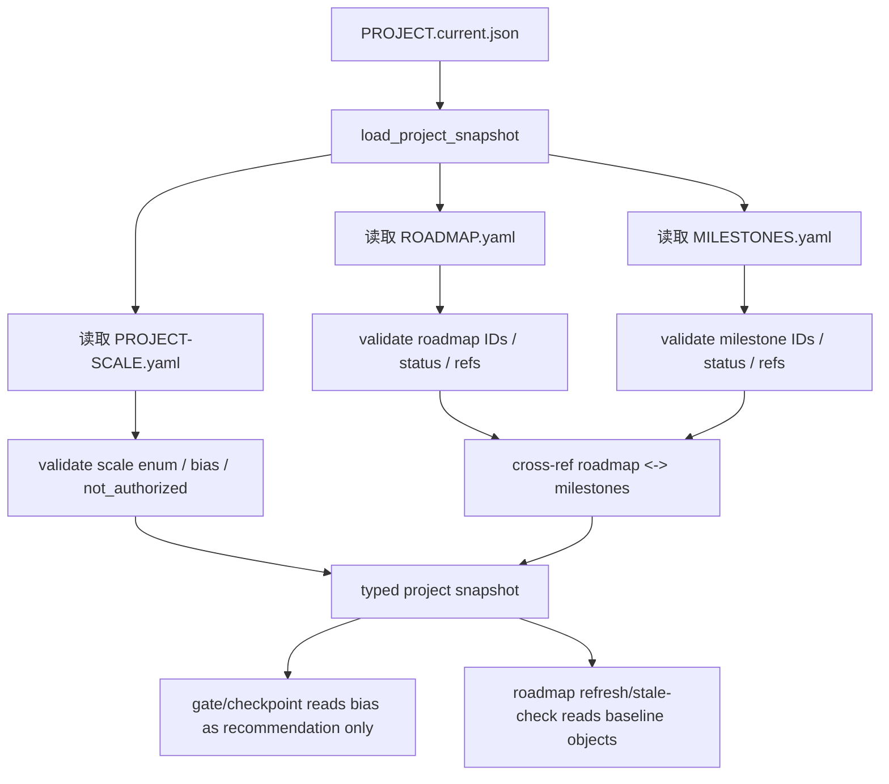

# LLD: CR037-S06 - PROJECT-SCALE and roadmap objects

本文档是 CR037-S06 的 Story 级设计证据。它只供 CP5 统一审查使用；`confirmed=false` 且 CP5 未通过前不得进入实现。

## 0. 上游设计依据

| 来源 | 路径 / ID | 被本 LLD 消费的内容 |
|---|---|---|
| Handoff | `process/handoffs/CR037-CP5-LLD-BATCH-B-HANDOFF.md` | 本 Story 只允许写 LLD；不得改代码、测试、STATE、ledger、其他 Story。 |
| CP5 Context | `process/context/CP5-CR-037-LLD-CONTEXT.yaml` | 当前为 CP5 LLD 批次，不授权实现；CR037-S06 依赖 CR037-S05。 |
| Story Card | `process/stories/STORY-CR037-S06-project-scale-and-roadmap-objects.md` | 验收标准：`PROJECT-SCALE.yaml` 记录三档 scale、bias、reason；不直接修改 `GATE-PROFILES.json`；`ROADMAP.yaml`/`MILESTONES.yaml` 可被 checker 读取。 |
| HLD | `process/docs/design/META-FLOW-PROJECT-GOVERNANCE-HLD.md` | UC-PG-003：project scale 提供 gate profile 默认偏好；HLD 非目标：不直接修改 `GATE-PROFILES.json`。 |
| ADR | `process/docs/design/META-FLOW-PROJECT-GOVERNANCE-ARCHITECTURE-DECISION.md` | ADR-PG-002 独立 project state；ADR-PG-003 process-only roadmap boundary。 |
| Feature Matrix | `process/docs/design/META-FLOW-PROJECT-GOVERNANCE-FEATURE-DESIGN-MATRIX.md` | CR037-S06 `full-lld`；重访条件为 project scale 或 gate bias 规则变化。 |
| Feature DESIGN | `process/docs/features/project-state-governance/DESIGN.md` | `PROJECT-SCALE.yaml`、`ROADMAP.yaml`、`MILESTONES.yaml` schema、reader contract、scale bias 不授权边界。 |
| Feature TEST-PLAN | `process/docs/features/project-state-governance/TEST-PLAN.md` | PSG-UT-03/04/05、PSG-CON-01/03、PSG-SEC-03、PSG-MAN-02。 |
| Feature TASKS | `process/docs/features/project-state-governance/TASKS.md` | PSG-TASK-002、003、006、008。 |
| Existing Code | `meta_flow/policies/gate_profiles.py`、`meta_flow/workspace/routing.py`、`meta_flow/cli.py` | gate profile policy 已有独立模块；本 Story 不直接改 `process/policies/GATE-PROFILES.json`。 |

## 1. Goal

新增项目级 `PROJECT-SCALE.yaml`、`ROADMAP.yaml` 和 `MILESTONES.yaml` 的 schema、reader 与 checker 设计，使项目规模能作为 gate profile 默认偏好输入，同时不替代人工门禁、不直接修改 gate policy。

## 2. Requirements（Functional / Non-Functional）

### 2.1 Functional

- F-S06-01：新增 `PROJECT-SCALE.yaml` schema，支持 `lite`、`standard`、`full` 三档。
- F-S06-02：`PROJECT-SCALE.yaml` 必须记录 `scale_reason`、`gate_profile_bias`、`review_cadence_bias` 和 `not_authorized`。
- F-S06-03：scale bias 只能作为 checkpoint/gate 默认建议，不得直接修改 `process/policies/GATE-PROFILES.json`。
- F-S06-04：checker 必须拒绝 `auto_approve`、`skip_gate`、`runtime_authorization`、`publish_authorization` 等授权语义。
- F-S06-05：新增 `ROADMAP.yaml` schema，记录 roadmap baseline、horizon、items、milestone refs、source refs。
- F-S06-06：新增 `MILESTONES.yaml` schema，记录 milestone id/title/status/target window/roadmap refs。
- F-S06-07：reader 能从 `PROJECT.current.json` 的 refs 解析 scale、roadmap、milestones，返回 typed project snapshot。
- F-S06-08：断 ref、ID 重复、状态非法、roadmap/milestone 互引不一致必须输出 blocked finding。
- F-S06-09：S06 不实现 roadmap refresh cascade、不写 Gate Ledger event、不生成 stale/follow-up；这些属于后续 FEAT-PG-006/008。

### 2.2 Non-Functional

- N-S06-01：安全性：project scale 不授权跳过 CP、修改 gate policy、runtime、publish、live 或 production write。
- N-S06-02：可维护性：roadmap/milestone 是 project-level baseline；refresh 机制后续独立消费。
- N-S06-03：可验证性：scale enum、bias 文案、not-authorized、roadmap/milestone refs、reader contract 均有测试入口。
- N-S06-04：兼容性：`PROJECT.current.json` 只保存 refs；完整 roadmap/milestone 内容保存在独立 YAML。
- N-S06-05：可迁移性：所有 refs 使用相对路径，不写设备相关绝对路径。

## 3. 模块拆分与职责

| 模块 / 文件组 | 职责 | 说明 |
|---|---|---|
| `meta_flow/project/scale.py`（建议新建） | 定义 `PROJECT-SCALE.yaml` schema、scale enum、gate bias 校验、安全负面规则。 | 不直接调用或修改 `GATE-PROFILES.json`。 |
| `meta_flow/project/roadmap.py`（建议新建） | 定义 `ROADMAP.yaml`、`MILESTONES.yaml` schema、reader、cross-ref validation。 | 只负责 baseline objects，不负责 refresh/stale。 |
| `meta_flow/project/state.py` | 读取 CR037-S05 `PROJECT.current.json` refs 并组合 typed project snapshot。 | S06 依赖 S05 scaffold/schema。 |
| `meta_flow/policies/gate_profiles.py` | 作为下游可读的 gate profile policy 模块。 | 本 Story 不修改 policy 文件；只定义 bias consumer contract。 |
| `process/project/PROJECT-SCALE.yaml` | 项目规模和 gate profile bias。 | runtime scaffold/update 输出。 |
| `process/project/ROADMAP.yaml` | 项目级 roadmap baseline。 | 后续 roadmap refresh 可更新 process-side object。 |
| `process/project/MILESTONES.yaml` | milestone baseline。 | 被 roadmap/stale-check 读取。 |
| `tests/**` | 覆盖 scale enum、安全负面、roadmap/milestone schema、reader contract。 | 本阶段不写测试，只定义入口。 |

## 4. 代码结构与文件影响范围

| 动作 | 文件路径 | 变更内容 |
|---|---|---|
| 创建 | `meta_flow/project/scale.py` | 定义 scale schema、bias enum、not-authorized 校验、finding。 |
| 创建 | `meta_flow/project/roadmap.py` | 定义 roadmap/milestone schema、reader、cross-ref checker。 |
| 修改 | `meta_flow/project/state.py` | 在 S05 的 project current reader 上增加 scale/roadmap/milestone refs 解析和 typed snapshot。 |
| 修改 | `meta_flow/cli.py` | 在 `meta-flow project check` 中纳入 scale、roadmap、milestones 校验。 |
| 创建 | `tests/test_cr037_project_scale_roadmap.py` | 覆盖 PSG-UT-03/04/05、PSG-CON-01/03、PSG-SEC-03。 |
| 运行时创建 | `process/project/PROJECT-SCALE.yaml` | 记录 scale level、reason、gate_profile_bias、review_cadence_bias、not_authorized。 |
| 运行时创建 | `process/project/ROADMAP.yaml` | 记录 roadmap baseline。 |
| 运行时创建 | `process/project/MILESTONES.yaml` | 记录 milestone baseline。 |
| 禁止修改 | `process/policies/GATE-PROFILES.json` | 本 Story 不直接修改 gate policy。 |

## 5. 数据模型与持久化设计

### `PROJECT-SCALE.yaml` schema v1

| 对象 / 字段 | 类型 | 约束 | 说明 |
|---|---|---|---|
| `schema_version` | integer | 必填，初始为 `1`。 | schema 版本。 |
| `project_id` | string | 必填，匹配 project current。 | 归属项目。 |
| `scale_level` | enum | `lite | standard | full`。 | 三档规模。 |
| `scale_reason` | array[string] | 必填，1..10 项，每项短文本。 | 解释为何选择该 scale。 |
| `gate_profile_bias.default_profile` | string | 可选，必须是已知 profile ID 或空。 | 默认建议，不是 policy 修改。 |
| `gate_profile_bias.reason` | string | 必填。 | 解释 bias。 |
| `gate_profile_bias.applies_to` | array[string] | 可选，建议 `CP2/CP3/CP5/CP8` 等。 | 说明影响的 gate 建议范围。 |
| `review_cadence_bias` | object | 可选，只能表达建议频率。 | 不替代人工确认。 |
| `not_authorized` | array[string] | 必填，至少包含 `skip_human_gate`、`modify_gate_profiles`、`runtime_authorization`、`publish_authorization`。 | 安全边界。 |
| `source_refs` | array[object] | 可选。 | 指向 HLD/ADR/Feature Matrix。 |
| `updated_at` | string | 必填 ISO timestamp。 | 更新时间。 |

### `ROADMAP.yaml` schema v1

| 对象 / 字段 | 类型 | 约束 | 说明 |
|---|---|---|---|
| `schema_version` | integer | 必填，初始为 `1`。 | schema 版本。 |
| `roadmap_id` | string | 必填，稳定 ID。 | 项目 roadmap baseline。 |
| `project_id` | string | 必填。 | 归属项目。 |
| `horizon` | string | 必填，短文本，如 `2026-H2`。 | 时间范围。 |
| `items[]` | array[object] | 可为空但字段结构固定。 | roadmap item baseline。 |
| `items[].id` | string | 必填，唯一。 | roadmap item ID。 |
| `items[].title` | string | 必填，短文本。 | item 标题。 |
| `items[].status` | enum | `planned | active | blocked | done | deferred`。 | 状态枚举。 |
| `items[].milestone_refs` | array[string] | 可选，必须指向 milestones。 | 与 MILESTONES 互引。 |
| `source_refs` | array[object] | 可选。 | 上游设计来源。 |

### `MILESTONES.yaml` schema v1

| 对象 / 字段 | 类型 | 约束 | 说明 |
|---|---|---|---|
| `schema_version` | integer | 必填，初始为 `1`。 | schema 版本。 |
| `project_id` | string | 必填。 | 归属项目。 |
| `milestones[]` | array[object] | 可为空但结构固定。 | milestone baseline。 |
| `milestones[].milestone_id` | string | 必填，唯一。 | milestone ID。 |
| `milestones[].title` | string | 必填，短文本。 | 标题。 |
| `milestones[].target_window` | string | 可选，短文本。 | 目标窗口。 |
| `milestones[].status` | enum | `planned | active | blocked | done | deferred`。 | 状态枚举。 |
| `milestones[].roadmap_item_refs` | array[string] | 可选，必须指向 roadmap items。 | 与 ROADMAP 互引。 |

### `PROJECT.current.json` refs

| 字段 | 约束 | 说明 |
|---|---|---|
| `scale_ref` | 相对路径，推荐 `process/project/PROJECT-SCALE.yaml`。 | 由 S06 写入/校验。 |
| `roadmap_ref` | 相对路径，推荐 `process/project/ROADMAP.yaml`。 | 由 S06 写入/校验。 |
| `milestones_ref` | 相对路径，推荐 `process/project/MILESTONES.yaml`。 | 由 S06 写入/校验。 |

## 6. API / Interface 设计

| 接口 / 入口 | 输入 | 输出 | 调用方 | 说明 |
|---|---|---|---|---|
| `meta-flow project check --project-root PATH` | project root。 | scale/roadmap/milestone finding list。 | CI、meta-qa、Host Orchestrator。 | 对应 PSG-UT-03/04/05、PSG-CON-01。 |
| `validate_project_scale(path)` | `PROJECT-SCALE.yaml`。 | typed scale + errors/warnings。 | project checker、gate consumer。 | 拒绝授权语义；对应 PSG-SEC-03。 |
| `validate_roadmap(path, milestones)` | roadmap path + milestone snapshot。 | typed roadmap + cross-ref findings。 | project checker、roadmap refresh。 | ID 唯一、状态枚举、milestone refs 完整。 |
| `validate_milestones(path, roadmap)` | milestone path + roadmap snapshot。 | typed milestones + cross-ref findings。 | project checker、stale-check。 | milestone ID 唯一、roadmap refs 完整。 |
| `load_project_snapshot(project_current_path)` | `PROJECT.current.json`。 | `{project_current, scale, roadmap, milestones}` typed snapshot。 | FEAT-PG-006 roadmap refresh、FEAT-PG-008 stale-check、checkpoint/gate consumers。 | 断 ref 返回 `E_PROJECT_OBJECT_INVALID`。 |
| Gate bias consumer contract | typed `ProjectScale`。 | recommended profile ID + reason + not-authorized boundary。 | checkpoint-manager / gate profile advisor。 | 只能读建议，不写 `GATE-PROFILES.json`。 |

## 7. 核心处理流程



处理顺序：

1. 读取 S05 的 `PROJECT.current.json`。
2. 解析 `scale_ref`、`roadmap_ref`、`milestones_ref`，拒绝断链、绝对路径和越界路径。
3. 校验 `PROJECT-SCALE.yaml` 的三档 scale、bias、reason 和 not-authorized。
4. 校验 `ROADMAP.yaml`、`MILESTONES.yaml` 的 ID 唯一性、状态枚举和互引完整性。
5. 组合 typed project snapshot，供 gate/checkpoint、roadmap refresh、stale-check 下游只读消费。
6. 若任一对象 invalid，下游 refresh/stale/checkpoint bias 只能 blocked 或降级为无 bias，不得猜测。

## 8. 技术设计细节

- 关键算法 / 规则：
  - `scale_level` 仅允许 `lite | standard | full`；不得扩展 hot/warm/cold 或五档规模矩阵。
  - `gate_profile_bias` 是 recommendation，不是 mutation：checker 若发现 `modify_gate_profiles`、`auto_approve`、`skip_cp`、`runtime_authorization` 等语义则 ERROR。
  - roadmap item ID 与 milestone ID 分别唯一；互引不存在时 ERROR。
  - typed snapshot 采用“全部有效才 PASS”的 strict 模型；下游不使用部分 invalid 对象。
- 依赖选择与复用点：
  - 依赖 S05 `PROJECT.current.json` reader 和 refs-only schema。
  - 复用现有 `meta_flow/policies/gate_profiles.py` 作为 gate profile ID 的读取/校验来源；本 Story 不写 `GATE-PROFILES.json`。
  - 后续 FEAT-PG-006/008 复用 `load_project_snapshot()`，避免各自解析 YAML。
- 兼容性处理：
  - S05 scaffold 后若 `scale_ref/roadmap_ref/milestones_ref` 为空，S06 check 可返回 WARN 或 BLOCKED，取决于调用阶段；S06 apply 后应 PASS。
  - 旧项目没有 project objects 时，先由 S05 scaffold 补齐；S06 不绕过 scaffold。
  - 若 gate profile ID 不存在，bias ignored + ERROR/WARN 由 checker 按 enforce 阶段决定。
- 图示类型选择：流程图；本 Story 主要是多对象 reader/checker 与下游 contract。

### project-scale 与 gate_profile bias 的关系

| 对象 | 允许行为 | 禁止行为 | 下游消费方式 |
|---|---|---|---|
| `PROJECT-SCALE.yaml.scale_level` | 说明项目治理规模：`lite`、`standard`、`full`。 | 作为单次 CR 风险授权。 | 供 checkpoint/gate advisor 解释默认建议。 |
| `gate_profile_bias` | 推荐默认 gate profile、审查节奏和理由。 | 直接写 `process/policies/GATE-PROFILES.json`、跳过人工 CP、自动 approve。 | 下游只读；用户仍需在 CP2/CP3/CP5/CP8 做人工确认。 |
| `not_authorized` | 显式声明不授权项。 | 留空或省略授权边界。 | checker 用于防止误用。 |

## 9. 安全与性能设计

| 维度 | 设计措施 | 验证方式 |
|---|---|---|
| 安全 | scale bias 只读；not-authorized 必填；禁止 auto approve / skip gate / runtime / publish 语义。 | PSG-SEC-03、PSG-CON-03、MAN-02。 |
| 授权 | 不修改 `GATE-PROFILES.json`；不触发 runtime、publish、live、production write。 | negative fixture + 人工审查。 |
| 性能 | ROADMAP/MILESTONES 保持 baseline YAML；`PROJECT.current.json` 只保存 refs；reader 按 refs 读取必要对象。 | project current budget test、reader unit test。 |
| 可维护性 | schema 与 reader contract 独立于 roadmap refresh/stale-check。 | PSG-CON-01。 |
| 兼容 | invalid project object 阻断下游，不做模型猜测。 | broken ref fixture。 |

## 10. 测试设计

| 测试场景 | 前置条件 | 操作 | 预期结果 | 验证方式 |
|---|---|---|---|---|
| PSG-UT-03 legal scale | 准备合法 `PROJECT-SCALE.yaml`。 | `validate_project_scale()`。 | PASS；返回 scale level、bias、reason、not_authorized。 | unit test。 |
| PSG-SEC-03 scale 授权语义 | scale fixture 含 `auto_approve`、`skip_gate` 或 `modify_gate_profiles`。 | `validate_project_scale()`。 | ERROR，指出字段路径。 | security unit test。 |
| PSG-UT-04 roadmap schema | 准备合法/非法 `ROADMAP.yaml`。 | `validate_roadmap()`。 | 合法 PASS；重复 item ID 或非法 status ERROR。 | unit test。 |
| PSG-UT-05 milestone schema | 准备合法/非法 `MILESTONES.yaml`。 | `validate_milestones()`。 | 合法 PASS；重复 milestone ID 或非法 status ERROR。 | unit test。 |
| PSG-CON-01 typed snapshot | `PROJECT.current.json` refs 指向三对象。 | `load_project_snapshot()`。 | 返回 typed snapshot；断 ref 返回 `E_PROJECT_OBJECT_INVALID`。 | contract/integration test。 |
| PSG-CON-03 gate bias consumer | scale 指向已知 gate profile。 | gate/checkpoint advisor 读取 bias。 | 只返回 recommendation，不修改 policy 文件。 | contract test + file hash assertion。 |
| PSG-MAN-02 人工审查 scale | 生成 `PROJECT-SCALE.yaml`。 | 人工检查 scale reason 和 not-authorized。 | 能解释 bias，但不授权跳过人工门禁。 | manual QA。 |

## 11. 实施步骤

| TASK-ID | 动作 | 目标文件 | 详细描述 | 对应测试 |
|---|---|---|---|---|
| PSG-TASK-002 | 创建 | `meta_flow/project/scale.py` | 定义 `PROJECT-SCALE.yaml` schema、scale enum、gate bias、not-authorized 校验。 | PSG-UT-03、PSG-SEC-03 |
| PSG-TASK-003 | 创建 | `meta_flow/project/roadmap.py` | 定义 `ROADMAP.yaml` / `MILESTONES.yaml` schema、ID/status/refs 校验。 | PSG-UT-04、PSG-UT-05 |
| PSG-TASK-003 | 修改 | `meta_flow/project/state.py` | 扩展 S05 reader，支持从 `PROJECT.current.json` refs 组装 typed project snapshot。 | PSG-CON-01 |
| PSG-TASK-006 | 修改 | `meta_flow/cli.py` | 将 scale/roadmap/milestone checker 纳入 `meta-flow project check`。 | PSG-CON-01 |
| PSG-TASK-006 | 创建 | `tests/test_cr037_project_scale_roadmap.py` | 增加 scale、roadmap、milestone、gate bias、reader contract 测试。 | PSG-UT/CON/SEC |
| PSG-TASK-008 | 记录 | QA checklist / CP6 evidence | 人工验收 scale bias、不授权边界、roadmap/milestone 可读性。 | PSG-MAN-02 |

## 12. 风险、难点与预研建议

### 12.1 实现灰区与取舍记录

| Clarification ID | 问题 | 选项与推荐 | 决策 / 答案 | 影响面 | 证据 | 重访条件 |
|---|---|---|---|---|---|---|
| LCQ-CR037-S06-01 | `gate_profile_bias.default_profile` 是否必须引用现有 `GATE-PROFILES.json` profile ID。 | 推荐：必须引用现有 profile ID 或留空，并由 checker 验证；备选：允许自由字符串，仅作说明文本。推荐方案可减少漂移。 | pending；blocks_lld=false；本 LLD 以“引用现有 profile 或留空”为设计。 | 接口、checker、测试、gate 消费契约。 | HLD UC-PG-003；Feature DESIGN PSG-DQ-002；Story AC 不直接修改 `GATE-PROFILES.json`。 | CP5 要求更宽松文案，或现有 gate profile 模块无法稳定暴露 profile IDs。 |

| 风险 / 难点 | 影响 | 缓解措施 / 预研建议 |
|---|---|---|
| scale bias 被误解为授权 | 可能绕过人工 CP 或风险接受。 | `not_authorized` 必填；negative fixtures；manual QA。 |
| gate profile ID 漂移 | bias 指向不存在 profile。 | checker 读取现有 gate profile list；不存在则 ERROR/WARN。 |
| roadmap/milestone schema 被后续 refresh 返工 | W4 返工成本上升。 | S06 只定义 baseline 和 reader contract；refresh decision schema 放到 FEAT-PG-006。 |
| typed snapshot 部分 invalid 被下游误用 | 下游行为不确定。 | strict reader：任一核心对象 invalid 时返回 blocked finding，不返回可用 snapshot。 |

### OPEN / Spike 跟踪

| ID | 类型（OPEN / Spike） | 问题 | 下一动作 | 责任方 |
|---|---|---|---|---|
| O-S06-01 | OPEN | gate bias 是否必须引用现有 gate profile ID 或允许自由文本。 | host-orchestrator 汇总到 CP5；默认采用推荐方案。 | host-orchestrator / user |

## 13. 回滚与发布策略

- 发布方式：CR037-S06 依赖 S05 project scaffold；实现时先合入 schema/checker/reader，再生成或验证 runtime project objects。
- 回滚触发条件：scale checker 误判授权语义、gate bias 破坏现有 gate profile、roadmap/milestone schema 阻断后续 refresh/stale-check。
- 回滚动作：移除 scale/roadmap reader 接入和 project check 扩展；保持 S05 `PROJECT.current.json` refs-only 能力；不得修改或回滚 `GATE-PROFILES.json`，因为本 Story 不应触碰该文件。

## 14. Definition of Done

- [ ] 14 个章节全部填写完成。
- [ ] `PROJECT-SCALE.yaml` 三档 scale、bias、reason、not-authorized 已定义。
- [ ] project-scale 与 gate_profile bias 的关系明确：只读建议，不授权、不改 policy。
- [ ] `ROADMAP.yaml` / `MILESTONES.yaml` schema、reader、cross-ref checker 已定义。
- [ ] `PROJECT.current.json` refs-only 消费关系明确。
- [ ] 文件影响范围、接口、测试与 TASK-ID 可一一追踪。
- [ ] 实现灰区已写入 clarification candidate，且 blocks_lld=false。
- [ ] `confirmed=false` 时不进入实现。

## 人工确认区

> **CP5 - Story 设计证据可实现性门**
> host-orchestrator 收齐全部目标 Story 的完整 LLD、Story 技术说明或 waived 证据、CP4 自动预检摘要和 CP5 自动预检后，再生成并提示用户审查 `process/checkpoints/CP5-ALL-STORIES-LLD-BATCH.md`。

**CP5 checklist 摘要**：

| # | 检查项 | 状态 | 证据 |
|---|---|---|---|
| 1 | LLD 覆盖 AC | 待检查 | 第 2 / 5 / 8 / 10 / 14 节 |
| 2 | 与 HLD / ADR 一致 | 待检查 | 第 0 / 3 / 8 / 12 节 |
| 3 | 文件影响范围明确 | 待检查 | 第 4 / 11 节 |
| 4 | 接口契约完整 | 待检查 | 第 6 节 |
| 5 | 测试与 dev_gate 可计算 | 待检查 | 第 10 / 14 节 |
| 6 | clarification queue 已收敛 | 待检查 | 第 12.1 节 |

**人工确认回复**：

```text
approve
修改: <具体修改点>
reject
```

**人工审查结果回填**：

- 结论：`approved | changes_requested | rejected`
- 审查人：
- 审查时间：
- 修改意见：
- 风险接受项：
