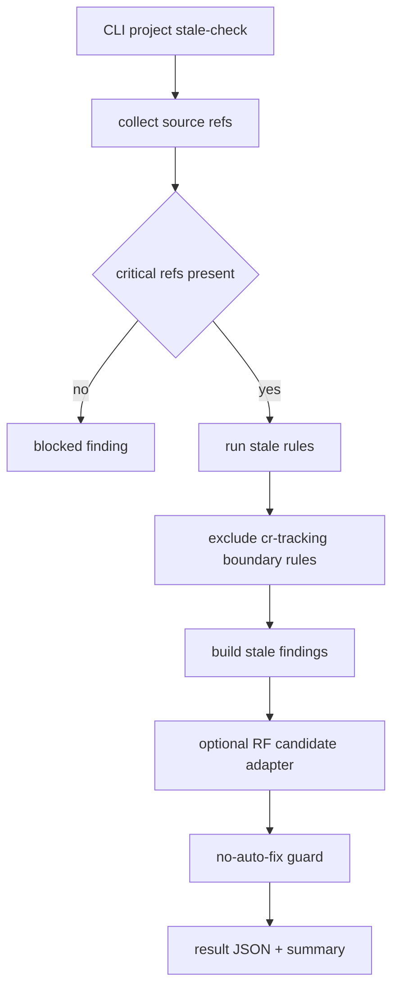

# LLD: CR037-S12 — project stale-check

## 0. 上游设计依据

| 来源 | 路径 / ID | 被本 LLD 消费的内容 |
|---|---|---|
| Story | `process/stories/STORY-CR037-S12-project-stale-check.md` | 用户价值、验收标准、文件所有权、`full-lld` 要求。 |
| HLD | `process/docs/design/META-FLOW-PROJECT-GOVERNANCE-HLD.md` | project stale-check 是独立 CLI/checker；只输出 stale findings，不自动修改正式文档或发布库。 |
| ADR | `process/docs/design/META-FLOW-PROJECT-GOVERNANCE-ARCHITECTURE-DECISION.md` | ADR-PG-003 发布库只输出 stale/follow-up；ADR-PG-006 使用 `FU-RF` / `SP-RF` / `RA-RF`，不写 `RELEASE-CONTEXT`。 |
| Feature Matrix | `process/docs/design/META-FLOW-PROJECT-GOVERNANCE-FEATURE-DESIGN-MATRIX.md` | CR037-S12 为 `full-lld`；推荐命令名 `meta-flow project stale-check`，备选 `meta-flow check project-stale`。 |
| Feature DESIGN | `process/docs/features/project-stale-check/DESIGN.md` | stale finding schema、rule engine、no-auto-fix guard、FU-RF adapter 和 false positive 控制。 |
| Feature TEST-PLAN | `process/docs/features/project-stale-check/TEST-PLAN.md` | UNIT-ST / INTEG-ST / SEC-ST / MAN-ST 测试入口。 |
| Feature TASKS | `process/docs/features/project-stale-check/TASKS.md` | TASK-ST-001..006 实施顺序和阻塞项。 |
| Upstream Story | `CR037-S09`、`CR037-S11` | refresh result schema 已冻结后 stale-check 可消费；FU-RF tracking 可用后 actionable finding 可转换候选。 |

## 1. Goal

创建项目级 `stale-check` 设计：新增独立 checker / CLI、stale result 和 finding schema、首批跨对象语义规则、no-auto-fix guard 与 FU-RF adapter，使 roadmap / project state / HLD / test / release refs 的语义陈旧可被报告和追踪，但不会自动修改正式文档或发布库。

## 2. Requirements（Functional / Non-Functional）

### 2.1 Functional

- 提供独立入口，默认命令名为 `meta-flow project stale-check --project-root .`；若 CP5 统一决策要求沿用 checker 风格，则切换为 `meta-flow check project-stale --project-root .`。
- 输出机器可读 stale-check result，包含 `schema_version`、`result_id`、`checked_at`、`project_root`、`source_refs`、`decision`、`finding_count`、`findings`、`follow_up_candidate_refs`、`errors`、`warnings`。
- 输出人类可读 summary，列出 finding ID、对象、expected / observed semantic、severity、recommended route 和是否已生成 follow-up candidate。
- 首批规则只覆盖项目阶段 / roadmap / HLD-test-release refs / ROADMAP-REFRESH doc impacts，不接管 CR tracking 的编号、状态、formal path 或 lifecycle 结构校验。
- 对 actionable finding 生成 `FU-RF` / `SP-RF` / `RA-RF` candidate 的 adapter contract；若 S11 尚未完成，保留 stale finding，不丢失证据。
- 对正式 HLD、TEST-STRATEGY、release docs、发布库 refs 只读观察，任何 auto-fix / write action 都必须 FAIL。

### 2.2 Non-Functional

- 规则集保守启动，默认只在 source refs 明确时判定；缺关键 refs 时输出 `blocked` finding，不猜测 PASS。
- stale-check 不复制正式文档长正文，result 只保存 refs、短摘要、hash / semantic tag。
- 输出路径必须稳定，可被 CP7 / CP8 验证引用。
- checker 应支持 fixture 测试，不依赖真实 quant-lab 目录。
- 误报可通过 finding status `waived` 或 rule status `disabled` 处理，并保留原因。

## 3. 模块拆分与职责

| 模块 / 文件组 | 职责 | 说明 |
|---|---|---|
| `meta_flow/checks/project_stale.py` | stale-check 核心 checker、schema validator、rule runner、summary renderer。 | 新增模块，避免与 `cr_tracking.py` 结构检查混淆。 |
| `meta_flow/cli.py` | 分发 `project stale-check` 命令；若最终采用备选命名，则在 `check` validator 中分发。 | LLD 推荐新增 project 子命令组；备选只改 `_run_check`。 |
| `meta_flow/checks/cr_tracking.py` | 仅消费 S11 的 RF candidate tracking 契约，不承担 stale 规则。 | 本 Story 不修改 CR tracking 结构规则，adapter 通过稳定 candidate 文件 / refs 输出。 |
| `tests/test_project_stale_check.py` | 单元、契约和安全 fixture。 | 覆盖 stale schema、规则边界、no-auto-fix、FU-RF degraded behavior。 |
| `process/checks/**` | stale-check result / summary 输出位置。 | 实现阶段可写 `process/checks/PROJECT-STALE-CHECK-*.result.json` 和 `.summary.md`；本 LLD 不写运行结果。 |

## 4. 代码结构与文件影响范围

| 动作 | 文件路径 | 变更内容 |
|---|---|---|
| 创建 | `meta_flow/checks/project_stale.py` | 定义 `StaleCheckResult` / `StaleFinding` 数据校验、rule runner、CLI main、summary 渲染和 no-auto-fix guard。 |
| 修改 | `meta_flow/cli.py` | 新增 `_run_project(args)` 并在 `main()` 分发 `project stale-check`；帮助文本增加命令说明。若 CP5 决定备选命名，则改为 `_run_check` 分发 `project-stale`。 |
| 创建 | `tests/test_project_stale_check.py` | 覆盖 UNIT-ST-01..04、INTEG-ST-01..03、SEC-ST-01..03、MAN-ST 摘要结构。 |
| 创建 | `tests/fixtures/project_stale/` | 保存最小 project / roadmap / docs refs fixture、refresh result fixture、no-auto-fix forbidden target fixture。 |
| 不修改 | `process/quant-lab/**` | 本 Story 禁止读取或写入 quant-lab 样本；S13 单独处理。 |
| 不修改 | HLD / TEST-STRATEGY / release docs / 发布库 | stale-check 只报告，不 auto-fix。 |

## 5. 数据模型与持久化设计

| 对象 / 字段 | 类型 | 约束 | 说明 |
|---|---|---|---|
| `StaleCheckResult.schema_version` | integer | 必须为 1 | result schema 版本。 |
| `StaleCheckResult.result_id` | string | `PROJECT-STALE-CHECK-YYYYMMDDHHMMSS` 或 fixture stable ID | 运行唯一标识。 |
| `StaleCheckResult.decision` | enum | `PASS` / `WARN` / `BLOCKED` / `FAIL` | 有 blocking finding 为 `BLOCKED`；schema / security 失败为 `FAIL`。 |
| `StaleCheckResult.source_refs` | list[object] | 每项含 `kind`、`path`、可选 `hash` / `semantic_tag` | 不保存长正文。 |
| `StaleCheckResult.findings` | list[`StaleFinding`] | schema 校验必填 | stale finding 列表。 |
| `StaleFinding.finding_id` | string | `ST-<RULE-ID>-NNN` | 稳定 finding ID。 |
| `StaleFinding.rule_id` | string | 首批 `ST-RULE-PHASE-001`、`ST-RULE-DOC-IMPACT-001`、`ST-RULE-RELEASE-REF-001`、`ST-RULE-BOUNDARY-001` | 规则可版本化。 |
| `StaleFinding.object_ref` | string | 项目相对路径或对象 ID | 陈旧对象。 |
| `StaleFinding.expected_semantic` | string | 简短语义，不超过 240 字符 | 期望状态。 |
| `StaleFinding.observed_semantic` | string | 简短语义，不超过 240 字符 | 观察状态。 |
| `StaleFinding.severity` | enum | `info` / `warning` / `blocking` | 控制 result decision。 |
| `StaleFinding.recommended_route` | enum | `FU-RF` / `SP-RF` / `RA-RF` / `formal_cr` / `waive` / `manual_review` | 后续路由。 |
| `StaleFinding.status` | enum | `open` / `converted` / `waived` / `closed` | finding 生命周期。 |

持久化：本 Story 不新增长期状态对象。实现运行时只在 `process/checks/**` 写 result / summary；正式 docs 与 release docs 均只读。

## 6. API / Interface 设计

| 接口 / 入口 | 输入 | 输出 | 调用方 | 说明 |
|---|---|---|---|---|
| `meta-flow project stale-check --project-root . [--refresh-result PATH] [--output PATH] [--summary PATH] [--format json|summary]` | project root、可选 refresh result、输出路径 | result JSON、summary Markdown、exit code | host-orchestrator、meta-qa、本地维护者 | 推荐入口；命令名待 CP5 默认确认。 |
| `project_stale.run_stale_check(project_root, refresh_result=None, output=None, summary=None)` | `Path`、可选 refresh result | `StaleCheckResult` dict | CLI / tests | 纯函数式核心，便于 fixture。 |
| `project_stale.validate_result(payload)` | result dict | `(errors, warnings)` | CP7 / tests | 校验 result / finding schema。 |
| `project_stale.findings_to_follow_up_candidates(result)` | actionable findings | RF candidate dict list | S11 tracking consumer | S11 不可用时返回候选草案但不写 tracking。 |
| `project_stale.no_auto_fix_guard(actions)` | planned actions | errors | checker 内部 / tests | 任何正式 docs / release repo write action 都失败。 |

本节所有接口都在第 10 节测试设计中有对应测试入口。

## 7. 核心处理流程

1. CLI 解析 `project_root`、`refresh_result`、输出路径和格式。
2. 收集 `PROJECT.current.json`、`process/project/ROADMAP.yaml`、HLD / TEST / release refs 的存在性、hash 和短语义标签；缺少关键 refs 时生成 `blocked` finding。
3. 读取可选 ROADMAP-REFRESH result 的 `doc_impacts` / `follow_up_candidates` refs，只消费 refs 和摘要。
4. 运行首批 stale rules，排除 CR tracking 结构规则。
5. 对每个 finding 解析 severity、recommended route 和可选 RF candidate。
6. 执行 no-auto-fix guard，确认本次运行没有生成任何正式 docs / release repo write action。
7. 写 result / summary 到 `process/checks/**` 或用户指定输出路径。
8. 返回 exit code：`0` 表示 PASS/WARN，`2` 表示 BLOCKED，`1` 表示 FAIL。

## 8. 技术设计细节

- 关键算法 / 规则：
  - `ST-RULE-PHASE-001`：比较 project phase / roadmap stage 与 test strategy semantic tag，不一致则 warning 或 blocking。
  - `ST-RULE-DOC-IMPACT-001`：ROADMAP-REFRESH result 声明 `UPDATED_WITH_DOC_IMPACTS` 但 doc impact 未有 FU-RF / formal CR candidate 时输出 finding。
  - `ST-RULE-RELEASE-REF-001`：release docs ref 被标记陈旧时只输出 finding，不写 release docs。
  - `ST-RULE-BOUNDARY-001`：输入是 CR 编号 / lifecycle / formal path 结构错误时标记 boundary violation，不作为 stale finding。
- 依赖选择与复用点：
  - 复用 `require_process_health` 作为 process route 前置检查。
  - 复用 `meta_flow/cli.py` 的命令分发风格，保持 argparse。
  - 只通过 RF candidate contract 与 `cr_tracking.py` 对接，不直接调用 cr_tracking 内部解析器。
- 兼容性处理：
  - 若 `PROJECT.current.json` 或 `process/project/ROADMAP.yaml` 尚未由上游 Story 落地，输出 `BLOCKED` finding，不失败为代码异常。
  - 若 S11 尚未实现 RF tracking，summary 保留 `follow_up_candidate_refs=[]` 和 `candidate_drafts` 摘要。
  - 命令名默认 `project stale-check`；CP5 若选择备选命名，只需调整 CLI 分发和测试命令，不影响核心模块。
- 图示类型选择：本 Story 跨 CLI、rule engine、RF adapter、result writer 和 security guard，使用流程图。

## 9. 安全与性能设计

| 维度 | 设计措施 | 验证方式 |
|---|---|---|
| 安全 | no-auto-fix guard 拒绝 HLD / TEST-STRATEGY / release docs / 发布库 write action。 | `SEC-ST-01`、`INTEG-ST-02`。 |
| 安全 | stale-check 不读取 `process/quant-lab/**`，不访问凭据、runtime、publish、live。 | `SEC-ST-04` 人工审查；fixture 不含 quant-lab。 |
| 安全 | 缺关键 refs 时输出 blocked finding，不猜测 PASS。 | `SEC-ST-03`。 |
| 性能 | 默认只读取小型 refs、hash 和短语义标签，不复制长文档正文。 | 大 fixture 验证 result 大小和 source_refs 数量。 |
| 性能 | 规则集首批保守，线性遍历 source refs。 | 单元测试覆盖多 finding 输入。 |

## 10. 测试设计

| 测试场景 | 前置条件 | 操作 | 预期结果 | 验证方式 |
|---|---|---|---|---|
| finding schema 完整 | 构造完整 result | 调用 `validate_result` | PASS | `UNIT-ST-01`。 |
| finding 缺 `expected_semantic` | 构造缺字段 result | 调用 `validate_result` | FAIL | `UNIT-ST-01`。 |
| project phase 与 test strategy 语义不一致 | fixture 中 phase=paper-readiness，test=backtest-only | 运行 stale-check | 输出 stale finding | `UNIT-ST-02` / `INTEG-ST-01`。 |
| refresh doc impacts 未跟踪 | refresh result 有 doc impacts，无 RF candidate | 运行 stale-check | 输出 recommended_route=FU-RF | `UNIT-ST-03` / `CT-ST-002`。 |
| CR tracking 结构错误 | fixture 中 CR status missing | 运行 stale rule | 不作为 stale finding；boundary violation | `UNIT-ST-04`。 |
| no-auto-fix guard | 构造写 HLD / release docs action | 调用 guard | FAIL | `SEC-ST-01` / `INTEG-ST-02`。 |
| FU-RF tracking 不可用 | 不提供 S11 adapter 输出路径 | 运行 stale-check | 保留 finding，candidate draft 不写 tracking | `INTEG-ST-03`。 |
| 缺 project / roadmap refs | fixture 缺关键 refs | 运行 stale-check | result decision=BLOCKED | `SEC-ST-03`。 |
| 命令 UX | CLI help / summary | 人工审查 | 命令语义不混同 cr-tracking | `MAN-ST-01`。 |

## 11. 实施步骤

| TASK-ID | 动作 | 目标文件 | 详细描述 | 对应测试 |
|---|---|---|---|---|
| TASK-ST-001 | 修改 | `meta_flow/cli.py` | 新增 `project stale-check` 命令分发、help 和参数；若 CP5 切换命名，则改为 `check project-stale`。 | `MAN-ST-01`、CLI smoke。 |
| TASK-ST-002 | 创建 | `meta_flow/checks/project_stale.py` | 定义 result / finding schema、validator、exit decision 映射和 summary renderer。 | `UNIT-ST-01`、`CT-ST-003`。 |
| TASK-ST-003 | 创建 | `meta_flow/checks/project_stale.py` | 实现首批 rule engine，包含 phase、doc impact、release ref 和 boundary rule。 | `UNIT-ST-02`、`UNIT-ST-03`、`UNIT-ST-04`。 |
| TASK-ST-004 | 创建 | `meta_flow/checks/project_stale.py` | 实现 no-auto-fix guard 和 forbidden write target 检测。 | `SEC-ST-01`、`INTEG-ST-02`。 |
| TASK-ST-005 | 创建 | `meta_flow/checks/project_stale.py` | 实现 actionable finding 到 RF candidate draft 的 adapter，S11 不可用时降级为 finding-only。 | `INTEG-ST-03`、`CT-ST-001`。 |
| TASK-ST-006 | 创建 | `tests/test_project_stale_check.py`、`tests/fixtures/project_stale/` | 添加 schema、rules、security、CLI、summary 和 false-positive fixture。 | `UNIT-ST-*`、`INTEG-ST-*`、`SEC-ST-*`。 |

## 12. 风险、难点与预研建议

### 12.1 实现灰区与取舍记录

| Clarification ID | 问题 | 选项与推荐 | 决策 / 答案 | 影响面 | 证据 | 重访条件 |
|---|---|---|---|---|---|---|
| LCQ-CR037-S12-01 | stale-check CLI 最终命名。 | 推荐：`meta-flow project stale-check`；备选：`meta-flow check project-stale`。推荐理由是 project 子域更贴近 HLD 与 Feature 设计，备选更贴近当前 `check` validator 风格。 | 未人工单独回答；本 LLD 按推荐命名设计，CP5 `approve` 即接受默认。 | CLI UX、文档、测试命令。 | Feature Matrix DQ-FD-004、Feature DESIGN DQ-ST-001。 | 若 CP5 明确要求统一 checker 命名，则切换到备选，核心模块不变。 |
| LCQ-CR037-S12-02 | FU-RF tracking 尚未实现时 stale-check 是否阻断。 | 推荐：不阻断 stale result，保留 finding 和 candidate draft；备选：S11 完成前 stale-check 整体 BLOCKED。 | 推荐方案写入本 LLD。 | 跨 Story 契约、测试、CP7 验证。 | Feature DESIGN F-ST-04。 | 若 S11 dev_gate 失败，则 S12 adapter 测试降级为 finding-only。 |

| 风险 / 难点 | 影响 | 缓解措施 / 预研建议 |
|---|---|---|
| 语义规则误报 | 用户忽略 stale findings。 | 首批规则保守；severity 可降级；summary 必须显示 source refs 和 rule ID。 |
| 与 cr-tracking 重叠 | checker 噪音和职责冲突。 | `ST-RULE-BOUNDARY-001` 明确排除 CR 结构检查；测试覆盖。 |
| 命令命名未最终人工确认 | 文档 / 测试命令可能返工。 | 使用 LCQ-CR037-S12-01，CP5 approve 接受推荐；核心模块隔离命令分发。 |
| 正式 docs auto-fix 越权 | 未授权修改长期产物。 | no-auto-fix guard + forbidden target fixture。 |

### OPEN / Spike 跟踪

| ID | 类型（OPEN / Spike） | 问题 | 下一动作 | 责任方 |
|---|---|---|---|---|
| O-CR037-S12-01 | OPEN | stale-check 命令名仍是 CP5 待确认默认项。 | CP5 批量确认接受推荐或改用备选。 | host-orchestrator / user |

## 13. 回滚与发布策略

- 发布方式：在 CR037-W4 且 CR037-S09、CR037-S11 满足 dev_gate 后实现；先以 fixture 单元 / 集成测试证明，再交 CP6 / CP7。
- 回滚触发条件：CLI 分发破坏既有命令、stale-check 误接管 cr-tracking、no-auto-fix guard 漏拦正式 docs / release write。
- 回滚动作：移除 `project stale-check` CLI 分发，停用 `project_stale.py` 入口；保留 result schema 文档作为设计证据，不删除用户数据；若已有 result 输出，标记为 superseded 后重跑。

## 14. Definition of Done

- [ ] 14 个章节全部填写完成。
- [ ] `meta_flow/checks/project_stale.py` 和 CLI 分发范围明确。
- [ ] stale result / finding schema 可由测试校验。
- [ ] 接口契约均在第 10 节有测试入口。
- [ ] 异常路径覆盖 missing refs、boundary violation、no-auto-fix、S11 unavailable。
- [ ] `confirmed=false` 时不进入实现。
- [ ] OPEN / clarification candidate 已清点。

## 人工确认区

> **CP5 — Story 设计证据可实现性门**  
> 本 LLD 需随 CR-037 全部目标 Story 设计证据统一确认。CP5 通过前不得进入实现。

**CP5 checklist 摘要**：

| # | 检查项 | 状态 | 证据 |
|---|---|---|---|
| 1 | LLD 覆盖 AC | 待检查 | 第 2 / 10 / 14 节 |
| 2 | 与 HLD / ADR 一致 | 待检查 | 第 0 / 8 / 12 节 |
| 3 | 文件影响范围明确 | 待检查 | 第 4 / 11 节 |
| 4 | 接口契约完整 | 待检查 | 第 6 节 |
| 5 | 测试与 dev_gate 可计算 | 待检查 | 第 10 / 14 节 |
| 6 | clarification queue 已收敛 | 待检查 | 第 12.1 节 |

**人工审查结果回填**：

- 结论：`approved | changes_requested | rejected`
- 审查人：
- 审查时间：
- 修改意见：
- 风险接受项：
