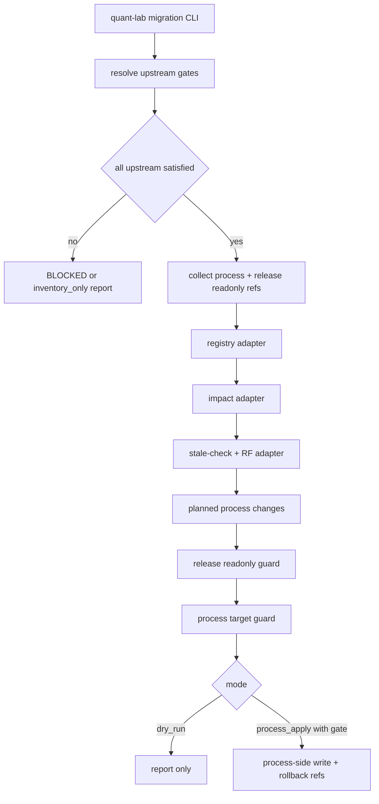

# LLD: CR037-S13 — quant-lab migration dry-run and reports

## 0. 上游设计依据

| 来源 | 路径 / ID | 被本 LLD 消费的内容 |
|---|---|---|
| Story | `process/stories/STORY-CR037-S13-quant-lab-migration-dry-run-and-reports.md` | 验收标准、授权边界、8 个上游依赖和 `R-CR037-S13-LONG-CHAIN`。 |
| HLD | `process/docs/design/META-FLOW-PROJECT-GOVERNANCE-HLD.md` | quant-lab 迁移是 P2 真实样本验证；发布库代码、tests、正式 docs、release docs 不自动修改。 |
| ADR | `process/docs/design/META-FLOW-PROJECT-GOVERNANCE-ARCHITECTURE-DECISION.md` | ADR-PG-003 发布库只输出 stale/follow-up；ADR-PG-004 registry-backed refs；ADR-PG-006 RF follow-up 不写 RELEASE-CONTEXT。 |
| Feature Matrix | `process/docs/design/META-FLOW-PROJECT-GOVERNANCE-FEATURE-DESIGN-MATRIX.md` | CR037-S13 为 `full-lld`，依赖 W1-W4 上游能力。 |
| Feature DESIGN | `process/docs/features/quant-lab-migration-readiness/DESIGN.md` | dry-run report schema、read-only adapter、process-side cleanup、rollback、registry/impact/stale integration。 |
| Feature TEST-PLAN | `process/docs/features/quant-lab-migration-readiness/TEST-PLAN.md` | UNIT-QL / SEC-QL / INTEG-QL / MAN-QL 测试入口。 |
| Feature TASKS | `process/docs/features/quant-lab-migration-readiness/TASKS.md` | TASK-QL-001..007 实施顺序和阻塞项。 |
| Upstream Stories | `CR037-S01`、`S05`、`S07`、`S08`、`S09`、`S10`、`S11`、`S12` | state enforcement、project state、registry、impact migration、roadmap refresh、Gate Ledger、RF tracking、stale-check 均需满足 dev_gate 后才能真实执行 S13 apply。 |

## 1. Goal

设计 quant-lab migration readiness：新增默认 dry-run 的迁移命令和报告，读取 quant-lab 发布库只读摘要 / refs，验证 process-side state cleanup、registry migration、impact migration、stale report 和 RF / formal CR candidate 输出；默认不修改 quant-lab 发布库，不读取凭据，不执行 runtime / publish / live / production write。

## 2. Requirements（Functional / Non-Functional）

### 2.1 Functional

- 提供 migration dry-run 入口，默认只生成 report，不做 process-side apply。
- 读取输入必须分层：process-side refs、registry refs、impact records、roadmap refresh result、stale-check result、quant-lab release repo readonly refs。
- 输出 Quant-lab Migration Report，包含 dry-run planned changes、release readonly observations、blocked findings、stale report refs、follow-up candidate refs 和 rollback refs。
- process-side apply 只允许在后续 human gate 明确授权后写过程侧 artifact，不写发布库。
- registry adapter 必须使用上游 registry resolver；unresolved capability 输出 blocked finding，不自动创造 capability ID。
- impact adapter 必须使用上游 impact migration contract；unknown impact surface 输出 report，不静默成功。
- stale adapter 必须消费 S12 stale-check contract；S12 不可用时保留 stale observation，不生成假 PASS。
- RF adapter 必须消费 S11 contract；S11 不可用时保留 candidate draft，不写 `RELEASE-CONTEXT`。
- 必须处理 `R-CR037-S13-LONG-CHAIN`：任一上游 Story 未 verified / dev_gate 不满足时，真实 migration 保持 blocked；可拆分只读 inventory/report 子切片，或缩窄为不触碰缺失能力的 dry-run。

### 2.2 Non-Functional

- release repo adapter 必须 read-only；任何 write target 指向 quant-lab code / tests / docs / release docs 都 FAIL。
- 不读取 credential、account、token、cookie、private key；不执行 runtime / publish / live / trading。
- report 不复制发布库长正文，只保存 path refs、hash、短摘要和 semantic tag。
- process-side apply 必须记录 before_hash、after_hash、rollback_ref。
- 所有真实样本操作必须可用 fixture 替代验证；CP5 阶段不执行 runtime。

## 3. 模块拆分与职责

| 模块 / 文件组 | 职责 | 说明 |
|---|---|---|
| `meta_flow/checks/quant_lab_migration.py` | migration dry-run / report schema / security guard / process-side target validation。 | 新增 checker / workflow 模块；实现阶段只写 meta-flow 源码。 |
| `meta_flow/cli.py` | 分发 `project migrate-quant-lab` 或 `project quant-lab-migration` 命令。 | LLD 推荐 `meta-flow project quant-lab-migration --dry-run`，命令名可在 CP5 审查中调整。 |
| `meta_flow/state/current.py` / CR037-S01 outputs | process-side current state cleanup 的受控 writer contract。 | S13 只消费，不绕过 S01 writer。 |
| `meta_flow/design/feature_registry.py` / CR037-S07 outputs | capability / feature refs resolver。 | unresolved 输出 blocked finding。 |
| CR037-S08 outputs | impact surface normalized migration report。 | unknown surface 进入 migration report。 |
| CR037-S09/S10 outputs | ROADMAP-REFRESH result 与 Gate Ledger event refs。 | 只消费 result / event，不生成 refresh。 |
| CR037-S11/S12 outputs | RF tracking 与 stale-check result。 | 只消费 contracts；不可用时降级。 |
| `tests/test_quant_lab_migration.py` | dry-run、security、rollback、registry/impact/stale integration fixture。 | 不写真实 quant-lab 发布库。 |
| `process/archive/CR-037/**` | migration report / evidence 输出。 | Story primary ownership；实现运行时可写归档报告。 |

## 4. 代码结构与文件影响范围

| 动作 | 文件路径 | 变更内容 |
|---|---|---|
| 创建 | `meta_flow/checks/quant_lab_migration.py` | 定义 migration report schema、mode resolver、readonly adapter、target guard、planned process changes、rollback refs、blocked finding 和 CLI main。 |
| 修改 | `meta_flow/cli.py` | 新增 project migration 命令分发与帮助文本；默认 `--dry-run`。 |
| 创建 | `tests/test_quant_lab_migration.py` | 覆盖 UNIT-QL、SEC-QL、INTEG-QL 和部分 MAN-QL 可自动化结构检查。 |
| 创建 | `tests/fixtures/quant_lab_migration/` | 保存 fake release repo readonly refs、process-side targets、registry / impact / stale fixture。 |
| 运行时创建 | `process/archive/CR-037/quant-lab-migration/*.result.json` | migration dry-run / process-side apply report。 |
| 运行时创建 | `process/archive/CR-037/quant-lab-migration/*.summary.md` | 人类摘要和 manual acceptance checklist。 |
| 运行时创建 | `process/checks/CR037-S13-quant-lab-migration-*.result.json` | CP7 / QA 可引用的检查结果。 |
| 禁止修改 | quant-lab 发布库代码、tests、正式 docs、release docs | 任何写入都 FAIL。 |
| 禁止修改 | `process/quant-lab/**` | 当前目录不存在且仅作为后续授权的 read-only refs 来源；本 LLD 不写该路径。 |

## 5. 数据模型与持久化设计

| 对象 / 字段 | 类型 | 约束 | 说明 |
|---|---|---|---|
| `QuantLabMigrationReport.schema_version` | integer | 必须为 1 | report schema 版本。 |
| `run_id` | string | `QL-MIGRATION-YYYYMMDDHHMMSS` 或 fixture stable ID | 运行标识。 |
| `mode` | enum | `dry_run` / `process_apply` / `inventory_only` | 默认 `dry_run`；上游缺失可降级 `inventory_only`。 |
| `upstream_gates` | list[object] | 每项含 `story_id`、`required_status`、`observed_status`、`decision` | R-CR037-S13-LONG-CHAIN 门控证据。 |
| `source_refs` | list[object] | process / release readonly / registry / impact / stale refs | 不复制长正文。 |
| `release_repo_readonly_refs` | list[object] | `path`、`hash`、`observed_summary`、`semantic_tag` | 只读观察。 |
| `planned_process_changes` | list[`ProcessSideChange`] | dry-run 必须列出；process apply 才可落盘 | target 必须在 process-side boundary。 |
| `blocked_findings` | list[`BlockedFinding`] | unresolved capability、forbidden target、missing upstream 等 | 可转 RF / formal CR。 |
| `stale_report_ref` | string | 可空 | 指向 S12 stale-check result / report。 |
| `follow_up_candidate_refs` | list[string] | 可空 | 指向 S11 RF tracking candidate 或草案。 |
| `rollback_refs` | list[object] | process apply 时必填 | before / after hash 和 rollback path。 |
| `decision` | enum | `PASS` / `WARN` / `BLOCKED` / `FAIL` | 上游缺失或 blocked findings 为 BLOCKED；越权为 FAIL。 |
| `ProcessSideChange.target_ref` | string | 必须属于 process-side allowlist | 例如 `process/state/**`、`process/project/**`、`process/archive/CR-037/**`。 |
| `ProcessSideChange.operation` | enum | `create` / `update` / `archive` / `noop` | 不允许 delete 默认执行。 |
| `BlockedFinding.required_action` | enum | `wait_upstream` / `create_formal_cr` / `add_registry_entry` / `manual_review` / `waive` | 下一步可追踪。 |

持久化：dry-run 只写 `process/archive/CR-037/**` 与 `process/checks/**` 报告；process-side apply 仅在后续授权后写 process-side allowlist，并记录 rollback refs。发布库不持久化任何修改。

## 6. API / Interface 设计

| 接口 / 入口 | 输入 | 输出 | 调用方 | 说明 |
|---|---|---|---|---|
| `meta-flow project quant-lab-migration --project-root . --release-repo PATH --dry-run --output PATH` | project root、release repo readonly path、mode、输出路径 | migration report / summary / exit code | host-orchestrator、meta-qa、维护者 | 默认 dry-run；命令名可在 CP5 审查中调整。 |
| `quant_lab_migration.run_migration_plan(project_root, release_repo, mode="dry_run", refs=None)` | refs、mode | report dict | CLI / tests | 核心规划函数，不直接写发布库。 |
| `quant_lab_migration.validate_report(payload)` | report dict | `(errors, warnings)` | tests / CP7 | schema / security 校验。 |
| `quant_lab_migration.guard_release_readonly(planned_changes)` | planned changes | errors | migration core | release repo target write 必须 FAIL。 |
| `quant_lab_migration.guard_process_targets(planned_changes)` | planned process changes | errors | migration core | target outside process boundary 拒绝。 |
| `quant_lab_migration.resolve_upstream_gates(story_status_refs)` | upstream story statuses | `upstream_gates` list | migration core | 任一上游未满足则 BLOCKED 或 inventory_only。 |
| `quant_lab_migration.rollback_process_apply(report)` | process apply report | rollback result | 后续授权场景 | 只回滚 process-side artifacts。 |

本节所有接口都在第 10 节测试设计中有对应测试入口。

## 7. 核心处理流程

1. CLI 读取 `project_root`、`release_repo` readonly path、mode、output / summary。
2. 执行 upstream gate resolver，检查 S01/S05/S07/S08/S09/S10/S11/S12 的 dev_gate / verification refs。
3. 若任一上游未满足：
   - 默认 decision=`BLOCKED`，不执行 process-side apply。
   - 允许缩窄到 `inventory_only`：只读取 allowlisted readonly refs、输出 inventory/report，不调用缺失 adapter。
   - 允许拆分后续 Story / 子切片：`S13a inventory/report`、`S13b process-side apply`、`S13c stale/FU-RF integration`，由 host-orchestrator 决定。
4. 若上游满足，收集 process refs、registry refs、impact refs、ROADMAP-REFRESH refs、stale-check refs 和 release readonly observations。
5. 运行 registry adapter；unresolved capability 输出 blocked finding。
6. 运行 impact adapter；unknown surface 输出 report finding。
7. 运行 stale / RF adapter；正式 docs 陈旧只输出 stale finding / RF or formal CR candidate。
8. 生成 planned process changes；执行 release readonly guard 和 process target guard。
9. dry-run 写 report / summary；process_apply 仅在后续 human gate 授权后写 process-side artifacts 和 rollback refs。

## 8. 技术设计细节

- 关键算法 / 规则：
  - `upstream_gates` 是 S13 的第一层门控：任一上游未 `verified` 或 dev_gate 不满足，则真实 migration apply 不可执行。
  - `mode_resolver` 默认 `dry_run`；缺上游时可降级 `inventory_only`，但不得伪装为完整 migration。
  - `release_readonly_guard` 对 planned changes 做路径归类，凡属于 release repo root 的 `create/update/delete/archive` 均 FAIL。
  - `process_target_guard` 只允许 `process/state/**`、`process/project/**`、`process/archive/CR-037/**`、`process/checks/**` 等过程侧路径；具体 allowlist 由 S01/S05 的 writer contract 确认。
  - `registry_adapter` 不自动新增 capability ID；unresolved 时 blocked finding。
  - `stale_adapter` 只输出 stale finding 和 FU-RF / formal CR candidate，不修改正式 docs。
- 依赖选择与复用点：
  - 复用 `require_process_health`，不自行创建 process route。
  - 复用上游 S07 registry resolver、S08 impact migration、S12 stale-check 的 public API；若 API 未落地，S13 保持 blocked 或 inventory-only。
  - 复用 argparse CLI 风格，不引入新 CLI 框架。
- 兼容性处理：
  - `process/quant-lab/**` 当前不存在；LLD 不依赖该目录，后续实现以显式 `--release-repo` readonly path 或 process-side refs 为输入。
  - 无 release repo path 时只可运行 fixture / inventory validation，不可声称真实 quant-lab migration complete。
  - 上游延期时，S13 可拆分或缩窄，不反向污染通用机制。
- 图示类型选择：本 Story 跨 8 个上游、外部发布库只读边界、process-side apply 与 rollback，使用流程图。

## 9. 安全与性能设计

| 维度 | 设计措施 | 验证方式 |
|---|---|---|
| 安全 | release repo code/tests/formal docs/release docs target 写入一律 FAIL。 | `SEC-QL-01`、`MAN-QL-02`。 |
| 安全 | 默认 dry-run；无 human gate 时 process apply 不执行。 | `UNIT-QL-01`、`SEC-QL-05`。 |
| 安全 | 不读取 credential/token/account/private key。 | `SEC-QL-03`。 |
| 安全 | 不执行 runtime/publish/live/trading/production write。 | `SEC-QL-04`。 |
| 安全 | capability unresolved 不自动注册。 | `INTEG-QL-03`。 |
| 性能 | release observations 只保存 hash、path、短摘要和 semantic tag。 | report schema fixture。 |
| 性能 | dry-run 规划线性遍历 refs；真实样本可按 refs allowlist 限制文件数。 | large fixture budget 检查。 |

## 10. 测试设计

| 测试场景 | 前置条件 | 操作 | 预期结果 | 验证方式 |
|---|---|---|---|---|
| 默认 dry-run | command without apply authorization | 运行 mode resolver | `mode=dry_run`，不 apply | `UNIT-QL-01`。 |
| report schema 完整 | 构造完整 report | `validate_report` | PASS | `UNIT-QL-02`。 |
| report 缺 readonly refs | 删除 `release_repo_readonly_refs` | `validate_report` | FAIL | `UNIT-QL-02`。 |
| forbidden release target | planned change 指向 release docs | guard | FAIL / blocked finding | `SEC-QL-01`。 |
| process-side target 越界 | target outside process boundary | guard | reject | `SEC-QL-02`。 |
| credential read request | adapter 请求 token/account/private key | guard | FAIL | `SEC-QL-03`。 |
| publish/live/trading flag | command args 含 forbidden mode | guard | FAIL | `SEC-QL-04`。 |
| dry-run clean | refs 完整且无 blocked finding | run migration plan | report complete，无 apply | `INTEG-QL-01`。 |
| process apply with rollback | 后续 human gate 授权 fixture | apply process-side target | writes fixture，rollback_refs present | `INTEG-QL-02` / `INTEG-QL-06`。 |
| unresolved capability | registry 缺 capability | adapter | blocked finding，不创建 ID | `INTEG-QL-03` / `CT-QL-002`。 |
| unknown impact surface | legacy impact record unknown | adapter | migration report finding | `INTEG-QL-04` / `CT-QL-003`。 |
| stale formal docs | readonly observation stale | stale adapter | stale finding + RF candidate draft | `INTEG-QL-05` / `CT-QL-004` / `CT-QL-005`。 |
| 上游延期 | 任一 upstream gate 未 satisfied | run migration plan | decision=BLOCKED 或 mode=inventory_only；不 apply | 新增 `IT-QL-007`。 |
| 发布库未改人工验收 | 真实样本 dry-run 后 | 审查 git diff 或等价只读证据 | code/tests/docs/release docs 无修改 | `MAN-QL-01..05`。 |

## 11. 实施步骤

| TASK-ID | 动作 | 目标文件 | 详细描述 | 对应测试 |
|---|---|---|---|---|
| TASK-QL-001 | 创建 | `meta_flow/checks/quant_lab_migration.py` | 定义 report schema、readonly observation、blocked finding、mode resolver 和 validator。 | `UNIT-QL-01`、`UNIT-QL-02`、`CT-QL-*`。 |
| TASK-QL-002 | 创建 | `meta_flow/checks/quant_lab_migration.py` | 实现 release repo read-only adapter 和 forbidden write / credential / runtime guards。 | `SEC-QL-01`、`SEC-QL-03`、`SEC-QL-04`。 |
| TASK-QL-003 | 创建 | `meta_flow/checks/quant_lab_migration.py` | 实现 process-side planned changes、target guard、apply authorization check 和 rollback refs。 | `SEC-QL-02`、`INTEG-QL-02`、`INTEG-QL-06`。 |
| TASK-QL-004 | 创建 | `meta_flow/checks/quant_lab_migration.py` | 实现 registry adapter contract；unresolved capability -> blocked finding。 | `INTEG-QL-03`、`CT-QL-002`。 |
| TASK-QL-005 | 创建 | `meta_flow/checks/quant_lab_migration.py` | 实现 impact migration adapter contract；unknown surface -> report finding。 | `INTEG-QL-04`、`CT-QL-003`。 |
| TASK-QL-006 | 创建 | `meta_flow/checks/quant_lab_migration.py` | 实现 stale report / RF candidate adapter；不可用时降级为 report-only。 | `INTEG-QL-05`、`CT-QL-004`、`CT-QL-005`。 |
| TASK-QL-007 | 修改 | `meta_flow/cli.py` | 新增 project quant-lab migration 命令、help、默认 dry-run 参数。 | CLI smoke、`UNIT-QL-01`。 |
| TASK-QL-008 | 创建 | `tests/test_quant_lab_migration.py`、`tests/fixtures/quant_lab_migration/` | 添加 dry-run、security、integration、rollback、long-chain fixture。 | `UNIT-QL-*`、`SEC-QL-*`、`INTEG-QL-*`。 |

## 12. 风险、难点与预研建议

### 12.1 实现灰区与取舍记录

| Clarification ID | 问题 | 选项与推荐 | 决策 / 答案 | 影响面 | 证据 | 重访条件 |
|---|---|---|---|---|---|---|
| LCQ-CR037-S13-01 | 上游 8 个 Story 任一延期时 S13 如何处理。 | 推荐：真实 migration / process-side apply 保持 blocked；允许拆分只读 inventory/report 子切片，或缩窄为不触碰缺失能力的 dry-run。备选 A：等待所有上游 verified 后再做任何 S13 工作。备选 B：强行以 mock adapter 推进完整 migration。推荐理由：既保留样本观测价值，又不绕过 registry / impact / stale / RF 前置能力。 | 本 LLD 采用推荐方案；CP5 approve 即接受。 | 依赖 DAG、文件 owner、测试、授权、安全、跨 Story 契约。 | Story 风险 `R-CR037-S13-LONG-CHAIN`、Feature TASK BLK-QL-002。 | 任一上游 dev_gate 未满足、接口冻结失败或 CP7 回修时重访。 |
| LCQ-CR037-S13-02 | process-side apply 是否可在 S13 默认执行。 | 推荐：默认不执行，只 dry-run；后续 human gate 明确授权后才允许 process-side apply。备选：实现阶段自动 apply process-side。 | 本 LLD 采用推荐方案。 | runtime authorization、rollback、process artifact 写入。 | Feature DESIGN DQ-QL-002、TEST-PLAN SEC-QL-05。 | 用户在后续 gate 明确授权 process-side apply 时重访。 |

| 风险 / 难点 | 影响 | 缓解措施 / 预研建议 |
|---|---|---|
| R-CR037-S13-LONG-CHAIN | 上游任一延期会拖延真实样本验证，强推会绕过前置机制。 | S13 第一层检查 upstream_gates；未满足时 BLOCKED / inventory_only / 拆分，不 process apply。 |
| 误写 quant-lab 发布库 | 未授权生产写和正式产物破坏。 | release readonly guard、dry-run default、manual diff review。 |
| 样本特例污染 registry | capability namespace 漂移。 | unresolved 输出 blocked finding，不自动创建 ID。 |
| process-side cleanup 误删状态 | 恢复困难。 | before/after hash、rollback refs、默认 dry-run。 |
| stale report 被当作已修复 | 正式 docs 继续陈旧。 | finding / candidate status 保持 open，直到正式 CR 关闭。 |

### OPEN / Spike 跟踪

| ID | 类型（OPEN / Spike） | 问题 | 下一动作 | 责任方 |
|---|---|---|---|---|
| O-CR037-S13-01 | OPEN | S13 执行时 8 个上游 Story 的 verified / dev_gate 状态需由 host-orchestrator 提供机器 refs。 | CP6 work packet 中提供 upstream return / evidence / CP result refs。 | host-orchestrator |

## 13. 回滚与发布策略

- 发布方式：S13 位于 CR037-W5；只有 S01/S05/S07/S08/S09/S10/S11/S12 满足 dev_gate 后，才能执行完整 dry-run。process-side apply 另需后续 human gate 授权。
- 回滚触发条件：report schema 不兼容、readonly guard 漏拦 release write、process-side target 越界、rollback refs 缺失、上游 gate 未满足却执行 apply。
- 回滚动作：
  - dry-run：删除或标记 report superseded，重新生成即可；不涉及发布库或 process-side 状态变更。
  - process-side apply：使用 `rollback_refs` 恢复 before_hash 对应 artifact；记录 rollback result；若发现发布库被写入，立即停止并交回 host-orchestrator 创建 incident / CR。
  - 上游延期：保持 S13 `BLOCKED`，或拆分 inventory/report 子切片，等待上游 verified。

## 14. Definition of Done

- [ ] 14 个章节全部填写完成。
- [ ] `R-CR037-S13-LONG-CHAIN` 已明确 blocked / 拆分 / 缩窄策略。
- [ ] release repo read-only、credential / runtime / publish / live / production write 禁止项均有测试入口。
- [ ] dry-run report、process-side change、rollback refs 和 blocked finding schema 明确。
- [ ] registry / impact / stale / RF 上游接口均映射到测试。
- [ ] 接口契约均在第 10 节有对应测试入口。
- [ ] `confirmed=false` 时不进入实现。
- [ ] OPEN / clarification candidate 已清点。

## 人工确认区

> **CP5 — Story 设计证据可实现性门**  
> 本 LLD 需随 CR-037 全部目标 Story 设计证据统一确认。CP5 通过前不得进入实现，也不授权 quant-lab 发布库写入、runtime、publish、live 或 production write。

**CP5 checklist 摘要**：

| # | 检查项 | 状态 | 证据 |
|---|---|---|---|
| 1 | LLD 覆盖 AC | 待检查 | 第 2 / 10 / 14 节 |
| 2 | 与 HLD / ADR 一致 | 待检查 | 第 0 / 8 / 12 节 |
| 3 | 文件影响范围明确 | 待检查 | 第 4 / 11 节 |
| 4 | 接口契约完整 | 待检查 | 第 6 节 |
| 5 | 测试与 dev_gate 可计算 | 待检查 | 第 10 / 14 节 |
| 6 | clarification queue 已收敛 | 待检查 | 第 12.1 节 |

**人工审查结果回填**：

- 结论：`approved | changes_requested | rejected`
- 审查人：
- 审查时间：
- 修改意见：
- 风险接受项：
