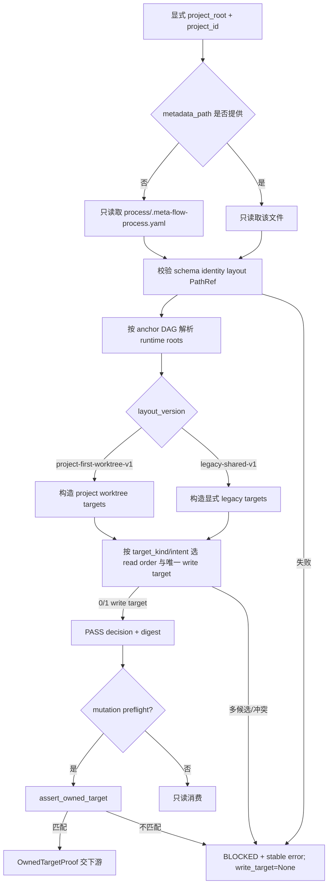

# LLD: ST-AW-001 — 唯一解析 project-first artifact 路由并保留显式 legacy 兼容

## 修订记录

| 版本 | 日期 | 修订人 | 变更要点 |
|---|---|---|---|
| 1.0 | 2026-07-18 | meta-dev | 首版 full-lld；冻结 portable schema、显式 metadata discovery、project-first/legacy mode、唯一 write target、owned-path proof、兼容 adapter 与测试门。 |
| 1.1 | 2026-07-18 | meta-dev | CP5 R2 关闭 `CP5-QA-R1-F01`：补齐 `project_worktree` anchor 枚举，冻结允许父子关系、无环 DAG、loader 拒绝矩阵与 anchor-only canonical digest；原路由/owned-target/零 Git 边界不变。 |

## 0. 上游工程依据

| 来源 | 路径 / ID | 被本 LLD 消费的内容 |
|---|---|---|
| CP3 HLD | `process/docs/design/CR051-ARTIFACT-WORKTREE-HLD.md` §4/6/9.1 | project-first 拓扑、anchor-relative metadata、路由失败时 mutation=0 |
| CP3 ADR | `process/docs/design/CR051-ARTIFACT-WORKTREE-ARCHITECTURE-DECISION.md` / ADR-AW-002 | existing control checkout + configurable sibling worktree；设备绝对路径仅为 runtime observation |
| Domain Map | `process/docs/design/CR051-ARTIFACT-WORKTREE-DOMAIN-MAP.md` / OBJ-AW-01/02 | `ProjectArtifactConfig`、`RouteDecision` 的 owner 与字段边界 |
| Feature Matrix | `process/docs/design/CR051-FEATURE-DESIGN-MATRIX.md` / FEAT-AW-01 | required + full-lld；重访条件为 resolver 无法在旧 route 兼容下保持唯一写目标 |
| Feature DESIGN | `process/docs/features/cr051-routing/DESIGN.md` | schema、接口、稳定错误码、流程与下游契约 |
| Feature TEST-PLAN | `process/docs/features/cr051-routing/TEST-PLAN.md` | R-TC-01..13、SEC-R-01..05、anchor graph、relocation 与 mutation spy |
| Feature TASKS | `process/docs/features/cr051-routing/TASKS.md` | TASK-AW-R01..R06、文件 owner 与执行顺序 |
| Story / CP4 | `process/stories/STORY-ST-AW-001-project-first-routing.md`；`process/checks/CP4-CR051-STORY-DAG-PARALLEL-SAFETY.result.json` | 量化 AC、DAG root、primary/shared/forbidden 路径和 CP4 PASS |
| 平台契约 | `delivery/doc/PLATFORM-CONTRACTS.yaml`；`process/PLATFORM-INSTALL-SPEC.md` §6 | 涉及 schema/路径时必须引用真相源；不得依平台目录类比推断 |
| 现有实现 | `meta_flow/workspace/routing.py` | `ProcessRouteHealth`、`check_process_route()`、`.meta-flow-process.yaml` 与 legacy link/local-directory 行为 |
| CP5 R1 finding | `process/docs/quality/CR051-CP5-INDEPENDENT-REVIEW-FINDINGS.md` / `CP5-QA-R1-F01` | R1 anchor enum 与 docs/process parent 约束矛盾；R2 必须使 schema 可构造并拒绝非法 DAG |

本 LLD 不改变 CP3 范围或授权：只设计纯解析与测试；不创建、移动、链接或迁移 artifact 文件，不执行 Git/worktree/ref/remote mutation。

## 1. 目标（Goal）

创建纯解析模块 `meta_flow/workspace/project_artifact_routing.py`，以显式 `project_id`、`layout_version` 和 anchor-relative path 唯一解析当前项目的 `docs` 或 `process` 路由；修改 `routing.py` 只增加 legacy 单向 adapter。完成后，下游对一个 `target_kind` 的写入预检只能得到 0 或 1 个 write target，任何 layout 多解、identity/namespace 不匹配或路径逃逸都在 mutation 前稳定阻断。

## 2. 需求（Functional / Non-Functional）

### 2.1 Functional

- F-01：支持 `legacy-shared-v1` 与 `project-first-worktree-v1` 两个显式 layout；不得通过目录是否存在、Git branch、sibling 内容或 sparse 配置猜测 layout。
- F-02：对 `docs`、`process` 两个 `ArtifactKind` 分别生成有序 `read_targets`，且每次 decision 的 `write_target` 基数只能为 0 或 1。
- F-03：`project-first-worktree-v1` 的 canonical target 为 sibling project worktree 下的 owned `docs_relative` / `process_relative`；`PathRef.anchor` 必须显式允许 `project_worktree`，且固定 DAG 为 `project_root → {artifact_control_root, sibling_root} → project_worktree → {docs_relative, process_relative}`；control checkout 与其他 sibling project target 均不得成为当前项目的写目标。
- F-04：`legacy-shared-v1` 仅按显式 mode 使用 legacy target；兼容读取可以追加 read-only fallback，但 fallback 永远不得升级为第二 write target。
- F-05：metadata discovery 顺序固定为“调用方显式 `metadata_path` → 当前项目 `<project_root>/process/.meta-flow-process.yaml`”；不递归扫描 workspace、artifact control 或 sibling。显式路径缺失/冲突时不再尝试隐式候选。
- F-06：暴露 config load、route resolve、owned target proof 与 legacy health projection 四类接口；resolver 不导入 lifecycle/Git 执行模块。
- F-07：稳定错误码固定为 `config_missing`、`schema_unsupported`、`layout_unsupported`、`project_mismatch`、`anchor_unknown`、`anchor_parent_invalid`、`anchor_cycle`、`absolute_canonical_path`、`path_escape`、`control_nested_worktree`、`write_target_ambiguous`、`target_not_owned`、`route_conflict`。
- F-08：错误结果披露 project、字段、候选逻辑路径与 repair route，但不输出 remote URL、凭据或 sibling 文件内容。

### 2.2 Non-Functional

- NF-01（确定性）：同一 canonical config 重复解析 10 次，`decision_digest`、target 次序、错误码一致率为 100%；`observed_at` 不参与 digest。
- NF-02（可移植）：canonical config/result 的持久字段不含设备绝对路径；workspace relocation 后逻辑 target 与 digest 不变，设备绝对前缀违规数为 0。
- NF-03（安全）：unknown anchor、错误父 anchor、自环/间接环、absolute、`.`/`..`、NUL/newline、option-like project ID、common-prefix escape 和 control-nested-worktree 负例拒绝率为 100%；target 构造与 file/link/Git mutation spy 调用数均为 0。
- NF-04（隔离）：resolver 只读取选定 metadata 文件；sibling sentinel 内容读取/写入次数均为 0，sibling dirty 不影响当前项目 route。
- NF-05（兼容）：合法旧 process fixture 的 `ProcessRouteHealth` 关键字段与阻断语义保持一致；新 adapter 不改变 `link_process_workspace()` / `bootstrap_process_workspace()` 的写行为。
- NF-06（可审计）：所有 BLOCKED 结果包含 stable code、field、logical candidates、config digest 和 repair route；异常摘要单项上限 500 字符。

## 3. 模块拆分与职责

| 模块 / 文件组 | 职责 | 说明 |
|---|---|---|
| `project_artifact_routing.py` / schema | 定义 `ArtifactKind`、`PathRef`、`ProjectArtifactConfig`、`RouteTarget`、`RouteDecision`、`OwnedTargetProof`、`RoutingError` | 纯 value object 与 validator；不持久化 runtime absolute path |
| `project_artifact_routing.py` / loader | 按固定 discovery 顺序读取一个 metadata 文件并校验 schema、identity、layout、anchor/path | 不扫描候选目录，不调用 `check_process_route()` 来猜 mode |
| `project_artifact_routing.py` / resolver | 解析 trusted anchors、构造有序 read targets、选择唯一 write target、计算 digest | 每次只解析一个 `target_kind=docs|process` |
| `project_artifact_routing.py` / ownership | 将候选 runtime path 映射到唯一 write target 和 owned relative path，输出 proof | lexical normalize + `Path.relative_to()` 边界；不读取目标内容 |
| `routing.py` / compatibility adapter | 把已验证的新 route 投影为旧 `ProcessRouteHealth`，保持旧健康检查入口 | 单向依赖 `routing.py -> project_artifact_routing.py`；新模块禁止反向 import |
| `test_cr051_project_artifact_routing.py` | schema/layout/ambiguity/ownership/relocation/deny-mutation 定向 fixture | primary 测试文件 |
| `test_workspace_routing.py` | 旧 process route 兼容回归 | 仅在 adapter 引入后增加断言；不重写旧 fixture |

依赖方向为 `Host/FEAT-AW-02/03/05 -> project_artifact_routing`，以及 `routing compatibility adapter -> project_artifact_routing`。禁止 `project_artifact_routing -> routing -> lifecycle/Git` 的环形或反向依赖。

## 4. 代码结构与文件影响范围

| 动作 | 文件路径 | 变更内容 |
|---|---|---|
| 创建 | `meta_flow/workspace/project_artifact_routing.py` | 新增 frozen dataclass、typed error、metadata loader、route resolver、owned target proof、canonical digest/serialization helpers |
| 修改 | `meta_flow/workspace/routing.py` | 增加显式 compatibility projection helper；既有 health/link/bootstrap 入口继续保留，默认行为不变 |
| 创建 | `tests/test_cr051_project_artifact_routing.py` | 新增 R-TC-01..08、SEC-R-01..04 与 mutation/read spy fixture |
| 修改 | `tests/test_workspace_routing.py` | 增加旧 metadata 经 adapter 投影的回归；不删除现有断言 |

明确禁止修改：`meta_flow/workflow/artifact_leg_lifecycle.py`、`meta_flow/workflow/artifact_aggregate.py`、`meta_flow/cli.py`、任何 sibling 项目文件、真实 process link/metadata、Git worktree/ref/remote。若实现需要上述路径，停止并返回 `NEEDS_DESIGN_CLARIFICATION`。

## 5. 数据模型与持久化设计

### 5.1 值对象

| 对象 / 字段 | 类型 | 约束 | 说明 |
|---|---|---|---|
| `ArtifactKind` | `Literal["docs", "process"]` | 只允许两个枚举 | 一次 decision 只处理一个 kind，保证 write target 基数可计算 |
| `PathRef.anchor` | `Literal["project_root", "artifact_control_root", "sibling_root", "project_worktree"]` | 必须为四个已知逻辑 anchor 之一 | `project_worktree` 是 project-first docs/process 的合法父 anchor；所有 anchor 均为 portable logical name |
| `PathRef.relative_path` | `PurePosixPath`/string | 非空、规范化 relative；禁止 absolute、`.`、`..`、NUL/newline | canonical 持久字段 |
| `ProjectArtifactConfig.schema_version` | `int` | 当前仅 `1` | 未知值 `schema_unsupported` |
| `.project_id` | `str` | `^[A-Za-z0-9][A-Za-z0-9._-]*$`，不得 `-` 开头 | 与请求 identity 精确相等 |
| `.layout_version` | enum | `legacy-shared-v1` / `project-first-worktree-v1` | 缺失/未知一律 BLOCKED |
| `.artifact_control_root` | `PathRef` | anchor=`project_root` | existing control checkout runtime anchor |
| `.sibling_root` | `PathRef | None` | project-first 必填；anchor=`project_root`；不得嵌套 control | sibling worktree parent |
| `.project_worktree` | `PathRef | None` | project-first 必填；anchor=`sibling_root`；末级 identity 与 `project_id` 一致 | 当前项目长期 worktree |
| `.docs_relative` / `.process_relative` | `PathRef` | anchor 必须精确等于 `project_worktree`；互不重叠 | project-first owned target |
| `.legacy_docs` / `.legacy_process` | `PathRef | None` | compatibility/legacy 时显式提供；anchor=`artifact_control_root` | legacy read/write target |
| `.branch_namespace` | `str` | `projects/<project_id>` | 下游 hard gate 输入；本 Story 不观察 Git |
| `.owned_paths` | `tuple[str, ...]` | 至少覆盖 docs/process；规范化、不重叠、不逃逸 | 稀疏配置不能替代此字段 |
| `RouteTarget` | kind、role、canonical_ref、runtime_path、read_only | role=`primary|compatibility` | `runtime_path` 只存在内存/诊断输出 |
| `RouteDecision` | schema、project/layout/kind、decision、read_targets、write_target、conflicts、error、digest、observed_at | `decision=PASS|BLOCKED`；write target 0/1 | `observed_at` 不进入 digest |
| `OwnedTargetProof` | project、kind、candidate_relative、write_target_digest、config_digest | 仅 PASS decision 可创建 | 下游 mutation preflight 的不可变输入 |
| `RoutingError` | code、field、message、logical_candidates、repair_route | code 取固定枚举 | 错误不携带 secret/remote URL |

#### 5.1.1 Anchor DAG、父子矩阵与拒绝顺序

```text
project_root
├── artifact_control_root
│   ├── legacy_docs
│   └── legacy_process
└── sibling_root
    └── project_worktree
        ├── docs_relative
        └── process_relative
```

| 字段 / 节点 | 唯一允许父 anchor | 节点是否可再被引用 | loader 拒绝条件 |
|---|---|---|---|
| `artifact_control_root` | `project_root` | 是，名称=`artifact_control_root` | unknown/self/sibling/worktree parent；absolute/dot/traversal/escape |
| `sibling_root` | `project_root` | 是，名称=`sibling_root` | unknown/self/control/worktree parent；absolute/dot/traversal/escape |
| `project_worktree` | `sibling_root` | 是，名称=`project_worktree` | unknown/root/control/self parent；absolute/dot/traversal/escape |
| `docs_relative` / `process_relative` | `project_worktree` | 否 | 任何其他 parent；absolute/dot/traversal/escape |
| `legacy_docs` / `legacy_process` | `artifact_control_root` | 否 | 任何其他 parent；absolute/dot/traversal/escape |

`project_root` 是调用方提供的唯一 runtime root，不由 metadata 中另一条 `PathRef` 定义。loader 的验证顺序固定为：schema/version → anchor enum → 字段父子矩阵 → gray/black DFS 或等价拓扑无环校验 → relative segment → runtime boundary。任一步失败都不解析后继节点、不构造 target，并分别返回 `anchor_unknown`、`anchor_parent_invalid`、`anchor_cycle`、`absolute_canonical_path` 或 `path_escape`。即使固定 schema 已使合法图天然无环，cycle fixture 仍必须被 loader 显式拒绝，禁止依赖递归异常或“理论上不可出现”的假设。

### 5.2 Canonical metadata 与持久化

- 本 Story 的 loader 只读现有 `.meta-flow-process.yaml`，并允许其在 schema v1 下增加上述键；不在 CP5/实现阶段自动写、升级或迁移 metadata。
- canonical serializer 用 `json.dumps(..., sort_keys=True, separators=(",", ":"))` 等价规则计算 SHA-256；每个 path 字段只序列化 `{anchor, relative_path}`，并包含 schema/project/layout/namespace/owned-path 等 portable logical fields。
- `Path.resolve(strict=False)` 仅用于 runtime boundary check；resolved device absolute path、`observed_at`、文件存在性与设备 root 不进入 `config_digest` / `decision_digest`。同一 `{anchor, relative_path}` config 在两个 workspace root 的 canonical payload/digest 必须相同。
- 无新增数据库、ledger 或业务持久化；route result 默认由调用方持有。若未来需要落盘，必须复用 evidence contract，不能把 runtime absolute path 写入 canonical 字段。

## 6. API / Interface 设计

| 接口 / 入口 | 输入 | 输出 | 调用方 | 失败 / 降级 |
|---|---|---|---|---|
| `load_project_artifact_config(*, project_root: Path, requested_project_id: str, metadata_path: Path | None = None) -> ProjectArtifactConfig` | trusted project root、显式 identity；可选 metadata 路径 | 完整 validated frozen config | Host/CLI/compat adapter | 默认只读 `<project_root>/process/.meta-flow-process.yaml`；先校验 anchor enum/父子/DAG，再解析 path；unknown/wrong-parent/cycle/absolute/dot/traversal/escape 抛 `RoutingValidationError(code, field, declared_anchor, expected_anchor, candidates, repair_route)`，不扫描 fallback |
| `resolve_project_artifact_route(config: ProjectArtifactConfig, *, project_root: Path, target_kind: ArtifactKind, intent: Literal["read", "write"], observed_at: str | None = None) -> RouteDecision` | validated config、runtime root、单一 kind/intent | immutable PASS/BLOCKED decision | FEAT-AW-02/03/05 | 多 write 候选、layout/identity/anchor 冲突返回 BLOCKED；不抛非预期路径异常 |
| `assert_owned_target(decision: RouteDecision, *, candidate: Path, target_kind: ArtifactKind) -> OwnedTargetProof` | PASS decision、候选 runtime path | normalized owned proof | 所有 mutation preflight | decision 非 PASS、kind 不同、candidate 不等于/不位于唯一 owned target 时 `target_not_owned` |
| `project_route_to_process_health(config: ProjectArtifactConfig, decision: RouteDecision, *, project_root: Path) -> ProcessRouteHealth` | `target_kind=process` 的 decision | 旧 health 投影 | `routing.py` | BLOCKED 保持旧 blocking status；不替代 `check_process_route()` 的 legacy 默认入口 |
| `route_decision_to_dict(decision: RouteDecision, *, include_runtime_paths: bool = false) -> dict[str, object]` | decision | JSON-compatible payload | evidence/测试 | canonical 默认不含 runtime absolute path；诊断模式字段必须标注 noncanonical |

接口与相邻对象的集成契约：

| 调用方向 | 调用时机 | 输入硬门 | 后续衔接 | 调用方同步范围 |
|---|---|---|---|---|
| FEAT-AW-02/03/05 → resolver | 任何 worktree/Git/migration preflight 前 | config digest、PASS decision、owned proof、requested project/kind 一致 | 失败即 BLOCKED，禁止 mutation | 下游只保存 proof/digest，不自行重新选择 target |
| `routing.py` → resolver | 显式启用新 config projection 时 | metadata schema v1；kind=process | 继续用 `ProcessRouteHealth` 向旧 CLI 展示 | 旧 link/bootstrap 写函数不委托新 resolver |
| meta-qa → serializer | CP7 | fixture config + decision | 审核 deterministic digest、absolute prefix=0 | 不需要真实 artifact root |

第 10 节的 T-R01/T-R02/T-R03/T-R04/T-R05 分别覆盖上述五个接口/集成面。

## 7. 核心处理流程



1. 规范化 `project_root`，先校验 `requested_project_id` token；无效输入在任何文件读取前失败。
2. 按固定 discovery 顺序选择且只选择一个 metadata 文件；记录 logical metadata ref，不扫描其他目录。
3. 解析 schema v1，先校验 `PathRef.anchor` 四值枚举、字段唯一父 anchor 与无环 DAG；unknown/wrong-parent/self/indirect-cycle 在 target resolve 前返回 typed BLOCKED。
4. 按固定拓扑解析 runtime anchors：`project_root → artifact_control_root/sibling_root → project_worktree → docs/process`；legacy docs/process 只从 `artifact_control_root` 解析；任一 absolute、`.`/`..`、escape、control nesting 或 common-prefix 假阳性返回 BLOCKED。
5. 按显式 layout 与 `target_kind` 构造 primary/compatibility read targets；只依据 config，不依据路径存在性改变写目标。
6. 对 write intent 计算候选集合。集合大小为 1 才 PASS；为 0 则保留 BLOCKED 原因，为 2+ 返回 `write_target_ambiguous`。
7. 计算 canonical config/decision digest，并附 runtime `observed_at`；同输入 digest/排序固定。
8. 下游 mutation 必须另调 `assert_owned_target`；proof 不允许跨 kind、project、config digest 或 relocated decision 重用。

## 8. 技术细节

### 8.1 路径规范化与边界算法

- loader 先以 `ALLOWED_ANCHORS={project_root, artifact_control_root, sibling_root, project_worktree}` 校验 enum，再以字段→唯一父 anchor 表校验 edge，最后以 gray/black DFS 或等价拓扑算法拒绝 self/indirect cycle；不得“边解析边猜父节点”。
- `PathRef.relative_path` 再按 POSIX segment 拆分；拒绝 empty segment（尾部分隔符除外）、`.`、`..`、NUL、CR/LF、absolute drive/UNC 与 option-like project token。
- runtime 拼接采用 `(anchor / relative).resolve(strict=False)`，随后使用 `candidate.relative_to(anchor.resolve(strict=False))` 判定边界；禁止 `str.startswith()`，避免 `/project-a` 与 `/project-ab` common-prefix 漏洞。
- `artifact_control_root` 与 `sibling_root` 必须互不包含；`project_worktree` 必须由 `sibling_root` 解析且不位于 control root。project-first docs/process 必须由 `project_worktree` 解析并位于其 `owned_paths` 内，legacy docs/process 必须由 `artifact_control_root` 解析；二类 leaf 均不得互相重叠或越出父 anchor。
- symlink 内容不作为 project identity 证明。纯解析 fixture 可构造 symlink，但 resolver 不跟随 sibling 文件内容，也不创建/修复 link。

### 8.2 Mode 与 write target 真值表

| layout | kind | primary read | compatibility read | write target | 冲突行为 |
|---|---|---|---|---|---|
| `project-first-worktree-v1` | docs/process | project worktree 对应 owned path | 仅 config 显式 legacy fallback 时追加 read-only | project worktree 对应 path，恰好 1 | 缺失必填/多写候选→BLOCKED |
| `legacy-shared-v1` | docs/process | artifact control 下显式 legacy path | 无隐式 project-first fallback | legacy 对应 path，恰好 1 | 新目录存在不改变选择；layout 缺失→BLOCKED |
| unknown/missing | 任意 | 0 | 0 | 0 | `layout_unsupported` 或 `route_conflict` |

read intent 可以在显式 compatibility policy 下返回多个有序只读 target；write intent 永远不能据此产生第二 write target。

### 8.3 Digest、错误投影与兼容性

- `config_digest` 覆盖 canonical config 中每个 `{anchor, relative_path}`；`decision_digest` 覆盖 config digest、project/layout/kind/intent、logical target refs、read_only 与 error code，不覆盖 resolved device absolute path、timestamp 或文件存在性。
- 所有预期校验错误统一为 `RoutingValidationError`；loader 抛 typed error，resolver 将可预期冲突转成 BLOCKED value object。系统性 I/O error 也映射到 `route_conflict`，细节截断且不泄漏路径外数据。
- legacy adapter 只在调用方显式选择时运行；`check_process_route()`、`require_process_health()`、`write_route_metadata()`、`link_process_workspace()`、`bootstrap_process_workspace()` 的现有签名和默认行为不变。
- 新模块不得 import `subprocess`、`git_sync` 或 `meta_flow.workflow.*`；静态 import scan 将此作为 hard gate。

### 8.4 并发与一致性

resolver 无共享可变状态，无缓存，无文件写；并发调用仅各自读取一个 metadata 快照。为避免读到半写文件，loader 将文件内容一次性读入 bytes、解析后计算 content digest；调用方若在 mutation 前发现 metadata stat/content digest 变化，必须重新 resolve，而不是复用旧 proof。本 Story 不实现跨进程 lock；真正 mutation 的 lock 由 ST-AW-002/003 管理。

## 9. 安全与性能设计

| 维度 | 设计措施 | 验证方式 |
|---|---|---|
| 安全 / 输入 | project/path/layout/anchor 采用 allowlist；固定父子矩阵与无环校验；拒绝 unknown/wrong-parent/cycle/traversal/absolute/dot/NUL/newline/option prefix/unknown schema | R-TC-04/05/09..12、SEC-R-02..05 参数化负例，拒绝率 100%，target/runner 调用=0 |
| 安全 / 权限 | route/稀疏/路径存在性均不是写授权；mutation 还需 `OwnedTargetProof`，resolver 自身 mutation=0 | command/file/link spy；无 proof 时 `target_not_owned` |
| 安全 / 隔离 | 不读取 sibling 内容、不执行 Git、不写 link/metadata；错误不打印 secret/remote URL | sibling sentinel read/write=0、import denylist、stderr snapshot |
| 一致性 | config/decision digest 只消费 logical anchor+relative fields 并排除 runtime/timestamp；一次调用单 metadata snapshot | 同输入 10 次与跨根 relocation fixture，一致率 100% |
| 性能 | 单 metadata O(n) 校验，target 数固定上限；不递归扫描、不执行 subprocess | spy 断言 scandir/glob/subprocess=0；1,000 条 owned path fixture 线性完成，无硬实时 SLA |
| 可用性 | stable code + field + logical candidates + repair route | error contract snapshot 100% 字段齐全 |

## 10. 测试设计

| 测试 ID | 测试场景 / 接口 | 前置条件 | 操作 | 预期结果 | 验证方式 |
|---|---|---|---|---|---|
| T-R01 | `load_project_artifact_config` project-first | schema v1、合法相对 refs | 显式 path 与默认 canonical path 各加载一次 | config 字段一致；只读一个文件；无扫描/写入 | pytest tmp fixture + open/glob/write spy |
| T-R02 | `resolve_project_artifact_route` 两类 target | project-first config | 分别解析 docs/process read/write | 两类 logical target 正确；每次 write target=1；sibling target=0 | R-TC-01 + snapshot |
| T-R03 | 显式 legacy mode + 新路径同时存在 | legacy layout、两套目录 fixture | resolve docs/process | 按 legacy mode 唯一写；不移动/链接；新路径不改变 decision | R-TC-02 |
| T-R04 | layout 缺失/未知/双候选 | malformed config | load/resolve | BLOCKED；write target=None；stable code/candidates 完整 | R-TC-03/04 |
| T-R04A | anchor enum / parent / cycle contract | 合法 DAG、unknown anchor、每字段 wrong parent、自环/间接环 | load | 合法 `project_worktree` parent schema PASS；非法项分别 `anchor_unknown` / `anchor_parent_invalid` / `anchor_cycle`；target/Git/file/link mutation=0 | R-TC-09..11 / SEC-R-05 |
| T-R05 | `assert_owned_target` | PASS decision | current owned、sibling、control、common-prefix、kind mismatch 各调用 | 仅 owned current target PASS；其余 `target_not_owned`；mutation=0 | TC-AW-010/SEC-R-02/03 |
| T-R06 | 路径与 identity 攻击矩阵 | DAG 每条 edge 的 absolute、`.`、`..`、escape、NUL/newline、`-project`、project mismatch | load | 100% typed reject；target/读取/Git/write spy=0 | R-TC-05/06/12 参数化 |
| T-R07 | relocation 与 determinism | 同一 anchor+relative config，两个 temp workspace root | 各解析 10 次并序列化 canonical payload | logical targets/digest/order 100% 相同；payload 仅含 anchor+relative，absolute prefix 违规=0 | R-TC-07/08/13 |
| T-R08 | sibling isolation | sibling 含 dirty/untracked sentinel | resolve current route | sentinel 内容读取/写入=0；当前 route 不被 sibling dirty 阻断 | SEC-R-01 |
| T-R09 | control nested worktree | sibling/project worktree 指向 control 子树 | load/resolve | `control_nested_worktree`；mkdir/link/Git=0 | `test_nested_target_blocked` |
| T-R10 | sparse 不构成授权 | candidate 在 sparse visible 但不在 owned paths | owned proof | BLOCKED `target_not_owned` | `test_sparse_is_not_authority` |
| T-R11 | legacy compatibility adapter | 现有 `tests/test_workspace_routing.py` fixtures | 新投影与旧 health 比较 | status/project/process target/阻断语义一致；旧默认入口无回归 | 定向 regression |
| T-R12 | import 与 touched-path 审计 | 实现 diff | 搜索 forbidden imports/paths | lifecycle/Git import=0；批准范围外变更=0 | `rg` + Git diff 审计（实现阶段只读检查） |

追踪：T-R01..12 与 T-R04A 覆盖 TC-AW-001/002/003/010/012、REQ-AW-001..003/013、NF-AW-001..002 及 `CP5-QA-R1-F01`；每个第 6 节接口和每条 anchor edge 至少有 1 条正/负测试。实现后验证命令固定为：

```bash
PYTHONDONTWRITEBYTECODE=1 PYTEST_ADDOPTS='-p no:cacheprovider' uv run --python 3.11 pytest -q tests/test_cr051_project_artifact_routing.py tests/test_workspace_routing.py
```

测试只能使用临时目录，不得指向真实 `meta-flow-artifacts`、修改现有 process link 或执行真实 Git。

## 11. 实施步骤

| TASK-ID | 动作 | 目标文件 | 详细描述 | 对应测试 |
|---|---|---|---|---|
| TASK-AW-R01 | 创建 | `meta_flow/workspace/project_artifact_routing.py` | 定义含 `project_worktree` 的 frozen anchor enum、字段父子矩阵、typed error、canonical anchor+relative serializer/digest 与 path validator | T-R01/T-R04/T-R04A/T-R06/T-R07 |
| TASK-AW-R02 | 修改 | `meta_flow/workspace/project_artifact_routing.py` | 实现固定 metadata discovery、anchor enum/parent/DAG/cycle precheck、拓扑解析、layout dispatch、read order 与每 kind 唯一 write target | T-R01/T-R02/T-R03/T-R04/T-R04A |
| TASK-AW-R03 | 修改 | `meta_flow/workspace/project_artifact_routing.py` | 实现 identity/namespace/owned path validation 与 `assert_owned_target` proof | T-R05/T-R08/T-R09/T-R10 |
| TASK-AW-R04 | 修改 | `meta_flow/workspace/routing.py` | 增加单向 compatibility projection；保持现有函数签名/默认行为及无反向依赖 | T-R11 |
| TASK-AW-R05 | 创建 | `tests/test_cr051_project_artifact_routing.py` | 建立 project-first/legacy/ambiguity/traversal/relocation/determinism/isolation fixtures | T-R01..10 |
| TASK-AW-R05 | 修改 | `tests/test_workspace_routing.py` | 增加 adapter 兼容回归，不删除旧用例 | T-R11 |
| TASK-AW-R06 | 验证 | 批准文件范围（不新增源码） | 运行 Ruff、定向测试、checker、import/touched-path 审计；记录证据到 Story implementation 文档 | T-R12 + 全集 |

实施严格遵循 R01 → R02 →（R03 与 R04 可在不同文件单写窗口内推进）→ R05 → R06。CP5 全量人工确认、ST-AW-001 file owner 门和实现授权未满足前，所有 TASK 保持 planned。

## 12. 风险、难点与预研建议

### 12.1 实现灰区与取舍记录

| Clarification ID | 问题 | 选项与推荐 | 决策 / 答案 | 影响面 | 证据 | 重访条件 |
|---|---|---|---|---|---|---|
| N/A | 本 lane 是否存在阻断 LLD 的 metadata/layout/owner 灰区 | 推荐按 Feature 已冻结的显式 mode、单 metadata、唯一 write target 实施；备选为回 CP3 增加新 layout/version | 无新 clarification；capsule queue=`clear`、blocking_items=0 | schema / adapter / 测试 / 下游契约 | `process/context/CP5-CR051-LLD-CONTEXT.yaml`；FEAT-AW-01 DESIGN | resolver 无法在保持旧默认行为下实现单向 adapter，或需要根据路径存在性猜写目标时重访 |

| 风险 / 难点 | 影响 | 缓解措施 / 预研建议 |
|---|---|---|
| 新 resolver 与旧 process health 语义漂移 | 旧 workspace check 误报或漏报 | 单向 adapter、合法/阻断 fixture 逐字段对比；旧入口默认不委托新 resolver |
| `write_target` 被误解为 docs+process 聚合双 target | 下游可能绕过基数不变量 | API 强制 `target_kind` 单值；调用方需分别 resolve，每个 decision 0/1 |
| runtime absolute path 被写回 evidence/config | 跨设备不可移植 | canonical serializer 默认排除 runtime fields；payload scan hard gate |
| symlink/common-prefix 造成边界误判 | 跨项目写入 | `resolve(strict=False)` + `relative_to()`；禁止 string prefix |
| metadata 在读取后变化 | stale proof 驱动 mutation | content/config digest 绑定 proof；mutation 前由下游复检 digest |
| anchor enum/父子矩阵再次漂移 | schema 不可构造或 leaf 从错误 root 解析 | 单一 allowlist + parent matrix + cycle validator；R-TC-09..13 作为 hard gate |

### OPEN / Spike 跟踪

| ID | 类型（OPEN / Spike） | 问题 | 下一动作 | 责任方 |
|---|---|---|---|---|
| N/A | N/A | 无未决 OPEN / Spike；现有重访条件已写入风险与 deviation gate | CP5 批次确认后按 TASK 顺序实现 | host-orchestrator / meta-dev |

### 12.2 设计偏离机制

出现以下任一条件必须停止实现、记录 design delta 并返回 Host：移除 `project_worktree` anchor；改变固定父子矩阵/DAG；跳过 cycle/escape 校验；把 runtime absolute path 纳入 canonical digest；新增 layout/schema 版本；改变 metadata discovery 顺序；一个 kind 产生多个 write target；需要读取 sibling 内容或执行 Git；需要修改 forbidden 文件；旧 adapter 无法保持默认行为。不得以技术债、兼容 fallback 或 PASS_WITH_RISK 接受上述偏离。

## 13. 回滚与发布策略

- 发布方式：随 CR-051 代码变更发布；先提供纯 resolver 和定向 fixture，再在单写窗口加入 legacy adapter。默认不切换任何真实 workspace route，也不自动生成/改写 metadata。
- 启用门：全量 CP5 人工确认；ST-AW-001 dev_gate 通过；实现/CP6/CP7 均 PASS；route fixture 与旧回归全绿。下游 mutation 功能还需各自 Story 与 runtime authorization。
- 回滚触发条件：旧 `check_process_route()` 语义回归；任一 ambiguity 产生 write target；canonical payload 出现 absolute runtime path；sibling read/write 或 Git mutation spy 非 0。
- 回滚动作：撤销 `routing.py` adapter 接线，保留或一并撤销尚未被消费的纯 resolver；旧 route/default API 继续工作；不改真实 process link、artifact 文件或 Git refs。
- 数据/迁移：本 Story无持久数据迁移，回滚无需数据修复。metadata schema 只读支持若撤销，未知字段由旧 reader 忽略；不得自动降级写 metadata。

## 14. Definition of Done（DoD）

- [ ] 0..14 全部章节、修订记录、风险/Gotchas 与人工确认区完整，`meta-flow story lld-check --evidence-type full-lld` PASS。
- [ ] `PathRef.anchor` 明确包含 `project_worktree`；固定 DAG/唯一父矩阵可构造，unknown/wrong-parent/self/indirect-cycle/absolute/dot/traversal/escape 全部在 target resolve 前 typed BLOCKED。
- [ ] `PathRef`、`ProjectArtifactConfig`、`RouteTarget`、`RouteDecision`、`OwnedTargetProof`、typed error 字段与 13 个稳定错误码全部实现并有测试。
- [ ] docs/process 两类 project-first fixture 正确，sibling target=0；每个 decision 的 write target 基数为 0 或 1。
- [ ] legacy 显式 mode 与 project-first 共存时仍确定；无 authoritative layout、ambiguity、mismatch、escape 全部 BLOCKED，写入/Git/link mutation=0。
- [ ] 相同 anchor+relative 输入 10 次与 relocation fixture 的 logical decision/digest/order 一致率为 100%，canonical payload 设备绝对前缀违规=0。
- [ ] TC-AW-001/002/003/010/012、REQ-AW-001..003/013/NF001..002 追踪覆盖率 100%，第 6 节每个 API 有测试。
- [ ] 现有 routing 回归通过，`routing.py -> project_artifact_routing.py` 单向依赖成立，forbidden import/路径变更数为 0。
- [ ] 无 blocking clarification、OPEN 或 Spike；如触发第 12.2 节偏离条件，Story 改为 `needs-design-clarification` 而非继续实现。
- [ ] LLD frontmatter 保持 `confirmed=false`；仅进入 CP5 全量批次人工确认，不进入实现。

## 人工确认区

> **CP5 — Story 设计证据可实现性门**
>
> 本 LLD 的 R2 单 Story 自动预检写入 `process/checks/CP5-CR051-ST-AW-001-LLD-IMPLEMENTABILITY-R2.result.json` 及其 summary，并 supersede R1 result。Host Orchestrator 收齐 CR-051 全部 R2 设计证据、CP4 摘要与单 Story CP5 结果后统一发起批次人工确认；此处不单独接受实现授权。

**CP5 checklist 摘要**：

| # | 检查项 | 状态 | 证据 |
|---|---|---|---|
| 1 | LLD 覆盖量化 AC | 已自检 | §2 / §10 / §14 |
| 2 | 与 HLD / ADR / Feature DESIGN 一致 | 已自检 | §0 / §3 / §8 / §12 |
| 3 | 文件、接口、数据、流程和失败路径明确 | 已自检 | §4..§9 |
| 4 | 测试、TASK-ID 与 dev_gate 可计算 | 已自检 | §10 / §11 / §14 |
| 5 | clarification queue 收敛 | 已自检 | §12.1；blocking_items=0 |
| 6 | 实现仍被 CP5 全量确认阻断 | 已自检 | frontmatter `confirmed=false`；§13/14 |

**人工审查结果回填**：

- 结论：`pending`
- 审查人：
- 审查时间：
- 修改意见：
- 风险接受项：无；本 Story 的 ambiguity/ownership/path 安全不变量不可豁免
