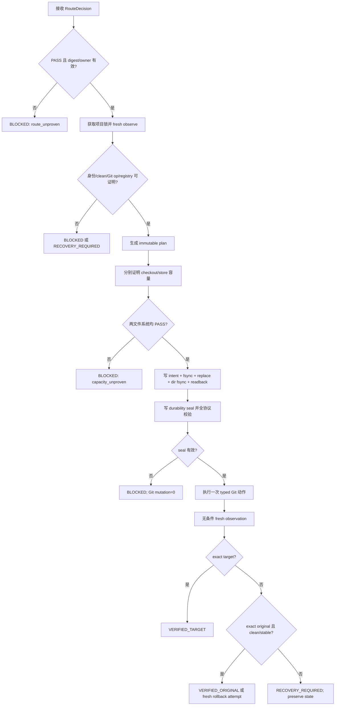

# ST-AW-002 LLD：可恢复的长期项目 worktree

## 修订记录

| 版本 | 日期 | 修订人 | 变更要点 |
|---|---|---|---|
| 1.0.0 | 2026-07-18 | meta-dev | 初版；覆盖 §0–§14，固化 O-AW-01 容量证明与 O-AW-02 durable journal 两项不可豁免契约，并将全部接口、失败路径、测试和 W01–W11 任务闭环。 |
| 1.1.0 | 2026-07-18 | meta-dev-debugger | CP5 R2 定点修复 CP5-QA-R1-F02 的 ST-AW-002 输出侧：冻结 rich immutable `WorktreeObservation`、包裹式 `WorktreeHealth` 与独立 pure evaluator，补齐 port tests；不改变 O-AW-01/02、CAP/DUR/WT 或 Git-before-durable=0。 |
| 1.2.0 | 2026-07-19 | Host Orchestrator（inline-fallback） | CP8 终验 design delta：把实现中的只读/manual-only resume 正式化，增加 typed attempt-bound CapacityProof、owner/calibration 持久化、显式 journal phase 与重复执行幂等约束。 |

## 0. 工程依据与上游契约

### 0.1 读取基线

| 依据 | 本 Story 消费内容 | 约束强度 |
|---|---|---|
| `process/context/CP5-CR051-LLD-CONTEXT.yaml` | CP5 设计写作边界、最小读取策略、O-AW-01/02、禁止实现、批量人工门禁 | 强制 |
| `process/docs/features/cr051-routing/DESIGN.md` | `RouteDecision.decision=PASS`、配置摘要、受控目标证明、route resolver 不执行 Git 变更 | 强制上游契约 |
| `process/docs/features/cr051-worktree/DESIGN.md` | worktree 生命周期、恢复状态机、容量/持久化、bootstrap/switch/remove 边界 | 强制 Feature 契约 |
| `process/docs/features/cr051-worktree/TEST-PLAN.md` | CAP、DUR、WT 与 TC-AW 场景编号及 fault-injection 要求 | 强制测试契约 |
| `process/docs/features/cr051-worktree/TASKS.md` | W01–W11 实施对象和验收关系 | 强制任务契约 |
| `process/DEVELOPMENT-PLAN.yaml` | `ST-AW-001 → ST-AW-002 → ST-AW-003` DAG、shared-file merge owner、CP5 前冻结实现 | 强制计划契约 |
| `process/checks/CP4-CR051-STORY-DAG-PARALLEL-SAFETY.result.json` | DAG、并行安全、共享文件所有权自动预检全部通过 | 自动证据 |

本 LLD 采用 Tier L：实现横跨 worktree 操作、容量模型、durable journal、故障恢复和共享 Git 适配层，包含非原子外部副作用、进程崩溃恢复、跨文件系统判断及远端 create-only 竞争，不能降级为 technical-note 或 waived。当前 CR 的共享契约以两个 Feature DESIGN 为规范化片段；不新增未经授权的 `process/shared/*` 文件。

### 0.2 上下游与所有权

```text
ST-AW-001 路由与受控目标证明
  └─ RouteDecision(PASS, config_digest, owned_target_proof)
       └─ ST-AW-002 本 LLD：容量证明 → durable intent → Git 动作 → 观察/恢复
            └─ WorktreeObservation → WorktreeHealth(observation) / WorktreeOperationResult
                 └─ ST-AW-003 调度与并发上限
```

- 调用方向：ST-AW-003/CLI 编排层调用 ST-AW-002；ST-AW-002 只消费 ST-AW-001 的路由结果，不反向修改路由配置。
- 调用时机：每次 create、bootstrap、switch、resume、remove 前重新预检；任何崩溃恢复先观察，后决定是否继续。
- 输入契约：只有 `RouteDecision.decision=PASS` 且 `config_digest` 与当前配置一致、受控目标证明有效，才可进入生命周期规划。
- 输出契约：`observe_worktree(...)` 只返回 rich immutable `WorktreeObservation`；`evaluate_worktree_health(...)` 返回结构化 `WorktreeHealth` 并通过 `health.observation` 原样承载 snapshot。另输出 `WorktreeOperationResult`、`capacity_proof_ref`、`journal_head_ref`，不以日志文本或在 Health 平铺第二套 snapshot 字段代替公共端口。
- 后续衔接：ST-AW-003 仅消费已经验证的健康状态与幂等结果；CLI wiring 由 ST-AW-004 的 `meta_flow/cli.py` merge owner 完成，本 Story 不抢写 CLI。
- 降级策略：容量、持久化、身份、远端、权限或状态证明任一不确定时返回 `BLOCKED`/`RECOVERY_REQUIRED`，保持 manual-only；不得猜测、强制、清理或重放。
- 同步修改边界：本 Story 拥有 `git_sync.py` 和既有 Git 回归测试的共享合并；CLI 仅定义调用契约，不在此 Story 修改。

### 0.3 前置条件校验与失败行为

| 前置条件 | 成功证据 | 失败行为 |
|---|---|---|
| route 允许且配置未漂移 | `RouteDecision(PASS)` + digest 相等 | 终止，`route_unproven` |
| target 属于当前 project 且不嵌套 | owner marker、canonical path、repo identity | 终止，禁止 Git/文件系统变更 |
| 当前仓库没有进行中的 Git 操作 | rebase/merge/cherry-pick/revert/bisect/sequencer 均空 | 终止，保持人工处理 |
| worktree/registry/journal 状态可完整枚举 | typed observation 无 unknown | 终止，`observation_incomplete` |
| checkout 与 durable store 各自容量可证明 | 两个文件系统分别 PASS | 终止，`capacity_unproven` |
| journal intent 已 durable seal | 链、checksum、file fsync、replace、dir fsync、readback 全通过 | Git mutation=0，终止 |
| integration 远端基线可精确观察 | exact ref/OID 或精确 absent | 终止，禁止 create/reset |

## 1. 目标、边界与成功标准

### 1.1 目标

在受控 sibling root 中创建并管理一个长期项目 worktree，保证 integration 分支只能 create-only 初始化；switch、恢复与安全删除均具备可审计、可重复观察、崩溃后不盲重放的状态机。任何自动 Git 变更必须同时满足路由、容量、durable intent、身份和操作空闲证明。

### 1.2 可量化成功标准

1. O-AW-01 的 CAP-01–CAP-11 全部通过；启用自动 switch 的校准样本中 `false_safe_count=0` 且 `underestimate_count=0`。
2. O-AW-02 的 DUR-01–DUR-14 全部通过；每个持久化 fault 在 durable seal 前均满足 Git mutation count 为 `0`。
3. WT-01–WT-14 与适用的 TC-AW 场景全部通过；timeout/kill 后只根据 fresh observation 返回已达目标、已回原点或需要恢复三类显式结果。
4. 同一 operation 连续 resume 10 次不产生第二次等价 Git mutation，journal sequence 单调且无 gap/重复。
5. integration bootstrap 对已存在 ref 的 mutation count 为 `0`；并发创建只有 exact same seed 可收敛为 `NO_CHANGE`，不同或未知 seed 必须 `BLOCKED`。
6. safe remove 在任何一项授权证明缺失时 mutation count 为 `0`，且不执行 `rm -rf`、force remove、reset、clean、stash、ref overwrite/delete。

### 1.3 范围边界

范围内：长期 worktree create/check/list、create-only integration bootstrap、可恢复 switch、safe remove、容量证据、durable journal、fault-injection 和结构化健康输出。

范围外：integration→main 回合并、发布策略、自动删除 integration ref、artifact 仓库 main 修改、跨项目调度、公用 CLI 参数落地、任何 force/reset/clean/stash/destructive recovery。ST-AW-003 负责并发调度，ST-AW-004 负责 CLI wiring，本 Story 不隐式接管相邻职责。

## 2. 需求与非功能约束

### 2.1 功能需求

| ID | 需求 | 验收映射 |
|---|---|---|
| FR-AW2-01 | 只接受经 ST-AW-001 验证的 route/context，并对 target、repo、worktree、Git operation 作 fresh observation | WT-09、WT-12、TC-AW-ROUTE |
| FR-AW2-02 | 在首个 Git mutation 前分别证明 checkout 和 durable store 文件系统容量 | CAP-01–CAP-11 |
| FR-AW2-03 | 用 checksum 链、unique record、fsync/replace/dir fsync/readback 与 durability seal 持久化 intent | DUR-01–DUR-14 |
| FR-AW2-04 | 远端 integration 只允许 absent→exact create-only；existing/race 不 reset、不 overwrite | WT-01–WT-04 |
| FR-AW2-05 | switch 超时/退出异常后必须重新观察，不根据进程退出码推断状态 | WT-05–WT-10 |
| FR-AW2-06 | resume 先验证 journal 链和 fresh observation，再幂等返回或进入显式恢复 | DUR-11、DUR-14、WT-06–WT-10 |
| FR-AW2-07 | rollback 只在 clean、无 Git op、原 ref/OID 稳定、容量/权限 fresh PASS 时执行 | WT-08–WT-10 |
| FR-AW2-08 | safe remove 要求精确身份、clean、idle、无恢复状态、独立授权，且仅非 force remove | WT-11–WT-14 |

### 2.2 非功能与安全约束

- 一致性：journal、Git 实际状态和结构化结果必须可相互校验；日志不是真相源。
- 可恢复性：所有非原子窗口都有“持久化意图—执行—重新观察—收敛”的失败路径。
- 安全：Git 与文件系统命令只能通过 argv-only runner；不得 shell 拼接，不得把用户输入解释为 refspec/选项。
- 隔离：每项目独立 sibling worktree、state store 和锁；目标项目工作区不可承载 journal 临时文件。
- 性能：容量枚举为受控树条目线性复杂度 `O(n)`；同一 snapshot 可在单次无漂移 precheck 中复用，不跨 attempt 复用。
- 可观测：所有阻断返回稳定 reason code、operation/attempt 标识和 evidence ref；不输出凭据或未脱敏环境值。
- 兼容：POSIX/Windows 采用明确的文件锁适配器；不支持的锁或目录 fsync 语义必须 fail closed。

## 3. 模块拆分与职责

### 3.1 代码结构

| 模块 | 主要职责 | 禁止职责 |
|---|---|---|
| `project_worktree.py` | 生命周期 facade、状态机、bootstrap/switch/resume/remove、结构化观察与结果 | 不解析项目路由配置；不自作发布决策 |
| `worktree_capacity.py` | checkout/store 两文件系统容量观察、上界估算、校准与 fail-closed 决策 | 不执行 Git mutation；不把固定 512 MiB 当无条件证明 |
| `worktree_journal.py` | project lock、append-only record、checksum chain、durability seal、恢复读取 | 不存于 target worktree；不偷取未知 stale lock；不跨设备 copy+delete |
| `git_sync.py` | 复用 typed argv-only Git runner，补充 exact remote ref/default-OID 与 create-only push 原语 | 不执行 force/reset/clean/stash；不把模糊 remote query 当 absent |
| `tests/test_cr051_project_worktree.py` | 正常生命周期、bootstrap、switch、remove、sibling 隔离测试 | 不使用生产仓库/真实远端 |
| `tests/test_cr051_worktree_faults.py` | CAP/DUR fault injection、kill-window、幂等恢复测试 | 不依赖不可控 OS 故障概率 |
| `tests/test_workspace_git_sync.py` | exact remote observation/create-only runner 回归 | 不重复状态机测试 |
| `tests/test_git_branch_lifecycle.py` | 既有分支生命周期不回归；只复用安全概念 | 不把 CR-050 paired-default 目标语义继承到 CR-051 |

`meta_flow/cli.py` 由 ST-AW-004 合并。本 Story 仅在 §6 给出可调用接口和 reason code，不修改该共享文件。

## 4. 文件影响范围

| 路径 | 动作 | 确定性变更说明 | Merge owner |
|---|---|---|---|
| `meta_flow/workspace/project_worktree.py` | 新增 | 定义数据结构、观察、计划、bootstrap、switch、resume、safe remove 与状态转换 | ST-AW-002 |
| `meta_flow/workspace/worktree_capacity.py` | 新增 | 定义 profile、snapshot、容量上界、校准证据及双文件系统决策 | ST-AW-002 |
| `meta_flow/workspace/worktree_journal.py` | 新增 | 定义 project lock、canonical record、checksum 链、seal、原子写和恢复扫描 | ST-AW-002 |
| `meta_flow/workspace/git_sync.py` | 修改 | 新增 exact ref/default OID 查询、create-only push 与 typed result；保留现有行为 | ST-AW-002 |
| `tests/test_cr051_project_worktree.py` | 新增 | 实现 WT-01–WT-14 及正常/竞争/隔离用例 | ST-AW-002 |
| `tests/test_cr051_worktree_faults.py` | 新增 | 实现 CAP-01–CAP-11、DUR-01–DUR-14 与 deterministic fault adapter | ST-AW-002 |
| `tests/test_workspace_git_sync.py` | 修改 | 补充 exact remote ref 和 create-only push 回归 | ST-AW-002 |
| `tests/test_git_branch_lifecycle.py` | 修改 | 证明既有 lifecycle 安全语义与命令行为不回归 | ST-AW-002 |
| `meta_flow/cli.py` | 不修改 | 仅交付 ST-AW-004 所需调用契约；由 ST-AW-004 merge owner 落地 | ST-AW-004 |

所有动作均为 CP5 人工确认后的拟实施范围；本 LLD 写作和自动预检不授权创建、删除、切换真实 worktree，也不授权真实 Git ref/remote mutation。

## 5. 数据模型与持久化

### 5.1 核心类型

```python
@dataclass(frozen=True)
class WorktreeIdentity:
    project_id: str
    repository_id: str
    repository_fingerprint: str
    worktree_id: str
    repo_common_dir: Path
    common_dir_digest: str
    target_path: Path
    target_path_digest: str
    expected_gitdir: Path | None
    integration_ref: str

@dataclass(frozen=True)
class UnknownValue:
    reason_code: str
    evidence_ref: str | None

@dataclass(frozen=True)
class WorktreeObservation:
    schema_version: str
    identity: WorktreeIdentity
    observed_at: datetime
    route_config_digest: str
    worktree_state: Literal["ABSENT", "TARGET", "ORIGINAL", "THIRD", "UNKNOWN"]
    head_ref: str | None | UnknownValue
    head_oid: str | None | UnknownValue
    integration_oid: str | None | UnknownValue
    dirty: bool | UnknownValue
    staged: bool | UnknownValue
    untracked: bool | UnknownValue
    git_operation: Literal["NONE", "MERGE", "REBASE", "CHERRY_PICK", "REVERT", "BISECT", "SEQUENCER"] | UnknownValue
    registry_state: Literal["CONSISTENT", "MISSING", "STALE", "CONFLICT"] | UnknownValue
    role: Literal["IDLE_INTEGRATION", "ACTIVE_CR", "RECOVERY_REQUIRED"] | UnknownValue
    observation_digest: str

@dataclass(frozen=True)
class FilesystemCapacityObservation:
    schema_version: str
    profile_id: str
    profile_version: str
    profile_digest: str
    filesystem_id: str
    tree_oid: str
    index_digest: str
    sparse_digest: str
    enumeration_coverage: str
    estimated_checkout_write_bytes: int
    upper_bound_bytes: int
    required_bytes: int
    available_bytes: int
    safety_factor_numerator: int
    safety_factor_denominator: int
    bounded_512_eligible: bool
    calibration_ref: str | None
    false_safe_count: int | None
    underestimate_count: int | None
    observed_at: datetime
    decision: Literal["PASS", "BLOCKED"]
    reason: str

@dataclass(frozen=True)
class WorktreeOperationPlan:
    operation_id: str
    attempt_id: str
    operation: Literal["CREATE", "BOOTSTRAP", "SWITCH", "ROLLBACK", "REMOVE"]
    route_digest: str
    before_observation_digest: str
    target_ref: str | None
    target_oid: str | None
    original_ref: str | None
    original_oid: str | None
    checkout_capacity_ref: str
    journal_capacity_ref: str
    created_at: datetime

@dataclass(frozen=True)
class WorktreeOperationResult:
    operation_id: str
    attempt_id: str
    decision: Literal["CHANGED", "NO_CHANGE", "BLOCKED", "RECOVERY_REQUIRED"]
    reason: str
    observed_state: str
    before_observation_ref: str
    after_observation_ref: str | None
    capacity_proof_ref: str
    journal_head_ref: str
    mutation_count: int

@dataclass(frozen=True)
class WorktreeHealth:
    project_id: str
    decision: Literal["HEALTHY", "DEGRADED", "BLOCKED", "RECOVERY_REQUIRED"]
    observation: WorktreeObservation | None
    observation_digest: str | None
    worktree_state: str
    journal_state: str
    active_operation_id: str | None
    reason_codes: tuple[str, ...]
```

所有 digest 均采用版本化 canonical encoding；`WorktreeObservation.observation_digest` 覆盖 schema version、identity 的稳定字段、common-dir identity、HEAD/ref/OID、dirty/staged/untracked、Git-op、registry/role、observed_at 与 route config digest。路径对外持久化为由 sibling root/project identity 可重建的相对标识，不把设备相关绝对路径当跨设备契约。

`None` 只表示由 `worktree_state=ABSENT` 证明的结构性不存在；探针不确定必须使用带 `reason_code/evidence_ref` 的 `UnknownValue`，不能省略字段、写成 false 或假装 absent。任何 unknown 都使 health fail closed。

`WorktreeHealth` 是 observation 的裁决 envelope，不是第二套 snapshot schema，也不是独立 mutation authorization token：

- `decision=HEALTHY` 必须同时满足 `observation is not None`、`project_id == observation.identity.project_id`、`observation_digest == observation.observation_digest`、route/freshness 匹配、无 unknown、clean、无 staged/untracked、Git-op 为 `NONE`、registry/role 与 journal 状态一致且无 active/recovery operation。
- 非 `HEALTHY` 可以保留 observation 及其 matching digest 供诊断；不得把保留 snapshot 解释为 mutation 授权。
- observation 缺失、digest/project/route mismatch 或 stale 必须返回非 `HEALTHY` 和稳定 reason code；所有 mutation 仍需当次 typed authz、fresh precheck、capacity proof 与 durable intent。

### 5.2 Durable journal 布局（O-AW-02，不可豁免）

```text
<sibling-root>/.meta-flow-worktree-state/<project-id>/
├── owner.json
├── project.lock
├── calibrations/
│   └── <profile-digest>.json
└── operations/
    └── <operation-id>/
        └── <attempt-id>/
            ├── 000001-observation.json
            ├── 000002-intent.json
            ├── 000003-intent-seal.json
            ├── 000004-observation-required.json
            └── 000005-final-observation.json
```

- store 必须位于 target worktree 外；`owner.json` 绑定 project ID、repo identity 与 sibling root，相邻项目不能共用锁或 operation namespace。
- POSIX 锁适配器使用持有文件句柄的 `flock`，Windows 使用持有句柄的 `msvcrt` locking；进程崩溃由 OS 释放。后端不支持或锁状态不明时返回 `BLOCKED`，禁止按时间戳“偷取 stale lock”。
- record 名称由严格单调 sequence、phase 和 operation/attempt 唯一确定；已存在名称绝不覆盖。记录为排序键 canonical JSON，`record_digest` 的计算排除自身字段，并链接 `previous_record_ref`/`previous_record_digest`。
- 临时文件必须在最终目录同一文件系统且为 store-local exclusive create。协议固定为：写入 temp → flush → file fsync → atomic replace 到新的唯一 final → parent directory fsync → reopen/readback → checksum/schema/chain 校验。
- intent 只有在后续 `intent-seal` 存在、链有效且 seal 自身完成同一协议后，才可用于同进程自动 Git mutation。恢复扫描若缺 seal、seal checksum 错误、sequence gap、重复或 previous digest 不匹配，一律 `BLOCKED`；不得把“replace 已发生但目录未 fsync”猜成 durable。
- `observation-required` seal 在 Git 调用前已确定恢复策略；Git 返回、timeout 或进程重启后均必须写 fresh observation。kill 后不根据上次退出码盲重放。
- 跨设备 rename/replace 返回 `cross_device_store` 并阻断；严禁退化为 copy+delete。

### 5.3 状态枚举

`OperationState` 只允许以下状态和显式迁移：

```text
PLANNED
  → PRECHECKED
  → CAPACITY_PROVED
  → INTENT_PREPARED
  → INTENT_SEALED
  → SWITCH_ATTEMPTED
  → OBSERVATION_REQUIRED
      ├─ VERIFIED_TARGET
      ├─ VERIFIED_ORIGINAL
      ├─ ROLLBACK_ELIGIBLE → ROLLBACK_INTENT_SEALED → ROLLBACK_ATTEMPTED → OBSERVATION_REQUIRED
      └─ RECOVERY_REQUIRED / BLOCKED
```

禁止从 `INTENT_PREPARED` 直接进入任何 Git mutation，禁止从 `SWITCH_ATTEMPTED` 仅凭 exit code 进入 `VERIFIED_TARGET`，禁止从 `RECOVERY_REQUIRED` 自动清理或重新执行。

## 6. API / 接口设计

### 6.1 `observe_worktree`

```python
def observe_worktree(
    route: RouteDecision,
    *,
    git: GitRunner,
    fs: FileSystemAdapter,
) -> WorktreeObservation
```

- 前置：route PASS、config digest 当前有效、owned target proof 有效。
- 输出：rich immutable snapshot；通过 nested `identity` 覆盖 project/repo/worktree identity 与 common-dir，并显式包含 HEAD ref/OID、dirty/staged/untracked、Git-operation、registry/role、observed_at、route digest 和 observation digest。本接口不返回 `WorktreeHealth`。
- 错误：route/owned identity 前置失败返回 typed failure；单个 probe 不确定写入 `UnknownValue`，由 evaluator fail closed。所有路径均无 mutation。
- 测试：PORT-W-01、PORT-W-02、WT-05–WT-10、WT-12、WT-14、TC-AW-ROUTE。

### 6.2 `evaluate_worktree_health`

```python
def evaluate_worktree_health(
    observation: WorktreeObservation | None,
    journal_state: JournalState,
    active_operation_id: str | None,
    *,
    project_id: str,
    expected_route_config_digest: str,
    evaluated_at: datetime,
    max_observation_age_seconds: int,
) -> WorktreeHealth
```

- 这是无 Git/filesystem probe、无持久化、无 mutation 的 pure evaluator；同一输入必须得到相同 canonical decision/reason codes。
- `HEALTHY` 必须原样携带非空 observation，并令 `health.observation_digest` 与 snapshot digest 精确一致；project/route/freshness/digest/unknown/clean/Git-op/registry/role/journal/active-operation 任一不满足都返回非 `HEALTHY`。
- 非 `HEALTHY` 可以保留 observation 供下游诊断，但下游只能从 `health.observation` 读取 rich snapshot，不能从 Health 平铺字段构造另一套 schema，也不能据此授权 mutation。
- 测试：PORT-W-03–PORT-W-08、WT-05–WT-10、WT-12、WT-14。

### 6.3 `plan_worktree_operation`

```python
def plan_worktree_operation(
    operation: OperationKind,
    before: WorktreeObservation,
    *,
    desired_ref: str | None,
    desired_oid: str | None,
) -> WorktreeOperationPlan
```

- 只产生 immutable plan，不写 journal、不运行 Git；plan 绑定 route 和 before observation digest。
- target ref/OID、original ref/OID 必须 exact；未知值不能延后到 mutation 后补填。
- 测试：WT-01–WT-10、WT-13、WT-14。

### 6.4 `prove_checkout_capacity`

```python
def prove_checkout_capacity(
    plan: WorktreeOperationPlan,
    snapshot: CheckoutSnapshot,
    *,
    checkout_fs: CapacityProbe,
    journal_fs: CapacityProbe,
    calibration: CalibrationEvidence | None,
) -> CapacityDecision
```

- checkout 与 journal store 必须按各自 `filesystem_id` 独立探测；两者都 PASS 才可继续。
- 任何权限拒绝、无法枚举、profile mismatch、未知 transform、误差界未知或 snapshot 漂移返回 `capacity_unproven`。
- 测试：CAP-01–CAP-11，特别是 CAP-07 EACCES、CAP-08 无法枚举、CAP-09 profile mismatch、CAP-11 分离文件系统。

### 6.5 `persist_intent`

```python
def persist_intent(
    plan: WorktreeOperationPlan,
    capacity: CapacityDecision,
    *,
    journal: WorktreeJournal,
) -> DurableIntent
```

- 返回值只在 intent record 与 durability seal 全协议通过后产生；seal ref/digest 是后续 mutation 的必要输入。
- 任一写入、fsync、replace、dir fsync、readback、checksum、链或锁错误抛出 typed failure，Git mutation count 必须保持 0。
- 测试：DUR-01–DUR-10、DUR-12、DUR-13。

### 6.6 `bootstrap_integration`

```python
def bootstrap_integration(
    durable_intent: DurableIntent,
    *,
    remote: str,
    integration_ref: str,
    git: GitRunner,
) -> WorktreeOperationResult
```

- fresh `ls-remote --refs <remote> refs/heads/projects/<project>/integration` 返回 exact existing OID 时直接 `NO_CHANGE`。
- exact absent 时 fresh 查询 remote default/main 的 exact seed OID，并执行普通 exact create-only push；禁止 force、delete、reset、orphan。
- push reject 后必须 fresh observe：same seed → `NO_CHANGE`；different/unknown → `BLOCKED`，不覆盖远端。
- 测试：WT-01–WT-04、`tests/test_workspace_git_sync.py` exact-query 回归。

### 6.7 `create_project_worktree`

```python
def create_project_worktree(
    durable_intent: DurableIntent,
    bootstrap: WorktreeOperationResult,
    *,
    git: GitRunner,
) -> WorktreeOperationResult
```

- target 必须 non-nested、absent/empty、owned；local integration ref 必须 absent 或 exact、且未被其他 worktree 占用。
- 使用 typed argv-only worktree 命令创建 sibling worktree，随后 fresh observe；退出 0 但身份/OID 不符仍 `RECOVERY_REQUIRED`。
- 测试：WT-01、WT-02、WT-11、WT-13、WT-14。

### 6.8 `execute_switch`

```python
def execute_switch(
    durable_intent: DurableIntent,
    prepared_target: PreparedSwitchTarget,
    *,
    git: GitRunner,
) -> WorktreeOperationResult
```

- caller 已准备并验证目标；本接口不推断“第几 leg 完成”，不接管发布/集成决策。
- 命令 exit 0、非 0、timeout 或 runner exception 后均调用 fresh observation；只有 exact target/original 可判定，third/dirty/operation-active/config-drift 均阻断。
- 测试：WT-05–WT-10、DUR-11。

### 6.9 `resume_worktree_operation`

```python
def resume_worktree_operation(
    operation_id: str,
    *,
    route: RouteDecision,
    journal: WorktreeJournal,
    git: GitRunner,
) -> WorktreeOperationResult
```

- 顺序固定：获取 project lock → 校验 owner/record chain/seal → 重新验证 route → fresh observe → 幂等收敛。
- target 已达成返回 `NO_CHANGE/VERIFIED_TARGET`；original 未变返回 `VERIFIED_ORIGINAL` 或在全部 fresh rollback 条件满足时新建 rollback attempt；third/dirty/op-active/链异常返回 `RECOVERY_REQUIRED`/`BLOCKED`。
- 同一 operation 重复 resume 不复用旧容量/权限证明；每个新 attempt 都有新 sequence namespace 和证据。
- 测试：DUR-09–DUR-14、WT-06–WT-10。

### 6.10 `safe_remove`

```python
def safe_remove(
    route: RouteDecision,
    identity: WorktreeIdentity,
    authorization: RemovalAuthorization,
    *,
    git: GitRunner,
) -> WorktreeOperationResult
```

- 必须同时证明 exact identity、clean、无 Git operation、integration idle、无 active/recovery operation、ref 仍需要保留、独立 remove authorization 有效。
- 唯一允许的删除动作是非 force `git worktree remove <exact-path>`；不得 `rm -rf`、force、prune-then-assume、删除/覆盖 ref。
- 测试：WT-11–WT-14。

## 7. 核心流程



### 7.1 Bootstrap 时序

1. 精确查询 integration ref；existing 立即 `NO_CHANGE`。
2. absent 时精确解析 remote default/main seed OID，并把 seed 写入 durable intent。
3. 普通 create-only push exact refspec；不带 force。
4. push reject 只触发 fresh query；同 seed 收敛，不同/未知 seed 阻断。
5. 只有 integration OID 精确确定后，才可规划 sibling worktree create。

### 7.2 Switch / crash recovery 时序

1. fresh observation、容量证明、durable intent/seal 完成后，最多发起一次 Git switch。
2. 在 Git 返回前或后 kill，重启都从 journal chain + fresh observation 开始。
3. 已在目标：幂等成功；仍在原点：默认保持 manual-only，只有 fresh rollback 资格成立才可进入新的 rollback attempt；third/dirty/op-active：保留现场并 `RECOVERY_REQUIRED`。
4. 不允许通过 reset/clean/stash 强行制造可恢复状态。

## 8. 技术细节与算法

### 8.1 O-AW-01：profile-based 容量上界（不可豁免）

自动 switch 默认关闭。只有匹配当前 `profile_id/profile_version/profile_digest` 的校准证据同时满足以下条件，才可启用对应 profile：CAP 覆盖完整，`false_safe_count=0`，`underestimate_count=0`，校准状态为 `CALIBRATED`。任一 profile、Git 版本、文件系统 allocation unit、filter/sparse 配置或估算实现摘要变化都会使证据变为 `REVOKED`/`PENDING`。

允许使用有界估算的 profile 只包含普通 blob 与 symlink，且必须满足：无 active smudge/process/working-tree-encoding 等工作树变换、无 submodule/LFS 展开、文件系统 block/allocation unit 已知、目标 tree OID/index digest/sparse digest 固定、所有将变更/新增条目都被完整枚举。否则直接 `capacity_unproven`。

对每个将写入条目 `e`：

```text
allocated(e) = round_up(blob_size(e), fs_block_size)
path_meta(e) = round_up(encoded_path_length(e) + fixed_dirent_header, fs_block_size)
blob_upper = Σ allocated(e)
metadata_upper = Σ path_meta(e)
index_upper = 2 × round_up(max(current_index_size, target_index_encoded_size), fs_block_size)
temp_upper = round_up(max(max_changed_blob_size, target_index_encoded_size), fs_block_size)
upper_bound = blob_upper + metadata_upper + index_upper + temp_upper
profile_required = ceil(upper_bound × 3 / 2)
```

`3/2` 是显式 safety factor，不是经验口号。若校准观察到任何实际写入超过 `upper_bound`，立即增加 `underestimate_count` 并撤销 profile；若 decision PASS 后实际 ENOSPC，则同时增加 `false_safe_count`，撤销自动开关并要求重新设计/校准。

- `profile_required <= 512 MiB`：只有校准完全通过时，bounded fallback 需求为 `max(512 MiB, profile_required)`，即至少 512 MiB。
- `profile_required > 512 MiB`：固定 512 MiB fallback 不适用，必须按已证明的 `profile_required` 与实际 available bytes 比较。
- EACCES、statvfs/volume query 失败、无法枚举、error bound 未知、profile mismatch 或 snapshot 漂移：返回 `BLOCKED(capacity_unproven)`，不得用固定阈值兜底。
- durable store 位于独立文件系统时另行计算。单条记录需求至少为 `2 × round_up(encoded_record_len, block_size) + block_size`（temp + final + directory margin），并为本 attempt 预计全部 record/seal 累加；不能用 checkout 可用空间替代。
- 每个 attempt 都 fresh probe；校准证据只能证明公式资格，不能替代当次 available bytes 观察。

### 8.2 O-AW-02：replace-before-dir-fsync 窗口

单个 intent 文件“看得见”不等于 durable。实现通过后继 `DurabilitySeal` 把这个窗口显式化：只有 intent 完成 parent dir fsync、readback 和 checksum 后才开始写 seal；seal 自身也完成同样协议。恢复时只有有效 seal 才证明对应 intent 已经过完整持久化路径。kill 发生在 intent replace 后、dir fsync 或 seal 完成前时，恢复将看到缺 seal/无效 seal并 `BLOCKED`，绝不自动 Git mutation；kill 发生在 seal 验证后、Git 前时，可从 fresh observation 安全判定“尚未改变”但仍需新 attempt/策略确认，不盲重放。

### 8.3 Bootstrap 竞争算法

1. `query_exact_ref(remote, integration_ref)` 只接受 0 或 1 个 exact 结果；模糊、多行、错误均 unknown。
2. existing → 返回 OID 与 `NO_CHANGE`，mutation=0。
3. absent → `resolve_remote_default_oid(remote)` 得到 exact seed OID，并固化在 intent。
4. 执行普通 `push remote <seed_oid>:refs/heads/...`；不使用 `+`、`--force`、delete。
5. reject → 重新 exact query：OID==seed → race-same `NO_CHANGE`；OID!=seed 或 unknown → `BLOCKED(remote_race_conflict)`。

### 8.4 Rollback 资格决策

| 条件 | 要求 | 不满足时 |
|---|---|---|
| worktree 状态 | exact original 或明确定义的 rollback source | `RECOVERY_REQUIRED` |
| clean | tracked/untracked 策略下均可证明 clean | 禁止 rollback |
| Git operation | 无进行中操作 | 禁止 rollback |
| original ref/OID | 与 durable plan 一致且 fresh observe | 禁止 rollback |
| route/config | 仍 PASS 且 digest 未漂移 | 禁止 rollback |
| capacity/permission | 当次重新证明 | 禁止 rollback |
| journal | 链/seal 有效，写入新 rollback attempt | 禁止复用旧 mutation intent |

### 8.5 幂等与 reason code

幂等键为 `(project_id, operation_id, attempt_id)`；同一 record sequence 不覆盖，同一 Git 动作是否已经发生由 fresh observation 判定，不由“命令是否曾发出”判定。稳定 reason code 至少包括：`route_unproven`、`target_identity_mismatch`、`observation_incomplete`、`git_operation_active`、`capacity_unproven`、`journal_not_durable`、`journal_chain_invalid`、`remote_race_conflict`、`target_verified`、`original_verified`、`third_state`、`dirty_state`、`rollback_ineligible`、`remove_not_authorized`。

## 9. 安全、权限与性能设计

### 9.1 安全边界

- 所有 ref/path 先作为数据校验，再进入固定 argv slot；禁止 shell、eval、字符串命令模板和用户可控选项前缀。
- canonical target 必须位于受控 sibling root 内且不能等于项目 root、artifact main 或其他项目目录；symlink/junction/realpath 漂移 fail closed。
- journal 不保存 token、密码、环境密钥或 remote credential；命令失败摘要脱敏。
- remote existing ref 是外部事实，不得重置、删除或迁移；本 Story 无 publish/live 权限。
- 删除授权与 route 允许相互独立；route PASS 不代表 remove authorized。

### 9.2 运行时风险控制

| 风险 | 控制 | 失败模式 |
|---|---|---|
| 双进程并发 | 每项目 OS handle lock + operation identity | 锁不支持/未知即 BLOCKED |
| 磁盘空间假安全 | profile 上界 + 3/2 + 校准零 false-safe/underestimate + 双 FS 探测 | 自动开关关闭 |
| torn/丢失 journal | unique record + fsync/replace/dir fsync/readback + seal + checksum chain | BLOCKED，preserve |
| Git timeout 状态不明 | timeout 后 fresh observe | exact target/original 外均 RECOVERY_REQUIRED |
| 远端 bootstrap race | create-only push + fresh exact ref | different/unknown seed BLOCKED |
| 误删 worktree | exact identity + independent authz + non-force remove | mutation=0 |

### 9.3 性能预算

- 单次容量枚举时间与目标 tree 条目数线性，测试环境应记录条目数、耗时和 profile digest；不承诺跨 attempt 缓存。
- journal record 小而有界，扫描只读取当前 operation/attempt 的 manifest/chain；损坏时不做全盘猜测修复。
- remote exact query 在 bootstrap 前和 reject 后最多各一次；不使用轮询掩盖竞争。

## 10. 测试设计与验证矩阵

### 10.1 接口—异常—测试映射

| 接口/契约 | 正向测试 | 失败与边界测试 | 必须验证的 oracle |
|---|---|---|---|
| `observe_worktree` | PORT-W-01、WT-06、WT-07 | PORT-W-02、WT-05、WT-08–WT-10、WT-12、WT-14 | rich immutable snapshot 字段齐全；typed unknown 不被省略/折叠；本接口不产 Health |
| `evaluate_worktree_health` | PORT-W-03、PORT-W-07 | PORT-W-04–PORT-W-06、PORT-W-08 | HEALTHY 必有嵌套 observation 且 digest 精确一致；非 HEALTHY 不授权 mutation；consumer 无第二套平铺 schema |
| `plan_worktree_operation` | WT-01、WT-06 | WT-09、WT-10、WT-13 | plan 绑定 route/observation，阶段无 mutation |
| `prove_checkout_capacity` | CAP-01、CAP-02、CAP-03、CAP-11 | CAP-04–CAP-10 | 决策、上下界、双 FS、校准计数；失败 mutation=0 |
| `persist_intent` | DUR-01 基线成功分支、DUR-10 | DUR-01–DUR-09、DUR-12、DUR-13 | temp/final/seal/chain/digest/fsync 顺序；故障前 Git mutation=0 |
| `bootstrap_integration` | WT-01、WT-02 | WT-03、WT-04 | existing 不变；same seed 收敛；different/unknown 阻断 |
| `create_project_worktree` | WT-01、WT-11 | WT-12–WT-14 | sibling 隔离、当前树不变、registry/identity 精确 |
| `execute_switch` | WT-06、WT-07 | WT-05、WT-08–WT-10、DUR-11 | 无论 exit/timeout 均 fresh observe，不盲判 |
| `resume_worktree_operation` | DUR-10、DUR-11、DUR-14 | DUR-06–DUR-09、DUR-12、DUR-13、WT-08–WT-10 | 10 次 resume mutation≤1；链异常阻断 |
| `safe_remove` | WT-11 | WT-12–WT-14 | 仅全证明时 non-force remove；否则 mutation=0 |
| `git_sync.py` exact/create-only 原语 | WT-01–WT-04 | 模糊/多行/runner error 回归 | argv-only、无 force/delete、typed result |

### 10.2 CAP-01–CAP-11：O-AW-01 不可豁免证明

| ID | Fixture / 注入 | 期望 |
|---|---|---|
| CAP-01 | 常见小型 checkout，profile/calibration 匹配 | 上界≥实际写入，PASS，false-safe=0 |
| CAP-02 | 常见中型 checkout | 上界≥实际写入，PASS，underestimate=0 |
| CAP-03 | `profile_required` 恰好 512 MiB 边界 | 使用 `max(512MiB, required)`，边界包含关系确定 |
| CAP-04 | `profile_required` 大于 512 MiB | 不用固定 fallback；按实际 required 判断 |
| CAP-05 | 接近最大允许误差但未越界 | 3/2 safety factor 生效，上界不低估 |
| CAP-06 | 故意低估实际写入 | 计入 underestimate，profile REVOKED，自动 switch 关闭 |
| CAP-07 | 容量/条目探测 EACCES | `capacity_unproven`，Git mutation=0 |
| CAP-08 | 无法完整枚举或 transform 未知 | `capacity_unproven`，不得 512 MiB 兜底 |
| CAP-09 | profile/version/digest 不匹配 | calibration 不可复用，自动 switch 关闭 |
| CAP-10 | decision PASS 后注入 ENOSPC | false-safe+underestimate 计数，profile REVOKED，自动 switch 关闭 |
| CAP-11 | checkout 与 store 位于不同文件系统 | 分别计算/探测；任一不足即 BLOCKED |

CAP 测试除 decision 外必须断言 `upper_bound_bytes`、`required_bytes`、`available_bytes`、profile digest、calibration ref、false-safe/underestimate 计数和 Git mutation count。固定 512 MiB 不是 waiver，也不是 unknown 场景的 fallback。

### 10.3 DUR-01–DUR-14：O-AW-02 不可豁免证明

| ID | Fault window | 期望 |
|---|---|---|
| DUR-01 | store 写入 ENOSPC | typed failure，Git mutation=0，temp 可审计 |
| DUR-02 | store EACCES | `BLOCKED`，Git mutation=0 |
| DUR-03 | file fsync 失败 | 无有效 record/seal，Git mutation=0 |
| DUR-04 | atomic replace 失败 | final 不被覆盖，Git mutation=0 |
| DUR-05 | parent dir fsync 失败 | 无有效 seal，Git mutation=0 |
| DUR-06 | readback checksum mismatch | chain invalid，`BLOCKED` |
| DUR-07 | torn/truncated record | schema/checksum 失败，`BLOCKED` |
| DUR-08 | kill 在 temp 写/flush/fsync 期间 | 重启忽略未 sealed intent，Git mutation=0 |
| DUR-09 | kill 在 replace 后、dir fsync/seal 前 | 缺 seal，`BLOCKED`，不自动 Git mutation |
| DUR-10 | seal 已验证、Git 前 kill | fresh observe 后保持幂等；不盲重放 |
| DUR-11 | Git 已发生、final observe 前 kill | resume 先观察并识别 target/original/third |
| DUR-12 | 临时与 final 被注入为跨设备 | `cross_device_store`，禁止 copy+delete |
| DUR-13 | sequence gap/previous digest mismatch/重复 | chain invalid，`BLOCKED` |
| DUR-14 | 对同一 operation 连续 resume 10 次 | 等价 Git mutation 总数≤1，结果稳定、sequence 单调 |

Fault adapter 必须能在 write、flush、file fsync、replace、dir fsync、readback、Git 调用前/后逐点 deterministic 注入，避免依赖真实机器断电概率。

### 10.4 WT-01–WT-14：生命周期与恢复

| ID | 场景 | 期望 |
|---|---|---|
| WT-01 | integration absent，bootstrap + create | exact create-only，worktree target verified |
| WT-02 | integration 已存在 | mutation=0，复用 exact OID，不 reset |
| WT-03 | 并发 race 创建相同 seed | fresh observe 后 `NO_CHANGE` |
| WT-04 | 并发 race 创建不同/未知 seed | `BLOCKED(remote_race_conflict)` |
| WT-05 | switch exit 0 但 observation mismatch | `RECOVERY_REQUIRED`，不得宣告成功 |
| WT-06 | timeout 后观察为 exact target | `VERIFIED_TARGET` |
| WT-07 | timeout 后观察为 exact original | `VERIFIED_ORIGINAL`/manual-only |
| WT-08 | timeout 后 third/dirty/op-active | `RECOVERY_REQUIRED`，preserve |
| WT-09 | rollback 全资格满足 | 新 durable rollback attempt；observe 后收敛 |
| WT-10 | rollback 任一资格缺失或 config drift | `rollback_ineligible`，mutation=0 |
| WT-11 | sibling 隔离 + 合法 safe remove | 当前树不变，非 force remove，仅目标 worktree 被移除 |
| WT-12 | 当前 worktree dirty/Git op active | create/switch/remove 均阻断 |
| WT-13 | unsafe remove（无独立授权/active recovery/ref 不应删除） | mutation=0，不 force、不 rm |
| WT-14 | stale/mismatch registry 或 identity | `BLOCKED`，不 prune 后猜测、不删除 |

### 10.5 TC-AW 与分层执行

- 单元层：canonical encoding、digest chain、上界公式、profile eligibility、state transition、reason code。
- 组件层：fake Git runner + temp filesystem + fault adapter，覆盖全部 CAP/DUR/WT。
- 集成层：仅在隔离 fixture repo 和本地 bare remote 中运行 argv-only Git；严禁 production repo、artifact main 和真实 remote mutation。
- 回归层：`tests/test_workspace_git_sync.py` 与 `tests/test_git_branch_lifecycle.py`，证明新增 exact/create-only 原语不改变既有安全边界，且不继承 CR-050 paired-default 目标语义。
- dry-run/人工审查：检查命令 argv、journal evidence、mutation counter 和禁止命令扫描；任何真实 mutation 测试必须使用新建临时 fixture。

## 11. 实施步骤与 TASK-ID

以下任务与 Feature TASKS 的 W01–W11 一一对应；必须在 CP5 人工确认后才可进入实现，且不得改写任务 ID。

| TASK-ID | 实施内容 | 文件 | 前置 | 完成准则 |
|---|---|---|---|---|
| W01 | 定义 identity/rich observation/包裹式 health/plan/result、状态枚举和稳定 reason code | `project_worktree.py` | ST-AW-001 route contract | 类型覆盖 §5，唯一 `health.observation` port，unknown fail closed |
| W02 | 实现 route/target/repo/worktree/Git-op fresh observation、pure health evaluation 与 plan 绑定 | `project_worktree.py` | W01 | PORT-W-01–08、WT-05–WT-10/12/14 oracle 可生成 |
| W03 | 实现 profile、snapshot、条目枚举、上界公式与双 FS probe | `worktree_capacity.py` | W01 | CAP-01–CAP-05、CAP-07–CAP-09、CAP-11 通过 |
| W04 | 实现 calibration state、false-safe/underestimate 撤销和默认关闭开关 | `worktree_capacity.py` | W03 | CAP-06、CAP-10 通过；不允许 waiver |
| W05 | 实现 project owner/lock、canonical record、checksum chain 和 unique sequence | `worktree_journal.py` | W01 | DUR-06/07/13 与项目隔离通过 |
| W06 | 实现 same-filesystem temp、file fsync、replace、dir fsync、readback、durability seal | `worktree_journal.py` | W05 | DUR-01–DUR-10/12 通过；fault 前 mutation=0 |
| W07 | 为共享 Git 层增加 exact ref/default OID 与普通 create-only push typed 原语 | `git_sync.py`、`tests/test_workspace_git_sync.py` | W01 | WT-01–WT-04；argv 无 force/delete |
| W08 | 实现 bootstrap/create/switch 及每次 Git 后 fresh observe | `project_worktree.py` | W02–W07 | WT-01–WT-08/11 通过 |
| W09 | 实现 resume、fresh rollback attempt 和 safe remove | `project_worktree.py` | W08 | DUR-11/14、WT-09–WT-14 通过 |
| W10 | 建立 deterministic CAP/DUR fault fixtures 和 mutation counter | `tests/test_cr051_worktree_faults.py` | W03–W06、W09 | CAP-01–11、DUR-01–14 全覆盖 |
| W11 | 补齐生命周期/竞争/隔离/既有行为回归并生成实现证据 | `tests/test_cr051_project_worktree.py`、`tests/test_git_branch_lifecycle.py` | W07–W10 | WT-01–14、适用 TC-AW 全通过；无真实目标 mutation |

实施顺序固定为 `W01 → (W02, W03, W05) → W04 → W06 → W07 → W08 → W09 → W10 → W11`；括号内可在文件无冲突时并行。`git_sync.py` 与两个既有回归测试由 ST-AW-002 合并；`meta_flow/cli.py` 留给 ST-AW-004。

### 11.1 dev_gate 与设计偏差记录

`dev_gate` 只在以下机器可判定条件全部成立时为 true：`lld_confirmed=true`、ST-AW-001 依赖满足、当前 Wave 前置完成、shared-file merge owner/merge order 无冲突、O-AW-01/02 仍为不可豁免验证义务。当前 `confirmed=false`，因此 dev gate 必须保持冻结。

实现若偏离本 LLD 的接口、文件、状态机、容量公式、持久化协议、禁止动作或测试映射，必须先记录 Story design delta，写明原契约、新契约、原因、影响文件、需求/场景/测试影响、风险、回退和需要回写的 Feature DESIGN/ADR/HLD；高风险或跨 Story contract 偏差应返回 CP5 设计澄清，不能只在代码注释或实现摘要中静默改变。

## 12. 风险、灰区与开放项

### 12.1 风险矩阵

| 风险 | 触发 | 影响 | 设计应对 | 状态 |
|---|---|---|---|---|
| R-AW2-01 容量模型 false-safe | PASS 后实际 ENOSPC | worktree 半完成/恢复复杂 | profile 默认关闭、3/2、校准零 false-safe/underestimate、立即 REVOKE | 已设计；O-AW-01 CP5 不可豁免 |
| R-AW2-02 journal 看见但未 durable | replace 后、dir fsync 前 kill | 恢复盲重放 | 后继 seal、链验证、缺 seal BLOCKED | 已设计；O-AW-02 CP5 不可豁免 |
| R-AW2-03 远端 bootstrap race | 同时创建 integration | 覆盖别人的 ref | ordinary create-only + fresh exact observe | 已设计 |
| R-AW2-04 timeout 状态不明 | Git 已执行但 runner 超时 | 重复 mutation | fresh observation 决策，不依赖 exit code | 已设计 |
| R-AW2-05 错误安全删除 | identity/registry 漂移 | 数据丢失 | 独立授权 + exact identity + non-force remove | 已设计 |
| R-AW2-06 平台锁/fsync 语义不足 | 不支持 handle lock/dir fsync | 互斥或 durable 证明失效 | fail closed，manual-only，不偷锁/不降级 | 已设计 |

### 12.2 灰区分类与澄清队列

| 项 | 分类 | 本 LLD 处理 | 是否阻塞写作 |
|---|---|---|---|
| O-AW-01 容量证明 | `non-blocking-open` proof obligation | 已落为 §8.1 + CAP-01–11 的不可豁免实施/验证契约；验证未通过前自动 switch 保持关闭 | 否 |
| O-AW-02 durable journal | `non-blocking-open` proof obligation | 已落为 §5.2/§8.2 + DUR-01–14 的不可豁免实施/验证契约；验证未通过前禁止自动 mutation | 否 |
| CP5-CR051-DQ-01 | Host-owned `decision-item` | 仅由 Host 在全量 CP5 Decision Brief 中统一请求人工批准；本 lane 不代答、不消解 | 否 |

当前 LLD clarification queue 为 `clear`，新增 `LCQ=0`、本地 `OPEN=0`、Spike=0。O-AW-01/02 是已知、不可豁免的工程证明义务，不被伪装成 waived，也不因 `open_items: 0` 而消失。

### 12.3 Gotchas

1. **512 MiB 不是万能阈值**：只在 matching calibrated bounded profile 且计算需求不超过 512 MiB 时使用；unknown/大 checkout 不能套用。
2. **文件存在不等于 durable**：缺 durability seal 时，即使 intent final 可读也必须阻断。
3. **Git 退出码不是真实状态**：exit 0 也可能身份/OID 不符；timeout 也可能已成功，必须 fresh observe。
4. **existing integration 不是可修复对象**：只复用 exact OID；不同期望不能 reset/force。
5. **stale registry 不是 prune 授权**：不得先 prune 再把不一致当安全删除。
6. **route PASS 不是 remove 授权**：删除需要独立、当次、精确授权。
7. **旧 CR-050 lifecycle 只能复用安全原语**：不能继承 paired-default 目标、分支语义或回退假设。

## 13. 发布、回滚与恢复策略

### 13.1 发布前置

- CP5 全量人工门禁批准；本 Story `confirmed=true` 后才能实现。
- CP6 实现证据必须列出 W01–W11、所有文件 diff、fixture 隔离和禁止命令扫描结果。
- CP7 必须执行 CAP-01–11、DUR-01–14、WT-01–14 和适用 TC-AW；O-AW-01/02 不允许 risk acceptance 或 waiver 替代。
- 自动 switch feature flag 初始为 disabled；只有匹配 profile 的校准证据满足零 false-safe/underestimate 且验证完整，才可按后续发布门禁启用。

### 13.2 代码回滚

代码发布回滚只回退新模块和 ST-AW-002 拥有的共享 Git 适配变更，并恢复 feature flag disabled。回滚不得删除长期 worktree、integration ref 或 journal；这些是外部/恢复证据，必须先观察并按人工恢复手册处理。

### 13.3 运行时恢复

- journal chain/seal 有效且 fresh observation 为 exact target：记录验证结果，幂等结束。
- exact original：保持 manual-only；只有 §8.4 全部资格 fresh PASS 才能新建 rollback attempt。
- third/dirty/Git op active/route drift/链异常：`RECOVERY_REQUIRED`/`BLOCKED`，保留 worktree、ref、journal 和 registry 证据，禁止自动清理。
- store 或 checkout 权限/容量恢复后也必须创建新 attempt 并重新证明，不能修改旧记录或复用旧 capacity proof。

## 14. Definition of Done（DoD）

### 14.1 设计证据 DoD（CP5）

- [x] Tier L、`lld_policy=full-lld`、`status=ready-for-review`、`confirmed=false` 明确。
- [x] §0–§14 完整，包含工程依据、需求、模块/文件、数据、接口、Mermaid 流程、技术细节、测试、任务、风险、发布与回滚。
- [x] 所有接口均有输入、输出、错误/失败行为和测试映射。
- [x] `observe_worktree -> WorktreeObservation` 与 `evaluate_worktree_health -> WorktreeHealth(observation)` 唯一公共端口已冻结；HEALTHY 非空 observation/digest 一致性和非 HEALTHY 零 mutation 授权已映射到 PORT-W-01–08。
- [x] 所有目标文件均使用确定性动作动词，shared-file merge owner 与计划一致。
- [x] W01–W11 一一覆盖文件、契约与测试，未发明未授权 TASK-ID。
- [x] O-AW-01 以 profile/calibration/3/2/512 边界/双 FS/CAP-01–11 固化，明确不可豁免。
- [x] O-AW-02 以外置 store/锁/checksum chain/fsync/replace/dir fsync/readback/seal/DUR-01–14 固化，明确不可豁免。
- [x] 失败路径覆盖 ENOSPC、EACCES、无法枚举、profile mismatch、torn write、kill window、cross-device、远端 race、timeout、dirty/op-active/third state。
- [x] 禁止 real Git/worktree/remote mutation、artifact main/sibling 写入与 destructive recovery 的边界明确。
- [x] clarification queue 为 0；Host-owned CP5 批量决策未被 lane 代答。

### 14.2 实现与验证 DoD（后续 CP6/CP7）

- [ ] W01–W11 全部完成并生成 Story 实现证据；本项在 CP5 不提前勾选。
- [ ] CAP-01–CAP-11 全部 PASS，`false_safe_count=0`、`underestimate_count=0`；不得 waiver。
- [ ] DUR-01–DUR-14 全部 PASS，所有 seal 前持久化故障 Git mutation=0；不得 waiver。
- [ ] WT-01–WT-14 和适用 TC-AW 全部 PASS，10 次 resume 的等价 Git mutation≤1。
- [ ] 既有 Git sync/branch lifecycle 回归通过，CLI 由 ST-AW-004 按 §6 契约接入。
- [ ] fixture 只使用隔离临时仓库/本地 bare remote；未对真实项目、artifact main、真实 remote 做 mutation。
- [ ] WorktreeHealth(observation) 契约交付 ST-AW-003；下游只读 `health.observation`，且 route/config、snapshot digest、evidence refs、reason codes 可机器消费。

## 15. CP8 终验 design delta

### 15.1 恢复能力收窄

`resume_worktree_operation` 在本版本中是纯只读恢复入口：读取并校验最长连续 sealed chain，执行 fresh observe，返回 `NO_CHANGE` 或 `RECOVERY_REQUIRED`，且 `mutation_count=0`。它不创建 rollback attempt，也不调用容量估算器；原因是本入口不执行 mutation。旧 §5.3/§6.9/§7.2.3 中“资格满足时可自动创建 rollback attempt”的表述由本节收窄为未来候选能力，不再是当前实现契约。

任何后续 mutation 必须创建新的 attempt，重新采集 fresh before observation、容量与权限证明，并持久化新的 intent/seal；不得把只读 resume 视为旧 proof 的延长授权。

### 15.2 显式状态与 durable phase

实现公开 `OperationState`，并以持久化 phase 约束一次 switch：

```text
CAPACITY_PROOF -> INTENT -> INTENT_SEAL
               -> OBSERVATION_REQUIRED -> FINAL_OBSERVATION
```

每条 record 必须匹配 project/repository/operation/attempt、sequence 与 previous digest。`execute_switch` 只接受完整 sealed chain；在 Git 前写入 `OBSERVATION_REQUIRED`，Git 后无论 exit/timeout/exception 都 fresh observe 并写入 `FINAL_OBSERVATION`。已有 final record 的重复 execute 只返回已观察终态，新增 Git mutation=0。

### 15.3 CapacityProof、owner 与 calibration

- `CapacityProof` 绑定 project/repository/operation/attempt/before observation/target ref+OID/profile+calibration/checkout+store filesystem/有效期/canonical digest；同一 project operation lock 内在 mutation 前重验。
- `owner.json` 持久化 project/repository/sibling-root/target-path digest；跨项目或错仓 store 复用直接 BLOCKED。
- calibration/revocation 以 profile digest 为键持久化；revoked、counter/profile 漂移或过期 proof 不可复用。

### 15.4 验证与回退

本 delta 由 `process/design-deltas/ST-AW-002.delta.json` 追踪，并回写 Feature DESIGN 1.2。新增 proof 错绑/过期、revocation、owner 隔离、calibration 重载、record 身份篡改、非法 phase、terminal 幂等测试。若持久化、容量或权限任一不可证明，自动 switch 继续 fail closed；真实平台验证未获独立 runtime authorization 时保持 fixture-only。

## 人工确认区

- CP5 Story 设计自动预检：R2 结果为 `process/checks/CP5-CR051-ST-AW-002-LLD-IMPLEMENTABILITY-R2.result.json`，显式 supersede R1 且仍待批次人工确认。
- 全量 CP5 人工确认：由 Host Orchestrator 在 `CP5-CR051-DQ-01` 批量 Decision Brief 中统一发起。
- 当前确认状态：`confirmed=false`；本 LLD ready-for-review 不代表已批准实现，也不授权任何真实 Git/worktree/ref/remote mutation。
