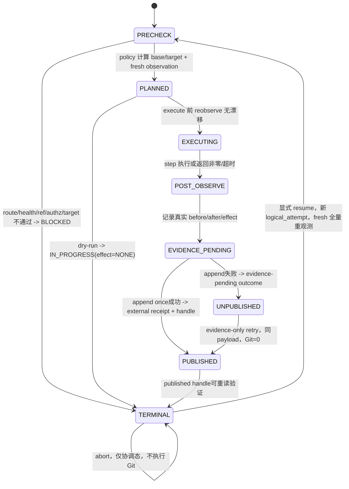

# LLD: ST-AW-003 — 执行 source-default 与 artifact-integration 异构 Git legs

## 修订记录

| 版本 | 日期 | 修订人 | 变更要点 |
|---|---|---|---|
| 1.0 | 2026-07-18 | meta-dev | 首版 full-lld；冻结 source-default / artifact-integration 模式矩阵、LegRequest/Plan/Attempt/Result、CR-050 applicability、typed authz、fresh proof、逐 leg 单写、resume/abort 与禁止跨 leg 回滚。 |
| 1.1 | 2026-07-18 | meta-dev-debugger | CP5 R2：关闭 CP5-QA-R1-F02/F03；消费 Lane B nested WorktreeObservation，拆分 immutable payload、external receipt与published handle，消除自引用。 |
| 1.2 | 2026-07-19 | Host Orchestrator（inline-fallback） | CP8 终验 design delta：增加共享 canonical target policy、integration containment proof 和 exact expected-OID scoped CAS cleanup，并补齐 4 个高优回归。 |

## 0. 上游工程依据

| 来源 | 路径 / ID | 被本 LLD 消费的内容 |
|---|---|---|
| CP3 HLD | `process/docs/design/CR051-ARTIFACT-WORKTREE-HLD.md` §6/9.3/9.4 | source 从/回 source default；artifact 从/回 project integration；两 leg 独立、结果后聚合 |
| CP3 ADR | `process/docs/design/CR051-ARTIFACT-WORKTREE-ARCHITECTURE-DECISION.md` / ADR-AW-003/004 | mode-specific target、CR-050 安全能力复用、artifact main 不参与 per-CR、aggregate 单写 |
| Domain Map | `process/docs/design/CR051-ARTIFACT-WORKTREE-DOMAIN-MAP.md` / OBJ-AW-06、RULE-AW-05 | `LegAttempt` / `LegResultPayload` correlation、base/target/OID/terminal/resume 边界 |
| Feature Matrix | `process/docs/design/CR051-FEATURE-DESIGN-MATRIX.md` / FEAT-AW-03 | required + full-lld；触碰 main、继承 paired-default 或跨 leg rollback 必须重开设计 |
| Feature DESIGN | `process/docs/features/cr051-legs/DESIGN.md` | 模式/目标矩阵、request/result 最小字段、调用契约、前检、恢复与 Gotchas |
| Feature TEST-PLAN | `process/docs/features/cr051-legs/TEST-PLAN.md` | TP-AW03-001..016、bare remote/command spy、P0/P1 hard gates |
| Feature TASKS | `process/docs/features/cr051-legs/TASKS.md` | TASK-AW-003-01..05、文件 owner、Dev/Verification gate |
| Story / CP4 | `process/stories/STORY-ST-AW-003-heterogeneous-git-legs.md`；`process/checks/CP4-CR051-STORY-DAG-PARALLEL-SAFETY.result.json` | AC、ST-AW-002 runtime dependency、与 ST-AW-004 contract peer、CLI merge owner |
| 上游 route 契约 | ST-AW-001 / FEAT-AW-01 | validated `ProjectArtifactConfig`、`RouteDecision`、owned target proof 与 config digest |
| 上游 worktree 契约 | Lane B R2 frozen port；`process/docs/features/cr051-worktree/DESIGN.md` | `WorktreeHealth(project_id, decision, observation, observation_digest, worktree/journal state, active operation, reasons)`；rich字段只在nested immutable `WorktreeObservation` |
| CP5 R1 findings | `process/docs/quality/CR051-CP5-INDEPENDENT-REVIEW-FINDINGS.md` / F02、F03 | 禁止复制第二套health schema；payload与append receipt/ref必须分离，published handle供aggregate重读验证 |
| 现有实现 | `meta_flow/workspace/git_sync.py`；`meta_flow/workflow/git_branch_lifecycle.py` | argv-only runner、ref/OID validation、fresh observation、typed authz、plan/result primitives 与 CR-050 paired semantics |

本 LLD 只把设计契约推进到 `ready-for-review`。它不执行 source、artifact、worktree、ref、remote、commit、push、publish、main-sync 或 sibling mutation；真实远端仍需独立 runtime authorization。

## 1. 目标（Goal）

创建`meta_flow/workflow/artifact_leg_lifecycle.py`，为同一逻辑CR独立规划、执行、恢复并验证source/artifact legs。Artifact只消费Lane B `WorktreeHealth.observation`；每条leg先生成写前digest可确定的immutable `LegResultPayload`，再由单写writer返回external receipt并组装不回写payload的`PublishedLegResultHandle`；artifact main/default、control/sibling和跨leg自动回滚mutation恒为0。

## 2. 需求（Functional / Non-Functional）

### 2.1 Functional

- F-01：`leg_kind=source` 仅允许 `mode=source-default`；base/target 均为 fresh source remote default，active branch 为 source CR branch。
- F-02：`leg_kind=artifact` 仅允许 `mode=shared-artifact-project-first`；base/target 均为 `refs/heads/projects/<project_id>/integration`，active branch 为 `refs/heads/projects/<project_id>/cr/<cr-id>-<slug>`。
- F-03：`LegRequest.base_ref/target_ref` 是调用方期望断言，不是自由 override；policy 必须重新计算并逐字段比对，任何 artifact main/default/control/sibling ref 立即 `BLOCKED(policy_target_forbidden)`，adapter 调用=0。
- F-04：所有非 dry-run mutation 必须绑定 typed `LegAuthorization`，至少覆盖 action、repo fingerprint、base/target ref、expected OID、operation/attempt/CR/project/leg/mode 与有效期；授权不得跨 leg/attempt/target 重用。
- F-05：每个 plan 和 resume 在 mutation 前 fresh observe route digest、current worktree health、base/target/CR refs 与 full 40-char OIDs；缺失、陈旧或漂移不执行 step。
- F-06：每个derived `single_write_key(operation_id, logical_attempt, cr_id, project_id, leg_kind)`只允许payload写一次；同key同digest幂等返回同receipt，不同digest冲突fail closed。
- F-07：`LegResultPayload.status`只允许`BLOCKED|FAIL|IN_PROGRESS|PASS`；PARTIAL只在progress/effect。Payload严禁包含自身result_ref、append/write receipt、writer/time/receipt digest。
- F-08：payload PASS只在required step receipts、fresh target/cleanup proof和forbidden mutation=0时成立；可聚合PASS还要求writer成功并形成可重读验证的PublishedLegResultHandle。命令退出码0或unpublished PASS payload均不能进入aggregate。
- F-09：source 与 artifact leg 可独立推进、独立失败、独立 resume/abort，禁止一条 leg 自动 reset/clean/stash/rebase/force/delete/回滚另一条 leg。
- F-10：本Feature不计算overall/投影；只向ST-AW-004暴露published-handle reader/validator与payload schema，不暴露executor。
- F-11：artifact leg只消费ST-AW-002 `WorktreeHealth`封装：必须HEALTHY、observation非空且digest match；rich字段只从`health.observation`读取，禁止平铺/复制；不反向触发worktree mutation。
- F-12：dry-run 可以在无 runtime authorization 下输出 exact argv、precondition、digest 与 evidence preview，但 local/remote mutation=0，且 dry-run 结果不可作为真实授权或 PASS result。

### 2.2 Non-Functional

- NF-01（目标正确性）：source/artifact 两类 required plan 的 base/target 正确率为 2/2；artifact main/default target、control checkout mutation、其他 sibling touched path 均为 0。
- NF-02（correlation/publication）：current attempt的source/artifact各1个matching published handle；raw/unpublished、stale/wrong/duplicate及receipt/ref/digest/key错配接受数为0。
- NF-03（输入安全）：traversal、option prefix、NUL/newline、shell 元字符、非法 ref/project 输入拒绝率 100%，额外命令执行数为 0；不通过 shell。
- NF-04（权限安全）：authorization action/repo/target/attempt/OID 任一错配的 mutation 前阻断率 100%；dry-run 和无授权真实执行严格区分。
- NF-05（freshness）：precheck 后 OID/HEAD/worktree health 漂移时 PASS 数为 0；resume 每次重新观察，不直接重放旧 plan。
- NF-06（证据可靠性）：payload digest写前可复算且不依赖receipt/ref；writer失败只返回unpublished/evidence-pending，不产生aggregate handle；evidence-only retry的Git重复执行数为0。
- NF-07（兼容）：CR-050 source/dedicated paired-default 行为回归通过；shared-artifact override 不改变 legacy 默认 policy。
- NF-08（观测）：错误/阻塞输出 stable code、bounded detail、before/expected/after OID、step、resume/abort route 与 evidence ref，不泄漏 token/credential/remote secret。

## 3. 模块拆分与职责

| 模块 / 文件组 | 职责 | 说明 |
|---|---|---|
| `artifact_leg_lifecycle.py` / domain | 定义request/plan/attempt、`LegResultPayload`、`LegResultWriteReceipt`、`PublishedLegResultHandle`、unpublished outcome与correlation | payload frozen+canonical；外置receipt/handle；不定义overall |
| `artifact_leg_lifecycle.py` / policy | 校验 kind/mode，计算 source default 或 project integration 的 base/target/active branch，生成 argv allowlist plan | 任何 artifact main/default 候选在 adapter 前 BLOCKED |
| `artifact_leg_lifecycle.py` / precheck | 消费route proof、Lane B WorktreeHealth封装、leg ref/OID observation、typed authz | artifact只读取health.observation；HEALTHY+non-null+digest match；无平行schema |
| `artifact_leg_lifecycle.py` / executor | 串行执行单 leg 的 allowlisted argv，step 后 fresh observe，保留真实 effect | 一次只执行一个 leg，不协调另一 leg |
| `artifact_leg_lifecycle.py` / publication | payload单写、external receipt、handle组装、重读validator与evidence-only recovery | append失败无handle；payload不回写；同digest幂等 |
| `git_sync.py` | 复用 `run_git`、`GitCommandResult`、`remote_ref_oid`、`repo_fingerprint` 等通用 adapter/probe | 默认只读复用；不得放 leg policy/state machine |
| `git_branch_lifecycle.py` | 复用 CR-050 validation/authz/fresh-proof 思路和 source legacy policy | 默认只读复用；不得改 paired-default 默认语义 |
| `test_artifact_leg_lifecycle.py` | target/authz/correlation/drift/partial/evidence/legacy/bare-remote 测试 | ST-AW-003 primary |
| `artifact_aggregate.py` / `cli.py` | 不属于本 Story | ST-AW-004 分别拥有 aggregate 与 CLI 接线；本 Story 禁止写 |

依赖方向：`orchestrator -> artifact_leg_lifecycle -> routing + WorktreeHealth(observation) + git/evidence adapters`；ST-AW-004只import payload/receipt/handle schema与reader/validator，绝不import executor。禁止复制WorktreeObservation、executor调用aggregate或result反向触发worktree。

## 4. 代码结构与文件影响范围

| 动作 | 文件路径 | 变更内容 |
|---|---|---|
| 创建 | `meta_flow/workflow/artifact_leg_lifecycle.py` | 新增异构 policy、schema、precheck、plan/executor、fresh proof、payload publisher/published validator、resume/abort 与 serialization |
| 创建 | `tests/test_artifact_leg_lifecycle.py` | 新增 TP-AW03-001..016 的 unit/contract/bare-remote/command-spy fixtures |
| 不修改（复用） | `meta_flow/workspace/git_sync.py` | 调用已存在 argv-only runner、fingerprint、remote OID probe；若能力缺失先提交 design delta/单写窗口，不在本 Story 默认修改 |
| 不修改（复用） | `meta_flow/workflow/git_branch_lifecycle.py` | 复用安全概念/validator，不改变 CR-050 paired-default 默认行为 |
| 不修改（外部 merge owner） | `meta_flow/cli.py` | ST-AW-004 统一接线；ST-AW-003 只提供可调用 API |

明确禁止修改或触碰：`meta_flow/workflow/artifact_aggregate.py`、artifact main/default refs、control checkout、其他 sibling project path/ref/index、`process/quant-lab/**`、凭据、production remote。实现若必须修改 shared 文件或 CLI，先停止并通过 Host 建立 design delta 和单写计划。

## 5. 数据模型与持久化设计

### 5.1 Correlation 与请求

| 对象 / 字段 | 类型 / 约束 | 说明 |
|---|---|---|
| `LegCorrelation` | `operation_id`, `logical_attempt`, `cr_id`, `project_id`, `leg_kind` | 五元组是 result currentness 与单写键；全部非空，attempt 为正整数 |
| `LegRequest.schema_version` | `1` | 未知 schema BLOCKED |
| `.operation` | `open|publish|complete|finish|resume|abort` | action 进入 authz/digest；`abort` 仅协调态 |
| `.leg_kind` | `source|artifact` | 与 mode 固定 1:1 |
| `.mode` | `source-default|shared-artifact-project-first` | 其他组合 `mode_mismatch` |
| `.base_ref/.target_ref` | full ref string | 是 policy 期望断言；不得自由覆盖计算结果 |
| `.expected_base_oid/.expected_target_oid` | full 40-char lowercase OID | mutation plan 必填；空值/短 SHA 阻断 |
| `.authorization_ref` | string | 非 dry-run mutation 必填；指向 typed payload |
| `.route_config_digest` / `.worktree_health_digest` | SHA-256 | artifact后者必须等于`health.observation_digest`；source route digest必填，worktree digest N/A |
| `.dry_run` | bool | true 时 plan/evidence only，mutation=0 |
| `.resume_from_attempt` | int/None | operation=resume 时必须等于上一 terminal/nonterminal attempt |

### 5.2 Policy、计划与观测

| 对象 / 字段 | 类型 / 约束 | 说明 |
|---|---|---|
| `LegTarget` | repo_root/fingerprint/remote/base_ref/target_ref/active_ref/mode | repo root 为 runtime noncanonical；refs 由 policy 计算 |
| `LegObservation` | leg repo/ref/HEAD/OIDs/observed_at/digest + optional worktree observation digest link | artifact不复制nested WorktreeObservation字段，只引用其digest；source包含source repo fingerprint |
| `LegAuthorization` | auth ID、correlation、action、mode、fingerprint、remote、base/target refs、expected OIDs、issued/expires/single_use | 不可跨 attempt/leg/target 使用；dry-run 可无 auth，但标记 not-authorized |
| `LegPlanStep` | step_id、phase、argv tuple、cwd role、before/expected OID、precondition、mutation_scope | argv 首项固定 `git`；无 shell string |
| `LegPlan` | schema、request/correlation、target、observation/auth digests、steps、dry_run、plan_digest | immutable；执行前需 fresh revalidate |
| `StepReceipt` | step_id、argv digest、returncode、before/expected/after OID、mutation/effect、started/completed、error | stdout/stderr bounded；不保存 secret env |

### 5.3 Attempt、immutable payload 与外置发布

| 对象 / 字段 | 类型 / 约束 | 说明 |
|---|---|---|
| `LegAttempt.phase` | `PRECHECK|PLANNED|EXECUTING|POST_OBSERVE|EVIDENCE_PENDING|TERMINAL` | attempt 内状态；非 overall |
| `LegResultPayload.status` | `BLOCKED|FAIL|IN_PROGRESS|PASS` | Git leg事实；不等于已发布/可聚合 |
| `.terminal` | bool | 当前 attempt 是否结束；`IN_PROGRESS` 必为 false，其他状态为 true |
| `.progress` | `NONE|PLANNED|STARTED|PARTIAL|COMPLETE` | `PARTIAL` 只在此表达进度 |
| `.effect` | `NONE|LOCAL_ONLY|REMOTE_PARTIAL|TARGET_UPDATED|UNKNOWN` | 保留真实副作用，不隐式回滚 |
| `.refs/oids` | base/target/active + expected/observed before/after | 所有 PASS proof 可复算 |
| `.step_receipts` | tuple | required steps 逐项 receipt，不复制外部完整日志 |
| `.blockers` | typed code/detail tuple | stable code + bounded message |
| `.resume_route/.abort_route` | stable enum/string | 不得包含 destructive recovery |
| `.fresh_observed_at` / `.payload_digest` | UTC timestamp + SHA-256 | canonical digest在writer前确定；timestamp不决定currentness |
| payload forbidden fields | result_ref、append/write receipt、writer_id、written_at、receipt_digest | 字段数必须为0，消除自引用/二次改写 |
| `LegResultWriteReceipt` | result_ref、payload_digest、writer_id、written_at、receipt_digest | external；receipt digest绑定derived key及前四字段且排除自身值 |
| `PublishedLegResultHandle` | payload或result_ref + payload_digest + receipt | runtime/evidence-index组合，不序列化回payload |
| `UnpublishedLegResultOutcome` | payload、writer error、`EVIDENCE_PENDING` recovery route | aggregate不可消费；evidence-only retry不重跑Git |

`LegResultPayload`不包含overall/projection、另一leg outcome或任何append-time字段。Writer按derived key只写payload一次：同key同digest返回同receipt；同key不同digest返回`result_conflict`。Published handle不持久化回payload。Validator从result_ref重读payload，重算payload/key/receipt digests并与expected correlation/mode逐项比对。

## 6. API / Interface 设计

| 接口 / 入口 | 输入 | 输出 | 调用方 | 失败 / 降级 |
|---|---|---|---|---|
| `build_leg_plan(..., worktree_health: WorktreeHealth | None, ...) -> LegPlan | LegPreparationOutcome` | request + frozen ports | plan或BLOCKED payload outcome | Host | artifact仅读取nested observation；health predicate任一失败runner=0 |
| `execute_leg(..., result_writer: LegResultWriter) -> LegExecutionOutcome` | plan + injected ports | published handle或unpublished outcome | Host | writer失败无PASS handle，不重跑mutation |
| `publish_leg_payload(single_write_key, payload, writer) -> PublishedLegResultHandle | UnpublishedLegResultOutcome` | byte-identical payload | external receipt+handle | execute/evidence-only retry | payload不回写；不同digest冲突 |
| `resume_leg(request, previous_handle_or_unpublished, ...) -> LegExecutionOutcome` | prior evidence + fresh ports | 新attempt或evidence-only publication | Host | evidence-only只调用writer；普通resume fresh replan |
| `abort_leg(..., result_writer) -> LegExecutionOutcome` | matching correlation | effect-preserving payload publication | Host | Git/cross-leg=0 |
| `validate_published_leg_result(handle, expected, *, reader) -> ValidatedPublishedLegResult` | handle + reader + expected | reread-validated payload | ST-AW-004 | raw/unpublished或ref/payload/receipt/key错配100%拒绝 |
| `payload_to_dict/from_dict` | immutable payload | canonical JSON | writer/reader | 禁止append-time字段；secret不序列化 |

Port contracts：

| Port | 调用方向 / 时机 | 输入 | 输出 | 同步/降级 |
|---|---|---|---|---|
| `RouteDecision/OwnedTargetProof` | ST-AW-001 → plan 前、每次 resume | project/mode/config digest/owned artifact repo target | unique project route proof | 缺失/陈旧/identity mismatch→BLOCKED，不自行重解路径 |
| `WorktreeHealth` | ST-AW-002→artifact plan/resume/finish前 | frozen wrapper | project/decision/nested observation/digest/journal/operation/reasons | 仅HEALTHY+non-null+digest match；rich字段只读observation；禁止平铺 |
| `GitRunner/LegObserver` | executor → `git_sync` adapter | allowlisted argv、cwd、timeout、full refs/OIDs | bounded command result + fresh observation | 非零/timeout/drift→FAIL/BLOCKED；禁止 shell |
| `LegResultWriter` | executor→evidence adapter | single-write key + immutable payload | external receipt | 失败返回unpublished；evidence-only resume |
| Published validator | ST-AW-004→本模块 | published handles + expected 2-leg correlation + reader | reread-validated payloads | raw/unpublished/receipt/ref/digest/key错配拒绝；不import executor |

第 10 节 TP-03-001/002/005/009/010/012/015 分别覆盖 plan、execute、drift、authz、validator 与 writer 接口。

## 7. 核心处理流程



1. 校验 request token、五元 correlation、kind/mode 固定组合和 attempt 单调性。
2. 校验route/proof。Artifact要求health=HEALTHY、observation非空且重算digest精确一致；rich identity/common-dir/HEAD/ref/OID/dirty/Git-op/registry/role只从`health.observation`读取。禁止读取平铺副本；其他sibling状态不参与。
3. policy 重新计算模式目标：source default 或 project integration；将 request base/target 当断言比较。任何 artifact main/default/control/sibling target 在 runner 前 BLOCKED。
4. 通过 injected observer fresh 查询 base/target/active refs 和 full OIDs；验证 route/health/observation/authorization correlation 与有效期。
5. 根据 operation 构造 allowlisted argv tuple 与 plan digest；dry-run 只返回 plan/evidence preview，mutation=0，status 不得 PASS。
6. execute 前再次 fresh observe。如果 OID/HEAD/health digest 漂移，生成 BLOCKED/FAIL result，不调用 mutation step。
7. 串行执行当前 leg 的 step；每步后 fresh observe并写 `StepReceipt`。命令结果与 post-proof共同决定当前 attempt 的真实 effect。
8. 构造immutable payload并在writer前计算canonical digest。调用`append(key,payload)`取得external receipt；组装handle但绝不回写payload。Writer失败返回unpublished/evidence-pending，即使payload PASS也不向aggregate暴露handle。
9. ST-AW-004只接收两个published handles，从result_ref重读payload并校验receipt/ref/payload/key/correlation后聚合；本模块不参与overall/projection。

## 8. 技术细节

### 8.1 Mode、branch 与 target 矩阵

| mode / leg | base ref | active CR ref | completion target | 禁止 ref / repo |
|---|---|---|---|---|
| `source-default` / source | fresh `refs/remotes/<remote>/<source-default>` 对应远端 full ref | `refs/heads/cr/<cr-id-lower>-<slug>` | source remote default full ref | artifact repo/namespace、陈旧 default OID |
| `shared-artifact-project-first` / artifact | `refs/heads/projects/<project_id>/integration` | `refs/heads/projects/<project_id>/cr/<cr-id-lower>-<slug>` | 同一 project integration | `main/master/default/trunk/develop`、control branch、其他 project namespace |

branch 生成仅接受 `[A-Za-z0-9._/-]+` 且不以 `-` 开头，并执行 `git check-ref-format --branch` 等价验证。artifact namespace 中 `project_id` 与 route proof 精确一致；`integration` 不是 main 的别名。无法取得 source default 或 project integration 的 fresh exact OID 时直接 BLOCKED。

### 8.2 CR-050 applicability table

| CR-050 能力 / 假设 | ST-AW-003 处理 | 理由 / 验证 |
|---|---|---|
| `run_git` argv-only + timeout + bounded typed result | 原样复用 | 禁止 shell；TP-AW03-011/安全 denylist |
| plain token、branch/ref、full OID validation | 原样复用或抽取同等 validator | unsafe input 100% 拒绝 |
| repo fingerprint、fresh remote OID、HEAD/dirty observation | 原样复用 | route/worktree/target correlation 与 drift proof |
| typed `OperationAuthorization` 思路 | 扩展为 `LegAuthorization` | 增加 operation_id/attempt/project/leg/mode/base/target；旧 auth 不可直接跨 leg |
| `PlanStep` / plan digest / bounded receipt | 适配为单 leg `LegPlanStep/LegPlan/StepReceipt` | digest 包含 mode/target/correlation；不携带 paired order |
| `RepositoryTarget` paired discovery、`REPOSITORY_ORDER` / `DESTRUCTIVE_ORDER` | 不复用 | artifact route 必须来自 ST-AW-001，不得按 workspace paired discovery 猜 repo |
| paired default `default_branch_override` | 必须由 mode policy 覆写 | source→source default；artifact→project integration；main plan hard BLOCKED |
| `_overall`、`PairedMergeProjection`、`paired_complete/finish/cr_close` | 禁止进入本模块 | overall 与 projection 仅 ST-AW-004 单写 |
| open/publish/merge/finish 的 fresh proof 与非破坏性 cleanup | 按 leg/target 适配 | target-specific exact OID；artifact cleanup 只证明 integration/CR branch，不读 main 为 target |
| reset/clean/stash/rebase/force/automatic conflict resolution | 继续禁止 | command spy denylist 必须 0 |
| 单 repo 成功可触发 paired 后续 | 明确拒绝 | 单 leg PASS 只是一条 immutable input，不能推进 overall |

若 target override 无法在不改变 `git_branch_lifecycle.py` legacy 默认行为的前提下实现，返回 Host `NEEDS_DESIGN_CLARIFICATION`；不得直接修改旧 paired policy。

### 8.3 Operation 与 argv allowlist

| operation | source leg allowlist | artifact leg allowlist | hard deny |
|---|---|---|---|
| `open` | fresh fetch/query；从 exact source-default OID 创建/验证 source CR branch；ordinary CR ref publish | artifact worktree 已由 ST-AW-002 证明 active-cr 后，只创建/验证 project-namespaced CR ref；base 必为 integration | 任何 main/default update；control/其他 sibling checkout |
| `publish` | exact committed local OID → source CR ref | exact committed local OID → project artifact CR ref | auto commit/stage；wildcard refspec；force |
| `complete` | exact published CR OID → source default（fast-forward + typed authz） | exact published artifact CR OID → project integration（fast-forward + typed authz） | artifact main/default；跨 repo/跨 leg update |
| `finish` | fresh completion proof 后清理 source CR ref/local branch，使用 recovery proof；不改工作内容 | fresh integration contains CR tip + ST-AW-002 verified idle/cleanup proof；只清理 artifact CR ref，不触碰 main | reset/clean/stash/rebase/force；未证明即 delete |
| `resume` | 重新观察后重新生成上述 operation plan | 同左；另需 fresh WorktreeHealth | 旧 argv 直接重放 |
| `abort` | 不执行 Git；记录真实 effect 和人工恢复入口 | 同左；不调用 worktree rollback | branch delete、reset、跨 leg rollback |

所有 remote update 使用 exact `<full-oid>:<full-ref>` refspec；不得使用 shell、glob、implicit HEAD 或 force/force-with-lease。具体 step 是否需要 fetch/switch/delete 取决于 operation，但必须受本表和 tests command-spy snapshot 双重约束。

### 8.4 状态、fresh proof 与幂等

- 同一单写 key 只允许一个 active writer。重复相同 request/plan digest 返回已有 IN_PROGRESS/terminal result；不同 digest 返回 `active_attempt_conflict` 或 `result_conflict`。
- Payload `PASS` predicate：terminal、progress COMPLETE、required step receipts、fresh target/cleanup proof和forbidden mutation=0；可聚合PASS另需published handle通过重读validator。
- 命令非零/timeout 且 post-observe确认未变更，可 `FAIL(effect=NONE)`；已发生部分 mutation或状态不确定时 `FAIL(progress=PARTIAL,effect=REMOTE_PARTIAL|UNKNOWN, blocker=recovery_required)`，保留现场。
- `BLOCKED` 用于 mutation 前的 identity/route/health/authz/policy/stale precondition 失败；`IN_PROGRESS` 只表示当前 attempt 尚未 terminal 或 dry-run plan preview，绝不被 aggregate 当 success。
- payload writer失败后保留byte-identical payload与single-write key；evidence-only retry只调用writer，不重跑Git，成功后才生成external receipt/handle。
- abort 只写一个新的 terminal coordination result，引用 previous result/effect；不逆向修改 source/artifact 事实。

### 8.5 稳定错误码

固定错误码另含`worktree_observation_missing`、`worktree_observation_digest_mismatch`、`result_unpublished`、`receipt_mismatch`、`result_ref_mismatch`、`single_write_key_mismatch`；其余沿用R1。错误明细bounded并脱敏。

## 9. 安全与性能设计

| 维度 | 设计措施 | 验证方式 |
|---|---|---|
| 输入 / Prompt 注入式命令风险 | allowlist token/ref/OID；argv tuple；禁止 shell/string interpolation、option prefix、CR/LF/NUL/metachar | TP-AW03 unsafe matrix；额外 command=0 |
| Target 权限 | policy 重新计算 target，request 只作断言；authz 绑定 action/repo/target/OID/attempt；artifact main hard deny | TP-AW03-002/003/010/014；adapter spy=0 |
| Worktree / sibling 隔离 | 只消费frozen health.observation；HEALTHY+non-null+digest match；平行schema=0；sibling读写=0 | F02 nested-port fixtures + sentinel |
| 副作用控制 | dry-run mutation=0；precheck 全通过才 runner；不 reset/clean/stash/rebase/force/cross-leg rollback | command-spy denylist + before/after ref/OID |
| Evidence / correlation | payload prewrite digest、external receipt、published handle重读、five-key single write；无自引用 | TP-AW03-005/012/015/017..020 |
| 性能 | 每 step bounded timeout；每次 plan/execute 只观察单 repo/单 leg；无全 workspace/sibling scan | runner call count/timeout fixture；不设跨网络硬时延 SLA |
| Secret hygiene | authz 仅持有 ref ID/typed fields；result 不序列化 token/env；bounded stderr | payload scan + error snapshot |

## 10. 测试设计

| 测试 ID | 测试场景 / 接口 | 前置条件 | 操作 | 预期结果 | 验证方式 |
|---|---|---|---|---|---|
| TP-03-001 | source plan / `build_leg_plan` | fresh source default OID | 生成 open/publish/complete/finish dry-run | base/target=source default；exact argv/ref/OID | 对应 TP-AW03-001 snapshot |
| TP-03-002 | artifact plan | PASS route/proof + fresh active/idle health | 生成各 operation plan | base/target=project integration；active=project CR branch | TP-AW03-002 |
| TP-03-003 | artifact main/default 候选 | request/assertion 或 policy 输出含 protected ref | plan | BLOCKED `policy_target_forbidden`；runner=0 | TP-AW03-003/014 |
| TP-03-004 | CR-050 applicability | legacy source/dedicated fixture + shared-artifact fixture | 对比 policy/argv/results | legacy 默认无回归；shared target override；paired overall API 不可达 | TP-AW03-004/016 |
| TP-03-005 | 两 leg 均完成 | 同 operation/attempt 的 source/artifact 独立 fixture | 分别 execute | 各 1 个 matching fresh PASS result；overall/projection 写=0 | TP-AW03-005 |
| TP-03-006 | source PASS + artifact FAIL | artifact remote policy reject | 分别 execute | 两个真实 result 保留；artifact progress/effect 可 PARTIAL；cross-leg rollback/close=0 | TP-AW03-006 |
| TP-03-007 | current artifact worktree dirty/staged/untracked/Git-op | fresh non-PASS health | plan/resume | artifact BLOCKED；Git mutation=0 | TP-AW03-007 |
| TP-03-008 | 其他 sibling dirty | 当前 health PASS、另项目 sentinel dirty | plan/execute current leg | 当前项目可继续；sibling read/write/touched path=0 | TP-AW03-008 |
| TP-03-009 | precheck 后 OID/HEAD/health drift | hook 在 execute 前推进 ref 或改变 health digest | `execute_leg` | step 不执行或 FAIL/BLOCKED；PASS=0 | TP-AW03-009 |
| TP-03-010 | authz 逐字段错绑 | action/repo/fingerprint/target/attempt/OID/expiry 各错一项 | plan/execute | 100% BLOCKED(authz)；mutation=0 | TP-AW03-010 |
| TP-03-011 | dry-run 安全 | 无 runtime authz | 全 operation plan | exact argv/evidence preview；local/remote mutation=0；status!=PASS | TP-AW03-011 |
| TP-03-012 | published validator / correlation | stale attempt、错 CR/project/leg/mode、重复冲突、payload/receipt checksum错 | `validate_published_leg_result` | 100%拒绝；Git/executor调用=0 | TP-AW03-012 |
| TP-03-013 | 命令成功但 post-proof 不确定 | runner=0，observer timeout/mismatch | execute | FAIL/BLOCKED `recovery_required`；保留现场；无自动 reset | TP-AW03-013 |
| TP-03-014 | artifact finish cleanup proof | integration contains exact CR tip、health verified | finish | 只针对 integration/CR refs；main 不作为 target/proof | TP-AW03-014 |
| TP-03-015 | payload publish 失败 / `LegResultWriter` | Git step effect 已观察且 payload digest 已确定 | writer 返回失败；再 evidence-only resume | 首次只有 `UnpublishedLegResultOutcome` 且 aggregate handle=0；第二次 byte-identical payload、Git=0，返回 external receipt/handle | TP-AW03-015/017..019 |
| TP-03-016 | unsafe input/command denylist | traversal、`-x`、CR/LF、NUL、shell metachar、short OID | plan | 100% typed reject；额外命令=0；deny command=0 | Story AC + security matrix |
| TP-03-017 | single-writer race | 同 key 同/不同 payload digest 并发两请求 | writer/plan | 同 digest 幂等返回同 external receipt；不同 digest BLOCKED；payload append 恰好 1 | concurrency fixture |
| TP-03-018 | abort/resume | prior PARTIAL/FAIL/IN_PROGRESS | abort 与 fresh resume | abort Git=0；resume 重观察、不重放；cross-leg call=0 | state-transition fixture |
| TP-03-019 | Lane B frozen health port | `WorktreeHealth` 各 decision/null/digest/unknown 组合 | artifact precheck | 仅 HEALTHY + observation非空 + recomputed digest精确匹配可继续；flat copied field读取数=0 | TP-AW03-020 |
| TP-03-020 | payload schema / prewrite digest | terminal leg facts 已确定 | writer前 canonicalize | forbidden append-time/self-ref字段=0；相同事实 digest 稳定；writer/时钟不参与 digest | TP-AW03-017 |
| TP-03-021 | receipt/handle rere读验证 | valid payload+receipt、逐字段 tamper fixture | publish/validate | valid 通过；ref/digest/key/receipt tamper 100%拒绝；writer失败 handle=0，evidence-only retry Git=0 | TP-AW03-018/019 |

Fixture 使用两个隔离 bare remotes、source/artifact working repo、当前 project integration worktree与额外 dirty sibling checkout。command spy 记录 argv/cwd/call count；明确断言不存在 `reset --hard`、`clean`、`stash`、rebase、force、artifact main update/delete、跨 leg rollback。P0/P1 自动化执行率与 P0 通过率均须 100%；安全不变量失败只能 `NEEDS_REWORK`，不得 PASS_WITH_RISK。

实现后验证命令固定为：

```bash
PYTHONDONTWRITEBYTECODE=1 PYTEST_ADDOPTS='-p no:cacheprovider' uv run --python 3.11 pytest -q tests/test_artifact_leg_lifecycle.py tests/test_git_branch_lifecycle.py tests/test_workspace_git_sync.py
```

CP6/CP7 默认仅允许临时 bare remote；真实托管 remote/branch protection/credential 场景未获授权，只记录 `real-remote-unverified` 剩余风险。

## 11. 实施步骤

| TASK-ID | 动作 | 目标文件 | 详细描述 | 对应测试 |
|---|---|---|---|---|
| TASK-AW-003-01 | 创建 | `meta_flow/workflow/artifact_leg_lifecycle.py` | 定义 domain schema、mode/target policy、stable errors、CR-050 applicability、immutable payload、external receipt、published handle及重读 validator | TP-03-001..004/012/016/019..021 |
| TASK-AW-003-02 | 修改 | `meta_flow/workflow/artifact_leg_lifecycle.py` | 实现 source-default precheck/plan/executor，复用 argv-only/ref/OID/fresh/authz contract | TP-03-001/005/009..011/016 |
| TASK-AW-003-03 | 修改 | `meta_flow/workflow/artifact_leg_lifecycle.py` | 实现 artifact-integration precheck/plan/executor，消费 route/worktree proof，hard deny main/control/sibling | TP-03-002/003/005/007/008/014 |
| TASK-AW-003-04 | 修改 | `meta_flow/workflow/artifact_leg_lifecycle.py` | 实现 per-key single writer、external receipt/handle、StepReceipt、resume/abort、evidence-only recovery、fresh drift 与 no-cross-leg-rollback | TP-03-006/009/012/013/015/017..021 |
| TASK-AW-003-05 | 创建 | `tests/test_artifact_leg_lifecycle.py` | 建立 bare-remote、command-spy、authz、nested health、correlation、publication tamper、evidence failure 与 legacy regression fixtures | TP-03-001..021 |

TASK-AW-003-02 与 -03 仅在 -01 schema/policy 冻结后可在同一 owner 内分切片实现；-04 等待两 executor；-05 收敛全量验证。`git_sync.py` / `git_branch_lifecycle.py` 默认不修改，`meta_flow/cli.py` 由 ST-AW-004 单写。开发 Entry 仍等待全量 CP5 approve、ST-AW-002 verified 或批准等价 fixture、`LegResultPayload → external receipt → PublishedLegResultHandle` 与 ST-AW-004 同批冻结、文件冲突检查通过。

## 12. 风险、难点与预研建议

### 12.1 实现灰区与取舍记录

| Clarification ID | 问题 | 选项与推荐 | 决策 / 答案 | 影响面 | 证据 | 重访条件 |
|---|---|---|---|---|---|---|
| N/A | CR-050 paired policy 与 CR-051 异构 target 是否需要新人工取舍 | 推荐保留安全 primitives、在新模块显式 override target 并移除 paired projection；备选为回 CP3 设计独立 adapter | CP3/Feature 已批准推荐方案；capsule queue=`clear`、blocking_items=0 | target policy / authz / result / legacy regression | ADR-AW-003/004；FEAT-AW-03 DESIGN；CP5 capsule | 无法在不修改 legacy 默认行为下 override target，或必须把 overall/CLI/worktree mutation放进本模块时重访 |

| 风险 / 难点 | 影响 | 缓解措施 / 预研建议 |
|---|---|---|
| 误继承 CR-050 paired-default target | artifact main 被 CR 更新 | mode policy + request assertion + protected-ref hard gate + target snapshot |
| 单 leg PASS 被当 overall | 错误推进/关闭 CR | `LegResultPayload` 无 overall 字段；raw/unpublished payload 不可聚合；aggregate 只在 ST-AW-004 |
| current/sibling health 范围混淆 | 误阻断或跨项目污染 | 只消费 `WorktreeHealth.observation`；复算 nested observation digest；独立 sibling sentinel fixture |
| execute effect 已发生但 payload write 失败 | 重试导致重复 mutation | 写前 payload digest + step receipts；evidence-only retry 只调 writer，不重跑 Git |
| precheck 后 OID/HEAD 漂移 | stale authorization/错误 target | execute 前和每个 destructive step 前 fresh observe；漂移立即非 PASS |
| shared helper 能力不足 | 诱发并发改 shared 模块/legacy 漂移 | 默认只读复用；需要修改先 design delta + Host 单写窗口 + legacy regression |
| 真实 remote policy/网络未验证 | 本地 PASS 不代表托管平台完全可用 | 作为 `real-remote-unverified` 剩余风险；另需 runtime authorization，不降低 hard contract gate |

### OPEN / Spike 跟踪

| ID | 类型（OPEN / Spike） | 问题 | 下一动作 | 责任方 |
|---|---|---|---|---|
| N/A | N/A | 无阻断 OPEN / Spike；真实 remote pilot 是后置授权验证，不改变当前设计 | CP5 approve 后在临时 bare remote 实现/验证；真实 pilot 另行授权 | host-orchestrator / meta-dev / meta-qa |

### 12.2 设计偏离机制

出现以下任一情况必须停止并交还 Host：artifact target/base/proof 涉及 main/default；继承 paired-default/paired overall；跨 leg 自动 rollback/close；payload 增加自身 `result_ref`、append/write receipt、receipt digest、writer id或written_at；复制/扁平化第二套 health rich schema；从 result 反向触发 worktree mutation；ST-AW-003 修改 `artifact_aggregate.py`/CLI/其他 sibling；必须改变 CR-050 legacy 默认行为；真实 remote/write 未获授权。需长期 Feature/HLD/ADR 变更时先生成 design delta，不能以风险接受继续。

## 13. 回滚与发布策略

- 发布方式：随 CR-051 以新模块和定向测试发布；初始不接 CLI，ST-AW-004 在自己的单写窗口完成 facade。共享 `git_sync.py` / CR-050 lifecycle 默认不改，降低回归面。
- 启用顺序：CP5 全量人工确认 → ST-AW-001 contract frozen → ST-AW-002 verified/批准 fixture → 新模块 unit/bare-remote 验证 → ST-AW-004 aggregate/CLI 接线 → CP6/CP7。任何阶段都不自动启用真实 remote。
- 回滚触发条件：artifact main/default plan 非 0；wrong/stale result 被接受；single leg 能推进 overall；evidence failure 重复 Git；legacy CR-050 回归；control/其他 sibling touched path 非 0。
- 回滚动作：移除 ST-AW-004 对新 API 的接线并禁用 shared-artifact mode；保留 legacy source/dedicated CR-050 行为；不自动 reset/delete/rewrite 已发生 ref，真实 PARTIAL effect 进入人工恢复入口。
- 数据/证据：不删除已有 `LegResultPayload`、external receipt或StepReceipt；以新 attempt 追加修复证据，保留旧事实。禁止回写旧 payload 或把 handle/receipt 嵌回 payload 伪造全成功。
- 真实副作用回退：没有通用自动回滚。任何远端 effect 只在独立 fresh observation、typed authorization 和操作级恢复计划下处理；本 Story 的 abort 不执行 Git。

## 14. Definition of Done（DoD）

- [ ] 0..14 全部章节、修订记录、CR-050 applicability、风险/Gotchas 与人工确认区完整，`meta-flow story lld-check --evidence-type full-lld` PASS。
- [ ] source-default/source 与 shared-artifact-project-first/artifact 的 base/target 正确率 2/2；artifact main/default plan、control/其他 sibling mutation 均为 0。
- [ ] `LegRequest/Target/Observation/Authorization/Plan/StepReceipt/Attempt/Result/Correlation` 字段、状态、digest、owner 与 failure route 全部实现并测试。
- [ ] `LegResultPayload.status` 只有 BLOCKED/FAIL/IN_PROGRESS/PASS；PARTIAL 只在 progress/effect；payload 不含 overall/projection/close 写权，也不含自身 result_ref、receipt、writer/time 字段。
- [ ] 每 logical attempt 恰有 source/artifact 各 1 个 matching result；五元 correlation 100% 覆盖，stale/wrong/duplicate-conflict 接受数为 0。
- [ ] current dirty/identity/ownership/OID/authz mismatch 在 mutation 前 100% 阻断；其他 sibling dirty 误阻断=0、读写=0。
- [ ] unsafe input 100% 拒绝，额外命令=0；dry-run local/remote mutation=0；reset/clean/stash/rebase/force/main-sync/cross-leg rollback=0。
- [ ] command exit 0 但 fresh post-proof 不成立时 payload PASS=0；writer失败时 published PASS handle=0，且 evidence-only retry 重复 Git=0。
- [ ] artifact leg 对 health rich fields 的读取 100% 来自 `health.observation`；HEALTHY + observation非空 + digest精确匹配的授权率为100%，其余组合 mutation=0。
- [ ] validator 从 result_ref 重读 payload；payload/ref/receipt/digest/single-write-key 任一错配接受数=0，raw/unpublished payload 接受数=0。
- [ ] TP-AW03-001..016、TC-AW-005..010/012/014、REQ-AW-008..011/013/016/C003..C004/NF003..NF005 适用追踪覆盖率 100%。
- [ ] `git_sync.py` / `git_branch_lifecycle.py` legacy regression 通过；ST-AW-003 对 CLI/aggregate/shared 默认文件修改=0，除非有已批准 design delta/单写窗口。
- [ ] 无 blocking clarification/OPEN/Spike；触发 §12.2 时改为 `needs-design-clarification`，不得进入实现。
- [ ] frontmatter 保持 `confirmed=false`；ST-AW-002 runtime dependency 尚未 verified 时 `dependencies_satisfied=false`，即使本 CP5 可实现性 PASS 也不得开发。

## 15. CP8 终验 design delta

### 15.1 Canonical target policy

source/artifact 的 mode、base/target 和 active ref 由无 Git 依赖的 `meta_flow/workflow/artifact_policy.py` 统一定义。leg producer 只能产生 canonical plan；aggregate consumer 必须对重读 payload 独立重算并验证。合法模式固定为 `source-default` 与 `shared-artifact-project-first`。

### 15.2 Artifact finish / cleanup

artifact finish 先 fresh observe integration target 与 active CR ref。只有 `target_oid == active_oid` 时，才证明 integration 已包含当前 CR tip并允许清理；否则返回 `cleanup_containment_unproven`，mutation=0。

清理命令严格限定为：

```text
git push --force-with-lease=<canonical-active-ref>:<fresh-active-oid> origin :<canonical-active-ref>
```

这是 finish step、canonical active ref 和 exact expected OID 三重绑定的 CAS delete，不是一般 force 授权。main/default、通配符、错 ref/OID、非空 source、普通 force 及 reset/clean/stash/rebase 继续 hard deny。

### 15.3 验证闭环

`TP-AW03-004/006/008/014` 已分别覆盖 CR-050 paired/default compatibility、source/artifact 独立失败且 cross-leg rollback=0、dirty sibling 不读取/不触碰、integration containment + exact CAS cleanup + main target/read=0。本 delta 由 `process/design-deltas/ST-AW-003.delta.json` 跟踪并回写 Feature DESIGN 1.2。

## 人工确认区

> **CP5 — Story 设计证据可实现性门**
>
> 本 LLD 的单 Story 自动预检写入 `process/checks/CP5-CR051-ST-AW-003-LLD-IMPLEMENTABILITY.result.json` 及其 summary。Host Orchestrator 收齐 CR-051 全部设计证据、CP4 摘要与单 Story结果后统一发起批次人工确认；本文件不单独授权源码或真实 Git mutation。

**CP5 checklist 摘要**：

| # | 检查项 | 状态 | 证据 |
|---|---|---|---|
| 1 | LLD 覆盖量化 AC 与 hard invariants | 已自检 | §2 / §10 / §14 |
| 2 | 与 HLD / ADR / Feature DESIGN 一致 | 已自检 | §0 / §8 / §12 |
| 3 | 文件、schema、接口、流程和失败路径明确 | 已自检 | §3..§9 |
| 4 | CR-050 复用/覆写/禁止边界清晰 | 已自检 | §8.2 / §10 |
| 5 | 测试、TASK-ID 与 dev_gate 可计算 | 已自检 | §10 / §11 / §14 |
| 6 | clarification queue 收敛、实现仍阻断 | 已自检 | §12.1；`blocking_items=0`；`confirmed=false` |

**人工审查结果回填**：

- 结论：`pending`
- 审查人：
- 审查时间：
- 修改意见：
- 风险接受项：`real-remote-unverified` 仅作为后置验证缺口；不得豁免 target/authz/correlation/mutation hard gates
