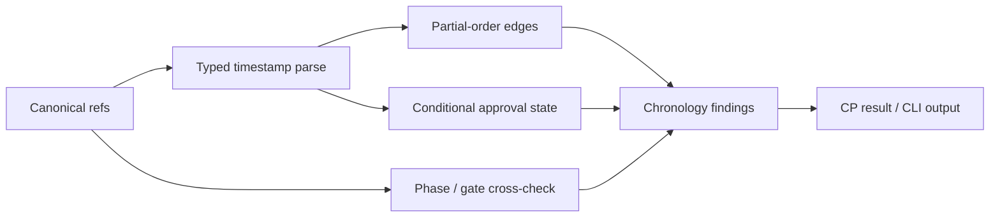

# LLD: ST-EI-001 — 机器校验 gate 时序与条件式批准

## 修订记录

| 版本 | 日期 | 修订人 | 变更要点 |
|---|---|---|---|
| 1.0 | 2026-07-12 | meta-dev | 首版完整 0..14 LLD，冻结 chronology、条件式批准和 phase/gate 分离。 |
| 1.1 | 2026-07-12 | meta-dev | CP5 R2：将既有实质章节显式对齐 checker 的“工程依据/需求/技术细节/DoD”语义标签，不改变设计边界。 |

## 0. 工程依据与上游设计依据

本 Story 的工程依据不是抽象流程描述，而是现有 `state_transition.py`、CP result、gate ledger 与 state 之间已经存在却未被统一机器校验的因果约束。实现必须在既有 canonical evidence 上建立只读偏序检查，不得创建平行时间线。

| 来源 | 路径 / ID | 被本 LLD 消费的内容 |
|---|---|---|
| Story | `process/stories/STORY-ST-EI-001-gate-chronology.md` | AC、文件所有权、禁止范围、W1/QW1 门控 |
| HLD | `CR046-EVIDENCE-INTEGRITY-HLD.md` | typed evidence、phase-in-progress/gate-open 分离、11 个模拟 |
| ADR | `CR046-EI-ADR-001/002/003` | canonical truth、typed identity、条件式批准状态机 |
| Feature Matrix | `CR046-FEATURE-DESIGN-MATRIX.md` | `full-lld` 与证据路径 |
| Feature DESIGN | `cr046-core/DESIGN.md` | chronology 先于 correlation，结构化 finding，不建第二真相源 |
| Feature TEST-PLAN/TASKS | `cr046-core/{TEST-PLAN,TASKS}.md` | CT-CORE-01、TASK-EI-001-01 |

## 1. Goal

修改 gate/state-transition 检查，使合法 chronology 和条件式批准可重放，所有非法因果顺序以结构化 finding 100% 拒绝，并明确区分阶段工作进行中与正式人工门已打开。

## 2. 需求（Functional / Non-Functional）

### 2.1 Functional

- 将 `producer_agent_completed_at <= checkpoint_created_at <= gate_opened_at <= reviewed_at <= approval_event_at <= downstream_dispatch_at` 建模为可选节点的偏序；不存在的可选节点不补造时间。
- 条件式批准必须按 `conditional_approval_received -> conditions_satisfied -> human_gate_approval` 表达；前两项不能单独满足最终批准。
- `phase-in-progress` 允许设计/实现工作存在，但 `gate-open=false` 时禁止记录正式 review/approval。
- 输出稳定错误码、对象/字段/ref、实际与期望顺序；历史 canonical ledger/result/state 只读。
- 保持合法历史记录 current replay；无 timezone 或无法解析的时间为 strict finding，不按字符串猜测。

### 2.2 Non-Functional

- CT-CORE-01 非法 fixture 拒绝率和合法 fixture 接受率均为 100%。
- 同一输入、policy、schema 的 finding 排序和序列化确定性为 100%。
- 检查仅线性扫描相关事件，时间复杂度 `O(n)`、额外空间 `O(n)`。
- 不访问凭据、runtime、quant-lab 业务源码，不修改 archive，不 commit/push。

## 3. 模块拆分与职责

| 模块 / 文件组 | 职责 | 说明 |
|---|---|---|
| `meta_flow/checks/state_transition.py` | 规范化 chronology node，执行偏序与 gate-state 校验 | primary owner；保留既有 route transition 检查 |
| `meta_flow/checks/cp_result.py` | 提供 result/checkpoint refs 给 chronology checker | shared；只添加调用接口，最终合并由 ST-EI-003 |
| `meta_flow/cli.py` | 暴露现有 `check state-transition` 的结构化输出选项 | shared；不新增平行 CLI family |
| `tests/test_state_transition.py` | 正向、负向、边界与回归 fixture | primary owner |

## 4. 代码结构与文件影响范围

| 动作 | 文件路径 | 变更内容 |
|---|---|---|
| 修改 | `meta_flow/checks/state_transition.py` | 增加 `ChronologyNode`、条件式批准状态归一化、偏序规则与 finding |
| 修改 | `tests/test_state_transition.py` | 增加合法/非法 chronology、条件式批准、phase/gate 分离与 timezone fixture |
| 修改 | `meta_flow/checks/cp_result.py` | 以只读 refs 调用共享 chronology 校验；不实现 final-attempt 逻辑 |
| 修改 | `meta_flow/cli.py` | 将 finding 以人类文本/JSON 等价输出；命令兼容 |

不创建第二份 gate ledger、状态文件或时间线数据库；不删除或原位修正历史事件。

## 5. 数据模型与持久化设计

| 对象 / 字段 | 类型 | 约束 | 说明 |
|---|---|---|---|
| `ChronologyNode.kind` | enum | producer-complete/checkpoint-created/gate-opened/conditional-received/conditions-satisfied/reviewed/approved/downstream-dispatch | typed namespace |
| `ChronologyNode.occurred_at` | aware datetime | RFC3339；必须含时区 | 解析失败为 finding |
| `ChronologyNode.source_ref` | string | 非空、project-relative 或 ledger row identity | 回链 canonical evidence |
| `ChronologyFinding.code` | enum | `TEMPORAL_ORDER_VIOLATION`, `UNPARSEABLE_TIMESTAMP`, `APPROVAL_BEFORE_GATE`, `CONDITIONS_UNSATISFIED`, `PHASE_GATE_CONFLATION` | 稳定机器码 |
| `GateDecisionState` | enum | pending/conditional/conditions-satisfied/approved/changes-requested/rejected | approved 只能由完整路径进入 |

无新增持久化真相源；finding 是一次检查的派生输出，由调用方写入 CP result/provenance。

## 6. API / Interface 设计

| 接口 / 入口 | 输入 | 输出 | 调用方 | 说明 |
|---|---|---|---|---|
| `validate_chronology(nodes, *, route_plan=None)` | typed nodes、可选 route plan | `list[ChronologyFinding]` | state-transition、CP result checker | 空列表即 chronology 合法 |
| `derive_gate_decision(events)` | gate events | `GateDecisionState` + findings | state-transition checker | 条件式指令不直接变 approved |
| `validate_phase_gate_state(state, gate_events)` | current state、gate events | findings | state check/current replay | phase 工作态与 gate open 分离 |
| `meta-flow check state-transition ...` | 既有参数 + 可选 `--output json` | exit code + deterministic findings | Host/CI | strict finding 时非零 |

所有接口分别由 TC-001-API、TC-001-COND、TC-001-PHASE、TC-001-CLI 覆盖。

## 7. 核心处理流程

1. 从 canonical result/checkpoint/gate/dispatch/state 读取 refs，不写回输入。
2. 按 typed kind 解析 RFC3339 时间；解析失败立即增加 finding，但继续收集其他独立问题。
3. 根据存在节点构造允许的偏序边；对每条边比较 aware datetime。
4. 独立计算条件式批准状态，只有 conditions-satisfied 后的 final approval 才为 approved。
5. 对照 phase/pending_gate/gate latest decision，识别 phase/gate conflation。
6. 按 `(code, object_ref, field)` 稳定排序并返回。

## 8. 技术细节与设计细节

- 关键算法 / 规则：使用显式 `PRECEDENCE_EDGES`，不依赖事件文件物理行顺序；相等时间允许，仅逆序拒绝。
- 缺少可选事件：不补造；但 `approved` 缺 gate-open、条件式批准缺 conditions-satisfied 分别报专用 finding。
- 多次 attempt：本 Story 校验单 attempt 内 chronology；最终 attempt 选择由 ST-EI-003 负责。
- 兼容性处理：旧记录缺新条件字段时若未声明 conditional，按普通批准检查；明确 conditional 却缺满足事件则 fail-closed。
- 图示类型选择：流程图，因输入跨 result/gate/state/dispatch 四类消费者。

## 9. 安全与性能设计

| 维度 | 设计措施 | 验证方式 |
|---|---|---|
| 安全 | 路径仅消费调用方给定 project root 内 canonical refs；不跟随到 forbidden roots | path traversal/symlink negative fixture |
| 审计 | finding 保留 code/object/field/source refs 和 checker provenance | golden JSON snapshot |
| 性能 | 单次归一化并用字典索引 kind；避免全局笛卡尔比较 | 10k event characterization，确认线性增长；不作为 SLA |

## 10. 测试设计

| 测试场景 | 前置条件 | 操作 | 预期结果 | 验证方式 |
|---|---|---|---|---|
| TC-001-API 合法完整顺序 | 6 个 aware timestamps | 调 `validate_chronology` | 0 finding | unit |
| CT-CORE-01 非法倒序矩阵 | 每条 precedence edge 各逆序 1 次 | 逐 fixture 校验 | 100% `TEMPORAL_ORDER_VIOLATION` | parameterized unit |
| TC-001-COND 条件式批准 | conditional→conditions→approval | derive | approved | unit |
| TC-001-COND-NEG 缺 conditions | conditional→approval | derive | `CONDITIONS_UNSATISFIED`，非 approved | negative fixture |
| TC-001-PHASE 工作中未开门 | phase=solution-design, gate absent | cross-check | 合法 in-progress | integration |
| TC-001-PHASE-NEG 未开门已审批 | gate absent, approval present | cross-check | reject | integration |
| TC-001-TZ 无时区/坏时间 | malformed timestamp | parse | stable finding，禁止字符串比较 | unit |
| TC-001-CLI JSON 输出 | 合法/非法各一 | `uv run meta-flow check state-transition ...` | exit 0/非0，JSON 稳定 | CLI test |
| TC-001-REG 既有路由 | 现有 test fixtures | 全量相关测试 | 无回归 | pytest |

## 11. 实施步骤

| TASK-ID | 动作 | 目标文件 | 详细描述 | 对应测试 |
|---|---|---|---|---|
| TASK-EI-001-01A | 修改 | `meta_flow/checks/state_transition.py` | 建 typed node/finding、偏序边、条件式批准和 phase/gate 规则 | TC-001-API/COND/PHASE/TZ |
| TASK-EI-001-01B | 修改 | `tests/test_state_transition.py` | 建 CT-CORE-01 正负矩阵与 CLI/回归 fixture | CT-CORE-01/TC-001-CLI/REG |
| TASK-EI-001-01C | 修改 | `meta_flow/checks/cp_result.py`, `meta_flow/cli.py` | 接入只读 refs 与兼容输出；遵守 ST-EI-003 merge ownership | TC-001-CLI/REG |

## 12. 风险、难点与预研建议

### 12.1 实现灰区与取舍记录

| Clarification ID | 问题 | 选项与推荐 | 决策 / 答案 | 影响面 | 证据 | 重访条件 |
|---|---|---|---|---|---|---|
| N/A | 无阻断实现灰区 | 使用 accepted ADR 显式偏序和条件状态机 | 已收敛 | 接口/测试 | ADR-003、CT-CORE-01 | 上游 ADR 变更时 |

| 风险 / 难点 | 影响 | 缓解措施 / 预研建议 |
|---|---|---|
| 旧事件缺某些 timestamp | 误把未知判合法或非法 | 区分 optional missing 与 state-required missing；专用 finding |
| 文件顺序被当因果顺序 | compaction/rewrite 后误判 | 只按 typed timestamp/identity，不按行号 |
| shared 文件并行冲突 | 覆盖 ST-EI-003 修改 | 仅提交最小接口 diff，由 merge owner 串行合并 |

### OPEN / Spike 跟踪

无 OPEN / Spike。

## 13. 回滚与发布策略

- 发布方式：先以 audit mode 输出 finding；golden/回归通过后由后续治理 Story 决定 enforce，不原位修改历史。
- 回滚触发条件：合法 fixture 被拒绝、既有 state-transition 回归、finding 非确定或性能显著非线性。
- 回滚动作：撤回调用接线并保留 fixture/typed schema；enforce 降回 audit，canonical evidence 不变。

## 14. DoD（Definition of Done）

- [ ] 0–14 章节完整，`open_items=0`。
- [ ] CT-CORE-01 非法拒绝率、合法接受率均为 100%。
- [ ] 条件式批准和 phase-in-progress/gate-open 两条独立状态路径有正负 fixture。
- [ ] 四个接口均有第 10 节对应测试，TASK 与文件影响双向覆盖。
- [ ] finding 含稳定 code/object/field/source ref，输入不被修改。
- [ ] `uv run pytest tests/test_state_transition.py` 及相关回归通过。
- [ ] forbidden 写入/运行/commit/push 数为 0。
- [ ] `confirmed=false` 且 CP5 未批准前不进入实现。

## 人工确认区

> CP5 全量 Story 设计证据统一确认；本文件当前仅 `ready-for-review`。

- 结论：`pending`
- 审查人：
- 审查时间：
- 修改意见：
- 风险接受项：
