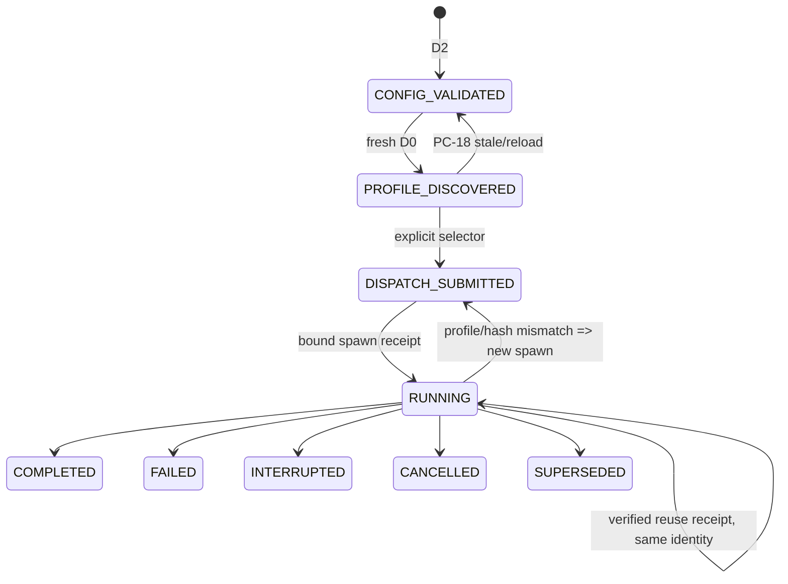

# LLD: ST-EI-002 — 建立 dispatch attempt 与 custom-agent 平台证明链

## 修订记录

| 版本 | 日期 | 修订人 | 变更要点 |
|---|---|---|---|
| 1.0 | 2026-07-12 | meta-dev | 首版完整 0..14 LLD，冻结 typed dispatch、D0-D3、receipt、thread reuse、PC-18/19。 |
| 1.1 | 2026-07-12 | meta-dev | CP5 R2：显式对齐 checker 的“工程依据/需求/技术细节/DoD”语义标签；PC-18/19、A/B 与 fail-closed 内容保持不变。 |

## 0. 工程依据与上游设计依据

本 Story 的工程依据是当前 `spawn_agent`/`followup_task` 只能证明 session-observed execution，而 handoff/ledger 中的 profile 名称属于 D3 自报。实现必须消费平台事实而非推断事实，并让缺 discovery、selector、spawn/reuse receipt 的路径保持 unavailable 或 fail-closed。

| 来源 | 路径 / ID | 被本 LLD 消费的内容 |
|---|---|---|
| Story | `process/stories/STORY-ST-EI-002-dispatch-attestation.md` | AC、依赖 ST-EI-001、文件 owner、PC-18/19 |
| HLD/ADR | `CR046-EVIDENCE-INTEGRITY-HLD.md`; ADR-002/010/011 | typed identity、D0-D3、A-baseline + Conditional-B |
| 规范平台附录 | `CR046-CODEX-SUBAGENT-PLATFORM-CONTRACT.md` v1.1 | CURRENT/REQUIRED request/receipt、thread/reuse、fallback、PC-01..19 |
| 平台真相源 | `delivery/doc/PLATFORM-CONTRACTS.yaml#contracts.codex.runtime_subagents` | 官方路径、session-observed schema、required extension；不得类比推断 |
| Feature Matrix/DESIGN | `CR046-FEATURE-DESIGN-MATRIX.md`; `cr046-core/DESIGN.md` | full-lld、D0 freshness、producer/reuse/new-spawn contract |
| Feature TEST/TASKS | `cr046-core/{TEST-PLAN,TASKS}.md` | CT-CORE-02..05/07..09、TASK-EI-002-01..03 |

## 1. Goal

创建 typed dispatch/platform evidence adapter，使每个 dispatch attempt 可闭环、custom profile 只有在 fresh D0 discovery + 显式 selector + 正确绑定的平台 receipt 下才 verified，并以不可变线程身份约束 followup reuse 与 profile escalation。

## 2. 需求（Functional / Non-Functional）

### 2.1 Functional

- 分离 `event_id/dispatch_id/attempt_id/thread_id/agent_id/receipt_id/run_id`，禁止 fallback conflation；retry/supersedes 链无环且每个 execution attempt 有 terminal。
- 能力层级固定为 D0 platform discovery、D1 schema、D2 config validation、D3 declaration；只有 fresh D0 可产生 `PROFILE_DISCOVERED`。
- D0 freshness 同时绑定 `session_id/session_epoch/capability_id/observed_at/expires_at/config_sha256/selector_schema_version`。
- **PC-18**：expiry、session、epoch、config hash、selector schema、explicit reload 6/6 变化均使旧 probe stale，下一次 spawn 前必须 re-probe；旧 probe仅供审计。
- request producer 必须携带 requested profile/config hash、requirement、dispatch/attempt/capability correlation；receipt 必须逐字段核对 resolved profile/model/effort/hash/session。
- ThreadRuntimeIdentity 由 verified spawn receipt 冻结；followup 只有 identity 相同且有绑定 reuse receipt 才允许继承证明。
- **PC-19**：followup 没有 reuse receipt 时，即使原 spawn verified，该 followup 的 `custom_agent_verified=false`、`model_attested=false`、attestation=`session-observed/unavailable`；不得假定继承。
- profile/hash 升级或 mismatch 必须 `NEW_SPAWN_REQUIRED`；required 缺证明 BLOCKED，preferred 只有有效用户 waiver 才可 degraded-unattested。
- 当前平台没有 selector/discovery/receipt，CR-046 自身维持 A-baseline，不声称本线程 custom profile/model attested。

### 2.2 Non-Functional

- PC-01..19 合法接受/非法拒绝率均为 100%；无完整 selector/receipt 却 verified 的数量为 0。
- 适用 attempt terminal closure 100%，thread identity mutation 接受数为 0。
- producer/checker 输出确定性；敏感模型使用量或凭据不写入 receipt adapter。
- 不访问 runtime/credentials，不修改 quant-lab、archive，不 commit/push。

## 3. 模块拆分与职责

| 模块 / 文件组 | 职责 | 说明 |
|---|---|---|
| `meta_flow/evidence/platform_contract.py` | D0-D3、freshness、request/receipt/reuse admission、fallback decision | 新 primary module；平台边界 adapter，不伪造 receipt |
| `meta_flow/evidence/dispatch.py` | typed identities、attempt lifecycle、ThreadRuntimeIdentity、finding | 新 primary module |
| `meta_flow/state/event_ledger.py` | 持久化兼容 dispatch event；校验新增字段 | shared，ST-EI-002 merge owner |
| `meta_flow/cli.py` | 提供 proposed `event dispatch-check`/`platform conformance-check` 调用接线 | shared；命令最终名保持现有 CLI family |
| `tests/test_cr046_dispatch_attestation.py` | PC-01..19、attempt/reuse/new-spawn、A/B fixture | primary test owner |

## 4. 代码结构与文件影响范围

| 动作 | 文件路径 | 变更内容 |
|---|---|---|
| 创建 | `meta_flow/evidence/__init__.py` | 暴露 evidence public types；若包已存在则仅修改导出 |
| 创建 | `meta_flow/evidence/dispatch.py` | typed identity、attempt state machine、thread identity、finding |
| 创建 | `meta_flow/evidence/platform_contract.py` | config/D0 adapter、freshness/re-probe、spawn/followup receipt verifier |
| 创建 | `tests/test_cr046_dispatch_attestation.py` | PC-01..19 和 lifecycle 测试 |
| 修改 | `meta_flow/state/event_ledger.py` | 兼容读取旧事件，新事件校验 typed fields/terminal/supersedes |
| 修改 | `meta_flow/cli.py` | 接入现有 event/check 命令族，不复制 checker |

## 5. 数据模型与持久化设计

| 对象 / 字段 | 类型 | 约束 | 说明 |
|---|---|---|---|
| `DispatchAttempt` | dataclass/mapping | dispatch_id+attempt_id 唯一；terminal∈completed/failed/interrupted/cancelled/superseded | retry 必须双向关联 |
| `CapabilityProbe` | immutable mapping | D0 source；session/epoch/timestamps/schema/config hashes 完整 | 缺 freshness 字段 strict unavailable |
| `ProfileConfig` | mapping | D2 validated TOML identity/hash/model/effort | 不证明 discovered/resolved |
| `SpawnRequestEvidence` | mapping | requested profile/hash、requirement、capability、dispatch/attempt | CURRENT schema缺 selector时 A-baseline |
| `SpawnReceiptEvidence` | mapping | receipt kind/time、correlations、resolved profile/hash/model/effort、agent/thread/session | source 必须 platform-reported |
| `ThreadRuntimeIdentity` | immutable mapping | thread/agent/spawn receipt/profile/hash/model/effort/session epoch | followup 不得改写 |
| `ReuseReceiptEvidence` | mapping | followup dispatch/attempt、thread、inherited spawn receipt、resolved identity | 缺失触发 PC-19 |
| `AttestationAxes` | mapping | execution_completed/custom_agent_verified/model_attested 分轴 | 不折叠为单一 PASS |

新事件以 append-only NDJSON 保存；兼容 reader 接受旧行并标 D3/self-declared/unavailable，不原位迁移。

## 6. API / Interface 设计

| 接口 / 入口 | 输入 | 输出 | 调用方 | 说明 |
|---|---|---|---|---|
| `classify_discovery(config, probe, now, session)` | D2 config、可选 D0、当前 session/time | state + findings | Host capability preflight | 只 fresh D0=>discovered |
| `needs_reprobe(probe, current)` | probe + time/session/epoch/hash/schema/reload_generation | bool + reason codes | 每次 spawn preflight | PC-18 六触发 |
| `verify_spawn(request, receipt, config, probe)` | 四段证据链 | attestation + thread identity/findings | dispatch producer/checker | required fail-closed |
| `admit_reuse(thread, followup_request, reuse_receipt)` | immutable identity、followup evidence | allow/new-spawn/block + axes | Host followup router | PC-19 缺 receipt 不继承 verified |
| `advance_attempt(attempt, event)` | attempt state + event | new state/findings | event ledger | terminal 后拒绝非 correction 事件 |
| `decide_profile_fallback(requirement, evidence, waiver)` | required/preferred + availability | block/degraded/new-spawn | Host | waiver 不生成 resolved facts |

测试映射：TC-002-DISC、PC-18、TC-002-SPAWN、PC-19/TC-002-REUSE、TC-002-LIFE、TC-002-FALLBACK。

## 7. 核心处理流程

1. D2 扫描/校验配置并计算 hash，只产生 `CONFIG_VALIDATED`。
2. 在**每次新 spawn preflight** 调 `needs_reprobe`；probe 仍 fresh 才可复用，任一 PC-18 trigger 先重新 D0 discovery。
3. D1 确认 selector schema，D0 确认当前 session 中 profile selectable。
4. 构造带 dispatch/attempt/capability/config correlation 的 request；平台无 selector则留 A-baseline。
5. 核对平台 spawn receipt，全部匹配才冻结 ThreadRuntimeIdentity。
6. followup 前比较 expected identity；无 reuse receipt执行 PC-19 降级，mismatch/new hash执行 new spawn。
7. lifecycle terminal 后关闭 attempt；retry 创建新 attempt，不复用 event id。

## 8. 技术细节与设计细节

- Freshness 算法：`fresh = now < expires_at AND session_id/epoch/config_sha256/selector_schema_version/reload_generation equal`；平台仅提供 TTL 时在 ingestion 固化 `expires_at=observed_at+ttl`。缺 expiry/TTL 不允许 strict D0。
- Probe 时机：session 开始可预热，但**每次 spawn 前必须校验 freshness**；只有 stale 才重新调用平台，避免每次无条件网络 probe。followup 不重新解析 profile，但须校验线程/reuse receipt。
- PC-18 reason codes：`CAPABILITY_EXPIRED`, `SESSION_CHANGED`, `SESSION_EPOCH_CHANGED`, `CONFIG_HASH_CHANGED`, `SELECTOR_SCHEMA_CHANGED`, `EXPLICIT_RELOAD`。
- PC-19 输出：execution axis 可按消息送达事实记录；profile/model 两轴强制 false/unavailable，finding=`MISSING_REUSE_RECEIPT`。原 spawn receipt ref只作历史，不作为当前 followup receipt。
- A/B：repository fixture PASS 不等于 runtime conformance；Conditional-B 需 PC-01..19 19/19 并新 spawn QA。
- 图示类型：状态图，因 attempt/discovery/reuse 均有严格状态变化。

## 9. 安全与性能设计

| 维度 | 设计措施 | 验证方式 |
|---|---|---|
| 供应链 | config hash 与 D0/receipt 三方匹配；拒绝路径逃逸 config refs | hash/path negative fixture |
| 权限 | adapter 仅消费平台提供 payload；不自行调用 runtime、读取 secret 或推断隐藏模型 | mock boundary + forbidden diff scan |
| 防伪 | Host/ledger D3 自报永不成为 resolved owner | PC-02/03 |
| 性能 | probe cache 仅在同 session/epoch/hash/schema 且未过期复用 | PC-18 + call-count assertion |

## 10. 测试设计

| 测试场景 | 前置条件 | 操作 | 预期结果 | 验证方式 |
|---|---|---|---|---|
| CT-CORE-02 typed ID collision/dangling/cycle | 构造错误 identities | normalize/lifecycle | 100% structured reject | unit |
| CT-CORE-03 D2 无 D0 | TOML valid，无 probe | classify | CONFIG_VALIDATED，非 discovered | contract |
| CT-CORE-04 selector/receipt mismatch | profile/hash/model/effort逐字段错配 | verify spawn | verified=false；required blocked | parameterized |
| CT-CORE-05 default→critical reuse | default thread | request critical followup | NEW_SPAWN_REQUIRED | contract |
| **PC-18-D0-FRESHNESS-REPROBE** | valid probe | 分别改变 expiry/session/epoch/hash/schema/reload | 6/6 stale；旧 probe不可发新 spawn；新 probe后才继续 | parameterized + adapter call count |
| **PC-19-FOLLOWUP-NO-REUSE-RECEIPT** | verified spawn thread | followup返回无 receipt | followup execution可单列；custom_agent_verified=false；model_attested=false | negative contract |
| PC-12 合法 reuse | identity一致且 receipt完整 | admit reuse | ALLOW_REUSE + bound receipt | positive contract |
| PC-13 升级 new spawn | default thread + debugger request | route | 新 dispatch/attempt/thread/receipt，旧 identity不变 | integration |
| PC-16/17 preferred fallback | 无/有有效 waiver | decide | BLOCKED / degraded-unattested | unit |
| TC-002-LIFE terminal closure | running/retrying/terminal组合 | advance | 100% terminal或明确 superseded | property/fixture |
| CT-CORE-07 A/B | CURRENT schema vs full extension | evaluate | A保持 unavailable；19/19 后才 Conditional-B | integration |

## 11. 实施步骤

| TASK-ID | 动作 | 目标文件 | 详细描述 | 对应测试 |
|---|---|---|---|---|
| TASK-EI-002-01 | 创建/修改 | `meta_flow/evidence/{__init__,dispatch}.py`, `meta_flow/state/event_ledger.py` | 实现 typed identities、attempt terminal/supersedes、thread schema与兼容 reader | CT-CORE-02/TC-002-LIFE |
| TASK-EI-002-02 | 创建 | `meta_flow/evidence/platform_contract.py` | 实现 D0-D3、selector/receipt核对、PC-18 TTL+六触发 re-probe | CT-CORE-03/04、PC-18 |
| TASK-EI-002-03 | 创建/修改 | `meta_flow/evidence/platform_contract.py`, `meta_flow/cli.py`, `tests/test_cr046_dispatch_attestation.py` | 实现 reuse admission、PC-19、new-spawn lineage、fallback和19 fixtures | CT-CORE-05/07、PC-12/13/16/17/19 |

## 12. 风险、难点与预研建议

### 12.1 实现灰区与取舍记录

| Clarification ID | 问题 | 选项与推荐 | 决策 / 答案 | 影响面 | 证据 | 重访条件 |
|---|---|---|---|---|---|---|
| MINOR-EI-01 | probe 每次调用还是缓存 | 推荐每次 spawn preflight 校验 freshness，仅 stale re-probe；备选每次强制 probe成本高 | 已由 CP4/本 LLD细化 | 接口/性能/测试 | PC-18、CT-CORE-08 | 平台提供 push invalidation 时 |
| MINOR-EI-02 | 原 spawn verified、followup无 receipt | 推荐当前 followup两证明轴降为 false；备选继承被拒绝 | 已由 CP4/本 LLD细化 | 安全/测试 | PC-19、CT-CORE-09 | 平台正式保证并签发等价证据时 |

| 风险 / 难点 | 影响 | 缓解措施 / 预研建议 |
|---|---|---|
| 平台 REQUIRED extension 未交付 | 无 runtime attestation | A-baseline；CP7最高 PASS_WITH_RISK，勿用 mock 冒充 |
| cache race 导致 stale spawn | 错 profile/config | request绑定 capability/session/hash，receipt再次核对 |
| ledger字段自报伪装 receipt | 审计失真 | source ownership枚举，仅 platform-reported可verified |
| shared CLI/event ledger冲突 | 并行修改覆盖 | ST-EI-002为 merge owner，接口最小化 |

### OPEN / Spike 跟踪

无阻断 OPEN / Spike。平台扩展是外部依赖和 remaining risk，不阻塞 A-baseline repository implementation。

## 13. 回滚与发布策略

- 发布方式：先以兼容 reader + audit checker灰度；新 producer仅在可用平台事实存在时写新字段，旧事件保持原样。
- 回滚触发条件：合法旧 ledger 无法读取、verified false positive、probe stale 未阻断、线程身份发生 mutation。
- 回滚动作：停止新 producer/strict route，保留 append-only事件和 fixtures；退回 A-baseline，不能追溯删除 receipt 或修改旧事件。

## 14. DoD（Definition of Done）

- [ ] 0–14 章节完整；无阻断 clarification。
- [ ] attempt terminal closure=100%，identity conflation/cycle接受数=0。
- [ ] PC-01..19 全部可执行，合法接受/非法拒绝率=100%。
- [ ] PC-18 对 expiry/session/epoch/hash/schema/reload 6/6 触发 re-probe。
- [ ] PC-19 明确证明无 reuse receipt 时 followup profile/model attestation均为 false/unavailable。
- [ ] D2→D0误提升数、无 receipt verified数、thread identity mutation接受数均为0。
- [ ] 当前 CR dispatch真实 profile/model保持 unavailable；不声称本 meta-dev线程被 attested。
- [ ] `uv run pytest tests/test_cr046_dispatch_attestation.py` 与 event-ledger回归通过。
- [ ] forbidden访问/写入/commit/push为0；`confirmed=false` 时不实现。

## 人工确认区

> CP5 全量 Story 设计证据统一确认；本文件当前仅 `ready-for-review`。

- 结论：`pending`
- 审查人：
- 审查时间：
- 修改意见：
- 风险接受项：平台 runtime attestation 若仍 unavailable，按批准的 A-baseline 结论上限处理。
