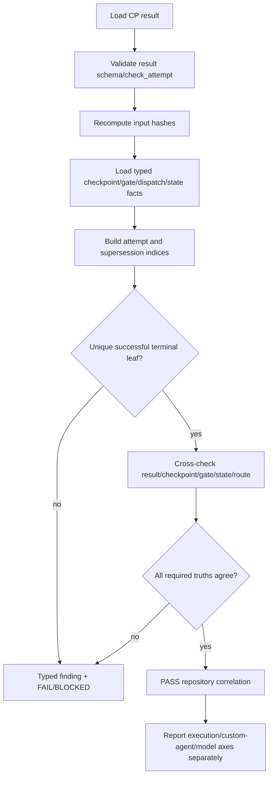

# LLD: ST-EI-003 — 关联 CP result、最终 attempt 与跨真相源

## 0. 工程依据（上游设计依据）

| 来源 | 路径 / ID | 被本 LLD 消费的内容 |
|---|---|---|
| Story | `process/stories/STORY-ST-EI-003-cp-attempt-correlation.md` | P0 范围、文件所有权、两项 TASK-ID、六条量化 AC |
| HLD | `docs/design/CR046-EVIDENCE-INTEGRITY-HLD.md` §§5.1、5.3、6、8 | typed identity、terminal selection、cross-truth、A-baseline 证据上限 |
| ADR | `CR046-EI-ADR-001/002/003/007/010/011` | 不建立第二真相源；namespace 不互换；phase/gate 分离；provenance 与运行时证明不伪造 |
| Feature Matrix | `docs/design/CR046-FEATURE-DESIGN-MATRIX.md` | `full-lld`，FEAT-EI-CORE，ST-EI-003 为 shared core integration owner |
| Feature DESIGN | `docs/features/cr046-core/DESIGN.md` | CP Correlator 输入输出、typed finding 与失败关闭合同 |
| Feature TEST-PLAN | `docs/features/cr046-core/TEST-PLAN.md` | `CT-CORE-02/06/07` 与 100% 正负 fixture 目标 |
| Feature TASKS | `docs/features/cr046-core/TASKS.md` | `TASK-EI-003-01`、`TASK-EI-CORE-INT` |
| 依赖 Story | `ST-EI-001`, `ST-EI-002` | chronology contract 与 dispatch/attempt/receipt typed contract；开发前必须冻结 |

## 1. Goal

在既有 CP result、checkpoint/gate/dispatch ledgers 和 current state 之上实现只读 `CPFinalCorrelation`，使每个适用 result 以 `check_attempt + input_artifact_hashes + supersedes_result_ref` 绑定同 checkpoint 的最终成功 terminal execution attempt，并以一个结构化 finding 集一致验证 gate、state、checkpoint event 与 result；不复制或改写任何事实源。

## 2. 需求 Requirements（Functional / Non-Functional）

### 2.1 Functional

- 所有非 N/A 的适用 CP result 必须包含正整数 `check_attempt`、非空 `input_artifact_hashes`；attempt 大于 1 时必须有同 checkpoint/CR/Story 的 `supersedes_result_ref`。
- 对需要功能 Agent 的 CP6/CP7，`dispatch_refs` 必须解析为同 CR、Story、checkpoint、canonical role 的最终 successful terminal dispatch attempt。
- final attempt 选择只使用 typed `dispatch_id + attempt_id`；`event_id`、`run_id`、`thread_id` 或 display fallback 不得替代 attempt identity。
- result 中每个输入 hash 必须按声明算法重新计算并完全相等；missing、stale、错对象或算法不支持均失败关闭。
- cross-truth 验证覆盖 result、checkpoint event、gate latest decision、`STATE.current.json`、route plan 和适用的 dispatch terminal outcome。
- 多次 result 检查形成无环 supersession chain；最终 current result 必须是 chain 唯一叶子，旧 result 保留为历史事实。
- 输出 typed findings，至少带 `rule_id`、`object_type`、`object_id`、`field`、`expected`、`actual`、`source_refs`、`safe_route`。
- 保持 A-baseline：缺平台 runtime receipt 只限制 attestation 轴，不得把 repository correlation fixture 错判为未执行；也不得反向把执行完成推导为 model/profile attested。

### 2.2 Non-Functional

- 非法 final attempt/hash/cross-truth fixtures 拒绝率 `100%`；合法 fixtures 接受率 `100%`。
- identity namespace fallback 接受数 `0`；supersession cycle 接受数 `0`。
- 校验为只读操作；历史 result/ledger/state 原字节 mutation 数 `0`。
- 对单个 CR 的典型 ledger/result 集，关联必须是 O(n) 扫描加 O(1) 索引查询，不得为每个 ref 重扫全部 ledger。
- 所有错误具有稳定 rule code，CLI/summary 不依赖异常字符串解析。
- 不读取 credentials、不执行 runtime、不触碰 quant-lab lineage 业务代码、不 commit/push。

## 3. 模块拆分与职责

| 模块 / 文件组 | 职责 | 说明 |
|---|---|---|
| `meta_flow/checks/cp_result.py` | 扩展 result schema、加载 typed correlation context、执行 final/hash/cross-truth validator、渲染 finding | 继续作为 CP result 主入口，不另建 result store |
| `meta_flow/checks/state_transition.py` | 提供 phase/gate 状态期望的纯函数并消费相同 correlation outcome | 不自行重新定义 attempt/hash identity |
| `meta_flow/state/event_ledger.py`（消费） | 加载 ST-EI-002 冻结的 typed dispatch attempt/terminal view | 本 Story 不拥有 dispatch producer/schema writer |
| `tests/test_cp_result_event_ledger.py` | CP result schema、supersession、terminal selection、hash、cross-truth 正负 fixture | primary 测试 owner |
| `meta_flow/cli.py` | 保持 `cp result-check`/`check cp-result` 入口一致并透传 strict/audit | shared 文件；本 Story 为 merge owner |

## 4. 代码结构与文件影响范围

| 动作 | 文件路径 | 变更内容 |
|---|---|---|
| 修改 | `meta_flow/checks/cp_result.py` | 新增 result attempt/hash 字段校验、`CPFinalCorrelation`、typed finding、final terminal selection 与 cross-truth orchestration |
| 修改 | `tests/test_cp_result_event_ledger.py` | 新增 CP attempt/hash/supersession/dispatch terminal/gate-state-result fixtures |
| 修改 | `meta_flow/checks/state_transition.py` | 抽取可复用 phase/gate expected-state 接口，避免 CP result checker 复制状态规则 |
| 修改 | `meta_flow/cli.py` | 为既有 CP result 命令增加 `--correlation-profile audit|strict`（默认兼容 audit，enforce 路由显式 strict）和稳定 exit code |

不创建第二 ledger/database，不修改其他 Story 文件，不修改 `process/DEVELOPMENT-PLAN.yaml`。

## 5. 数据模型与持久化设计

| 对象 / 字段 | 类型 | 约束 | 说明 |
|---|---|---|---|
| `check_attempt` | positive integer | `>=1`；同 checkpoint chain 单调递增且不得重复 | result execution 次数，不等于 checkpoint event row 数 |
| `input_artifact_hashes` | map<string,string> | 非空；key 为 portable project-relative ref；value 为 `sha256:<64hex>` | 只 hash 实际检查输入；目录/外部 URL 禁止 |
| `supersedes_result_ref` | relative path/null | attempt=1 可空；attempt>1 必填；目标存在、同 CR/checkpoint/Story 且 attempt 小 1 或 chain 可证明递增 | append-only result chain |
| `FinalAttemptRef` | record | `dispatch_id`、`attempt_id`、terminal event ref、terminal status | 仅 ST-EI-002 typed view 可构建 |
| `CPFinalCorrelation` | record | result identity、input hash verdict、final attempt、gate/checkpoint/state verdicts、findings | 运行时内存对象，不持久化为第二真相源 |
| `CorrelationFinding` | record | stable rule/object/field/expected/actual/source/safe route | 可嵌入 checker result/summary |

持久化只发生在既有 CP result 和既有 checkpoint ledger producer；本 Story 的 validator 不原位修复任何历史字段。兼容旧 result 时，audit profile 输出 `LEGACY_INPUT_HASH_UNAVAILABLE`/`LEGACY_ATTEMPT_UNAVAILABLE`；strict profile 不允许把缺失字段判 PASS。

## 6. API / Interface 设计

| 接口 / 入口 | 输入 | 输出 | 调用方 | 说明 |
|---|---|---|---|---|
| `validate_cp_result(path, project_root, check_consistency, correlation_profile)` | result path、root、bool、`audit|strict` | `(errors, warnings)` | CLI/tests | 扩展既有接口；strict 将 correlation finding 映射为 error |
| `build_cp_final_correlation(root, result_path, result)` | canonical root/result | `CPFinalCorrelation` | `validate_cp_result`、future replay | 纯读取，单次建立 typed indices |
| `select_final_terminal_attempt(result, dispatch_view)` | result dispatch refs、typed attempts | `FinalAttemptRef | finding` | correlator | 必须是唯一 chain leaf 且 successful terminal |
| `verify_input_artifact_hashes(root, hashes)` | project-relative refs/hash map | findings | correlator | 防路径越界、symlink escape、missing/stale hash |
| `validate_result_truths(correlation, route, state, gates, checkpoints)` | normalized facts | findings | correlator | phase-in-progress 与 gate-open 分开判断 |
| CLI `meta-flow cp result-check ... --correlation-profile strict` | 现有参数 + profile | exit 0/1、稳定 finding 输出 | Host/CI | 不新增平行命令族 |

## 7. 核心处理流程

1. 解析 result，拒绝不合法 attempt/hash/supersedes 形态。
2. 对 hash ref 做 project-root containment 和 symlink escape 检查，再计算 sha256。
3. 单次加载并按 typed namespace 索引 checkpoint、gate、dispatch attempt 与 current state。
4. 验证 result supersession chain 无环、attempt 单调、唯一 current leaf。
5. 对 CP6/CP7 选择唯一 successful terminal dispatch attempt；running/retrying/早期 NEEDS_REWORK 不可作为最终引用。
6. 交叉检查 checkpoint/CR/Story/decision/context/evidence/gate/state/route 一致性。
7. 按 audit/strict 映射 findings；分别输出 execution、custom-agent、model attestation 三轴，不做推导升级。

## 8. 技术细节（技术设计细节）

- 关键算法 / 规则：以 `TypedIdentity(namespace, value)` 建 map；supersession 使用 DFS 三色标记检测 cycle，再计算无出边叶子；dispatch attempt 按 ST-EI-002 的 explicit `attempt_id` 和 terminal status 建图；hash 使用流式 sha256。
- final attempt 兼容规则：旧 ledger 只有 `dispatch_id` 无 `attempt_id` 时只能在 audit 中产生 unavailable finding；不得自动取“最后一行”或把 event_id 当 attempt。
- cross-truth 规则：result 是检查结论，checkpoint ledger 是 result event，gate ledger 是人工决策，state 是当前工作流位置；validator只比较适用事实，不要求 phase-in-progress 预先存在 future gate。
- decision compatibility：terminal dispatch `completed/succeeded/passed` 可支撑 PASS-like result；`failed/interrupted/cancelled/superseded` 不可支撑 final PASS；rework attempt 可在历史链中但不能是 final leaf。
- hash compatibility：只接受 `sha256:`；未来算法必须通过 versioned schema 新增，不静默解释裸字符串。
- 依赖选择与复用点：复用 `event_ledger.load_events`、`state_transition.expected_post_transition` 和既有 `_rel`/path guard；不复制 reader。
- 图示类型选择：流程图，因为加载、选择、交叉验证和失败关闭跨越 4 个以上模块。

## 9. 安全与性能设计

| 维度 | 设计措施 | 验证方式 |
|---|---|---|
| 路径安全 | hash ref 必须是 portable relative path，resolve 后位于 project root；拒绝绝对路径、`..`、symlink escape | negative unit fixtures |
| 审计完整性 | validator 只读；不自动补造 attempt、hash、receipt、gate approval | before/after byte hash 比较 |
| 身份安全 | namespace 不 fallback；D3 `codex_agent_name` 不作为 resolved proof | collision/fallback fixture |
| 资源上限 | ledger 单次读取建索引；hash 流式 1 MiB chunks；finding 数按全部错误可定位但设置显示上限、机器结果保留计数 | 规模 fixture/性能断言 |
| 敏感信息 | finding 只显示 ref/hash/状态，不复制 artifact 内容 | snapshot review |

## 10. 测试设计

| 测试场景 | 前置条件 | 操作 | 预期结果 | 验证方式 |
|---|---|---|---|---|
| `CT-CORE-06-valid-final` | 两 attempt，第二 completed 且 result 引用第二 | strict result-check | PASS | unit+integration |
| first rework attempt 被 final result 引用 | attempt1 NEEDS_REWORK，attempt2 completed | strict result-check | `CP_FINAL_ATTEMPT_NOT_TERMINAL_WINNER` | negative fixture |
| reverify 仍 running | result PASS 引用 running attempt | strict result-check | reject | negative fixture |
| input hash match/mismatch | 真实临时 artifact | 修改前后检查 | match PASS；stale hash reject | unit |
| hash path escape/symlink escape | ref 指向 root 外 | strict check | reject，文件内容不读取 | security unit |
| supersession valid/cycle | 3 个 result chain | 构图 | 唯一叶子接受；cycle/双叶拒绝 | unit |
| event/dispatch/attempt namespace collision | 同字符串跨 namespace | 构图 | 不合并；非法 fallback 数 0 | `CT-CORE-02` |
| result/checkpoint decision mismatch | ledger event 与 result decision 不同 | consistency check | reject并列两 ref | integration |
| gate/state current truth mismatch | gate approved 但 state 仍等待同门，或 future gate 提前出现 | consistency check | reject正确冲突；合法 phase-in-progress接受 | integration |
| legacy result 缺 attempt/hash | 历史 fixture | audit/strict | audit unavailable warning；strict reject | compatibility |
| A-baseline 三轴 | repository correlation PASS、无 platform receipt | check | execution 可 PASS；custom/model unavailable | contract |
| 回归 | 既有 CP result tests | `uv run pytest tests/test_cp_result_event_ledger.py tests/test_state_transition.py` | 原合法用例保持通过 | regression |

## 11. 实施步骤

| TASK-ID | 动作 | 目标文件 | 详细描述 | 对应测试 |
|---|---|---|---|---|
| TASK-EI-003-01 | 修改 | `meta_flow/checks/cp_result.py` | 加入 attempt/hash/supersedes schema、typed indices、final selection、hash guard、cross-truth findings 与 audit/strict 映射 | CT-CORE-02/06、hash/supersession/cross-truth fixtures |
| TASK-EI-003-01 | 修改 | `tests/test_cp_result_event_ledger.py` | 创建合法与所有失败类 fixture，验证 100% reject/accept 和 immutable history | 本节全部 CP correlation tests |
| TASK-EI-CORE-INT | 修改 | `meta_flow/checks/state_transition.py` | 暴露/复用 phase-gate expected-state 纯函数并消除 CP result 的重复判断 | gate/state integration regression |
| TASK-EI-CORE-INT | 修改 | `meta_flow/cli.py` | 将 correlation profile 接入既有命令并保持稳定 exit code/help | CLI smoke + existing command regression |

## 12. 风险、难点与预研建议

### 12.1 实现灰区与取舍记录

| Clarification ID | 问题 | 选项与推荐 | 决策 / 答案 | 影响面 | 证据 | 重访条件 |
|---|---|---|---|---|---|---|
| N/A | 无阻塞 clarification | 推荐按已批准 typed identity + audit/strict phase-in 执行 | 已由 CP3-DQ-01/03 与 ADR-001..003 冻结 | 接口、测试、迁移 | CP3 R3 approval、Feature DESIGN | 若上游 ST-EI-001/002 在 CP5 被修改则重跑本 LLD precheck |

| 风险 / 难点 | 影响 | 缓解措施 / 预研建议 |
|---|---|---|
| 旧 result 缺 attempt/hash | 立即 strict 会使历史大量失败 | 兼容 reader + audit finding；只有新 producer/迁移证据齐备后切 strict |
| dispatch terminal 状态词历史不一致 | final selection 可能误判 | ST-EI-002 冻结 canonical enum 和 legacy normalization；未知值 fail closed |
| gate/state 比较错误处理阶段中间态 | 重演 future gate false positive | 消费 ST-EI-001 phase/gate contract，不由本 Story 自行推断 |
| shared `cli.py`/`state_transition.py` 冲突 | 并行改动覆盖 | 本 Story merge_owner；实现按 DAG 在 001/002 contract frozen 后合并 |

### OPEN / Spike 跟踪

| ID | 类型（OPEN / Spike） | 问题 | 下一动作 | 责任方 |
|---|---|---|---|---|
| N/A | N/A | 无 OPEN / Spike | 无 | 无 |

## 13. 回滚与发布策略

- 发布方式：先交付兼容 reader、schema 与 fixtures，默认 `audit`；新 producer 可写 attempt/hash 后在受控 CI/CR 上开启 `strict`，最后再考虑全局 enforce。
- 回滚触发条件：合法历史 fixture 被错误拒绝、phase/gate false positive、性能超出既有测试预算、跨真相源 checker 结论不一致。
- 回滚动作：CLI/config 从 strict 切回 audit；保留所有 append-only result/ledger 事实；回退 validator 代码版本但不删除新字段；修复后以新 check attempt 重跑，不原位修改旧 result。

## 14. DoD（Definition of Done）

- [ ] 14 个章节全部填写完成。
- [ ] `check_attempt`、input hash、supersession、final dispatch attempt 和 cross-truth 契约均有实现与负例。
- [ ] 非法 final/hash/cross-truth fixture 拒绝率 `100%`，合法 fixture 接受率 `100%`。
- [ ] identity namespace fallback 接受数 `0`，历史证据 mutation 数 `0`。
- [ ] 每个第 6 节接口至少对应一个第 10 节测试。
- [ ] 文件影响项与 `TASK-EI-003-01`/`TASK-EI-CORE-INT` 完整映射。
- [ ] execution/custom-agent/model 三轴未被错误提升。
- [ ] CP6 implementation return/evidence 可回链 Story AC、Feature tests 与本 LLD。
- [ ] 无阻塞 clarification、OPEN 或 Spike。
- [ ] `confirmed=false` 且全量 CP5 未批准前不进入实现。

## 人工确认区

> **CP5 — Story 设计证据可实现性门**

**CP5 checklist 摘要**：

| # | 检查项 | 状态 | 证据 |
|---|---|---|---|
| 1 | LLD 覆盖 AC | 待检查 | §§2、10、14 |
| 2 | 与 HLD / ADR 一致 | 待检查 | §§0、3、8、12 |
| 3 | 文件影响范围明确 | 待检查 | §§4、11 |
| 4 | 接口契约完整 | 待检查 | §6 |
| 5 | 测试与 dev_gate 可计算 | 待检查 | §§10、14 |
| 6 | clarification queue 已收敛 | 待检查 | §12.1；blocking=0 |

**人工审查结果回填**：

- 结论：`pending`
- 审查人：
- 审查时间：
- 修改意见：
- 风险接受项：
