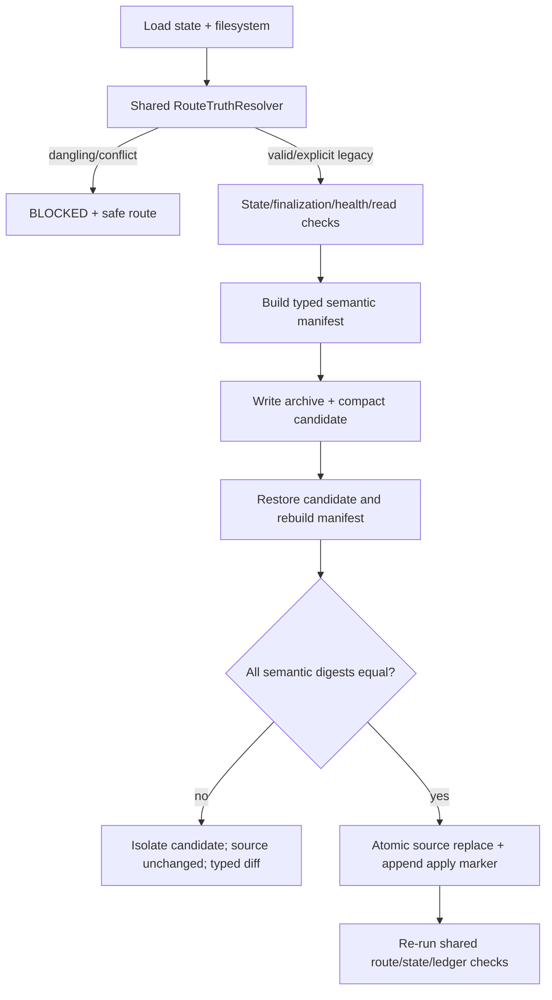

# LLD: ST-EI-004 — 统一 routing、finalization 与 compaction 语义

## 0. 工程依据（上游设计依据）

| 来源 | 路径 / ID | 被本 LLD 消费的内容 |
|---|---|---|
| Story | `process/stories/STORY-ST-EI-004-governance-integrity.md` | P0 范围、RouteTruth/finalization/compaction AC、文件 owner、四个 TASK-ID |
| HLD | `docs/design/CR046-EVIDENCE-INTEGRITY-HLD.md` §§5.2、5.3、5.5、8 | shared resolver、phase/gate、semantic manifest/apply gate、迁移回滚 |
| ADR | `CR046-EI-ADR-001/003/004/005/007` | existing truth、phase/gate 分离、real routing metadata、typed digest、provenance |
| Feature Matrix | `docs/design/CR046-FEATURE-DESIGN-MATRIX.md` | FEAT-EI-GOVERNANCE required，ST-EI-004 独立 full-lld |
| Feature DESIGN | `docs/features/cr046-governance/DESIGN.md` | RouteMetadata/RouteTruth、finalization/read authz、semantic compact contract |
| Feature TEST-PLAN | `docs/features/cr046-governance/TEST-PLAN.md` | `CT-GOV-01..08` 与 mismatch no-apply |
| Feature TASKS | `docs/features/cr046-governance/TASKS.md` | `TASK-EI-004-01..04` |
| Platform truth | `delivery/doc/PLATFORM-CONTRACTS.yaml` | project/user platform paths；本 Story 不推断 Codex runtime profile |
| 依赖 Story | `ST-EI-001/002/003` | phase/gate contract、typed identity、CP cross-truth；开发门按 plan 满足 |

## 1. Goal

建立唯一 `RouteTruthResolver`，使 workspace/state/doctor/CP/context 消费相同的可移植路由事实；收紧 delivered finalization、workflow-health 和 read-expansion authorization；并以 typed semantic manifest/digest 验证 ledger compact/restore 语义完全等价后才允许原子 apply。

## 2. 需求 Requirements（Functional / Non-Functional）

### 2.1 Functional

- `routing_ref` 非空时目标必须存在、可解析、project 名与当前项目匹配；symlink 与 local-directory 都走同一 resolver。
- local-directory metadata 至少包含 schema version、project name、routing mode、path format、project/process/link 的 portable anchored-relative paths；禁止以绝对本机路径作为 portable truth。
- RouteTruth canonical status 仅为 `valid-symlink`、`valid-local-directory`、`legacy-explicit`、`dangling`、`conflict`；non-null dangling/conflict 在所有消费者中不得 PASS。
- metadata migration 使用 candidate → dry-run → atomic replace → state ref confirm → cross-truth validate；失败不写正式 ref。
- phase-in-progress 与 opened gate 分离；delivered 必须 `current_phase=delivered`、`active_change=null`、`pending_gate=null` 且没有活动 context/handoff/story/release 残留引用。
- `workflow_health_ref` 必须存在、属于 active/current CR 或明确 global scope，并能解析 required counters；stale/missing owner 不得 enforce PASS。
- read expansion 必须显式记录 `outside_default_read_set`、`expansion_authorized`、authorization reason/ref；outside default 且未授权时 FAIL/BLOCKED。
- compaction manifest 必须包含 source ledger sha256、schema/policy identity、所有 typed nodes/edges、terminal selections、correction chains 与 workflow-health refs；不得使用 display fallback 构建 semantic identity。
- compaction apply 前必须 restore candidate、重建 semantic manifest，并要求全部 digest 相等；任一 mismatch 时源 ledger字节/hash不变、candidate隔离、返回 typed finding。

### 2.2 Non-Functional

- dangling/conflicting routing 被 PASS 次数 `0`；workspace/state/doctor/CP route conclusion 一致率 `100%`。
- delivered active refs 接受数 `0`；未授权 read expansion 接受数 `0`。
- compact/restore semantic digest 差异 `0`；digest mismatch apply 数 `0`；历史原位 mutation 数 `0`。
- resolver 对每次 top-level command 最多解析一次，可通过显式 `RouteTruth` 参数复用；禁止各 checker重复 filesystem probing。
- 所有写入使用同目录临时文件、fsync/replace 或既有原子 writer；失败可重试且不留下半更新 state/ref。
- 不执行真实 CR-163 pilot，不操作 credentials/runtime/publish/trading，不 commit/push。

## 3. 模块拆分与职责

| 模块 / 文件组 | 职责 | 说明 |
|---|---|---|
| `meta_flow/workspace/routing.py` | `RouteMetadata` 解析、portable anchor resolution、`RouteTruthResolver`、candidate validation | 路由唯一 owner |
| `meta_flow/state/current.py` | finalization invariant、route/health ref validation、原子 state ref 更新 | 不自行重新解释 routing metadata |
| `meta_flow/state/ledger_compaction.py` | typed semantic manifest、archive/candidate/restore/digest compare/apply marker | 不用 `_event_range` fallback 作为语义 identity |
| `meta_flow/checks/state_transition.py` | 消费 RouteTruth 与 finalization facts，验证 phase/gate/terminal state | shared；ST-EI-004 merge owner |
| `meta_flow/context_pack/builder.py`、`read_expansion.py` | read authorization schema/validation，并把 route/context refs交给共享检查 | shared；不复制 route resolver |
| `meta_flow/cli.py` | workspace/state/doctor/CP/ledger compact 入口注入同一 resolver/strict profile | shared；按 DAG 串行合并 |
| `tests/test_workspace_routing.py` + 既有 state/context/compaction tests | `CT-GOV-01..08` 正负和 rollback fixtures | primary 测试 owner加相关最小回归 |

## 4. 代码结构与文件影响范围

| 动作 | 文件路径 | 变更内容 |
|---|---|---|
| 修改 | `meta_flow/workspace/routing.py` | 新增 versioned RouteMetadata/RouteTruth、portable anchors、shared resolver、candidate/dry-run/atomic migration contract |
| 修改 | `meta_flow/state/current.py` | 验证 route/health refs、delivered finalization，并只通过 resolver结果更新状态 |
| 修改 | `meta_flow/state/ledger_compaction.py` | 新增 SemanticManifest、typed digest、restore-compare、no-apply guard 与 marker references |
| 修改 | `tests/test_workspace_routing.py` | 覆盖 valid/local/dangling/conflict/migration rollback 和跨消费者一致性 |
| 修改 | `meta_flow/checks/state_transition.py` | 接收共享 RouteTruth、finalization facts，移除重复或 implicit compatibility PASS |
| 修改 | `meta_flow/context_pack/builder.py` | 将 routing/health/read authorization refs 纳入 context validation，不重复路由判断 |
| 修改 | `meta_flow/context_pack/read_expansion.py` | 扩展明确授权语义和负例；保留兼容 reader |
| 修改 | `meta_flow/cli.py` | 将 resolver、migration dry-run、semantic compaction strict check 接入既有命令族 |

不修改 `process/archive/**` 既有历史内容；测试只在临时目录生成 archive/candidate。

## 5. 数据模型与持久化设计

| 对象 / 字段 | 类型 | 约束 | 说明 |
|---|---|---|---|
| `RouteMetadata` | versioned record | `schema_version`, `project_name`, `routing_mode`, `path_format`, `anchors`, `project_root`, `project_process_root`, `link_path` | path 值为 anchor + normalized relative path；禁止 `..`/escape |
| `RouteTruth` | immutable record | status、metadata ref/hash、resolved paths、filesystem observations、findings、safe route | 一个 top-level operation只解析一次 |
| `WorkflowHealthRef` | relative ref + owner | 目标存在、schema有效、owner 为 active CR/global、required counters齐全 | stale 只可 audit warning；enforce失败 |
| `ReadExpansionAuthorization` | event fields | outside flag、authorized bool、reason/ref、requested path、actor/time | outside=true 且 authorized=false 必须失败 |
| `SemanticNode` | namespace + id + canonical payload hash | namespace明确，不使用 fallback | event/dispatch/attempt/run/check/gate/correction/health分别建 node |
| `SemanticEdge` | typed from/to/relation | 两端存在、relation合法 | supersedes/attempt-of/terminal-of/corrects/health-for 等 |
| `TerminalSelection` | owner typed id + winner attempt | 唯一、terminal、chain leaf | compaction前后必须相等 |
| `SemanticManifest` | versioned record | source hash、schema/policy、node digest、edge digest、terminal/correction/health digests、counts | canonical JSON排序后 sha256 |
| `CompactionApplyReceipt` | marker event | before/after/restore manifest refs+hash、archive/index/backup refs、applied_at | 仅 digest全等后追加 |

正式持久化仍使用 `process/.meta-flow-process.yaml`、`STATE.current.json`、既有 ledgers 和 `process/archive/ledger/**`。新增 manifest/restore report 与 candidate 位于同一 archive transaction 目录；apply 前不覆盖源 ledger。

## 6. API / Interface 设计

| 接口 / 入口 | 输入 | 输出 | 调用方 | 说明 |
|---|---|---|---|---|
| `resolve_route_truth(project_root, state=None, profile="strict")` | root、可选 state、audit/strict | `RouteTruth` | workspace/state/doctor/CP/CLI | 路由唯一解析入口 |
| `load_route_metadata(path, project_root)` | metadata ref/root | `RouteMetadata | findings` | resolver/migration | 只接受 versioned portable schema |
| `plan_route_metadata_migration(root, mode)` | 当前布局、target mode | candidate plan + before hash | CLI/Host | 只读计划，不改 state |
| `apply_route_metadata_migration(plan)` | validated plan | applied receipt/typed failure | CLI | compare-before + atomic replace；失败不切 ref |
| `validate_finalization(state, route_truth, health)` | normalized facts | findings | state/current、state-transition、CP consistency | delivered 与非 delivered 分表检查 |
| `validate_read_expansion_authorization(event, policy)` | event/policy | findings | read-expansion checker/context builder | 明确 outside/authorized 两轴 |
| `build_semantic_manifest(ledger, typed_graph, policy)` | source ledger、ST-EI-003 graph、policy | manifest | compactor/replay | 禁止 display fallback |
| `restore_and_compare(candidate, before_manifest)` | candidate/archive/index/manifest | restored manifest + diff findings | compactor | 全等才 authorized |
| `apply_compaction(plan, semantic_authorization)` | existing CompactPlan + verified compare | summary/marker | CLI | 无 authorization 对象即拒绝 apply |

## 7. 核心处理流程

1. top-level 命令载入 state 与 filesystem observation，调用一次 resolver。
2. dangling/conflict 立即返回同一 typed finding；local compatibility 不能吞掉 non-null dangling ref。
3. state/doctor/CP/context 消费同一个 RouteTruth，验证 phase/gate/finalization、health 和 read authorization。
4. compactor对源 ledger和 typed graph生成 before manifest并记录源 hash。
5. 写 archive、index、candidate，不覆盖源；restore candidate后重新建图和 after manifest。
6. 比较 schema/policy/source lineage、node/edge/terminal/correction/health digests及counts。
7. mismatch 时隔离 candidate并保持源 hash；全等时 compare-before、原子替换源、追加带 manifest refs 的 marker。
8. apply 后重新运行 route/state/ledger validation；异常通过新修复 attempt处理，不原位改 archive。

## 8. 技术细节（技术设计细节）

- Route anchor：metadata file 所在 project/process 根为已命名 anchor；先 lexical normalize，再 resolve，要求位于允许 anchor，禁止绝对路径和跨根 symlink。`project_name` 与 state/project identity必须相等。
- `legacy-explicit`：只允许 `routing_ref=null` 加 versioned `routing_status=legacy-local-directory` 和 migration deadline；它不是 valid metadata，也不得与 non-null dangling ref并存。
- 原子迁移：plan冻结 before state/metadata hash；apply 时再比对，写临时文件、fsync、replace，随后更新 state ref；任一步失败恢复 before state，不产生半路由。
- finalization：字段级检查，不把 transition 的 stop reason 写成 current state field；delivered事实由 phase、active change、pending gate和active refs共同表达。
- semantic canonicalization：JSON UTF-8、sorted keys、无非语义 display fields；每个 node identity由 namespace+stable id确定；`_event_range` 的 event/dispatch/run fallback只留在人类摘要。
- compaction不重新选择 winner；before manifest的 terminal selection必须由 typed graph验证，restore 后独立重算并相等。
- correction/health refs作为 node/edge参与 digest，不能只保留显示字符串；未知 dangling ref使 compact plan不可 apply。
- 兼容性：现有 compact dry-run仍可生成计划，但 `--apply` 必须 semantic authorization；audit 模式可报告 legacy metadata/read events，strict拒绝。
- 图示类型选择：流程图，因为 resolver、多个消费者、archive/restore/compare/apply具有清晰失败与补偿路径。

## 9. 安全与性能设计

| 维度 | 设计措施 | 验证方式 |
|---|---|---|
| 路径/软链安全 | anchor containment、绝对路径/`..`/symlink escape拒绝，metadata project identity核对 | CT-GOV-01/02/08 security fixtures |
| 原子性 | compare-before、临时文件、fsync、replace；apply marker最后追加 | fault injection/short write tests |
| 历史不可变 | mismatch/exception 时源 ledger hash不变；archive append-only | before/after sha256 |
| 权限 | read expansion需要显式 authorization ref；本 Story不读凭据、不运行 production动作 | CT-GOV-05 |
| 性能 | resolver per command缓存；manifest流式读取ledger、canonical hash增量计算；typed indices O(n) | 10k synthetic characterization（非 SLA） |
| 内存 | manifest保存 digest/count与必要typed selection，不复制完整payload到summary | peak memory characterization |

## 10. 测试设计

| 测试场景 | 前置条件 | 操作 | 预期结果 | 验证方式 |
|---|---|---|---|---|
| valid symlink route | metadata与link一致 | 四消费者检查 | 全部 PASS、同 status/hash | CT-GOV-01 integration |
| valid local-directory metadata | portable anchors有效 | workspace/state/doctor/CP | 全部 valid-local-directory | CT-GOV-01 |
| non-null dangling ref | target缺失 | compat/strict检查 | PASS次数0；typed BLOCKED | CT-GOV-02 |
| conflicting metadata/filesystem | mode/project/path不一致 | shared resolver | 所有消费者同 conflict | CT-GOV-02 |
| explicit legacy-null | ref=null、versioned legacy state | audit/strict | audit warning；strict按policy阻断，不冒充valid | compatibility |
| migration success | valid candidate + unchanged before hash | dry-run/apply | 原子切换，cross-truth PASS | CT-GOV-08 |
| migration failure/race | invalid candidate或before hash变化 | apply | formal ref/state不变，无半文件 | CT-GOV-08 |
| phase work without gate | solution-design执行中 | state transition | 合法接受，pending_gate仍null | CT-GOV-03 |
| delivered残留refs | active_change/context/handoff任一非空 | finalization | reject并指明字段 | CT-GOV-04 |
| health ref stale/wrong owner | target missing或CR不符 | enforce state check | reject | CT-GOV-04 |
| read expansion outside+unauthorized | ledger event无授权 | read/context/CP check | reject并给授权/撤销 safe route | CT-GOV-05 |
| compact/restore equal | retry、terminal、correction、health完整 | plan/restore/compare/apply | digest全等，apply allowed | CT-GOV-06 |
| 每类 semantic drift | 分别删node/edge/terminal/correction/health | compare/apply | 每类 mismatch拒绝；源hash不变 | CT-GOV-07 |
| fallback identity collision | event_id/dispatch_id/run_id同字符串 | manifest | namespace分别保留，不合并 | negative unit |
| short write/OSError | archive/candidate/replace注入故障 | apply | terminal failure，源hash不变，可安全重试 | failure recovery |
| 回归 | 既有 workspace/state/context/compaction suites | `uv run pytest ...` | 原合法行为保持，implicit dangling PASS被预期修正 | regression |

## 11. 实施步骤

| TASK-ID | 动作 | 目标文件 | 详细描述 | 对应测试 |
|---|---|---|---|---|
| TASK-EI-004-01 | 修改 | `meta_flow/workspace/routing.py`, `tests/test_workspace_routing.py` | 实现 RouteMetadata/RouteTruth、portable anchors、shared resolver、migration plan/apply rollback | CT-GOV-01/02/08 |
| TASK-EI-004-02 | 修改 | `meta_flow/state/current.py`, `meta_flow/checks/state_transition.py`, `meta_flow/context_pack/builder.py`, `meta_flow/context_pack/read_expansion.py` | 收敛 phase/gate/finalization、health ref、read authorization并消费同一 RouteTruth | CT-GOV-03/04/05 |
| TASK-EI-004-03 | 修改 | `meta_flow/state/ledger_compaction.py` | 实现 typed semantic manifest、restore compare、no-apply guard、atomic replace与marker refs | CT-GOV-06/07 + fault injection |
| TASK-EI-004-04 | 修改 | `meta_flow/cli.py`, `tests/test_workspace_routing.py` | 把 shared resolver、migration dry-run与semantic apply gate接入既有CLI并运行跨模块回归 | cross-truth/CLI regression |

## 12. 风险、难点与预研建议

### 12.1 实现灰区与取舍记录

| Clarification ID | 问题 | 选项与推荐 | 决策 / 答案 | 影响面 | 证据 | 重访条件 |
|---|---|---|---|---|---|---|
| N/A | local-directory compatibility是否允许 dangling ref | 推荐 real portable metadata；备选 explicit legacy-null；禁止 non-null dangling PASS | CP3-DQ-02 已批准 | route schema、migration、tests | ADR-004、Feature DESIGN | metadata schema版本变更时重访 |
| N/A | compaction是否可用 display fallback恢复语义 | 推荐 typed namespace manifest；备选仅保留 fallback用于人类摘要 | ADR-005 已批准 | compactor、audit、rollback | HLD §5.5、Feature DESIGN | 无；改变需新架构决策 |

| 风险 / 难点 | 影响 | 缓解措施 / 预研建议 |
|---|---|---|
| 多消费者各自保留旧 route 分支 | split-brain仍存在 | resolver依赖注入；contract test比较四消费者 status/finding/hash |
| state+metadata双文件原子边界 | 中断产生半迁移 | candidate/dry-run、before hash、metadata先落地、state最后切ref、失败恢复 |
| manifest漏掉新 event type/edge | compact后语义丢失 | unknown semantic type阻断apply；manifest schema显式枚举并由ST-EI-006 replay验证 |
| 大 ledger 内存/耗时 | compaction不可用 | 流式hash+typed index；先characterization，只有实证超限才另CR设计索引 |
| shared文件并行冲突 | 实现覆盖 | ST-EI-004为merge_owner；开发等待ST-EI-003 verified并按W4串行 |

### OPEN / Spike 跟踪

| ID | 类型（OPEN / Spike） | 问题 | 下一动作 | 责任方 |
|---|---|---|---|---|
| N/A | N/A | 无 OPEN / Spike | 无 | 无 |

## 13. 回滚与发布策略

- 发布方式：先落兼容 reader、RouteTruth audit和semantic dry-run；生成/验证真实 local metadata后再切 strict route；compaction apply仅在完整 restore fixture及cross-truth回归通过后开放。
- 回滚触发条件：任一消费者route结论不一致、合法布局被阻断、metadata迁移中断、semantic digest mismatch、apply后源/restore graph不等价、delivered false positive。
- 回滚动作：strict切回audit；route回 explicit legacy-null而非 non-null dangling；恢复迁移前 state/metadata hash；compaction mismatch不apply，若replace后post-check失败则用已验证backup恢复源并追加失败/恢复marker；不删除archive或重写历史。

## 14. DoD（Definition of Done）

- [ ] 14 个章节全部填写完成。
- [ ] symlink/local/legacy/dangling/conflict五态及portable anchor契约完成。
- [ ] workspace/state/doctor/CP route conclusion一致率 `100%`，dangling PASS数 `0`。
- [ ] delivered active refs和未授权read expansion接受数均 `0`。
- [ ] manifest覆盖 typed nodes/edges/terminal/correction/health，display fallback不进入语义identity。
- [ ] equal restore才允许apply；semantic mismatch apply数 `0`，源历史mutation数 `0`。
- [ ] 每个第6节接口至少有第10节测试，所有文件影响项映射到 `TASK-EI-004-01..04`。
- [ ] 迁移、short-write、digest mismatch与post-check失败均有明确rollback证据。
- [ ] CP6 return/evidence可回链Story AC、Feature tests与本LLD。
- [ ] 无阻塞clarification、OPEN或Spike。
- [ ] `confirmed=false` 且全量CP5未批准前不进入实现。

## 人工确认区

> **CP5 — Story 设计证据可实现性门**

**CP5 checklist 摘要**：

| # | 检查项 | 状态 | 证据 |
|---|---|---|---|
| 1 | LLD 覆盖 AC | 待检查 | §§2、10、14 |
| 2 | 与 HLD / ADR 一致 | 待检查 | §§0、3、8、12 |
| 3 | 文件影响范围明确 | 待检查 | §§4、11 |
| 4 | 接口契约完整 | 待检查 | §6 |
| 5 | 测试与 dev_gate 可计算 | 待检查 | §§10、14 |
| 6 | clarification queue 已收敛 | 待检查 | §12.1；blocking=0 |

**人工审查结果回填**：

- 结论：`pending`
- 审查人：
- 审查时间：
- 修改意见：
- 风险接受项：
