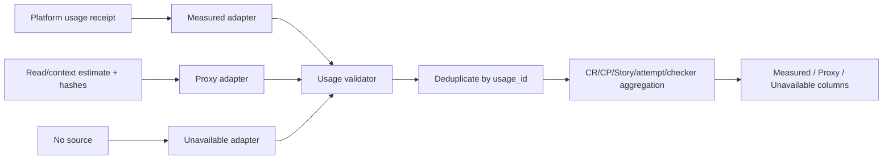

# LLD: ST-EI-005 — 诚实记录 token telemetry 与成本归属

## 修订记录

| 版本 | 日期 | 修订人 | 变更要点 |
|---|---|---|---|
| 1.0 | 2026-07-12 | meta-dev | 首版完整 0..14 LLD，冻结 usage 三态、source ownership、多维归属与分列聚合。 |
| 1.1 | 2026-07-12 | meta-dev | CP5 R2：显式对齐 checker 的“工程依据/需求/技术细节/DoD”语义标签，不改变 telemetry schema 与验证口径。 |

## 0. 工程依据与上游设计依据

本 Story 的工程依据是现有 token budget/read-expansion 只能提供文件展开代理量，且平台真实 token telemetry 尚不可用。实现必须保留两者的证据等级差异，使 proxy、unavailable 与 platform-measured 在 schema 和聚合上不可混淆。

| 来源 | 路径 / ID | 被本 LLD 消费的内容 |
|---|---|---|
| Story | `process/stories/STORY-ST-EI-005-token-telemetry.md` | measured/proxy/unavailable AC、文件 owner、依赖 ST-EI-002 |
| HLD/ADR | `CR046-EVIDENCE-INTEGRITY-HLD.md`; ADR-007/008 | provenance-bearing replay、三态 telemetry、虚假精度 fail |
| Feature Matrix/DESIGN | `CR046-FEATURE-DESIGN-MATRIX.md`; `cr046-observability/DESIGN.md` | full-lld、UsageRecord ownership、五维独立计数 |
| Feature TEST/TASKS | `cr046-observability/{TEST-PLAN,TASKS}.md` | CT-OBS-01/02、TASK-EI-005-01/02 |
| 上游 contract | ST-EI-002 declared dispatch/attempt identity | usage 归属 attempt/thread 时只消费 typed identity，不从标签推断模型 |

## 1. Goal

创建 UsageRecord 三态 schema、平台/代理来源 adapter 与确定性成本聚合，使 token 数据按 CR、phase、Story、dispatch attempt、checker run、model（仅有证明时）归属，并确保没有平台 telemetry 时诚实记录 unavailable，而非以字符估算冒充实际 token。

## 2. 需求（Functional / Non-Functional）

### 2.1 Functional

- 每条适用 usage record 必有且仅有 `measurement_status=measured|proxy|unavailable`。
- `measured` 仅接受 `source_kind=platform-reported`，保存原始 usage receipt/ref、模型字段和 input/cached/output/reasoning/total；total 与已提供分项一致或带平台声明的计算口径。
- `proxy` 必须保存算法名/版本、输入 artifact refs/hashes、估算值和单位；不得填进 measured token 字段。
- `unavailable` 必须保存 unavailable reason、期望 source 和观测时间；数值字段为空，不以 0 表示未知。
- 归属键覆盖 CR/CP/phase/Story/dispatch/attempt/thread/checker-run/model；缺维度保持 null/unavailable，不从 task name、profile TOML 或 ledger D3 自报补值。
- 分别聚合 measured、proxy 和 unavailable count；禁止将 proxy 与 measured 相加成“实际总 token”。
- context/read-expansion 既有 `estimated_tokens` 作为 proxy source 接入；保持其原始语义，不改名为 usage measured。

### 2.2 Non-Functional

- measurement_status 覆盖率 100%，measured-without-platform-source=0。
- CT-OBS-02 golden aggregation 每个归属维度准确率 100%；重复 receipt/ref 去重确定。
- 输入 record 聚合 `O(n)`；10k record characterization 完成但不声明 SLA。
- 输出不得包含 prompt正文、secret、凭据或不可审计的模型推断。
- 不访问 runtime/credentials，不修改 quant-lab/历史 archive，不 commit/push。

## 3. 模块拆分与职责

| 模块 / 文件组 | 职责 | 说明 |
|---|---|---|
| `meta_flow/evidence/usage.py` | UsageRecord schema、source adapters、validator、group aggregate | 新 primary owner；不拥有平台 telemetry producer |
| `meta_flow/checks/token_budget.py` | 既有字符估算输出显式 proxy metadata | shared；保持 budgeting 行为兼容 |
| `meta_flow/context_pack/builder.py` | context required/optional/expanded proxy attribution | shared；不把 potential tokens当 actual |
| `tests/test_cr046_usage_telemetry.py` | 三态互斥、source precedence、golden aggregation、安全负例 | primary test owner |

## 4. 代码结构与文件影响范围

| 动作 | 文件路径 | 变更内容 |
|---|---|---|
| 创建 | `meta_flow/evidence/usage.py` | 定义 usage schema、validation、adapters、aggregation |
| 创建 | `tests/test_cr046_usage_telemetry.py` | CT-OBS-01/02 正负和 golden tests |
| 修改 | `meta_flow/checks/token_budget.py` | 为估算补 `measurement_status=proxy`、algorithm/version/source refs；保留现有输出兼容 |
| 修改 | `meta_flow/context_pack/builder.py` | 区分 required/optional-potential/expanded proxy，输出 usage adapter 所需 attribution |

不创建 billing database，不采集 prompt正文，不改变平台计费事实。

## 5. 数据模型与持久化设计

| 对象 / 字段 | 类型 | 约束 | 说明 |
|---|---|---|---|
| `UsageRecord.usage_id` | string | 唯一稳定；建议 source receipt + scope hash | 防重复聚合 |
| `measurement_status` | enum | measured/proxy/unavailable 三选一 | 不允许 inferred |
| `source_kind/source_ref` | enum/string | measured必须 platform-reported；proxy必须 algorithm；unavailable必须 reason | provenance 必填 |
| `input_tokens/cached_input_tokens/output_tokens/reasoning_tokens/total_tokens` | nullable int | 非负；仅 measured；缺项可 null | 0 是实测零，null 才是未知 |
| `proxy_value/proxy_unit/proxy_algorithm/proxy_version` | nullable | 仅 proxy；unit 如 estimated_tokens/chars | 不参与 measured sum |
| `unavailable_reason/expected_source` | nullable string | 仅 unavailable | 如 platform-telemetry-not-exposed |
| `Attribution` | mapping | cr/cp/phase/story/dispatch/attempt/thread/checker/model refs | model仅平台证明时填写 |
| `UsageAggregate` | mapping | group keys + measured sums + proxy summaries + unavailable_count | 三口径分列 |

UsageRecord 可嵌入 dispatch terminal/replay input 或独立派生 artifact；本 Story 不新建 canonical ledger。ST-EI-006 生成 audit report时消费它。

## 6. API / Interface 设计

| 接口 / 入口 | 输入 | 输出 | 调用方 | 说明 |
|---|---|---|---|---|
| `usage_from_platform(receipt, attribution)` | 平台 usage receipt + typed refs | measured UsageRecord | dispatch terminal adapter | 无 receipt不得调用成功 |
| `usage_from_proxy(value, algorithm, version, refs, attribution)` | 非负值、算法、输入 hashes | proxy UsageRecord | token budget/context builder | 不填 measured fields |
| `usage_unavailable(reason, expected_source, attribution)` | reason + scope | unavailable UsageRecord | 所有无 telemetry 路径 | 数值保持 null |
| `validate_usage(record)` | UsageRecord | findings | CP/audit checker | strict status/source/field互斥 |
| `aggregate_usage(records, group_by)` | validated records + approved dimensions | UsageAggregate[] | ST-EI-006/audit | 三态分列、usage_id去重 |

测试映射：TC-005-PLATFORM、TC-005-PROXY、TC-005-UNAVAILABLE、CT-OBS-01、CT-OBS-02。

## 7. 核心处理流程

1. 调用方先建立 typed attribution；attempt/thread 必须来自 ST-EI-002 typed contract。
2. source adapter按证据选择 measured、proxy 或 unavailable；优先级是有效 platform receipt > 显式 proxy > unavailable。
3. validator检查 status/source/字段互斥、非负、receipt correlation 和 model proof。
4. aggregator按 usage_id去重，按明确 group keys分桶。
5. 每桶分别输出 measured sums、proxy按算法/单位小计及 unavailable count/reasons。
6. ST-EI-006 只读消费聚合，报告不得重新解释状态。

## 8. 技术细节与设计细节

- 互斥规则：measured出现 proxy/unavailable payload、proxy出现 measured token fields、unavailable出现任何数值均报 `USAGE_STATUS_FIELD_CONFLICT`。
- Measured source：必须有平台签发/返回的 usage ref；session-observed字符数、tool output长度、文件估算均不能 measured。
- Total consistency：若平台报告 total和分项全集，则要求 `total >= max(input+output, cached+output)`，具体供应商语义保留 `source_semantics`，不强制虚构 reasoning拆分。
- Proxy adapter：复用 `estimate_tokens` 的稳定算法并固定 version；输入文本不落 usage artifact，只保存 artifact hash/ref。
- Context预算：分别记录 `required_estimated_tokens`、`optional_potential_tokens`、`expanded_tokens`；只有实际扩展生成 expanded proxy。
- 聚合：model维度只在平台 usage/dispatch receipt证明时有值，否则 `model_status=unavailable`，防止从 `.codex/agents` 反推。

## 9. 安全与性能设计

| 维度 | 设计措施 | 验证方式 |
|---|---|---|
| 隐私 | 仅保存计数、refs、hash、算法；不保存prompt/tool正文 | schema allow-list + secret marker fixture |
| 完整性 | measured source owner固定platform；receipt/ref/hash可回链 | forged source negative tests |
| 成本 | 流式单遍聚合、group key tuple、usage_id set去重 | 10k characterization |
| 兼容 | 新字段 optional reader；旧 estimated_tokens显式适配proxy | existing token/context tests |

## 10. 测试设计

| 测试场景 | 前置条件 | 操作 | 预期结果 | 验证方式 |
|---|---|---|---|---|
| TC-005-PLATFORM 有效 receipt | platform source/correlation完整 | build+validate | measured有效，分项保留 | unit |
| CT-OBS-01 measured无source | status=measured, receipt缺失 | validate | 100% reject | negative |
| CT-OBS-01 三态字段混用 | 逐组合污染payload | validate | 全部 stable finding | parameterized |
| TC-005-PROXY read expansion | value+algorithm/version+hash | build | proxy有效，measured字段null | unit |
| TC-005-UNAVAILABLE 无telemetry | expected platform source | build | unavailable，所有数值null | unit |
| CT-OBS-02 golden attribution | 2 CR/3 phase/4 attempts/2 checker | aggregate多维 | 每个bucket与oracle 100%一致 | golden |
| TC-005-DEDUP 重复 receipt | 同 usage_id两次 | aggregate | 只计一次并报告duplicate finding | unit |
| TC-005-MODEL 无runtime proof | D3 profile label存在 | aggregate | model unavailable，不按label分桶 | negative |
| TC-005-CONTEXT 三类预算 | required/optional/expanded | adapter | 分列，不把optional potential当消耗 | integration |
| TC-005-SEC prompt/secret字段 | 非schema键或敏感正文 | validate | reject/不序列化 | security |
| TC-005-REG 既有token/context | existing fixtures | pytest | 行为兼容 | regression |

## 11. 实施步骤

| TASK-ID | 动作 | 目标文件 | 详细描述 | 对应测试 |
|---|---|---|---|---|
| TASK-EI-005-01 | 创建/修改 | `meta_flow/evidence/usage.py`, `meta_flow/checks/token_budget.py`, `tests/test_cr046_usage_telemetry.py` | 定义三态、source adapter、互斥validator和proxy metadata | CT-OBS-01、TC-005-PLATFORM/PROXY/UNAVAILABLE |
| TASK-EI-005-02 | 修改 | `meta_flow/evidence/usage.py`, `meta_flow/context_pack/builder.py`, `tests/test_cr046_usage_telemetry.py` | 实现typed attribution、去重、多维聚合与required/optional/expanded分列 | CT-OBS-02、TC-005-DEDUP/MODEL/CONTEXT/SEC |

## 12. 风险、难点与预研建议

### 12.1 实现灰区与取舍记录

| Clarification ID | 问题 | 选项与推荐 | 决策 / 答案 | 影响面 | 证据 | 重访条件 |
|---|---|---|---|---|---|---|
| N/A | 无阻断灰区 | 使用 accepted ADR-008 三态，不合并 proxy/measured | 已收敛 | schema/测试/报告 | ADR-008、CT-OBS-01/02 | 平台usage语义发生版本化变化时 |

| 风险 / 难点 | 影响 | 缓解措施 / 预研建议 |
|---|---|---|
| 平台不提供token usage | 无法量化实际成本 | unavailable是合法终态；不做虚假总数 |
| 供应商token字段语义不同 | total校验误报 | 保存source/schema version和source_semantics，通用层只做安全不变量 |
| optional potential被计作实际 | 成本报告严重夸大 | 三类context预算独立字段与golden test |
| 高基数group keys | 聚合内存增长 | 明确允许维度，CLI/report层分页；10k characterization |

### OPEN / Spike 跟踪

无阻断 OPEN / Spike。平台 telemetry 当前 unavailable 是预期数据状态，不是待猜测字段。

## 13. 回滚与发布策略

- 发布方式：先添加兼容 UsageRecord adapter和报告分列；旧 `estimated_tokens` 保持可读并映射为 proxy。
- 回滚触发条件：旧 token budget/context tests回归、proxy被计入measured、重复计费或敏感正文进入artifact。
- 回滚动作：关闭新聚合入口，保留三态schema/fixtures；旧budget行为恢复，但不得把已标unavailable/proxy改写为measured。

## 14. DoD（Definition of Done）

- [ ] 0–14 章节完整；无阻断 clarification。
- [ ] measurement_status覆盖率100%，三态互斥负例拒绝率100%。
- [ ] measured-without-platform-source=0，unavailable数值伪0=0。
- [ ] CT-OBS-02 全部归属维度和dedup与golden oracle一致率100%。
- [ ] required/optional-potential/expanded proxy明确分列，proxy不进入actual总数。
- [ ] model仅平台证明时归属；D3标签推断model数=0。
- [ ] `uv run pytest tests/test_cr046_usage_telemetry.py tests/test_token_budget.py` 及context相关回归通过。
- [ ] forbidden访问/写入/commit/push为0；`confirmed=false` 时不实现。

## 人工确认区

> CP5 全量 Story 设计证据统一确认；本文件当前仅 `ready-for-review`。

- 结论：`pending`
- 审查人：
- 审查时间：
- 修改意见：
- 风险接受项：平台 telemetry unavailable 时仅能报告 unavailable/proxy，不能给实际 token 总数。
