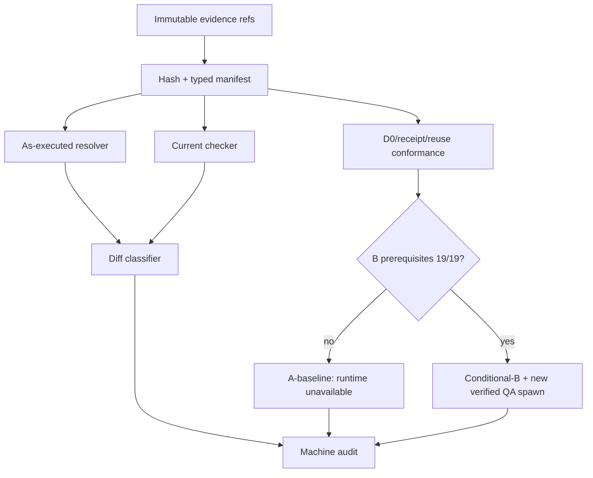

# LLD: ST-EI-006 — 实现 checker replay、机器 audit 与平台 conformance

> 本 LLD 只设计仓库实现与 fixture。当前调度工具没有平台 profile/model receipt；本文不得作为实际 custom Agent/model attestation。

## 0. 工程依据（上游设计）

| 来源 | 路径 / ID | 被本 LLD 消费的内容 |
|---|---|---|
| HLD | `CR046-EVIDENCE-INTEGRITY-HLD.md` §§5.1B/5.5/9 | CURRENT/REQUIRED 分层、双口径 replay、A-baseline + Conditional-B、结论上限 |
| ADR | `CR046-EI-ADR-007/010/011` | provenance manifest、D0-D3、receipt 证明、狗粮切换与回退 |
| Platform contract | `delivery/doc/PLATFORM-CONTRACTS.yaml#contracts.codex.runtime_subagents` | 当前工具证据上限与 REQUIRED extension；配置路径不等价于 runtime discovery |
| Feature Matrix | `CR046-FEATURE-DESIGN-MATRIX.md` | `full-lld`；MINOR-EI-01/02/03 owner 与 fixture |
| Observability DESIGN | `cr046-observability/DESIGN.md` | ReplayRun、AuditReport、平台 conformance、legacy D3 分类 |
| Observability TEST-PLAN/TASKS | `cr046-observability/{TEST-PLAN,TASKS}.md` | CT-OBS-03..08、TASK-EI-006-01..04 |
| Core DESIGN | `cr046-core/DESIGN.md` | CapabilityProbe、DispatchReceipt、ThreadRuntimeIdentity、ReuseReceipt 输入契约 |
| Story | `STORY-ST-EI-006-replay-audit.md` | 文件所有权、依赖、AC、禁止范围 |

## 1. 目标（Goal）

创建 `meta_flow/evidence/replay.py` 与 `meta_flow/evidence/audit.py`，并修改既有 CLI/CP result 接入点，使 checker provenance 可双口径重放、审计统计可机器生成、平台 conformance 可按 execution/profile/model 三轴 fail-closed 判定；同时将 legacy `codex_agent_name` 固定迁移为 D3 `self-declared-unverifiable`。

## 2. 需求（Requirements：Functional / Non-Functional）

### 2.1 Functional

- RF-01：每次 replay 保存 checker name、version/commit、schema/policy/input hashes；历史 provenance 不可得时输出 `unavailable`，不补写原结果。
- RF-02：同一 immutable input manifest 输出 `as_executed` 与 `current_replay` 两个 outcome，并给出 `unchanged|decision-changed|findings-changed|not-replayable` diff class。
- RF-03：机器审计分别统计 event rows、dispatch attempts、threads、terminal outcomes、token usage；禁止由一个维度推断另一维度。
- RF-04：平台 conformance 执行 PC-01..PC-19，分别输出 `execution_completed`、`custom_agent_verified`、`model_attested`；fixture PASS 不等价于 runtime attestation。
- RF-05（PC-18）：D0 probe 必须校验 `session_id/session_epoch`、`observed_at/expires_at|ttl_seconds`、config hash、selector/tool schema version。expiry/TTL、session/epoch、hash、schema、capability regression 或显式 reload 任一发生时，新 dispatch 前必须 re-probe；旧 probe 只供审计。
- RF-06（PC-19）：followup 缺 `ReuseReceipt` 时，即使原 spawn receipt verified，也必须将该 followup 的 `custom_agent_verified/model_attested` 设为 false/unavailable。
- RF-07（MIG-EI-03）：legacy `codex_agent_name` 仅保留 `declared_profile`，分类为 `source_level=D3`、`self-declared-unverifiable`；resolved profile/model/effort 必须为 null/unavailable。
- RF-08：A-baseline 下 repository contract/fixtures 可 PASS，但 runtime attestation 为 unavailable 时 CP7 最高 `PASS_WITH_RISK`、CP8 最高 `READY_WITH_RISK`；Conditional-B 只在 fresh D0、selector、spawn/reuse receipts 与 PC-01..19=`19/19 PASS` 后可启用，并必须新 spawn QA thread。

### 2.2 Non-Functional

- RNF-01：所有 derived report 带 schema version、生成器 identity、input manifest/hash；同一输入和 checker identity 输出字节级稳定 canonical JSON。
- RNF-02：strict 模式对缺失、stale、mismatch 的平台证明 100% fail-closed；audit 模式允许生成 findings，但不得提升结论。
- RNF-03：fixture 五维计数与 golden oracle 一致率 100%；PC-01..19 合法接受/非法拒绝率 100%。
- RNF-04：只读 canonical evidence；不得原位修改 ledgers/results/state，不得写 quant-lab 业务源码、runtime、credentials 或生产目标。
- RNF-05：默认复杂度为输入行数 O(n)；不新增持久第二索引。

## 3. 模块拆分与职责

| 模块 / 文件组 | 职责 | 说明 |
|---|---|---|
| `meta_flow/evidence/replay.py` | checker registry、input manifest、双口径 replay、diff、legacy D3 normalization、平台 conformance/A-B ceiling | 只消费 validated snapshot；不签发 receipt |
| `meta_flow/evidence/audit.py` | 五维独立聚合、machine audit report、canonical serialization | token 三态消费 ST-EI-005 合同 |
| `meta_flow/checks/cp_result.py` | 暴露/复用 checker provenance 与 CP conclusion ceiling 校验钩子 | 不在此建立第二 replay 引擎 |
| `meta_flow/cli.py` | 注册 `evidence replay`、`evidence audit`、`agent conformance-check` 入口 | 输出 JSON；非零退出码表示 strict failure |
| `tests/test_cr046_replay_audit.py` | CT-OBS-03..08、PC-01..19、A/B 与 legacy fixtures | 不调用真实平台或 CR-163 |

## 4. 代码结构与文件影响范围

| 动作 | 文件路径 | 变更内容 |
|---|---|---|
| 创建 | `meta_flow/evidence/replay.py` | Replay/Conformance 数据类、registry、算法、D3 migration classifier |
| 创建 | `meta_flow/evidence/audit.py` | AuditReport 与五维聚合器 |
| 创建 | `tests/test_cr046_replay_audit.py` | 双口径、PC-01..19、MIG-EI-03、A/B ceiling 测试 |
| 修改 | `meta_flow/checks/cp_result.py` | 接入 provenance manifest 与 conclusion ceiling 的纯校验函数 |
| 修改 | `meta_flow/cli.py` | 注册只读 replay/audit/conformance 命令 |

不删除文件；不修改 `process/DEVELOPMENT-PLAN.yaml`、历史 result/ledger、quant-lab lineage 业务源码。

## 5. 数据模型与持久化设计

| 对象 / 字段 | 类型 | 约束 | 说明 |
|---|---|---|---|
| `CheckerIdentity` | dataclass/object | `name` 必填；`version|commit` 至少一项或 status=unavailable | 不能从当前代码猜历史 checker |
| `ReplayInputManifest` | object | schema/policy/input refs 与 sha256；canonical sort | replay 唯一输入快照 |
| `ReplayOutcome` | object | profile=`as-executed|current`; decision/findings/status | as-executed 无 provenance 可为 unavailable |
| `ReplayRun` | object | run_id、checker、manifest、两个 outcomes、diff_class | derived artifact，非 canonical truth |
| `AttestationAxes` | object | execution/profile/model 各自 status+evidence refs | 三轴不得互相推出 |
| `CapabilityFreshness` | object | session/epoch/observed/expires/config/schema | `is_fresh=false` 禁止新 spawn 证明 |
| `LegacyDispatchClassification` | object | declared_profile、source_level=D3、classification | resolved 字段固定 null/unavailable |
| `AuditReport` | object | event/attempt/thread/outcome/token 分组与 source hashes | 每维独立去重键 |
| `DogfoodDecision` | object | mode A/B、prerequisite results、CP7/CP8 ceilings | B 需要 19/19 与 new-spawn evidence |

不新增 canonical 持久化。CLI 仅把 canonical JSON 写到调用方显式指定的输出路径；不得覆盖输入。

## 6. API / Interface 设计

| 接口 / 入口 | 输入 | 输出 | 调用方 | 说明 |
|---|---|---|---|---|
| `build_replay_manifest(refs, checker, policies)` | typed refs/paths + hashes | `ReplayInputManifest` | CLI/CP checker | dangling 或 hash mismatch 抛 typed validation error |
| `replay(manifest, registry, profile)` | immutable manifest + checker resolver | `ReplayRun` | CLI/audit | as-executed 不可恢复时明确 unavailable |
| `classify_legacy_dispatch(event)` | legacy dispatch mapping | D3 classification | replay/migration adapter | `codex_agent_name` 只进入 declared_profile |
| `evaluate_conformance(request, probe, spawn_receipt, reuse_receipt)` | CORE 合同对象 | `AttestationAxes` + findings | CP7/CLI | 无 reuse receipt 对 followup fail-closed |
| `evaluate_dogfood(conformance, pc_results, thread_evidence)` | 三轴、PC-01..19、new-spawn ref | mode + ceilings | CP7/CP8 | B 前置缺一即 A |
| `generate_audit(snapshot, replay_runs, usages)` | validated evidence snapshot | `AuditReport` | CLI/CP8 | 五维独立计数 |
| CLI `meta-flow evidence replay` | `--manifest --mode as-executed|current|both --strict` | JSON + exit code | Host/QA | strict not-replayable 非零 |
| CLI `meta-flow evidence audit` | `--input-manifest --output` | canonical report | Host/QA | 手工报告不得替代 |
| CLI `meta-flow agent conformance-check` | evidence refs + `--strict` | 19-case summary + axes | Host/QA | 不负责平台实际 spawn |

## 7. 核心处理流程

1. 解析 typed refs，读取输入 bytes，计算 hashes；任一 dangling/hash mismatch 终止。
2. 用 registry 解析 as-executed checker identity；缺历史 provenance 生成 unavailable，不猜测。
3. 以当前 checker 对相同 manifest 执行 current replay，分别保存 outcome。
4. 比较 decision 与 normalized findings，生成 diff class。
5. 对 dispatch evidence 先做 D0 freshness；stale 则 re-probe required finding，旧证明不得用于新 attempt。
6. 对 spawn/followup 分别校验 receipt binding；followup 无 reuse receipt 时清除 profile/model verification。
7. 对 legacy event 执行 MIG-EI-03 D3 归类，resolved 字段保持 unavailable。
8. 独立聚合五维 audit，生成带 provenance 的 report。
9. 评估 A/B：19/19、fresh D0、selector、spawn/reuse receipts、new verified QA spawn 全部成立才 B；否则 A 并应用 CP7/CP8 上限。

## 8. 技术细节（Technical Design）

- canonicalization：UTF-8 JSON、key sort、紧凑分隔符；hash 为 `sha256:<hex>`。报告排序键固定为 typed namespace + stable id。
- checker registry：key 为 `(checker_name, version_or_commit)`；历史实现不可装载时只返回 unavailable，不自动代用 current checker。
- diff：先比较 replayability，再比较 decision，最后比较 finding `(rule_id, object_ref, field_path, severity)` 集合。
- 五维去重：event=`event_id`；attempt=`dispatch_id+attempt_id`；thread=`thread_id`；outcome=`attempt terminal selection`；token=`usage_record_id`。禁止 fallback 互换。
- D0 freshness：优先 `expires_at`；否则 `observed_at+ttl_seconds`；二者均无则 strict unavailable。每次 dispatch admission 都调用 `is_fresh(now,current_session,current_config_hash,current_selector_schema)`，仅在 fresh 时复用 probe。
- followup：存在 operation=followup 而 `reuse_receipt=null` 时，不继承原 spawn 的 verified booleans；保留 `origin_spawn_was_verified=true` 仅作上下文事实。
- legacy：字段 `codex_agent_name` 不删除，映射到 `declared_profile`；输出 `self-declared-unverifiable`，禁止扫描 TOML 后补 resolved 值。
- A/B：repository fixture verdict 与 runtime verdict 分字段；A 的 repository PASS 不得渲染为 platform PASS。
- 图示类型：跨 replay、conformance、audit 与 gate consumer，使用流程图。

## 9. 安全与性能设计

| 维度 | 设计措施 | 验证方式 |
|---|---|---|
| 输入安全 | 路径必须位于 project/process route 允许根；拒绝 symlink escape、dangling ref、hash mismatch | 负向 path/hash fixtures |
| 证据完整性 | 输入只读；输出单独路径；禁止 in-place historical enrichment | pre/post input hash equality |
| 证明安全 | D3/self-report、D2 config、session observation 不提升到 platform-attested | PC negative fixtures 100% reject |
| 隐私 | audit 不复制 prompt/credential 内容，只保留 typed refs、hash、计数 | schema field allowlist |
| 性能 | 单次扫描 O(n)，集合聚合 O(n) memory；不默认全库历史扫描 | 10k synthetic rows characterization，不作 SLA |

## 10. 测试设计

| 测试场景 | 前置条件 | 操作 | 预期结果 | 验证方式 |
|---|---|---|---|---|
| CT-OBS-03 双口径 | 有完整 checker identity/manifest | replay both | 两 outcome、hash、diff 完整 | unit + golden JSON |
| CT-OBS-04 R1 null provenance | immutable R1 fixture | strict replay | as-executed unavailable，非 fully replayable，原 hash 不变 | negative fixture |
| CT-OBS-05 五维计数 | rows/attempts/threads 数不同 | generate audit | 各维等于独立 oracle | table-driven |
| PC-01..17 | 合法/非法 contract fixtures | conformance-check | 17/17 与预期一致，不冒充 runtime | parametrized unit |
| PC-18 D0 freshness | TTL/epoch/hash/schema/reload 分别变化 | dispatch admission | 每个变化均要求 re-probe；旧 probe不放行 | 6 类 edge fixtures |
| PC-19 no reuse receipt | verified spawn + followup 无 receipt | evaluate conformance | execution 可 session-observed；profile/model false/unavailable | dedicated fixture |
| CT-OBS-07 A/B | 分别缺任一 B 前置及全部满足 | evaluate dogfood | 缺一走 A；全满足且 new-spawn 才 B；退化回 A | decision table |
| MIG-EI-03 legacy name | R1/R2 style `codex_agent_name` | strict replay/migrate | D3 self-declared；resolved fields null/unavailable | golden fixture |
| CLI integration | fixture manifests | 三个 CLI 命令 | canonical JSON、稳定 exit code、输入不变 | `CliRunner`/subprocess unit |

## 11. 实施步骤

| TASK-ID | 动作 | 目标文件 | 详细描述 | 对应测试 |
|---|---|---|---|---|
| TASK-EI-006-01 | 创建/修改 | `meta_flow/evidence/replay.py`, `meta_flow/checks/cp_result.py`, `meta_flow/cli.py` | 实现 registry、manifest、双口径 replay/diff 与只读 CLI | CT-OBS-03/04、CLI integration |
| TASK-EI-006-02 | 创建/修改 | `meta_flow/evidence/audit.py`, `meta_flow/cli.py` | 实现五维独立聚合与 canonical audit 输出 | CT-OBS-05 |
| TASK-EI-006-03 | 创建 | `meta_flow/evidence/replay.py`, `tests/test_cr046_replay_audit.py` | 实现 PC-01..19、freshness、no-reuse-receipt、A/B 判定和结论上限 | PC-01..19、CT-OBS-07 |
| TASK-EI-006-04 | 创建 | `meta_flow/evidence/replay.py`, `tests/test_cr046_replay_audit.py` | 实现 MIG-EI-03 legacy D3 strict replay/migration classifier | CT-OBS-08/MIG-EI-03 |

## 12. 风险、难点与预研建议

### 12.1 实现灰区与取舍记录

| Clarification ID | 问题 | 选项与推荐 | 决策 / 答案 | 影响面 | 证据 | 重访条件 |
|---|---|---|---|---|---|---|
| 无 | 本批次没有阻塞性实现灰区 | 不适用 | 上游已冻结 A-baseline + Conditional-B、D0 freshness、PC-19、MIG-EI-03 | 无 | CP3-R3 + Feature Matrix | 平台正式扩展字段变化时以新 CR/设计 delta 重访 |

| 风险 / 难点 | 影响 | 缓解措施 / 预研建议 |
|---|---|---|
| 历史 checker 无法加载 | as-executed 不能执行 | 输出 unavailable；仍可 current replay，禁止猜测 |
| fixture PASS 被写成 runtime PASS | 虚假平台证明 | repository/runtime 分轴；CP7/CP8 ceiling checker |
| stale D0 被长会话复用 | 错误选择新增/变更 profile | dispatch admission 每次检查 freshness；命中触发才 re-probe |
| followup 沿用原 spawn verified 标记 | 线程身份伪继承 | PC-19 独立 fixture；无 reuse receipt 清除证明 |
| legacy 字段污染 resolved identity | R1/R2 strict replay 假阳性 | MIG-EI-03 固定 D3 mapping 和 null resolved schema |

### OPEN / Spike 跟踪

| ID | 类型（OPEN / Spike） | 问题 | 下一动作 | 责任方 |
|---|---|---|---|---|
| 无 | N/A | 无阻塞 OPEN/Spike | CP5 审查本 LLD | Host / reviewer |

## 13. 回滚与发布策略

- 发布方式：先以 audit mode 和 fixture CLI 发布；strict enforce 仅在相关 Story 依赖 verified、全量回归通过后启用。Conditional-B 独立受平台能力门控。
- 回滚触发条件：existing CP result/CLI regression、输入被修改、PC 任一误判、A 路径被错误提升为 runtime attested。
- 回滚动作：关闭新 strict entrypoint/恢复 audit mode；保留 derived report；不重写历史 evidence。B 能力退化立即回 A，并追加 finding。

## 14. DoD（Definition of Done）

- [ ] 14 个章节全部填写完成，`confirmed=false` 时不进入实现。
- [ ] CT-OBS-03..08、PC-01..19、MIG-EI-03 均有明确接口与测试，预期匹配率 100%。
- [ ] D0 freshness 覆盖 TTL/expiry、session/epoch、config hash、selector schema、regression、reload。
- [ ] followup 无 reuse receipt 不继承 custom-agent/model verification。
- [ ] legacy `codex_agent_name` 只为 D3 self-declared-unverifiable，resolved fields unavailable。
- [ ] A-baseline 下 CP7/CP8 上限分别为 PASS_WITH_RISK/READY_WITH_RISK；Conditional-B 需要 fresh D0、selector、spawn/reuse receipts、PC 19/19 和新 QA spawn。
- [ ] 五维 audit 与 golden oracle 100% 一致；输入历史 hash mutation=0。
- [ ] 文件影响、接口、测试、TASK-ID 一一映射；禁止路径写入数=0。
- [ ] OPEN/Spike 已显式清点为无。

## 人工确认区

> **CP5 — Story 设计证据可实现性门**。本 LLD 需由 Host 汇入全部 Story 的统一 CP5 Decision Brief；当前不得实现。

| # | 检查项 | 状态 | 证据 |
|---|---|---|---|
| 1 | LLD 覆盖 AC | 待检查 | §§2/10/14 |
| 2 | 与 HLD / ADR 一致 | 待检查 | §§0/8/12 |
| 3 | 文件影响范围明确 | 待检查 | §§4/11 |
| 4 | 接口契约完整 | 待检查 | §6 |
| 5 | 测试与 dev_gate 可计算 | 待检查 | §§10/14 |
| 6 | clarification queue 已收敛 | 待检查 | §12.1 |

人工结论：`pending`；确认人/时间/意见/风险接受项均待 CP5 回填。
