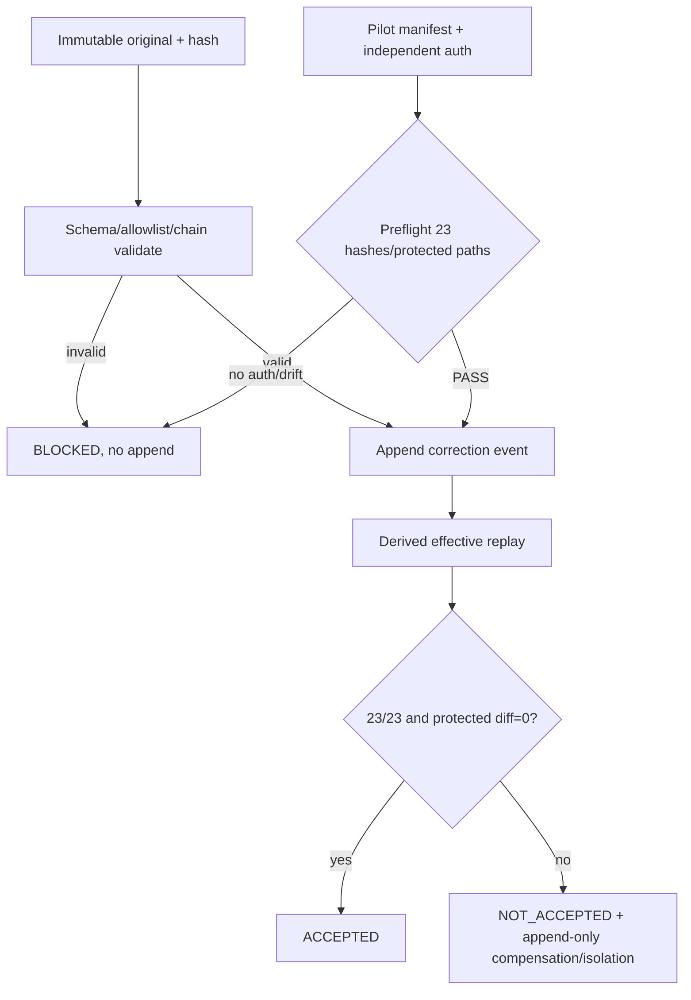

# LLD: ST-EI-007 — 建立 append-only correction 与 CR-163 pilot adapter

> 本 LLD 不授权也不执行真实 CR-163 pilot。CP5 只确认通用 correction、adapter dry-run/fixture 与授权边界。

## 0. 工程依据（上游设计）

| 来源 | 路径 / ID | 被本 LLD 消费的内容 |
|---|---|---|
| HLD | `CR046-EVIDENCE-INTEGRITY-HLD.md` §§5.5/6/7/9 | append-only correction、23-target pilot、protected diff、独立授权与回滚 |
| ADR | `CR046-EI-ADR-006/007/009/011` | 通用 correction、replay provenance、pilot adapter 边界、A/B ceiling |
| Feature Matrix | `CR046-FEATURE-DESIGN-MATRIX.md` | `full-lld` 与 MIG-EI-03 owner |
| Correction DESIGN | `cr046-correction/DESIGN.md` | schema、allowlist、supersession、pilot manifest、失败/权限合同 |
| Correction TEST-PLAN/TASKS | `cr046-correction/{TEST-PLAN,TASKS}.md` | CT-COR-01..08、TASK-EI-007-01..04 |
| Observability DESIGN | `cr046-observability/DESIGN.md` | replay/audit 依赖、legacy D3、A/B 结论口径 |
| Platform contract | `delivery/doc/PLATFORM-CONTRACTS.yaml` | runtime profile/model 未有 receipt 时保持 unavailable |
| Story | `STORY-ST-EI-007-correction-pilot.md` | 文件 owner、依赖、AC、禁止范围 |

## 1. 目标（Goal）

创建通用 versioned append-only correction lifecycle 与 CR-163 acceptance adapter，使关闭后证据可在不改写原历史的前提下被授权修正、supersede、replay 和审计；真实 CR-163 pilot 始终由独立授权门控制，业务源码写入保持为零。

## 2. 需求（Requirements：Functional / Non-Functional）

### 2.1 Functional

- RF-01：CorrectionEvent 包含 schema version、event identity、typed target ref、allowlisted patch、author、reason、evidence refs、created_at、supersedes；缺一拒绝。
- RF-02：correction 链必须无环、target 存在、supersedes 指向同一 target 的既有 correction；错误 correction 只能通过新 superseding event 修正。
- RF-03：原 canonical object bytes/hash 永不修改；apply 只向独立 correction ledger append，经 replay 生成 derived effective view。
- RF-04：allowlist 仅允许证据分类、correlation refs、terminal annotation、provenance availability 等治理字段；禁止改写业务 decision/value、原 timestamp、原 event identity 或已签发平台 receipt。
- RF-05：PilotManifest 包含 authorization ref、source root/route identity、immutable input hashes、23 个 target refs、planned append set、protected business paths、current checker identity、rollback append set。
- RF-06：没有独立、有效、scope 匹配的 authorization ref 时，只允许 synthetic fixture 和只读 dry-run；真实 apply 返回 BLOCKED。
- RF-07：pilot acceptance 需要 target replay `23/23 PASS`、protected business diff=0、append set 与 manifest 完全相等；否则不接受并隔离/追加补偿，不原位回滚。
- RF-08（MIG-EI-03）：R1/R2 legacy dispatch 的 `codex_agent_name` 仅迁移为 `source_level=D3`、`classification=self-declared-unverifiable`、`declared_profile=<原值>`；resolved profile/model/effort 必须 null/unavailable，不能由 TOML、task name 或 handoff 补齐。
- RF-09：pilot/replay 报告继承 ST-EI-006 的 A/B 分轴：无 runtime receipt 时 repository migration fixture 可 PASS，但不得提升 custom profile/model；CP7 最高 `PASS_WITH_RISK`、CP8 最高 `READY_WITH_RISK`。

### 2.2 Non-Functional

- RNF-01：append 是单 event 原子写；批次 apply 失败时已写事件可识别、可隔离，并由后续补偿/superseding events 收敛。
- RNF-02：所有输入、planned append set 与输出 report 使用 sha256 manifest；任一 drift 100% BLOCKED。
- RNF-03：未授权真实 pilot、credential/runtime/production write/publish/trading 次数=0；quant-lab lineage business source diff=0。
- RNF-04：23-target fixture replay 23/23；非法 allowlist、缺字段、dangling/cycle、protected diff 拒绝率 100%。
- RNF-05：adapter 依赖 Meta Flow 通用接口，不 import quant-lab 业务模块；跨仓路径只来自显式 route/manifest。

## 3. 模块拆分与职责

| 模块 / 文件组 | 职责 | 说明 |
|---|---|---|
| `meta_flow/evidence/correction.py` | schema、allowlist、链校验、append、effective replay、补偿/rollback contract | 通用能力，不含 CR-163 特例 |
| `meta_flow/evidence/pilot_adapter.py` | PilotManifest、authorization/protected-path preflight、23-target dry-run/apply plan、acceptance report | 不 import quant-lab business code |
| `meta_flow/workflow/cr_lifecycle.py` | CP8 后 correction policy/admission hook | 只调用通用 correction API |
| `meta_flow/cli.py` | correction validate/append/replay 与 pilot plan/check/apply 命令 | apply 必须显式 authorization ref |
| `tests/test_cr046_correction.py` | CT-COR-01..08、MIG-EI-03、partial failure、authorization/protected paths | 真实 pilot 不运行 |

## 4. 代码结构与文件影响范围

| 动作 | 文件路径 | 变更内容 |
|---|---|---|
| 创建 | `meta_flow/evidence/correction.py` | CorrectionEvent、allowlist、chain validator、append/replay/compensation |
| 创建 | `meta_flow/evidence/pilot_adapter.py` | PilotManifest、dry-run/preflight、acceptance result、legacy mapping adapter |
| 创建 | `tests/test_cr046_correction.py` | CT-COR-01..08、23 fixture、MIG-EI-03、权限/部分失败测试 |
| 修改 | `meta_flow/workflow/cr_lifecycle.py` | post-close correction admission 与 lifecycle refs |
| 修改 | `meta_flow/cli.py` | 注册通用 correction/pilot 子命令与授权门 |

禁止修改 quant-lab lineage 业务源码、`process/archive/**` 原文件、历史 ledger/result、credentials/runtime/production target；本 Story 不创建真实 CR-163 append event。

## 5. 数据模型与持久化设计

| 对象 / 字段 | 类型 | 约束 | 说明 |
|---|---|---|---|
| `CorrectionEvent` | JSON object | `schema_version,event_id,target_ref,patch,author,reason,evidence_refs,created_at` 必填 | append-only canonical event |
| `target_ref` | typed ref | namespace + stable id + source hash | 不允许 fallback identity |
| `patch` | list of operations | path 在 versioned allowlist；只允许 replace/add annotation/ref | 禁止删除/改原 identity/timestamp/decision |
| `supersedes` | correction event ref/null | 同 target、存在、无环 | 修正旧 correction，不删除旧项 |
| `CorrectionLedgerManifest` | object | ledger path/route、prefix hash、event hashes | append 前后完整性 |
| `EffectiveEvidenceView` | derived object | original + ordered valid correction chain | 不落回原对象 |
| `PilotManifest` | object | authorization、23 targets、input hashes、append/protected/rollback sets、checker | 无授权仅可 dry-run |
| `PilotResult` | object | planned/applied/replayed counts、protected diff、decision、evidence refs | fixture 与 real execution 明确 `execution_mode` |
| `LegacyProfileAnnotation` | object | declared_profile、D3 classification、resolved fields unavailable | MIG-EI-03 输出 |

默认 correction ledger 由调用方在 process route 内显式提供，例如 `process/state/CORRECTION-LEDGER.ndjson`；代码不硬编码目标项目绝对路径。每行 canonical JSON，一行一个 event；追加使用现有安全 append primitive 或等价 fsync/short-write 检查。

## 6. API / Interface 设计

| 接口 / 入口 | 输入 | 输出 | 调用方 | 说明 |
|---|---|---|---|---|
| `validate_correction(event, original, chain, policy)` | event、target bytes/hash、既有链、allowlist version | validated event/findings | CLI/lifecycle | 任一 finding strict reject |
| `append_correction(path, validated_event, expected_prefix_hash)` | ledger path、event、prefix hash | append receipt + new prefix hash | Host | short write/OSError 不得报告成功 |
| `replay_corrections(original, chain)` | immutable original + validated ordered chain | effective view + chain digest | replay/audit | 不写 original |
| `classify_legacy_agent_name(event)` | legacy R1/R2 event | D3 annotation | pilot/replay migration | resolved 字段固定 unavailable |
| `build_pilot_manifest(route, targets, authorization, checker)` | explicit refs + hashes | immutable manifest | Host/QA | target count 必须 23 |
| `preflight_pilot(manifest, workspace_snapshot)` | manifest + current hashes/diff | PASS/BLOCKED findings | Host/QA | 无 authorization 或 drift BLOCKED |
| `apply_pilot(manifest, correction_events)` | preflight PASS + exact append set | PilotResult | Host，另行授权后 | 本 CR 当前不得调用真实目标 |
| CLI `meta-flow evidence correction validate|append|replay` | files/refs/policy | JSON + exit code | Host/QA | append 需 expected prefix hash |
| CLI `meta-flow evidence pilot plan|check|apply` | manifest/route/auth ref | JSON + exit code | Host/QA | `apply` 缺 auth 100% BLOCKED |

## 7. 核心处理流程

1. 读取 original target bytes 并验证 typed ref/source hash；不允许 identity fallback。
2. 解析 correction schema 与 versioned allowlist，验证 required fields、patch paths、evidence refs。
3. 构建 target-specific supersession graph，拒绝 dangling/cross-target/cycle。
4. 比较 expected prefix hash 后原子 append 单个 correction；记录 append receipt。
5. replay 时从原对象开始，按 causal order 应用仍有效的 correction chain，生成 derived view/digest。
6. pilot adapter 先验证独立授权、route、23 target hashes、checker identity、protected paths 和 exact append set。
7. 无授权只输出 fixture/dry-run plan；有授权才可进入 apply。任一 input drift 在写入前 BLOCKED。
8. apply 后对 23 targets current replay，校验 23/23、protected diff=0 与 append set equality；否则结果 NOT_ACCEPTED，隔离本批 events并按 rollback set追加补偿。
9. legacy dispatch 仅添加 D3 annotation；无平台 receipt 时保持 A-baseline result ceiling。

## 8. 技术细节（Technical Design）

- schema version：初版 `meta-flow.correction/v1`；未知 major strict reject，未知 optional minor 字段保留但不执行。
- allowlist：由 typed target namespace + schema version 解析；patch path 必须精确匹配，不接受任意 JSON Pointer 前缀。
- ordering：使用 correction causal link/supersedes 加 `created_at,event_id` 作稳定 tie-break；不得让时间戳单独决定 supersession。
- cycle detection：对每 target correction graph 使用 DFS/color 或 Kahn，dangling/cross-target 先行拒绝。
- append：校验 prefix hash 后以单行 canonical JSON 追加；flush/fsync；重新读取尾行与 prefix hash确认。失败不生成 completed receipt。
- partial batch：不宣称多文件事务。PilotResult 明确 `planned/appended/verified` sets；已 append 事件不删除，通过隔离标记或 superseding compensation event 收敛。
- authorization：ref 必须可解析到仍有效、明确 target repo/CR/action/expiry 的授权 evidence；“CP3/CP5 批准设计”不等价于真实 pilot apply 授权。
- protected diff：以 manifest 中 path patterns + baseline hashes 计算；业务源码任何 diff 都令 pilot NOT_ACCEPTED。
- MIG-EI-03：`codex_agent_name` 只映射 declared 字段；严禁读取 `.codex/agents/*.toml` 后推断 resolved profile/model/effort。
- A/B：pilot migration correctness 与 platform runtime attestation 分轴；无 receipt 时仍只能 A-baseline。

## 9. 安全与性能设计

| 维度 | 设计措施 | 验证方式 |
|---|---|---|
| 授权 | plan/check 与 apply 分离；apply 必须独立 authorization ref、scope 和 freshness | 缺失/过期/错 scope fixtures 100% BLOCKED |
| 路径安全 | route-root allowlist、realpath containment、symlink mutation recheck | path traversal/symlink negative tests |
| 历史完整性 | original/prefix hashes 前后不变；只 append correction | pre/post hash assertion |
| 业务隔离 | protected paths manifest；adapter 不 import quant-lab business modules | import scan + git diff fixture |
| 平台证明 | legacy D3 与 resolved facts 分离；无 receipt 不 attested | MIG-EI-03 golden fixture |
| 性能 | 单 target 链 O(n)，23-target pilot O(total events)；无全局持久索引 | synthetic characterization |

## 10. 测试设计

| 测试场景 | 前置条件 | 操作 | 预期结果 | 验证方式 |
|---|---|---|---|---|
| CT-COR-01 合法 correction | valid target/allowlist | validate+append+replay | append 1、effective view正确、original hash不变 | unit/golden |
| CT-COR-02 非法字段 | 非allowlist或缺 author/reason/evidence | validate | 100% reject、append 0 | parametrized negative |
| CT-COR-03 dangling/cycle | 错 supersedes 图 | validate chain | reject并给 typed finding | graph fixtures |
| CT-COR-04 修正 correction | 已有错误 correction | append superseding event | 旧事件保留，新 effective view正确 | chain replay |
| CT-COR-05 无授权/protected diff | manifest auth缺失或业务 diff | preflight/apply | BLOCKED、业务写入0 | authorization/path fixtures |
| CT-COR-06 23 targets | synthetic immutable manifest | plan/check + replay | 23/23，protected diff=0；明确 fixture/dry-run | integration fixture |
| CT-COR-07 MIG-EI-03 | legacy `codex_agent_name` | migrate/replay strict | D3 self-declared；resolved fields unavailable | golden JSON |
| CT-COR-08 partial failure | 第 N 次 append short-write/OSError 或 replay fail | apply batch | NOT_ACCEPTED；sets精确；原历史不改；补偿可重放 | fault injection |
| A/B result ceilings | runtime receipt unavailable | render CP7/CP8 assessment | 最高 PASS_WITH_RISK/READY_WITH_RISK | decision-table unit |
| real pilot guard | 无独立 real authorization | CLI `pilot apply` | 非零/BLOCKED，目标仓写入0 | CLI integration |

## 11. 实施步骤

| TASK-ID | 动作 | 目标文件 | 详细描述 | 对应测试 |
|---|---|---|---|---|
| TASK-EI-007-01 | 创建 | `meta_flow/evidence/correction.py`, `tests/test_cr046_correction.py` | 定义 v1 schema、精确 allowlist、supersedes graph 与 validator | CT-COR-01..04 |
| TASK-EI-007-02 | 创建/修改 | `meta_flow/evidence/correction.py`, `meta_flow/workflow/cr_lifecycle.py`, `meta_flow/cli.py` | 实现 prefix-bound append、effective replay、partial failure/compensation 和 lifecycle CLI | CT-COR-01/04/08 |
| TASK-EI-007-03 | 创建/修改 | `meta_flow/evidence/pilot_adapter.py`, `meta_flow/cli.py`, `tests/test_cr046_correction.py` | 实现 manifest、独立授权门、protected paths、23-target fixture plan/check/apply guard | CT-COR-05/06、real pilot guard |
| TASK-EI-007-04 | 创建 | `meta_flow/evidence/pilot_adapter.py`, `tests/test_cr046_correction.py` | 实现 MIG-EI-03 D3 legacy mapping 与 A/B 分轴/结论上限 | CT-COR-07、A/B ceilings |

## 12. 风险、难点与预研建议

### 12.1 实现灰区与取舍记录

| Clarification ID | 问题 | 选项与推荐 | 决策 / 答案 | 影响面 | 证据 | 重访条件 |
|---|---|---|---|---|---|---|
| 无 | 是否在本 Story 执行真实 CR-163 pilot | 推荐：只实现通用 adapter、synthetic fixture/dry-run；备选：另获独立授权后执行 | 当前明确未授权，真实 pilot forbidden | 权限、测试、发布 | ADR-009、CP5 capsule/handoff | 用户提供 scope明确的独立 pilot授权后 |

| 风险 / 难点 | 影响 | 缓解措施 / 预研建议 |
|---|---|---|
| append-only 被误解为任意追加 | 无效 correction 污染 derived view | schema/allowlist/chain 全部预检；invalid append=0 |
| 多 event 无真实事务 | 部分成功 | 精确 planned/appended/verified sets；隔离与补偿 event，不删除历史 |
| CP5 approval 被误作 pilot授权 | 越权跨仓写入 | authorization action/scope/expiry 检查；当前 real apply测试必须 BLOCKED |
| legacy name 被提升到 resolved profile | 历史审计假阳性 | MIG-EI-03 固定 D3；resolved fields unavailable |
| A repository PASS 被当成 runtime profile PASS | CP7/CP8 过度结论 | 分轴 report + ceiling validation |

### OPEN / Spike 跟踪

| ID | 类型（OPEN / Spike） | 问题 | 下一动作 | 责任方 |
|---|---|---|---|---|
| 无 | N/A | 无阻塞 OPEN/Spike；真实 pilot 是授权门，不是设计未决项 | CP5 只审查设计 | Host / reviewer |

## 13. 回滚与发布策略

- 发布方式：先发布 schema/validator/replay 与 synthetic 23-target fixture；pilot `apply` 默认由 authorization guard 关闭。依赖 ST-EI-004/006 verified 后才进入 CP6。
- 回滚触发条件：original hash 变化、allowlist 逃逸、链误接受、partial failure sets 不准确、protected business diff 非零、未授权 apply 未被阻断。
- 回滚动作：禁用 append/apply CLI，保留 validator/read-only replay；已追加事件不删除，以隔离/新 superseding compensation event 修复；真实 pilot 若未独立授权则始终不开始。

## 14. DoD（Definition of Done）

- [ ] 14 个章节全部填写完成，`confirmed=false` 时不进入实现。
- [ ] CorrectionEvent schema、精确 allowlist、target/supersedes/cycle、append receipt、partial failure 与补偿规则均可编码。
- [ ] CT-COR-01..08 合法接受/非法拒绝符合预期，original/history hash mutation=0。
- [ ] MIG-EI-03 将 legacy `codex_agent_name` 固定为 D3 self-declared-unverifiable，resolved profile/model/effort unavailable。
- [ ] synthetic/dry-run 23-target replay=23/23；真实 CR-163 pilot 未执行且未授权目标写入数=0。
- [ ] protected business diff=0，quant-lab lineage business imports/writes=0。
- [ ] 无 runtime receipt 时 repository 与 runtime 结论分轴，CP7/CP8 不超过 PASS_WITH_RISK/READY_WITH_RISK。
- [ ] 文件影响、接口、测试、TASK-ID 一一映射；禁止路径写入数=0。
- [ ] OPEN/Spike 已清点为无；真实 pilot 独立授权条件已显式保留。

## 人工确认区

> **CP5 — Story 设计证据可实现性门**。批准本 LLD 不等于授权真实 CR-163 pilot，也不授权 commit/push。

| # | 检查项 | 状态 | 证据 |
|---|---|---|---|
| 1 | LLD 覆盖 AC | 待检查 | §§2/10/14 |
| 2 | 与 HLD / ADR 一致 | 待检查 | §§0/8/12 |
| 3 | 文件影响范围明确 | 待检查 | §§4/11 |
| 4 | 接口契约完整 | 待检查 | §6 |
| 5 | 测试与 dev_gate 可计算 | 待检查 | §§10/14 |
| 6 | clarification queue 已收敛 | 待检查 | §12.1 |

人工结论：`pending`；确认人/时间/意见/风险接受项均待 CP5 回填。
