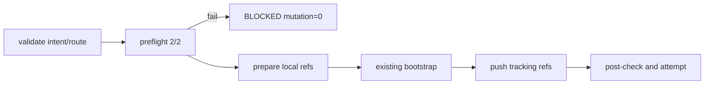

# LLD: ST-GB-001 — Paired Branch Open

## 修订记录

| 版本 | 日期 | 修订人 | 变更要点 |
|---|---|---|---|
| 1.0 | 2026-07-16 | host-orchestrator-inline/meta-dev | 冻结shared types、无写preflight、bootstrap断环、paired open与bare fixture。 |
| 1.1 | 2026-07-16 | host-orchestrator-inline/meta-dev | CP5独立评审精确化§3/6/7/13：固定CLI为`meta-flow cr branch-open`，并明确open后、publish前由operator提交bootstrap产物，工具不得auto-commit。 |

## 0. 工程依据与上游设计依据

工程依据：CP3 R3批准的HLD v1.2、ADR-R2-001/003、Feature Matrix、FEAT-GB-01 DESIGN/TEST-PLAN/TASKS、现有`workspace/git_sync.py`与`workflow/cr_lifecycle.py`。Git refs拥有ref truth；bootstrap writer拥有CR/state truth；本Story不建立branch DB。

## 1. 目标

创建共享branch lifecycle contract和显式open handler，使project/artifact两仓从各自fresh remote default exact OID创建同名CR branch并建立upstream；任一全仓preflight失败时新增local/remote ref=0。

## 2. 需求（Functional / Non-Functional）

- Functional：route发现2仓；校验clean/attached/default/ref collision；actual才fetch/default ff-only/local branch/bootstrap/push-u/post-check；dry-run只产plan。
- Non-Functional：相同snapshot输出plan digest一致；argv-only；remote写有publication authz；中途失败PARTIAL且resume字段100%。
- 禁止：auto stage/commit、force/reset/rebase/stash、隐式publish/merge/finish、真实remote fixture外写。

## 3. 模块拆分与职责

| 模块 | 职责 | 边界 |
|---|---|---|
| `meta_flow/workflow/git_branch_lifecycle.py` | dataclass/enum、open planner/executor、attempt聚合 | 不直接写CR/state |
| `meta_flow/workspace/git_sync.py` | typed `_git`结果、root/ref/default/upstream probe、allowlisted argv | 不决定workflow阶段 |
| `meta_flow/workflow/cr_lifecycle.py` | 显式coordinator在local prepare后复用bootstrap | 旧bootstrap默认行为不变 |
| `meta_flow/cli.py` | `meta-flow cr branch-open`独立入口、dry-run/output/authz | 不隐式调用下一动作 |
| `tests/test_git_branch_lifecycle.py` | bare remotes、command spy、fault injection | 不访问真实origin |

## 4. 代码结构与文件影响范围

| 动作 | 文件 | 内容 |
|---|---|---|
| 创建 | `meta_flow/workflow/git_branch_lifecycle.py` | shared types/policy/open planner/executor/result |
| 修改 | `meta_flow/workspace/git_sync.py` | timeout可控probe/ref helpers，不改变现有push默认行为 |
| 修改 | `meta_flow/workflow/cr_lifecycle.py` | 显式open coordinator接既有bootstrap writer |
| 修改 | `meta_flow/cli.py` | branch lifecycle子命令和help |
| 创建 | `tests/test_git_branch_lifecycle.py` | 临时bare repo fixtures |

## 5. 数据模型与持久化设计

内存对象：`BranchLifecycleIntent(operation,cr_id,branch,targets,remote,default,dry_run,authorization_ref)`；`RepositoryTarget(label,root,fingerprint,remote)`；`RefSnapshot(head,branch,dirty,upstream,default_ref,default_oid,cr_oid,observed_at)`；`PlanStep(repo,phase,argv,before_oid,expected_after,precondition)`；`BranchOperationAttempt(repo_outcomes,overall,resume_route)`。持久化只通过后续统一result/ledger adapter，open handler不另建数据库。

## 6. API / Interface设计

| 接口 | 输入 | 输出 | 调用方 | 错误 |
|---|---|---|---|---|
| `discover_branch_targets(root)` | project root | 1..2 RepositoryTarget | coordinator | route_invalid/duplicate_root |
| `observe_repo(target)` | target | RefSnapshot | planner/executor | not_git/default_unknown |
| `plan_open(intent,snapshots)` | typed input | immutable plan | CLI/coordinator | dirty/detached/collision/authz_mismatch |
| `execute_open(plan,runner)` | validated plan | Attempt | coordinator | PARTIAL/FAILED with repo terminal |
| `meta-flow cr branch-open` | CLI参数+authz | plan/attempt JSON | operator/Host | 非法输入或preflight失败时mutation=0 |

## 7. 核心处理流程

1. CLI解析并验证CR ID/branch/remote/default/authz；所有Git输入拒绝NUL/换行/leading option。
2. route发现唯一project/artifact roots，read-only observe 2/2；任一失败立刻BLOCKED。
3. dry-run序列化确定plan并返回，runner调用=0。
4. actual逐仓fetch/prune并将local default ff-only对齐remote；从exact OID创建local CR branch。
5. local准备完成后调用既有bootstrap writer；再逐仓普通`push -u` exact CR ref。
6. 每仓post-query验证remote OID和upstream；失败后不回滚，写PARTIAL/resume。

操作边界：`branch-open`可能调用bootstrap writer生成未提交的过程文件，但绝不自动stage/commit。operator必须在调用`meta-flow cr branch-publish`前审查并提交这些bootstrap产物，使两仓工作树满足publish的clean-tree门；没有新提交时publish只会发布open时已存在的OID，不会替operator制造提交。

## 8. 技术细节

默认分支通过remote symbolic ref或显式override解析，不假定`main`。ref通过`git check-ref-format --branch`或等价验证。runner固定`["git", *args]`、cwd=repo root、capture_output、timeout、check=false；结果只保留redacted stdout/stderr摘要。现有`push_workspace`API保持兼容，shared helpers不得改变其顺序/dirty行为。

## 9. 安全与性能设计

| 维度 | 措施 | 验证 |
|---|---|---|
| 安全 | argv-only、publication authz绑定repo/ref/OID、no-force、路径resolve且root唯一 | injection/authz/command-spy |
| 可靠性 | preflight-all、per-repo post-check、append-only PARTIAL | fault injection |
| 性能 | 每仓固定O(1) refs/probes；输出有界 | subprocess count断言 |

## 10. 测试设计

| 场景 | 操作 | 预期 | 方式 |
|---|---|---|---|
| clean 2/2 | open actual on temp bare | base/upstream exact 2/2 | integration |
| dirty/detached/collision/default unknown | plan/execute | BLOCKED，new refs=0 | negative |
| dry-run | open dry-run | plan覆盖2仓，mutation=0 | spy/ref snapshots |
| artifact push reject | inject failure | PARTIAL，已成功事实保留 | fault |
| illegal ref/authz mismatch | invoke | subprocess=0 | unit |
| existing git_sync tests | full subset | no regression | pytest |

## 11. 实施步骤

| TASK-ID | 动作 | 文件 | 详细描述 | 测试 |
|---|---|---|---|---|
| TASK-GB-001-01 | 创建/修改 | lifecycle/git_sync | types、probe、validation、plan digest | unit |
| TASK-GB-001-02 | 修改 | lifecycle/cr_lifecycle/cli | coordinator、executor、显式入口 | bare positive/partial |
| TASK-GB-001-03 | 创建 | tests | negative/dry-run/compat fixtures | pytest |

## 12. 风险、难点与预研建议

| Clarification ID | 问题 | 决策 | 影响 | 重访 |
|---|---|---|---|---|
| none | 无blocking clarification | CP3 contract完整 | none | bootstrap复用出现隐式remote写 |

主要风险：bootstrap顺序循环、local准备后PARTIAL、默认分支解析差异。通过显式coordinator、事实保留、remote symref fixture缓解。OPEN/Spike=0。

## 13. 回滚与发布策略

实现以`meta-flow cr branch-open`新独立入口接线；旧bootstrap/workspace push不改默认语义。若回归失败，移除新CLI接线并保留types/tests调查；不自动删除用户refs。open后由operator审查并提交bootstrap产物，再进入`branch-publish`；发布只在本地fixture验证，真实open另行授权。

## 14. DoD

- [ ] 0–14章节、工程依据、模块拆分、代码结构、数据模型、API、流程、技术细节、安全、测试、实施、风险完整。
- [ ] SC-GB-01/07和TC-GB-001..003/009..010覆盖100%。
- [ ] dry-run/全局preflight失败mutation=0；禁止命令=0。
- [ ] 既有bootstrap/git_sync tests无回归。
- [x] CP5批准后`confirmed=true`，可按DAG进入实现。

## 人工确认区

- 结论：approved
- 审查人：user
- 风险接受：真实remote与独立QA不在本阶段授权。
