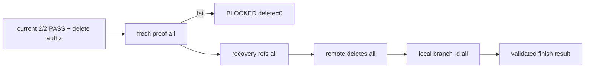

# LLD: ST-GB-003 — Proof-gated Finish

## 修订记录

| 版本 | 日期 | 修订人 | 变更要点 |
|---|---|---|---|
| 1.0 | 2026-07-16 | host-orchestrator-inline/meta-dev | 冻结current projection入口、fresh ancestry proof、recovery refs、remote→local cleanup与幂等。 |
| 1.1 | 2026-07-16 | host-orchestrator-inline/meta-dev | CP5独立评审修复§4/6/7/8/10/13：remote delete固定artifact→project，增加PARTIAL resume契约/fixture，并固定CLI为`meta-flow cr branch-finish`。 |

## 0. 工程依据与上游设计依据

工程依据为CP3 R3 HLD/ADR-R2-004、Domain INV-GB-10/11、Feature Matrix、FEAT-GB-03 pack、ST-GB-004 `PairedMergeProjection` contract和现有CR close writer。finish result可被close消费，但CR closed不能反向证明Git事实。

## 1. 目标

创建显式finish handler：只有current matching 2/2 merge PASS和独立delete authz满足时才fresh观察并证明tips；2/2 proof后创建recovery refs，先删两仓remote CR refs，再用`branch -d`删本地refs。

## 2. 需求（Functional / Non-Functional）

- current projection必须paired_complete=true且匹配CR/branch/tips；PARTIAL/old PASS拒绝。
- finish重新fetch/query identity/tip/protected/ancestry，不复用旧观察。
- positive proof仅exact known tip等于fresh default或是其祖先；squash/rebase/unknown fail closed。
- remote delete前2/2 recovery refs建立；两仓remote完成前local delete=0。
- dry-run mutation=0；force-delete/reset调用=0；恢复/幂等结果确定。

## 3. 模块拆分与职责

| 模块 | 职责 |
|---|---|
| finish gate | current projection与delete authz匹配 |
| proof builder | fresh refs、identity/protected/ancestry判定 |
| recovery manager | local namespaced exact OID refs、collision处理 |
| cleanup executor | remote deletes/post-check，然后local branch -d |
| result/close adapter | append-only attempt校验后供CR close消费 |

## 4. 代码结构与文件影响范围

修改`git_branch_lifecycle.py`、`git_sync.py`、`cr_lifecycle.py`、`cli.py`与`tests/test_git_branch_lifecycle.py`。CLI固定为`meta-flow cr branch-finish`。不修改state/current truth schema之外的存储，不接forge API，不自动push/delete recovery refs。

## 5. 数据模型与持久化设计

`DeleteAuthorization`绑定operation=finish、repo/ref/known tip/issuer/有效期；不可复用merge authz。`MergeProof(repo,known_tip,fresh_default,target_ref,ancestry,protected,source_conflicts)`。`RecoveryRef(name,oid,status)`为local-only `refs/meta-flow/recovery/<cr>/<fingerprint>`。Attempt记录proof/recovery/remote/local terminal和resume；不新建DB。

## 6. API / Interface设计

| 接口 | 输入 | 输出 | 调用方 | 错误 |
|---|---|---|---|---|
| `validate_finish_entry(intent,projection,authz)` | current projection+delete authz | allow/deny | CLI | partial/stale/authz_mismatch |
| `build_merge_proof(repo,known_tip,fresh)` | refs/policy | MergeProof | planner | ancestry_unproven/ref_drift/protected |
| `ensure_recovery_ref(repo,name,oid)` | local object/OID | created/NO_CHANGE | executor | collision/object_missing |
| `execute_finish(plan)` | 2/2 proofs/recovery | Attempt | Host | PARTIAL/post_verify_failed |
| `meta-flow cr branch-finish` | current projection+delete authz | finish attempt | operator/Host | proof/authz/PARTIAL不满足时delete=0或受控resume |

## 7. 核心处理流程

1. 校验current paired projection、CR/branch/tips和独立delete authz；失败subprocess mutation=0。
2. fresh fetch/query 2/2 CR/default refs，解析known exact tips与protected refs。
3. 证明known tip是fresh default祖先或相等；2/2全部通过前不建recovery/不删。
4. 创建/reuse两仓local recovery refs；同名不同OID或对象缺失BLOCKED。
5. 固定按artifact→project顺序普通删除remote CR refs并逐仓验证absent；中途失败PARTIAL、local refs不删。该顺序与merge一致，便于复用有序plan和审计；删除不具备反向执行的额外安全收益。
6. 2/2 remote absent后执行local`branch -d`；最后result可供CR close。
7. PARTIAL resume必须生成新attempt并fresh重证：artifact已absent时，只有known tip仍可由可信recovery object重证才记`NO_CHANGE`并继续project；OID/identity/recovery冲突立即BLOCKED。两仓remote均fresh absent前，local delete始终为0。

## 8. 技术细节

ancestry用`merge-base --is-ancestor <known> <fresh-default>`或等价Git对象查询，returncode语义typed化。remote delete计划的repo order常量为`artifact, project`，不得按输入遍历顺序漂移。remote absent幂等只在known tip可重证/有可信recovery object时继续；不能用“branch不存在”自动PASS。recovery ref名称含repo fingerprint，避免两仓冲突；不同OID collision fail closed。resume不得复用旧post-check，必须fresh query/proof并追加新attempt。

## 9. 安全与性能设计

delete authz最小化；ref validation；remote删除不含force，本地只`branch -d`。禁止`branch -D`、reset/rebase、patch-id猜测。每仓固定fetch/ref/ancestry/recovery/delete/post-query，输出redacted有界。

## 10. 测试设计

| 场景 | 预期 | 方式 |
|---|---|---|
| current 2/2 PASS+ancestry | proof→recovery→remote→local | bare |
| merge PARTIAL/old result/default drift | BLOCKED,delete=0 | negative |
| squash/non-ancestor/unknown tip | BLOCKED,target refs retained | proof fixture |
| recovery same/different OID | NO_CHANGE/BLOCKED | unit+bare |
| first remote delete pass, second fail | PARTIAL,local delete=0,recovery retained | fault |
| resume after artifact absent/project present | fresh重证artifact为NO_CHANGE，再删project；2/2 absent后才local delete | fault+integration |
| remote absent idempotent | only with known proof; safe continue | integration |
| dry-run/forbidden delete | mutation=0,force/branch-D=0 | spy |

## 11. 实施步骤

| TASK-ID | 动作 | 文件 | 描述 | 测试 |
|---|---|---|---|---|
| TASK-GB-003-01 | 修改 | lifecycle | entry gate/proof/authz types | unit |
| TASK-GB-003-02 | 修改 | lifecycle/git_sync | recovery/remote/local executor | bare/fault |
| TASK-GB-003-03 | 修改 | lifecycle/cr_lifecycle/cli/tests | result→close接线、drift/idempotence/spy | pytest |

## 12. 风险、难点与预研建议

clarification=0。风险：squash/rebase不可证明、对象删除后OID不可达、remote partial。分别以fail closed、delete前local recovery refs和remote→local顺序缓解。trusted forge receipt为future adapter CR，不在本设计弱化proof。

## 13. 回滚与发布策略

`meta-flow cr branch-finish`默认需要显式delete authz；旧CR close不隐式删除。remote delete固定artifact→project，PARTIAL恢复以fresh新attempt继续而非反向补偿。若proof/cleanup回归失败，禁用finish CLI并保留branches/recovery refs；不得force cleanup。真实remote删除需另行用户授权。

## 14. DoD

- [ ] 工程依据/目标/需求/模块拆分/代码结构/数据模型/API/流程/技术细节/安全/测试/实施/风险/DoD完整。
- [ ] SC-GB-06/07与TC-GB-006..011/015/017覆盖。
- [ ] proof失败remote/local delete=0；recovery before remote 2/2；local after remote 2/2。
- [ ] force/branch-D/reset调用=0，dry-run mutation=0。
- [x] CP5批准后confirmed=true；ST-GB-004未verified前仍不得实现。

## 人工确认区

- 结论：approved
- 审查人：user
- 风险接受：squash/rebase fail-closed、真实remote delete和独立QA未验证。
