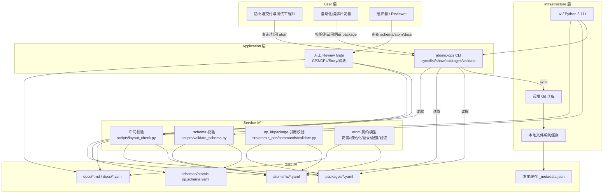
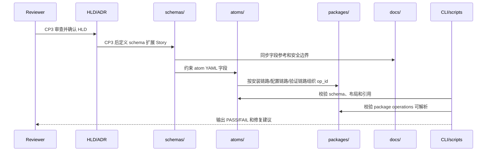
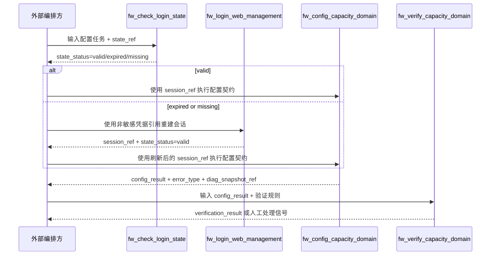

# 高层设计（HLD）：atomic-ops 防火墙安装、初始化、登录态、配置与验证链路

> 基于已确认的 `UC-05..UC-10` 与 `R-F-012..R-F-021` 输出。本文档只作为 CP3 HLD 评审输入；CP3 人工确认前，不输出 `process/ARCHITECTURE-DECISION.md`、`process/STORY-BACKLOG.md`、`process/DEVELOPMENT-PLAN.yaml` 或 `process/stories/STORY-*.md`。

## 修订记录

| 版本 | 日期 | 修订人 | 变更要点 |
|---|---|---|---|
| 1.0 | 2026-05-18 | meta-se acting_role on default agent | 初版 HLD：完成问题定义、候选方案对比、推荐架构、5 层架构图、模块契约、NFR、风险、ADR 候选和分阶段落地建议。 |
| 1.1 | 2026-05-18 | meta-se acting_role on default agent; agent_type=default; native_custom_agent_loaded=false | 按 CR-002 修订 CP3 HLD：关闭 F-001/F-002/F-003，补齐 schema 扩展字段族、状态引用边界、敏感信息与高风险 gate 机器校验入口、多设备批次配置契约、命名与参数校验规则、UC-to-design 追溯表和 CP4 Story 拆分规则。 |

## 1. 问题定义

### 问题陈述

`atomic-ops` 当前已经具备 schema v1、示例 atom、package 过滤视图、本地 CLI 同步与只读查询能力，但尚未把 `.input/ngfw-install/` 与 `.input/capacity/` 中的防火墙安装、初始化、Web 登录、登录态守卫、capacity 配置接口族、安装/配置后验证与诊断能力转化为本仓库原生交付物。受影响用户是防火墙交付与测试工程师、自动化编排开发者；当前影响是主链路只能停留在参考资料层，无法用 `atoms/`、`schemas/`、`packages/`、`docs/` 和 CLI 校验能力形成可评审、可追溯、可后续实现的 atomic-op 基线。

### 核心价值

- 将高风险设备变更链路拆成可审查的原子操作契约，减少把破坏性脚本直接搬入产品面的风险。
- 用本仓库 README 定义的原生交付面承载设计，不引入 `delivery/` 或外部项目运行目录假设。
- 在不保存敏感认证载荷的前提下，给登录状态和配置前重登守卫提供可复用的最小状态模型。
- 让配置执行与验证诊断形成闭环，使后续 Story 能按 schema、atom、package、docs、CLI、scripts 分层实施。

### 目标

| 优先级 | 目标 | 度量方式 |
|---|---|---|
| P0 | 覆盖 `R-F-012..R-F-021` 与 `R-C-008..R-C-014` 的架构承载点 | CP3 追溯矩阵中 10 条功能需求、7 条约束需求、5 条非功能需求均有模块或流程映射，未映射数量为 0 |
| P0 | 保持 README 原生交付面 | HLD 中正向交付目录只包含 `atoms/`、`schemas/`、`packages/`、`docs/`、`src/atomic_ops/`、`scripts/`、`pyproject.toml`、`uv.lock`；`delivery/` 只允许作为禁止项或反例出现 |
| P0 | 不把真实设备执行描述为当前 CLI 已具备能力 | 所有真实安装、初始化、登录、配置动作均表述为 atom 契约或后续 executor 设计输入；当前 CLI 能力仍限定为 sync/list/show/packages/validate |
| P0 | 敏感信息零落盘 | HLD、后续 atom、docs、scripts 中真实 IP、token、cookie、FTP 凭据、原始默认密码数量为 0；唯一允许显式出现的密码策略值为 `Ngfw@123` |
| P1 | 明确登录状态最小模型 | HLD 至少定义 1 个不含原始密码、完整 token、cookie 的 `session_ref`/`state_ref` 模型，并给出持久化边界 |
| P1 | 明确配置后验证粒度 | HLD 至少列出 10 个 capacity 配置域及其统一返回契约，并给出接口族验证分层策略 |
| P1 | 支持多设备批次配置契约 | HLD 定义 1 个设备清单引用模型、1 个批次配置 envelope、1 个并发上限、1 个失败隔离策略和 1 个批次验证汇总模型；当前 CLI 真实设备动作数量保持 0 |

### 成功标准

- [ ] `process/HLD.md` 包含 13 个主章节和 1 个修订记录表，且 `confirmed: false`。
- [ ] 候选方案数量为 3 个，且每个方案都有优点、缺点、复杂度、成本、扩展性、风险、适用前提。
- [ ] 推荐方案给出 User / Application / Service / Data / Infrastructure 五层 Mermaid 架构图。
- [ ] 集成契约表至少覆盖 8 个模块，每个模块包含调用方向、调用时机、输入、输出、错误处理、降级策略和调用方同步修改范围。
- [ ] 前置校验与失败路径至少覆盖 6 个执行阶段，且每个阶段有 fail-fast、降级或回退行为。
- [ ] 回退决策表至少覆盖 6 类用户修改/回退意图，避免模型自由裁量。
- [ ] CP3 自动预检 `process/checks/CP3-HLD-CONSISTENCY.md` 的 10 个 checklist 项均为 `PASS`，阻断项为 0。
- [ ] schema 扩展、状态引用、安全 gate、多设备批次配置、命名规范和参数校验各有不少于 1 个可机器检查规则或 CP4 进入条件。

### 约束

| 类型 | 约束内容 |
|---|---|
| 交付面 | production 项目只使用 README 原生目录：`atoms/`、`schemas/`、`packages/`、`docs/`、`src/atomic_ops/`、`scripts/`、`pyproject.toml`、`uv.lock`。 |
| 输入边界 | `.input/` 只作为参考资料，不复制源码、脚本、环境文件、日志、IDE 配置、虚拟环境或凭据。 |
| 当前 CLI 事实 | `atomic-ops` 当前只支持 sync/list/show/packages/validate，不连接真实设备，不执行 atom。 |
| schema 事实 | `schemas/atomic-op.schema.yaml` 使用 `additionalProperties: false`；新增顶层字段必须同步修改 schema 与字段参考文档。 |
| 安全 | 不持久化原始密码、完整 token、cookie、FTP 凭据或真实设备地址；失败默认诊断与人工处理，不自动回滚。 |
| 流程门控 | CP3 人工确认前不得拆 Story；HLD 通过后才允许输出 ADR、Story backlog、开发计划和 Story 卡片。 |
| Python | Python 代码、脚本和验证命令统一通过 `uv run` 或 `uv tool`，依赖以 `pyproject.toml` / `uv.lock` 为准。 |

### 非目标（Out of Scope）

- 不在 HLD 阶段创建或修改 atom YAML、schema 文件、package 清单、docs、CLI 源码、scripts、依赖文件。
- 不直接复制 `.input/ngfw-install/scripts/ngfwinstall_tool.py` 或 `.input/capacity/src/api_service/` 的实现。
- 不设计自动回滚为当前主基线能力；验证失败只输出诊断引用和人工处理信号。
- 不把 telnet、FTP、`verify=False`、日志目录规则、真实设备运行参数写成产品默认运行机制。
- 不在 CP3 前生成 `ARCHITECTURE-DECISION.md`、`PLATFORM-INSTALL-SPEC.md`、`STORY-BACKLOG.md`、`DEVELOPMENT-PLAN.yaml` 或 `STORY-*.md`。

### 关键假设

| ID | 假设 | 不成立时的处理 |
|---|---|---|
| A-01 | 本轮仍以 `UC-05..UC-10` 和 `R-F-012..R-F-021` 为唯一当前主基线。 | 新增或扩大范围必须创建新 CR，回退到 requirement-clarification。 |
| A-02 | capacity 配置域以 `.input/capacity/src/api_service/` 摘要中的接口、对象、ACL/策略、策略路由、静态路由、NAT、带宽、黑白名单、SSL VPN、动态路由为来源。 | 发现新增配置域时，通过 CR 追加需求并更新 HLD。 |
| A-03 | 当前产品允许在 schema v1 上做受控扩展以表达风险、凭据引用和状态契约。 | 若 CP3 拒绝 schema 扩展，则切换到方案 A，以 docs/atom v1 兼容方式先落地。 |
| A-04 | 登录状态可通过最小化引用表达，不需要保存原始认证载荷。 | 若必须落完整 token/cookie，则当前设计阻断，需要安全评审和新 CR。 |

### 缺失信息

| 优先级 | 缺失信息 | 影响范围 | 当前处理 | 决策所需时限 |
|---|---|---|---|---|
| BLOCKING | 无 | 无 | CP2 已确认，允许输出完整 HLD。 | 不适用 |
| REQUIRED | schema 扩展字段命名与版本号 | 影响 `schemas/` 与 `docs/schema-field-reference.md` Story | v1.1 已冻结字段族、schema_version 策略、兼容策略、现有 atom 迁移要求和字段参考同步范围；ADR-1 与字段冻结为 CP4 Story planning 进入条件。 | CP4 进入前 |
| REQUIRED | 配置域验证是否全部按接口族拆分 atom | 影响 `atoms/` 与 `packages/` 数量 | HLD 推荐分层：统一返回契约 + 接口族级验证 atom。 | CP4 前 |
| OPTIONAL | 未来是否加入自动回滚 | 影响后续场景、需求、安全策略 | 当前排除；如需加入必须新 CR。 | 后续版本 |

## 2. 候选架构方案对比

### 方案 A：schema v1 兼容的 atom/docs-only 方案

**核心思路**：不改 schema 和 CLI，仅用现有字段、docs 与 package 清单描述安装、初始化、登录、配置和验证能力。

| 维度 | 评估 |
|---|---|
| 优点 | 改动面最小；可快速增加 atom YAML 和文档；不影响现有 CLI 读取与校验。 |
| 缺点 | 登录状态、凭据引用、高风险门控只能放进自然语言 `preconditions`/`tags`；机器可校验性弱；后续 Story 容易把关键边界写散。 |
| 复杂度 | low |
| 实施成本 | 约 3-4 个 Story，主要写 atom/docs/package。 |
| 可扩展性 | 低到中；新增风险语义仍会反复绕过 schema。 |
| 风险 | 高风险设备变更缺少结构化 gate；凭据边界靠审查记忆维持。 |
| 适用前提 | CP3 明确禁止 schema/CLI 扩展，且只要求短期文档化基线。 |

### 方案 B：schema 受控扩展 + 原生目录交付方案（推荐）

**核心思路**：扩展 schema/docs/scripts/CLI 的校验与展示能力，但仍保持 CLI 不执行设备动作；用 atom 契约、状态引用、凭据引用、风险 gate、package 视图和验证脚本把业务链路结构化。

| 维度 | 评估 |
|---|---|
| 优点 | 能把登录状态、敏感边界和高风险设备变更做成可校验契约；仍符合 README 原生交付面；不引入外部执行运行时。 |
| 缺点 | 需要同步修改 schema、字段参考、示例 atom、CLI 展示/校验、scripts；Story 数量较方案 A 更多。 |
| 复杂度 | standard |
| 实施成本 | 约 5 个 Story，按 schema/docs、atom catalog、package、CLI校验展示、脚本验证分层。 |
| 可扩展性 | 高；后续可在确认后接入 executor 或测试编排，但不会污染当前只读 CLI。 |
| 风险 | schema 字段设计过宽会变成准执行模型；通过 ADR 限定“描述契约，不执行设备”。 |
| 适用前提 | CP3 接受 schema 受控扩展作为表达缺口的主路径。 |

### 方案 C：新增真实设备 executor/runner 方案

**核心思路**：在 `src/atomic_ops/` 中加入执行器，直接连接串口/Web/API，执行安装、初始化、登录、配置和验证。

| 维度 | 评估 |
|---|---|
| 优点 | 自动化闭环最完整；可直接运行安装与配置流程。 |
| 缺点 | 与 README 当前“离线只读 CLI”事实冲突；会引入凭据、网络、超时、设备破坏性操作、回滚与审计问题；需求明确未确认真实设备执行能力。 |
| 复杂度 | high |
| 实施成本 | 8 个以上 Story，并需要安全设计、测试环境、凭据管理和设备隔离策略。 |
| 可扩展性 | 中；执行能力强但运行风险和环境耦合高。 |
| 风险 | 可能保存敏感信息或误操作设备；测试不可重复；CP2 范围不支持。 |
| 适用前提 | 用户新 CR 明确要求引入 executor，并提供隔离设备与凭据管理决策。 |

### 方案对比矩阵

| 维度 | 方案 A | 方案 B（推荐） | 方案 C |
|---|---|---|---|
| 满足 P0/P1 需求 | 70%，状态和 gate 语义弱 | 100%，所有需求有结构化承载点 | 100%，但越过当前范围 |
| 与 README 当前事实一致 | 高 | 高 | 低 |
| 敏感信息控制 | 中，依赖文档 | 高，schema/scripts/CLI 多层校验 | 低到中，需要另设凭据系统 |
| 后续可测试性 | 中 | 高 | 中，依赖真实环境 |
| 实施风险 | 低 | 中 | 高 |
| 长期扩展性 | 中 | 高 | 中 |

**推荐方案**：方案 B。理由：它是满足 CP2 支持缺口的最小结构化方案，同时坚持当前 CLI 不执行真实设备动作，不把 `.input/` 运行时资产或 `delivery/` 作为交付面。

## 3. 推荐方案总览

**复杂度模式**：`standard`

| 判定维度 | 依据 | 结论 |
|---|---|---|
| 需求规模 | 10 条功能需求、7 条约束需求、5 条非功能需求 | standard |
| 角色数量 | 2 个用户画像，6 个主场景 | standard |
| 状态流转 | 安装、初始化、登录、登录守卫、配置、验证共 6 段，含失败诊断分支 | standard |
| 平台适配 | 当前只面向本仓库 CLI 与文件系统，不做多平台安装 | simple |
| Story 拆解 | 预计 5 个 Story，需 CP3 后分 Wave | standard |

**系统核心思路**：
在现有 `atomic-ops` 离线规范库模型上增加“描述契约层”，不增加真实设备执行器。schema 扩展只表达风险等级、凭据引用、状态引用和验证域；atom YAML 描述业务动作与返回契约；package 组织安装链路、配置链路和验证链路；docs 解释状态/凭据边界；CLI 与 scripts 负责校验、展示和引用完整性。

**关键架构风格**：分层文件规范 + 离线校验 CLI + schema-first 契约治理。

**核心能力边界**：
- 做：定义安装、初始化、登录、登录态守卫、capacity 配置、健康检查/诊断的 atom 契约；扩展 schema 表达安全和状态边界；扩展 docs/package/scripts/CLI 支持离线校验和查询。
- 不做：真实设备连接、串口 telnet、FTP 下载、Web 登录执行、配置下发执行、自动回滚、凭据存储。

**关键依赖**：
- `schemas/atomic-op.schema.yaml`：单个 atom YAML 的权威结构契约。
- `docs/schema-field-reference.md`、`docs/error-codes.md`、`docs/engineer-handbook.md`：字段、错误、贡献和安全边界说明。
- `src/atomic_ops/`：CLI 读取、展示、package 和 validate 入口。
- `scripts/validate_schema.py`、`scripts/layout_check.py`：仓库级静态检查入口。
- `pyproject.toml` / `uv.lock`：Python 依赖与测试执行入口。

**产物形态**：
- Agent 数量：0 个交付 Agent。
- Skill 数量：0 个交付 Skill。
- 目标平台：`atomic-ops` production 仓库。
- 原生交付目录：`atoms/`、`schemas/`、`packages/`、`docs/`、`src/atomic_ops/`、`scripts/`、`pyproject.toml`、`uv.lock`。

## 4. 系统架构图

## 5. 高层模块与职责划分

| 模块名称 | 类型 | 职责 | 输入 | 输出 | 依赖 |
|---|---|---|---|---|---|
| Schema Contract | Schema | 定义 atom YAML 可机器校验的字段，包括现有 v1 字段和受控扩展字段族。 | `schemas/atomic-op.schema.yaml`、需求缺口 | schema 更新 | JSON Schema 2020-12 |
| Atom Catalog | Data | 承载安装、初始化、登录、守卫、配置、验证的单个 atom 契约。 | `.input` 摘要、HLD/ADR、schema | `atoms/fw/*.yaml` | Schema Contract |
| Package Views | Data | 将 atom 组织成安装链路、配置链路、验证链路等过滤视图。 | Atom Catalog | `packages/*.yaml` | Atom Catalog |
| Documentation Set | Docs | 解释字段、命名、安全边界、状态/凭据引用模型、工程师使用方式。 | HLD/ADR、schema、atoms | `docs/*.md`、必要模板 | Schema Contract、Atom Catalog |
| CLI Read Model | CLI | 保持同步、查询、展示、package 和引用校验；不执行设备动作。 | 本地缓存、atoms、packages、docs | stdout/stderr、退出码 | `src/atomic_ops/` |
| Repository Checks | Script | 校验布局、schema、敏感信息和 package 引用完整性。 | repo 工作树 | PASS/FAIL 输出 | `scripts/`、uv |
| Session State Contract | Contract | 定义 `session_ref` / `state_ref` 最小状态引用，不包含敏感认证载荷。 | 登录与守卫 atom | `returns.data` 契约、docs | Schema Contract、Documentation Set |
| High Risk Gate Contract | Contract | 定义安装、初始化、改密、配置等高风险动作的审查和执行边界。 | 高风险 atom | schema 字段族、docs gate | Review Gate、Repository Checks |
| Batch Configuration Contract | Contract | 定义多设备选择、设备清单引用、批次配置 envelope、并发上限、失败隔离、幂等键和批次验证汇总。 | 设备清单引用、配置域、状态引用、风险 gate | `batch_ref`、per-device result、summary envelope | Schema Contract、High Risk Gate Contract、Session State Contract |

### 集成契约

| 调用方向 | 调用时机 | 输入契约 | 输出契约 | 错误处理 | 降级策略 | 调用方同步修改范围 |
|---|---|---|---|---|---|---|
| CLI -> Atom Catalog | `list/show/validate` 读取本地缓存时 | `atoms/<device_type>/<op_id>.yaml` 符合 schema | JSON/YAML/table 或引用校验结果 | schema 或引用错误返回现有 CLI 错误对象，不连接设备 | 缓存完整但网络失败时继续只读并标记 stale | `src/atomic_ops/repository.py`、commands、tests |
| Repository Checks -> Schema Contract | 提交前或 CI 校验时 | schema 文件与 atom 文件 | PASS/FAIL，失败定位文件和字段 | fail-fast，退出非 0 | 无降级；结构错误必须修复 | `scripts/validate_schema.py`、docs 字段参考 |
| Atom Catalog -> Session State Contract | 登录与守卫 atom 定义时 | 登录结果或现有状态引用 | `session_ref`、`state_status`、`expires_hint`、`diag_snapshot_ref` | 状态缺失或过期返回状态错误类别 | 调用登录 atom 刷新状态；不无限重试 | atom YAML、docs、error-codes |
| Atom Catalog -> High Risk Gate Contract | 安装、初始化、改密、配置 atom 定义时 | 操作类型、风险等级、人工确认要求 | review gate 字段或文档化 gate | 缺少 gate 的高风险 atom 校验失败 | 若 schema 扩展未批准，转为 docs-only gate 并标记人工风险 | schema、scripts、docs |
| Atom Catalog -> Batch Configuration Contract | 多设备配置 atom 定义时 | `device_inventory_ref`、设备选择器、配置域、`session_ref`/`state_ref`、批次并发上限 | `batch_ref`、逐设备结果、批次验证汇总、失败设备列表 | 单设备失败只标记该设备失败，批次汇总返回 partial_failed；不自动回滚其他设备 | 批次能力未实现时退化为单设备 atom 契约，package 明确不提供批次视图 | atom YAML、package、docs、scripts |
| Package Views -> Atom Catalog | 查询 package 或校验 package 时 | package `operations` 列表 | 可解析 op_id 集合 | 找不到 op_id 返回 `OP_NOT_FOUND` 或 package 校验失败 | 无；package 不复制 atom | `packages/*.yaml`、CLI validate |
| Documentation Set -> Schema Contract | 字段参考更新时 | schema 字段集 | 字段参考与最小示例 | 字段不一致时文档检查失败 | 无；schema 是事实源 | `docs/schema-field-reference.md` |
| Review Gate -> HLD/ADR/Story | CP3 后进入规划时 | HLD confirmed、ADR 候选 | Story 输入边界 | CP3 未确认则阻断 | 回退到 HLD 修改 | `process/` 规划文件 |
| External Reference -> HLD/Atom Catalog | 只读参考阶段 | `.input` 摘要，不含敏感内容 | 抽象能力域 | 发现凭据或执行体复制时阻断 | 只保留能力名称和契约，不复制实现 | HLD、docs、atom 说明 |

### 模块边界规则

- `src/atomic_ops/` 只负责本地缓存同步、读取、展示与引用校验；不新增真实设备 executor。
- `schemas/` 只定义 atom 文件结构，不承诺真实执行语义。
- `atoms/` 描述操作契约、输入、返回、错误、前置/后置条件；不包含真实 IP、token、cookie、FTP 凭据或外部脚本片段。
- `docs/` 解释安全边界、字段含义和工程师使用方式；不作为凭据或运行日志存储位置。
- `scripts/` 提供仓库级校验，不直接连接真实设备。

### schema 扩展决策下限（关闭 F-001）

CP3 若批准方案 B，则 CP4 Story planning 进入条件必须同时满足以下 5 项；任一项缺失时不得生成 schema/docs/CLI/scripts Story：

| 决策项 | CP4 进入条件 | 兼容策略 |
|---|---|---|
| 字段族候选清单 | ADR-1 必须冻结 6 个字段族：`risk`、`credential_ref`、`state_ref`、`session_ref`、`gate`、`verification`；多设备能力额外冻结 `batch` 字段族。 | 字段族只表达 atom 契约和校验元数据，不表达真实 executor。 |
| schema_version | `schema_version` 继续使用字符串语义版本；当前候选值从 `"1.0"` 升为 `"1.1"`，不得在 CP4 使用未声明版本。 | schema 读取方必须接受现有 `"1.0"` atom；新增字段只要求 `"1.1"` atom 使用。 |
| 向后兼容 | 现有 atom 不强制补齐新增字段；只有标记为安装、初始化、登录、配置、验证或 high-risk 的新增/迁移 atom 必须使用新增字段族。 | `additionalProperties: false` 保持不变；新增字段必须在 schema 中显式声明。 |
| 现有 atom 迁移 | `atoms/fw/fw_verify_acl_rule.yaml` 必须在 CP4 明确迁移策略：保持 v1.0 不变，或新增 v1.1 示例；禁止静默改变其业务语义。 | 若迁移为 v1.1，必须同步更新 package 引用校验测试和字段参考示例。 |
| 字段参考同步范围 | `docs/schema-field-reference.md` 必须同步新增字段族、必填性、枚举、示例、禁止字段；`docs/error-codes.md` 必须同步新增错误码；`docs/naming-convention.md` 必须同步命名规则。 | schema、字段参考、示例 atom、CLI/scripts 校验规则必须同一 Story 或同一 Wave 合并，不允许跨 Wave 漂移。 |

字段族候选清单的最小语义如下：

| 字段族 | 候选字段 | 最小约束 |
|---|---|---|
| `risk` | `risk.level`、`risk.categories` | `level` 枚举为 `low/medium/high`；安装、初始化、改密、配置、多设备批次配置必须为 `high` 或显式说明低风险理由。 |
| `credential_ref` | `credential_ref.kind`、`credential_ref.ref` | 只允许引用外部凭据名或占位符，不允许明文密码、token、cookie、FTP 凭据。 |
| `session_ref` | `returns.data.session_ref` | 只允许返回不含认证载荷的引用字符串，长度范围 8..128，禁止包含 `token=`、`Cookie:`、`password`。 |
| `state_ref` | `inputs.state_ref`、`returns.data.state_ref`、`returns.data.state_status`、`returns.data.expires_at` | `state_status` 枚举为 `valid/expired/missing/invalid`；`expires_at` 使用 ISO 8601 或 `null`。 |
| `gate` | `gate.required`、`gate.reason`、`gate.approver_role`、`gate.evidence_required` | high-risk atom 必须 `gate.required=true`，且 `reason` 非空。 |
| `verification` | `verification.kind`、`verification.rules`、`verification.summary_ref` | 验证失败只输出诊断和人工处理信号，不出现自动回滚动作。 |
| `batch` | `batch.max_concurrency`、`batch.device_inventory_ref`、`batch.idempotency_key`、`batch.failure_policy` | `max_concurrency` 范围 1..5；`failure_policy` 枚举为 `isolate_failed_device/stop_batch_before_next_device`。 |

ADR-1 / 字段冻结必须在 CP4 的 Entry Criteria 中作为硬门禁记录；CP4 不得只写“后续再定字段”。

### session_ref / state_ref 生命周期与持久化边界（关闭 F-002）

当前版本将 `session_ref` / `state_ref` 仅定义为 atom 返回契约和外部编排上下文引用，不写入 CLI 本地缓存 `_metadata.json`，不由 CLI 解析为认证状态，也不由 CLI 展示完整引用值。

| 引用 | 生命周期 | 生成方 | 消费方 | 允许落盘位置 | 禁止字段和值 | 过期判定字段 | CLI 解析 / 展示 |
|---|---|---|---|---|---|---|---|
| `session_ref` | 单次登录成功后到 `expires_at`、显式失效或外部编排上下文结束；默认不得跨测试批次复用。 | 登录 atom 契约的外部执行方；HLD/atom 只描述返回字段。 | 登录守卫、配置 atom、验证 atom 的外部编排方。 | atom 示例可写占位符如 `session_ref: "<session-ref>"`；测试用例可引用非敏感占位符；外部编排运行态可自行持有。 | 原始密码、完整 token、cookie、FTP 凭据、真实设备地址、`Authorization` header、可直接复用的会话载荷。 | `expires_at`、`state_status`、`last_checked_at`。 | CLI `show/list/packages/validate` 只按 schema 校验字段存在性和类型；若展示示例，必须脱敏为 `<session-ref>`；不写 `_metadata.json`。 |
| `state_ref` | 从登录状态记录生成到状态过期、缺失、不可用或批次结束；状态失效后必须重新登录或返回 `expired/missing/invalid`。 | 登录 atom 或登录守卫 atom 契约的外部执行方。 | 登录守卫、配置前置条件、验证诊断 atom。 | atom 示例和测试用例只允许占位符；docs 可说明字段语义；不得写入 CLI 缓存元数据。 | 与 `session_ref` 相同；另禁止保存完整诊断日志、真实接口响应体和可反推出凭据的 header。 | `state_status`、`expires_at`、`checked_at`、`max_relogin_attempts=1`。 | CLI 不计算状态是否真实有效；只校验枚举、时间字段格式和禁止敏感模式。 |

### 多设备批次配置契约（CR-002 新增设计）

多设备配置是 atom/runner 契约和验证设计输入，不是当前 CLI 的真实设备执行能力。当前 CLI 仍只执行 sync/list/show/packages/validate，不连接设备、不下发配置、不读取真实会话。

| 设计点 | 约束 |
|---|---|
| 多设备选择 | 通过 `device_inventory_ref` 引用外部设备清单，设备选择器使用 `device_ids` 或 `labels`；HLD/atom/docs 不落真实 IP、用户名、token、cookie、FTP 凭据。 |
| 设备清单引用 | `device_inventory_ref` 只允许非敏感引用名、相对路径占位符或外部系统 ID；禁止内联真实设备地址和凭据。 |
| 批次配置契约 | 批次 atom 输入包含 `batch_ref`、`device_inventory_ref`、`device_selector`、`config_domain`、`params`、`state_ref`、`idempotency_key`；输出包含 `batch_status`、`per_device_results[]`、`failed_devices[]`、`verification_summary_ref`。 |
| 并发限制 | `batch.max_concurrency` 默认 1，最大 5；high-risk 配置默认 1，只有 CP4 明确风险理由和验证策略后才允许 2..5。 |
| 失败隔离 | 单设备失败不得污染其他设备结果；批次状态枚举为 `succeeded/partial_failed/failed/blocked`；失败设备进入 `failed_devices[]`，不自动回滚已成功设备。 |
| 幂等性 | 每个设备配置必须带 `idempotency_key`，生成规则为 `batch_ref + op_id + device_ref + config_domain + params_digest`；同一 key 重放必须返回相同或可解释的状态。 |
| 批次验证汇总 | 验证输出必须包含总设备数、成功数、失败数、跳过数、每个配置域结果和 `verification_summary_ref`；汇总不得包含真实响应体或敏感 header。 |
| 敏感信息边界 | 批次输入/输出只保留 `device_ref`、`session_ref`、`state_ref`、`diag_snapshot_ref` 这类引用；任何真实 IP、密码、token、cookie、FTP 凭据均触发 security gate 失败。 |

### 命名、参数校验与 atomic-ops 规范遵循（CR-002 新增设计）

| 对象 | 规则 | 机器检查入口 |
|---|---|---|
| `op_id` | 必须匹配 README 既有规范 `^(fw|tg|mock|sw)_[a-z]+_[a-z_]+$`；防火墙新 atom 使用 `fw_` 前缀；动词使用 `install/init/login/check/config/verify`；多设备批次使用 `fw_config_batch_<domain>`。 | `uv run --python 3.11 python scripts/layout_check.py`；CP4 可扩展 CLI validate。 |
| atom 文件路径 | 路径必须为 `atoms/<device_type>/<op_id>.yaml`；`device_type=fw` 时文件必须位于 `atoms/fw/`；文件名必须等于 `op_id + ".yaml"`。 | `uv run --python 3.11 python scripts/layout_check.py`。 |
| package 命名 | `package_id` 使用小写字母、数字和下划线；建议新增 `ngfw_installation`、`ngfw_capacity_config`、`ngfw_batch_config`、`ngfw_verification`；package 只保存 `operations` op_id，不复制 atom。 | `atomic-ops validate --package <name>` 或 `uv run atomic-ops validate --package <name>`。 |
| CLI/脚本命令 | CLI 不新增 `run/execute/apply/configure` 等真实设备动作命令；脚本命名使用 `<scope>_<check>.py`，例如 `security_gate_check.py`。 | README 命令清单、CLI help smoke test。 |
| 参数类型 | schema 必须声明 string/number/integer/boolean/object/array；枚举字段必须显式列出；范围字段必须给出 `minimum/maximum` 或文档化单位。 | `uv run --python 3.11 python scripts/validate_schema.py atoms/fw/<op_id>.yaml`。 |
| 必填/互斥 | high-risk atom 必填 `risk` 和 `gate`；状态相关 atom 必填 `state_ref` 或返回 `state_status`；`credential_ref` 与明文 `password/token/cookie` 互斥。 | schema 校验 + `security_gate_check.py`。 |
| 错误码映射 | 新增错误必须映射到 `docs/error-codes.md`；建议保留 CLI 级错误码 21..25，不复用为 atom 业务错误；新增安全检查错误码必须有退出码。 | 字段参考和错误码文档一致性检查。 |
| schema/docs 同步 | schema 新增字段必须同步 `docs/schema-field-reference.md`、最小合法示例、错误码或命名文档；同步范围不足时 CP4/CP6 不得通过。 | CP4 Story acceptance + CP6 自动检查。 |

## 6. 技术选型与理由

| 选型类别 | 选择 | 备选方案 | 选择理由 | 风险 |
|---|---|---|---|---|
| 运行时 | Python 3.11+ + uv | 系统 Python / pip | 与 README 和 AGENTS 约束一致，已有 `pyproject.toml` / `uv.lock`。 | 开发者绕过 uv 可能造成依赖不一致。 |
| 数据格式 | YAML atom + JSON Schema 2020-12 | Python 配置类 / 自定义 DSL | 与当前 schema 和仓库布局一致，可离线校验。 | schema 扩展需保持向后兼容策略。 |
| CLI 形态 | 现有 `argparse` CLI | 新增 Typer/Click 或 Web UI | 最小改动，避免引入新依赖。 | 输出格式扩展需要保持现有命令兼容。 |
| 状态模型 | 最小化状态引用：`session_ref` / `state_ref`，不含敏感载荷 | 文件持久化完整 token / 纯内存对象 | 满足登录态守卫需求且降低泄密风险。 | 后续 executor 若出现，需要重新设计真实存储边界。 |
| 风险门控 | schema 字段族 + docs + scripts 静态校验 | 只写文档 / 运行时审批系统 | 在当前离线产品边界内实现可机器检查的 gate。 | 字段设计过度会误导用户认为 CLI 可执行。 |
| 验证粒度 | 统一返回 envelope + 接口族级验证 atom | 只有统一验证 / 每个 API 一个 atom | 在覆盖和数量之间平衡；至少覆盖 10 个配置域。 | 具体 atom 数量需 CP4 拆解时控制。 |

## 7. 关键流程

### 主流程：从参考资料到可校验 atomic-op 契约

### 主流程：登录状态守卫与配置执行契约

### 前置校验与失败路径

| 阶段 | 前置条件 | 失败行为 | 回退/降级 |
|---|---|---|---|
| 安装 atom 契约定义 | 设备类型、安装包引用、完整性校验线索、风险 gate 存在 | 缺少风险 gate 或敏感值时校验失败 | 回退到 atom 设计，禁止提交 |
| 初始化 atom 契约定义 | 安装完成待验证状态、串口登录能力、三项最小初始化动作 | 出现 SSH/license 等未确认动作时失败 | 新建 CR 或删除扩边动作 |
| 登录 atom 契约定义 | 管理面可登录、目标密码策略引用、非敏感上下文 | 保存原始密码/token/cookie 时失败 | 改为凭据引用和 `session_ref` |
| 登录守卫契约定义 | 已存在状态引用模型、最大重登次数为 1 次 | 无限重试或隐藏在配置 atom 内时失败 | 拆为独立守卫 atom |
| 配置 atom 契约定义 | capacity 配置域、参数契约、登录守卫前置条件 | 未声明配置域或错误类别时失败 | 回退补字段或拆分 atom |
| 验证诊断契约定义 | 安装/配置结果、验证规则、诊断引用 | 默认自动回滚时失败 | 输出诊断和人工处理信号 |

### 回退决策表

| 用户意图关键词 | 回退目标 | 理由 | 后续动作 |
|---|---|---|---|
| `修改 HLD`、`调整方案` | `solution-design` | 架构未确认，仍在 CP3 前 | 修改 `process/HLD.md` 并重跑 CP3 自动预检 |
| `不要扩 schema`、`保持 v1` | 方案 A | 影响推荐方案核心决策 | 更新 HLD selected_option，CP3 重新审查 |
| `加入真实执行`、`连接设备` | requirement-clarification | 超出 CP2 当前范围且涉及安全边界 | 新建 CR，补场景/需求/安全评估 |
| `加入自动回滚` | requirement-clarification | 当前明确排除自动回滚 | 新建 CR，重评失败路径和风险 |
| `拆更多配置域` | story-planning | 不改变 HLD 主架构，只影响 Story 粒度 | CP3 通过后在 CP4 拆解时处理 |
| `补启用 SSH/license` | requirement-clarification | 改变初始化场景范围 | 新建 CR 更新 UC/R |
| `只改文档说明` | documentation 或对应 Story | 不改变架构契约 | CP3 后映射到 docs Story |

### 理论依据

- 场景与需求映射使用 Journey Mapping 思路：按安装、初始化、登录、守卫、配置、验证的用户旅程分段。
- 风险与失败路径使用 FMEA 思路：识别高风险设备变更、敏感信息、登录态失效、验证失败的触发信号与缓解。
- 质量属性使用 ISO 25010 类别：安全性、可靠性、可维护性、可移植性、易用性和性能。
- 检查点结构遵循本仓库 checkpoint-manager 的 IPD 四段结构：Entry Criteria、Checklist、Exit Criteria、Deliverables。

## 8. 非功能需求设计

| 质量特征 | 设计目标 | 实现手段 | 验证方式 |
|---|---|---|---|
| 安全性 | 真实 IP、token、cookie、FTP 凭据、原始默认密码落盘数量为 0 | schema/docs/scripts 禁止敏感字段；状态只保存引用；唯一允许显式密码策略值为 `Ngfw@123` | `rg` 敏感模式扫描 + review checklist |
| 可靠性 | schema、布局、package 引用任一失败时退出非 0 | `scripts/validate_schema.py`、`scripts/layout_check.py`、CLI validate | `uv run --python 3.11 python scripts/...` |
| 可维护性 | schema 字段、字段参考、示例 atom 同步变更，不允许漂移 | 单 Story 内同时修改 schema/docs/example/tests | CP4 Story acceptance + CI |
| 可测试性 | 每个新增 atom 可被 schema 校验；每个 package op_id 可解析 | atom YAML 最小合法示例、package validate | 单测、脚本校验、CLI validate |
| 性能 | 本地只读查询不因新增字段退化为网络请求；`list/show/packages/validate` 仍只读本地缓存 | 保持 repository 读取模型，新增字段解析在本地完成 | 本地命令 smoke test，确认无网络依赖 |
| 可移植性 | Linux/macOS/Windows 缓存模型不变 | 不新增平台特定路径；文档沿用 README 缓存目录 | 跨平台路径审查 |
| 可审计性 | 高风险 atom 100% 带 gate 语义或明确文档化 gate | schema 字段族、docs、scripts 检查 | CP3/CP4/验收审查 |

### 敏感信息与 high-risk gate 最小机器校验入口（关闭 F-003）

CP4 必须新增或等价实现 `scripts/security_gate_check.py`，并纳入 Story 验收；若选择扩展现有脚本，命令入口、退出码和规则必须保持以下最小契约。

| 项 | 最小设计 |
|---|---|
| 命令入口 | `uv run --python 3.11 python scripts/security_gate_check.py` |
| 检查对象 | `atoms/`、`packages/`、`docs/`、`schemas/`、`scripts/`、`src/atomic_ops/`；默认排除 `.git/`、`.venv/`、缓存目录和 `.input/` 原始参考目录。 |
| 成功退出码 | `0` |
| 敏感信息失败退出码 | `31`，输出命中文件、行号、规则名；不得回显完整敏感值。 |
| high-risk gate 失败退出码 | `32`，输出缺少 gate 的 `op_id` 和字段路径。 |
| 输入错误退出码 | `33`，用于路径不存在、YAML 解析失败或 schema 文件缺失。 |
| 敏感模式样例 | 命中 `(?i)(token|cookie|authorization|password|ftp_pass|secret)\s*[:=]\s*[^<\s][^\s]+` 且值不是允许占位符 `<...>` 或唯一允许密码策略 `Ngfw@123` 时失败。 |
| gate 判定样例 | 当 atom `risk.level=high` 或 `op_id` 匹配 `^fw_(install|init|login|config|config_batch)_` 时，必须存在 `gate.required=true` 且 `gate.reason` 非空。 |

该检查只做静态扫描和 YAML 字段校验，不连接设备、不解析真实凭据、不访问网络。

## 9. 主要风险与应对

| 风险 ID | 风险描述 | 概率 | 影响 | 应对策略 | 触发信号 |
|---|---|---|---|---|---|
| R1 | schema 扩展过度，被误解为 CLI 已能执行真实设备动作。 | 中 | 高 | 字段命名和 docs 明确“contract only”；CLI help 不新增 execute/run 命令。 | 文档出现“执行安装/下发配置”且未标注外部编排方。 |
| R2 | 登录状态引用设计不清，后续实现倾向保存完整 token/cookie。 | 中 | 高 | HLD 固定最小模型；scripts/docs 禁止敏感载荷；CP4 Story 写明验收。 | atom 或 docs 出现 token/cookie/password 字段默认值。 |
| R3 | capacity 配置域过多，Story 拆解膨胀。 | 高 | 中 | 用统一 envelope + 接口族级 atom 分层；CP4 限制首批配置域。 | Story 数超过 5 且能明显按域拆分。 |
| R4 | `.input` 参考实现被误复制成产品脚本。 | 中 | 高 | 只抽象能力域和契约；scripts 不连接设备；敏感/执行体扫描。 | 新文件包含 telnet/FTP 连接实现或 `.input` 路径依赖。 |
| R5 | 自动回滚被默认写入验证失败路径。 | 低 | 高 | 当前明确排除；失败只输出诊断引用和人工处理信号。 | 文档或 atom 出现 rollback/revert 自动动作。 |
| R6 | HLD 与 README 交付面不一致。 | 低 | 高 | CP3 检查交付目录白名单；不引用 `delivery/` 作为产物目录。 | HLD/Story 中出现 `delivery/` 产物路径。 |
| R7 | 多设备批次配置放大误配置影响面。 | 中 | 高 | 默认并发 1、最大 5；每设备失败隔离；high-risk gate 必填；批次验证汇总必须量化成功/失败/跳过数量。 | 批次 atom 缺少 `batch.max_concurrency`、`idempotency_key` 或 `failed_devices[]`。 |

## 10. ADR 候选决策点

> CP3 人工确认前仅在 HLD 中记录 ADR 候选，不生成 `process/ARCHITECTURE-DECISION.md`。

| ADR ID | 决策问题 | 建议决定 | 约束此决策的因素 |
|---|---|---|---|
| ADR-1 | 是否扩展 schema 表达风险、凭据引用、状态引用和批次配置 | 采用受控 schema 扩展，字段只描述契约，不表达执行器；ADR-1 / 字段冻结必须作为 CP4 进入条件 | `additionalProperties: false`、R-F-021、R-C-014、CR-002 |
| ADR-2 | 当前 CLI 是否增加真实设备执行能力 | 不增加；保持 sync/list/show/packages/validate | README 当前事实、敏感信息边界、CP2 范围 |
| ADR-3 | 登录状态持久化边界 | 使用不含敏感载荷的 `session_ref`/`state_ref`，不保存原始密码、完整 token、cookie | R-C-009、R-C-010、OI-002 |
| ADR-4 | 配置验证粒度 | 采用统一返回 envelope + 接口族级验证 atom，首批至少覆盖 10 个配置域 | R-F-018、R-F-020、OI-003 |
| ADR-5 | 验证失败处理 | 输出诊断引用和人工处理信号，不自动回滚 | R-C-012、OI-004 |
| ADR-6 | 多设备批次配置边界 | 当前只定义 atom/runner 契约、批次验证汇总和静态校验输入；CLI 不执行真实设备动作 | CR-002、多设备风险放大、README 当前 CLI 事实 |

## 11. 分阶段落地建议

| 阶段 | 交付物 | 里程碑标志 | 前提条件 |
|---|---|---|---|
| 阶段 1：schema 与文档契约 | `schemas/atomic-op.schema.yaml`、`docs/schema-field-reference.md`、`docs/error-codes.md`、示例说明 | 风险、凭据引用、状态引用字段族可被 schema 校验 | CP3 人工确认通过，ADR-1 初步接受 |
| 阶段 2：安装/初始化/登录链路 atom | `atoms/fw/*.yaml`、安装链路 package、docs 安全边界 | UC-05、UC-06、UC-07、UC-08 的 atom 契约通过 schema 校验 | 阶段 1 完成 |
| 阶段 3：capacity 配置、批次配置与验证 atom | 配置域 atom、批次配置 atom、验证 atom、配置/验证 package | 10 个配置域均有配置或验证契约；多设备批次契约包含并发、失败隔离、幂等和验证汇总；返回 envelope 统一 | 阶段 1 完成，阶段 2 状态模型可复用 |
| 阶段 4：CLI/scripts 校验增强 | `src/atomic_ops/` validate/show/list 适配新增字段，`scripts/security_gate_check.py` 或等价安全 gate 检查 | CLI 本地只读命令兼容新增字段；敏感信息失败退出 31，high-risk gate 失败退出 32，结构输入错误退出 33 | 阶段 1-3 atom/docs 初稿稳定 |
| 阶段 5：用户文档与验收 | `docs/USER-MANUAL.md`、`docs/engineer-handbook.md`、模板更新 | 用户能按 package 查到完整链路并理解不执行真实设备 | 阶段 1-4 通过验证 |

## 12. 工作量粗估

| 类别 | Story 数 | 预计 Wave 数 | 粗估工作量 |
|---|---:|---:|---|
| schema/docs 契约扩展 | 1 | 1 | M |
| 安装/初始化/登录/守卫 atom 与 package | 1 | 1 | M |
| capacity 配置/批次配置/验证 atom 与 package | 1 | 1 | L |
| CLI/scripts 校验与展示增强 | 1 | 1 | M |
| 用户文档与最终收口 | 1 | 1 | M |
| **合计** | **5** | **3** | **L** |

### HLD 拆分评估

| 判定信号 | 结果 | 说明 |
|---|---|---|
| 核心产物 > 1 | 否 | 只有一个核心产物：`atomic-ops` 原生交付面。 |
| 职责跨层 | 否 | 不设计 meta-flow 全局机制，只设计目标项目 HLD。 |
| Story 数量超阈 | 否 | 粗估 5 个 Story，未超过阈值。 |
| ADR 明显分簇 | 否 | ADR 均围绕 schema/atom/CLI 契约。 |
| 交付顺序可独立 | 部分 | 可分阶段实现，但共享 schema 与状态契约。 |
| 结论 | 不拆分 | 单份 HLD 保持完整性更高，CP3 后再拆 Story。 |

### CP4 Story planning 拆分规则（处理 F-004）

CP4 不得机械照搬上表 5 个粗粒度 Story。Story planning 必须按以下规则拆分或在 Story 卡中显式保留独立 TASK-ID、文件所有权和验收项：

| 领域 | 拆分规则 | 文件所有权要求 |
|---|---|---|
| schema/docs 契约 | 若字段族同时覆盖 `risk/gate/session/state/batch`，可保持 1 个 Story，但必须拆出独立 TASK-ID：字段冻结、schema 修改、字段参考、错误码、示例、测试。 | `schemas/atomic-op.schema.yaml`、`docs/schema-field-reference.md`、`docs/error-codes.md`、示例 atom 不得分属不同并行 Story。 |
| 安装/初始化/登录/守卫 | 可按链路合并为 1 个 Story，但至少拆 4 个 TASK-ID：安装、初始化、登录、登录守卫；每个 TASK-ID 必须列出 atom 文件、package 引用和验证入口。 | 同一 op_id 只允许 1 个 Story 拥有；package 修改必须声明依赖 schema/docs Story。 |
| capacity 10 域 | 若 1 个 Story 覆盖全部 10 域，必须列出首批 10 域清单和共享模板；若单个 Story 超过 10 个 atom 或 4 个 package 修改，必须拆为接口/对象/策略/路由/NAT/带宽/名单/VPN/动态路由等子 Story。 | 每个配置域的 atom 文件和验证 atom 必须同 Story 或同 Wave 交付，避免配置有契约而验证缺失。 |
| 多设备批次配置 | 必须独立 TASK-ID 或独立 Story；不得隐藏在单设备 capacity Story 内。 | 批次 atom、批次 package、批次验证汇总文档和 security gate 规则必须同批确认。 |
| CLI/scripts 守卫 | 安全 gate、schema 校验、package 引用校验、CLI 展示增强可为 1 个 Story，但必须声明 CLI 不新增真实设备执行命令。 | `scripts/security_gate_check.py` 与相关测试由同一 Story 拥有；不得与 atom catalog Story 并行写同一脚本。 |

## 13. 待确认问题

| 问题 ID | 问题描述 | 优先级 | 状态 | 影响范围 | 负责人 | 目标答复时间 |
|---|---|---|---|---|---|---|
| Q1 | 是否接受方案 B：受控扩展 schema 来表达风险、凭据引用和状态引用。 | REQUIRED | OPEN | schema/docs/CLI/scripts Story | 用户 / meta-po CP3 | CP3 人工确认 |
| Q2 | 配置域首批是否覆盖全部 10 个接口族，还是按风险和使用频率缩小首批范围。 | REQUIRED | OPEN | atom/package Story 数量 | 用户 / meta-se CP4 | CP4 Story 计划前 |
| Q3 | 是否需要为安装链路单独建立 package，例如 `ngfw_installation.yaml`。 | REQUIRED | OPEN | package 命名与用户查询体验 | 用户 / meta-se CP4 | CP4 Story 计划前 |
| Q4 | 是否保持自动回滚排除直到新 CR。 | OPTIONAL | RESOLVED_BY_BASELINE 2026-05-18 | 验证失败路径 | 用户 | 已由 CP2 默认确认 |
| Q5 | ADR-1 是否按 v1.1 字段族冻结 `risk/credential_ref/session_ref/state_ref/gate/verification/batch` 并设置 `schema_version="1.1"`。 | REQUIRED | OPEN_CP4_ENTRY_CONDITION | schema/docs/CLI/scripts Story | 用户 / meta-po CP4 | CP4 Story planning 进入前 |

## 14. 场景与需求追溯矩阵

### UC-to-design 追溯表

| UC | HLD 设计承载点 | 模块 | CP4 Story 输入 |
|---|---|---|---|
| UC-05 防火墙安装 | 安装 atom 契约、High Risk Gate Contract、安装链路 package、安装后健康检查流向 | Atom Catalog、High Risk Gate Contract、Package Views | 安装 TASK-ID、安装 package、gate 校验、健康检查引用 |
| UC-06 安装后初始化 | 初始化 atom 契约、最小初始化动作边界、改密 gate、初始化结果 envelope | Atom Catalog、High Risk Gate Contract、Documentation Set | 初始化 TASK-ID、状态输出字段、敏感信息扫描 |
| UC-07 登录并记录状态 | `session_ref`/`state_ref` 返回契约、禁止敏感载荷、CLI 不缓存认证状态 | Session State Contract、Schema Contract、CLI Read Model | 登录 atom、状态字段、字段参考、CLI 脱敏展示 |
| UC-08 登录态守卫与重登 | 独立守卫 atom、最大重登 1 次、`state_status` 失效分支 | Session State Contract、Atom Catalog、Repository Checks | 守卫 atom、状态过期规则、错误码与测试 |
| UC-09 capacity 配置 | 10 个配置域、统一配置结果 envelope、多设备批次配置契约、幂等和失败隔离 | Atom Catalog、Batch Configuration Contract、High Risk Gate Contract | 单设备配置 atom、批次配置 atom、配置 package、参数校验 |
| UC-10 健康检查、验证与诊断 | 安装健康检查、配置验证、批次验证汇总、诊断引用、无自动回滚 | Atom Catalog、Batch Configuration Contract、Documentation Set | 验证 atom、summary envelope、诊断引用、安全边界文档 |

| 需求 | 设计承载点 |
|---|---|
| R-F-012 | 安装 atom 契约、High Risk Gate Contract、安装链路 package。 |
| R-F-013 | 安装结果状态与后续健康检查流程，验证诊断 atom。 |
| R-F-014 | 初始化 atom 契约固定三项初始化动作，扩边必须 CR。 |
| R-F-015 | 初始化结果返回 envelope：初始化状态、密码策略应用状态、管理面可登录状态。 |
| R-F-016 | 登录 atom 契约和 Session State Contract。 |
| R-F-017 | 独立登录守卫 atom 与重登流程，最大重登 1 次，不隐藏在配置 atom。 |
| R-F-018 | capacity 配置域 atom/package，至少 10 个配置域。 |
| R-F-019 | 配置结果 envelope：配置类别、执行状态、错误类别、诊断引用。 |
| R-F-020 | 安装健康检查 atom、配置验证 atom、诊断输出和人工处理信号。 |
| R-F-021 | schema 受控扩展 ADR 候选、状态/凭据/gate 字段族。 |
| R-C-008 | `.input` 只读参考边界、复制执行体阻断。 |
| R-C-009 | 敏感信息零落盘 NFR 与脚本扫描。 |
| R-C-010 | Session State Contract 禁止原始认证载荷。 |
| R-C-011 | 本 HLD 不进入实现，CP3 前不写 Story/ADR 文件。 |
| R-C-012 | 验证失败只诊断与人工处理，不自动回滚。 |
| R-C-013 | High Risk Gate Contract 与 CP3/CP4/Story 门控。 |
| R-C-014 | CLI 不新增真实设备执行能力。 |
| R-NF-006 | 追溯矩阵保留 UC/R/CR 输入链。 |
| R-NF-007 | 每个模块和 Story 后续要求量化验收。 |
| R-NF-008 | 登录、配置、验证、敏感边界分模块表达。 |
| R-NF-009 | 推荐方案保持 README 离线只读 CLI 事实。 |
| R-NF-010 | CP2 到 CP3 门控由检查点文件承载。 |

<!-- meta-po 填写：CP3 HLD 人工确认记录 -->
## CP3 确认记录

**CP3 自动预检结果**：`process/checks/CP3-HLD-CONSISTENCY.md`  
**CP3 人工 checklist**：`checkpoints/CP3-HLD-REVIEW.md`

**确认状态**：approved

**审核意见**：用户原文：“通过，唤醒meta-se，插接stroy后，拉起子agent并行开展lld的设计。” meta-po 已接受 CP3 HLD 人工确认；后续进入 story-planning。CP4 Story plan 自动预检和人工确认未通过前，不得拉起 LLD 设计子 agent。

**确认人**：user

**确认时间**：2026-05-18T13:55:13+0800
