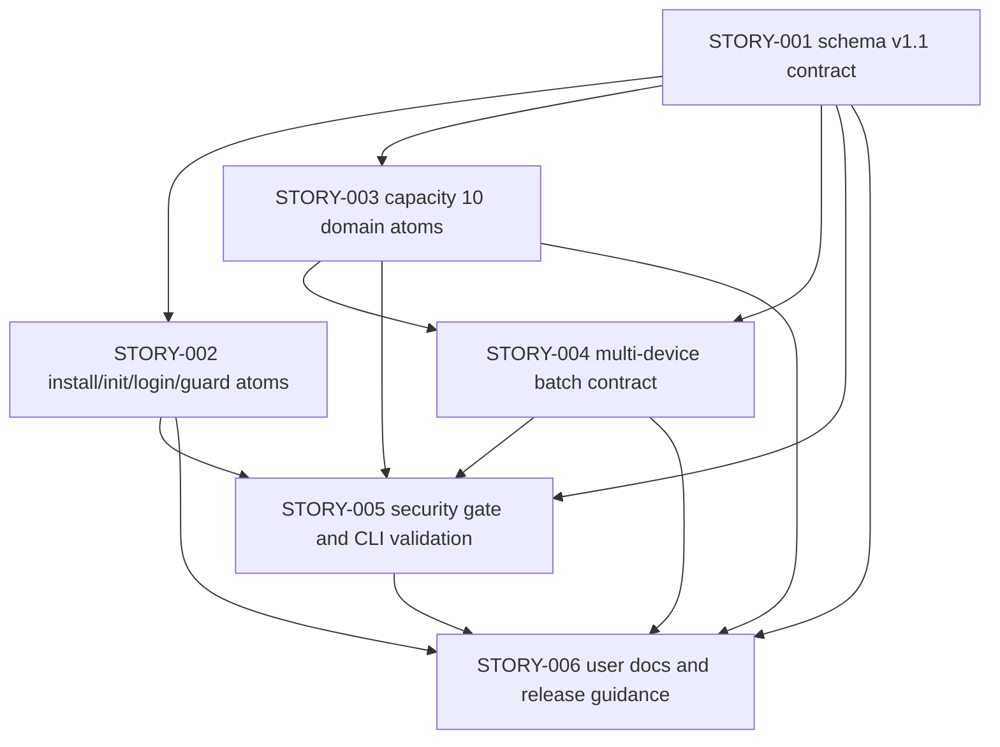

# Story Backlog：atomic-ops 防火墙安装、配置与验证契约

## 修订记录

| 版本 | 日期 | 修订人 | 变更要点 |
|---|---|---|---|
| 1.0 | 2026-05-18 | meta-se acting_role on default agent | 生成 CP4 Story backlog、Wave 分组、依赖类型、覆盖矩阵和阻塞项。 |
| 1.1 | 2026-05-18 | meta-po | 按 CR-003 回退 CP4 人工前置门控；CP4 自动预检 PASS 后允许全部目标 Story 进入 LLD 设计批次，CP5 批量人工确认仍阻断实现。 |

## Story 列表

| Story ID | 标题 | 优先级 | Wave | 状态 | 依赖 | 依赖类型 | 主要文件所有权 |
|---|---|---|---|---|---|---|---|
| STORY-001 | Freeze schema v1.1 contract and field docs | P0 | W1 | lld-ready | 无 | none | `schemas/atomic-op.schema.yaml`、字段/错误/命名文档 |
| STORY-002 | Model NGFW install init login guard atoms | P0 | W1 | lld-ready | STORY-001 | contract | 安装、初始化、登录、登录守卫 atom 与安装 package |
| STORY-003 | Model capacity ten domain config and verification atoms | P0 | W1 | lld-ready | STORY-001 | contract | 10 域配置/验证 atom 与 capacity/verification package |
| STORY-004 | Model multi-device batch configuration contract | P0 | W2 | lld-ready | STORY-001, STORY-003 | contract | 批次配置 atom、批次 package、批次验证汇总文档 |
| STORY-005 | Add read-only security gate and validation checks | P0 | W2 | lld-ready | STORY-001, STORY-002, STORY-003, STORY-004 | contract | `scripts/security_gate_check.py`、只读 CLI 校验增强 |
| STORY-006 | Update user-facing docs and release guidance | P1 | W3 | lld-ready | STORY-001, STORY-002, STORY-003, STORY-004, STORY-005 | runtime | README、USER-MANUAL、工程师手册、测试模板、CHANGELOG |

## Wave 分组

| Wave | LLD 并行 | 开发并行 | Story | 判定依据 |
|---|---|---|---|---|
| W1 | 是，建议首批 LLD 为 STORY-001、STORY-002、STORY-003，`max_parallel_lld=3` | 部分；STORY-001 必须先冻结契约，STORY-002/003 开发需等 STORY-001 contract frozen | STORY-001, STORY-002, STORY-003 | 三个 Story 的 LLD 文件唯一，primary 产品文件不重叠；STORY-002/003 对 STORY-001 是 contract 依赖 |
| W2 | 是，STORY-004/005 可在 W1 LLD 批次确认后设计 | 部分；STORY-005 需等待 atom/package 契约稳定后开发 | STORY-004, STORY-005 | 多设备批次独立 Story；安全 gate 消费上游 schema/atom/package 约束 |
| W3 | 否，文档收口单独进行 | 否 | STORY-006 | 用户文档依赖上游实现和验证结果，属于 runtime/收口依赖 |

## 推荐第一批 LLD 设计批次

按 CR-003，CP4 人工确认不再作为 LLD 前置门控。CP4 自动预检已 PASS，meta-po 计算全量 LLD 设计批次 `STORY-001`..`STORY-006`；首批调度窗口仍为：

| 推荐顺序 | Story | 可并行 LLD 原因 | 开发门控 |
|---|---|---|---|
| 1 | STORY-001 | 契约 Story 是所有下游输入，LLD 必须先明确 schema v1.1 字段、兼容策略和同步文档范围 | CP5 确认后才能开发；开发完成前下游不得改 schema/docs 主契约 |
| 2 | STORY-002 | 安装/初始化/登录/守卫链路可基于 HLD/ADR 字段冻结草案设计，LLD 文件与 STORY-003 不冲突 | 需 STORY-001 contract frozen |
| 3 | STORY-003 | capacity 10 域可基于同一 schema 字段冻结草案设计，且每域 TASK-ID 清晰 | 需 STORY-001 contract frozen |

## 依赖图

## 覆盖矩阵

| 需求 / 场景 | Story 覆盖 |
|---|---|
| UC-05, R-F-012, R-F-013 | STORY-002 |
| UC-06, R-F-014, R-F-015 | STORY-002 |
| UC-07, R-F-016, R-C-010 | STORY-001, STORY-002, STORY-005 |
| UC-08, R-F-017 | STORY-001, STORY-002, STORY-005 |
| UC-09, R-F-018, R-F-019 | STORY-003, STORY-004 |
| UC-10, R-F-020, R-C-012 | STORY-002, STORY-003, STORY-004, STORY-006 |
| R-F-021 | STORY-001 |
| R-C-008, R-C-009 | STORY-005、所有 Story forbidden 边界 |
| R-C-013, R-C-014 | STORY-001, STORY-005 |
| R-NF-006..R-NF-010 | STORY-001..STORY-006 |

## 阻塞项

| ID | 状态 | 内容 | 影响 | 处理 |
|---|---|---|---|---|
| B-001 | NONE | 未发现阻断 CP4 自动预检的缺失输入。 | 无 | CR-003 已撤回 CP4 人工前置门控；当前仅等待宿主 spawn 首批 meta-dev。 |

## 非目标

- 不创建 `process/stories/STORY-*-LLD.md`。
- 不启动、模拟或代替 meta-dev/meta-qa。
- 不修改 `atoms/`、`schemas/`、`packages/`、`docs/`、`src/atomic_ops/`、`scripts/`、`pyproject.toml`、`uv.lock`。
- 不复制 `.input/capacity` 或 `.input/ngfw-install` 的源码、环境文件、日志、凭据或运行时资产。
