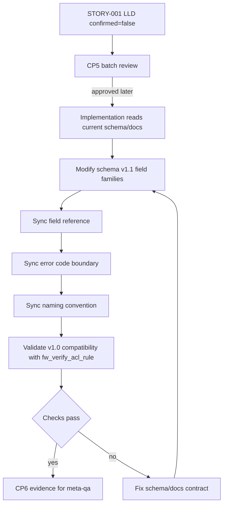

# LLD: STORY-001 - Freeze schema v1.1 contract and field docs

> CP5 确认状态：`checkpoints/CP5-ALL-STORIES-LLD-BATCH.md` 已于 2026-05-18T16:47:38+0800 approved；本文 frontmatter `confirmed=true`。正文中早期关于 `confirmed=false` / CP5 未通过的门控描述仅作为设计阶段历史语境保留，当前实现仍需满足 Story `dev_gate`、文件所有权、CP6 和 CP7。

本文档是 `STORY-001` 的低层设计。当前仅产出 LLD，不实现 `schemas/`、`docs/`、`atoms/`、`scripts/` 或 `src/atomic_ops/` 下的产品文件。本文档需纳入 `CR-003-LLD-BATCH` 全量 CP5 统一确认；`confirmed=false`、CP5 未统一通过或 Story `dev_gate` 未满足时，不得进入实现。

## 1. Goal

冻结 `atomic-ops` schema v1.1 的字段族、兼容策略和字段文档同步契约，使下游 `STORY-002` 至 `STORY-005` 可以用同一结构事实定义防火墙安装、初始化、登录态、配置、批次配置、验证和安全 gate，而不引入真实设备执行能力。

本 Story 实现阶段创建或修改的产品面限定为：

- 修改 `schemas/atomic-op.schema.yaml`，声明 schema v1.1 字段族和兼容规则。
- 修改 `docs/schema-field-reference.md`，同步字段族、必填性、示例、禁止字段和兼容策略。
- 修改 `docs/error-codes.md`，记录 schema 扩展和安全 gate 相关错误边界。
- 修改 `docs/naming-convention.md`，冻结防火墙 atom 命名、动词边界和真实动作命令禁区。
- 不修改 `atoms/fw/fw_verify_acl_rule.yaml` 的业务语义；该文件保持 v1.0 兼容示例，作为回归校验输入。

## 2. Requirements（Functional / Non-Functional）

### 2.1 Functional

- F-01：`schemas/atomic-op.schema.yaml` 必须接受现有 `schema_version: "1.0"` atom，并新增 `schema_version: "1.1"` 受控扩展契约。
- F-02：schema v1.1 必须声明 7 个字段族：`risk`、`credential_ref`、`session_ref`、`state_ref`、`gate`、`verification`、`batch`。
- F-03：`risk.level` 枚举必须为 `low`、`medium`、`high`；安装、初始化、登录、配置和批次配置类 atom 的风险 gate 判定入口由本 Story 定义，由 `STORY-005` 的静态检查执行。
- F-04：`credential_ref` 必须只表达外部凭据引用，不允许在字段示例中保存原始密码、完整 token、cookie、FTP 凭据或真实设备地址。
- F-05：`returns.data.session_ref` 必须定义为 8..128 字符的非敏感引用；字段参考必须禁止 `token=`、`Cookie:`、`password` 等认证载荷模式。
- F-06：`inputs.state_ref`、`returns.data.state_ref`、`returns.data.state_status`、`returns.data.expires_at` 必须定义登录态引用和过期状态；`state_status` 枚举必须为 `valid`、`expired`、`missing`、`invalid`。
- F-07：`gate.required`、`gate.reason`、`gate.approver_role`、`gate.evidence_required` 必须定义 high-risk 审查 gate；high-risk atom 的强制 gate 规则在 docs 中明确，并作为 `STORY-005` 机器检查输入。
- F-08：`verification.kind`、`verification.rules`、`verification.summary_ref` 必须定义验证契约；验证失败只能输出诊断和人工处理信号，不得定义自动回滚动作。
- F-09：`batch.max_concurrency`、`batch.device_inventory_ref`、`batch.idempotency_key`、`batch.failure_policy` 必须定义多设备批次契约；`max_concurrency` 范围为 1..5，默认 1，`failure_policy` 枚举为 `isolate_failed_device`、`stop_batch_before_next_device`。
- F-10：`docs/schema-field-reference.md` 必须覆盖 schema 中新增字段的字段路径、类型、约束、必填性、示例、禁止值和兼容策略，新增字段覆盖率为 100%。
- F-11：`docs/error-codes.md` 必须记录安全 gate 和 schema 扩展相关错误边界，明确这些错误不代表真实设备执行失败。
- F-12：`docs/naming-convention.md` 必须冻结防火墙新 atom 使用 `fw_` 前缀、文件路径 `atoms/fw/<op_id>.yaml`、命名动词集合和禁止新增真实设备动作命令的边界。
- F-13：`atoms/fw/fw_verify_acl_rule.yaml` 必须作为 v1.0 兼容回归输入保留，不静默改变业务语义。

### 2.2 Non-Functional

- NF-01：兼容性：现有 v1.0 atom 校验失败数必须为 0。
- NF-02：安全性：产品面新增或修改内容中真实 IP、完整 token、cookie、FTP 凭据、原始默认密码数量必须为 0；唯一允许显式出现的密码策略值为 `Ngfw@123`。
- NF-03：可维护性：schema、字段参考、错误码和命名规范必须同 Story 同 Wave 合并，不允许 schema 字段与 docs 漂移。
- NF-04：可测试性：每个新增接口契约必须在第 10 节至少有 1 个对应测试场景。
- NF-05：性能：本 Story 不引入网络访问、不扩展 CLI 真实执行路径，`list/show/packages/validate` 仍只读本地缓存。
- NF-06：可审计性：`confirmed=false` 时不得进入实现；所有 OPEN 项必须在 CP5 批量人工确认中显式处理或接受。

## 3. 模块拆分与职责

| 模块 / 文件组 | 职责 | 说明 |
|---|---|---|
| Schema Contract：`schemas/atomic-op.schema.yaml` | 声明 schema v1.1 字段族、类型、枚举、默认值、向后兼容规则和基础结构约束。 | 消费 `process/HLD.md#schema-extension-decision`、ADR-001；不表达真实 executor。 |
| Field Reference：`docs/schema-field-reference.md` | 将 schema 字段转为人工可读契约，覆盖字段路径、类型、必填性、合法示例、禁止示例、兼容说明。 | 与 schema 字段一一对应；作为下游 atom LLD 和 QA 验证输入。 |
| Error Boundary Docs：`docs/error-codes.md` | 记录 schema 扩展、安全 gate、敏感模式和输入结构错误的错误边界。 | 记录 `STORY-005` 使用的 31、32、33 退出码语义，但本 Story 不实现脚本。 |
| Naming Docs：`docs/naming-convention.md` | 冻结防火墙 atom 命名规则、动词表、路径规则和 CLI 命令禁区。 | 消费 HLD 命名规范；禁止新增 `run/execute/apply/configure` 等真实动作命令。 |
| Compatibility Example：`atoms/fw/fw_verify_acl_rule.yaml` | 保持既有 v1.0 atom 回归校验输入，不改变业务语义。 | 本 Story 不修改该文件；实现阶段仅作为校验对象读取。 |
| CP5 Handoff：本 LLD | 将文件影响、接口、异常路径、测试和 TASK-ID 映射为 CP5 自动预检输入。 | `open_items=1`，需 meta-po 在 CP5 批量确认中处理 ADR confirmed 状态。 |

## 4. 代码结构与文件影响范围

| 动作 | 文件路径 | 变更内容 |
|---|---|---|
| 修改 | `schemas/atomic-op.schema.yaml` | 增加 schema v1.1 字段族定义；保留 v1.0 atom 兼容；维持 `additionalProperties: false`；定义字段类型、枚举、范围、默认值和基础结构约束。 |
| 修改 | `docs/schema-field-reference.md` | 增加 7 个字段族的字段参考；列出必填性、示例、禁止值、兼容策略和下游 Story 使用说明。 |
| 修改 | `docs/error-codes.md` | 增加 schema v1.1 和安全 gate 相关错误边界；声明错误码用于离线校验，不表示真实设备动作失败。 |
| 修改 | `docs/naming-convention.md` | 增加防火墙 atom 命名规则、路径规则、动词集合、批次命名规则和 CLI 真实动作命令禁区。 |
| 保留 | `atoms/fw/fw_verify_acl_rule.yaml` | 不修改业务语义；作为 v1.0 兼容性校验输入；若 CP5 要求 v1.1 示例，必须另开修改意见或在实现前由 meta-po 确认。 |

文件所有权：

| 类型 | 文件路径 | 规则 |
|---|---|---|
| primary | `schemas/atomic-op.schema.yaml` | `STORY-001` 独占实现写入。 |
| primary | `docs/schema-field-reference.md` | `STORY-001` 独占实现写入。 |
| primary | `docs/error-codes.md` | `STORY-001` 独占实现写入。 |
| primary | `docs/naming-convention.md` | `STORY-001` 独占实现写入。 |
| shared | `atoms/fw/fw_verify_acl_rule.yaml` | 本 LLD 决策为保留不改；如后续需要迁移为 v1.1 示例，仍由 `STORY-001` 合并。 |
| forbidden | `.input/`、`delivery/` | 实现阶段不得复制 `.input/` 源码、env、日志、凭据或运行时资产；不得写入 `delivery/`。 |

## 5. 数据模型与持久化设计

本 Story 不新增运行时持久化，不写 CLI 缓存，不写 `_metadata.json`，不保存真实设备会话或凭据。数据模型仅为 YAML atom schema 和文档契约。

| 对象 / 字段 | 类型 | 约束 | 说明 |
|---|---|---|---|
| `schema_version` | string | 允许 `"1.0"` 与 `"1.1"`；新增字段族要求 `"1.1"`。 | 当前 Story 冻结推荐值为 `"1.1"`；若实现阶段发现既有 schema 正则只允许三段 semver，必须按 E-02 处理，不得静默改为 `"1.1.0"`。 |
| `risk.level` | string enum | `low`、`medium`、`high`。 | high-risk 静态判定由 `STORY-005` 执行；本 Story 提供字段和文档规则。 |
| `risk.categories` | array[string] | 非空数组；元素使用小写 snake_case。 | 表达风险类别，例如安装、初始化、登录、配置、批次配置、验证。 |
| `credential_ref.kind` | string enum | 由字段参考列出允许类型，例如 `vault_ref`、`env_ref`、`manual_ref`、`placeholder`。 | 不存储凭据值。 |
| `credential_ref.ref` | string | 非空引用；示例只能使用占位符或非敏感引用名。 | 禁止真实 IP、密码、token、cookie、FTP 凭据。 |
| `inputs.state_ref` | string | 非敏感引用，占位符示例为 `<state-ref>`。 | 外部编排上下文引用；CLI 不判定真实有效性。 |
| `returns.data.session_ref` | string | 长度 8..128；禁止认证载荷模式。 | 登录 atom 返回契约，不落盘。 |
| `returns.data.state_ref` | string | 非敏感引用，占位符示例为 `<state-ref>`。 | 登录或守卫 atom 返回契约。 |
| `returns.data.state_status` | string enum | `valid`、`expired`、`missing`、`invalid`。 | 登录守卫和配置前置条件使用。 |
| `returns.data.expires_at` | string or null | ISO 8601 字符串或 `null`。 | CLI 只做结构校验，不计算真实过期。 |
| `gate.required` | boolean | high-risk atom 必须为 `true`。 | 本 Story 文档化规则；`STORY-005` 实现机器检查。 |
| `gate.reason` | string | `gate.required=true` 时非空。 | 说明审查原因。 |
| `gate.approver_role` | string | 非空角色名或占位符。 | 表达审批角色，不绑定平台账号。 |
| `gate.evidence_required` | array[string] | 非空数组。 | 说明审查证据类型。 |
| `verification.kind` | string enum | 字段参考列出安装健康检查、配置验证、批次汇总等类别。 | 不触发真实执行。 |
| `verification.rules` | array[object] | 至少包含规则名、输入引用和预期结果描述。 | 验证失败只输出诊断和人工处理。 |
| `verification.summary_ref` | string | 非敏感引用。 | 指向外部验证汇总。 |
| `batch.max_concurrency` | integer | `minimum=1`、`maximum=5`、默认 `1`。 | high-risk 批次默认 1，提升并发需 CP5/Story 验收理由。 |
| `batch.device_inventory_ref` | string | 非敏感引用或占位符。 | 禁止内联真实设备地址和凭据。 |
| `batch.idempotency_key` | string | 非空；字段参考定义生成规则。 | 生成规则为 `batch_ref + op_id + device_ref + config_domain + params_digest`。 |
| `batch.failure_policy` | string enum | `isolate_failed_device`、`stop_batch_before_next_device`。 | 不自动回滚已成功设备。 |

无新增运行时数据库、无新增本地缓存结构、无新增安装路径。

## 6. API / Interface 设计

| 接口 / 入口 | 输入 | 输出 | 调用方 | 说明 |
|---|---|---|---|---|
| `schema_version` 兼容接口 | v1.0 或 v1.1 atom YAML | schema 校验通过或结构错误 | `scripts/validate_schema.py`、CLI validate、QA | v1.0 继续通过；v1.1 atom 可使用新增字段族。测试见 T-01、T-02。 |
| `risk` 字段族接口 | atom 顶层 `risk` 对象 | 风险等级和类别结构 | `STORY-002`、`STORY-003`、`STORY-004`、`STORY-005` | high-risk gate 的输入事实源。测试见 T-03、T-08。 |
| `credential_ref` 字段族接口 | atom 顶层或输入契约中的凭据引用对象 | 非敏感凭据引用结构 | 登录、安装、初始化、配置 atom | 与明文敏感字段互斥；本 Story记录契约，`STORY-005` 执行扫描。测试见 T-04、T-09。 |
| `session_ref` 返回接口 | `returns.data.session_ref` | 非敏感会话引用 | 登录 atom、登录守卫 atom、配置 atom | CLI 不缓存、不展示完整真实载荷。测试见 T-05。 |
| `state_ref` 状态接口 | `inputs.state_ref`、`returns.data.state_ref`、`state_status`、`expires_at` | 登录态引用和状态枚举 | 登录守卫、配置前置条件、验证诊断 | 支持 `valid/expired/missing/invalid` 分支。测试见 T-06、T-10。 |
| `gate` 字段族接口 | atom 顶层 `gate` 对象 | 审查 gate 结构 | high-risk atom、`STORY-005` 安全检查 | `required=true` 时 `reason` 非空；不绑定真实审批系统。测试见 T-03、T-08。 |
| `verification` 字段族接口 | atom 顶层或返回契约中的验证对象 | 验证规则和汇总引用 | 安装健康检查、配置验证、批次验证 | 验证失败只诊断和人工处理，不自动回滚。测试见 T-07、T-11。 |
| `batch` 字段族接口 | atom 顶层 `batch` 对象 | 批次并发、清单引用、幂等键、失败策略 | `STORY-004` 批次配置 atom、`STORY-005` 安全检查 | `max_concurrency` 1..5，默认 1。测试见 T-12、T-13。 |
| 字段参考同步接口 | schema 新增字段集合 | docs 字段覆盖率 100% | meta-dev、meta-qa、reviewer | schema 与 `docs/schema-field-reference.md` 不得漂移。测试见 T-14。 |
| 命名规范接口 | op_id、文件路径、CLI 命令名 | 命名合法或违规说明 | 下游 atom Story、CLI Story | 防火墙 atom `fw_` 前缀；禁止真实设备动作命令。测试见 T-15。 |

## 7. 核心处理流程

1. 读取 Story 卡片、HLD、ADR、平台安装边界和 CR-003 门控顺序，确认当前仅允许 LLD 和后续 schema/docs 契约实现。
2. 实现阶段先检查 `schemas/atomic-op.schema.yaml` 的现有结构、`schema_version` 约束和 `additionalProperties: false` 布局，定位 v1.1 字段族应插入的现有 schema 节点。
3. 在 schema 中增加或扩展 7 个字段族的类型、枚举、范围、默认值和基础结构约束，并保留 v1.0 atom 的通过路径。
4. 同步 `docs/schema-field-reference.md`，确保每个新增字段路径都有类型、约束、必填性、合法示例、禁止示例和兼容说明。
5. 同步 `docs/error-codes.md`，记录 schema v1.1、安全 gate、敏感模式和输入结构错误的错误边界；明确这些错误属于离线校验，不代表真实设备执行失败。
6. 同步 `docs/naming-convention.md`，记录防火墙 atom 前缀、路径、动词、批次命名和 CLI 命令禁区。
7. 使用 `atoms/fw/fw_verify_acl_rule.yaml` 验证 v1.0 兼容；不修改该 atom 的业务语义。
8. 运行 schema 校验、文档同步审查和敏感模式扫描；发现失败则回到对应文件修正。
9. 将实现证据交给 CP6；本 LLD 阶段停止在 CP5 输入，不进入实现。



异常路径：

| 异常 | 触发条件 | 处理 |
|---|---|---|
| E-01 ADR 未确认 | `process/ARCHITECTURE-DECISION.md` frontmatter `confirmed=false` | 本 LLD 仍输出，但在 O-01 标记为 OPEN；实现前由 meta-po 在 CP5 或状态文件中给出确认/豁免。 |
| E-02 schema version 冲突 | 现有 schema 正则只接受三段 semver，无法接受 `"1.1"` | 阻断实现；不得自行切到 `"1.1.0"`；由 meta-po/用户确认版本表达后更新 LLD 或 Story。 |
| E-03 v1.0 兼容失败 | `fw_verify_acl_rule.yaml` 或既有 v1.0 atom 校验失败 | 回退 schema 修改，修复兼容分支后重测。 |
| E-04 敏感值出现 | docs/schema 示例出现真实 IP、token、cookie、FTP 凭据、原始默认密码 | 立即替换为占位符或删除；允许显式出现的密码策略值仅为 `Ngfw@123`。 |
| E-05 自动回滚语义出现 | `verification` 或 docs 将验证失败描述为默认 rollback/revert | 删除自动回滚语义，改为诊断引用和人工处理信号。 |
| E-06 文件所有权冲突 | 其他 dev_running Story 正在写 primary 文件 | 停止实现并进入 blocked；不得合并其他 Story 改动。 |

## 8. 技术设计细节

- 关键规则 1：schema v1.1 是 contract-only 扩展。新增字段只描述 atom 契约、校验元数据和外部编排引用，不表达真实设备 executor、连接行为或运行时凭据存储。
- 关键规则 2：`schema_version` 主选值为 `"1.1"`。该值来自 HLD 与 Story 卡；若实现阶段发现现有 schema 对 `schema_version` 的正则与 `"1.1"` 冲突，按 E-02 阻断并提交 OPEN 处理，不在实现中静默切换。
- 关键规则 3：v1.0 兼容路径必须保留。现有 atom 不强制补齐新增字段；新增或迁移到 v1.1 的 high-risk atom 才消费新增字段族。
- 关键规则 4：`additionalProperties: false` 必须保持。新增字段必须显式进入 schema，不允许通过开放任意字段绕过结构控制。
- 关键规则 5：`credential_ref` 与敏感明文互斥的完整扫描由 `STORY-005` 实现；本 Story 必须在 schema/docs 中提供字段边界、禁止字段清单和错误码语义，使 `STORY-005` 可直接消费。
- 关键规则 6：`gate` 的 high-risk 强制规则由 docs 明确，机器执行由 `STORY-005` 实现；本 Story 不新增脚本。
- 关键规则 7：`verification` 不能包含自动回滚默认动作；失败路径只允许诊断引用、错误类别和人工处理信号。
- 关键规则 8：`batch.max_concurrency` 默认 1、最大 5；high-risk 批次默认 1，提升并发必须在下游 Story 写明风险理由和验证策略。

依赖选择与复用点：

- 复用现有 YAML atom + JSON Schema 2020-12 路线，不引入新依赖。
- 复用 `uv run --python 3.11` 作为验证命令入口，不使用裸 `pip`。
- 复用 README 原生目录，不生成或写入 `delivery/`。

兼容性处理：

- `atoms/fw/fw_verify_acl_rule.yaml` 保持 v1.0 不变，作为兼容性 smoke test。
- `docs/schema-field-reference.md` 对 v1.0 和 v1.1 做分段说明，明确 v1.0 atom 不要求新增字段族。
- 下游 `STORY-002` 至 `STORY-004` 的新 atom 默认使用 v1.1 字段族；若使用 v1.0，必须在对应 LLD 说明理由并接受 gate 降级风险。

图示类型选择：本 Story命中 schema/docs/atom/校验 4 个以上模块和异常分支，已在第 7 节使用流程图。

## 9. 安全与性能设计

| 维度 | 设计措施 | 验证方式 |
|---|---|---|
| 安全 | `credential_ref` 只保存引用；`session_ref`、`state_ref` 只保存非敏感引用；docs 示例只使用占位符；真实 IP、token、cookie、FTP 凭据、原始默认密码禁止落入产品文件。 | T-04、T-05、T-09 敏感模式扫描；人工审查字段参考禁止示例。 |
| 安全 | high-risk atom 必须有 `risk` 和 `gate` 契约；本 Story 提供字段和错误边界，`STORY-005` 负责机器检查。 | T-03、T-08；CP5 检查下游可消费性。 |
| 安全 | 验证失败不定义自动回滚，避免误导用户执行破坏性恢复动作。 | T-07、T-11 搜索 `rollback`、`revert` 等语义并审查上下文。 |
| 性能 | 不新增网络访问、不新增真实设备动作、不改变 CLI 本地缓存模型。 | T-16 审查命名规范和接口描述；确认未新增 `run/execute/apply/configure` 命令设计。 |
| 性能 | schema/docs 修改不引入新 Python 依赖；验证继续使用现有 `uv run` 路线。 | T-17 审查 `pyproject.toml` / `uv.lock` 不在本 Story 文件影响范围内。 |

## 10. 测试设计

| 测试场景 | 前置条件 | 操作 | 预期结果 | 验证方式 |
|---|---|---|---|---|
| T-01 v1.0 兼容校验 | STORY-001 已实现；`atoms/fw/fw_verify_acl_rule.yaml` 未改业务语义 | `uv run --python 3.11 python scripts/validate_schema.py atoms/fw/fw_verify_acl_rule.yaml` | 命令退出 0；v1.0 atom 仍通过 | 命令输出 + 文件 diff 审查 |
| T-02 v1.1 字段族合法示例校验 | schema v1.1 字段族已实现 | 使用最小 v1.1 示例 atom 运行 schema 校验 | 7 个字段族结构合法，校验通过 | 临时测试样例或下游 atom 样例校验 |
| T-03 high-risk 缺 gate 失败路径 | schema/docs 已定义 high-risk gate 规则 | 构造 `risk.level=high` 且无 `gate.required=true` 的样例 | schema 或 `STORY-005` 静态检查路径能判定失败；本 Story 文档给出规则 | 字段参考 + 错误码审查 |
| T-04 `credential_ref` 敏感互斥 | 字段参考已同步禁止模式 | 扫描 schema/docs 中 `password/token/cookie/ftp_pass/secret` 示例 | 除占位符和 `Ngfw@123` 策略值外无敏感明文 | `rg` 敏感模式扫描 + 人工审查 |
| T-05 `session_ref` 非敏感约束 | 字段参考已同步 `session_ref` 规则 | 审查 `returns.data.session_ref` 类型、长度和禁止模式 | 8..128 字符约束和禁止 `token=`、`Cookie:`、`password` 规则存在 | schema/docs 审查 |
| T-06 `state_ref` 状态枚举 | schema v1.1 已实现 | 校验 `state_status` 合法枚举和非法枚举样例 | `valid/expired/missing/invalid` 通过，其他值失败 | schema 校验 |
| T-07 `verification` 无自动回滚 | 字段参考和错误码已同步 | 搜索验证字段和失败描述 | 默认处理为诊断引用和人工处理信号，无自动 rollback/revert | 文档审查 + 关键词扫描 |
| T-08 gate 字段完整性 | schema v1.1 已实现 | 校验 `gate.required=true` 但 `gate.reason` 为空的样例 | 结构检查失败或下游安全检查规则明确失败 | schema/docs 审查 |
| T-09 凭据引用示例安全 | 字段参考已同步合法示例 | 审查 `credential_ref.kind/ref` 示例 | 示例为占位符或非敏感引用名，不含真实设备地址和凭据 | 人工审查 + 敏感模式扫描 |
| T-10 `expires_at` 格式 | schema v1.1 已实现 | 校验 ISO 8601 字符串、`null` 和非法值 | ISO 8601 或 `null` 通过，非法值失败或文档明确由下游检查 | schema/docs 审查 |
| T-11 验证失败处理 | 字段参考已同步验证规则 | 审查 `verification.rules` 和错误码 | 失败输出错误类别、诊断引用、人工处理信号 | 字段参考 + 错误码审查 |
| T-12 batch 并发范围 | schema v1.1 已实现 | 校验 `batch.max_concurrency` 为 0、1、5、6 | 1..5 通过；0 和 6 失败 | schema 校验 |
| T-13 batch 失败策略枚举 | schema v1.1 已实现 | 校验 `batch.failure_policy` 合法和非法枚举 | 两个合法枚举通过，其他值失败 | schema 校验 |
| T-14 schema/docs 同步覆盖 | schema/docs 已修改 | 建立新增字段路径清单，与字段参考章节对照 | 新增字段覆盖率 100%，缺失数 0 | 人工 checklist 或简单文本比对 |
| T-15 命名规范边界 | 命名文档已修改 | 审查防火墙 atom 前缀、路径、动词和 CLI 禁区 | `fw_`、`atoms/fw/<op_id>.yaml`、动词表、禁止真实动作命令均存在 | 文档审查 |
| T-16 CLI 只读边界 | 命名文档和错误码已修改 | 搜索新增设计是否要求 CLI 连接设备或执行配置 | 不存在真实设备执行命令设计 | 文档审查 |
| T-17 依赖边界 | Story 文件影响范围已执行 | 审查本 Story diff | 未修改 `.input/`、`delivery/`、`pyproject.toml`、`uv.lock` | diff 审查 |

## 11. 实施步骤

| TASK-ID | 动作 | 目标文件 | 详细描述 | 对应测试 |
|---|---|---|---|---|
| S001-T1 | 修改 | `schemas/atomic-op.schema.yaml` | 读取现有 schema 结构，保留 `additionalProperties: false`，加入 `schema_version` v1.1 支持和 7 个字段族的类型、枚举、范围、默认值、基础结构约束。 | T-01、T-02、T-06、T-08、T-12、T-13 |
| S001-T2 | 修改 | `docs/schema-field-reference.md` | 同步 `risk`、`credential_ref`、`session_ref`、`state_ref`、`gate`、`verification`、`batch` 的字段路径、类型、必填性、合法示例、禁止值、兼容策略。 | T-04、T-05、T-09、T-10、T-11、T-14 |
| S001-T3 | 修改 | `docs/error-codes.md` | 记录 schema v1.1、安全 gate、敏感模式和输入结构错误边界；明确 31、32、33 为后续静态检查出口语义，不复用为真实设备业务错误。 | T-03、T-07、T-11 |
| S001-T4 | 修改 | `docs/naming-convention.md` | 冻结防火墙 atom `fw_` 前缀、路径 `atoms/fw/<op_id>.yaml`、动词集合、批次命名规则和 CLI 命令禁区。 | T-15、T-16 |
| S001-T5 | 保留 | `atoms/fw/fw_verify_acl_rule.yaml` | 不修改业务语义；将该文件作为 v1.0 兼容校验输入。若实现阶段发现必须迁移，停止并回到 CP5 修改意见，不直接改。 | T-01、T-17 |
| S001-T6 | 校验 | `schemas/atomic-op.schema.yaml` | 运行 v1.0 兼容校验和 v1.1 最小示例校验，确认 schema 修改没有破坏既有 atom。 | T-01、T-02 |
| S001-T7 | 扫描 | `docs/`、`schemas/`、`atoms/` | 对本 Story 修改范围做敏感信息扫描，确认真实 IP、token、cookie、FTP 凭据、原始默认密码数量为 0。 | T-04、T-09、T-17 |
| S001-T8 | 记录 | `process/checks/CP6-STORY-001-freeze-schema-v11-contract-and-field-docs-CODING-DONE.md` | 实现完成后记录 `"1.1"` 版本表达最终选择、兼容性证据、回滚策略和 OPEN 项处理结果。当前 LLD 阶段不创建 CP6 文件。 | T-14、T-17 |

每个文件影响项均有 TASK-ID 覆盖：schema 对应 S001-T1/S001-T6；字段参考对应 S001-T2；错误码对应 S001-T3；命名规范对应 S001-T4；shared atom 保留策略对应 S001-T5；安全扫描对应 S001-T7。

## 12. 风险、难点与预研建议

| 风险 / 难点 | 影响 | 缓解措施 / 预研建议 |
|---|---|---|
| `ARCHITECTURE-DECISION.md` 当前 `confirmed=false` | 按 meta-dev 常规 ready-check，ADR 未确认会阻断实现；但 CR-003 允许 LLD 起草。 | 本 LLD 标记 O-01；CP5 批量人工确认前由 meta-po 明确 ADR 状态或豁免。 |
| `"1.1"` 与现有 schema semver 正则潜在冲突 | 实现阶段若直接写 `"1.1"` 可能导致 schema 自校验或 docs 不一致。 | 主选仍为 `"1.1"`；实现前检查现有 schema 正则，冲突时停止并请求决策。 |
| JSON Schema 难以完整表达敏感模式互斥 | 仅靠 schema 可能无法覆盖所有明文泄漏模式。 | 本 Story 定义字段与错误边界；`STORY-005` 实现 `security_gate_check.py` 或等价静态扫描。 |
| docs 与 schema 漂移 | 下游 atom Story 可能使用未文档化字段。 | S001-T2 与 T-14 要求字段参考覆盖率 100%；CP6 必须提交同步证据。 |
| high-risk gate 强制规则跨 Story 执行 | 本 Story 只定义契约，机器检查在 `STORY-005`。 | error-codes 与 naming docs 明确下游检查输入；CP5 审查 `STORY-005` LLD 是否消费该契约。 |
| shared atom 迁移策略不清 | 修改 `fw_verify_acl_rule.yaml` 可能影响既有示例语义和下游 package。 | 本 LLD 固定为不修改，作为 v1.0 兼容输入；需要 v1.1 示例时另行确认。 |

### OPEN / Spike 跟踪

| ID | 类型（OPEN / Spike） | 问题 | 下一动作 | 责任方 |
|---|---|---|---|---|
| O-01 | OPEN | `process/ARCHITECTURE-DECISION.md` frontmatter 当前为 `status: draft`、`confirmed: false`，与 meta-dev 实现前必须消费 confirmed ADR 的规则不一致。 | CP5 批量人工确认前，由 meta-po 将 ADR 确认状态回填为已确认，或在 CP5 中显式记录 CR-003 对 LLD 起草的豁免；实现前不得忽略该状态。 | meta-po / user |

### Blocked / Implementation Gate 跟踪

| ID | 状态 | 阻断对象 | 触发条件 | 解除条件 |
|---|---|---|---|---|
| B-01 | BLOCKED_FOR_IMPLEMENTATION | STORY-001 实现阶段 | 当前 LLD `confirmed=false`，全量 CP5 尚未统一确认，O-01 未处理。 | `STORY-001` LLD confirmed、`checkpoints/CP5-ALL-STORIES-LLD-BATCH.md` approved、O-01 已处理或被人工风险接受、Story `dev_gate` 满足。 |

## 13. 回滚与发布策略

- 发布方式：随 `STORY-001` 实现提交 schema/docs 契约修改；不发布安装包，不写 `delivery/`，不改变 CLI 命令集，不连接真实设备。
- 发布前置：本 LLD confirmed、`CR-003-LLD-BATCH` 全量 CP5 自动预检完成、`checkpoints/CP5-ALL-STORIES-LLD-BATCH.md` 人工确认 approved、O-01 已处理或风险已接受、Story `dev_gate` 满足。
- 回滚触发条件：
  - 现有 v1.0 atom 校验失败。
  - schema version 表达与现有 schema 约束冲突且未获确认。
  - docs 或 schema 出现真实 IP、token、cookie、FTP 凭据、原始默认密码。
  - 下游 Story 无法消费字段族，或字段参考覆盖率低于 100%。
  - 验证契约被写成默认自动回滚或真实设备执行。
- 回滚动作：
  - 回退 `schemas/atomic-op.schema.yaml` 中 v1.1 字段族修改。
  - 回退 `docs/schema-field-reference.md`、`docs/error-codes.md`、`docs/naming-convention.md` 中与 v1.1 字段族相关的同步修改。
  - 保留 process 层 HLD/ADR/LLD 作为后续 CR 输入，不删除审计记录。
  - 阻断 `STORY-002` 至 `STORY-005` 的实现开发，直到契约重新冻结。

## 14. Definition of Done

- [x] 14 个可见章节全部填写完成。
- [x] 文件影响范围、接口、测试与实施步骤可直接指导编码。
- [x] frontmatter `confirmed: false`，且本文明确未进入实现。
- [x] frontmatter 已填写 `tier: "M"`。
- [x] `shared_fragments` 已记录 HLD/ADR 共享设计来源；未引用不存在的 `process/shared/` 文件。
- [x] `open_items` 已清点为 1，O-01 明确责任方和下一动作。
- [x] 文件所有权覆盖 primary/shared/forbidden，且实现范围不包含 `.input/` 或 `delivery/`。
- [x] 第 6 节每个接口均在第 10 节有对应测试入口。
- [x] 第 7 节异常路径均在第 10 节或第 12 节有对应验证或处理路径。
- [x] 第 11 节 TASK-ID 与第 4 节文件影响范围一一对应。
- [x] 回滚与发布策略明确，且不包含自动设备回滚。
- [x] CP5 handoff notes 已给出，供 meta-po 收敛全量 LLD 和自动预检。

CP5 handoff notes：

| 项 | 结论 | 证据 |
|---|---|---|
| LLD 覆盖 AC | 满足自动预检输入 | 第 2、10、14 节覆盖 Story 验收标准。 |
| 与 HLD / ADR 一致 | 部分满足，含 OPEN | HLD confirmed；ADR 内容已消费，但 ADR frontmatter 未 confirmed，见 O-01。 |
| 文件影响范围明确 | 满足自动预检输入 | 第 4、11 节列出 primary/shared/forbidden 与 TASK-ID 映射。 |
| 接口契约完整 | 满足自动预检输入 | 第 6 节列出 schema/docs/error/naming 接口。 |
| 测试与 dev_gate 可计算 | 满足自动预检输入 | 第 10、13、14 节列出验证入口和实现前置。 |
| 实现门禁 | 阻断实现 | 必须等待全部目标 Story LLD、CP5 自动预检、CP5 批量人工确认、O-01 处理和 Story dev_gate 满足。 |

## 人工确认区

> **CP5 - Story LLD 可实现性门**
> meta-po 收齐 `STORY-001`..`STORY-006` 全部 LLD 和 CP5 自动预检后，再生成并提示用户审查 `checkpoints/CP5-ALL-STORIES-LLD-BATCH.md`。
> 用户统一确认全部目标 Story 的 LLD 后，仍需满足当前 Wave、依赖门控与文件所有权门控方可进入实现。

**CP5 checklist 摘要**：

| # | 检查项 | 状态 | 证据 |
|---|---|---|---|
| 1 | LLD 覆盖 AC | ready-for-auto-check | 第 2 / 10 / 14 节 |
| 2 | 与 HLD / ADR 一致 | ready-with-open-item | 第 3 / 8 / 12 节；O-01 |
| 3 | 文件影响范围明确 | ready-for-auto-check | 第 4 / 11 节 |
| 4 | 接口契约完整 | ready-for-auto-check | 第 6 节 |
| 5 | 测试与 dev_gate 可计算 | ready-for-auto-check | 第 10 / 13 / 14 节 |

**人工确认回复**：

请直接回复以下任一整行：

```text
approve
修改: <具体修改点>
reject
```

**人工审查结果回填**：

- 结论：`approved | changes_requested | rejected`
- 审查人：
- 审查时间：
- 修改意见：
- 风险接受项：
