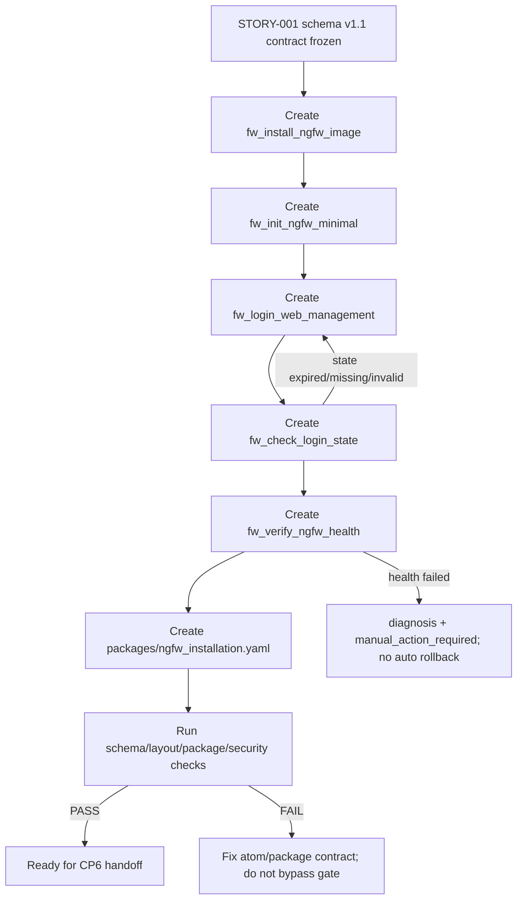

# LLD: STORY-002 — Model NGFW install init login guard atoms

> CP5 确认状态：`checkpoints/CP5-ALL-STORIES-LLD-BATCH.md` 已于 2026-05-18T16:47:38+0800 approved；本文 frontmatter `confirmed=true`。正文中早期关于 `confirmed=false` / CP5 未通过的门控描述仅作为设计阶段历史语境保留，当前实现仍需等待 STORY-001 contract frozen，并满足 Story `dev_gate`、文件所有权、CP6 和 CP7。

> 本文档是 `STORY-002` 的低层设计（Low-Level Design）。本文档仅为 CR-003 全量 LLD 设计批次输入，不代表允许实现。实现必须等待 `STORY-001` contract 冻结、全部目标 Story LLD 与 CP5 自动预检完成、`checkpoints/CP5-ALL-STORIES-LLD-BATCH.md` 人工确认通过，并满足当前 Story 的 `dev_gate`。

## 1. Goal

创建 5 个 NGFW 安装链路防火墙 atom 契约和 1 个安装 package 过滤视图，使安装、初始化、Web 登录、登录态守卫和安装后健康检查可在 `atomic-ops` 原生 `atoms/` 与 `packages/` 交付面中表达，同时保持 CLI 离线只读、不连接设备、不复制 `.input/` 实现、不保存敏感认证载荷。

## 2. Requirements（Functional / Non-Functional）

### 2.1 Functional

- 创建 `atoms/fw/fw_install_ngfw_image.yaml`，定义 NGFW 镜像安装契约，输入使用非敏感安装包引用、设备型号、完整性校验引用，输出安装状态、下一步验证信号和诊断引用。
- 创建 `atoms/fw/fw_init_ngfw_minimal.yaml`，定义最小初始化契约，仅包含串口登录、关闭验证码、配置管理路由、统一改密为 `Ngfw@123` 四类已确认动作；不得加入 SSH、license 或其他扩边动作。
- 创建 `atoms/fw/fw_login_web_management.yaml`，定义 Web 管理面登录契约，输入使用 `credential_ref` 和管理面引用，输出脱敏 `session_ref`、`state_ref`、`state_status`、`expires_at`。
- 创建 `atoms/fw/fw_check_login_state.yaml`，定义配置前登录态守卫契约，输入 `state_ref`，输出 `state_status`、`relogin_required`、`max_relogin_attempts=1` 和诊断引用。
- 创建 `atoms/fw/fw_verify_ngfw_health.yaml`，定义安装后健康检查契约，覆盖 VPP、Agent、HTTPS 三类检查，失败只输出诊断引用和人工处理信号，不触发自动回滚。
- 创建 `packages/ngfw_installation.yaml`，只引用 5 个 `op_id`，不复制 atom 内容，package 引用缺失数必须为 0。
- 所有 high-risk atom 必须设置 `risk.level=high`、`gate.required=true`、`gate.reason` 非空，并满足 STORY-001 schema v1.1 字段族契约。

### 2.2 Non-Functional

- 安全性：新增 atom/package 中真实 IP、完整 token、cookie、FTP 凭据、原始默认密码数量为 0；唯一允许显式出现的密码策略值为 `Ngfw@123`。
- 可验证性：5 个 atom 均可通过 schema 校验；安装 package 的 5 个 `op_id` 均可解析；high-risk gate 覆盖率为 100%。
- 可维护性：文件名与 `op_id` 一致率为 100%；防火墙新 atom 均使用 `fw_` 前缀并匹配 `^(fw|tg|mock|sw)_[a-z]+_[a-z_]+$`。
- 兼容性：设计依赖 STORY-001 的 schema v1.1 字段族，但不改变现有 v1.0 atom 语义；若 STORY-001 最终选择 `"1.1.0"` 版本表达，本 Story 只同步 `schema_version` 值，不改变字段语义。
- 边界：不新增 CLI 真实动作命令，不连接串口、Web、FTP 或设备接口，不复制 `.input/ngfw-install` 脚本。

## 3. 模块拆分与职责

| 模块 / 文件组 | 职责 | 说明 |
|---|---|---|
| `atoms/fw/fw_install_ngfw_image.yaml` | 描述 NGFW 镜像安装契约、风险 gate、安装输入引用和安装结果 envelope。 | 使用 `process/HLD.md#前置校验与失败路径` 的安装 atom 契约定义；只表达 contract，不执行安装。 |
| `atoms/fw/fw_init_ngfw_minimal.yaml` | 描述最小初始化契约和初始化结果 envelope。 | 固定关闭验证码、配置管理路由、统一密码策略 `Ngfw@123`；SSH/license 为显式禁止项。 |
| `atoms/fw/fw_login_web_management.yaml` | 描述 Web 登录契约、凭据引用和状态引用返回。 | 使用 `process/HLD.md#session_ref / state_ref 生命周期与持久化边界（关闭 F-002）`；不得保存原始认证载荷。 |
| `atoms/fw/fw_check_login_state.yaml` | 描述登录态守卫契约和重登判定。 | 独立 atom；不得隐藏在配置 atom 内；最大重登次数固定为 1。 |
| `atoms/fw/fw_verify_ngfw_health.yaml` | 描述安装后 VPP、Agent、HTTPS 健康检查契约。 | 使用 ADR-006；失败只输出诊断和人工处理信号。 |
| `packages/ngfw_installation.yaml` | 组织安装链路 package 过滤视图。 | 仅保存 `operations` op_id 列表，不复制 atom 内容。 |
| STORY-001 schema v1.1 contract | 提供 `risk`、`credential_ref`、`session_ref`、`state_ref`、`gate`、`verification` 字段族。 | LLD 设计阶段可引用字段冻结草案；实现阶段必须等待 STORY-001 contract 冻结与 CP5 批量确认。 |

## 4. 代码结构与文件影响范围

| 动作 | 文件路径 | 变更内容 |
|---|---|---|
| 创建 | `atoms/fw/fw_install_ngfw_image.yaml` | 新增 `op_id=fw_install_ngfw_image` 的安装 atom 契约；声明 `schema_version`、输入引用、`risk`、`gate`、安装结果、错误类别、诊断引用和验证衔接。 |
| 创建 | `atoms/fw/fw_init_ngfw_minimal.yaml` | 新增 `op_id=fw_init_ngfw_minimal` 的初始化 atom 契约；声明串口登录、关闭验证码、管理路由、密码策略四类动作和禁止扩边项。 |
| 创建 | `atoms/fw/fw_login_web_management.yaml` | 新增 `op_id=fw_login_web_management` 的登录 atom 契约；输入 `credential_ref`，输出 `session_ref`、`state_ref`、`state_status`、`expires_at`。 |
| 创建 | `atoms/fw/fw_check_login_state.yaml` | 新增 `op_id=fw_check_login_state` 的登录态守卫 atom 契约；输入 `state_ref`，输出状态判定、重登需求、诊断引用。 |
| 创建 | `atoms/fw/fw_verify_ngfw_health.yaml` | 新增 `op_id=fw_verify_ngfw_health` 的健康检查 atom 契约；覆盖 VPP、Agent、HTTPS 三类 verification rules。 |
| 创建 | `packages/ngfw_installation.yaml` | 新增 package 过滤视图，按安装、初始化、登录、守卫、健康检查顺序引用 5 个 op_id。 |

## 5. 数据模型与持久化设计

本 Story 无新增持久化存储，不修改 CLI 本地缓存 `_metadata.json`，不保存真实设备地址、认证载荷或运行日志。新增 YAML 仅表达 atom/package 静态契约。

| 对象 / 字段 | 类型 | 约束 | 说明 |
|---|---|---|---|
| `schema_version` | string | 设计目标为 `"1.1"`；若 STORY-001 最终因现有正则切换为 `"1.1.0"`，本 Story 同步该值。 | 由 STORY-001 冻结；本 Story 不自行决定版本正则。 |
| `op_id` | string | 必须等于文件名去掉 `.yaml`，且匹配 `^(fw|tg|mock|sw)_[a-z]+_[a-z_]+$`。 | 5 个新增 atom 均为 `fw_` 前缀。 |
| `risk.level` | enum | `high`。 | 安装、初始化、登录、守卫、健康检查均按高风险或高敏边界处理。 |
| `gate.required` | boolean | `true`。 | high-risk atom 必填。 |
| `gate.reason` | string | 非空；说明设备变更、认证或验证风险。 | CP5/CP6 可机器检查空值。 |
| `credential_ref` | object | 只允许引用名或占位符；禁止明文 password/token/cookie/ftp_pass/secret。 | 仅登录 atom 需要。 |
| `session_ref` | string | 8..128 字符；示例只能使用 `<session-ref>`；禁止 `token=`、`Cookie:`、`password`。 | 登录 atom 返回契约。 |
| `state_ref` | string | 示例只能使用 `<state-ref>`。 | 登录 atom 返回，守卫 atom 输入。 |
| `state_status` | enum | `valid/expired/missing/invalid`。 | 登录和守卫 atom 使用。 |
| `expires_at` | string/null | ISO 8601 或 `null`。 | CLI 不计算真实有效性，只校验字段形态。 |
| `verification.rules` | array | 至少覆盖 `vpp`、`agent`、`https`。 | 健康检查 atom 必填 3/3。 |
| `diag_snapshot_ref` / `verification_summary_ref` | string | 只允许非敏感引用或占位符。 | 失败诊断引用，不包含完整响应体。 |
| `package_id` | string | `ngfw_installation`。 | package 文件名与 id 对齐。 |
| `operations` | array[string] | 精确包含 5 个新增 op_id，缺失数为 0。 | package 不复制 atom 内容。 |

## 6. API / Interface 设计

| 接口 / 入口 | 输入 | 输出 | 调用方 | 说明 |
|---|---|---|---|---|
| `fw_install_ngfw_image` atom | `image_ref`、`device_model`、`checksum_ref`、`install_mode`、`gate` | `install_status`、`next_step`、`diag_snapshot_ref`、`error_type` | 外部编排方、package 视图、CLI validate | `install_status` 枚举建议为 `pending_verification/succeeded/failed/blocked`；不包含 FTP 凭据或真实设备地址。 |
| `fw_init_ngfw_minimal` atom | `install_status_ref`、`serial_access_ref`、`management_route_ref`、`password_policy="Ngfw@123"`、`gate` | `init_status`、`captcha_disabled`、`management_route_status`、`password_policy_applied`、`diag_snapshot_ref` | 外部编排方、package 视图、CLI validate | 初始化动作边界固定；出现 SSH/license 字段或步骤时视为失败。 |
| `fw_login_web_management` atom | `management_endpoint_ref`、`credential_ref`、`login_context_ref`、`gate` | `login_status`、`session_ref`、`state_ref`、`state_status`、`expires_at`、`diag_snapshot_ref` | 外部编排方、登录守卫 atom、CLI validate | 登录输出只提供引用；不得落完整 token/cookie/password。 |
| `fw_check_login_state` atom | `state_ref`、`max_relogin_attempts=1`、`gate` | `state_status`、`relogin_required`、`next_action`、`diag_snapshot_ref` | 外部编排方、后续配置 atom、CLI validate | `state_status=expired/missing/invalid` 时输出重登需求；不得无限重试。 |
| `fw_verify_ngfw_health` atom | `install_status_ref`、`state_ref`、`verification.rules=[vpp,agent,https]`、`gate` | `verification_status`、`component_results[]`、`verification_summary_ref`、`manual_action_required`、`diag_snapshot_ref` | 外部编排方、package 视图、CLI validate | 失败输出诊断与人工处理信号；不得默认自动回滚。 |
| `ngfw_installation` package | `package_id=ngfw_installation`、`operations=[5 op_id]` | 可解析 package 视图 | `atomic-ops packages/show/validate` | package 只保存 op_id，不复制 atom 字段。 |
| Schema/layout validation entry | 5 个 atom 文件和 1 个 package 文件 | PASS/FAIL、文件路径、字段路径、退出码 | meta-dev、meta-qa、CI/本地验证 | 命令见第 10 节；实现前依赖 STORY-001 schema 契约冻结。 |

## 7. 核心处理流程

1. meta-dev 实现阶段读取已确认的 STORY-001 schema v1.1 字段族，确定 `schema_version` 使用 `"1.1"` 或兼容切换后的 `"1.1.0"`。
2. 创建安装 atom，声明镜像引用、型号、校验引用、安装状态输出、风险 gate 和诊断引用。
3. 创建初始化 atom，声明串口登录引用、关闭验证码、管理路由、统一密码策略 `Ngfw@123`，并显式排除 SSH/license。
4. 创建登录 atom，使用 `credential_ref` 输入，返回脱敏 `session_ref` / `state_ref` / `state_status`，禁止认证载荷落盘。
5. 创建登录态守卫 atom，输入 `state_ref` 并根据 `valid/expired/missing/invalid` 输出下一动作；最大重登次数为 1。
6. 创建健康检查 atom，覆盖 VPP、Agent、HTTPS 三项规则；失败输出诊断引用和人工处理信号，不自动回滚。
7. 创建安装 package，按 `fw_install_ngfw_image`、`fw_init_ngfw_minimal`、`fw_login_web_management`、`fw_check_login_state`、`fw_verify_ngfw_health` 顺序引用 op_id。
8. 执行 schema、layout、package 引用和敏感信息检查；任何结构错误、gate 缺失或敏感值命中均阻断 CP6。



## 8. 技术设计细节

- 关键规则：新增 atom 是 contract-only YAML，不包含 Python 执行器、设备连接命令、FTP 下载代码、Web 登录代码或 `.input/` 脚本片段。
- 关键规则：5 个 atom 均声明 `risk.level=high` 与 `gate.required=true`；`gate.reason` 分别说明安装破坏性、初始化改密、登录认证、状态守卫、健康诊断边界。
- 关键规则：登录和守卫状态字段复用 STORY-001 的 `session_ref` / `state_ref` / `state_status` / `expires_at` 字段族；CLI 不写入 `_metadata.json`，不判定真实会话有效性。
- 关键规则：`fw_check_login_state` 必须独立存在，后续配置 atom 通过前置条件引用，不允许把守卫逻辑散写到 capacity atom。
- 关键规则：`fw_verify_ngfw_health` 的 `verification.rules` 至少包含 `vpp`、`agent`、`https` 三项，`component_results[]` 使用非敏感状态、错误类别和诊断引用。
- 关键规则：package 文件只包含 package 元数据和 `operations` 列表，禁止复制 atom 的输入、输出、gate 或 verification 内容。
- 依赖选择与复用点：复用当前仓库 YAML atom、JSON Schema、package 过滤视图和 `uv run` 校验入口；不引入新依赖。
- 兼容性处理：若 STORY-001 对 `schema_version` 最终值作 `"1.1"` / `"1.1.0"` 切换，本 Story 仅同步 YAML 值和文档注释，不改变字段名或 op_id。
- 图示类型选择：第 7 节使用流程图，因为本 Story 涉及 5 个 atom、1 个 package 和失败分支。

## 9. 安全与性能设计

| 维度 | 设计措施 | 验证方式 |
|---|---|---|
| 安全 | 使用 `credential_ref`、`session_ref`、`state_ref` 引用模型；禁止真实 IP、token、cookie、FTP 凭据、原始默认密码；唯一允许显式密码策略值为 `Ngfw@123`。 | `scripts/security_gate_check.py` 或等价检查；`rg` 敏感模式人工辅助审查；CP5/CP6 checklist。 |
| 安全 | high-risk atom 100% 带 `risk.level=high`、`gate.required=true`、`gate.reason` 非空。 | schema 校验 + security gate 检查；缺失 gate 退出码按 HLD 最小契约为 32。 |
| 安全 | 健康检查失败只输出 `diag_snapshot_ref`、`verification_summary_ref` 和 `manual_action_required`，不写 rollback/revert 自动动作。 | 静态扫描 `rollback/revert/auto_rollback` 语义；人工审查第 6/7/10 节对应关系。 |
| 性能 | 新增产物仅为静态 YAML；CLI `list/show/packages/validate` 仍只读本地文件，不访问网络或设备。 | CLI smoke test 和本地命令审查；确认无新增真实动作命令。 |
| 性能 | package 只保存 op_id 引用，避免 package 内复制 atom 导致解析冗余和漂移。 | `uv run atomic-ops validate --package ngfw_installation` 确认引用可解析。 |

## 10. 测试设计

| 测试场景 | 前置条件 | 操作 | 预期结果 | 验证方式 |
|---|---|---|---|---|
| T-S002-01 schema 校验 5 个 atom | STORY-001 schema v1.1 contract 已冻结；5 个 atom 已创建。 | 执行 `uv run --python 3.11 python scripts/validate_schema.py atoms/fw/fw_install_ngfw_image.yaml atoms/fw/fw_init_ngfw_minimal.yaml atoms/fw/fw_login_web_management.yaml atoms/fw/fw_check_login_state.yaml atoms/fw/fw_verify_ngfw_health.yaml`。 | 5 个 atom 均通过 schema 校验，失败数为 0。 | 覆盖第 6 节全部 atom 接口。 |
| T-S002-02 layout 与命名检查 | 5 个 atom 和 package 已创建。 | 执行 `uv run --python 3.11 python scripts/layout_check.py`。 | 文件路径为 `atoms/fw/<op_id>.yaml`，文件名与 `op_id` 一致率 100%，`fw_` 前缀覆盖率 100%。 | 覆盖第 4 节文件影响范围。 |
| T-S002-03 package 引用检查 | `packages/ngfw_installation.yaml` 已创建。 | 执行 `uv run atomic-ops validate --package ngfw_installation`。 | package 精确引用 5 个 op_id，缺失引用数为 0，不复制 atom 内容。 | 覆盖第 6 节 package 接口。 |
| T-S002-04 high-risk gate 检查 | 5 个 atom 已创建。 | 执行 `uv run --python 3.11 python scripts/security_gate_check.py` 或 STORY-005 确认的等价命令。 | 5 个 atom `risk.level=high`、`gate.required=true`、`gate.reason` 非空，缺失数为 0。 | 覆盖第 9 节安全 gate。 |
| T-S002-05 敏感信息扫描 | 5 个 atom、1 个 package 已创建。 | 扫描 `password/token/cookie/authorization/ftp_pass/secret` 等模式，允许占位符和 `Ngfw@123`。 | 真实 IP、完整 token、cookie、FTP 凭据、原始默认密码数量为 0。 | 覆盖第 5/6 节 credential/session/state 模型。 |
| T-S002-06 初始化边界检查 | `fw_init_ngfw_minimal` 已创建。 | 审查字段、步骤、描述和 verification，扫描 `ssh/license`。 | SSH/license 等未确认动作出现次数为 0；初始化动作只含串口登录、关闭验证码、管理路由、统一密码策略。 | 覆盖第 6/7 节初始化接口与异常路径。 |
| T-S002-07 登录输出脱敏检查 | `fw_login_web_management` 已创建。 | 审查 returns 示例和字段。 | 仅返回 `<session-ref>`、`<state-ref>`、`state_status`、`expires_at`、诊断引用；不含 token/cookie/password。 | 覆盖第 6 节登录接口。 |
| T-S002-08 守卫状态分支检查 | `fw_check_login_state` 已创建。 | 构造 `state_status` 枚举样例或审查枚举定义。 | `valid/expired/missing/invalid` 均有下一动作；`max_relogin_attempts=1`。 | 覆盖第 7 节状态异常路径。 |
| T-S002-09 健康检查覆盖 | `fw_verify_ngfw_health` 已创建。 | 审查 `verification.rules`。 | VPP、Agent、HTTPS 覆盖率 3/3；失败输出人工处理信号和诊断引用。 | 覆盖第 6 节健康检查接口与第 13 节回滚策略。 |
| T-S002-10 禁止真实执行能力 | 全部文件已创建。 | 审查新增文件中命令、脚本、URL、设备连接字段。 | 不出现真实设备连接、FTP 下载、Web 登录执行代码、CLI `run/execute/apply/configure` 命令。 | 覆盖 ADR-002 与平台安装边界。 |

## 11. 实施步骤

| TASK-ID | 动作 | 目标文件 | 详细描述 | 对应测试 |
|---|---|---|---|---|
| S002-T1 | 创建 | `atoms/fw/fw_install_ngfw_image.yaml` | 创建安装 atom 契约，定义非敏感安装包引用、设备型号、完整性校验引用、`risk`、`gate`、安装状态、错误类别和诊断引用。 | T-S002-01、T-S002-02、T-S002-04、T-S002-05 |
| S002-T2 | 创建 | `atoms/fw/fw_init_ngfw_minimal.yaml` | 创建初始化 atom 契约，固定串口登录、关闭验证码、配置管理路由、统一密码策略 `Ngfw@123`，并显式排除 SSH/license。 | T-S002-01、T-S002-02、T-S002-04、T-S002-05、T-S002-06 |
| S002-T3 | 创建 | `atoms/fw/fw_login_web_management.yaml` | 创建 Web 登录 atom 契约，使用 `credential_ref`，返回脱敏 `session_ref`、`state_ref`、`state_status`、`expires_at` 和诊断引用。 | T-S002-01、T-S002-02、T-S002-04、T-S002-05、T-S002-07 |
| S002-T4 | 创建 | `atoms/fw/fw_check_login_state.yaml` | 创建登录态守卫 atom 契约，输入 `state_ref`，输出状态判定、重登需求、最大重登 1 次和诊断引用。 | T-S002-01、T-S002-02、T-S002-04、T-S002-05、T-S002-08 |
| S002-T5 | 创建 | `atoms/fw/fw_verify_ngfw_health.yaml` | 创建安装后健康检查 atom 契约，覆盖 VPP、Agent、HTTPS 三项 verification rules，失败只输出诊断和人工处理信号。 | T-S002-01、T-S002-02、T-S002-04、T-S002-05、T-S002-09 |
| S002-T6 | 创建 | `packages/ngfw_installation.yaml` | 创建安装 package 过滤视图，按安装、初始化、登录、守卫、健康检查顺序引用 5 个 op_id，不复制 atom 内容。 | T-S002-03 |
| S002-T7 | 校验 | `atoms/fw/*.yaml`、`packages/ngfw_installation.yaml` | 执行 schema、layout、package 引用、security gate、敏感信息、初始化边界、登录脱敏、健康检查覆盖和真实执行禁用检查。 | T-S002-01 至 T-S002-10 |

## 12. 风险、难点与预研建议

| 风险 / 难点 | 影响 | 缓解措施 / 预研建议 |
|---|---|---|
| STORY-001 schema v1.1 contract 尚未 confirmed | 本 Story 无法安全实现字段名、版本值和 high-risk gate 机器校验。 | LLD 阶段只引用字段冻结草案；实现阶段必须等待 STORY-001 CP5 confirmed 和 schema contract frozen。 |
| `process/ARCHITECTURE-DECISION.md` 当前 frontmatter `confirmed=false` | 严格 ready-check 下，ADR 未确认会影响实现前门控证据。 | 本 LLD 记录为 OPEN；CP5 批量确认前由 meta-po 确认 ADR 状态或给出等价确认证据。 |
| security gate 检查入口属于 STORY-005 | STORY-002 实现时可能无法运行最终 security gate 命令。 | CP6 可先运行已存在的 schema/layout/package 检查，并将 STORY-005 的 security gate 作为批次后续验证；CP5 应确认最小检查入口责任归属。 |
| 安装/初始化 atom 容易被误写成真实执行步骤 | 可能违反 CLI 离线只读与 `.input` 禁止复制边界。 | YAML 字段和描述统一使用“契约、引用、状态、诊断”；禁止 telnet/FTP/Web 执行片段。 |
| 健康检查失败路径容易被写成自动回滚 | 违反 ADR-006 与 R-C-012。 | `fw_verify_ngfw_health` 只允许 `manual_action_required`、`diag_snapshot_ref`、`verification_summary_ref`，不写自动回滚字段。 |

### OPEN / Spike 跟踪

| ID | 类型（OPEN / Spike） | 问题 | 下一动作 | 责任方 |
|---|---|---|---|---|
| O-01 | OPEN | STORY-001 LLD 与 schema v1.1 实现尚未 confirmed；STORY-002 实现必须等待 contract frozen。 | CP5 批量人工确认前核对 STORY-001 LLD、CP5 自动预检和最终字段族。 | meta-po / STORY-001 meta-dev |
| O-02 | OPEN | `process/ARCHITECTURE-DECISION.md` frontmatter 当前 `confirmed=false`，但 LLD 设计已由 CR-003 调度。 | CP5 批量确认前由 meta-po 明确 ADR 是否以 CP3 approved + CR-003 作为等价确认，或回填正式确认状态。 | meta-po |
| O-03 | OPEN | STORY-005 的 `scripts/security_gate_check.py` 尚未实现，STORY-002 的 high-risk gate 和敏感扫描最终自动化入口存在跨 Story 依赖。 | CP5 批量确认时明确 STORY-002 CP6 可接受的临时验证命令，以及 STORY-005 完成后的回归入口。 | meta-po / STORY-005 meta-dev / meta-qa |

## 13. 回滚与发布策略

- 发布方式：随 STORY-002 实现提交 5 个 `atoms/fw/*.yaml` 和 `packages/ngfw_installation.yaml`，作为 `atomic-ops` 原生静态契约发布；不发布安装器，不新增 CLI 执行命令。
- 发布前置：`confirmed=false` 时不得发布实现；必须等待全部目标 Story LLD、CP5 自动预检和 `checkpoints/CP5-ALL-STORIES-LLD-BATCH.md` 人工确认通过；实现还必须等待 STORY-001 contract frozen。
- 回滚触发条件：任一新增 atom schema 校验失败；package 引用缺失；high-risk gate 缺失；出现真实 IP、token、cookie、FTP 凭据或原始默认密码；初始化出现 SSH/license 扩边；健康检查写入自动回滚动作；CLI 被误改为真实执行能力。
- 回滚动作：删除本 Story 创建的 5 个 atom 文件和 `packages/ngfw_installation.yaml`；不回滚 STORY-001 schema/docs 契约，除非失败根因被确认来自 STORY-001 字段设计错误并由新 CR 处理。
- 数据回滚：无持久化数据，无 CLI 缓存迁移；如本地缓存读取到新增 atom，删除文件后重新运行现有 sync/validate 流程即可恢复。
- 文档回滚：本 Story 不修改 docs；如后续文档 Story 引用了本 Story 文件，回滚后由 STORY-006 更新引用。

## 14. Definition of Done

- [x] 14 个章节全部填写完成。
- [x] frontmatter `confirmed: false` 已填写。
- [x] `story_slug` 复用 Story 卡片：`model-ngfw-install-init-login-guard-atoms`。
- [x] shared_fragments 已登记 HLD/ADR 共享设计片段。
- [x] 文件影响范围覆盖 5 个 atom 和 1 个 package，且均为 STORY-002 primary ownership。
- [x] 第 6 节每个接口均在第 10 节有测试入口。
- [x] 第 7 节异常路径在第 10 节有错误路径验证。
- [x] 第 11 节 TASK-ID 与第 4 节文件影响范围一一对应。
- [x] 明确 STORY-001 为 contract 依赖：LLD 可引用，开发仍 blocked。
- [x] 明确不实现产品文件、不修改 `atoms/`、`schemas/`、`src/`、`docs/`、`scripts/`。
- [x] 回滚与发布策略明确。
- [x] OPEN / Spike 已清点，共 3 项。
- [ ] CP5 自动预检结果尚未写入 `process/checks/CP5-STORY-002-model-ngfw-install-init-login-guard-atoms-LLD-IMPLEMENTABILITY.md`，因为本 handoff 的唯一写入范围仅允许本 LLD 文件。
- [ ] 人工确认意见尚未收敛；必须等待全量 CP5 批次确认。

## 人工确认区

> **CP5 — Story LLD 可实现性门**
> 当前 handoff 限定 meta-dev 只写 `process/stories/STORY-002-model-ngfw-install-init-login-guard-atoms-LLD.md`，因此本文档只提供 CP5 自动预检输入，不单独写入 `process/checks/`。
> meta-po 收齐全部目标 Story 的 LLD 和 CP5 自动预检后，再生成并提示用户审查 `checkpoints/CP5-ALL-STORIES-LLD-BATCH.md`。
> 用户统一确认全部目标 Story 的 LLD 后，仍需满足当前 Wave、依赖门控与文件所有权门控方可进入实现。

**CP5 checklist 摘要**：

| # | 检查项 | 状态 | 证据 |
|---|---|---|---|
| 1 | LLD 覆盖 AC | PASS_WITH_OPEN_ITEMS | 第 2 / 10 / 14 节；OPEN 见 O-01..O-03。 |
| 2 | 与 HLD / ADR 一致 | PASS_WITH_OPEN_ITEMS | 第 3 / 8 / 12 节；ADR frontmatter confirmed=false 见 O-02。 |
| 3 | 文件影响范围明确 | PASS | 第 4 / 11 节。 |
| 4 | 接口契约完整 | PASS | 第 5 / 6 节。 |
| 5 | 测试与 dev_gate 可计算 | PASS_WITH_OPEN_ITEMS | 第 10 / 14 节；dev_gate 仍等待 STORY-001 contract 与 CP5 batch confirmation。 |

**CP5 handoff notes**：

- `STORY-002` 当前满足 LLD 自动预检的结构化输入要求：14 节完整、frontmatter 完整、接口到测试可追溯、文件影响到 TASK-ID 可追溯。
- `STORY-002` 当前不满足实现启动条件：`confirmed=false`、`dev_gate.lld_confirmed=false`、`dev_gate.dependencies_satisfied=false`、`cp5_confirmed_required=true`。
- `STORY-001` 在本 LLD 中仅作为 upstream contract dependency 使用；实现前必须确认 STORY-001 schema v1.1 字段族、版本表达和 high-risk gate 规则。
- 本 handoff 未写 CP5 自动预检文件、未修改 Story 状态、未追加 DEV-LOG，因为用户限定唯一写入范围为本 LLD 文件。

**人工确认回复**：

请直接回复以下任一整行：

```text
approve
修改: <具体修改点>
reject
```

- `approve`：LLD 设计合理，允许纳入全量 CP5 批次确认。
- `修改: <具体修改点>`：指出具体修改点后由 meta-dev 更新重提。
- `reject`：设计方向有根本问题，需重新设计。

**人工审查结果回填**：

- 结论：`approved | changes_requested | rejected`
- 审查人：
- 审查时间：
- 修改意见：
- 风险接受项：
