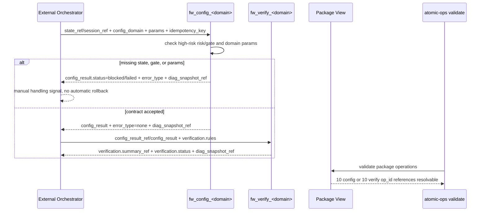

# LLD: STORY-003 - Model capacity ten domain config and verification atoms

> CP5 确认状态：`checkpoints/CP5-ALL-STORIES-LLD-BATCH.md` 已于 2026-05-18T16:47:38+0800 approved；本文 frontmatter `confirmed=true`。正文中早期关于 `confirmed=false` / CP5 未通过的门控描述仅作为设计阶段历史语境保留，当前实现仍需等待 STORY-001 contract frozen，并满足 Story `dev_gate`、文件所有权、CP6 和 CP7。`ngfw_verification` package 范围按 CP5 接受的 meta-se D-004 裁决执行：默认只含 10 个 capacity 验证 op_id。

本文档是 `STORY-003` 的低层设计（Low-Level Design）。当前 `confirmed=false`，只作为 CP5 全量 LLD 批次确认输入；全部目标 Story 的 LLD、CP5 自动预检和 `checkpoints/CP5-ALL-STORIES-LLD-BATCH.md` 人工确认完成前，不得实现任何 `atoms/` 或 `packages/` 文件。

## 1. Goal

创建 capacity 首批 10 个配置域的 20 个防火墙 atom 契约和 2 个 package 过滤视图，使 `atomic-ops` 能用原生 YAML 契约表达单设备 capacity 配置、配置后验证、错误诊断引用、高风险 gate 和无自动回滚边界。

本 Story 只定义原子操作契约，不复制 `.input/capacity` 源码，不连接设备，不新增 CLI 真实动作命令，不持久化真实凭据、token、cookie、设备地址或响应体。

## 2. Requirements（Functional / Non-Functional）

### 2.1 Functional

- 创建 10 个配置 atom：`fw_config_interface`、`fw_config_object`、`fw_config_acl_policy`、`fw_config_policy_route`、`fw_config_static_route`、`fw_config_nat`、`fw_config_bandwidth`、`fw_config_black_white_list`、`fw_config_ssl_vpn`、`fw_config_dynamic_routing`。
- 创建 10 个验证 atom：`fw_verify_interface`、`fw_verify_object`、`fw_verify_acl_policy`、`fw_verify_policy_route`、`fw_verify_static_route`、`fw_verify_nat`、`fw_verify_bandwidth`、`fw_verify_black_white_list`、`fw_verify_ssl_vpn`、`fw_verify_dynamic_routing`。
- 创建 `packages/ngfw_capacity_config.yaml`，其 `operations` 覆盖 10 个配置 atom，缺失 op_id 数为 0。
- 创建 `packages/ngfw_verification.yaml`，其 `operations` 覆盖 10 个验证 atom；若后续 STORY-002 提供健康检查 op_id，本 package 通过跨 Story 引用纳入，不在本 Story 自行创建健康检查 atom。
- 每个配置 atom 的输入契约包含 `state_ref` 或 `session_ref`、`config_domain`、`params`、`idempotency_key`。
- 每个配置 atom 的输出契约包含 `config_result`、`error_type`、`diag_snapshot_ref`。
- 每个验证 atom 的输入契约包含配置结果引用和验证规则；输出契约包含 `verification.summary_ref` 或等价 `verification_summary_ref`。
- 每个配置 atom 标记 `risk.level=high`，并包含 `gate.required=true`、非空 `gate.reason`、`approver_role` 和 `evidence_required`。
- 每个域的参数契约下限与 Story 卡片一致，10/10 域均显式列出，不允许只写通用 `params`。
- 配置失败只输出错误类别、诊断引用和人工处理信号，不写自动回滚、自动撤销或真实下发重试动作。

### 2.2 Non-Functional

- 安全性：新增 atom/package 中真实 IP、token、cookie、FTP 凭据、原始默认密码、真实请求体和真实响应体数量为 0；只允许 `<session-ref>`、`<state-ref>`、`<diag-snapshot-ref>` 等占位符。
- 可验证性：20 个 atom 均能通过 STORY-001 冻结后的 schema v1.1 校验；两个 package 均能通过 package 引用校验。
- 可维护性：10 个配置域使用同一配置 envelope、验证 envelope、错误分类和命名规则，差异只体现在 `config_domain` 与 `params` 字段。
- 可审计性：高风险配置 atom 的 gate 覆盖率为 100%，缺 gate 的 high-risk atom 必须在后续 `security_gate_check.py` 或等价检查中失败。
- 性能边界：本 Story 不引入网络调用和真实设备连接；CLI `list/show/packages/validate` 仍只读本地缓存，新增文件只增加本地 YAML 解析成本。
- 兼容性：依赖 STORY-001 的 schema v1.1 字段族；在 STORY-001 contract 未冻结前，本 LLD 的实现阶段保持阻断。

## 3. 模块拆分与职责

| 模块 / 文件组 | 职责 | 说明 |
|---|---|---|
| `atoms/fw/fw_config_<domain>.yaml` | 描述单设备单域配置契约 | 10 个配置 atom 复用 `risk`、`gate`、`state_ref/session_ref`、`params`、`idempotency_key`、`config_result`、`error_type`、`diag_snapshot_ref` 结构；引用 `process/HLD.md#schema-扩展决策下限（关闭 F-001）`。 |
| `atoms/fw/fw_verify_<domain>.yaml` | 描述单设备单域配置后验证契约 | 10 个验证 atom 复用 `verification.kind`、`verification.rules`、`verification.summary_ref`；验证失败只输出诊断和人工处理信号；引用 `process/ARCHITECTURE-DECISION.md#ADR-006：验证失败只诊断和人工处理，不自动回滚`。 |
| `packages/ngfw_capacity_config.yaml` | 组织 capacity 配置 atom 过滤视图 | 只保存 10 个配置 op_id，不复制 atom 内容，不包含真实设备参数。 |
| `packages/ngfw_verification.yaml` | 组织配置验证 atom 过滤视图 | 只保存 10 个验证 op_id；后续可由 STORY-002/004 通过 package 引用扩展健康检查或批次验证视图。 |
| shared envelope design | 统一 10 域输入输出、错误和 gate 语义 | 作为本 LLD 内部共享片段实现，不新增 `process/shared/` 文件；差异化点在第 5、6、8 节列明。 |
| CP5 review input | 为 CP5 自动预检和批次人工确认提供证据 | 第 2、4、6、10、11、12、14 节分别提供 AC 覆盖、文件范围、接口、测试、TASK-ID、OPEN 和 handoff notes。 |

## 4. 代码结构与文件影响范围

| 动作 | 文件路径 | 变更内容 |
|---|---|---|
| 创建 | `atoms/fw/fw_config_interface.yaml` | 定义 interface 配置 atom，`config_domain=interface`，参数下限为 `interface_ref`、`admin_state`、`address_ref`、`params_digest`。 |
| 创建 | `atoms/fw/fw_verify_interface.yaml` | 定义 interface 验证 atom，验证接口状态、地址引用和配置摘要一致性。 |
| 创建 | `atoms/fw/fw_config_object.yaml` | 定义 object 配置 atom，`config_domain=object`，参数下限为 `object_type`、`object_name`、`object_ref`、`params_digest`。 |
| 创建 | `atoms/fw/fw_verify_object.yaml` | 定义 object 验证 atom，验证对象类型、名称、引用和摘要一致性。 |
| 创建 | `atoms/fw/fw_config_acl_policy.yaml` | 定义 ACL/policy 配置 atom，`config_domain=acl_policy`，参数下限为 `policy_name`、`rule_ref`、`action`、`params_digest`。 |
| 创建 | `atoms/fw/fw_verify_acl_policy.yaml` | 定义 ACL/policy 验证 atom，验证策略规则引用、动作和摘要一致性。 |
| 创建 | `atoms/fw/fw_config_policy_route.yaml` | 定义 policy route 配置 atom，`config_domain=policy_route`，参数下限为 `route_ref`、`source_ref`、`destination_ref`、`next_hop_ref`。 |
| 创建 | `atoms/fw/fw_verify_policy_route.yaml` | 定义 policy route 验证 atom，验证源、目的和下一跳引用。 |
| 创建 | `atoms/fw/fw_config_static_route.yaml` | 定义 static route 配置 atom，`config_domain=static_route`，参数下限为 `route_ref`、`destination_ref`、`next_hop_ref`、`metric`。 |
| 创建 | `atoms/fw/fw_verify_static_route.yaml` | 定义 static route 验证 atom，验证目标网段、下一跳和 metric。 |
| 创建 | `atoms/fw/fw_config_nat.yaml` | 定义 NAT 配置 atom，`config_domain=nat`，参数下限为 `nat_rule_ref`、`source_ref`、`translated_ref`、`direction`。 |
| 创建 | `atoms/fw/fw_verify_nat.yaml` | 定义 NAT 验证 atom，验证规则引用、源/转换引用和方向。 |
| 创建 | `atoms/fw/fw_config_bandwidth.yaml` | 定义 bandwidth 配置 atom，`config_domain=bandwidth`，参数下限为 `profile_ref`、`limit_value`、`unit`、`target_ref`。 |
| 创建 | `atoms/fw/fw_verify_bandwidth.yaml` | 定义 bandwidth 验证 atom，验证限速档案、单位和目标引用。 |
| 创建 | `atoms/fw/fw_config_black_white_list.yaml` | 定义 black/white list 配置 atom，`config_domain=black_white_list`，参数下限为 `list_type`、`entry_ref`、`action`、`scope_ref`。 |
| 创建 | `atoms/fw/fw_verify_black_white_list.yaml` | 定义 black/white list 验证 atom，验证名单类型、条目、动作和作用域。 |
| 创建 | `atoms/fw/fw_config_ssl_vpn.yaml` | 定义 SSL VPN 配置 atom，`config_domain=ssl_vpn`，参数下限为 `vpn_profile_ref`、`user_group_ref`、`portal_ref`、`policy_ref`。 |
| 创建 | `atoms/fw/fw_verify_ssl_vpn.yaml` | 定义 SSL VPN 验证 atom，验证 VPN profile、用户组、portal 和策略引用。 |
| 创建 | `atoms/fw/fw_config_dynamic_routing.yaml` | 定义 dynamic routing 配置 atom，`config_domain=dynamic_routing`，参数下限为 `protocol`、`neighbor_ref`、`area_ref`、`route_policy_ref`。 |
| 创建 | `atoms/fw/fw_verify_dynamic_routing.yaml` | 定义 dynamic routing 验证 atom，验证协议、邻居、区域和路由策略引用。 |
| 创建 | `packages/ngfw_capacity_config.yaml` | 定义配置 package，`operations` 精确引用 10 个 `fw_config_*` op_id。 |
| 创建 | `packages/ngfw_verification.yaml` | 定义验证 package，`operations` 精确引用 10 个 `fw_verify_*` op_id；不创建 STORY-002 健康检查 atom。 |

禁止修改：`.input/`、`delivery/`、`src/atomic_ops/cli.py`、`schemas/`、`docs/`、`scripts/`。其中 `schemas/`、`docs/`、`scripts/` 是上游或后续 Story 的所有权范围，本 Story 只消费其契约。

## 5. 数据模型与持久化设计

本 Story 无新增运行时持久化模型；所有内容均为静态 YAML 契约和 package 视图。`session_ref`、`state_ref`、`diag_snapshot_ref`、`verification.summary_ref` 均为外部编排上下文中的引用字段，不由当前 CLI 写入 `_metadata.json`，不在 atom 示例中保存真实载荷。

| 对象 / 字段 | 类型 | 约束 | 说明 |
|---|---|---|---|
| `schema_version` | string | 由 STORY-001 冻结；目标值为 `"1.1"` 或 STORY-001 LLD/实现确认的兼容值 | 本 Story 不自行修改 schema 正则。 |
| `op_id` | string | 匹配 `^fw_[a-z]+_[a-z_]+$`，文件名等于 `op_id + ".yaml"` | 配置 atom 使用 `fw_config_<domain>`，验证 atom 使用 `fw_verify_<domain>`。 |
| `risk.level` | enum | 10 个配置 atom 固定为 `high` | 验证 atom 可按 STORY-001 schema 约束设为 `medium` 或省略非必填风险字段；若 schema 要求所有 atom 有风险字段，则验证 atom 使用 `medium`。 |
| `gate.required` | boolean | 10 个配置 atom 固定为 `true` | `gate.reason` 必须非空，说明 capacity 配置会改变设备策略或转发表。 |
| `inputs.state_ref` | string | `<state-ref>` 占位或外部引用；禁止 token/cookie/password 片段 | 与 `inputs.session_ref` 二选一或同时允许，具体必填规则由 STORY-001 schema 冻结。 |
| `inputs.session_ref` | string | `<session-ref>` 占位或外部引用；禁止真实认证载荷 | 用于外部编排方传入登录态引用。 |
| `inputs.config_domain` | enum | 10 个域之一：`interface`、`object`、`acl_policy`、`policy_route`、`static_route`、`nat`、`bandwidth`、`black_white_list`、`ssl_vpn`、`dynamic_routing` | 配置 atom 固定为自身域；验证 atom 通过 `verification.kind` 或 `config_domain` 标记同域验证。 |
| `inputs.params` | object | 每域必须包含第 4 节列出的参数下限 | `params_digest` 用于幂等和验证摘要比对；路由/NAT/VPN 等域按 Story 卡片下限提供引用字段。 |
| `inputs.idempotency_key` | string | 非空；建议由外部编排方按 `op_id + state_ref/session_ref + config_domain + params_digest` 生成 | 本 Story 只定义字段，不生成真实 key。 |
| `returns.data.config_result` | object | 包含 `status`、`config_domain`、`applied_ref` 或等价引用 | `status` 枚举建议为 `succeeded/failed/blocked/skipped`。 |
| `returns.data.error_type` | enum/string | 建议枚举 `none/state_invalid/validation_failed/gate_missing/config_rejected/device_unreachable/unknown` | 失败时必须非空且与 `diag_snapshot_ref` 配套。 |
| `returns.data.diag_snapshot_ref` | string/null | 仅保存诊断引用，不保存真实响应体 | 失败时建议必填，成功时允许 `null`。 |
| `verification.rules` | array/object | 每个验证 atom 至少声明 1 条规则引用或规则对象 | 验证规则不得包含真实设备响应体。 |
| `verification.summary_ref` | string/null | 验证结果摘要引用 | 对应 Story 卡片中的 `verification_summary_ref` 等价字段。 |
| `package.operations` | array[string] | 只保存 op_id，配置 package 为 10 项，验证 package 为 10 项 | package 不复制 atom YAML 正文。 |

## 6. API / Interface 设计

### 6.1 统一配置 atom 接口

| 接口 / 入口 | 输入 | 输出 | 调用方 | 说明 |
|---|---|---|---|---|
| `fw_config_interface` | `state_ref/session_ref`、`config_domain=interface`、`params.interface_ref`、`params.admin_state`、`params.address_ref`、`params.params_digest`、`idempotency_key`、`risk`、`gate` | `config_result`、`error_type`、`diag_snapshot_ref` | 外部编排方；package `ngfw_capacity_config` | 对应测试 T10-01、T10-21。 |
| `fw_config_object` | `state_ref/session_ref`、`config_domain=object`、`params.object_type`、`params.object_name`、`params.object_ref`、`params.params_digest`、`idempotency_key`、`risk`、`gate` | `config_result`、`error_type`、`diag_snapshot_ref` | 外部编排方；package `ngfw_capacity_config` | 对应测试 T10-02、T10-21。 |
| `fw_config_acl_policy` | `state_ref/session_ref`、`config_domain=acl_policy`、`params.policy_name`、`params.rule_ref`、`params.action`、`params.params_digest`、`idempotency_key`、`risk`、`gate` | `config_result`、`error_type`、`diag_snapshot_ref` | 外部编排方；package `ngfw_capacity_config` | 对应测试 T10-03、T10-21。 |
| `fw_config_policy_route` | `state_ref/session_ref`、`config_domain=policy_route`、`params.route_ref`、`params.source_ref`、`params.destination_ref`、`params.next_hop_ref`、`idempotency_key`、`risk`、`gate` | `config_result`、`error_type`、`diag_snapshot_ref` | 外部编排方；package `ngfw_capacity_config` | 对应测试 T10-04、T10-21。 |
| `fw_config_static_route` | `state_ref/session_ref`、`config_domain=static_route`、`params.route_ref`、`params.destination_ref`、`params.next_hop_ref`、`params.metric`、`idempotency_key`、`risk`、`gate` | `config_result`、`error_type`、`diag_snapshot_ref` | 外部编排方；package `ngfw_capacity_config` | 对应测试 T10-05、T10-21。 |
| `fw_config_nat` | `state_ref/session_ref`、`config_domain=nat`、`params.nat_rule_ref`、`params.source_ref`、`params.translated_ref`、`params.direction`、`idempotency_key`、`risk`、`gate` | `config_result`、`error_type`、`diag_snapshot_ref` | 外部编排方；package `ngfw_capacity_config` | 对应测试 T10-06、T10-21。 |
| `fw_config_bandwidth` | `state_ref/session_ref`、`config_domain=bandwidth`、`params.profile_ref`、`params.limit_value`、`params.unit`、`params.target_ref`、`idempotency_key`、`risk`、`gate` | `config_result`、`error_type`、`diag_snapshot_ref` | 外部编排方；package `ngfw_capacity_config` | 对应测试 T10-07、T10-21。 |
| `fw_config_black_white_list` | `state_ref/session_ref`、`config_domain=black_white_list`、`params.list_type`、`params.entry_ref`、`params.action`、`params.scope_ref`、`idempotency_key`、`risk`、`gate` | `config_result`、`error_type`、`diag_snapshot_ref` | 外部编排方；package `ngfw_capacity_config` | 对应测试 T10-08、T10-21。 |
| `fw_config_ssl_vpn` | `state_ref/session_ref`、`config_domain=ssl_vpn`、`params.vpn_profile_ref`、`params.user_group_ref`、`params.portal_ref`、`params.policy_ref`、`idempotency_key`、`risk`、`gate` | `config_result`、`error_type`、`diag_snapshot_ref` | 外部编排方；package `ngfw_capacity_config` | 对应测试 T10-09、T10-21。 |
| `fw_config_dynamic_routing` | `state_ref/session_ref`、`config_domain=dynamic_routing`、`params.protocol`、`params.neighbor_ref`、`params.area_ref`、`params.route_policy_ref`、`idempotency_key`、`risk`、`gate` | `config_result`、`error_type`、`diag_snapshot_ref` | 外部编排方；package `ngfw_capacity_config` | 对应测试 T10-10、T10-21。 |

### 6.2 统一验证 atom 接口

| 接口 / 入口 | 输入 | 输出 | 调用方 | 说明 |
|---|---|---|---|---|
| `fw_verify_interface` | `config_result_ref` 或 `config_result`、`verification.rules`、`verification.expected.interface_ref/address_ref` | `verification.summary_ref`、`verification.status`、`diag_snapshot_ref` | 外部编排方；package `ngfw_verification` | 对应测试 T10-11、T10-22。 |
| `fw_verify_object` | `config_result_ref` 或 `config_result`、`verification.rules`、`verification.expected.object_ref/object_name` | `verification.summary_ref`、`verification.status`、`diag_snapshot_ref` | 外部编排方；package `ngfw_verification` | 对应测试 T10-12、T10-22。 |
| `fw_verify_acl_policy` | `config_result_ref` 或 `config_result`、`verification.rules`、`verification.expected.rule_ref/action` | `verification.summary_ref`、`verification.status`、`diag_snapshot_ref` | 外部编排方；package `ngfw_verification` | 对应测试 T10-13、T10-22。 |
| `fw_verify_policy_route` | `config_result_ref` 或 `config_result`、`verification.rules`、`verification.expected.route_ref/next_hop_ref` | `verification.summary_ref`、`verification.status`、`diag_snapshot_ref` | 外部编排方；package `ngfw_verification` | 对应测试 T10-14、T10-22。 |
| `fw_verify_static_route` | `config_result_ref` 或 `config_result`、`verification.rules`、`verification.expected.destination_ref/metric` | `verification.summary_ref`、`verification.status`、`diag_snapshot_ref` | 外部编排方；package `ngfw_verification` | 对应测试 T10-15、T10-22。 |
| `fw_verify_nat` | `config_result_ref` 或 `config_result`、`verification.rules`、`verification.expected.nat_rule_ref/direction` | `verification.summary_ref`、`verification.status`、`diag_snapshot_ref` | 外部编排方；package `ngfw_verification` | 对应测试 T10-16、T10-22。 |
| `fw_verify_bandwidth` | `config_result_ref` 或 `config_result`、`verification.rules`、`verification.expected.profile_ref/limit_value/unit` | `verification.summary_ref`、`verification.status`、`diag_snapshot_ref` | 外部编排方；package `ngfw_verification` | 对应测试 T10-17、T10-22。 |
| `fw_verify_black_white_list` | `config_result_ref` 或 `config_result`、`verification.rules`、`verification.expected.list_type/entry_ref/action` | `verification.summary_ref`、`verification.status`、`diag_snapshot_ref` | 外部编排方；package `ngfw_verification` | 对应测试 T10-18、T10-22。 |
| `fw_verify_ssl_vpn` | `config_result_ref` 或 `config_result`、`verification.rules`、`verification.expected.vpn_profile_ref/user_group_ref` | `verification.summary_ref`、`verification.status`、`diag_snapshot_ref` | 外部编排方；package `ngfw_verification` | 对应测试 T10-19、T10-22。 |
| `fw_verify_dynamic_routing` | `config_result_ref` 或 `config_result`、`verification.rules`、`verification.expected.protocol/neighbor_ref/area_ref` | `verification.summary_ref`、`verification.status`、`diag_snapshot_ref` | 外部编排方；package `ngfw_verification` | 对应测试 T10-20、T10-22。 |

### 6.3 Package 接口

| 接口 / 入口 | 输入 | 输出 | 调用方 | 说明 |
|---|---|---|---|---|
| `ngfw_capacity_config` package | `package_id=ngfw_capacity_config`、10 个配置 op_id | `atomic-ops validate --package ngfw_capacity_config` 可解析 10/10 op_id | CLI package 查询与验证 | 对应测试 T10-23。 |
| `ngfw_verification` package | `package_id=ngfw_verification`、10 个验证 op_id | `atomic-ops validate --package ngfw_verification` 可解析 10/10 op_id | CLI package 查询与验证 | 对应测试 T10-24。 |

## 7. 核心处理流程

1. 外部编排方在本仓库之外准备 `state_ref` 或 `session_ref`，并为单域配置任务生成 `idempotency_key`。
2. 外部编排方选择 10 个域中的一个配置 atom，传入 `config_domain` 和域级 `params`。
3. 配置 atom 的契约要求检查 `risk.level=high`、`gate.required=true`、非空 `gate.reason` 和 `evidence_required`。
4. 若状态引用缺失、gate 缺失或参数不满足域级下限，配置 atom 的契约返回 `config_result.status=blocked/failed`、`error_type` 和 `diag_snapshot_ref`；不触发自动回滚。
5. 若配置契约通过，配置 atom 的输出包含 `config_result`，供同域验证 atom 使用。
6. 同域验证 atom 消费 `config_result_ref` 或 `config_result`，执行静态契约层面的验证规则声明，并输出 `verification.summary_ref`。
7. 两个 package 分别组织配置和验证 op_id；CLI 仅进行本地 package 引用校验，不连接真实设备。

异常路径：

- `state_ref/session_ref` 同时缺失：配置 atom 返回 `error_type=state_invalid`，诊断引用为占位或外部引用，不保存真实认证信息。
- `risk/gate` 缺失：配置 atom 在 schema 或安全 gate 检查阶段失败，`error_type=gate_missing`。
- `params` 缺少域级下限字段：schema 或契约校验失败，`error_type=validation_failed`。
- `config_domain` 与 op_id 不一致：schema 或 reviewer 检查失败，`error_type=validation_failed`。
- 验证规则缺失：验证 atom 失败，`verification.status=blocked`，输出 `verification.summary_ref` 或 `diag_snapshot_ref`。
- package 引用不存在：`atomic-ops validate --package` 返回失败；实现阶段不得保留半成品 package。

## 8. 技术设计细节

- 关键算法 / 规则：
  - 命名规则：配置 atom 为 `fw_config_<domain>`；验证 atom 为 `fw_verify_<domain>`；文件路径为 `atoms/fw/<op_id>.yaml`；package id 为 `ngfw_capacity_config` 和 `ngfw_verification`。
  - 域名规范：Story 卡中的 `ACL/policy` 映射为 `acl_policy`，`policy route` 映射为 `policy_route`，`static route` 映射为 `static_route`，`black/white list` 映射为 `black_white_list`，`SSL VPN` 映射为 `ssl_vpn`，`dynamic routing` 映射为 `dynamic_routing`。
  - 配置 envelope：每个配置 atom 固定 `config_domain`，输入必须包含状态引用、域级 `params` 和 `idempotency_key`，输出必须包含 `config_result`、`error_type`、`diag_snapshot_ref`。
  - 验证 envelope：每个验证 atom 输入配置结果引用和 `verification.rules`，输出 `verification.summary_ref`，失败时只输出诊断与人工处理信号。
  - high-risk gate：10 个配置 atom 全部为 high risk；`gate.required=true` 且 `gate.reason` 非空；不得把 gate 只写进自然语言 description。
  - no rollback：任何 atom 的 `steps`、`postconditions`、`returns` 或 `errors` 不得声明自动 rollback/revert/undo；回滚只作为实现文件层面的手动回退策略。
- 依赖选择与复用点：
  - 消费 STORY-001 的 schema v1.1 字段族：`risk`、`credential_ref`、`session_ref`、`state_ref`、`gate`、`verification`。
  - 消费 HLD 的 session/state 引用边界：CLI 不保存真实登录态，不判定真实会话有效性。
  - 消费 ADR-004 的 10 域清单和 ADR-006 的验证失败处理边界。
- 兼容性处理：
  - 若 STORY-001 最终将 `schema_version` 从 `"1.1"` 调整为 `"1.1.0"` 以匹配既有正则，本 Story 的 20 个 atom 统一使用 STORY-001 确认值，不在本 Story 中分叉。
  - 若 STORY-001 对验证 atom 也强制要求 `risk` 字段，本 Story 的 10 个验证 atom 使用 `risk.level=medium`，且不设置 high-risk gate 为必填，除非 schema 明确要求。
  - 若 `returns.data.verification_summary_ref` 与 `verification.summary_ref` 二者只能保留一个，以 STORY-001 字段参考为准；本 Story 在测试中接受二者等价但实现只写一个。
- 图示类型选择：时序图；原因是配置 atom、验证 atom、package 和 CLI 校验跨 4 个模块，且存在参数/gate/验证失败分支。

## 9. 安全与性能设计

| 维度 | 设计措施 | 验证方式 |
|---|---|---|
| 安全 | `.input/` 只读参考，新增文件不包含 `.input/capacity` 源码、env、日志、请求体、响应体或真实凭据。 | 敏感模式扫描；review 检查 `.input/` 复制数量为 0。 |
| 安全 | 10 个配置 atom 全部 `risk.level=high` 且 `gate.required=true`。 | schema 校验；后续 STORY-005 `security_gate_check.py` 或等价检查；人工 review 抽查 10/10。 |
| 安全 | `session_ref`、`state_ref`、`diag_snapshot_ref`、`verification.summary_ref` 只使用引用或占位符。 | `rg` 检查 token/cookie/password/authorization/真实 IP 等敏感模式；schema 禁止明文认证载荷。 |
| 安全 | 验证失败只输出诊断引用和人工处理信号，不自动回滚。 | 检查 atom `steps`、`postconditions`、`returns`、`errors` 中 rollback/revert/undo 自动动作数量为 0。 |
| 性能 | 不新增网络调用、设备连接、异步执行或真实配置下发。 | CLI help 和代码范围审查确认未修改 `src/atomic_ops/cli.py`；新增文件为静态 YAML。 |
| 性能 | package 只保存 op_id 引用，不复制 atom 内容，避免重复解析大块正文。 | `uv run atomic-ops validate --package ngfw_capacity_config` 和 `uv run atomic-ops validate --package ngfw_verification`。 |
| 可维护性 | 10 个域使用统一 envelope，差异集中在 `params` 下限和 `verification.expected`。 | review 对照第 4、6、10 节确认域覆盖 10/10。 |

## 10. 测试设计

| 测试场景 | 前置条件 | 操作 | 预期结果 | 验证方式 |
|---|---|---|---|---|
| T10-01 interface 配置 atom schema | STORY-001 schema v1.1 可用 | 校验 `atoms/fw/fw_config_interface.yaml` | 输入/输出/gate/params 下限通过 | `uv run --python 3.11 python scripts/validate_schema.py atoms/fw/fw_config_interface.yaml` |
| T10-02 object 配置 atom schema | 同上 | 校验 `atoms/fw/fw_config_object.yaml` | 输入/输出/gate/params 下限通过 | schema 校验 |
| T10-03 ACL/policy 配置 atom schema | 同上 | 校验 `atoms/fw/fw_config_acl_policy.yaml` | 输入/输出/gate/params 下限通过 | schema 校验 |
| T10-04 policy route 配置 atom schema | 同上 | 校验 `atoms/fw/fw_config_policy_route.yaml` | 输入/输出/gate/params 下限通过 | schema 校验 |
| T10-05 static route 配置 atom schema | 同上 | 校验 `atoms/fw/fw_config_static_route.yaml` | 输入/输出/gate/params 下限通过 | schema 校验 |
| T10-06 NAT 配置 atom schema | 同上 | 校验 `atoms/fw/fw_config_nat.yaml` | 输入/输出/gate/params 下限通过 | schema 校验 |
| T10-07 bandwidth 配置 atom schema | 同上 | 校验 `atoms/fw/fw_config_bandwidth.yaml` | 输入/输出/gate/params 下限通过 | schema 校验 |
| T10-08 black/white list 配置 atom schema | 同上 | 校验 `atoms/fw/fw_config_black_white_list.yaml` | 输入/输出/gate/params 下限通过 | schema 校验 |
| T10-09 SSL VPN 配置 atom schema | 同上 | 校验 `atoms/fw/fw_config_ssl_vpn.yaml` | 输入/输出/gate/params 下限通过 | schema 校验 |
| T10-10 dynamic routing 配置 atom schema | 同上 | 校验 `atoms/fw/fw_config_dynamic_routing.yaml` | 输入/输出/gate/params 下限通过 | schema 校验 |
| T10-11 interface 验证 atom schema | STORY-001 schema v1.1 可用 | 校验 `atoms/fw/fw_verify_interface.yaml` | `verification.rules` 与 `summary_ref` 契约通过 | schema 校验 |
| T10-12 object 验证 atom schema | 同上 | 校验 `atoms/fw/fw_verify_object.yaml` | 验证契约通过 | schema 校验 |
| T10-13 ACL/policy 验证 atom schema | 同上 | 校验 `atoms/fw/fw_verify_acl_policy.yaml` | 验证契约通过 | schema 校验 |
| T10-14 policy route 验证 atom schema | 同上 | 校验 `atoms/fw/fw_verify_policy_route.yaml` | 验证契约通过 | schema 校验 |
| T10-15 static route 验证 atom schema | 同上 | 校验 `atoms/fw/fw_verify_static_route.yaml` | 验证契约通过 | schema 校验 |
| T10-16 NAT 验证 atom schema | 同上 | 校验 `atoms/fw/fw_verify_nat.yaml` | 验证契约通过 | schema 校验 |
| T10-17 bandwidth 验证 atom schema | 同上 | 校验 `atoms/fw/fw_verify_bandwidth.yaml` | 验证契约通过 | schema 校验 |
| T10-18 black/white list 验证 atom schema | 同上 | 校验 `atoms/fw/fw_verify_black_white_list.yaml` | 验证契约通过 | schema 校验 |
| T10-19 SSL VPN 验证 atom schema | 同上 | 校验 `atoms/fw/fw_verify_ssl_vpn.yaml` | 验证契约通过 | schema 校验 |
| T10-20 dynamic routing 验证 atom schema | 同上 | 校验 `atoms/fw/fw_verify_dynamic_routing.yaml` | 验证契约通过 | schema 校验 |
| T10-21 high-risk gate 覆盖 | 10 个配置 atom 已创建 | 检查 10 个配置 atom 的 `risk.level` 和 `gate` | high-risk gate 覆盖率 10/10 | 后续 `uv run --python 3.11 python scripts/security_gate_check.py` 或人工 CP6 检查 |
| T10-22 验证失败无自动回滚 | 10 个验证 atom 已创建 | 扫描 `rollback/revert/undo` 自动动作描述 | 自动回滚动作数量 0；失败只诊断和人工处理 | `rg -n "rollback|revert|undo" atoms/fw/fw_verify_*.yaml` 后人工判断语义 |
| T10-23 配置 package 引用 | 10 个配置 atom 已创建 | 校验 package `ngfw_capacity_config` | package 引用缺失 op_id 数 0，operations 数为 10 | `uv run atomic-ops validate --package ngfw_capacity_config` |
| T10-24 验证 package 引用 | 10 个验证 atom 已创建 | 校验 package `ngfw_verification` | package 引用缺失 op_id 数 0，operations 数为 10 | `uv run atomic-ops validate --package ngfw_verification` |
| T10-25 敏感信息扫描 | 20 个 atom 与 2 个 package 已创建 | 扫描真实 IP、token、cookie、authorization、password、ftp_pass、secret | 明文敏感值数量 0；占位符 `<...>` 允许 | 后续 `security_gate_check.py` 或 `rg` 敏感模式检查 |
| T10-26 禁止文件范围 | 实现 diff 可用 | 检查 diff 文件列表 | 只包含第 4 节 22 个文件；不包含 `.input/`、`delivery/`、`src/atomic_ops/cli.py` | `git diff --name-only` 人工/自动核对 |

第 6 节每个配置/验证接口均至少对应 T10-01..T10-24 中一项测试；第 7 节异常路径对应 T10-21、T10-22、T10-25、T10-26。

## 11. 实施步骤

| TASK-ID | 动作 | 目标文件 | 详细描述 | 对应测试 |
|---|---|---|---|---|
| S003-T1 | 创建 | `atoms/fw/fw_config_interface.yaml`、`atoms/fw/fw_verify_interface.yaml` | 定义 interface 配置/验证 atom；配置参数包含 `interface_ref`、`admin_state`、`address_ref`、`params_digest`；配置 atom high-risk gate 必填。 | T10-01、T10-11、T10-21、T10-22 |
| S003-T2 | 创建 | `atoms/fw/fw_config_object.yaml`、`atoms/fw/fw_verify_object.yaml` | 定义 object 配置/验证 atom；配置参数包含 `object_type`、`object_name`、`object_ref`、`params_digest`。 | T10-02、T10-12、T10-21、T10-22 |
| S003-T3 | 创建 | `atoms/fw/fw_config_acl_policy.yaml`、`atoms/fw/fw_verify_acl_policy.yaml` | 定义 ACL/policy 配置/验证 atom；配置参数包含 `policy_name`、`rule_ref`、`action`、`params_digest`；域名使用 `acl_policy`。 | T10-03、T10-13、T10-21、T10-22 |
| S003-T4 | 创建 | `atoms/fw/fw_config_policy_route.yaml`、`atoms/fw/fw_verify_policy_route.yaml` | 定义 policy route 配置/验证 atom；配置参数包含 `route_ref`、`source_ref`、`destination_ref`、`next_hop_ref`。 | T10-04、T10-14、T10-21、T10-22 |
| S003-T5 | 创建 | `atoms/fw/fw_config_static_route.yaml`、`atoms/fw/fw_verify_static_route.yaml` | 定义 static route 配置/验证 atom；配置参数包含 `route_ref`、`destination_ref`、`next_hop_ref`、`metric`。 | T10-05、T10-15、T10-21、T10-22 |
| S003-T6 | 创建 | `atoms/fw/fw_config_nat.yaml`、`atoms/fw/fw_verify_nat.yaml` | 定义 NAT 配置/验证 atom；配置参数包含 `nat_rule_ref`、`source_ref`、`translated_ref`、`direction`。 | T10-06、T10-16、T10-21、T10-22 |
| S003-T7 | 创建 | `atoms/fw/fw_config_bandwidth.yaml`、`atoms/fw/fw_verify_bandwidth.yaml` | 定义 bandwidth 配置/验证 atom；配置参数包含 `profile_ref`、`limit_value`、`unit`、`target_ref`。 | T10-07、T10-17、T10-21、T10-22 |
| S003-T8 | 创建 | `atoms/fw/fw_config_black_white_list.yaml`、`atoms/fw/fw_verify_black_white_list.yaml` | 定义 black/white list 配置/验证 atom；配置参数包含 `list_type`、`entry_ref`、`action`、`scope_ref`；域名使用 `black_white_list`。 | T10-08、T10-18、T10-21、T10-22 |
| S003-T9 | 创建 | `atoms/fw/fw_config_ssl_vpn.yaml`、`atoms/fw/fw_verify_ssl_vpn.yaml` | 定义 SSL VPN 配置/验证 atom；配置参数包含 `vpn_profile_ref`、`user_group_ref`、`portal_ref`、`policy_ref`；域名使用 `ssl_vpn`。 | T10-09、T10-19、T10-21、T10-22 |
| S003-T10 | 创建 | `atoms/fw/fw_config_dynamic_routing.yaml`、`atoms/fw/fw_verify_dynamic_routing.yaml` | 定义 dynamic routing 配置/验证 atom；配置参数包含 `protocol`、`neighbor_ref`、`area_ref`、`route_policy_ref`；域名使用 `dynamic_routing`。 | T10-10、T10-20、T10-21、T10-22 |
| S003-T11 | 创建 | `packages/ngfw_capacity_config.yaml` | 创建配置 package，`operations` 精确包含 10 个配置 op_id，不复制 atom 正文。 | T10-23 |
| S003-T12 | 创建 | `packages/ngfw_verification.yaml` | 创建验证 package，`operations` 精确包含 10 个验证 op_id；若纳入 STORY-002 健康检查 op_id，必须作为跨 Story 引用记录，不在本 Story 创建该 atom。 | T10-24 |
| S003-T13 | 校验 | `atoms/fw/*.yaml`、`packages/ngfw_capacity_config.yaml`、`packages/ngfw_verification.yaml` | 执行 schema、package 引用、high-risk gate、敏感信息和禁止文件范围检查；失败时回到对应域 TASK 修复。 | T10-21、T10-22、T10-23、T10-24、T10-25、T10-26 |

每个文件影响项均由 S003-T1..S003-T12 覆盖；S003-T13 不创建产品文件，只作为实现完成前的校验任务。

## 12. 风险、难点与预研建议

| 风险 / 难点 | 影响 | 缓解措施 / 预研建议 |
|---|---|---|
| STORY-001 schema v1.1 contract 尚未冻结 | 本 Story 实现时无法确定 `schema_version`、`risk/gate/verification` 精确字段结构 | LLD 阶段允许并行；实现阶段必须等待 STORY-001 CP5 confirmed 和 contract frozen。 |
| `process/ARCHITECTURE-DECISION.md` frontmatter 仍为 `status=draft`、`confirmed=false` | ready-check 中 ADR 确认状态与 HLD/STATE/CR-003 描述不一致 | 不伪造确认；在 CP5 handoff 中提示 meta-po 修正或确认该 ADR 状态。 |
| 20 个 atom 规模较大，容易出现域名或参数漂移 | package 引用、域覆盖和验收标准可能不一致 | 使用第 4、6、10、11 节的 10 域矩阵逐项核对；域名使用固定 snake_case 映射。 |
| 验证 atom 字段命名可能在 `verification.summary_ref` 与 `verification_summary_ref` 间漂移 | schema 校验和 CLI 展示可能失败 | 以 STORY-001 字段参考最终冻结值为准；本 LLD 把两者列为等价意图，实施只保留一个。 |
| high-risk gate 如果只写自然语言会绕过机器检查 | 安全 gate 覆盖无法量化 | 配置 atom 必须结构化写入 `risk.level=high` 和 `gate.required=true`；后续 STORY-005 增加静态检查。 |
| 验证失败被误写成自动回滚 | 违反 ADR-006 和 R-C-012 | atom 文本中只允许“人工处理信号”和“诊断引用”；自动 rollback/revert/undo 禁止。 |
| `ngfw_verification` 是否纳入 STORY-002 健康检查 op_id | package 范围可能跨 Story | 本 Story 默认只包含 10 个配置验证 op_id；若 CP5 要求完整验证链路可新增跨 Story 引用记录，不能创建 STORY-002 文件。 |

### OPEN / Spike 跟踪

| ID | 类型（OPEN / Spike / BLOCKED） | 问题 | 下一动作 | 责任方 |
|---|---|---|---|---|
| O-01 | BLOCKED | `process/ARCHITECTURE-DECISION.md` frontmatter 是 `status=draft`、`confirmed=false`，与 HLD confirmed、STATE CP3 approved、CR-003 LLD dispatch ready 存在状态不一致。 | CP5 批次确认前由 meta-po 修正 ADR frontmatter 或在 CP5 审查稿中明确该 ADR 状态可作为 LLD 输入。 | meta-po |
| O-02 | OPEN | STORY-001 schema v1.1 contract、字段参考和版本值尚未 CP5 confirmed；本 Story 的实现阶段不能确定最终 YAML 字段细节。 | 等待 STORY-001 LLD/CP5 批次确认；实现时以 STORY-001 confirmed LLD 和 schema/docs 实现为强输入。 | meta-po / STORY-001 meta-dev |
| O-03 | OPEN | `ngfw_verification` 是否在本 Story 只含 10 个 capacity 验证 op_id，还是在 STORY-002 完成后追加健康检查 op_id 作为跨 Story 引用。 | CP5 批次确认时由 meta-po 聚合 STORY-002 与 STORY-003 LLD，决定 package 是否包含跨 Story op_id。 | meta-po / user |

## 13. 回滚与发布策略

- 发布方式：
  - 实现阶段在 CP5 全量确认后，以普通仓库文件变更创建 20 个 `atoms/fw/*.yaml` 和 2 个 `packages/*.yaml`。
  - 发布前必须通过 schema 校验、package 引用校验、high-risk gate 检查、敏感信息扫描和禁止文件范围检查。
  - 不发布执行器、不发布安装脚本、不发布真实设备动作 CLI。
- 回滚触发条件：
  - 任一 atom 不符合 STORY-001 schema v1.1，且无法通过字段级修复保持 10 域一致。
  - 任一配置域缺少配置 atom 或验证 atom，造成半成品域。
  - 任一配置 atom 缺少 `risk/gate` 或含明文敏感值。
  - 任一验证 atom 声明自动回滚或自动撤销。
  - 任一 package 引用不存在 op_id 或引用非本 Story/已确认跨 Story op_id。
- 回滚动作：
  - 按域回退时必须同时移除该域配置 atom、验证 atom和两个 package 中对应 op_id，禁止保留只有配置无验证或只有验证无配置的半成品域。
  - 若 schema v1.1 contract 与本 Story LLD 不兼容，停止 STORY-003 实现并回到 LLD 修改，不修改 `schemas/` 或其他 Story 文件。
  - 若敏感信息进入新增文件，立即移除敏感内容并重跑扫描；不得在日志、CP6 或文档中复述敏感值。
  - 若 package 范围争议来自 STORY-002 健康检查 op_id，回退跨 Story package 引用，保留本 Story 10 个 capacity 验证 op_id。

## 14. Definition of Done

- [ ] LLD 14 个章节全部填写完成，frontmatter `confirmed=false`。
- [ ] 10 个 capacity 配置/验证域全部覆盖，覆盖率 10/10。
- [ ] 文件影响范围明确为 20 个 `atoms/fw/` 文件和 2 个 `packages/` 文件。
- [ ] 第 6 节每个接口在第 10 节有对应测试入口。
- [ ] 第 7 节异常路径在第 10 节有错误路径验证入口。
- [ ] 第 11 节 S003-T1..S003-T13 与第 4 节文件影响范围一一对应。
- [ ] `shared_fragments` 已列出 HLD/ADR 中复用的字段、状态、命名、10 域和无自动回滚片段。
- [ ] OPEN / blocked 项已清点：当前 3 项，均未伪造成已确认。
- [ ] LLD 明确禁止实现产品文件、修改 `.input/`、写入 `delivery/`、修改 `src/atomic_ops/cli.py` 或进入 CP6/CP7。
- [ ] 实现前门控明确：STORY-001 contract frozen、全部目标 Story LLD 输出、全部 CP5 自动预检完成、CP5 批次人工确认 approved、当前 Story `dev_gate` 满足。

### CP5 handoff notes

| # | 检查项 | 状态 | 证据 |
|---|---|---|---|
| 1 | LLD 覆盖 AC | READY_FOR_CP5_AUTO | 第 2、4、6、10、11、14 节覆盖 Story 卡片 8 条量化验收标准。 |
| 2 | 与 HLD / ADR 一致 | READY_WITH_OPEN | HLD confirmed；ADR 内容被消费，但 frontmatter `confirmed=false` 记录为 O-01。 |
| 3 | 文件影响范围明确 | READY_FOR_CP5_AUTO | 第 4 节列出 22 个实现文件；禁止范围明确。 |
| 4 | 接口契约完整 | READY_FOR_CP5_AUTO | 第 5、6、7、8 节定义配置/验证/package 接口和异常路径。 |
| 5 | 测试与 dev_gate 可计算 | READY_WITH_OPEN | 第 10、11、12、14 节定义测试入口；实现仍等待 STORY-001 contract 和 CP5 batch confirmation。 |

### CP5 confirmation boundary

人工确认回复应由 meta-po 在 `checkpoints/CP5-ALL-STORIES-LLD-BATCH.md` 统一发起。本 Story LLD 单独 `approve` 不足以进入实现；必须等待 `STORY-001`..`STORY-006` 全部 LLD 和 CP5 自动预检完成，并由 CP5 批次人工确认 approved。
