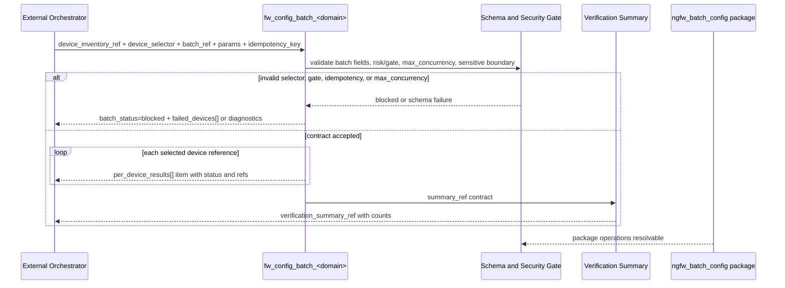

# LLD: STORY-004 - Model multi-device batch configuration contract

> CP5 确认状态：`checkpoints/CP5-ALL-STORIES-LLD-BATCH.md` 已于 2026-05-18T16:47:38+0800 approved；本文 frontmatter `confirmed=true`。正文中早期关于 `confirmed=false` / CP5 未通过的门控描述仅作为设计阶段历史语境保留，当前实现仍需等待 STORY-001 / STORY-003 contracts frozen，并满足 Story `dev_gate`、文件所有权、CP6 和 CP7。

本文档是 `STORY-004` 的低层设计（Low-Level Design）。当前 `confirmed=false`，只作为 `CR-003-LLD-BATCH` 全量 CP5 统一确认输入；全部目标 Story LLD、全部 CP5 自动预检和 `checkpoints/CP5-ALL-STORIES-LLD-BATCH.md` 人工确认完成前，不得创建或修改 `atoms/`、`packages/`、`docs/`、`schemas/`、`src/`、`scripts/` 或任何产品文件。

## 1. Goal

创建多设备批次配置的静态 atomic-op 契约：10 个 `fw_config_batch_<domain>` atom、1 个 `ngfw_batch_config` package 和 1 份批次配置契约文档，使 `atomic-ops` 能以原生 YAML 和文档表达设备清单引用、设备选择器、批次引用、并发限制、幂等键、逐设备结果、失败设备隔离、批次验证汇总和 `partial_failed` 状态。

本 Story 只定义批次配置契约，不实现批次 executor，不连接设备，不读取真实 inventory，不执行并发配置，不自动回滚已成功设备，不保存真实 IP、用户名、密码、token、cookie、FTP 凭据或真实响应体。

## 2. Requirements（Functional / Non-Functional）

### 2.1 Functional

- F-01：创建 10 个批次配置 atom：`fw_config_batch_interface`、`fw_config_batch_object`、`fw_config_batch_acl_policy`、`fw_config_batch_policy_route`、`fw_config_batch_static_route`、`fw_config_batch_nat`、`fw_config_batch_bandwidth`、`fw_config_batch_black_white_list`、`fw_config_batch_ssl_vpn`、`fw_config_batch_dynamic_routing`。
- F-02：每个批次 atom 的输入必须包含 `device_inventory_ref`、`device_selector`、`batch_ref`、`batch.max_concurrency`、`config_domain`、`params`、`state_ref` 或 `session_ref`、`idempotency_key`。
- F-03：`batch.max_concurrency` 必须默认 `1`，最小 `1`，最大 `5`；所有批次配置均为 high-risk，默认并发为 `1`，只有 CP5/实现验收记录风险理由和验证策略后才允许配置为 `2..5`。
- F-04：`device_inventory_ref` 必须是非敏感引用、占位符或外部系统 ID；不得内联真实 IP、设备地址、用户名、密码、token、cookie、FTP 凭据或完整 inventory 正文。
- F-05：`device_selector` 必须支持 `device_ids` 与 `labels` 两类选择方式，且必须能表达选择数量上限或由外部编排方解析；不得写真实设备地址。
- F-06：`idempotency_key` 必须存在，并记录生成规则：`batch_ref + op_id + device_ref + config_domain + params_digest`。批次 atom 可接收批次级 key，逐设备结果必须能回显或引用每设备派生 key。
- F-07：每个批次 atom 的输出必须包含 `batch_status`、`per_device_results[]`、`failed_devices[]`、`verification_summary_ref`。
- F-08：`batch_status` 枚举必须包含 `succeeded`、`partial_failed`、`failed`、`blocked`；单设备失败且至少 1 台成功时必须表达为 `partial_failed`。
- F-09：`per_device_results[]` 必须包含 `device_ref`、`status`、`config_result_ref` 或等价配置结果引用、`error_type`、`diag_snapshot_ref`、`verification_summary_ref` 或等价验证摘要引用。
- F-10：`failed_devices[]` 必须只记录失败设备的非敏感引用、错误类别、诊断引用和处理建议，不复制真实响应体。
- F-11：创建 `packages/ngfw_batch_config.yaml`，其 `operations` 精确引用 10 个批次配置 op_id，缺失 op_id 数为 0。
- F-12：创建 `docs/batch-configuration-contract.md`，说明 inventory 引用、selector、并发、幂等、失败隔离、`partial_failed`、验证汇总、安全边界和不自动回滚策略。
- F-13：批次 atom 必须消费 STORY-003 的 10 域命名与参数 envelope；不得重新定义与单设备 capacity Story 冲突的域名。
- F-14：批次失败只输出诊断引用和人工处理信号，不自动回滚已成功设备，不隐藏重试、回滚或真实执行动作。

### 2.2 Non-Functional

- NF-01：安全性：新增批次 atom、package 和文档中真实 IP、token、cookie、Authorization header、FTP 凭据、原始密码、真实请求体、真实响应体数量为 0；只允许 `<device-inventory-ref>`、`<device-ref>`、`<state-ref>`、`<session-ref>`、`<diag-snapshot-ref>`、`<verification-summary-ref>` 等占位符。
- NF-02：可验证性：10 个批次 atom 均能通过 STORY-001 schema v1.1 batch 字段族校验；`max_concurrency=6` 必须失败；缺少 `idempotency_key` 必须失败。
- NF-03：可靠性：单设备失败必须隔离到该设备结果和 `failed_devices[]`；批次汇总必须可量化总设备数、成功数、失败数、跳过数。
- NF-04：可维护性：10 个批次 atom 使用同一 batch envelope，差异仅体现在 `config_domain` 和 `params` 下限；域名与 STORY-003 保持 10/10 一致。
- NF-05：性能边界：当前仓库 CLI 仍只读本地缓存，不执行并发任务；`max_concurrency` 是外部 executor 的契约上限，不是当前 CLI 的线程数。
- NF-06：可审计性：本 LLD、后续 CP5 与实现阶段必须保留 OPEN/BLOCKED 项；`confirmed=false` 时不得进入实现。

## 3. 模块拆分与职责

| 模块 / 文件组 | 职责 | 说明 |
|---|---|---|
| `atoms/fw/fw_config_batch_<domain>.yaml` | 描述多设备同域批次配置契约 | 10 个 atom 复用 `batch`、`device_inventory_ref`、`device_selector`、`batch_ref`、`idempotency_key`、`per_device_results[]`、`failed_devices[]`、`verification_summary_ref`。 |
| Batch envelope design | 固定批次输入、输出、状态和异常分支 | 作为本 LLD 内部共享片段实现，不新增 `process/shared/` 文件；消费 STORY-001 batch 字段族和 HLD 多设备契约。 |
| Domain mapping design | 复用 STORY-003 的 10 域命名和 `params` 下限 | 批次 atom 的 `config_domain` 必须与单设备 `fw_config_<domain>` 一致，避免 package 和验证域漂移。 |
| `packages/ngfw_batch_config.yaml` | 组织批次配置 package 过滤视图 | 只保存 10 个批次 op_id，不复制 atom 正文，不保存设备清单。 |
| `docs/batch-configuration-contract.md` | 面向维护者说明批次契约、安全边界和失败策略 | 记录设备选择、并发、幂等、逐设备结果、`partial_failed`、验证汇总和不自动回滚。 |
| CP5 review input | 为 CP5 自动预检和批次人工确认提供证据 | 第 2、4、6、10、11、12、14 节提供 AC、文件范围、接口、测试、TASK-ID、OPEN 和 handoff notes。 |

## 4. 代码结构与文件影响范围

| 动作 | 文件路径 | 变更内容 |
|---|---|---|
| 创建 | `atoms/fw/fw_config_batch_interface.yaml` | 定义 interface 批次配置 atom；`config_domain=interface`；复用 `interface_ref`、`admin_state`、`address_ref`、`params_digest`。 |
| 创建 | `atoms/fw/fw_config_batch_object.yaml` | 定义 object 批次配置 atom；`config_domain=object`；复用 `object_type`、`object_name`、`object_ref`、`params_digest`。 |
| 创建 | `atoms/fw/fw_config_batch_acl_policy.yaml` | 定义 ACL/policy 批次配置 atom；`config_domain=acl_policy`；复用 `policy_name`、`rule_ref`、`action`、`params_digest`。 |
| 创建 | `atoms/fw/fw_config_batch_policy_route.yaml` | 定义 policy route 批次配置 atom；`config_domain=policy_route`；复用 `route_ref`、`source_ref`、`destination_ref`、`next_hop_ref`。 |
| 创建 | `atoms/fw/fw_config_batch_static_route.yaml` | 定义 static route 批次配置 atom；`config_domain=static_route`；复用 `route_ref`、`destination_ref`、`next_hop_ref`、`metric`。 |
| 创建 | `atoms/fw/fw_config_batch_nat.yaml` | 定义 NAT 批次配置 atom；`config_domain=nat`；复用 `nat_rule_ref`、`source_ref`、`translated_ref`、`direction`。 |
| 创建 | `atoms/fw/fw_config_batch_bandwidth.yaml` | 定义 bandwidth 批次配置 atom；`config_domain=bandwidth`；复用 `profile_ref`、`limit_value`、`unit`、`target_ref`。 |
| 创建 | `atoms/fw/fw_config_batch_black_white_list.yaml` | 定义 black/white list 批次配置 atom；`config_domain=black_white_list`；复用 `list_type`、`entry_ref`、`action`、`scope_ref`。 |
| 创建 | `atoms/fw/fw_config_batch_ssl_vpn.yaml` | 定义 SSL VPN 批次配置 atom；`config_domain=ssl_vpn`；复用 `vpn_profile_ref`、`user_group_ref`、`portal_ref`、`policy_ref`。 |
| 创建 | `atoms/fw/fw_config_batch_dynamic_routing.yaml` | 定义 dynamic routing 批次配置 atom；`config_domain=dynamic_routing`；复用 `protocol`、`neighbor_ref`、`area_ref`、`route_policy_ref`。 |
| 创建 | `packages/ngfw_batch_config.yaml` | 创建批次配置 package，`operations` 精确包含 10 个 `fw_config_batch_<domain>` op_id。 |
| 创建 | `docs/batch-configuration-contract.md` | 创建批次配置契约说明，覆盖 inventory、selector、并发、幂等、失败隔离、验证汇总、安全边界和不自动回滚。 |

禁止修改：`.input/`、`delivery/`、`schemas/`、`src/atomic_ops/`、`scripts/`、`packages/ngfw_capacity_config.yaml`、`packages/ngfw_verification.yaml`、STORY-003 的 20 个单设备 atom。`docs/` 中除 `docs/batch-configuration-contract.md` 外的文件归其他 Story 或后续文档 Story 处理。

## 5. 数据模型与持久化设计

本 Story 无新增运行时数据库、无本地缓存、无 `_metadata.json` 修改。所有数据模型均为静态 atom YAML 契约、package 过滤视图和 Markdown 文档说明；真实设备清单、会话状态、执行结果和诊断快照均由外部编排或未来 executor 持有，当前仓库只保存非敏感引用契约。

| 对象 / 字段 | 类型 | 约束 | 说明 |
|---|---|---|---|
| `schema_version` | string | 使用 STORY-001 最终冻结值，目标为 `"1.1"` 或其确认兼容值 | STORY-004 不自行修改 schema 正则。 |
| `op_id` | string | `fw_config_batch_<domain>`，文件名等于 `op_id + ".yaml"` | 10 个 domain 与 STORY-003 完全一致。 |
| `risk.level` | enum | 10 个批次 atom 固定为 `high` | 批量配置会放大误配置影响面。 |
| `gate.required` | boolean | 固定为 `true`，`gate.reason` 非空 | 必须说明多设备变更风险与并发控制理由。 |
| `batch_ref` | string | 非空；示例使用 `<batch-ref>` | 批次级引用，不包含时间戳中可反推真实设备的信息。 |
| `device_inventory_ref` | string | 非空；只允许非敏感引用、占位符或外部系统 ID | 禁止内联真实 IP、用户名、密码、token、cookie、FTP 凭据或 inventory 正文。 |
| `device_selector.device_ids` | array[string] | 可选；元素为非敏感 `device_ref`，例如 `<device-ref-a>` | 不写真实设备地址。 |
| `device_selector.labels` | object or array | 可选；标签键值必须为非敏感分类 | 可表达选择条件，例如环境、机房、型号占位符。 |
| `device_selector.max_selected` | integer | 建议 `minimum=1`；不得超过外部 inventory 策略上限 | 当前 CLI 不解析选择器，只校验结构。 |
| `batch.max_concurrency` | integer | 默认 `1`，`minimum=1`，`maximum=5` | high-risk 默认 `1`；配置为 `2..5` 时必须有 gate 证据和验证策略。 |
| `batch.failure_policy` | enum | `isolate_failed_device`、`stop_batch_before_next_device` | 主选为 `isolate_failed_device`；不自动回滚已成功设备。 |
| `config_domain` | enum | 10 个域之一 | 与文件名和 STORY-003 单设备域一致。 |
| `params` | object | 每域包含 STORY-003 对应参数下限 | 不包含真实设备响应体或运行时请求体。 |
| `state_ref` | string | `<state-ref>` 占位或非敏感引用 | 可与 `session_ref` 二选一或同时存在，以 STORY-001 schema 为准。 |
| `session_ref` | string | `<session-ref>` 占位或非敏感引用 | 禁止 token、cookie、Authorization header、密码。 |
| `idempotency_key` | string | 非空；生成规则为 `batch_ref + op_id + device_ref + config_domain + params_digest` | 外部编排方生成；当前 atom 只定义字段和回显契约。 |
| `batch_status` | enum | `succeeded`、`partial_failed`、`failed`、`blocked` | 至少 1 台成功且至少 1 台失败时必须为 `partial_failed`。 |
| `per_device_results[]` | array[object] | 每项包含 `device_ref`、`status`、`idempotency_key`、`config_result_ref`、`error_type`、`diag_snapshot_ref`、`verification_summary_ref` | 只保存非敏感引用和枚举，不保存真实响应体。 |
| `per_device_results[].status` | enum | `succeeded`、`failed`、`blocked`、`skipped` | `skipped` 可用于 `stop_batch_before_next_device` 后续设备。 |
| `failed_devices[]` | array[object] | 每项包含 `device_ref`、`error_type`、`diag_snapshot_ref`、`handling_hint` | 仅包含失败设备，数量必须等于失败设备数。 |
| `verification_summary_ref` | string | 非敏感引用，示例 `<verification-summary-ref>` | 指向外部批次验证汇总。 |
| `verification_summary` | object | 文档契约要求包含 `total_devices`、`succeeded_count`、`failed_count`、`skipped_count`、`domains[]` | 若 schema 不允许内联对象，atom 返回 `verification_summary_ref`，文档说明外部 summary 结构。 |
| `package.operations` | array[string] | 精确 10 项批次 op_id | package 不复制 atom YAML 正文。 |

## 6. API / Interface 设计

### 6.1 统一批次配置 atom 接口

| 接口 / 入口 | 输入 | 输出 | 调用方 | 说明 |
|---|---|---|---|---|
| `fw_config_batch_interface` | `device_inventory_ref`、`device_selector`、`batch_ref`、`batch.max_concurrency`、`config_domain=interface`、`params.interface_ref/admin_state/address_ref/params_digest`、`state_ref/session_ref`、`idempotency_key`、`risk`、`gate` | `batch_status`、`per_device_results[]`、`failed_devices[]`、`verification_summary_ref` | 外部编排方；package `ngfw_batch_config` | 测试 T11-01、T11-11、T11-14、T11-16。 |
| `fw_config_batch_object` | `device_inventory_ref`、`device_selector`、`batch_ref`、`batch.max_concurrency`、`config_domain=object`、`params.object_type/object_name/object_ref/params_digest`、`state_ref/session_ref`、`idempotency_key`、`risk`、`gate` | 同统一输出 | 外部编排方；package `ngfw_batch_config` | 测试 T11-02、T11-11、T11-14、T11-16。 |
| `fw_config_batch_acl_policy` | `device_inventory_ref`、`device_selector`、`batch_ref`、`batch.max_concurrency`、`config_domain=acl_policy`、`params.policy_name/rule_ref/action/params_digest`、`state_ref/session_ref`、`idempotency_key`、`risk`、`gate` | 同统一输出 | 外部编排方；package `ngfw_batch_config` | 测试 T11-03、T11-11、T11-14、T11-16。 |
| `fw_config_batch_policy_route` | `device_inventory_ref`、`device_selector`、`batch_ref`、`batch.max_concurrency`、`config_domain=policy_route`、`params.route_ref/source_ref/destination_ref/next_hop_ref`、`state_ref/session_ref`、`idempotency_key`、`risk`、`gate` | 同统一输出 | 外部编排方；package `ngfw_batch_config` | 测试 T11-04、T11-11、T11-14、T11-16。 |
| `fw_config_batch_static_route` | `device_inventory_ref`、`device_selector`、`batch_ref`、`batch.max_concurrency`、`config_domain=static_route`、`params.route_ref/destination_ref/next_hop_ref/metric`、`state_ref/session_ref`、`idempotency_key`、`risk`、`gate` | 同统一输出 | 外部编排方；package `ngfw_batch_config` | 测试 T11-05、T11-11、T11-14、T11-16。 |
| `fw_config_batch_nat` | `device_inventory_ref`、`device_selector`、`batch_ref`、`batch.max_concurrency`、`config_domain=nat`、`params.nat_rule_ref/source_ref/translated_ref/direction`、`state_ref/session_ref`、`idempotency_key`、`risk`、`gate` | 同统一输出 | 外部编排方；package `ngfw_batch_config` | 测试 T11-06、T11-11、T11-14、T11-16。 |
| `fw_config_batch_bandwidth` | `device_inventory_ref`、`device_selector`、`batch_ref`、`batch.max_concurrency`、`config_domain=bandwidth`、`params.profile_ref/limit_value/unit/target_ref`、`state_ref/session_ref`、`idempotency_key`、`risk`、`gate` | 同统一输出 | 外部编排方；package `ngfw_batch_config` | 测试 T11-07、T11-11、T11-14、T11-16。 |
| `fw_config_batch_black_white_list` | `device_inventory_ref`、`device_selector`、`batch_ref`、`batch.max_concurrency`、`config_domain=black_white_list`、`params.list_type/entry_ref/action/scope_ref`、`state_ref/session_ref`、`idempotency_key`、`risk`、`gate` | 同统一输出 | 外部编排方；package `ngfw_batch_config` | 测试 T11-08、T11-11、T11-14、T11-16。 |
| `fw_config_batch_ssl_vpn` | `device_inventory_ref`、`device_selector`、`batch_ref`、`batch.max_concurrency`、`config_domain=ssl_vpn`、`params.vpn_profile_ref/user_group_ref/portal_ref/policy_ref`、`state_ref/session_ref`、`idempotency_key`、`risk`、`gate` | 同统一输出 | 外部编排方；package `ngfw_batch_config` | 测试 T11-09、T11-11、T11-14、T11-16。 |
| `fw_config_batch_dynamic_routing` | `device_inventory_ref`、`device_selector`、`batch_ref`、`batch.max_concurrency`、`config_domain=dynamic_routing`、`params.protocol/neighbor_ref/area_ref/route_policy_ref`、`state_ref/session_ref`、`idempotency_key`、`risk`、`gate` | 同统一输出 | 外部编排方；package `ngfw_batch_config` | 测试 T11-10、T11-11、T11-14、T11-16。 |

### 6.2 Package 和文档接口

| 接口 / 入口 | 输入 | 输出 | 调用方 | 说明 |
|---|---|---|---|---|
| `packages/ngfw_batch_config.yaml` | 10 个 `fw_config_batch_<domain>` op_id | package 过滤视图 | `atomic-ops validate --package ngfw_batch_config`、用户查询 | `operations` 数量为 10，缺失引用为 0。测试 T11-17。 |
| `docs/batch-configuration-contract.md` | HLD/ADR、STORY-001 batch 字段族、STORY-003 10 域契约 | 批次契约说明 | 维护者、QA、后续 STORY-006 文档 | 覆盖 inventory、selector、并发、幂等、失败隔离、验证汇总、安全边界。测试 T11-18、T11-19。 |

## 7. 核心处理流程

1. 外部编排方准备非敏感 `device_inventory_ref`，并用 `device_selector.device_ids` 或 `device_selector.labels` 选择目标设备；当前 CLI 不解析真实 inventory。
2. 外部编排方为本批次生成 `batch_ref`，并为每个设备按 `batch_ref + op_id + device_ref + config_domain + params_digest` 生成或派生 `idempotency_key`。
3. 批次 atom 校验 `risk.level=high`、`gate.required=true`、`batch.max_concurrency`、`device_inventory_ref`、`device_selector`、`batch_ref`、`config_domain`、`params` 和状态引用。
4. 若 `batch.max_concurrency` 缺失，则按默认 `1` 处理；若小于 `1` 或大于 `5`，结构校验失败。
5. 若 high-risk 批次配置为 `2..5` 并发，但缺少风险理由或验证策略，安全 gate 失败，`batch_status=blocked`。
6. 对每个选择设备，批次结果写入 `per_device_results[]`；单设备失败只影响该设备条目，并写入 `failed_devices[]`。
7. 若全部设备成功，`batch_status=succeeded`；若全部失败，`batch_status=failed`；若至少 1 台成功且至少 1 台失败，`batch_status=partial_failed`；若 gate 或状态前置失败导致未执行，`batch_status=blocked`。
8. 批次输出 `verification_summary_ref`，外部 summary 必须可量化 `total_devices`、`succeeded_count`、`failed_count`、`skipped_count` 和每个 `config_domain` 结果。
9. package 只引用 10 个批次 op_id；文档说明契约边界和失败处理；当前仓库不执行真实批次。



异常路径：

| 异常 | 触发条件 | 处理 | 测试入口 |
|---|---|---|---|
| `device_inventory_ref` 缺失或内联敏感 inventory | 输入缺少引用，或出现真实 IP/凭据 | schema 或 security gate 失败；不得保留真实内容 | T11-12、T11-15 |
| `device_selector` 缺失 | 无 `device_ids`、无 `labels` 或结构无效 | `batch_status=blocked` 或 schema 失败 | T11-13 |
| `batch.max_concurrency` 越界 | 值为 0 或 6 及以上 | schema 失败；不得降级为 5 | T11-11 |
| high-risk 并发大于 1 缺少理由 | `max_concurrency=2..5` 但 gate 证据缺失 | security gate 失败，`batch_status=blocked` | T11-14 |
| `idempotency_key` 缺失 | 输入无幂等键或无法派生每设备 key | schema 失败或 `batch_status=blocked` | T11-16 |
| 单设备配置失败 | 某个 `device_ref` 返回失败 | 该设备写入 `failed_devices[]`，批次可为 `partial_failed`，不自动回滚成功设备 | T11-20 |
| `verification_summary_ref` 缺失 | 输出无批次验证摘要引用 | schema 或契约审查失败 | T11-21 |
| package 引用不存在 | `ngfw_batch_config` 引用缺失 op_id | package validate 失败；实现不得保留半成品 package | T11-17 |

## 8. 技术设计细节

- 关键规则 1：批次契约是 contract-only。`batch.max_concurrency` 只表达未来 executor 的并发上限，不让当前 CLI 创建线程、连接设备或执行配置。
- 关键规则 2：10 个批次 atom 均为 high-risk，必须结构化写入 `risk.level=high` 和 `gate.required=true`，不得只在 description 中自然语言提示。
- 关键规则 3：`batch.max_concurrency` 默认 `1`，允许范围 `1..5`；所有 high-risk 批次默认 `1`。配置为 `2..5` 时必须在 gate 证据或文档中说明风险理由、验证策略和失败隔离。
- 关键规则 4：`device_inventory_ref` 是引用，不是 inventory 内容；`device_selector` 只能保存非敏感设备引用或标签条件。
- 关键规则 5：幂等键生成规则固定为 `batch_ref + op_id + device_ref + config_domain + params_digest`。批次 atom 不生成真实 key，但必须定义输入和逐设备结果中的回显或引用字段。
- 关键规则 6：失败隔离优先。单设备失败写入 `failed_devices[]` 和对应 `per_device_results[]`，不得自动回滚其他设备成功结果。
- 关键规则 7：`partial_failed` 是必需状态。只要同时存在成功设备和失败设备，批次结果必须可表达为 `partial_failed`。
- 关键规则 8：批次验证汇总必须量化总数、成功数、失败数、跳过数和配置域结果；atom 输出优先使用非敏感 `verification_summary_ref`。
- 关键规则 9：`docs/batch-configuration-contract.md` 是 Story 内唯一新增文档；全局 README、USER-MANUAL、工程师手册由 STORY-006 收口。

依赖选择与复用点：

- 消费 STORY-001 的 schema v1.1 字段族：`risk`、`state_ref`、`session_ref`、`gate`、`verification`、`batch`。
- 消费 STORY-003 的 10 域命名、参数下限和配置/验证 envelope。
- 消费 HLD/ADR 的 CLI 只读边界、敏感信息零落盘、不自动回滚和多设备批次独立 Story 决策。

兼容性处理：

- 若 STORY-001 最终将 `schema_version` 从 `"1.1"` 调整为兼容值，本 Story 的 10 个批次 atom 统一采用 STORY-001 confirmed LLD 和实现结果，不分叉。
- 若 STORY-001 字段参考只允许 `verification.summary_ref` 或只允许 `verification_summary_ref`，实现阶段只写一个最终字段；本 LLD 将二者作为等价意图记录。
- 若 STORY-003 confirmed LLD 调整 10 域名称或参数下限，本 Story 实现前必须同步更新批次域映射；不得同时存在两套域名。
- 图示类型选择：时序图；原因是批次 atom、schema/security gate、验证汇总和 package 校验跨 4 个模块，且异常分支包含 gate、并发、幂等、失败隔离和 package 引用。

## 9. 安全与性能设计

| 维度 | 设计措施 | 验证方式 |
|---|---|---|
| 安全 | `device_inventory_ref` 和 `device_selector` 只保存非敏感引用或标签，不保存真实 IP、用户名、密码、token、cookie、FTP 凭据或完整 inventory。 | T11-12、T11-15 敏感模式扫描和人工审查。 |
| 安全 | 10 个批次 atom 全部 `risk.level=high` 且 `gate.required=true`；并发大于 1 必须有风险理由和验证策略。 | T11-14；后续 STORY-005 `security_gate_check.py` 或等价检查。 |
| 安全 | `state_ref`、`session_ref`、`diag_snapshot_ref`、`verification_summary_ref` 只使用引用或占位符。 | T11-15；搜索 token/cookie/password/authorization/真实 IP。 |
| 安全 | 单设备失败只诊断和人工处理，不自动回滚已成功设备。 | T11-20；扫描 rollback/revert/undo 自动动作语义。 |
| 性能 | 当前 CLI 不执行批次并发；新增文件为静态 YAML 和 Markdown，本地校验只增加 10 个 atom 和 1 个 package 的解析成本。 | T11-17、T11-22；确认未修改 `src/atomic_ops/cli.py` 或新增真实动作命令。 |
| 可维护性 | 10 个批次 atom 使用统一 batch envelope，差异集中在 `config_domain` 和域级 `params`。 | 第 4、6、10、11 节矩阵核对，域覆盖 10/10。 |

## 10. 测试设计

| 测试场景 | 前置条件 | 操作 | 预期结果 | 验证方式 |
|---|---|---|---|---|
| T11-01 interface 批次 atom schema | STORY-001 schema v1.1 和 STORY-003 domain contract confirmed | 校验 `atoms/fw/fw_config_batch_interface.yaml` | batch/input/output/gate/params 契约通过 | `uv run --python 3.11 python scripts/validate_schema.py atoms/fw/fw_config_batch_interface.yaml` |
| T11-02 object 批次 atom schema | 同上 | 校验 `atoms/fw/fw_config_batch_object.yaml` | 契约通过 | schema 校验 |
| T11-03 ACL/policy 批次 atom schema | 同上 | 校验 `atoms/fw/fw_config_batch_acl_policy.yaml` | 契约通过 | schema 校验 |
| T11-04 policy route 批次 atom schema | 同上 | 校验 `atoms/fw/fw_config_batch_policy_route.yaml` | 契约通过 | schema 校验 |
| T11-05 static route 批次 atom schema | 同上 | 校验 `atoms/fw/fw_config_batch_static_route.yaml` | 契约通过 | schema 校验 |
| T11-06 NAT 批次 atom schema | 同上 | 校验 `atoms/fw/fw_config_batch_nat.yaml` | 契约通过 | schema 校验 |
| T11-07 bandwidth 批次 atom schema | 同上 | 校验 `atoms/fw/fw_config_batch_bandwidth.yaml` | 契约通过 | schema 校验 |
| T11-08 black/white list 批次 atom schema | 同上 | 校验 `atoms/fw/fw_config_batch_black_white_list.yaml` | 契约通过 | schema 校验 |
| T11-09 SSL VPN 批次 atom schema | 同上 | 校验 `atoms/fw/fw_config_batch_ssl_vpn.yaml` | 契约通过 | schema 校验 |
| T11-10 dynamic routing 批次 atom schema | 同上 | 校验 `atoms/fw/fw_config_batch_dynamic_routing.yaml` | 契约通过 | schema 校验 |
| T11-11 并发范围校验 | 任一批次 atom 已创建 | 构造 `batch.max_concurrency` 为 0、1、5、6 | 1 和 5 通过；0 和 6 失败；缺省按 1 说明 | schema 校验或字段参考审查 |
| T11-12 inventory 引用边界 | 批次 atom 和文档已创建 | 检查 `device_inventory_ref` 示例 | 仅为占位符或非敏感引用；无真实设备地址和凭据 | 敏感扫描 + 人工审查 |
| T11-13 selector 必填和结构 | 批次 atom 已创建 | 构造缺失 `device_selector` 的样例 | schema 或契约检查失败 | schema 校验 |
| T11-14 high-risk gate 覆盖 | 10 个批次 atom 已创建 | 检查 `risk.level=high`、`gate.required=true`、并发大于 1 证据 | gate 覆盖率 10/10；缺证据高并发失败 | security gate 或人工 CP6 检查 |
| T11-15 敏感信息扫描 | 10 个 atom、package、batch 文档已创建 | 扫描真实 IP、token、cookie、authorization、password、ftp_pass、secret | 明文敏感值数量 0；占位符 `<...>` 允许 | 后续 `security_gate_check.py` 或 `rg` 敏感模式检查 |
| T11-16 幂等键必填 | 批次 atom 已创建 | 构造缺少 `idempotency_key` 的样例 | schema 或契约检查失败；文档包含生成规则 | schema 校验 + 文档审查 |
| T11-17 batch package 引用 | 10 个批次 atom 已创建 | 校验 `ngfw_batch_config` package | operations 数为 10，缺失 op_id 数为 0 | `uv run atomic-ops validate --package ngfw_batch_config` |
| T11-18 文档覆盖 | `docs/batch-configuration-contract.md` 已创建 | 审查文档章节 | 覆盖 inventory、selector、并发、幂等、失败隔离、验证汇总、安全边界 | 人工审查 |
| T11-19 状态枚举覆盖 | 批次 atom 和文档已创建 | 搜索 `batch_status` 枚举 | 包含 `succeeded/partial_failed/failed/blocked` | 文本审查 + schema 校验 |
| T11-20 失败隔离语义 | 批次 atom 和文档已创建 | 审查 `per_device_results[]`、`failed_devices[]`、rollback/revert/undo 语义 | 单设备失败进入失败列表；不自动回滚已成功设备 | 文档/atom 审查 + 关键词扫描 |
| T11-21 验证汇总引用 | 批次 atom 和文档已创建 | 审查 `verification_summary_ref` 和 summary 计数字段说明 | 每个批次 atom 输出 summary 引用；文档说明 total/succeeded/failed/skipped | schema 校验 + 文档审查 |
| T11-22 禁止文件范围 | 实现 diff 可用 | 检查 diff 文件列表 | 只包含第 4 节 12 个文件；不包含 `.input/`、`delivery/`、`schemas/`、`src/`、`scripts/` | diff 审查 |

第 6 节每个批次 atom 接口均至少对应 T11-01..T11-10 和 T11-11/T11-14/T11-16；第 7 节异常路径对应 T11-11、T11-12、T11-13、T11-14、T11-16、T11-17、T11-20、T11-21。

## 11. 实施步骤

| TASK-ID | 动作 | 目标文件 | 详细描述 | 对应测试 |
|---|---|---|---|---|
| S004-T1 | 创建 | `atoms/fw/fw_config_batch_interface.yaml` | 定义 interface 批次 atom；包含 `device_inventory_ref`、`device_selector`、`batch_ref`、`batch.max_concurrency`、`state_ref/session_ref`、`idempotency_key`、`per_device_results[]`、`failed_devices[]`、`verification_summary_ref`。 | T11-01、T11-11、T11-14、T11-16、T11-20、T11-21 |
| S004-T2 | 创建 | `atoms/fw/fw_config_batch_object.yaml` | 定义 object 批次 atom；复用统一 batch envelope 和 object 参数下限。 | T11-02、T11-11、T11-14、T11-16、T11-20、T11-21 |
| S004-T3 | 创建 | `atoms/fw/fw_config_batch_acl_policy.yaml` | 定义 ACL/policy 批次 atom；域名使用 `acl_policy`，复用 policy 参数下限。 | T11-03、T11-11、T11-14、T11-16、T11-20、T11-21 |
| S004-T4 | 创建 | `atoms/fw/fw_config_batch_policy_route.yaml` | 定义 policy route 批次 atom；复用 route 参数下限。 | T11-04、T11-11、T11-14、T11-16、T11-20、T11-21 |
| S004-T5 | 创建 | `atoms/fw/fw_config_batch_static_route.yaml` | 定义 static route 批次 atom；复用 static route 参数下限。 | T11-05、T11-11、T11-14、T11-16、T11-20、T11-21 |
| S004-T6 | 创建 | `atoms/fw/fw_config_batch_nat.yaml` | 定义 NAT 批次 atom；复用 NAT 参数下限。 | T11-06、T11-11、T11-14、T11-16、T11-20、T11-21 |
| S004-T7 | 创建 | `atoms/fw/fw_config_batch_bandwidth.yaml` | 定义 bandwidth 批次 atom；复用 bandwidth 参数下限。 | T11-07、T11-11、T11-14、T11-16、T11-20、T11-21 |
| S004-T8 | 创建 | `atoms/fw/fw_config_batch_black_white_list.yaml` | 定义 black/white list 批次 atom；域名使用 `black_white_list`，复用名单参数下限。 | T11-08、T11-11、T11-14、T11-16、T11-20、T11-21 |
| S004-T9 | 创建 | `atoms/fw/fw_config_batch_ssl_vpn.yaml` | 定义 SSL VPN 批次 atom；域名使用 `ssl_vpn`，复用 VPN 参数下限。 | T11-09、T11-11、T11-14、T11-16、T11-20、T11-21 |
| S004-T10 | 创建 | `atoms/fw/fw_config_batch_dynamic_routing.yaml` | 定义 dynamic routing 批次 atom；域名使用 `dynamic_routing`，复用动态路由参数下限。 | T11-10、T11-11、T11-14、T11-16、T11-20、T11-21 |
| S004-T11 | 创建 | `packages/ngfw_batch_config.yaml` | 创建 batch package，`operations` 精确包含 10 个批次 op_id，不复制 atom 正文。 | T11-17 |
| S004-T12 | 创建 | `docs/batch-configuration-contract.md` | 说明 inventory 引用、selector、并发默认/最大值、high-risk 默认 1、幂等键、逐设备结果、失败设备、验证汇总、`partial_failed` 和不自动回滚。 | T11-18、T11-19、T11-20、T11-21 |
| S004-T13 | 校验 | `atoms/fw/fw_config_batch_*.yaml`、`packages/ngfw_batch_config.yaml`、`docs/batch-configuration-contract.md` | 执行 schema、package 引用、high-risk gate、敏感信息、并发范围、幂等键和禁止文件范围检查；失败时回到对应 TASK 修复。 | T11-11、T11-14、T11-15、T11-16、T11-17、T11-22 |

每个文件影响项均由 S004-T1..S004-T12 覆盖；S004-T13 不创建产品文件，只作为实现完成前的校验任务。当前 LLD 阶段不执行任何 TASK-ID。

## 12. 风险、难点与预研建议

| 风险 / 难点 | 影响 | 缓解措施 / 预研建议 |
|---|---|---|
| STORY-001 schema v1.1 batch 字段族尚未 confirmed | 实现阶段无法确定 `batch`、`verification_summary_ref`、状态枚举等最终字段路径 | LLD 阶段允许设计；实现阶段必须等待 STORY-001 LLD/CP5 confirmed 和 schema/docs contract frozen。 |
| STORY-003 10 域契约尚未 confirmed | 批次 atom 可能与单设备域名或参数下限漂移 | 实现前以 STORY-003 confirmed LLD 和实际 atom contract 为强输入；若域名变化，更新本 Story LLD 或实现计划。 |
| `process/ARCHITECTURE-DECISION.md` frontmatter 仍为 `status=draft`、`confirmed=false` | ready-check 的 ADR 确认状态与 HLD/STATE/CR-003 描述不一致；实现阶段必须阻断 | 不伪造确认；在 CP5 handoff 中提示 meta-po 修正 ADR frontmatter 或明确风险接受。 |
| 并发上限容易被误解为当前 CLI 能力 | 用户可能认为 `atomic-ops` 可执行多设备并发配置 | 文档明确 contract-only；CLI 不新增 `run/execute/apply/configure` 命令。 |
| 幂等键规则在 batch-level 与 per-device 之间混淆 | 重放语义不清，失败隔离难验证 | 本 LLD 固定每设备派生规则：`batch_ref + op_id + device_ref + config_domain + params_digest`；`per_device_results[]` 回显或引用派生 key。 |
| `partial_failed` 状态遗漏 | 单设备失败可能被误表达为全批失败或成功 | atom 和文档必须包含 `partial_failed`，测试 T11-19/T11-20 明确检查。 |
| 失败隔离被误写为自动回滚 | 违反 ADR-006 和 Story 回滚边界 | atom/docs 中只允许诊断引用和人工处理信号；自动 rollback/revert/undo 禁止。 |
| 设备清单引用可能泄露真实地址 | 安全 gate 可能命中 docs 或 atom 示例 | 示例只使用 `<device-inventory-ref>`、`<device-ref>`、标签占位符；敏感扫描必须覆盖本 Story 12 个文件。 |

### OPEN / Spike 跟踪

| ID | 类型（OPEN / Spike / BLOCKED） | 问题 | 下一动作 | 责任方 |
|---|---|---|---|---|
| O-01 | BLOCKED | `process/ARCHITECTURE-DECISION.md` frontmatter 当前为 `status=draft`、`confirmed=false`，但 HLD/STATE/CR-003 已将 ADR 内容作为 LLD 输入。 | CP5 批次确认前由 meta-po 修正 ADR frontmatter，或在 CP5 审查稿中明确该 ADR 状态可作为 LLD 输入；实现前不得忽略。 | meta-po / user |
| O-02 | OPEN | STORY-001 的 batch 字段族、`verification_summary_ref` 字段路径和 `schema_version` 值尚未 CP5 confirmed。 | 等待 STORY-001 LLD/CP5 批次确认；实现时以 STORY-001 confirmed LLD、schema 和字段参考为强输入。 | meta-po / STORY-001 meta-dev |
| O-03 | OPEN | STORY-003 的 10 域参数契约尚未 CP5 confirmed，可能影响批次 atom 的 `params` 下限。 | 等待 STORY-003 LLD/CP5 批次确认；若域名或参数变化，由 meta-po 要求同步修订 STORY-004 LLD 或实现计划。 | meta-po / STORY-003 meta-dev |

### Blocked / Implementation Gate 跟踪

| ID | 状态 | 阻断对象 | 触发条件 | 解除条件 |
|---|---|---|---|---|
| B-01 | BLOCKED_FOR_IMPLEMENTATION | STORY-004 实现阶段 | 当前 LLD `confirmed=false`，全量 CP5 尚未统一确认，STORY-001/003 contract 未 confirmed，O-01 未处理。 | `STORY-004` LLD confirmed、`checkpoints/CP5-ALL-STORIES-LLD-BATCH.md` approved、STORY-001/003 dev_gate satisfied、O-01 已处理或风险接受、文件所有权无冲突。 |

## 13. 回滚与发布策略

- 发布方式：
  - 实现阶段在 CP5 全量确认后，以普通仓库文件变更创建 10 个 `atoms/fw/fw_config_batch_*.yaml`、`packages/ngfw_batch_config.yaml` 和 `docs/batch-configuration-contract.md`。
  - 发布前必须通过 schema 校验、package 引用校验、high-risk gate 检查、敏感信息扫描、并发范围检查、幂等键检查和禁止文件范围检查。
  - 不发布执行器、不发布安装脚本、不发布真实设备动作 CLI、不读取真实 inventory。
- 发布前置：
  - STORY-001 schema v1.1 batch 字段族 confirmed 并实现可用。
  - STORY-003 10 域配置参数和 result envelope confirmed 并实现可用。
  - 本 LLD confirmed，`CR-003-LLD-BATCH` 全量 CP5 自动预检完成，CP5 批量人工确认 approved，Story `dev_gate` 满足。
- 回滚触发条件：
  - 任一批次 atom 不符合 STORY-001 schema v1.1 或 batch 字段族。
  - 任一批次 atom 与 STORY-003 10 域命名或参数下限不一致。
  - `batch.max_concurrency` 缺少默认 1、最大 5，或 high-risk 默认并发表达不清。
  - 任一批次 atom 缺少 `device_inventory_ref`、`device_selector`、`batch_ref`、`idempotency_key`、`per_device_results[]`、`failed_devices[]`、`verification_summary_ref`。
  - `batch_status` 缺少 `partial_failed`。
  - 任一新增文件包含真实 IP、密码、token、cookie、FTP 凭据、真实请求体或真实响应体。
  - 任一文档或 atom 描述默认自动回滚已成功设备。
  - package 引用不存在 op_id 或 operations 数量不是 10。
- 回滚动作：
  - 按域回退时必须移除对应 `fw_config_batch_<domain>.yaml`，并同步移除 `ngfw_batch_config` 中该 op_id；禁止保留 package 引用不存在的半成品。
  - 若 schema v1.1 batch contract 与本 Story 不兼容，停止 STORY-004 实现并回到 LLD 修改，不修改 `schemas/` 或 STORY-001 文件。
  - 若 STORY-003 域契约变化导致不兼容，停止 STORY-004 实现并同步修订本 LLD，不自行创建第二套域名。
  - 若敏感信息进入新增文件，立即替换为占位符或删除，并重跑扫描；不得在日志、CP6 或文档中复述敏感值。
  - process 层 HLD/ADR/LLD 保留为审计记录，不作为产品文件回滚删除对象。

## 14. Definition of Done

- [x] LLD 14 个可见章节全部填写完成，frontmatter `confirmed: false`。
- [x] 覆盖 10 个 `fw_config_batch_<domain>` atom，域覆盖率 10/10。
- [x] 覆盖 `device_inventory_ref`、`device_selector`、`batch_ref`、`batch.max_concurrency` 默认 1 最大 5、高风险默认 1、`idempotency_key`、`per_device_results[]`、`failed_devices[]`、`verification_summary_ref`、`partial_failed`。
- [x] 文件影响范围明确为 10 个 `atoms/fw/` 文件、1 个 `packages/` 文件和 1 个 `docs/` 文件。
- [x] 第 6 节每个接口在第 10 节有对应测试入口。
- [x] 第 7 节异常路径在第 10 节有错误路径验证入口。
- [x] 第 11 节 S004-T1..S004-T13 与第 4 节文件影响范围一一对应。
- [x] `shared_fragments` 已列出 HLD/ADR、STORY-001、STORY-003 中复用的 batch、状态、命名、10 域、结果 envelope 和无自动回滚片段。
- [x] OPEN / BLOCKED 项已清点：当前 3 项，均未伪造成已确认。
- [x] LLD 明确禁止实现产品文件、修改 `.input/`、写入 `delivery/`、修改 `schemas/`、`src/`、`scripts/` 或进入 CP6/CP7。
- [x] 回滚与发布策略明确，且不包含自动设备回滚。
- [x] CP5 handoff notes 已给出，供 meta-po 收敛全量 LLD 和自动预检。

### CP5 handoff notes

| # | 检查项 | 状态 | 证据 |
|---|---|---|---|
| 1 | LLD 覆盖 AC | READY_FOR_CP5_AUTO | 第 2、4、5、6、10、11、14 节覆盖 Story 卡片 8 条量化验收标准和用户指定字段。 |
| 2 | 与 HLD / ADR 一致 | READY_WITH_OPEN | HLD confirmed；ADR 内容已消费，但 ADR frontmatter `confirmed=false` 记录为 O-01。 |
| 3 | 文件影响范围明确 | READY_FOR_CP5_AUTO | 第 4、11 节列出 12 个实现文件；禁止范围明确。 |
| 4 | 接口契约完整 | READY_FOR_CP5_AUTO | 第 5、6、7、8 节定义 batch atom、package、文档接口和异常路径。 |
| 5 | 测试与 dev_gate 可计算 | READY_WITH_OPEN | 第 10、11、12、14 节定义测试入口；实现仍等待 STORY-001/003 contract 和 CP5 batch confirmation。 |
| 6 | 实现门禁 | BLOCKED_FOR_IMPLEMENTATION | B-01：`confirmed=false`、CP5 未统一确认、STORY-001/003 contract 未 confirmed、ADR 状态未处理。 |

### CP5 confirmation boundary

人工确认必须由 meta-po 在 `checkpoints/CP5-ALL-STORIES-LLD-BATCH.md` 统一发起。本 Story LLD 单独 `approve` 不足以进入实现；必须等待 `STORY-001`..`STORY-006` 全部 LLD 和 CP5 自动预检完成，并由 CP5 批次人工确认 approved。

**人工确认回复**：

请直接回复以下任一整行：

```text
approve
修改: <具体修改点>
reject
```

**人工审查结果回填**：

- 结论：`approved | changes_requested | rejected`
- 审查人：
- 审查时间：
- 修改意见：
- 风险接受项：
