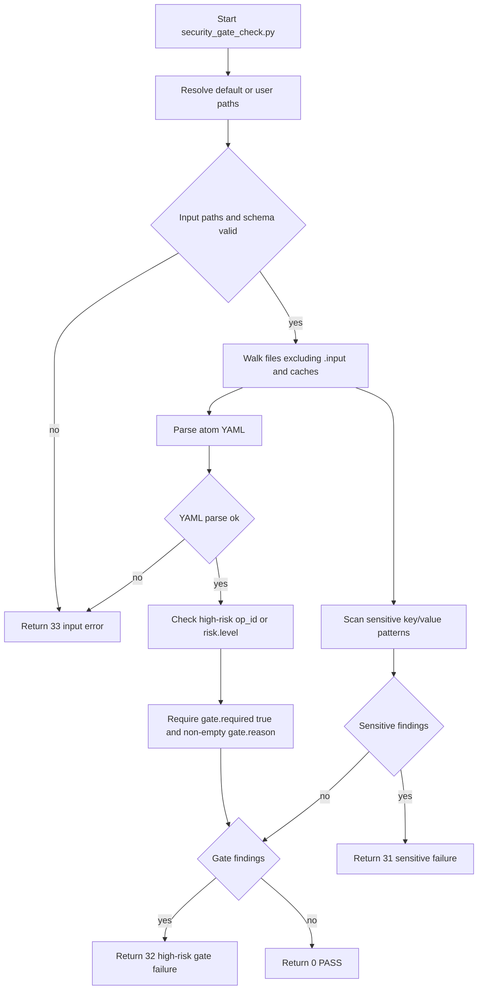

# LLD: STORY-005 - Add read-only security gate and validation checks

> CP5 确认状态：`checkpoints/CP5-ALL-STORIES-LLD-BATCH.md` 已于 2026-05-18T16:47:38+0800 approved；本文 frontmatter `confirmed=true`。正文中早期关于 `confirmed=false` / CP5 未通过的门控描述仅作为设计阶段历史语境保留，当前实现仍需等待 STORY-001..004 contracts frozen，并满足 Story `dev_gate`、文件所有权、CP6 和 CP7。shared CLI 修改按 CP5 接受的 meta-se D-005 裁决执行：先实现 `scripts/security_gate_check.py`，只有 AC 无法满足时才最小化修改 shared CLI。

本文档是 `STORY-005` 的低层设计。当前仅输出 LLD，不实现 `scripts/`、`src/atomic_ops/`、`atoms/`、`schemas/`、`packages/` 或 `docs/` 下的产品文件。本文档需纳入 `CR-003-LLD-BATCH` 全量 CP5 统一确认；`confirmed=false`、全量 CP5 未通过、上游 contract 未冻结或当前 Story `dev_gate` 未满足时，不得进入实现。

## 1. Goal

创建只读安全 gate 与校验增强设计，使 `atomic-ops` 仓库能够在本地静态检查中发现敏感信息、high-risk atom 缺失 gate、输入路径或 YAML/schema 错误，并证明 CLI 未新增 `run`、`execute`、`apply`、`configure` 等真实设备动作命令。

实现阶段的主产物是 `scripts/security_gate_check.py`。共享 CLI 文件仅允许做只读校验、展示脱敏或命令边界证明所需的最小修改；不连接设备、不访问网络、不读取 `.input/` 运行时资产、不写 `.input/`，不新增 executor。

## 2. Requirements（Functional / Non-Functional）

### 2.1 Functional

- F-01：创建 `scripts/security_gate_check.py`，命令入口固定为 `uv run --python 3.11 python scripts/security_gate_check.py`。
- F-02：默认扫描 6 类路径：`atoms/`、`packages/`、`docs/`、`schemas/`、`scripts/`、`src/atomic_ops/`。
- F-03：默认排除 `.input/`、`.git/`、`.venv/`、缓存目录和生成目录；`.input/` 不得作为扫描输入或复制来源。
- F-04：敏感信息扫描命中明文 `token`、`cookie`、`authorization`、`password`、`ftp_pass`、`secret` 等规则时退出码为 `31`。
- F-05：敏感信息报告输出命中文件、行号和规则名，不回显完整敏感值；允许 `<...>` 占位符和唯一允许密码策略值 `Ngfw@123`。
- F-06：high-risk gate 检查命中 `risk.level=high` 或 `op_id` 匹配 `^fw_(install|init|login|config|config_batch)_` 且缺少 `gate.required=true` 或 `gate.reason` 非空时退出码为 `32`。
- F-07：输入错误命中路径不存在、路径类型非法、YAML 解析失败或 `schemas/atomic-op.schema.yaml` 缺失时退出码为 `33`。
- F-08：正常仓库未发现敏感信息、high-risk gate 缺失或输入错误时退出码为 `0`。
- F-09：错误优先级必须确定：输入错误 `33` fail fast；无输入错误时，敏感信息 `31` 优先于 high-risk gate `32`，避免在敏感泄漏场景中继续暴露更多上下文。
- F-10：脚本只做静态扫描和 YAML 字段检查，不连接设备、不解析真实凭据、不访问网络、不执行 atom。
- F-11：可选增强 `src/atomic_ops/commands/validate.py` 只能增加 package/schema 引用校验报告，不新增真实设备动作。
- F-12：可选增强 `src/atomic_ops/commands/show.py` 和 `src/atomic_ops/commands/list_ops.py` 只能脱敏展示 `session_ref` / `state_ref` / `credential_ref` 等引用字段，不展示真实认证载荷。
- F-13：`src/atomic_ops/cli.py` 只能用于确认或保持命令边界；`atomic-ops --help` 中新增真实设备动作命令数量必须为 0。

### 2.2 Non-Functional

- NF-01：安全性：新增脚本和 CLI 增强不得保存、打印或派生真实 token、cookie、authorization header、FTP 凭据、原始默认密码或真实设备地址。
- NF-02：只读性：新增逻辑只能读取仓库静态文件并输出检查结果；不得写产品数据、缓存、`.input/`、运行日志或设备状态。
- NF-03：可验证性：每个退出码 `0/31/32/33` 均有可构造 fixture 或命令级测试入口。
- NF-04：可维护性：敏感规则、排除路径、默认扫描路径、high-risk op_id 规则和退出码必须集中定义，避免散落在多个命令文件中。
- NF-05：性能：默认扫描在本地文件系统内完成，不访问网络；实现应按文件扩展名过滤文本/YAML 文件，避免读取大型二进制文件。
- NF-06：兼容性：脚本不要求上游 Story 已实现才能完成 LLD；实现阶段必须等待 STORY-001..004 contract 冻结和 CP5 批量确认。

## 3. 模块拆分与职责

| 模块 / 文件组 | 职责 | 说明 |
|---|---|---|
| Security Gate Script：`scripts/security_gate_check.py` | 提供仓库级只读静态检查入口，执行路径解析、排除目录、敏感信息扫描、YAML 解析、high-risk gate 检查和退出码聚合。 | 消费 `process/HLD.md#敏感信息与 high-risk gate 最小机器校验入口（关闭 F-003）`；本 Story primary 文件。 |
| Sensitive Pattern Scanner | 对文本/YAML 文件逐行扫描敏感 key/value 模式，输出脱敏 finding。 | 内聚在 `scripts/security_gate_check.py`；允许 `<...>` 和 `Ngfw@123`；敏感失败退出 31。 |
| High-Risk Gate Checker | 解析 `atoms/**/*.yaml`，检查 high-risk atom 是否包含结构化 `gate.required=true` 和非空 `gate.reason`。 | 消费 STORY-001 `risk/gate` 字段族、STORY-002/003/004 atom 约定；gate 失败退出 32。 |
| Input Validator | 校验默认路径、用户传入路径、schema 文件存在性和 YAML 可解析性。 | 输入错误退出 33；先于扫描执行。 |
| CLI Validate Optional Hook：`src/atomic_ops/commands/validate.py` | 可选增加只读 package/schema 引用报告，使安全 gate 和现有 validate 命令输出边界一致。 | shared 文件；仅在实现阶段确认必要时修改，由 STORY-005 合并。 |
| CLI Display Optional Hooks：`src/atomic_ops/commands/show.py`、`src/atomic_ops/commands/list_ops.py` | 可选增加状态引用字段脱敏展示，避免完整引用或敏感载荷出现在输出中。 | shared 文件；不改变仓库缓存和执行能力。 |
| CLI Command Boundary：`src/atomic_ops/cli.py` | 保持 `sync/list/show/packages/validate` 等只读命令边界，不新增真实动作命令。 | shared 文件；若无需修改，CP6 仅提供审查证据。 |
| CP5 Handoff：本 LLD | 为 CP5 自动预检提供文件范围、接口、异常路径、测试和 TASK-ID 映射。 | 本 handoff 仅写 LLD，不写 CP5 文件、STATE、Story 状态或 DEV-LOG。 |

## 4. 代码结构与文件影响范围

| 动作 | 文件路径 | 变更内容 |
|---|---|---|
| 创建 | `scripts/security_gate_check.py` | 实现只读安全 gate 脚本，包含默认扫描路径、排除路径、敏感规则、YAML 解析、high-risk gate 检查、错误优先级和退出码 `0/31/32/33`。 |
| 修改（可选） | `src/atomic_ops/commands/validate.py` | 仅在实现阶段确认为必要时，增强只读 validate 对 package/schema 引用或安全 gate 结果的报告；不得执行设备动作或读取 `.input/`。 |
| 修改（可选） | `src/atomic_ops/commands/show.py` | 仅在实现阶段确认为必要时，对 `session_ref`、`state_ref`、`credential_ref` 等字段做脱敏展示；不得显示完整敏感载荷。 |
| 修改（可选） | `src/atomic_ops/commands/list_ops.py` | 仅在实现阶段确认为必要时，列表输出只展示风险/gate 摘要，不展示凭据或完整状态引用。 |
| 修改（可选） | `src/atomic_ops/cli.py` | 仅在实现阶段确认为必要时，保持命令集只读或增加只读校验参数；禁止新增 `run`、`execute`、`apply`、`configure` 等真实设备动作命令。 |

文件所有权：

| 类型 | 文件路径 | 规则 |
|---|---|---|
| primary | `scripts/security_gate_check.py` | `STORY-005` 独占实现写入。 |
| shared | `src/atomic_ops/commands/validate.py` | 若需要增强只读校验报告，由 `STORY-005` 合并；不得覆盖其他 Story 未确认改动。 |
| shared | `src/atomic_ops/commands/show.py` | 若需要脱敏展示，由 `STORY-005` 合并；不得引入真实设备动作。 |
| shared | `src/atomic_ops/commands/list_ops.py` | 若需要列表脱敏或 risk/gate 摘要，由 `STORY-005` 合并。 |
| shared | `src/atomic_ops/cli.py` | 仅用于保持命令边界或只读参数；真实动作命令数量必须为 0。 |
| forbidden | `.input/`、`delivery/` | 实现阶段不得读取 `.input/` 运行时资产作为扫描输入，不得复制 `.input/` 内容，不得写入 `delivery/`。 |

本 LLD 阶段不修改上述产品文件；只创建当前 LLD 文件。

## 5. 数据模型与持久化设计

本 Story 不新增运行时持久化，不写数据库，不写 CLI `_metadata.json`，不写检查缓存，不保存真实凭据。数据模型均为脚本内存对象、命令输出和退出码。

| 对象 / 字段 | 类型 | 约束 | 说明 |
|---|---|---|---|
| `DEFAULT_SCAN_PATHS` | list[string] | 精确包含 `atoms/`、`packages/`、`docs/`、`schemas/`、`scripts/`、`src/atomic_ops/`。 | 未传入路径时使用；缺失路径按输入错误 33 处理，除非实现阶段明确仓库不存在该目录并获 CP5 修改。 |
| `EXCLUDED_DIRS` | set[string] | 至少包含 `.input`、`.git`、`.venv`、`__pycache__`、`.pytest_cache`、`.mypy_cache`、`.ruff_cache`。 | `.input/` 必须默认排除，且不得通过目录遍历进入扫描。 |
| `SENSITIVE_RULES` | list[rule] | 至少覆盖 `token`、`cookie`、`authorization`、`password`、`ftp_pass`、`secret` 的 key/value 模式。 | 规则名用于 finding 输出；值必须脱敏。 |
| `ALLOWED_SECRET_VALUES` | set[string] | 包含 `Ngfw@123`。 | 仅作为密码策略文字允许，不代表真实凭据。 |
| `PLACEHOLDER_PATTERN` | regex | 允许形如 `<session-ref>`、`<state-ref>`、`<credential-ref>`、`<token-placeholder>`。 | 占位符不触发敏感失败。 |
| `HIGH_RISK_OP_ID_PATTERN` | regex | `^fw_(install|init|login|config|config_batch)_`。 | 与 `risk.level=high` 任一命中即要求 gate。 |
| `GateFinding` | object | `file`、`op_id`、`field_path`、`message`。 | high-risk gate 缺失或空 reason 的结构化 finding。 |
| `SensitiveFinding` | object | `file`、`line`、`rule_name`、`redacted_preview`。 | `redacted_preview` 只展示 key 和掩码，不展示完整值。 |
| `InputError` | object | `path`、`reason`、`message`。 | 路径不存在、YAML 解析失败、schema 缺失等输入错误。 |
| `exit_code` | integer | `0`、`31`、`32`、`33`。 | 聚合输出的最终进程退出码。 |

结构化输出不要求 JSON 文件落盘；实现可使用 stdout/stderr 文本表格或一行一 finding 的稳定格式。若后续 QA 要求 JSON 输出，必须作为只读 stdout 模式，不新增持久化文件。

## 6. API / Interface 设计

| 接口 / 入口 | 输入 | 输出 | 调用方 | 说明 |
|---|---|---|---|---|
| `uv run --python 3.11 python scripts/security_gate_check.py` | 无参数时扫描 6 类默认路径；可选路径参数仅限仓库内文件/目录。 | 退出码 `0/31/32/33`；stdout/stderr 输出 PASS 或 findings。 | meta-dev、meta-qa、CI、本地维护者 | 主命令入口；测试 T-S005-01 至 T-S005-08。 |
| `security_gate_check.py --help` | CLI help 请求。 | 展示用途、默认扫描路径、排除路径、退出码和只读边界。 | 维护者、QA | help 文本不得声称连接设备或执行 atom；测试 T-S005-09。 |
| 输入路径解析接口 | 用户传入路径或默认路径。 | 标准化 repo 内路径集合或 `InputError`。 | security gate 脚本内部 | 路径不存在、路径越界或 schema 缺失返回 33；测试 T-S005-04、T-S005-10。 |
| 敏感信息扫描接口 | 文本/YAML 文件行内容。 | `SensitiveFinding[]`。 | security gate 脚本内部 | 命中敏感规则退出 31，不回显完整值；测试 T-S005-02、T-S005-11。 |
| YAML 解析接口 | `atoms/**/*.yaml` 与必要 package/schema 文件。 | Python dict 或 `InputError`。 | high-risk gate checker | YAML 解析失败返回 33；测试 T-S005-05。 |
| high-risk gate 检查接口 | atom dict、文件路径、`op_id`、`risk`、`gate`。 | `GateFinding[]`。 | security gate 脚本内部、meta-qa | 缺 `gate.required=true` 或 `gate.reason` 非空退出 32；测试 T-S005-03、T-S005-12。 |
| `atomic-ops --help` 命令边界接口 | CLI 命令注册表。 | help 文本。 | meta-dev、meta-qa、用户 | 新增真实动作命令数量为 0；测试 T-S005-06。 |
| `atomic-ops validate --package <package>` 可选引用校验接口 | package id 或路径。 | 只读 validate 报告。 | CLI 用户、meta-qa | 若实现阶段修改 validate，只能增加引用或 gate 报告，不执行设备动作；测试 T-S005-07。 |
| `atomic-ops show/list` 可选脱敏展示接口 | atom 或列表查询。 | 脱敏后的引用字段。 | CLI 用户、meta-qa | 不展示完整 `credential_ref`、`session_ref` 或 `state_ref` 敏感载荷；测试 T-S005-08。 |

第 6 节每个接口均在第 10 节有对应测试入口。

## 7. 核心处理流程

1. 读取命令参数；若无参数，使用 `DEFAULT_SCAN_PATHS` 六类路径。
2. 将路径解析为仓库内绝对路径，应用排除目录规则；若路径不存在、越界或 `schemas/atomic-op.schema.yaml` 缺失，记录 `InputError` 并返回退出码 `33`。
3. 枚举可扫描文本文件和 YAML 文件，跳过 `.input/`、`.git/`、`.venv/`、缓存目录和二进制文件。
4. 对所有可扫描文本逐行执行敏感规则；命中时记录 `SensitiveFinding`，输出文件、行号、规则名和脱敏预览。
5. 解析 `atoms/**/*.yaml`；YAML 解析失败时返回退出码 `33`。
6. 对每个 atom 判断 high-risk 条件：`risk.level=high` 或 `op_id` 匹配 `^fw_(install|init|login|config|config_batch)_`。
7. high-risk atom 必须存在 `gate.required=true` 且 `gate.reason` 为非空字符串；不满足时记录 `GateFinding`。
8. 若存在输入错误，返回 `33`；否则若存在敏感 finding，返回 `31`；否则若存在 gate finding，返回 `32`；否则输出 PASS 并返回 `0`。
9. 若实现阶段触达 shared CLI 文件，先审查当前命令集，再做只读展示/validate 增强；`atomic-ops --help` 真实动作命令数量必须保持 0。



异常路径：

| 异常 | 触发条件 | 处理 | 对应测试 |
|---|---|---|---|
| E-01 输入路径不存在 | 用户传入不存在路径或默认路径缺失 | 输出路径和原因，退出 33 | T-S005-04 |
| E-02 YAML 解析失败 | `atoms/**/*.yaml` 无法解析 | 输出文件和 YAML 错误类别，退出 33 | T-S005-05 |
| E-03 schema 缺失 | `schemas/atomic-op.schema.yaml` 缺失 | 输出 schema 缺失，退出 33 | T-S005-10 |
| E-04 明文敏感值 | key/value 命中敏感模式且值不是 `<...>` 或 `Ngfw@123` | 输出脱敏 finding，退出 31 | T-S005-02、T-S005-11 |
| E-05 high-risk gate 缺失 | high-risk atom 缺 `gate.required=true` 或 `gate.reason` 为空 | 输出 op_id 和字段路径，退出 32 | T-S005-03、T-S005-12 |
| E-06 命令边界破坏 | `atomic-ops --help` 出现 `run/execute/apply/configure` 等真实动作命令 | 阻断 CP6，回退 shared CLI 修改 | T-S005-06 |
| E-07 文件所有权冲突 | 其他 dev_running Story 正在写 `scripts/security_gate_check.py` 或 shared CLI 文件 | 停止实现并进入 blocked，不合并冲突 | T-S005-13 |

## 8. 技术设计细节

- 关键规则 1：只读静态检查。`security_gate_check.py` 不 import 设备 SDK，不建立 socket，不调用 HTTP/Telnet/FTP/SSH，不读取真实 inventory，不执行 atom。
- 关键规则 2：默认扫描路径精确为 6 类：`atoms/`、`packages/`、`docs/`、`schemas/`、`scripts/`、`src/atomic_ops/`。默认排除 `.input/`，防止参考资料中的真实运行资产进入产品扫描或报告。
- 关键规则 3：输入错误优先级最高。路径不存在、YAML 解析失败和 schema 缺失属于执行前置条件错误，统一退出 `33`。
- 关键规则 4：敏感信息优先于 gate 失败。若同一轮同时存在敏感信息与 gate 缺失，最终退出码为 `31`，输出敏感 finding 的脱敏摘要；gate finding 可汇总计数，但不得导致敏感值回显。
- 关键规则 5：敏感模式最小实现采用 HLD 给定规则：`(?i)(token|cookie|authorization|password|ftp_pass|secret)\s*[:=]\s*[^<\s][^\s]+`。实现可拆分为多个命名规则，但不得降低覆盖字段集合。
- 关键规则 6：允许值仅限占位符 `<...>` 和密码策略文字 `Ngfw@123`；`Ngfw@123` 只作为策略值，不作为真实设备凭据保存或打印。
- 关键规则 7：high-risk 判定采用结构和命名双入口：`risk.level=high` 或 `op_id` 匹配 `^fw_(install|init|login|config|config_batch)_`。两者任一命中即要求 gate。
- 关键规则 8：gate 判定要求 `gate.required is True` 且 `gate.reason` 为 trim 后非空字符串；自然语言 description 中出现审批说明不能替代结构化 gate。
- 关键规则 9：shared CLI 修改不是默认必需。若 `security_gate_check.py` 已满足 Story AC，则 shared CLI 文件只做审查证据，不做无必要修改。
- 关键规则 10：若必须修改 shared CLI，新增内容只能服务只读 validate/show/list 输出；不得新增 `run`、`execute`、`apply`、`configure` 命令或真实设备动作别名。

依赖选择与复用点：

- 复用 Python 标准库优先；若仓库已有 YAML 解析依赖，则复用现有依赖，不新增 `pyproject.toml` / `uv.lock` 变更，除非实现阶段证明缺失且经 CP5 后确认。
- 复用 STORY-001 的 schema v1.1 `risk/gate/session/state/credential_ref` 字段族。
- 复用 STORY-002、STORY-003、STORY-004 的 atom/package 契约作为后续实现扫描对象。
- 复用 README/PLATFORM-INSTALL-SPEC 的原生交付面，不使用 `delivery/`。

兼容性处理：

- 若 STORY-001 最终将 `schema_version` 从 `"1.1"` 调整为 `"1.1.0"`，本 Story 的 gate 逻辑不依赖版本字符串，仅依赖 `risk`、`gate` 和 `op_id`。
- 若 STORY-004 LLD 后续调整 `fw_config_batch_<domain>` 命名，high-risk 命名正则必须在实现前同步 CP5 修改意见，不能在实现中自行猜测。
- 若已有 CLI `validate` 已覆盖 package 引用检查，本 Story 不重复实现到 CLI，只由 `security_gate_check.py` 负责安全 gate。

图示类型选择：流程图。原因是脚本存在输入错误、敏感失败、gate 失败和成功四类分支，流程图能直接表达退出码优先级。

## 9. 安全与性能设计

| 维度 | 设计措施 | 验证方式 |
|---|---|---|
| 安全 | `.input/` 默认排除，且不作为扫描输入、复制来源或输出目标。 | T-S005-01、T-S005-13；diff 审查确认未修改 `.input/`。 |
| 安全 | 敏感 finding 只输出文件、行号、规则名和脱敏预览，不输出完整值。 | T-S005-02、T-S005-11 检查输出不含完整 fixture 密文。 |
| 安全 | high-risk atom 必须结构化声明 `gate.required=true` 和非空 `gate.reason`。 | T-S005-03、T-S005-12；后续扫描 STORY-002/003/004 atom。 |
| 安全 | CLI 命令集保持只读，不新增真实设备动作命令。 | T-S005-06 执行 `uv run atomic-ops --help` 并检查禁用命令数量为 0。 |
| 安全 | 不连接设备、不访问网络、不执行 atom、不保存凭据。 | 代码审查禁止 socket/http/telnet/ftp/ssh/device executor 调用；T-S005-14。 |
| 性能 | 默认只扫描仓库内 6 类目录，跳过缓存、虚拟环境和二进制文件。 | T-S005-15 检查排除目录和扩展名过滤；本地运行无网络依赖。 |
| 性能 | YAML 仅解析 atom 文件和必要 schema/package 文件，package 不复制 atom 正文。 | T-S005-05、T-S005-07；大目录不重复解析。 |

## 10. 测试设计

| 测试场景 | 前置条件 | 操作 | 预期结果 | 验证方式 |
|---|---|---|---|---|
| T-S005-01 默认扫描路径与排除路径 | 脚本已创建；仓库目录存在 | 执行 `uv run --python 3.11 python scripts/security_gate_check.py --help` 或默认命令并审查配置 | 默认路径包含 6 类，排除 `.input/`、`.git/`、`.venv/` 和缓存目录 | help 输出或代码审查 |
| T-S005-02 敏感信息退出码 31 | 临时 fixture 含 `token: abc123` 或等价明文 | 执行 security gate 指向 fixture | 退出码 31；输出文件、行号、规则名；不回显完整 `abc123` | 命令退出码 + 输出断言 |
| T-S005-03 high-risk gate 退出码 32 | 临时 atom `op_id=fw_config_interface` 缺 `gate.required=true` 或 `gate.reason` 为空 | 执行 security gate 指向 fixture | 退出码 32；输出 op_id 和字段路径 | 命令退出码 + 输出断言 |
| T-S005-04 不存在路径退出码 33 | 脚本已创建 | 执行 security gate 指向不存在路径 | 退出码 33；输出输入路径错误 | 命令退出码 |
| T-S005-05 YAML 解析失败退出码 33 | 临时 `atoms/fw/bad.yaml` 非法 YAML | 执行 security gate 指向 fixture | 退出码 33；输出 YAML 解析错误，不继续 gate 判断 | 命令退出码 |
| T-S005-06 CLI 真实动作命令数量为 0 | CLI 可运行 | 执行 `uv run atomic-ops --help` | help 中新增 `run`、`execute`、`apply`、`configure` 真实设备动作命令数量为 0 | 输出检查 |
| T-S005-07 package/schema validate 仍只读 | 如实现修改 `validate.py` | 执行 `uv run atomic-ops validate --package <package>` | 只读输出引用或 gate 报告，不连接设备、不访问网络 | 命令 smoke + 代码审查 |
| T-S005-08 show/list 脱敏展示 | 如实现修改 `show.py` 或 `list_ops.py` | 执行 show/list 查看含 `session_ref` / `state_ref` 的 atom | 输出不含完整认证载荷；引用字段按脱敏规则展示 | 输出检查 |
| T-S005-09 help 文本边界 | 脚本已创建 | 执行 `uv run --python 3.11 python scripts/security_gate_check.py --help` | help 说明退出码、默认路径、排除 `.input/` 和只读边界 | 输出检查 |
| T-S005-10 schema 缺失退出码 33 | 临时测试目录缺少 `schemas/atomic-op.schema.yaml` | 执行 security gate 指向该目录 | 退出码 33；输出 schema 缺失 | 命令退出码 |
| T-S005-11 允许占位符和 `Ngfw@123` | fixture 含 `password: <password-ref>` 与 `password: Ngfw@123` | 执行 security gate 指向 fixture | 不因这两类值触发 31 | 命令退出码 + 输出检查 |
| T-S005-12 `risk.level=high` gate 检查 | fixture `risk.level=high` 但 op_id 不匹配命名正则且 gate 缺失 | 执行 security gate 指向 fixture | 退出码 32；说明 `risk.level=high` 触发 gate 要求 | 命令退出码 |
| T-S005-13 文件范围和所有权检查 | 实现 diff 可用 | 检查 `git diff --name-only` | 仅包含第 4 节允许文件；不包含 `.input/`、`delivery/`、`atoms/`、`schemas/`、`packages/`、`docs/` | diff 审查 |
| T-S005-14 无真实设备动作代码 | 实现 diff 可用 | 搜索 socket/http/telnet/ftp/ssh/device executor 和命令注册 | 新增真实设备连接或动作执行代码数量为 0 | 代码审查 + 关键词扫描 |
| T-S005-15 性能边界 | 脚本已创建 | 审查文件遍历过滤逻辑 | 跳过缓存、虚拟环境、二进制文件；扫描不访问网络 | 代码审查 |

第 7 节异常路径均对应 T-S005-02 至 T-S005-06、T-S005-10 至 T-S005-14。第 6 节接口均至少有 1 条测试入口。

## 11. 实施步骤

| TASK-ID | 动作 | 目标文件 | 详细描述 | 对应测试 |
|---|---|---|---|---|
| S005-T1 | 创建 | `scripts/security_gate_check.py` | 创建脚本骨架、命令参数、help 文本、默认扫描 6 类路径、排除目录集合和只读边界说明。 | T-S005-01、T-S005-09、T-S005-15 |
| S005-T2 | 创建 | `scripts/security_gate_check.py` | 实现输入路径解析、repo 内路径限制、schema 存在性检查和输入错误退出码 33。 | T-S005-04、T-S005-10 |
| S005-T3 | 创建 | `scripts/security_gate_check.py` | 实现敏感信息规则、占位符/`Ngfw@123` 例外、脱敏 finding 输出和退出码 31。 | T-S005-02、T-S005-11 |
| S005-T4 | 创建 | `scripts/security_gate_check.py` | 实现 YAML 解析、解析错误退出 33、high-risk 判定、`gate.required=true` 与非空 `gate.reason` 检查、退出码 32。 | T-S005-03、T-S005-05、T-S005-12 |
| S005-T5 | 创建 | `scripts/security_gate_check.py` | 实现退出码优先级：33 优先，31 次之，32 再次，0 成功；确保敏感值不因汇总输出泄露。 | T-S005-02、T-S005-03、T-S005-04 |
| S005-T6 | 修改（可选） | `src/atomic_ops/commands/validate.py` | 若实现阶段确认需要，增加只读 package/schema/gate 报告；禁止真实设备动作、网络访问和 `.input/` 读取。 | T-S005-07、T-S005-13、T-S005-14 |
| S005-T7 | 修改（可选） | `src/atomic_ops/commands/show.py`、`src/atomic_ops/commands/list_ops.py` | 若实现阶段确认需要，增加 `session_ref`、`state_ref`、`credential_ref` 脱敏展示或 risk/gate 摘要。 | T-S005-08、T-S005-13 |
| S005-T8 | 修改（可选） | `src/atomic_ops/cli.py` | 若实现阶段确认需要，保持或证明命令集只读；禁止新增 `run/execute/apply/configure` 等真实动作命令。 | T-S005-06、T-S005-13、T-S005-14 |
| S005-T9 | 校验 | `scripts/security_gate_check.py`、shared CLI 文件 | 运行退出码 fixture、CLI help、文件范围、无真实设备动作和敏感输出脱敏检查。 | T-S005-01 至 T-S005-15 |

文件影响项覆盖关系：

| 文件影响项 | TASK-ID |
|---|---|
| `scripts/security_gate_check.py` | S005-T1、S005-T2、S005-T3、S005-T4、S005-T5、S005-T9 |
| `src/atomic_ops/commands/validate.py` | S005-T6、S005-T9 |
| `src/atomic_ops/commands/show.py` | S005-T7、S005-T9 |
| `src/atomic_ops/commands/list_ops.py` | S005-T7、S005-T9 |
| `src/atomic_ops/cli.py` | S005-T8、S005-T9 |

## 12. 风险、难点与预研建议

| 风险 / 难点 | 影响 | 缓解措施 / 预研建议 |
|---|---|---|
| `process/ARCHITECTURE-DECISION.md` frontmatter 当前 `confirmed=false` | 严格实现 ready-check 下，ADR 未确认会阻断开发。 | LLD 起草按 CR-003 继续；实现前由 meta-po 修正 ADR 状态或在 CP5 批量确认中显式接受该输入状态。 |
| STORY-001 schema v1.1 contract 尚未 confirmed | `risk/gate` 字段最终结构和 schema 版本值可能调整。 | 实现阶段必须消费 STORY-001 confirmed LLD 和实际 schema/docs；脚本 gate 逻辑以字段路径和 op_id 双入口降低版本字符串耦合。 |
| STORY-002/003 atom 和 STORY-004 batch contract 尚未实现 | security gate 的真实扫描对象尚未全部存在。 | LLD 中定义 fixture 测试；实现后对已存在上游 atom/package 做回归；CP5 确认时收敛跨 Story 契约。 |
| STORY-004 当前输入是 Story 卡，不是 confirmed LLD | batch op_id 命名和 batch 字段细节可能调整。 | high-risk 正则包含 `config_batch`；若 STORY-004 LLD 改名，CP5 修改本 LLD 后再实现。 |
| 敏感信息规则误报 | 可能阻断合法文档示例。 | 保留 `<...>` 占位符和 `Ngfw@123` 例外；finding 输出规则名，允许后续 CP5/QA 指定更精确 allowlist，但不得放宽字段集合。 |
| 敏感信息规则漏报 | 可能让真实凭据进入产品面。 | 规则集中定义，至少覆盖 HLD 指定 6 类 key；后续可追加规则但不得删除最小规则。 |
| shared CLI 文件可能被其他 Story 或用户修改 | 文件所有权冲突会导致覆盖风险。 | 实现前读取当前 diff 和并行状态；若 shared 文件存在冲突，进入 blocked，不覆盖他人改动。 |
| `scripts/security_gate_check.py` 若扫描自身文档中的敏感规则示例 | 可能因规则说明文字触发误报。 | 实现时对 regex 示例、文档代码块或测试 fixture 采用明确占位符和 allowlist；不得通过全局排除 `scripts/` 规避。 |

### OPEN / Spike 跟踪

| ID | 类型（OPEN / Spike / BLOCKED） | 问题 | 下一动作 | 责任方 |
|---|---|---|---|---|
| O-01 | OPEN | `process/ARCHITECTURE-DECISION.md` frontmatter 为 `status=draft`、`confirmed=false`，但 LLD 设计已由 CR-003 调度。 | CP5 批量确认前由 meta-po 修正 ADR frontmatter，或在 CP5 审查稿中明确 CP3 approved + CR-003 可作为本批 LLD 输入证据。 | meta-po / user |
| O-02 | OPEN | STORY-001 schema v1.1 字段族和 `risk/gate` contract 尚未 confirmed。 | CP5 批量确认时核对 STORY-001 LLD、字段参考和后续实现门禁；STORY-005 实现前必须等待 contract frozen。 | meta-po / STORY-001 meta-dev |
| O-03 | OPEN | STORY-002/003/004 的 atom/package 产物尚未实现，security gate 的最终全量扫描对象还不存在。 | CP5 批量确认后按 Wave 实现；STORY-005 CP6 需对当时已存在的上游产物运行回归。 | meta-po / STORY-002..004 meta-dev |
| O-04 | OPEN | shared CLI 文件是否需要修改尚未能在 LLD 阶段确认；现有 CLI 代码未在本 handoff 允许输入范围内读取。 | 实现阶段在 CP5 approved 后读取 `src/atomic_ops/` 当前实现，若脚本已满足 AC，则不修改 shared CLI；若必须修改，严格按第 4/11 节范围执行。 | STORY-005 meta-dev |

### Blocked / Implementation Gate 跟踪

| ID | 状态 | 阻断对象 | 触发条件 | 解除条件 |
|---|---|---|---|---|
| B-01 | BLOCKED_FOR_IMPLEMENTATION | STORY-005 实现阶段 | 本 LLD `confirmed=false`，全量 CP5 未确认，upstream contracts 未冻结，O-01..O-04 未处理或未接受。 | `STORY-005` LLD confirmed、`checkpoints/CP5-ALL-STORIES-LLD-BATCH.md` approved、STORY-001..004 contract/dev_gate 满足、文件所有权无冲突。 |
| B-02 | BLOCKED_IF_CONFLICT | shared CLI 文件 | 实现阶段发现其他 dev_running Story 或用户改动正在触达 shared CLI 文件，且无法无冲突合并。 | meta-po 明确 merge owner 或冲突 Story 完成；不得自行覆盖。 |

## 13. 回滚与发布策略

- 发布方式：在 CP5 全量确认和 `dev_gate` 满足后，以普通仓库文件变更提交 `scripts/security_gate_check.py`，并按必要性最小修改 shared CLI 文件；不发布安装包，不写 `delivery/`，不改变 README 安装机制。
- 发布前置：
  - `STORY-005` LLD confirmed。
  - `STORY-001` 至 `STORY-004` 的 LLD 和 contract 已在 CP5 批量确认中被接受。
  - `checkpoints/CP5-ALL-STORIES-LLD-BATCH.md` 人工确认 approved。
  - 文件所有权无 primary 冲突，shared CLI 文件冲突已解决。
- 回滚触发条件：
  - `security_gate_check.py` 对正常仓库返回非预期退出码且不是真实 contract 问题。
  - 敏感 finding 输出完整敏感值。
  - high-risk gate 缺失未返回 32。
  - 输入错误未返回 33，或 YAML 解析失败被吞掉。
  - `.input/` 被扫描、复制、写入或作为默认输入。
  - shared CLI 修改新增真实设备动作命令，或 `atomic-ops --help` 出现 `run/execute/apply/configure` 等真实动作命令。
  - 新增代码访问网络、连接设备或执行 atom。
- 回滚动作：
  - 删除或回退 `scripts/security_gate_check.py` 的本 Story 修改。
  - 回退 `src/atomic_ops/commands/validate.py`、`show.py`、`list_ops.py`、`src/atomic_ops/cli.py` 中由本 Story 引入的只读增强。
  - 保留 process 层 Story/LLD/CP6 记录作为审计和后续 CR 输入，不删除历史决策。
  - 若回滚原因来自上游 schema/atom contract 变化，停止 STORY-005 实现并回到 LLD 修改或 CR，而不是放宽安全 gate。

## 14. Definition of Done

- [x] 14 个可见章节全部填写完成。
- [x] frontmatter `confirmed: false` 已填写。
- [x] `story_slug` 复用 Story 卡片：`add-read-only-security-gate-and-validation-checks`。
- [x] `shared_fragments` 已登记 HLD、ADR、平台安装边界和上游 contract 来源。
- [x] `open_items` 已清点为 4，且均有下一动作和责任方。
- [x] 文件影响范围覆盖 primary、shared、forbidden，并明确本 LLD 阶段不实现产品文件。
- [x] 明确 `scripts/security_gate_check.py`、退出码 31/32/33、默认扫描 6 类路径、排除 `.input/`。
- [x] 明确不新增 `run/execute/apply/configure` 等真实设备动作命令，不连接设备，不访问网络。
- [x] 第 6 节每个接口均在第 10 节有对应测试入口。
- [x] 第 7 节异常路径均在第 10 节或第 12 节有对应验证或处理路径。
- [x] 第 11 节 TASK-ID 与第 4 节文件影响范围一一对应。
- [x] 回滚与发布策略明确，且不包含自动设备回滚。
- [x] CP5 handoff notes 已给出，供 meta-po 收敛全量 LLD 和自动预检。
- [ ] CP5 自动预检结果尚未写入 `process/checks/CP5-STORY-005-add-read-only-security-gate-and-validation-checks-LLD-IMPLEMENTABILITY.md`，因为本 handoff 的唯一写入范围仅允许本 LLD 文件。
- [ ] 人工确认意见尚未收敛；必须等待全量 CP5 批次确认。

### CP5 handoff notes

| # | 检查项 | 状态 | 证据 |
|---|---|---|---|
| 1 | LLD 覆盖 AC | READY_FOR_CP5_AUTO | 第 2、4、6、10、11、14 节覆盖 Story 卡片验收标准和 HLD 最小安全 gate 契约。 |
| 2 | 与 HLD / ADR 一致 | READY_WITH_OPEN | HLD confirmed；ADR 内容已消费但 frontmatter `confirmed=false`，见 O-01。 |
| 3 | 文件影响范围明确 | READY_FOR_CP5_AUTO | 第 4、11 节列出 primary/shared/forbidden 与 TASK-ID 映射。 |
| 4 | 接口契约完整 | READY_FOR_CP5_AUTO | 第 5、6、7、8 节定义命令入口、退出码、finding、异常和只读边界。 |
| 5 | 测试与 dev_gate 可计算 | READY_WITH_OPEN | 第 10、12、13、14 节定义验证入口；实现仍等待 upstream contracts、CP5 batch confirmation 和文件冲突检查。 |
| 6 | 实现门禁 | BLOCKED_FOR_IMPLEMENTATION | `confirmed=false`、CP5 批量人工确认未发生、`dev_gate.dependencies_satisfied=false`。 |

### CP5 confirmation boundary

人工确认回复应由 meta-po 在 `checkpoints/CP5-ALL-STORIES-LLD-BATCH.md` 统一发起。本 Story LLD 单独 `approve` 不足以进入实现；必须等待 `STORY-001`..`STORY-006` 全部 LLD 和 CP5 自动预检完成，并由 CP5 批次人工确认 approved。

## 人工确认区

> **CP5 - Story LLD 可实现性门**
> 当前 handoff 限定 meta-dev 只写 `process/stories/STORY-005-add-read-only-security-gate-and-validation-checks-LLD.md`，因此本文档只提供 CP5 自动预检输入，不单独写入 `process/checks/`。
> meta-po 收齐全部目标 Story 的 LLD 和 CP5 自动预检后，再生成并提示用户审查 `checkpoints/CP5-ALL-STORIES-LLD-BATCH.md`。
> 用户统一确认全部目标 Story 的 LLD 后，仍需满足当前 Wave、依赖门控与文件所有权门控方可进入实现。

**CP5 checklist 摘要**：

| # | 检查项 | 状态 | 证据 |
|---|---|---|---|
| 1 | LLD 覆盖 AC | PASS_WITH_OPEN_ITEMS | 第 2 / 10 / 14 节；OPEN 见 O-01..O-04。 |
| 2 | 与 HLD / ADR 一致 | PASS_WITH_OPEN_ITEMS | 第 3 / 8 / 12 节；ADR frontmatter confirmed=false 见 O-01。 |
| 3 | 文件影响范围明确 | PASS | 第 4 / 11 节。 |
| 4 | 接口契约完整 | PASS | 第 5 / 6 / 7 节。 |
| 5 | 测试与 dev_gate 可计算 | PASS_WITH_OPEN_ITEMS | 第 10 / 13 / 14 节；dev_gate 仍等待上游 contract 与 CP5 batch confirmation。 |

**人工确认回复**：

请直接回复以下任一整行：

```text
approve
修改: <具体修改点>
reject
```

- `approve`：LLD 设计合理，允许纳入全量 CP5 批次确认。
- `修改: <具体修改点>`：指出具体修改点后由 meta-dev 更新重提。
- `reject`：设计方向有根本问题，需重新设计。

**人工审查结果回填**：

- 结论：`approved | changes_requested | rejected`
- 审查人：
- 审查时间：
- 修改意见：
- 风险接受项：
