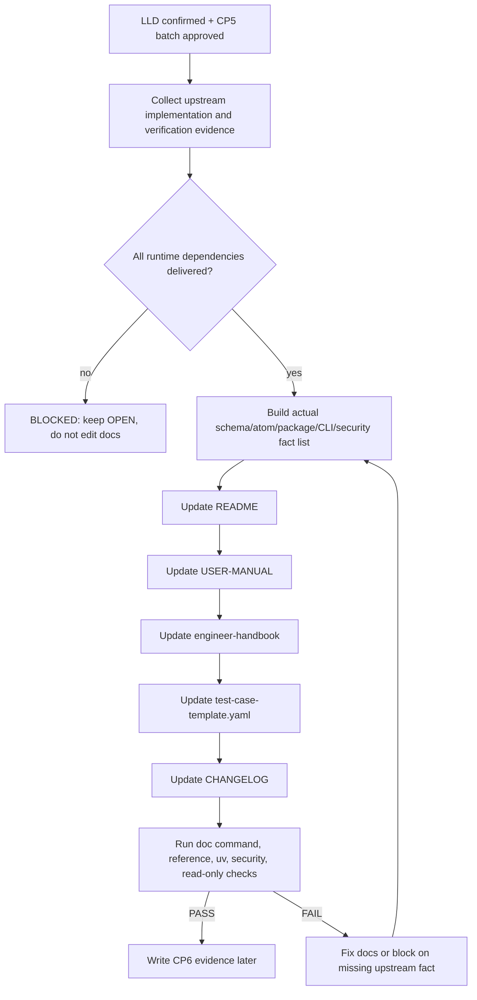

# LLD: STORY-006 - Update user-facing docs and release guidance

> CP5 确认状态：`checkpoints/CP5-ALL-STORIES-LLD-BATCH.md` 已于 2026-05-18T16:47:38+0800 approved；本文 frontmatter `confirmed=true`。正文中早期关于 `confirmed=false` / CP5 未通过的门控描述仅作为设计阶段历史语境保留，当前实现仍必须等待 STORY-001..005 的实现与验证事实可读，并满足 runtime `dev_gate`、文件所有权、CP6 和 CP7。

本文档是 `STORY-006` 的低层设计。当前只输出 LLD，不修改 `README.md`、`docs/*`、`CHANGELOG.md`、代码、Story 状态、STATE、handoff、CP6 或 CP7。本文档需纳入 `CR-003-LLD-BATCH` 全量 CP5 统一确认；`confirmed=false`、CP5 未统一通过、上游 runtime 依赖未完成或 Story `dev_gate` 未满足时，不得进入实现。

## 1. Goal

在 `STORY-001` 至 `STORY-005` 的 schema、atom、package、批次契约、只读安全 gate 和验证命令完成并通过验证后，修改 5 个用户可见文档文件，使 README、用户手册、工程师手册、测试用例模板和 CHANGELOG 与实际交付能力一致。

本 Story 的实现阶段只做文档收口：

- 修改 `README.md`，更新项目能力、原生交付面、安装入口、核心只读命令、安全边界和验证入口。
- 修改 `docs/USER-MANUAL.md`，更新面向使用者的安装、同步、查询、package、validate、安全边界和故障处理说明。
- 修改 `docs/engineer-handbook.md`，更新贡献者如何新增 schema v1.1 atom、capacity 域、batch 契约和安全 gate 验证。
- 修改 `docs/test-case-template.yaml`，更新测试用例引用模板，使用占位符和已实现 op_id，不包含真实设备地址或凭据。
- 修改 `CHANGELOG.md`，记录 schema、atom、package、CLI/scripts 和 docs 的已交付变化。

本 Story 不新增功能代码、不修改 schema/atom/package 契约、不提前承诺未实现能力、不把 CLI 描述成可以连接设备或执行配置。

## 2. Requirements（Functional / Non-Functional）

### 2.1 Functional

- F-01：5 个目标文档 `README.md`、`docs/USER-MANUAL.md`、`docs/engineer-handbook.md`、`docs/test-case-template.yaml`、`CHANGELOG.md` 必须全部在实现阶段更新，目标文件缺失数为 0。
- F-02：README 必须描述 README 原生交付面：`atoms/`、`schemas/`、`packages/`、`docs/`、`src/atomic_ops/`、`scripts/`、`pyproject.toml`、`uv.lock`；不得把 `delivery/` 写为正向交付目录。
- F-03：README 核心命令只允许围绕 `sync`、`list`、`show`、`packages`、`validate` 和安装/help/version 入口展开；真实设备动作命令数量必须为 0。
- F-04：所有 Python、CLI 和脚本示例必须使用 `uv run` 或 `uv tool`；不得使用裸 `pip install` 作为默认入口。
- F-05：文档必须明确 CLI 离线只读边界：`sync` 只访问远端 Git，`list/show/packages/validate` 只读本地缓存或仓库文件；CLI 不连接设备、不执行 atom、不下发配置、不保存凭据。
- F-06：文档中的 package 查询和验证示例只使用已实现的 package id；实现阶段必须从实际 `packages/*.yaml` 和 `atomic-ops packages` / `validate --package` 结果确认后再写入。
- F-07：文档中的 op_id 示例只允许引用已存在且可由 atom catalog 解析的 op_id；缺失 op_id 引用数必须为 0。
- F-08：`docs/USER-MANUAL.md` 必须面向用户说明安装、同步、列表、展示、package 查询、package 校验、安全 gate 失败处理和只读边界。
- F-09：`docs/engineer-handbook.md` 必须面向贡献者说明新增 schema v1.1 atom、10 个 capacity 域、batch 契约、命名规则、字段引用和安全 gate 验证流程。
- F-10：`docs/test-case-template.yaml` 必须提供可复用测试用例模板字段，包含非敏感占位符、package/op_id 引用、预期校验命令和验证证据字段；不得包含真实设备地址、token、cookie、FTP 凭据或原始默认密码。
- F-11：`CHANGELOG.md` 必须只记录已实现且已验证的变更，覆盖 schema、atom、package、CLI/scripts 和 docs 分类；不得记录未完成或未验证能力为已发布。
- F-12：所有文档必须保留验证失败只诊断和人工处理的边界，不得把 rollback/revert/undo 写成默认自动设备动作。

### 2.2 Non-Functional

- NF-01：安全性：真实 IP、token、cookie、Authorization header、FTP 凭据、原始默认密码数量为 0；唯一允许显式出现的密码策略值为 `Ngfw@123`。
- NF-02：一致性：文档命令与实际 CLI help、package 列表、validate 命令一致；命令不可执行或命令名不存在时不得发布。
- NF-03：可维护性：README、用户手册、工程师手册、测试模板和 CHANGELOG 对同一命令、目录和边界的表述必须一致。
- NF-04：可验证性：第 6 节每个接口必须在第 10 节至少有 1 个测试入口；第 7 节异常路径必须有对应错误路径验证。
- NF-05：可审计性：实现阶段必须记录上游 `STORY-001` 至 `STORY-005` 的实现/验证证据来源；缺少上游事实时只保留 OPEN，不写成已交付。
- NF-06：性能边界：本 Story 只修改文档，不引入运行时依赖、网络访问、设备访问或 CLI 解析性能变化。
- NF-07：流程门控：`confirmed=false`、CP5 批量人工确认未通过、上游 runtime 依赖未验证时，不得进入实现。

## 3. 模块拆分与职责

| 模块 / 文件组 | 职责 | 说明 |
|---|---|---|
| README 文档面：`README.md` | 面向首次接触用户说明项目定位、安装、原生交付面、核心只读命令、package/validate 示例、安全边界和验证入口。 | 消费 `process/PLATFORM-INSTALL-SPEC.md#README 原生交付面`；不得写 `delivery/` 为正向目录。 |
| 用户手册：`docs/USER-MANUAL.md` | 面向使用者说明 `uv tool install .`、`uv run atomic-ops --help`、sync/list/show/packages/validate 工作流、常见失败处理和只读边界。 | 只引用已实现命令和已验证 package/op_id；不描述真实设备执行。 |
| 工程师手册：`docs/engineer-handbook.md` | 面向贡献者说明 schema v1.1 atom、capacity 10 域、batch 契约、命名、字段引用、安全 gate 和验证流程。 | 消费 `STORY-001` 至 `STORY-005` 的最终实现事实；不得复制 `.input/` 内容。 |
| 测试用例模板：`docs/test-case-template.yaml` | 提供非敏感测试用例结构，约束 package/op_id 引用、占位符、验证命令和证据字段。 | 示例只使用 `<session-ref>`、`<state-ref>`、`<device-ref>`、`<diag-snapshot-ref>` 等占位符。 |
| 发布记录：`CHANGELOG.md` | 按已交付事实记录 schema、atom、package、CLI/scripts、docs 的变更。 | 必须等待上游实现与验证证据；不把未实现能力写成 release note。 |
| 命令一致性审查 | 对 README / docs 中的命令与 CLI help、package、validate 实际行为做一致性验证。 | 命令示例统一使用 `uv run` 或 `uv tool`。 |
| 安全边界审查 | 扫描文档敏感信息、真实设备执行表述、自动回滚表述和 `delivery/` 正向引用。 | 使用 `STORY-005` 安全 gate 或等价静态扫描作为实现阶段验证入口。 |
| CP5 handoff：本 LLD | 提供文档收口范围、接口、异常、测试、TASK-ID、OPEN 项和实现门禁。 | 当前不创建 CP5 文件；本 handoff 的唯一写入范围为本 LLD。 |

## 4. 代码结构与文件影响范围

| 动作 | 文件路径 | 变更内容 |
|---|---|---|
| 修改 | `README.md` | 更新已交付能力、README 原生交付面、安装命令、只读 CLI 命令、package 查询/校验示例、安全边界、验证入口和文档链接；不得提前引用未实现 op_id/package。 |
| 修改 | `docs/USER-MANUAL.md` | 更新用户操作流程、命令示例、package 查询、validate 示例、安全 gate 失败处理、敏感信息禁止项、CLI 不连接设备边界和故障排查。 |
| 修改 | `docs/engineer-handbook.md` | 更新贡献流程：schema v1.1 字段、atom 命名、capacity 10 域、batch 契约、package 引用、安全 gate、uv 验证命令和禁止扩边项。 |
| 修改 | `docs/test-case-template.yaml` | 更新测试模板字段、占位符、package/op_id 引用、验证命令、预期结果和证据字段；删除或替换任何真实设备地址/凭据示例。 |
| 修改 | `CHANGELOG.md` | 按已实现事实记录 schema、atom、package、CLI/scripts、docs 变更；标注 CLI 仍只读；不记录未交付能力。 |

文件所有权：

| 类型 | 文件路径 | 规则 |
|---|---|---|
| primary | `README.md` | `STORY-006` 实现阶段独占写入；当前 LLD 阶段不修改。 |
| primary | `docs/USER-MANUAL.md` | `STORY-006` 实现阶段独占写入；当前 LLD 阶段不修改。 |
| primary | `docs/engineer-handbook.md` | `STORY-006` 实现阶段独占写入；当前 LLD 阶段不修改。 |
| primary | `docs/test-case-template.yaml` | `STORY-006` 实现阶段独占写入；当前 LLD 阶段不修改。 |
| primary | `CHANGELOG.md` | `STORY-006` 实现阶段独占写入；当前 LLD 阶段不修改。 |
| forbidden | `.input/`、`delivery/` | 实现阶段不得复制参考资产、运行时资产、日志、env、凭据或写安装包目录。 |

不修改：`atoms/`、`schemas/`、`packages/`、`src/atomic_ops/`、`scripts/`、`pyproject.toml`、`uv.lock`、`process/STATE.md`、`process/STORY-STATUS.md`、`process/handoffs/`、`process/checks/`、`checkpoints/`。

## 5. 数据模型与持久化设计

本 Story 无新增运行时数据模型、无数据库、无 CLI 缓存迁移、无 `_metadata.json` 变更、无真实设备状态持久化。实现阶段只修改 Markdown 和 YAML 文档模板。

| 对象 / 字段 | 类型 | 约束 | 说明 |
|---|---|---|---|
| README command block | Markdown fenced code block | 命令必须可由实际 CLI 支持；Python 命令使用 `uv run` 或 `uv tool`。 | 示例包括安装、help、sync/list/show/packages/validate 和安全 gate；不包含设备执行动作。 |
| User manual workflow | Markdown section | 每个流程步骤必须说明输入、命令、预期输出和失败处理。 | 只读流程；不连接设备。 |
| Engineer handbook contribution rule | Markdown table/list | 必须覆盖 schema v1.1 字段族、op_id 命名、package 引用、安全 gate 和验证命令。 | 面向贡献者，不复制 `.input/`。 |
| Test case template root | YAML mapping | 必须包含 `case_id`、`package_id`、`op_id` 或 `op_ids`、`inputs`、`expected`、`validation_commands`、`evidence`、`safety_notes`。 | 具体字段以实现阶段现有模板结构为准增量修改，不能整体替换为不兼容格式。 |
| Test template placeholder values | string | 只允许 `<device-ref>`、`<session-ref>`、`<state-ref>`、`<credential-ref>`、`<diag-snapshot-ref>`、`<verification-summary-ref>` 等非敏感占位符。 | 不落真实 IP、token、cookie、FTP 凭据或原始默认密码。 |
| CHANGELOG entry | Markdown list/table | 只能描述已实现并验证的事实；按 schema/atom/package/CLI/scripts/docs 分类。 | 上游未完成项必须留空或标注未发布，不能写成 shipped。 |
| op_id 文档引用 | string | 必须存在于实际 `atoms/<device_type>/<op_id>.yaml` catalog。 | 实现阶段通过 CLI/list 或文件检查确认，缺失数为 0。 |
| package 文档引用 | string | 必须存在于实际 `packages/*.yaml`，且 `validate --package` 通过。 | 只在上游 package 已实现后写入用户文档。 |

## 6. API / Interface 设计

| 接口 / 入口 | 输入 | 输出 | 调用方 | 说明 |
|---|---|---|---|---|
| README installation interface | 平台安装事实、当前 `pyproject.toml` 包入口、CLI help | 安装和启动命令段 | 新用户、meta-qa | 命令主选：`uv tool install .`、`atomic-ops --version`、`uv run atomic-ops --help`。测试见 T-S006-01、T-S006-06。 |
| README command surface interface | 实际 CLI command help | README 核心命令清单 | 新用户、维护者 | 只允许 `sync/list/show/packages/validate` 和 help/version；不得出现 `run/execute/apply/configure` 作为真实设备动作。测试见 T-S006-02、T-S006-07。 |
| User manual operation interface | 已实现 CLI、package 列表、安全 gate 命令 | 用户流程说明和故障处理 | 使用者、meta-qa | 说明只读同步、查询、package、validate、安全失败处理；不描述设备执行。测试见 T-S006-03、T-S006-08。 |
| Engineer handbook contribution interface | STORY-001..005 的最终契约、schema/docs、atom/package、安全 gate | 贡献者新增 atom/package/docs 的步骤 | 贡献者、reviewer | 覆盖 v1.1 字段、10 域、batch、命名、uv 验证和禁止项。测试见 T-S006-04、T-S006-09。 |
| Test template interface | 已实现 op_id/package、安全占位符、验证命令 | `docs/test-case-template.yaml` 模板字段 | 测试作者、meta-qa | 不包含真实设备地址或凭据；op_id/package 引用必须可解析。测试见 T-S006-05、T-S006-10。 |
| CHANGELOG release interface | 上游实现和验证证据 | 已交付变更记录 | 用户、维护者 | 只记录已实现/已验证变更，不预告未实现设备动作。测试见 T-S006-11。 |
| Package reference interface | `packages/*.yaml`、`atomic-ops packages`、`validate --package` | 文档中的 package id 和示例命令 | README、USER-MANUAL、CHANGELOG | 实现阶段先验证再写入；引用缺失数为 0。测试见 T-S006-12。 |
| op_id reference interface | `atoms/*/*.yaml`、`atomic-ops list/show` | 文档中的 op_id 示例 | README、USER-MANUAL、engineer-handbook、test template | 不引用未实现 op_id；引用缺失数为 0。测试见 T-S006-13。 |
| Security boundary interface | `security_gate_check.py` 或等价安全检查、敏感模式清单 | 文档安全审查结果 | meta-dev、meta-qa | 文档敏感值、真实执行表述、自动回滚表述、`delivery/` 正向引用均需检查。测试见 T-S006-14 至 T-S006-17。 |

## 7. 核心处理流程

1. 实现阶段开始前，确认本 LLD 已 `confirmed=true`、`checkpoints/CP5-ALL-STORIES-LLD-BATCH.md` 已 approved、`STORY-001` 至 `STORY-005` 已完成实现与验证，且 `dev_gate.dependencies_satisfied=true`。
2. 读取上游实际交付文件和验证证据，建立最终事实清单：schema version、字段族、atom op_id、package id、batch contract 文档、安全 gate 命令、CLI help。
3. 对照 `README.md` 当前内容，增量更新项目能力、目录、安装、只读命令、package/validate 示例、安全边界和文档链接。
4. 对照 `docs/USER-MANUAL.md` 当前内容，增量更新用户操作流程、故障处理和安全说明。
5. 对照 `docs/engineer-handbook.md` 当前内容，增量更新贡献者新增 atom/package/batch/security gate 的步骤和验证命令。
6. 对照 `docs/test-case-template.yaml` 当前结构，增量更新模板字段和占位符；保留兼容结构，不整体替换为不兼容模板。
7. 对照上游已验证变更，更新 `CHANGELOG.md`；只记录已交付事实。
8. 运行命令一致性、op_id/package 引用、敏感信息、uv 示例、CLI 只读边界、`delivery/` 正向引用和自动回滚语义检查。
9. 任一检查失败时，回到对应文档修正；不通过 CP6，不交给 meta-qa。



异常路径：

| 异常 | 触发条件 | 处理 |
|---|---|---|
| E-01 ADR 未确认 | `process/ARCHITECTURE-DECISION.md` frontmatter `confirmed=false` | 本 LLD 记录 O-01；实现前由 meta-po 在 CP5 或状态文件中确认或接受风险。 |
| E-02 平台安装说明未确认 | `process/PLATFORM-INSTALL-SPEC.md` frontmatter `confirmed=false` | 本 LLD 记录 O-02；实现阶段仍以 README 原生交付面和 CP5 确认为准，不自行扩展安装路径。 |
| E-03 上游 runtime 证据缺失 | `STORY-001` 至 `STORY-005` 任一实现或验证证据缺失 | 阻断 STORY-006 实现；不得提前修改文档或 CHANGELOG。 |
| E-04 文档命令不存在 | README/docs 中命令与 `uv run atomic-ops --help` 不一致 | 删除或修正命令；禁止保留不可执行命令。 |
| E-05 op_id/package 不存在 | 文档引用的 op_id/package 不能由实际 catalog/package 解析 | 删除引用或等上游补齐；不得引用未实现 op_id。 |
| E-06 敏感信息命中 | 文档包含真实 IP、token、cookie、FTP 凭据、Authorization header 或原始默认密码 | 立即替换为占位符；不在 CP6 或日志中复述敏感值。 |
| E-07 真实设备动作误导 | 文档表述 CLI 会连接设备、执行 atom、下发配置、保存凭据或自动回滚 | 改为“契约/引用/校验/诊断/人工处理”；必要时阻断并请求确认。 |
| E-08 文件所有权冲突 | 其他 dev_running Story 正在写 `README.md`、目标 docs 或 `CHANGELOG.md` | 停止实现并进入 blocked；不得合并或覆盖其他 agent 改动。 |

## 8. 技术设计细节

- 关键规则 1：文档以实际交付事实为源。实现阶段必须先读取上游实现和验证证据，再写 README/docs/CHANGELOG；不得用 LLD 计划值替代实际文件事实。
- 关键规则 2：命令示例以 `uv` 为默认入口。安装使用 `uv tool install .`；开发和验证使用 `uv run` 或 `uv run --python 3.11 python <script>`；不得把裸 `pip install` 写为默认入口。
- 关键规则 3：CLI 只读边界必须在 README、USER-MANUAL 和工程师手册中一致出现。`sync` 只同步远端 Git，`list/show/packages/validate` 只读本地文件或缓存；没有 `run/execute/apply/configure` 等真实设备动作命令。
- 关键规则 4：文档引用 op_id/package 前必须验证实际存在。可在文档中描述命名规则和如何查看 catalog，但具体示例必须来自已实现文件。
- 关键规则 5：敏感信息统一使用占位符。测试模板和手册示例只使用 `<credential-ref>`、`<device-ref>`、`<session-ref>`、`<state-ref>`、`<diag-snapshot-ref>`、`<verification-summary-ref>`。
- 关键规则 6：`Ngfw@123` 只作为密码策略值出现；不得出现原始默认密码、真实账号密码、token、cookie、FTP 凭据或真实设备 IP。
- 关键规则 7：验证失败只输出诊断和人工处理说明。CHANGELOG、README 和手册不得把自动 rollback/revert/undo 写为当前默认能力。
- 关键规则 8：`delivery/` 只能作为禁止项或非本项目交付面的说明出现，不得列入 README 正向交付目录、安装路径或用户操作路径。
- 关键规则 9：`docs/test-case-template.yaml` 增量修改现有模板结构；若现有模板字段与本 LLD 建议字段冲突，保留兼容字段并增加映射说明，不做破坏性替换。
- 关键规则 10：CHANGELOG 只写已发布事实。上游 Story 若仍处于 ready-for-verification 或验证失败，不得把对应功能列为 released。

依赖选择与复用点：

- 复用现有 README 原生交付面，不新增安装器或 `delivery/` 目录。
- 复用 `uv run`、`uv tool`、`atomic-ops` 现有 CLI 命令和 `STORY-005` 安全 gate 命令。
- 复用 `STORY-001` 的 schema v1.1 字段参考、`STORY-002/003/004` 的 op_id/package 事实、`STORY-005` 的只读验证与安全扫描事实。

兼容性处理：

- 如果上游 schema version 最终为 `"1.1.0"` 而不是 `"1.1"`，文档以已实现 schema/docs 为准，不在 STORY-006 中自行选择版本。
- 如果 package 名称与 LLD 草案不同，文档以实际 `packages/*.yaml` 的 id 和 `atomic-ops packages` 输出为准。
- 如果安全 gate 命令与 Story 卡片中的 `scripts/security_gate_check.py` 有差异，文档以 `STORY-005` confirmed LLD 和已实现命令为准，并保留 `uv run --python 3.11 python ...` 入口风格。

图示类型选择：第 7 节使用流程图，因为本 Story 跨 README、多个 docs、CHANGELOG、CLI、package、atom catalog 和安全 gate，且存在上游证据缺失、引用缺失、敏感命中和只读边界误导等异常分支。

## 9. 安全与性能设计

| 维度 | 设计措施 | 验证方式 |
|---|---|---|
| 安全 | 所有示例使用非敏感占位符；真实 IP、token、cookie、Authorization header、FTP 凭据、原始默认密码禁止进入 README/docs/CHANGELOG。 | T-S006-14 敏感信息扫描；人工审查允许例外仅为 `Ngfw@123` 策略值。 |
| 安全 | README、USER-MANUAL、engineer-handbook 均明确 CLI 不连接设备、不执行 atom、不下发配置、不保存凭据。 | T-S006-07、T-S006-15 CLI 只读边界检查。 |
| 安全 | 验证失败描述为诊断引用和人工处理，不写默认自动回滚、自动撤销或自动恢复。 | T-S006-16 rollback/revert/undo 语义扫描和人工审查。 |
| 安全 | `docs/test-case-template.yaml` 只保存引用和占位符，不保存真实设备清单、登录态载荷或响应体。 | T-S006-10、T-S006-14。 |
| 安全 | `delivery/` 不作为正向交付目录；`.input/` 不作为用户复制源或测试数据源。 | T-S006-17 交付面引用检查。 |
| 性能 | 本 Story 仅修改文档，不新增 Python 依赖、网络调用、设备连接、CLI 执行路径或缓存结构。 | diff 审查确认未修改代码、scripts、pyproject、uv.lock。 |
| 性能 | 文档命令 smoke test 只运行 CLI help/list/packages/validate 和静态检查，不触发真实设备动作。 | T-S006-01 至 T-S006-03、T-S006-12。 |

## 10. 测试设计

| 测试场景 | 前置条件 | 操作 | 预期结果 | 验证方式 |
|---|---|---|---|---|
| T-S006-01 README 安装命令 smoke | STORY-006 文档已实现 | 执行或审查 `uv tool install .`、`atomic-ops --version`、`uv run atomic-ops --help` | 命令与实际入口一致；README 不使用裸 `pip install` 默认入口 | 命令输出 + README 审查 |
| T-S006-02 CLI help 命令边界 | CLI 已由上游验证 | 执行 `uv run atomic-ops --help` 并对照 README/docs 命令清单 | 文档只描述实际存在命令；真实设备动作命令数量为 0 | CLI help + 文档 diff 审查 |
| T-S006-03 用户手册流程 smoke | USER-MANUAL 已更新 | 对照手册中的 sync/list/show/packages/validate 示例运行可执行命令 | 可执行命令退出符合预期；不可执行占位示例明确标注占位 | 命令 smoke + 人工审查 |
| T-S006-04 工程师手册契约覆盖 | 上游 Story 已实现 | 审查 engineer-handbook 是否覆盖 schema v1.1、10 域、batch、安全 gate、命名和 uv 验证命令 | 6 类贡献者主题均有章节或表格，缺失数为 0 | 文档 checklist |
| T-S006-05 测试模板字段覆盖 | `docs/test-case-template.yaml` 已更新 | 解析模板字段并审查 `case_id/package_id/op_id/inputs/expected/validation_commands/evidence/safety_notes` | 必要字段存在；占位符为非敏感值 | YAML 解析 + 人工审查 |
| T-S006-06 uv 示例一致性 | 5 个目标文档已更新 | 搜索 Python/脚本/CLI 示例 | 默认入口均为 `uv run` 或 `uv tool`；裸 `pip install` 默认入口数量为 0 | `rg` + 人工审查 |
| T-S006-07 CLI 只读边界 | 5 个目标文档已更新 | 搜索 `run/execute/apply/configure/connect/device` 等上下文 | 不把 CLI 描述为真实设备执行器；如出现相关词，语义必须是禁止项或边界说明 | 关键词扫描 + 人工审查 |
| T-S006-08 安全 gate 失败处理 | STORY-005 已实现 | 审查 USER-MANUAL 对安全 gate 退出码和失败处理的说明 | 说明不回显完整敏感值，失败后要求修正文档/atom/package，不绕过 gate | 文档审查 |
| T-S006-09 工程师验证命令 | STORY-005 已实现 | 审查 handbook 中的 schema/layout/package/security 验证命令 | 命令与实际脚本/CLI 一致，均使用 uv | 命令 smoke + 文档审查 |
| T-S006-10 测试模板敏感占位 | 模板已更新 | 扫描模板中的 IP、token、cookie、Authorization、FTP、password 示例 | 真实敏感值数量为 0；只允许非敏感占位符和 `Ngfw@123` 策略值 | 敏感模式扫描 |
| T-S006-11 CHANGELOG 事实一致 | 上游实现/验证证据可读 | 对照 CHANGELOG 与实际 diff / Story CP6 / CP7 证据 | CHANGELOG 只记录已实现且已验证变更，不记录未发布能力 | 人工审查 |
| T-S006-12 package 引用一致性 | package 文件已实现 | 对文档中每个 package id 执行 `uv run atomic-ops validate --package <package>` | 文档 package 引用缺失数为 0 | CLI validate |
| T-S006-13 op_id 引用一致性 | atom catalog 已实现 | 对文档中每个 op_id 执行 `uv run atomic-ops show <op_id>` 或等价 catalog 检查 | 文档 op_id 引用缺失数为 0 | CLI show/list 或文件检查 |
| T-S006-14 敏感信息扫描 | 5 个目标文档已更新 | 扫描真实 IP、token、cookie、Authorization、FTP 凭据、secret、原始默认密码 | 敏感命中数量为 0；不在输出中回显完整敏感值 | `security_gate_check.py` 或等价扫描 |
| T-S006-15 设备动作禁止 | 5 个目标文档已更新 | 审查是否声称 CLI 连接设备、执行 atom、下发配置、保存凭据 | 误导性设备动作描述数量为 0 | 文档审查 |
| T-S006-16 自动回滚禁止 | 5 个目标文档已更新 | 搜索 rollback/revert/undo/auto_rollback 等语义 | 当前默认自动回滚能力数量为 0；只允许人工处理或文件层回退说明 | 关键词扫描 + 人工审查 |
| T-S006-17 原生交付面检查 | README/docs 已更新 | 搜索 `delivery/` 和 `.input/` 正向使用 | `delivery/` 正向交付引用数为 0；`.input/` 只作为禁止复制或历史参考边界 | 文档审查 |
| T-S006-18 文件范围检查 | 实现 diff 可用 | 检查 `git diff --name-only` | 只包含第 4 节 5 个文档文件；不包含代码、process 状态或上游产物 | diff 审查 |

第 6 节每个接口均有测试覆盖：安装接口 T-S006-01；命令接口 T-S006-02/T-S006-07；用户手册接口 T-S006-03/T-S006-08；工程师手册接口 T-S006-04/T-S006-09；测试模板接口 T-S006-05/T-S006-10；CHANGELOG 接口 T-S006-11；package/op_id 接口 T-S006-12/T-S006-13；安全边界接口 T-S006-14..T-S006-17。

## 11. 实施步骤

| TASK-ID | 动作 | 目标文件 | 详细描述 | 对应测试 |
|---|---|---|---|---|
| S006-T1 | 修改 | `README.md` | 基于上游已验证事实更新项目能力、目录结构、安装入口、只读 CLI 命令、package/validate 示例、安全边界和文档链接；删除或改写 `delivery/` 正向交付引用和未实现能力承诺。 | T-S006-01、T-S006-02、T-S006-06、T-S006-07、T-S006-12、T-S006-13、T-S006-17 |
| S006-T2 | 修改 | `docs/USER-MANUAL.md` | 更新用户安装、同步、查询、package、validate、安全 gate 失败处理和故障排查流程；明确 CLI 不连接设备、不执行 atom、不保存凭据。 | T-S006-03、T-S006-06、T-S006-08、T-S006-12、T-S006-14、T-S006-15 |
| S006-T3 | 修改 | `docs/engineer-handbook.md` | 更新贡献者新增 schema v1.1 atom、capacity 10 域、batch 契约、package 引用、安全 gate、命名和 uv 验证命令的流程。 | T-S006-04、T-S006-06、T-S006-09、T-S006-13、T-S006-15、T-S006-16 |
| S006-T4 | 修改 | `docs/test-case-template.yaml` | 增量更新测试模板字段、非敏感占位符、package/op_id 引用、验证命令、预期结果和证据字段；保留兼容结构。 | T-S006-05、T-S006-10、T-S006-12、T-S006-13、T-S006-14 |
| S006-T5 | 修改 | `CHANGELOG.md` | 按上游已实现和验证证据记录 schema、atom、package、CLI/scripts 和 docs 变更；明确 CLI 仍只读，不记录未交付能力。 | T-S006-11、T-S006-15、T-S006-16 |
| S006-T6 | 校验 | `README.md`、`docs/USER-MANUAL.md`、`docs/engineer-handbook.md`、`docs/test-case-template.yaml`、`CHANGELOG.md` | 执行命令 smoke、uv 示例检查、op_id/package 引用检查、敏感信息扫描、只读边界检查、自动回滚语义检查、原生交付面检查和文件范围检查；失败则回到对应文档修正。 | T-S006-01 至 T-S006-18 |

每个文件影响项均由 S006-T1..S006-T5 覆盖；S006-T6 不新增产品文件，只作为实现完成前的验证任务。当前 LLD 阶段不执行这些任务，不进入 CP6/CP7。

## 12. 风险、难点与预研建议

| 风险 / 难点 | 影响 | 缓解措施 / 预研建议 |
|---|---|---|
| `process/ARCHITECTURE-DECISION.md` frontmatter 当前为 `status=draft`、`confirmed=false` | 严格 ready-check 下，ADR 未确认会影响实现前门控证据。 | 本 LLD 记录 O-01；CP5 批量确认前由 meta-po 修正 ADR 状态或在 CP5 中记录等价确认证据。 |
| `process/PLATFORM-INSTALL-SPEC.md` frontmatter 当前为 `status=draft`、`confirmed=false` | 文档涉及安装入口和原生交付面，平台说明未确认会影响实现前证据。 | 本 LLD 记录 O-02；实现阶段以 CP5 确认和 README 原生交付面为强输入，不扩展安装机制。 |
| STORY-004/005 LLD 尚未 confirmed，最终实现与验证事实待定 | 批次契约和安全 gate 最终命令仍可能随 CP5 确认、实现和验证结果调整。 | 本 LLD 记录 O-03；实现阶段必须消费 STORY-004/005 confirmed LLD、实现和验证证据。 |
| STORY-006 是 runtime 依赖收口 | 上游任一实现或验证失败都会导致用户文档无法写成最终事实。 | 本 LLD 记录 O-04；实现前检查上游 `ready-for-verification`/verified/CP6/CP7 证据，不满足则 blocked。 |
| 文档可能提前引用未实现 op_id/package | 用户按文档执行会失败，且违反 Story 验收标准。 | 实现阶段先建立实际 catalog/package 清单，再写具体示例；T-S006-12/T-S006-13 作为阻断检查。 |
| 安全边界容易被文档自然语言弱化 | 用户可能误解 CLI 可连接设备或保存凭据。 | README、USER-MANUAL、engineer-handbook 三处必须一致说明只读边界；T-S006-07/T-S006-15 阻断误导表述。 |
| CHANGELOG 容易记录未验证能力 | 发布记录会制造虚假交付信号。 | CHANGELOG 只消费上游实现和验证证据；缺证据时不记录为 released。 |
| test-case-template YAML 结构兼容性 | 整体替换模板可能破坏现有使用者。 | 实现阶段读取现有模板结构后增量修改；新增字段需要保留旧字段映射或注释。 |

### OPEN / Spike 跟踪

| ID | 类型（OPEN / Spike / BLOCKED） | 问题 | 下一动作 | 责任方 |
|---|---|---|---|---|
| O-01 | OPEN | `process/ARCHITECTURE-DECISION.md` frontmatter 当前 `status=draft`、`confirmed=false`，但 STORY-006 实现前要求 ADR 确认或等价确认。 | CP5 批次确认前由 meta-po 修正 ADR frontmatter，或在 CP5 审查稿中明确 CP3 approved + CR-003 可作为 LLD 输入证据；实现前不得忽略。 | meta-po / user |
| O-02 | OPEN | `process/PLATFORM-INSTALL-SPEC.md` frontmatter 当前 `status=draft`、`confirmed=false`，而 STORY-006 将更新安装和交付面文档。 | CP5 批次确认前由 meta-po 明确平台安装说明是否被确认，或在 CP5 中接受以 README 原生交付面作为文档实现强输入。 | meta-po / user |
| O-03 | OPEN | STORY-004/005 LLD 尚未 confirmed，最终实现与验证事实待定；batch 文档和安全 gate 命令最终事实仍需以后续 confirmed LLD、实现和验证证据为准。 | STORY-004/005 LLD 经 CP5 确认且实现和验证完成后，STORY-006 实现阶段以最终事实更新 docs，不沿用未确认草案。 | meta-po / STORY-004 meta-dev / STORY-005 meta-dev |
| O-04 | BLOCKED | STORY-006 的 `dependency_type=runtime`，上游 `STORY-001` 至 `STORY-005` 实现和验证证据尚未全部完成。 | 上游全部实现、CP6、验证证据完成后解除；解除前不得修改 README/docs/CHANGELOG。 | meta-po / upstream meta-dev / meta-qa |
| O-05 | OPEN | `STORY-001`、`STORY-002`、`STORY-003` 已输出 LLD 但均 `confirmed=false` 且带 OPEN 项，最终 schema version、package/op_id 范围和安全命令可能调整。 | CP5 批次确认时聚合全部 OPEN；STORY-006 实现阶段只消费 confirmed LLD 和已实现文件事实。 | meta-po / user |

### Blocked / Implementation Gate 跟踪

| ID | 状态 | 阻断对象 | 触发条件 | 解除条件 |
|---|---|---|---|---|
| B-01 | BLOCKED_FOR_IMPLEMENTATION | STORY-006 实现阶段 | 当前 LLD `confirmed=false`，全量 CP5 尚未统一确认。 | `STORY-006` LLD confirmed，`checkpoints/CP5-ALL-STORIES-LLD-BATCH.md` approved。 |
| B-02 | BLOCKED_FOR_IMPLEMENTATION | STORY-006 实现阶段 | 上游 runtime 依赖 `STORY-001` 至 `STORY-005` 未全部实现和验证。 | 上游实现/CP6/验证证据可读，且文档可反映实际交付文件。 |
| B-03 | BLOCKED_FOR_IMPLEMENTATION | STORY-006 实现阶段 | 目标文档 primary 文件与其他 `dev_running` Story 冲突。 | `dev_running` 无 primary 冲突，或 meta-po 重新调度文件所有权。 |

## 13. 回滚与发布策略

- 发布方式：
  - STORY-006 实现阶段随普通仓库文档变更发布 5 个文件：`README.md`、`docs/USER-MANUAL.md`、`docs/engineer-handbook.md`、`docs/test-case-template.yaml`、`CHANGELOG.md`。
  - 不发布安装包，不新增 `delivery/`，不修改 CLI、scripts、schema、atoms 或 packages。
  - 发布前必须通过第 10 节命令一致性、uv 示例、op_id/package 引用、安全、只读边界、自动回滚和文件范围检查。
- 发布前置：
  - 全部目标 Story LLD 和 CP5 自动预检完成。
  - `checkpoints/CP5-ALL-STORIES-LLD-BATCH.md` 人工确认 approved。
  - `STORY-001` 至 `STORY-005` 已实现并有验证证据。
  - O-01 至 O-05 已关闭或在 CP5/实现 handoff 中被人工风险接受。
- 回滚触发条件：
  - README/docs 引用未实现 op_id 或 package。
  - 文档命令与实际 CLI 不一致。
  - 文档把 CLI 描述成真实设备执行器、配置下发器或凭据存储器。
  - 文档包含真实 IP、token、cookie、Authorization header、FTP 凭据或原始默认密码。
  - `delivery/` 被写成正向交付目录。
  - CHANGELOG 记录未实现或未验证能力为已发布。
- 回滚动作：
  - 回退本 Story 修改的 5 个文档文件到上一个稳定版本或删除有问题段落。
  - 不回退上游 schema、atom、package、CLI 或 scripts 产物；若问题根因来自上游事实不稳定，阻断 STORY-006 并要求 meta-po 重新调度。
  - 保留 process 层 LLD/CP5/CP6 审计记录，不删除追溯信息。
  - 对敏感信息泄漏按安全问题处理：立即移除敏感值，避免在日志、提交说明或 handoff 中复述。

## 14. Definition of Done

- [x] 14 个可见章节全部填写完成。
- [x] frontmatter `confirmed: false` 已填写。
- [x] `story_slug` 复用 Story 卡片：`update-user-facing-docs-and-release-guidance`。
- [x] `shared_fragments` 已登记 HLD、ADR 和平台安装边界来源。
- [x] `open_items` 已清点为 5，且未伪造已确认状态。
- [x] 文件影响范围明确为 5 个目标文档，且当前 LLD 阶段未修改 README/docs/CHANGELOG。
- [x] 第 6 节每个接口均在第 10 节有对应测试入口。
- [x] 第 7 节异常路径在第 10 节或第 12 节有对应错误路径验证或阻断处理。
- [x] 第 11 节 TASK-ID 与第 4 节文件影响范围一一对应。
- [x] 覆盖 README、`docs/USER-MANUAL.md`、`docs/engineer-handbook.md`、`docs/test-case-template.yaml`、`CHANGELOG.md` 的文档更新范围。
- [x] 覆盖命令一致性、uv 示例、敏感信息边界、CLI 只读边界和不引用未实现 op_id。
- [x] 明确上游 runtime 依赖：STORY-001..005 未实现/验证完成前不得实现文档收口。
- [x] 明确不实现产品文件、不修改 `README.md`、`docs/*`、`CHANGELOG.md`、代码、STATE、STORY-STATUS、handoff、CP6 或 CP7。
- [x] 回滚与发布策略明确。
- [ ] CP5 自动预检结果尚未写入 `process/checks/CP5-STORY-006-update-user-facing-docs-and-release-guidance-LLD-IMPLEMENTABILITY.md`，因为本 handoff 的唯一写入范围仅允许本 LLD 文件。
- [ ] 人工确认意见尚未收敛；必须等待全量 CP5 批次确认。

### CP5 handoff notes

| # | 检查项 | 状态 | 证据 |
|---|---|---|---|
| 1 | LLD 覆盖 AC | READY_FOR_CP5_AUTO_WITH_OPEN | 第 2、4、6、10、11、14 节覆盖 Story 卡片验收标准；OPEN 见 O-01..O-05。 |
| 2 | 与 HLD / ADR 一致 | READY_WITH_OPEN | HLD confirmed；ADR 内容已消费但 frontmatter `confirmed=false`，见 O-01。 |
| 3 | 平台边界一致 | READY_WITH_OPEN | 第 3、4、8、9、13 节消费 README 原生交付面；Platform spec frontmatter 未确认，见 O-02。 |
| 4 | 文件影响范围明确 | READY_FOR_CP5_AUTO | 第 4、11 节列出 5 个 primary 文档文件和禁止范围。 |
| 5 | 接口契约完整 | READY_FOR_CP5_AUTO | 第 6 节列出 README、USER-MANUAL、engineer-handbook、test template、CHANGELOG、package/op_id/security 接口。 |
| 6 | 测试与 dev_gate 可计算 | READY_WITH_RUNTIME_BLOCK | 第 10、12、14 节定义测试入口；实现仍等待上游 runtime 证据和 CP5 batch confirmation。 |
| 7 | 当前实现门禁 | BLOCKED | `confirmed=false`、CP5 未通过、上游 `STORY-001`..`STORY-005` runtime 依赖未完成；不得修改 README/docs/CHANGELOG。 |

### CP5 confirmation boundary

人工确认回复应由 meta-po 在 `checkpoints/CP5-ALL-STORIES-LLD-BATCH.md` 统一发起。本 Story LLD 单独 `approve` 不足以进入实现；必须等待 `STORY-001`..`STORY-006` 全部 LLD 和 CP5 自动预检完成，并由 CP5 批次人工确认 approved。即使 CP5 approved，STORY-006 仍必须等待上游实现和验证证据满足 runtime `dev_gate` 后才能修改用户文档。

## 人工确认区

> **CP5 - Story LLD 可实现性门**
> 当前 handoff 限定 meta-dev 只写 `process/stories/STORY-006-update-user-facing-docs-and-release-guidance-LLD.md`，因此本文档只提供 CP5 自动预检输入，不单独写入 `process/checks/`。
> meta-po 收齐全部目标 Story 的 LLD 和 CP5 自动预检后，再生成并提示用户审查 `checkpoints/CP5-ALL-STORIES-LLD-BATCH.md`。
> 用户统一确认全部目标 Story 的 LLD 后，仍需满足当前 Wave、runtime 依赖门控与文件所有权门控方可进入实现。

**CP5 checklist 摘要**：

| # | 检查项 | 状态 | 证据 |
|---|---|---|---|
| 1 | LLD 覆盖 AC | PASS_WITH_OPEN_ITEMS | 第 2 / 10 / 14 节；OPEN 见 O-01..O-05。 |
| 2 | 与 HLD / ADR 一致 | PASS_WITH_OPEN_ITEMS | 第 3 / 8 / 12 节；ADR frontmatter confirmed=false 见 O-01。 |
| 3 | 文件影响范围明确 | PASS | 第 4 / 11 节。 |
| 4 | 接口契约完整 | PASS | 第 5 / 6 / 7 节。 |
| 5 | 测试与 dev_gate 可计算 | PASS_WITH_RUNTIME_BLOCK | 第 10 / 12 / 14 节；dev_gate 仍等待上游实现和验证证据。 |

**人工确认回复**：

请直接回复以下任一整行：

```text
approve
修改: <具体修改点>
reject
```

- `approve`：LLD 设计合理，允许纳入全量 CP5 批次确认。
- `修改: <具体修改点>`：指出具体修改点后由 meta-dev 更新重提。
- `reject`：设计方向有根本问题，需重新设计。

**人工审查结果回填**：

- 结论：`approved | changes_requested | rejected`
- 审查人：
- 审查时间：
- 修改意见：
- 风险接受项：
