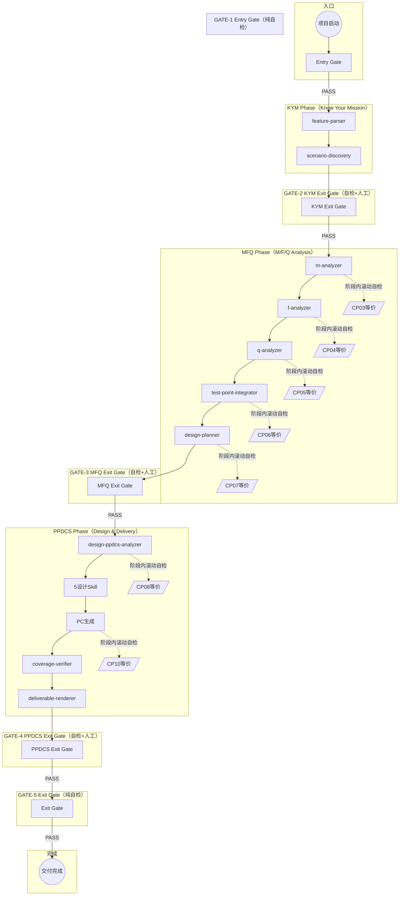
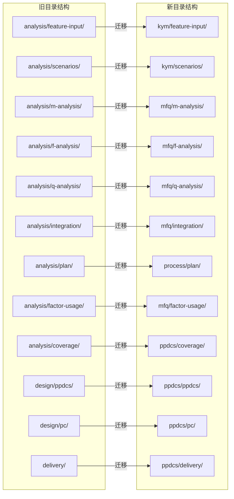
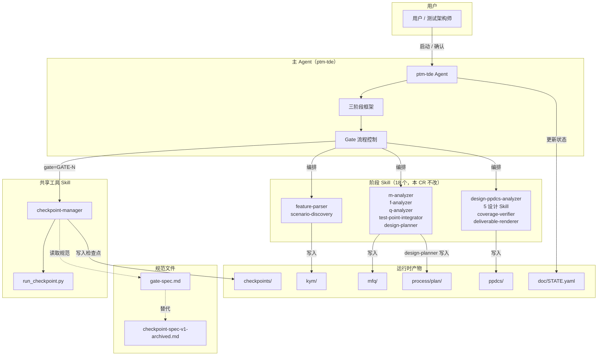
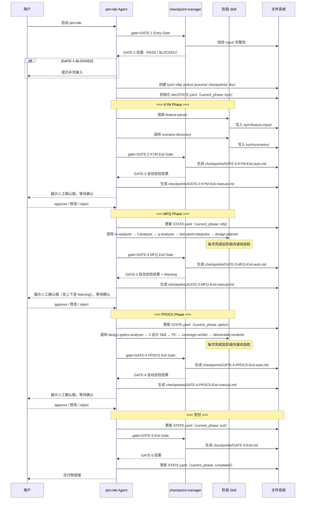
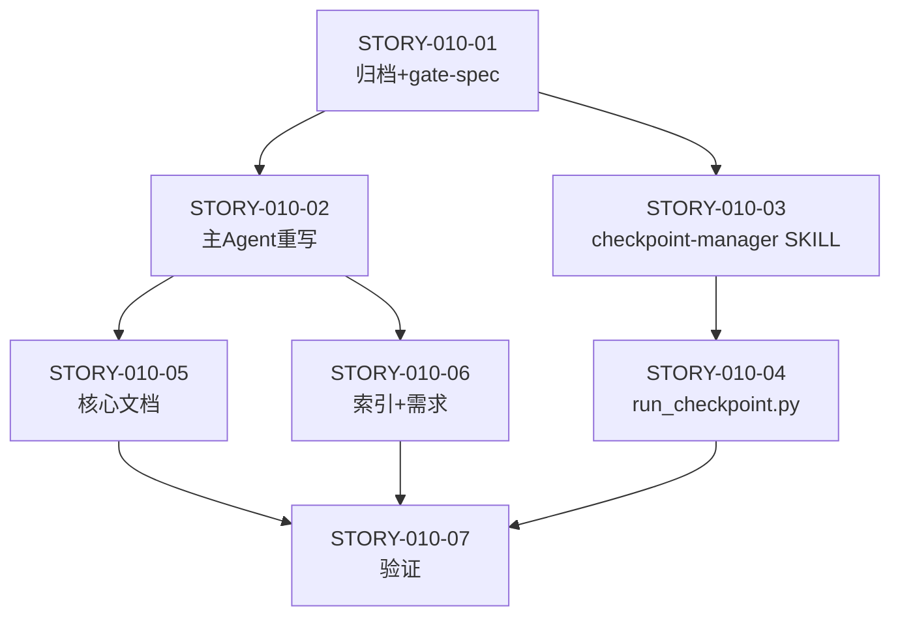

# 高层设计（HLD）：CR-010 ptm-tde 三阶段框架改造

> 基于 `process/changes/CR-010-ptm-tde三阶段框架改造.md`（已批准）输出。
> 由 meta-se 在 solution-design 阶段生成。
> HLD 必须先通过 CP3 自动预检（`process/checks/CP3-HLD-CONSISTENCY.md`），再经 CP3 人工确认（`checkpoints/CP3-HLD-REVIEW.md`）后，方可进入 Story 拆解阶段。

---

## 修订记录

| 版本 | 日期 | 修订人 | 变更要点 |
|---|---|---|---|
| 1.0 | 2026-06-01 | meta-se | 初始 HLD，覆盖问题定义、架构灰区（4 个灰区已通过 CR-DQ-01/03/04/05 解决）、候选方案（2 个）、推荐方案、关键流程、模块契约、受影响文件矩阵和 Story 建议 |
| 1.1 | 2026-06-01 | meta-dev | [P0-C2] §21 Gotchas 新增「过渡期 Skill 仍写旧路径」关键假设：CR-010 只改造主 Agent 框架和检查点体系，不修改 18 个 Skill 的 SKILL.md；路径对齐由 CR-011/012/013 分别完成，全部 CR 完成前不发布新版本。同步修正 §21 中 `doc/STATE.yaml`→`process/STATE.yaml`。 |

---

## 1. 问题定义

### 问题陈述

ptm-tde 当前采用 **11 步线性状态机 + 12 个检查点（CP01-CP12）** 的主流程模型，存在以下结构性问题：

1. **步骤粒度过细、阶段语义模糊**：11 个步骤中有 5 个步骤属于 MFQ 分析范畴（M/F/Q/整合/计划），3 个步骤属于 PPDCS 设计范畴（设计/PC/覆盖），但主 Agent 中缺乏"阶段"这一抽象层，导致用户和 Skill 开发者无法直观理解"当前在哪个大阶段"。
2. **检查点体系扁平化**：12 个 CP 编号平铺，CP03-CP07 与 CP08-CP10 本质上是阶段内滚动自检，却与 CP01/CP02/CP09/CP11 这样真正的人工决策点使用相同的编号层级，造成重要性混淆。
3. **MFQ→PPDCS 边界无人工确认点**：当前流程中，M/F/Q 分析完成后直接进入 PPDCS 设计，用户只能在 CP09（PPDCS 设计确认）时第一次看到设计决策，此时若发现 MFQ 分析有误，返工成本是整个 PPDCS 设计阶段。
4. **目录结构与阶段不对齐**：旧 `analysis/` 和 `design/` 分区无法直观反映产物归属阶段，`analysis/plan/`（设计计划）作为跨阶段边界产物却放在分析目录下，语义矛盾。
5. **CP 编号与 Meta Flow CP0-CP8 命名冲突**：ptm-tde 的 CP01-CP12 与 Meta Flow 的 CP0-CP8 使用相同 `CP` 前缀但语义完全不同，虽已有映射表说明，但新用户容易混淆。

### 核心价值

- **降低认知负担**：用户（测试架构师/测试工程师）看到的是 3 个阶段 + 5 个门，而非 11 步 + 12 个 CP。
- **新增 MFQ Exit Gate 人工确认点**：在 MFQ 完成后、PPDCS 开始前插入决策点，避免带错误分析进入昂贵的设计阶段。
- **目录结构与概念模型对齐**：每个阶段的产物放在自己的阶段目录下，边界清晰。
- **CP 兼容映射**：保留旧 CP 编号作为路由别名，保护已有知识和工具链。

### 目标

| 优先级 | 目标 | 度量方式 |
|--------|------|---------|
| P0 | 将 ptm-tde 主 Agent 的 11 步状态机重构为三阶段框架（KYM / MFQ / PPDCS）+ 入口/出口门控（5 Gate） | `agents/ptm-tde.md` 不再包含 11 步状态机文本，流程描述改为三阶段 + Gate |
| P0 | 新增 MFQ Exit Gate（GATE-3）作为自检+人工确认点 | `docs/ptm-tde/gate-spec.md` 包含 GATE-3 完整规范（Entry Criteria / Checklist / 人工确认项 / Exit Criteria / Deliverables） |
| P0 | 将产物目录从 `analysis/`/`design/` 迁至 `kym/`/`mfq/`/`ppdcs/`/`process/` 的阶段级目录 | 主 Agent 的初始化流程和路径规则引用新目录结构 |
| P1 | checkpoint-manager 支持双模式（Gate + CP），兼容 `--gate` 和 `--cp` 参数路由 | `run_checkpoint.py` 支持 `--gate GATE-1` 和 `--cp CP01`，后者自动路由到对应 Gate |
| P1 | 全部 7 个受影响的文档文件更新为三阶段 + Gate 体系描述 | `grep -rn "11 步\|11步\|CP01\|CP02\|...\|CP12" docs/ptm-tde/` 无剩余旧引用 |

### 成功标准

- [ ] `agents/ptm-tde.md` 的主流程描述不再包含"第 1 步"至"第 11 步"的线性编号，改用"Entry Gate → KYM Phase → GATE-2 → MFQ Phase → GATE-3 → PPDCS Phase → GATE-4 → GATE-5"表达
- [ ] `docs/ptm-tde/gate-spec.md` 存在且包含 5 个 Gate 的完整规范（每个 Gate 含 Entry Criteria / Checklist / Exit Criteria / Deliverables）
- [ ] `docs/ptm-tde/checkpoint-spec.md` 内容已被 `gate-spec.md` 替代（原文件归档为 `checkpoint-spec-v1-archived.md`）
- [ ] `skills/checkpoint-manager/SKILL.md` 包含 CP↔Gate 映射表和 `--gate` / `--cp` 兼容路由说明
- [ ] `process/REQUIREMENTS-ptm-tde.md` 新增 REQ-030（三阶段框架）和 REQ-031（MFQ Exit Gate）
- [ ] `grep` 验证：框架文件（`agents/ptm-tde.md`、`docs/ptm-tde/`、`skills/checkpoint-manager/SKILL.md`）不再出现旧 CP01-CP12 编号作为主引用

### 约束

| 类型 | 约束内容 |
|------|---------|
| 技术 | 不修改任何 Skill SKILL.md 文件（18 个 Skill 的路径迁移和内容改造由 CR-011/012/013 分别承接） |
| 技术 | ptm-tde 运行时在全新特性项目根目录工作，不涉及 Meta Flow 运行时目录 |
| 业务 | checkpoint-manager 双模式不能破坏 Meta Flow CP0-CP8 通用工作流的兼容性 |
| 业务 | 旧目录不删除（由 CR-011/012/013 完成后统一处理），本 CR 只创建新目录结构声明 |
| 资源 | 本 CR 在 `story-execution` 阶段实施，不补建 CP0-CP5 自动检查文件 |

### 非目标（Out of Scope）

- 修改任何 Skill SKILL.md 文件（18 个 Skill 由 CR-011/012/013 分别承接）
- 修改 Skill 的运行逻辑、输入输出契约或触发词映射
- 修改 ptm-tde 的安装脚本或安装器行为
- 修改 Meta Flow 通用 CP0-CP8 检查点体系
- 删除旧 `analysis/` 和 `design/` 目录（待 CR-013 完成后统一处理）
- 热切换运行中的 ptm-tde 工作流实例

### 关键假设

- 假设 Skill 的触发词映射在当前 `agents/ptm-tde.md` 中已正确维护，本 CR 只改变 Skill 的阶段归属标注，不改变触发词
- 假设 CR-011/012/013 将在本 CR 完成后按顺序执行，且每条 CR 都独立可验证
- 假设 checkpoint-manager 的 `run_checkpoint.py` 脚本的 CP 模式逻辑在当前版本可正确工作，本 CR 只在之上叠加 Gate 模式
- 假设 `doc/STATE.yaml` 的 `current_phase` 字段取值将在各 Gate 通过时由主 Agent 更新（kym / mfq / ppdcs / exit / completed）

### 缺失信息

| 优先级 | 缺失信息 | 影响范围 | 决策所需时限 |
|--------|---------|---------|------------|
| REQUIRED | `run_checkpoint.py` 当前实现细节（参数解析、检查逻辑、输出格式） | §11 Story 拆解中 STORY-010-05 的改造工作量估算 | HLD 确认后、Story 拆解前 |
| OPTIONAL | 用户对 `GATE-3 MFQ Exit Gate` 人工确认项的补充需求（如希望增加特定 MFQ 质量检查项） | §11 GATE-3 Checklist 细节 | CP3 确认前可接受当前设计，后续通过 CR 增量 |

---

## 2. 架构灰区与方案形成记录

> CR-010 在创建过程中已识别 5 项待人工决策（CR-DQ-01 至 CR-DQ-05），其中 4 项涉及架构层面的关键选择，1 项（CR-DQ-02）因不适用而取消。用户已于 2026-06-01T15:30:00+08:00 通过 `approve` 确认全部推荐方案。
> 由于灰区讨论已通过 CR Decision Brief 完成且已获批，本节仅记录灰区识别结果和决策结论，不再展开多轮 advisor discussion。

**CP3 讨论日志**：`process/discussions/CP3-HLD-DISCUSSION-LOG.md`（本次 HLD 设计中创建）
**CP3 讨论恢复点**：`process/checks/CP3-DISCUSSION-CHECKPOINT.json`（本次 HLD 设计中创建）

### Architecture Gray Areas

| 灰区 ID | 关键问题 | 为什么会影响架构 | 影响面 | 推荐讨论顺序 | canonical refs | 状态 |
|---|---|---|---|---|---|---|
| AGA-01 | Gate 编号与命名体系：5 个 Gate 如何命名？是否保留 CP 编号映射？ | 影响门控文件命名、checkpoint-manager 路由逻辑、主 Agent 门控引用、所有文档描述体系 | 范围 / 模块 / 文档 | 1 | CR-DQ-01 / CR-010 §待人工决策清单 | resolved (Gate 主编号 + CP 兼容别名) |
| AGA-02 | MFQ Exit Gate 检查范围：只检查 MFQ 内部完整性，还是包含上下游衔接？ | 影响 GATE-3 Checklist 定义、用户确认体验、MFQ/PPDCS 阶段边界的责任划分 | 范围 / 验证 | 2 | CR-DQ-03 / CR-010 §待人工决策清单 | resolved (MFQ 内部为主 + 上下游 Warning) |
| AGA-03 | process/plan/ 跨阶段消费契约：design-planner 写入后，PPDCS 如何消费和验证？ | 影响 design-planner 输出路径、MFQ/PPDCS Exit Gate 检查内容、阶段边界产物所有权 | 模块 / 数据 | 3 | CR-DQ-04 / CR-010 §待人工决策清单 | resolved (MFQ 写入，PPDCS 读取+验证) |
| AGA-04 | checkpoint-manager 改造策略：完全替换为 Gate 还是双模式并存？ | 影响 checkpoint-manager 代码结构、Meta Flow CP0-CP8 兼容性、非 ptm-tde 工作流的稳定性 | 模块 / 安全 / 验证 | 4 | CR-DQ-05 / CR-010 §待人工决策清单 | resolved (双模式并存，Gate + CP) |

### Advisor Table

| Option | Pros | Cons | Impact Surface | Recommendation | Assumptions / When to switch |
|---|---|---|---|---|---|
| AGA-01: Gate 主编号 + CP 兼容别名 | 体系简洁（5 Gate vs 12 CP）；CP↔Gate 映射表保护旧引用；新旧用户均可理解 | 需维护映射表；checkpoint-manager 需实现路由逻辑 | 范围：Gate 文件命名、checkpoint-manager 路由、主 Agent 引用 | **推荐**（CR-DQ-01 方案 A） | 若映射表维护成本过高，可在后续 CR 中将 CP 兼容标记 deprecated |
| AGA-01: 纯 Gate 编号，不保留 CP 映射 | 最干净，无历史包袱 | 破坏所有旧引用；现有工具链和知识文档全部失效 | 范围：所有文件、工具链、用户知识 | 不推荐 | — |
| AGA-02: MFQ 内部为主 + 上下游 Warning | 聚焦 MFQ 质量；用户有上下游可见性但不强制阻断；Warning 可在 PPDCS Exit Gate 二次检查 | 上下游缺口可能到 PPDCS 阶段才暴露 | 范围：GATE-3 checklist、用户确认体验 | **推荐**（CR-DQ-03 方案 A） | 若上下游缺口频繁导致返工，可将 Warning 升级为阻断项 |
| AGA-02: 全量 + 上下游强制检查 | 端到端可追溯 | 范围过大；Gate 间可能死锁（MFQ Exit Gate 需要 PPDCS 信息） | 范围：GATE-3 checklist、Gate 间依赖 | 不推荐 | — |
| AGA-03: MFQ 写入 + PPDCS 读取+验证 | 一个 Writer（design-planner）；两个阶段各负责自己的 Gate 检查；职责清晰 | 需要 PPDCS Exit Gate 额外检查 plan 消费完整性 | 模块：design-planner 输出路径、MFQ/PPDCS Exit Gate | **推荐**（CR-DQ-04 方案 A） | 若频繁返工可增加 plan-review Gate 或采用共同维护模式 |
| AGA-03: 两阶段共同维护 | 灵活 | 缺乏单一 owner 可能冲突 | 模块：design-planner、PPDCS 设计 Skill | 不推荐 | — |
| AGA-04: 双模式并存（Gate + CP） | 不影响非 ptm-tde 工作流；ptm-tde 无感切换 | 代码维护两个模式路径；需处理模式检测逻辑 | 模块：checkpoint-manager、run_checkpoint.py | **推荐**（CR-DQ-05 方案 A） | 若双模式维护成本过高可统一回 CP 体系 |
| AGA-04: 完全替换为 Gate | 最干净 | 破坏 Meta Flow CP0-CP8 | 模块 / 安全：所有使用 checkpoint-manager 的工作流 | 不推荐 | — |

### 方案形成输入与事后审查区分

| 类型 | 来源 | 影响的 HLD 章节 | 处理结果 | 说明 |
|---|---|---|---|---|
| 方案形成输入 | CR Decision Brief（用户 approve） | §3 / §4 / §5 / §8 / §9 / §10 / §11 | adopted | CR-DQ-01/03/04/05 全部采用方案 A，CR-DQ-02 取消 |
| 方案形成输入 | CR-010 背景分析（当前 11 步状态机问题） | §1 / §2 | adopted | 问题定义和灰区识别基于 CR 背景章节 |

### Deferred Architecture Ideas

| ID | 想法 / 风险 / 扩展方向 | 来源 | 延后原因 | 触发切换或重启条件 |
|---|---|---|---|---|
| DAI-01 | 将 GATE-3 上下游 Warning 升级为阻断项 | CR-DQ-03 备选方案 | 当前先以 Warning 试运行，观察上下游缺口的实际频率和影响 | 若上下游缺口频繁导致 PPDCS 阶段返工（≥2 次/项目），通过 CR 将 Warning 升级为阻断项 |
| DAI-02 | 统一清理旧 `analysis/` 和 `design/` 目录 | CR-DQ-02 | 需等 CR-011/012/013 完成后 Skill 不再写入旧路径 | CR-013 完成后创建清理 CR |
| DAI-03 | CP 兼容别名 deprecation | AGA-01 | 需要足够长的过渡期让用户和工具链适应新 Gate 编号 | 至少 2 个完整项目周期后，通过 CR 将 CP 别名标记 deprecated |

---

## 3. 候选架构方案对比

### 方案 A：三阶段 + Gate 门控体系（推荐方案 / CR 已批准方案）

**核心思路**：将 11 步状态机 + 12 CP 重构为三阶段框架（KYM / MFQ / PPDCS）+ 入口/出口门控（5 Gate），目录结构改为阶段级目录（kym/ / mfq/ / ppdcs/ / process/），checkpoint-manager 双模式支持 Gate 和 CP 兼容路由。

| 维度 | 评估 |
|------|------|
| 优点 | 阶段语义清晰（3 阶段 vs 11 步）；新增 MFQ Exit Gate 降低返工风险；目录结构与概念模型对齐；CP 兼容映射保护旧引用；checkpoint-manager 双模式不破坏非 ptm-tde 工作流 |
| 缺点 | 需要重写主 Agent 框架部分（约 200 行）；需要维护 CP↔Gate 映射表；checkpoint-manager 需要新增 Gate 模式代码路径 |
| 复杂度 | medium（框架层改造，不动 Skill 内容） |
| 实施成本 | 预计 5-7 个 Story，1 个 Wave 内完成 |
| 可扩展性 | 三阶段框架为后续 CR-011/012/013 提供清晰的阶段边界，每阶段改造独立可验证 |
| 风险 | 主 Agent 重写可能遗漏某些路径规则或约束；checkpoint-manager 双模式可能引入路由 bug；文档更新可能遗留旧编号引用 |
| 适用前提 | 用户接受 5 Gate 编号体系；checkpoint-manager 现有 CP 模式代码可正确工作；后续 CR-011/012/013 按顺序推进 |

### 方案 B：仅目录重组 + 逻辑阶段划分（备选方案）

**核心思路**：保持 11 步状态机和 12 CP 编号不变，仅在主 Agent 中添加逻辑阶段分组注释，目录重组为阶段级目录，但不引入 Gate 体系和 MFQ Exit Gate。本质上是"在旧框架上贴阶段标签"。

| 维度 | 评估 |
|------|------|
| 优点 | 改动量最小（主 Agent 只需加阶段注释，不改变状态机逻辑）；零 Gate 学习成本；CP 编号和检查点脚本完全不变 |
| 缺点 | 阶段语义不强制（Skill 仍按 11 步调用，只是加注释分组）；无 MFQ Exit Gate，返工风险不解决；CP01-CP12 编号仍然扁平化，重要性不区分；CP 与 Meta Flow CP 命名冲突依旧 |
| 复杂度 | low |
| 实施成本 | 预计 3-4 个 Story |
| 可扩展性 | 后续引入 Gate 体系仍需全量重写，两次改动而非一次到位 |
| 风险 | 改造不彻底，核心问题（MFQ→PPDCS 无边界的确认盲区、检查点重要性混淆）未解决；用户仍需记忆 12 个 CP |
| 适用前提 | 用户对 MFQ Exit Gate 没有需求；用户认为 CP01-CP12 编号体系可接受 |

### 方案对比矩阵

| 维度 | 方案 A（三阶段Gate） | 方案 B（仅目录重组+注释） |
|------|---------------------|-------------------------|
| 实现难度 | ⭐⭐⭐（中等） | ⭐（容易） |
| 阶段语义清晰度 | ⭐⭐⭐⭐⭐ | ⭐⭐ |
| 降低返工风险 | ⭐⭐⭐⭐（新增 MFQ Exit Gate） | ⭐（无变化） |
| 可维护性 | ⭐⭐⭐⭐（Gate 体系自描述） | ⭐⭐（注释不会自我强制） |
| CP 兼容性 | ⭐⭐⭐⭐（映射表） | ⭐⭐⭐⭐⭐（无变化） |
| 目录-概念对齐 | ⭐⭐⭐⭐⭐ | ⭐⭐⭐⭐⭐ |
| 为 CR-011/012/013 铺垫 | ⭐⭐⭐⭐⭐ | ⭐⭐ |

**推荐方案**：方案 A（三阶段 + Gate 门控体系），理由：方案 A 一次性解决全部 5 个结构问题，且已通过 CR Decision Brief 获得用户批准。方案 B 只是"化妆式"改造，核心问题不解决，且后续引入 Gate 体系仍需二次返工。

---

## 4. 推荐方案总览

**复杂度模式**：`standard`

| 判定维度 | 依据 | 结论 |
|---------|------|------|
| 需求规模 | 新增 REQ-030 + REQ-031，改造 9 个文件（1 核心 Agent + 1 新 Gate spec + 1 checkpoint spec 归档 + 1 checkpoint-manager + 1 脚本 + 7 文档 + 1 需求文件） | standard |
| 角色数量 | 单一角色（ptm-tde Agent 框架），不涉及多 Agent 交互 | standard |
| 状态流转 | 11 步状态机 → 3 阶段 + 5 Gate，状态流转复杂度降低 | standard |
| 平台适配 | 仅 ptm-tde 自己使用，不跨平台 | standard |
| Story 拆解 | 预计 5-7 个 Story，1 个 Wave，均为框架层改动 | standard |

**系统核心思路**：
将 ptm-tde 的 11 步线性流程重组为 3 个语义阶段（KYM / MFQ / PPDCS），在阶段边界设置 5 个 Gate（GATE-1 Entry 至 GATE-5 Exit），用 Gate 替代 CP01-CP12 作为检查点体系。产物目录从 `analysis/`/`design/` 迁移到阶段级目录 `kym/`/`mfq/`/`ppdcs/`，`process/plan/` 作为跨阶段边界产物独立存放。checkpoint-manager 保持双模式（Gate + CP），通过 CP↔Gate 映射表实现兼容路由。

**关键架构风格**：管道-过滤器风格，三阶段按序推进，Gate 在阶段间过滤和确认。

**核心能力边界**：
- 做：定义三阶段框架、5 个 Gate 的检查规范、新目录结构、CP↔Gate 映射关系、主 Agent 的框架级编排逻辑
- 不做：修改任何 Skill 的运行逻辑（交由 CR-011/012/013）、删除旧目录、改变用户可见的测试设计方法论流程

**关键依赖**：
- `docs/ptm-tde/gate-spec.md`：5 个 Gate 的检查规范真相源，被 checkpoint-manager 和主 Agent 消费
- `skills/checkpoint-manager/`：共享工具 Skill，提供 Gate/CP 双模式检查执行能力
- `process/REQUIREMENTS-ptm-tde.md`：需求基线，新增 REQ-030 和 REQ-031 为框架改造提供需求追溯

**适用条件**：
- ptm-tde 已 delivered 基线（9 个 Story verified），框架稳定可改造
- 用户已批准 CR-010 全部 5 项决策
- 后续 CR-011/012/013 按计划推进，Skill 路径迁移不会出现空窗期
- 不满足时回退到方案 B（仅目录重组+注释），或保持现状

**产物形态**：
- Agent 文件：1 个（`agents/ptm-tde.md`，框架部分重写）
- 新建规范文件：1 个（`docs/ptm-tde/gate-spec.md`）
- 归档文件：1 个（`docs/ptm-tde/checkpoint-spec-v1-archived.md`）
- 修改 Skill 文件：1 个（`skills/checkpoint-manager/SKILL.md`，已更新为 Gate 模式）
- 修改脚本：1 个（`skills/checkpoint-manager/scripts/run_checkpoint.py`）
- 修改文档文件：6 个（`docs/ptm-tde/README.md`、`USER-MANUAL.md`、`runtime-artifacts.md`、`component-manual.md`、`skill-references.md`、`skills/README.md`、`agents/README.md`、`process/REQUIREMENTS-ptm-tde.md`）
- 目标平台：Claude Code / Codex（不涉及新增平台）

---

## 5. 适用性矩阵

| 适用性维度 | 当前项目判断 | 推荐方案如何适配 | 不适配信号 | When to switch |
|---|---|---|---|---|
| 用户目标 | 降低认知负担 + 新增 MFQ 人工确认点 + 为后续阶段改造铺路 | 三阶段框架直接降低步骤粒度；MFQ Exit Gate 填补确认盲区 | 用户表示不需要 MFQ Exit Gate | 切换至方案 B |
| 项目成熟度 | ptm-tde 已 delivered 基线，9 个 Story verified，处于成熟增量改造阶段 | 框架层改造不影响已交付基线；Skill 内容不动确保稳定性 | 出现 Skill 与框架不兼容 | 暂停并通过 CR 修复 |
| 认知负担 | 当前 11 步 + 12 CP 需要用户记忆编号和顺序 | 3 阶段 + 5 Gate 的自描述性降低记忆负担；CP 兼容映射保护已有知识 | 用户反馈 Gate 概念更难理解 | 增加过渡期文档或培训材料 |
| 验证条件 | 通过 grep 验证旧编号消除 + gate-spec 完整性 + checkpoint-manager 双模式路由正确性 | 每条验证方法在 CR-010 §验证方法中已定义 | 验证脚本不可用 | 手动逐项检查 |
| 回退成本 | 主 Agent 重写约 200 行框架代码；gate-spec 为新建文件 | git revert 即可回退；旧 checkpoint-spec 已归档保留 | 无法 revert（有其他 CR 依赖） | 先还原互依赖的 CR |

### 优化 / 牺牲 / 切换条件

| 方案选择 | 优化了什么 | 牺牲了什么 | 接受理由 | 切换条件 |
|---|---|---|---|---|
| 方案 A（三阶段+Gate） | 阶段语义清晰度、MFQ 人工确认点、目录概念对齐 | checkpoint-manager 双模式维护成本；CP↔Gate 映射表维护 | 双模式维护成本可控（约增加 50 行路由代码）；映射表为静态文档 | 若双模式 bug 频发或用户要求纯 Gate，则切换至 checkpoint-manager 纯 Gate 模式（通过 CR） |
| 方案 A vs 方案 B | 一次性解决全部 5 个结构问题 | 实施成本略高（5-7 Story vs 3-4 Story） | 避免两次改造的总成本高于一次改造 | 若实施过程中发现不可预期的 Skill 兼容问题，可降级到方案 B 快速止血 |

---

## 6. Use Case → Architecture Traceability

ptm-tde 的 USE-CASES 已通过 `process/USE-CASES-ptm-tde.md` 定义。本 CR 是框架层结构改造，不修改任何 Skill 的运行逻辑，因此所有 UC 的行为结果不变，但**执行路径中的检查点和目录结构发生变化**。

| Use Case | 支撑模块 / 组件 | 关键流程 | 异常 / 失败路径 | 验证方式 | 备注 |
|---|---|---|---|---|---|
| UC-01 安装与初始化 | 主 Agent（初始化流程）、checkpoint-manager（GATE-1） | 用户启动 ptm-tde → 主 Agent 创建 `kym/`/`mfq/`/`ppdcs/`/`process/`/`checkpoints/`/`doc/` → 调用 checkpoint-manager 执行 GATE-1 Entry Gate | 目录创建失败（路径冲突/无权限）→ GATE-1 输出 BLOCKING 项 | 新特性项目 dry-run 验证目录创建 | 目录结构从 `analysis/`/`design/` 改为 `kym/`/`mfq/`/`ppdcs/`/`process/` |
| UC-02 输入解析 | 主 Agent（编排）、feature-parser（Skill，不变） | Entry Gate 通过 → KYM Phase → 调用 feature-parser 解析输入 | 输入文件缺失 → GATE-1 已检查 | feature-parser 输出到 `kym/feature-input/` | Skill 输出路径未变（由 CR-011 承接），本 CR 只声明目录 |
| UC-03 场景发现与确认 | 主 Agent（编排）、scenario-discovery（Skill，不变）、checkpoint-manager（GATE-2） | KYM Phase 完成 → 调用 checkpoint-manager 执行 GATE-2 KYM Exit Gate（自动+人工） | 场景不完整 → GATE-2 输出 BLOCKING 项 | GATE-2 生成 `checkpoints/GATE-2-KYM-Exit-auto.md` + `manual.md` | 原 CP02 人工确认改为 GATE-2 KYM Exit Gate |
| UC-04 MFQ 分析与整合 | 主 Agent（编排）、m/f/q-analyzer + test-point-integrator + design-planner（Skill，不变）、checkpoint-manager（阶段内滚动自检 + GATE-3） | MFQ Phase 各 Skill 执行 → 阶段内滚动自检（对应原 CP03-CP07 逻辑）→ 全部完成后调用 checkpoint-manager 执行 GATE-3 MFQ Exit Gate（自动+人工） | M/F/Q 分析不完整 → 阶段内自检捕获；LC 拓扑绑定不一致 → GATE-3 Checklist #5 捕获 | GATE-3 生成 `checkpoints/GATE-3-MFQ-Exit-auto.md` + `manual.md` | **新增**人工确认点，原 CP03-CP07 降为阶段内滚动自检 |
| UC-05 PPDCS 设计与 PC 生成 | 主 Agent（编排）、design-ppdcs-analyzer + 5 设计 Skill + coverage-verifier（Skill，不变）、checkpoint-manager（阶段内滚动自检 + GATE-4） | PPDCS Phase 各 Skill 执行 → 阶段内滚动自检（对应原 CP08/CP10 逻辑）→ 全部完成后调用 checkpoint-manager 执行 GATE-4 PPDCS Exit Gate（自动+人工） | 设计不完整或覆盖率未达标 → GATE-4 Checklist 捕获 | GATE-4 生成 `checkpoints/GATE-4-PPDCS-Exit-auto.md` + `manual.md` | 原 CP09+CP11 合并为 GATE-4 |
| UC-06 交付 | 主 Agent（编排）、deliverable-renderer（Skill，不变）、checkpoint-manager（GATE-5） | GATE-4 通过 → 调用 deliverable-renderer 生成交付物 → 调用 checkpoint-manager 执行 GATE-5 Exit Gate | 交付物不完整 → GATE-5 Checklist 捕获 | GATE-5 生成 `checkpoints/GATE-5-Exit.md` | 原 CP12 改为 GATE-5 Exit Gate |

---

## 7. 关键场景模拟

| 模拟 ID | 场景 | 输入 / 前置条件 | 推荐架构执行路径 | 预期输出 | 失败 / 回退路径 | 结果 |
|---|---|---|---|---|---|---|
| SIM-01 | 用户启动全新特性项目，完成 KYM 阶段 | 用户放置需求文件到 `input/`，启动 ptm-tde | Entry Gate(GATE-1) 自检通过 → 初始化目录(`kym/`/`mfq/`/`ppdcs/`/`process/`/`checkpoints/`/`doc/`) → feature-parser 输出到 `kym/feature-input/` → scenario-discovery 输出到 `kym/scenarios/` → GATE-2 自动自检 + 人工确认 | `checkpoints/GATE-1-Entry.md` PASS；`kym/scenarios/confirmed-scenarios.md` 存在；`checkpoints/GATE-2-KYM-Exit-auto.md` PASS；人工确认稿展示待决策清单 | 若 GATE-1 发现输入缺失 → 输出 BLOCKING 项，提示用户补充；若 GATE-2 场景不完整 → 输出 BLOCKING 项，告知哪些 seed 未映射 | PASS |
| SIM-02 | 用户完成 MFQ 分析，首次遇到 MFQ Exit Gate | KYM 已通过，MFQ 阶段所有 Skill 执行完成 | m-analyzer → f-analyzer → q-analyzer → test-point-integrator → design-planner（阶段内每次完成后滚动自检）→ 全部完成后 GATE-3 自动自检 → 主 Agent 收集待确认决策清单 → 展示 GATE-3 人工确认稿 | `checkpoints/GATE-3-MFQ-Exit-auto.md` 包含 8 项 Checklist 结果 + 2 项 Warning；人工确认稿展示 M/F/Q 分析质量、LC 整合一致性、设计计划、公共因子消费等决唤项 | 若 Checklist #5（LC topology_bindings 不一致）捕获到绑定缺口 → 输出 `needs-confirmation` 并列出 `topology_gap_refs`；若用户 reject → 回到 MFQ 阶段修复 | PASS |
| SIM-03 | 用户发现 MFQ 分析有误，在 GATE-3 reject 后修正并重新通过 | GATE-3 人工确认时用户 reject（发现 M 分析遗漏一个单功能） | 用户 reject → 主 Agent 回到 MFQ Phase（M 分析）→ 补充遗漏单功能 → 重新执行 f/q/integration/plan → 重新执行 GATE-3 自检 → 再次展示人工确认稿 | 补完后 GATE-3 Checklist #1 PASS；人工确认稿中之前标记的问题项已清除 | 若补充后仍不通过 → 继续循环；若用户连续 reject 3 次 → 主 Agent 建议缩小范围或记录为风险接受项 | PASS |

---

## 8. 系统架构图

### 三阶段框架与 Gate 流转

### 目录结构对比

### 模块间调用关系

---

## 9. 高层模块与职责划分

| 模块名称 | 类型 | 职责 | 输入 | 输出 | 依赖 |
|---------|------|------|------|------|------|
| ptm-tde 主 Agent（框架层） | Agent | 三阶段框架编排：Gate 流转控制、阶段 Skill 调度、检查点触发、目录初始化、状态管理 | 用户启动指令 | Skill 编排、Gate 触发、`doc/STATE.yaml` 更新 | checkpoint-manager、18 个阶段 Skill |
| GATE-1 Entry Gate | Gate（纯自检） | 特性项目输入完整性校验 | `input/` 目录、用户提供的需求文件路径 | `checkpoints/GATE-1-Entry.md` | checkpoint-manager |
| GATE-2 KYM Exit Gate | Gate（自检+人工） | KYM 阶段产物完整性校验与用户确认 | `kym/scenarios/confirmed-scenarios.md`、`kym/feature-input/` | `checkpoints/GATE-2-KYM-Exit-auto.md` + `manual.md` | checkpoint-manager |
| GATE-3 MFQ Exit Gate | Gate（自检+人工） | MFQ 阶段产物完整性校验与用户确认（新增大工确认点） | `mfq/` 全部产物、`process/plan/`、`mfq/factor-usage/` | `checkpoints/GATE-3-MFQ-Exit-auto.md` + `manual.md` | checkpoint-manager |
| GATE-4 PPDCS Exit Gate | Gate（自检+人工） | PPDCS 阶段产物完整性校验与用户确认 | `ppdcs/` 全部产物、`ppdcs/coverage/` | `checkpoints/GATE-4-PPDCS-Exit-auto.md` + `manual.md` | checkpoint-manager |
| GATE-5 Exit Gate | Gate（纯自检） | 最终交付物完整性校验 | `ppdcs/delivery/` | `checkpoints/GATE-5-Exit.md` | checkpoint-manager |
| checkpoint-manager | Skill（共享工具） | Gate/CP 双模式检查执行：Entry Criteria 校验、Checklist 遍历、Exit Criteria 判定、Deliverables 输出 | 来自主 Agent 的 `gate=<GATE-N>` 或 `cp=<CP-ID>` 参数 | 检查点文件（`checkpoints/GATE-*.md`） | `gate-spec.md`（检查规范真相源）、`run_checkpoint.py`（脚本） |
| run_checkpoint.py | 脚本 | Gate/CP 双模式参数解析、Checklist 自动执行、结果 Markdown 生成 | `--gate GATE-N` 或 `--cp CP-ID` + `--project-root` | `checkpoints/GATE-*.md` | `skills/checkpoint-manager/SKILL.md` |
| gate-spec.md | 规范文件 | 5 个 Gate 的完整检查规范真相源（Entry Criteria / Checklist / Exit Criteria / Deliverables） | — | 被 checkpoint-manager 和主 Agent 读取 | — |
| checkpoint-spec-v1-archived.md | 归档文件 | 旧 CP01-CP12 规范的历史存档 | — | — | — |

**模块边界规则**：
- 主 Agent 只负责**框架层编排**：决定"何时执行哪个阶段、何时触发哪个 Gate"，不拥有任何阶段内部的检查逻辑
- checkpoint-manager 是**共享工具 Skill**：不拥有任何阶段的检查逻辑，只提供统一的检查执行框架；检查细节以 `gate-spec.md` 为真相源
- 18 个阶段 Skill 的 SKILL.md 文件**本 CR 不修改**：其触发词、输入输出契约、运行逻辑保持不变；路径迁移由 CR-011/012/013 承接
- `process/plan/` 是跨阶段边界产物：MFQ 阶段的 design-planner 写入，PPDCS 阶段的 Skill 读取；两个阶段的 Gate 各自检查

---

## 10. 技术选型与理由

| 选型类别 | 选择 | 备选方案 | 选择理由 | 风险 |
|---------|------|---------|---------|------|
| Gate 编号体系 | Gate 主编号（GATE-1 至 GATE-5）+ CP↔Gate 映射表 | 纯 CP 编号阶段嵌套；纯 Gate 编号无映射 | 体系简洁（5 vs 12）；映射表保护旧引用；新旧用户均可理解 | 映射表需维护 |
| Gate 文件命名 | `GATE-{N}-{Name}.md`（如 `GATE-1-Entry.md`、`GATE-2-KYM-Exit-auto.md`） | `gate_{N}_{name}.md` | 可读性强，人工确认稿用 `-manual` 后缀区分 | 文件名长度适中 |
| checkpoint-manager 改造 | 双模式（Gate + CP）并存，`run_checkpoint.py` 新增 `--gate` 参数 + `--cp` 兼容路由 | 完全替换为 Gate；Gate 作为 CP 子类型 | 不影响非 ptm-tde 工作流（Meta Flow CP0-CP8）；增量改造风险低 | 双模式维护成本；路由检测可能有边界 bug |
| 目录结构 | 阶段级目录：`kym/`、`mfq/`、`ppdcs/`、`process/plan/`（跨阶段） | 保持 `analysis/`/`design/` + 逻辑映射；完全扁平化 | 目录与概念模型对齐；每阶段产物独立；`process/plan/` 显式表达跨阶段边界 | 旧路径引用在 Skill 中残留（由 CR-011/012/013 解决） |
| 旧目录处理 | 本 CR 不删除，并行共存；`docs/` 文档描述新路径 | 立即删除；不创建新目录仅逻辑映射 | 各 CR 独立可验证；Skill 还没改路径前目录已删除会空窗 | 两套路径同时声明的过渡期文档维护成本 |
| 状态文件更新 | `doc/STATE.yaml` 使用 `current_phase: kym / mfq / ppdcs / exit / completed` | 使用 `current_gate`；使用 `current_step` | 阶段粒度与框架对齐；与旧 `current_phase` 取值兼容后缀 | STATE.yaml 消费者需要适配新取值 |

---

## 11. 关键流程

### 主流程：三阶段 + Gate 编排

### Gate 检查流程（以 GATE-2 KYM Exit Gate 为例）

1. **Entry Criteria 校验**：主 Agent 确认 `kym/scenarios/confirmed-scenarios.md` 存在、`kym/feature-input/` 可读、输入分类完成、组网输入已处理
2. **Checklist 遍历**：checkpoint-manager 按 `gate-spec.md` §GATE-2 的 14 项 Checklist 逐项检查，每项输出 PASS / BLOCKING / WAIVED
3. **自动自检结果生成**：写入 `checkpoints/GATE-2-KYM-Exit-auto.md`，包含逐项检查结果和整体结论
4. **人工确认稿生成**：主 Agent 遍历场景产物，收集全部待确认问题，以统一决策清单呈现（每项含推荐方案 + 至少 1 个备选方案 + 优劣分析），写入 `checkpoints/GATE-2-KYM-Exit-manual.md`
5. **用户确认**：用户回复 approve / 修改 / reject
6. **Exit Criteria 判定**：无 BLOCKING 项或用户接受风险 → PASS，更新 `doc/STATE.yaml`

### 阶段内滚动自检流程（以 MFQ 阶段为例）

1. m-analyzer 执行完成 → checkpoint-manager 按 CP03 等价 Checklist 执行阶段内自检（写入 `checkpoints/` 或日志）
2. f-analyzer 执行完成 → 同逻辑（CP04 等价）
3. q-analyzer 执行完成 → 同逻辑（CP05 等价）
4. test-point-integrator 执行完成 → 同逻辑（CP06 等价）
5. design-planner 执行完成 → 同逻辑（CP07 等价）
6. 全部 Skill 完成 → 触发 GATE-3 MFQ Exit Gate（自动+人工）

---

## 12. 非功能需求设计

| 质量特征 | 设计目标 | 实现手段 | 验证方式 |
|---------|---------|---------|---------|
| 性能 | 框架改造不引入可感知的性能退化 | 不增加额外文件 I/O；Gate 检查复用现有 checkpoint-manager 代码路径 | 同一特性项目下改造前后运行时长相比较（≤5% 差异视为无退化） |
| 可靠性 | Gate 检查失败时不会丢失已完成的阶段产物 | Gate 检查只读产物，不修改；失败后用户可直接回到对应阶段修复 | 模拟 GATE-3 checklist #5 失败，确认 `mfq/` 产物未被修改 |
| 安全性 | 不引入新的权限或输入注入风险 | 框架层改动不涉及用户输入解析或命令执行 | `dangerous-command-scan` 检查主 Agent 和 checkpoint-manager |
| 可维护性 | 三阶段框架自描述，降低新开发者理解成本；Gate 规范独立于代码 | Gate 规范集中在 `gate-spec.md`；主 Agent 框架部分 ≤ 300 行；checkpoint-manager Gate 模式增量 ≤ 100 行 | 行数统计；新开发者 30 分钟内能画出三阶段流程 |
| 可移植性 | ptm-tde 在 Claude Code 和 Codex 两个平台的行为一致 | 框架改造不涉及平台特定代码；Gate 检查逻辑平台无关 | 两个平台分别执行 GATE-1，输出一致 |
| 易用性 | 用户从"11 步"迁移到"3 阶段"的过渡成本最小化 | CP↔Gate 映射表；旧 CP 编号作为兼容路由参数；文档中说明映射关系 | 用户仅凭 CP↔Gate 映射表能正确找到对应 Gate |
| 兼容性 | 旧 CP 编号仍可路由到对应 Gate；非 ptm-tde 工作流不受影响 | `run_checkpoint.py --cp CP01` 自动路由到 `--gate GATE-1`；`--cp` 不存在时走原有 CP 模式 | 执行 `--cp CP01` 和 `--gate GATE-1`，输出相同的检查结果 |

---

## 13. 主要风险与应对

| 风险 ID | 风险描述 | 概率 | 影响 | 应对策略 | 触发信号 |
|---------|---------|------|------|---------|---------|
| R1 | 主 Agent 框架重写时遗漏现有路径规则或约束（如路径规则中有 5 条 CRITICAL 规则） | 中 | 高 | 逐条对照旧版 `agents/ptm-tde.md` 的路径规则、初始化流程、确认点规则、约束章节，确保新版不遗漏 | grep 对比新旧版本的路径规则数量不一致 |
| R2 | checkpoint-manager 双模式路由逻辑 bug（如 `--cp` 参数路由到错误的 Gate） | 中 | 中 | CP↔Gate 映射表使用显式 dict/hash 映射而非条件分支；每个映射项写单元级路由测试 | `--cp CP01` 输出内容与 `--gate GATE-1` 不一致 |
| R3 | 文档更新遗留旧编号（"11 步"、"CP01" 等） | 高 | 低 | grep 验证脚本作为 Story 验收标准的一部分；文档中旧编号用于"历史说明"时显式标注 `（旧）` | grep 发现 `agents/ptm-tde.md` 或 `docs/ptm-tde/` 中有未标注的旧编号 |
| R4 | `process/plan/` 跨阶段消费契约不一致（PPDCS 阶段读取 plan 时发现格式不符） | 低 | 中 | gate-spec.md §GATE-3 的 Checklist #8 检查 plan 格式；GATE-4 的 Checklist #7 检查消费完整性 | GATE-3 输出 plan 格式错误；GATE-4 输出 plan 消费不完整 |
| R5 | 后续 CR-011/012/013 改造时发现框架设计中遗漏了 Skill 需要的目录声明 | 低 | 中 | 本 HLD 的目录迁移表覆盖全部 12 个旧目录路径；CR-011/012/013 开始前回顾本节风险 | CR-011/012/013 实施时发现新目录不足以承载 Skill 产物 |

---

## 14. ADR 候选决策点

| ADR ID | 决策问题 | 建议决定 | 约束此决策的因素 |
|--------|---------|---------|---------------|
| ADR-01 | ptm-tde 检查点体系采用 Gate 编号还是 CP 编号？ | Gate 主编号（GATE-1 至 GATE-5）+ CP↔Gate 映射表 | 体系简洁（5 vs 12）；需兼容旧引用；需区分于 Meta Flow CP0-CP8 |
| ADR-02 | MFQ 阶段结束后是否需要人工确认点？ | 需要，GATE-3 MFQ Exit Gate 为自检+人工确认 | MFQ→PPDCS 边界无确认曾是返工风险的主要来源；新增确认点对齐 CE2/CP09 的确认粒度 |
| ADR-03 | checkpoint-manager 作为通用工具 Skill 还是 ptm-tde 专属 Skill？ | 共享工具 Skill，双模式支持 Gate 和 CP | 非 ptm-tde 工作流依赖 checkpoint-manager 的 CP 模式；需保持向后兼容 |
| ADR-04 | `process/plan/` 的读写责任归属？ | MFQ 阶段（design-planner）写入，PPDCS 阶段读取+验证 | 单一 Writer 避免冲突；两个阶段的 Gate 各自检查各自的边界责任 |
| ADR-05 | 旧 `analysis/` 和 `design/` 目录何时删除？ | 本 CR 不删除，待 CR-013（PPDCS 阶段改造）完成后统一清理 | 避免"目录已删除但 Skill 还没改路径"的空窗期 |

---

## 15. 分阶段落地建议

| 阶段 | 交付物 | 里程碑标志 | 前提条件 |
|------|--------|---------|---------|
| 阶段 1（本 CR） | 三阶段框架 + 5 Gate 体系 + 新目录结构声明 + 文档更新 | `agents/ptm-tde.md` 框架部分重写完成；`gate-spec.md` 可用；checkpoint-manager 双模式可用；全部文档引用新体系 | CR-010 HLD 确认 |
| 阶段 2（CR-011） | KYM 阶段 Skill 路径迁移 + KYM 阶段 Skill 内容改造 | feature-parser 和 scenario-discovery 写入 `kym/` | 阶段 1 完成 |
| 阶段 3（CR-012） | MFQ 阶段 Skill 路径迁移 + MFQ 阶段 Skill 内容改造 | m/f/q-analyzer、test-point-integrator、design-planner 写入 `mfq/` 和 `process/plan/` | 阶段 2 完成 |
| 阶段 4（CR-013） | PPDCS 阶段 Skill 路径迁移 + PPDCS 阶段 Skill 内容改造 + 旧目录清理 | 全部 Skill 写入新路径；`analysis/` 和 `design/` 删除 | 阶段 3 完成 |

---

## 16. 工作量粗估

| 类别 | Story 数 | 预计 Wave 数 | 粗估工作量 |
|------|---------|------------|---------|
| Gate 规范文件（新建 gate-spec + 归档 checkpoint-spec） | 2 | Wave 1 | S |
| 主 Agent 框架重写 | 1 | Wave 1 | M |
| checkpoint-manager + 脚本改造 | 2 | Wave 1 | M |
| 文档更新（8 个文件） | 1-2 | Wave 1 | M |
| **合计** | **6-7** | **1 个 Wave** | **约 1-2 个工作日** |

---

## 17. 待确认问题

| 问题 ID | 问题描述 | 优先级 | 影响范围 | 负责人 | 目标答复时间 |
|---------|---------|--------|---------|--------|------------|
| Q1 | `run_checkpoint.py` 当前实现细节（参数解析方式、现有 CP 模式代码结构）需确认，以精确估算 STORY-010-05 的工作量 | REQUIRED | §16 工作量粗估、§11 Story 拆解中 STORY-010-05 的任务分解 | meta-po / 当前代码库 | HLD 确认后、Story 拆解前 |
| Q2 | GATE-3 人工确认项是否需要根据实际 MFQ 阶段产物内容增加特定检查项（当前 4 项：M/F/Q 分析质量、LC 整合一致性、设计计划、公共因子消费） | OPTIONAL | §11 GATE-3 Checklist 细节 | 用户（测试架构师） | CP3 确认前可接受当前设计，后续通过 CR 增量 |

---

## 18. HLD 自审记录

| 自审项 | 结果 | 证据 / 说明 |
|---|---|---|
| Architecture Gray Areas 已前置处理 | PASS | 4 个灰区通过 CR-DQ-01/03/04/05 解决，记录在 §2 |
| Advisor table 已影响推荐方案 | PASS | AGA-01 至 AGA-04 的 advisor table 全部采用推荐方案，影响 §3 方案选择、§9 模块职责、§10 技术选型 |
| 适用性矩阵完整 | PASS | §5 覆盖 5 个维度（用户目标、项目成熟度、认知负担、验证条件、回退成本）+ 优化/牺牲/切换条件 |
| Use Case → Architecture Traceability 完整 | PASS | §6 覆盖 6 个关键 UC（UC-01 至 UC-06），每个含支撑模块、关键流程、异常路径、验证方式 |
| 关键场景模拟通过 | PASS | §7 覆盖 3 个关键场景（全新项目 KYM、首次 MFQ Exit Gate、GATE-3 reject 后修正），全部 PASS |
| 优化 / 牺牲 / 切换条件明确 | PASS | §5 末尾表格明确列出方案 A 优化了什么（阶段语义、MFQ 确认点、目录对齐）、牺牲了什么（双模式维护成本）、切换条件 |
| HLD / ADR / Risk / NFR 内部一致 | PASS | §13 风险 R1-R5 与 §9 模块职责、§12 NFR 兼容性、§10 技术选型互相印证；§14 ADR-02（MFQ Exit Gate）与 §13 R2/C2 一致 |

---

## 19. 受影响文件矩阵

| 文件 | 变更类型 | 变更要点 | 预计行数变化 | 对应 Story |
|------|----------|----------|------------|-----------|
| `docs/ptm-tde/checkpoint-spec.md` | 归档 | 复制为 `checkpoint-spec-v1-archived.md`，原文件删除（内容已由 gate-spec.md 替代） | +0 / -9650（归档保留） | STORY-010-01 |
| `docs/ptm-tde/gate-spec.md` | 新建 | 5 个 Gate 的完整规范（Entry Criteria / Checklist / Exit Criteria / Deliverables），CP↔Gate 映射表，跨阶段拓扑绑定检查 | +309 行（已创建） | STORY-010-02 |
| `agents/ptm-tde.md` | 框架重写 | 状态机 → 三阶段框架；删除 11 步列表；新增 Gate 流转逻辑；目录初始化改为新路径；Skill 触发表阶段归属更新；确认点改为 Gate 体系 | 约 ±200 行（框架部分） | STORY-010-03 |
| `skills/checkpoint-manager/SKILL.md` | 更新 | 新增 Gate 模式描述、CP↔Gate 映射表、`--gate` 参数说明、脚本用法示例；CP 模式保留不变 | +150 行（Gate 部分） | STORY-010-04 |
| `skills/checkpoint-manager/scripts/run_checkpoint.py` | 更新 | 新增 `--gate` 参数支持、Gate/CP 模式检测、CP↔Gate 路由映射 | +50 行（路由逻辑） | STORY-010-05 |
| `docs/ptm-tde/README.md` | 更新 | "11步"→"3阶段"；目录结构更新；检查点描述更新 | ±80 行 | STORY-010-06 |
| `docs/ptm-tde/USER-MANUAL.md` | 更新 | 工作流路径描述更新；运行时目录规则更新 | ±50 行 | STORY-010-06 |
| `docs/ptm-tde/runtime-artifacts.md` | 更新 | 产物目录结构全部替换为新路径 | ±120 行（目录树） | STORY-010-06 |
| `docs/ptm-tde/component-manual.md` | 更新 | 主流程表替换为三阶段 | ±30 行 | STORY-010-06 |
| `docs/ptm-tde/skill-references.md` | 更新 | Skill 阶段归属更新（KYM / MFQ / PPDCS） | ±20 行 | STORY-010-06 |
| `skills/README.md` | 更新 | "11步"→"3阶段"；Skill Index 阶段归属说明更新 | ±15 行 | STORY-010-07 |
| `agents/README.md` | 更新 | Agent 说明更新 | ±5 行 | STORY-010-07 |
| `process/REQUIREMENTS-ptm-tde.md` | 更新 | 新增 REQ-030（三阶段框架）和 REQ-031（MFQ Exit Gate），修订记录追加 v7.0 | +40 行 | STORY-010-07 |

---

## 20. Story 拆解建议

### Story 列表

| Story ID | 标题 | 优先级 | 依赖 | 预计工作量 | 输出文件 |
|----------|------|--------|------|----------|---------|
| STORY-010-01 | 归档旧 checkpoint-spec + 创建 gate-spec | P0 | 无 | S（0.5h） | `docs/ptm-tde/checkpoint-spec-v1-archived.md`（已创建）；`docs/ptm-tde/gate-spec.md`（已创建） |
| STORY-010-02 | 重写主 Agent 框架部分 | P0 | STORY-010-01 | M（2h） | `agents/ptm-tde.md`（框架部分：状态机→三阶段、Gate 编排、新目录初始化、Skill 阶段归属、约束更新） |
| STORY-010-03 | 更新 checkpoint-manager SKILL.md（Gate 模式） | P0 | STORY-010-01 | M（1.5h） | `skills/checkpoint-manager/SKILL.md`（Gate 模式描述、CP↔Gate 映射、脚本用法） |
| STORY-010-04 | 改造 run_checkpoint.py（双模式路由） | P0 | STORY-010-03 | M（1.5h） | `skills/checkpoint-manager/scripts/run_checkpoint.py`（`--gate` 参数、CP↔Gate 路由） |
| STORY-010-05 | 更新核心文档（5 个 docs/ptm-tde/ 文件） | P1 | STORY-010-02 | M（2h） | `docs/ptm-tde/README.md`、`USER-MANUAL.md`、`runtime-artifacts.md`、`component-manual.md`、`skill-references.md` |
| STORY-010-06 | 更新索引与需求文件（3 个文件） | P1 | STORY-010-02、STORY-010-05 | S（1h） | `skills/README.md`、`agents/README.md`、`process/REQUIREMENTS-ptm-tde.md` |
| STORY-010-07 | grep 验证 + 整体回归 | P0 | STORY-010-01 至 STORY-010-06 | S（0.5h） | 验证脚本输出 |

### 依赖关系图

### 并行策略

- STORY-010-02 和 STORY-010-03 可并行（各自独立文件，无冲突）
- STORY-010-05 和 STORY-010-06 可并行（不同文件集，无冲突）
- STORY-010-04 依赖 STORY-010-03（需要 SKILL.md 中的 Gate 模式定义）
- Wave 1 执行全量 7 个 Story，`max_parallel_dev=2`

---

## 21. Gotchas

- **checkpoint-manager 是共享工具 Skill，不是 ptm-tde 专属**：Gate 模式下它仍只提供检查执行框架；所有 Checklist 细节以 `gate-spec.md` 为真相源，不可硬编码在 checkpoint-manager 中。
- **`--cp` 兼容参数不是简单的 1:1 映射**：CP03-CP07 映射到 MFQ 阶段内滚动自检（不是独立 Gate），CP08/CP10 映射到 PPDCS 阶段内滚动自检。`--cp CP03` 应执行 M 分析完整性检查，而非触发 GATE-3。
- **旧编号检查点在文档中的处理**：`docs/` 中保留的 CP 编号历史说明必须显式标注 `（旧）`，不能和新 Gate 编号并列使用而不区分。
- **`process/plan/` 的跨阶段属性**：它是唯一不在阶段目录下的分析产物，design-planner 写入、PPDCS Skill 读取。如果 design-planner 还没做路径迁移（由 CR-012 承接），它仍会写入 `analysis/plan/`——此时主 Agent 需要知道两个路径可能并存。
- **GATE-3 的上下游 Warning 是非阻断项**：checkpoint-manager 执行 GATE-3 时，W1 和 W2 输出 Warning 但不影响 Exit Criteria 判定。主 Agent 展示人工确认稿时必须区分"阻断问题"和"Warning 提示"。
- **主 Agent 初始化流程中的目录创建**：新目录结构需要创建 `kym/feature-input/`、`kym/scenarios/`、`mfq/m-analysis/`、`mfq/f-analysis/`、`mfq/q-analysis/`、`mfq/integration/`、`mfq/factor-usage/`、`ppdcs/ppdcs/`、`ppdcs/pc/`、`ppdcs/coverage/`、`ppdcs/delivery/`、`process/plan/`——共 12 个子目录，容易遗漏。
- **`process/STATE.yaml` 的 `current_phase` 取值变更**：原取值如 `input`/`scenario`/`m-analysis` 等不再使用，改为 `kym`/`mfq`/`ppdcs`/`exit`/`completed`。如果存在消费 STATE.yaml 的外部工具，需要同步通知。
- **checkpoint-spec.md 原文件处理**：归档文件 `checkpoint-spec-v1-archived.md` 已经创建（2026-06-01T15:57），但原始 `checkpoint-spec.md` 仍存在且内容未变。本 CR 应将原文件替换为指向 `gate-spec.md` 的索引或重定向说明，而非保留两份内容相同的文件。当前策略需在 STORY-010-01 中明确。
- **gate-spec.md 已创建但 checkpoint-spec.md 未删除**：当前 `docs/ptm-tde/` 下同时存在 `checkpoint-spec.md`（CP01-CP12 内容）、`checkpoint-spec-v1-archived.md`（归档副本）和 `gate-spec.md`（新 Gate 规范）。STORY-010-01 必须处理 `checkpoint-spec.md` 的去留——建议替换为指向 `gate-spec.md` 的简短重定向，而非保留两套规范并行。
- **过渡期 Skill 仍写旧路径（关键假设）**：CR-010 只改造主 Agent 框架和检查点体系，不修改 18 个 Skill 的 SKILL.md。CR-010 完成后，主 Agent 和 gate-spec 引用新路径（`kym/`/`mfq/`/`ppdcs/`/`process/`），但 Skill 仍引用旧路径（`analysis/`/`design/`）。路径对齐由 CR-011（KYM）、CR-012（MFQ）、CR-013（PPDCS）分别完成。全部 CR 完成前，ptm-tde 不发布新版本。

---

<!-- meta-po 填写：CP3 HLD 人工确认记录 -->
## CP3 确认记录

**CP3 自动预检结果**：`process/checks/CP3-HLD-CONSISTENCY.md`  
**CP3 人工 checklist**：`checkpoints/CP3-HLD-REVIEW.md`

**确认状态**：⬜ 待审核 → ✅ 已批准 / ❌ 需修改

**审核意见**：

**确认人**：
**确认时间**：
