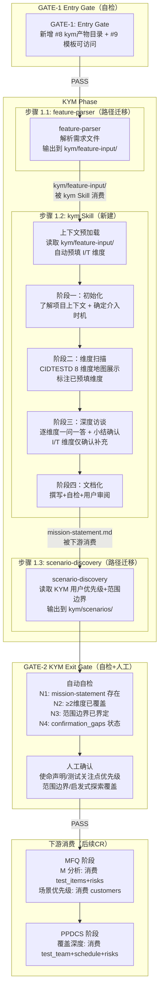
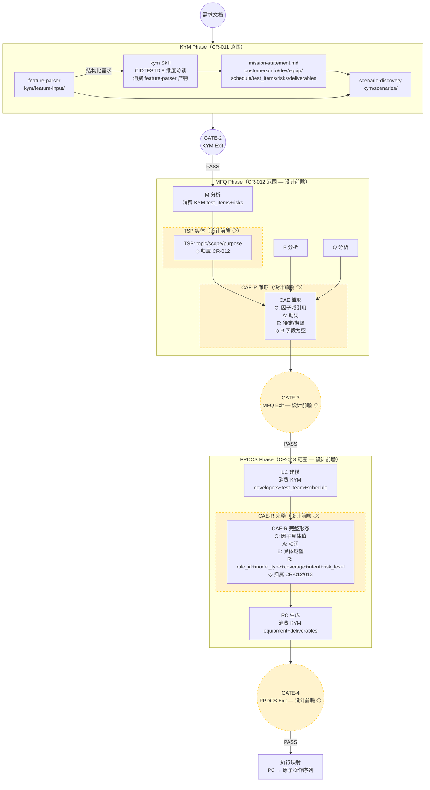
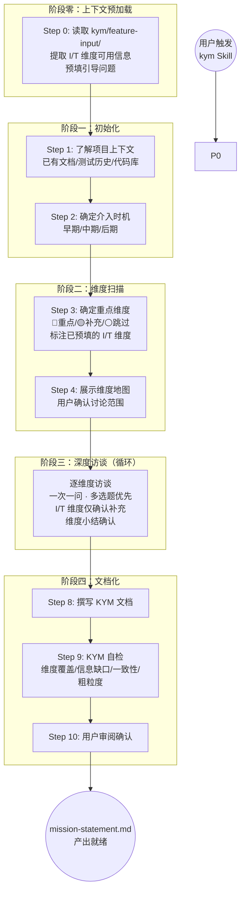
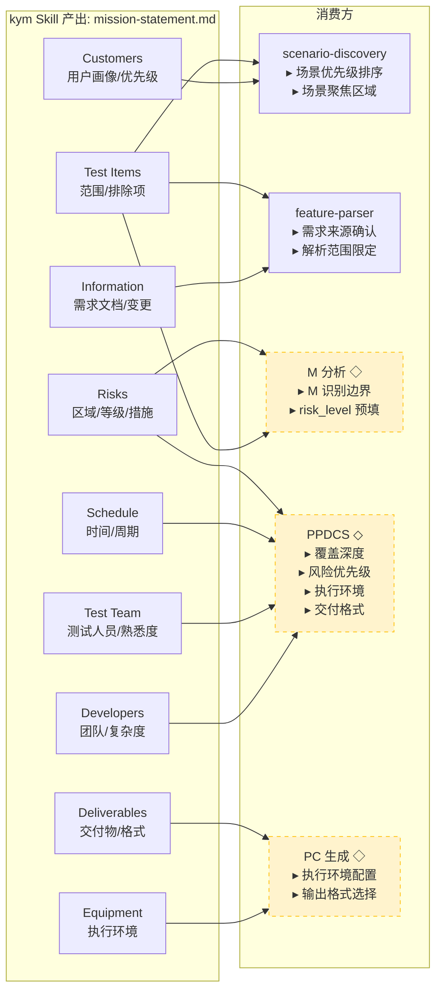

# 高层设计（HLD）：CR-011 ptm-tde KYM 阶段改造

> 基于 `process/changes/CR-011-ptm-tde-kym-phase.md`（已批准）和 CP3 Architecture Gray Areas 讨论结论（全部方案 A）输出。
> 由 meta-se 在 solution-design 阶段生成。
> 参考设计文档：`ptm-tde-workflow-v2.md`（完整数据流）、`kym-brainstorming-skill-设计.md`（kym Skill 详细设计）。

---

## 修订记录

| 版本 | 日期 | 修订人 | 变更要点 |
|---|---|---|---|
| 1.0 | 2026-06-02 | meta-se | 初始 HLD，覆盖问题定义、架构灰区（4 个灰区 + 10 项前瞻决策已通过用户确认）、候选方案（2 个）、推荐方案、4 张架构图、5 个模块职责、集成契约与信息消费链路、前瞻设计（TSP/CAE-R/因子格式演进/追踪链）、门控设计、风险与 ADR、分阶段落地 |
| 1.1 | 2026-06-02 | meta-po | CP3 人工确认修正：修正1—删除过渡期（ptm-tde 为独立运行时项目，无旧系统消费者，路径迁移一次完成，删除 §18.3、R3）；修正2—feature-parser → kym 顺序重设计（feature-parser 产物作为 kym 输入，kym 增加上下文预加载步骤，I/T 维度可自动预填，R2 重新设计为 auto-fill 策略）。更新 §4/§6/§8/§9/§10/§12/§14/§16/§18/§21/§22 |

---

## 1. 问题定义

### 问题陈述

CR-010 已将 ptm-tde 的三阶段框架（KYM / MFQ / PPDCS）+ 5 Gate 门控体系建立，但 **KYM 阶段的内容层仍为空白**：

1. **KYM 阶段缺少核心 Skill**：三阶段框架中 KYM Phase 包含 feature-parser 和 scenario-discovery 两个已有 Skill，但缺少"使命理解"这一关键环节。KYM 阶段本应产出结构化的使命文档，供所有下游阶段消费（用户画像 → 场景优先级、风险快照 → MFQ 分析边界、测试约束 → PPDCS 覆盖深度），但当前不存在任何 Skill 能完成此任务。
2. **已有 Skill 的路径未对齐新框架**：feature-parser 和 scenario-discovery 仍输出到旧 `analysis/` 路径，与 CR-010 建立的 `kym/` 目录体系不一致。
3. **KYM Exit Gate 缺少 KYM 专属检查项**：GATE-2 当前 14 项 Checklist 和 8 项人工确认项主要覆盖场景产物（Seed-to-Scenario Mapping、Topology、atomic-ops 等），缺少对使命理解产物（mission-statement.md）的完整性检查。
4. **主 Agent 流程未集成 kym Skill**：`agents/ptm-tde.md` 的 KYM 阶段步骤列表中尚未包含 kym Skill 的调用。

### 核心价值

- **填补 KYM 阶段内容空白**：新建 kym Skill，在测试设计之前消费 feature-parser 的结构化需求并通过 CIDTESTD 8 维度结构化访谈充分理解被测特性。
- **确立 KYM 消费链路**：feature-parser（结构化需求解析）→ kym（消费 feature-parser 产物进行使命理解）→ scenario-discovery（场景优先级依据 + kym 上下文）→ MFQ（M 识别边界、风险预填）→ PPDCS（覆盖深度决策）。
- **目录-概念对齐**：feature-parser 和 scenario-discovery 的输出路径从旧 `analysis/` 迁至 `kym/`，一次性完成，无过渡期。
- **Gate 覆盖完整**：GATE-2 新增使命理解专属检查项，覆盖 KYM 阶段全部产物。

### 目标

| 优先级 | 目标 | 度量方式 |
|--------|------|---------|
| P0 | 新建 `skills/kym/SKILL.md`：CIDTESTD 8 维度结构化访谈 + mission-statement.md 输出 | `skills/kym/SKILL.md` 存在且包含初始化、维度扫描、深度访谈、文档化四个阶段 |
| P0 | KYM 阶段路径迁移：feature-parser 和 scenario-discovery 的 `analysis/` → `kym/` | `grep -rn "analysis/feature-input\|analysis/scenarios" skills/feature-parser/SKILL.md skills/scenario-discovery/SKILL.md` 返回 0 |
| P0 | GATE-1 新增 kym 目录就绪检查项（#8 输出目录 + #9 使命理解产物目录） | `docs/ptm-tde/gate-spec.md` §GATE-1 包含 #8 和 #9 |
| P0 | GATE-2 新增 KYM Exit 专属检查项（N1-N4）和人工确认项（使命声明等 4 项） | `docs/ptm-tde/gate-spec.md` §GATE-2 包含 N1-N4；`skills/checkpoint-manager/SKILL.md` 新增对应检查项 |
| P1 | 主 Agent KYM 阶段集成 kym Skill（步骤 1.2，feature-parser 之后） | `agents/ptm-tde.md` 中 KYM 阶段步骤顺序：feature-parser（1.1）→ kym Skill（1.2）→ scenario-discovery（1.3） |
| P1 | Skill 注册和文档更新 | `skills/README.md` 和 `docs/ptm-tde/skill-references.md` 包含 kym Skill |

### 成功标准

- [ ] `skills/kym/SKILL.md` 存在，执行流程包含：上下文预加载（读取 feature-parser 产物 `kym/feature-input/`，自动预填 I/T 维度信息）→ 初始化（了解项目上下文 + 确定介入时机）→ 维度扫描（确定重点维度 + 展示维度地图，标注已预填维度）→ 深度访谈（逐维度一问一答 + 维度小结确认）→ 文档化（撰写 KYM 文档 + 自检 + 用户审阅）
- [ ] kym Skill 输出模板 `kym/mission-understanding/mission-statement.md` 使用 CIDTESTD 8 维度结构，包含 `risks` 字段（`{area, likelihood, impact, action}` 结构化格式，供下游测试设计消费）
- [ ] `skills/feature-parser/SKILL.md` 中所有 `analysis/feature-input/` 替换为 `kym/feature-input/`（一次完成，无过渡期）
- [ ] `skills/scenario-discovery/SKILL.md` 中所有 `analysis/` 路径替换为 `kym/`（~7 处）；非 KYM 阶段路径（`analysis/m-analysis/`、`analysis/f-analysis/`、`design/ppdcs/`）保持不动
- [ ] `docs/ptm-tde/gate-spec.md` §GATE-1 新增 #8（KYM 产物目录就绪）和 #9（mission-statement 模板可访问）；§GATE-2 新增 N1-N4 使命理解检查项和 4 项人工确认项
- [ ] `skills/checkpoint-manager/SKILL.md` 的 GATE-1/GATE-2 描述与 gate-spec 对齐
- [ ] `agents/ptm-tde.md` 的 KYM 阶段步骤顺序为：feature-parser（1.1）→ kym Skill（1.2）→ scenario-discovery（1.3），初始化流程创建 `kym/mission-understanding/` 目录

### 约束

| 类型 | 约束内容 |
|------|---------|
| 技术 | kym Skill 不讨论测试方案细节（范畴守卫：KYM 阶段只收集信息，禁止编写测试用例） |
| 技术 | CR-010 框架已建立，本 CR 在此框架下填充 KYM 阶段内容 |
| 技术 | 路径迁移严格限定在 KYM 阶段涉及的 Skill（feature-parser、scenario-discovery），不触碰 MFQ/PPDCS 路径 |
| 技术 | kym Skill 产出物写入 `kym/mission-understanding/`，不写入 `analysis/` 或 `mfq/` |
| 业务 | KYM 必须完成并获用户确认后，才能进入 MFQ 阶段（HARD-GATE 原则） |
| 资源 | 本 CR 在 `story-execution` 阶段实施，采用 standard 模式 |

### 非目标（Out of Scope）

- 不实现 TSP 实体（TSP 在 MFQ 阶段，归属 CR-012）
- 不实现 CAE-R 实体（CAE-R 在 MFQ/PPDCS 阶段，归属 CR-012/013）
- 不修改 m-analyzer、test-point-integrator 或任何 MFQ/PPDCS 阶段 Skill
- 不修改因子库格式（归属后续因子库增强 CR）
- 不更新 `agents/ptm-tde.md` 的追踪链为 v2 链（仅标注注释）
- 不删除旧 `analysis/` 目录（待全部 CR 完成后统一清理）

### 关键假设

- 假设 CR-010 已完成：`agents/ptm-tde.md` 已包含三阶段框架、`gate-spec.md` 已定义 GATE-1 和 GATE-2、目录初始化使用 `kym/`/`mfq/`/`ppdcs/`/`process/`
- 假设 feature-parser 和 scenario-discovery 的 SKILL.md 输出路径在 CR-010 完成后仍为旧 `analysis/` 路径（Skill 内容 CR-010 不修改）
- 假设 KYM 阶段执行顺序为 feature-parser（1.1）→ kym Skill（1.2）→ scenario-discovery（1.3），即 feature-parser 先完成结构化需求解析，kym Skill 再消费其产物
- 假设 kym Skill 可读取 `kym/feature-input/` 中 feature-parser 的结构化产物，从中自动提取 CIDTESTD 各维度的可用信息（I 维度：参考文档路径、变更范围；T 维度：测试项可从模块分解推断）
- 假设 CIDTESTD 8 维度框架（Customers / Information / Developer Relations / Equipment / Schedule / Test Items / Deliverables / Risks）作为 kym Skill 的核心启发式维度
- 假设 kym Skill 的 `risks` 输出使用结构化格式 `{area, likelihood, impact, action}`，可在后续 CR 中由 M 分析通过 area→M 名称模糊匹配消费为 `risk_level` 预填值
- 假设 ptm-tde 为独立运行时项目，不存在旧系统消费者依赖旧路径，路径迁移一次完成，无需过渡期

### 缺失信息

| 优先级 | 缺失信息 | 影响范围 | 决策所需时限 |
|--------|---------|---------|------------|
| REQUIRED | CR-010 实现后的 `agents/ptm-tde.md` 和 `gate-spec.md` 最终状态（当前以 HLD-CR-010 中设计为参照） | STORY-011-03 和 STORY-011-04 的改动基于 CR-010 产物，若 CR-010 实现与设计有差异需调整 | HLD 确认后、Story 拆解前 |
| OPTIONAL | 用户对 kym Skill 的 CIDTESTD 8 维度中各维度的引导问题是否有额外定制需求 | kym SKILL.md 中访谈脚本的措辞和选项 | CP3 确认前可接受当前设计，后续通过 CR 增量 |

---

## 2. 架构灰区与方案形成记录

> CR-011 在 HLD 设计前已识别 4 个 Architecture Gray Areas（AGA-01 至 AGA-04）和 10 项前瞻设计决策（DQ-TSP-01 至 DQ-FLOW-03）。用户于 2026-06-02T03:44:00+08:00 确认全部推荐方案（方案 A）。
> 完整讨论记录见 `process/discussions/CP3-HLD-DISCUSSION-LOG.md`。

### Architecture Gray Areas

| 灰区 ID | 关键问题 | 影响面 | 决策结论 | canonical refs |
|---------|---------|--------|---------|---------------|
| AGA-01 | kym Skill 归属形态：独立 Skill vs 合并到 feature-parser | 模块边界、Skill 索引、Agent 流程 | **独立 Skill**：kym Skill 关注使命理解（收集信息），feature-parser 关注需求解析（结构化提取），职责正交，独立维护 | CR-011 §一；`kym-brainstorming-skill-设计.md` §二 |
| AGA-02 | 启发式探索框架：固化维度 vs 全定制 vs 预设+扩展 | kym Skill 步骤 2 结构、GATE-2 N2 通过条件 | **CIDTESTD 8 维度预设 + 用户扩展席位**：固化 C/I/D/E/S/T/D 八个核心维度，用户可在步骤 2 新增自定义维度 | CR-011 §启发式探索占位框架；superpowers brainstorming；gsd-core domain-probes |
| AGA-03 | Gate 自检 vs 人工确认划分边界 | GATE-1 #8/#9 + GATE-2 N1-N4 的分类 | **保持当前分类**：GATE-1 #8/#9 为纯自检（目录/文件存在性）；GATE-2 N1-N2 为自检（mission-statement 存在 + 维度覆盖），N3-N4 为自检 + 人工确认（范围边界、确认缺口） | CR-011 §三；`gate-spec.md` §GATE-2 |
| AGA-04 | 路径迁移范围边界：严格 KYM vs 连带修正跨阶段引用 | feature-parser / scenario-discovery 的路径替换范围 | **严格 KYM 边界**：只迁移 `analysis/feature-input/` → `kym/feature-input/` 和 `analysis/scenarios/` → `kym/scenarios/`，不触碰 `analysis/m-analysis/`、`analysis/f-analysis/` 等 MFQ/PPDCS 路径 | CR-011 §二 |

### Advisor Table

| Option | Pros | Cons | Impact Surface | Recommendation | Assumptions / When to switch |
|--------|------|------|---------------|---------------|-----------------------------|
| AGA-01: 独立 kym Skill | 职责清晰（使命理解 vs 需求解析）；独立维护和演进；可被多个下游消费 | 多一个 Skill 文件要维护 | 模块边界、Skill 索引、Agent 编排 | **推荐** | kym 和 feature-parser 不共享状态，各自独立可测试 |
| AGA-01: 合并到 feature-parser | 减少 Skill 数量 | 职责混杂；feature-parser 已处理文件格式转换和结构化提取，加访谈逻辑会超载 | 模块边界、feature-parser 复杂度 | 不推荐 | 若用户强烈要求减少 Skill 数量 |
| AGA-02: CIDTESTD 8 维度预设+扩展 | 有方法论依据；固化维度确保最小覆盖；扩展席位保留灵活性 | 需要用户理解 8 个维度的含义 | kym Skill 步骤 2 结构、GATE-2 N2 通过条件 | **推荐** | 至少 2 个项目使用后，若扩展维度使用率 >80% 可考虑固化 |
| AGA-02: 全用户定制 | 最大的灵活性 | 无最小质量保证；新用户无从下手 | kym Skill 步骤 2 结构 | 不推荐 | 成熟团队有自己成熟的维度体系时 |
| AGA-03: 自检=存在性，人工=语义 | 机器可自动检查的交给机器；需判断的留给人类 | 人工确认项多时用户负担重 | GATE-2 用户确认体验 | **推荐** | 若人工确认项 >8 项可考虑优先级分层 |
| AGA-04: 严格 KYM 边界 | 改动量小（~12 处路径替换）；CR 独立可验证 | MFQ/PPDCS 路径仍需后续 CR 处理 | feature-parser / scenario-discovery | **推荐** | CR-012/013 需按计划推进 |

### 前瞻设计决策汇总

| 决策 ID | 决策类型 | 决策问题 | 结论 | 实现归属 |
|---------|---------|---------|------|---------|
| DQ-TSP-01 | architecture | TSP 实体形态 | 独立结构化实体（`{topic, scope, purpose}`） | CR-012 |
| DQ-TSP-02 | scope | TSP 实现归属 | HLD 完整设计，实现归属 CR-012 | CR-012 |
| DQ-CAER-01 | architecture | CAE→CAE-R 演进路径 | 渐进式超集（CAE 雏形 → CAE-R 完整） | CR-012/013 |
| DQ-CAER-02 | scope | CAE-R 实现归属 | HLD 完整设计，实现归属后续 CR | CR-012/013 |
| DQ-CAER-03 | implementation | kym risks 结构增强 | 保持现有结构，M 分析通过模糊匹配消费 | CR-011（SKILL.md 加一句说明） |
| DQ-FACTOR-01 | architecture | 因子格式演进策略 | 渐进兼容：保留当前格式 + 新增 `factor_type` + `tags` | 后续因子库增强 CR |
| DQ-FACTOR-02 | scope | factor_type 归属 | 后续 CR（因子库增强） | 后续因子库增强 CR |
| DQ-FLOW-01 | architecture | TSP/CAE-R 设计深度 | HLD 完整实体设计 + 标记「设计前瞻」 | CR-011（仅 HLD）+ CR-012/013（实现） |
| DQ-FLOW-02 | implementation | kym risks 契约说明 | kym SKILL.md 增加一句说明 | CR-011 |
| DQ-FLOW-03 | scope | 追踪链更新 | 暂不更新，注释标注 v2 方向 | CR-012 |

### Deferred Architecture Ideas

| ID | 想法 / 风险 / 扩展方向 | 来源 | 延后原因 | 触发切换或重启条件 |
|----|----------------------|------|---------|------------------|
| DAI-01 | 将 TSP 从 m-analyzer 中独立为单一职责 Skill | DQ-TSP-01 | 当前 m-analyzer 承担 M 识别 + PPDCS 特征标注，TSP 插入为步骤而非独立 Skill 更轻量 | 若 TSP 被多个下游消费且复杂度超过 m-analyzer 单步骤承载 |
| DAI-02 | 将 kym risks 的 `area` 字段映射标准化为枚举值 | DQ-CAER-03 | 当前通过模糊匹配已可工作，标准化需共识全部 M 的命名规则 | 若模糊匹配频繁失败（≥30% 的 M 无法匹配到 risk area） |
| DAI-03 | CIDTESTD 8 维度扩展为 10+ 维度（如安全合规、国际化） | AGA-02 | 当前 8 维度覆盖测试领域全景，新增维度通过用户扩展席位即可 | 若多个项目一致反馈缺少某维度 |

---

## 3. 候选架构方案对比

### 方案 A：CIDTESTD 8 维度预设 + 扩展（推荐方案 / 用户已批准方案）

**核心思路**：新建独立 `kym` Skill，使用 CIDTESTD 八大维度作为核心启发式框架（固化 C/I/D/E/S/T/D 维度），同时为用户预留扩展维度席位。kym Skill 采用四阶段流程（初始化 → 维度扫描 → 深度访谈 → 文档化），产出 `kym/mission-understanding/mission-statement.md`。KYM 阶段 Skill 路径迁移严格限定在 `analysis/` → `kym/` 的 KYM 相关子目录。GATE-1 新增 kym 产物目录就绪检查项，GATE-2 新增使命理解专属自检和人工确认项。

| 维度 | 评估 |
|------|------|
| 优点 | CIDTESTD 有扎实的方法论基础（来自测试领域 Know Your Mission 实践）；8 维度覆盖用户/项目/任务三大方面；扩展席位保留灵活性；HARD-GATE 原则在 KYM 确认前禁止进入测试设计；四阶段流程借鉴 Superpowers brainstorming 和 GSD discuss-phase 的成熟模式 |
| 缺点 | kym Skill 的 8 维度引导问题需维护；8 维度的认知门槛对新用户略高 |
| 复杂度 | medium（新建 1 个 Skill + 路径迁移 2 个 Skill + Gate 增强 + Agent 更新） |
| 实施成本 | 4 Stories，2 Waves；Wave A（kym Skill + 路径迁移）可并行，Wave B（Gate 增强 + Agent 更新）依赖 Wave A |
| 可扩展性 | 扩展维度席位支持项目级定制；kym Skill 的 interview 脚本可按维度独立演进；mission-statement.md 模板可由后续 CR 扩展字段 |
| 风险 | kym Skill 过于繁重导致用户跳过 KYM 直接进入 MFQ；mission-statement.md 与 feature-parser 产出的结构化需求可能存在信息冗余 |
| 适用前提 | 用户接受 CIDTESTD 8 维度框架；用户理解"先理解再设计"的价值；CR-010 框架已就绪 |

### 方案 B：轻量使命理解（嵌入 feature-parser）+ 最小 Path 迁移（备选方案）

**核心思路**：不创建独立 kym Skill，而是在 feature-parser 的步骤 1 之前增加一个"使命理解"小节（约 10 行），用 3-5 个开放问题替代 CIDTESTD 8 维度的结构化访谈。路径迁移只改 feature-parser 和 scenario-discovery 的输出路径声明，不修改任何内容逻辑。GATE-2 不新增使命理解检查项。

| 维度 | 评估 |
|------|------|
| 优点 | 改动量极小（feature-parser 增加 ~10 行 + 2 个 Skill 路径替换）；零新 Skill 学习成本；实施只需 2 个 Story |
| 缺点 | 使命理解深度不足：3-5 个开放问题无法系统性地覆盖用户/项目/任务全景；缺少 HARD-GATE 原则：可能跳过使命理解直接进入 MFQ；无结构化风险输出，后续 CAE-R 的 risk_level 预填无数据来源；不满足 v2 文档中 KYM 作为独立阶段的定位 |
| 复杂度 | low |
| 实施成本 | 2 Stories，1 Wave |
| 可扩展性 | 后续引入完整 KYM 体系需推翻重做 |
| 风险 | 使命理解沦为形式，"先设计后理解"的现状不改变 |
| 适用前提 | 用户对 KYM 阶段要求极低；项目时间紧迫需快速上线 |

### 方案对比矩阵

| 维度 | 方案 A（CIDTESTD 预设+扩展） | 方案 B（轻量嵌入 feature-parser） |
|------|---------------------------|---------------------------------|
| 实现难度 | ⭐⭐⭐（中等） | ⭐（容易） |
| KYM 阶段完整性 | ⭐⭐⭐⭐⭐ | ⭐ |
| 下游消费价值 | ⭐⭐⭐⭐⭐（风险、用户画像、测试项边界全部结构化） | ⭐⭐（只有粗略范围信息） |
| 认知负担 | ⭐⭐⭐（8 维度需学习） | ⭐⭐⭐⭐⭐（几乎零负担） |
| 可扩展性 | ⭐⭐⭐⭐⭐ | ⭐⭐ |
| 与 v2 方法论对齐 | ⭐⭐⭐⭐⭐ | ⭐ |
| 为 CR-012/013 铺垫 | ⭐⭐⭐⭐⭐（消费链路完整） | ⭐ |

**推荐方案**：方案 A（CIDTESTD 8 维度预设 + 扩展），理由：方案 A 系统性解决 KYM 阶段内容空白问题，建立完整的 KYM → 下游消费链路，与 v2 方法论对齐，为后续 CR-012（TSP/CAE-R 落地）提供必要的数据基础。方案 B 的"轻量"本质上是把问题推后，不解决 HARD-GATE 缺失的根本缺陷。

---

## 4. 推荐方案总览

**复杂度模式**：`standard`

| 判定维度 | 依据 | 结论 |
|---------|------|------|
| 需求规模 | 新建 1 个 Skill（~350 行）+ 修改 4 个 Skill/文档 + 增强 Gate 规范 | standard |
| 角色数量 | kym Skill 单一角色（使命理解访谈者），不涉及多 Agent 交互 | standard |
| 状态流转 | kym Skill 内部四阶段线性流转，无复杂状态机 | standard |
| 平台适配 | 仅 ptm-tde 自己使用，不跨平台 | standard |
| Story 拆解 | 4 Stories，2 Waves（Wave A 无互依赖可并行，Wave B 依赖 Wave A） | standard |

**系统核心思路**：
在 CR-010 建立的三阶段框架（KYM / MFQ / PPDCS）中填充 KYM 阶段的内容层。执行顺序为 feature-parser（步骤 1.1，先完成结构化需求解析）→ kym Skill（步骤 1.2，消费 feature-parser 产物，使用 CIDTESTD 八大维度（Customers / Information / Developer Relations / Equipment / Schedule / Test Items / Deliverables / Risks）作为结构化访谈框架，其中 I/T 维度可从 feature-parser 产物自动预填）→ scenario-discovery（步骤 1.3，消费 kym 产出）。kym Skill 产出 `kym/mission-understanding/mission-statement.md`。该文档被 scenario-discovery（场景优先级依据）消费，其结构化 `risks` 字段在后续 CR 中被 MFQ 阶段的 M 分析消费为 CAE-R 的 `risk_level` 预填值。同步完成 KYM 阶段 Skill 的路径迁移（`analysis/` → `kym/`，一次完成无过渡期），并补充 GATE-1（KYM 产物目录就绪检查）和 GATE-2（使命理解完整性检查）的检查项。

**关键架构风格**：管道-过滤器 + 结构化访谈（一问一答，增量确认）。

**核心能力边界**：
- 做：创建 kym Skill（CIDTESTD 8 维度结构化访谈 → mission-statement.md）、路径迁移（`analysis/feature-input/` → `kym/feature-input/`、`analysis/scenarios/` → `kym/scenarios/`）、GATE-1 #8/#9 新增、GATE-2 N1-N4 新增、Agent KYM 阶段集成
- 不做：TSP 实体实现、CAE-R 实体实现、因子格式改造、MFQ/PPDCS Skill 路径迁移、追踪链更新（仅标注注释）

**关键依赖**：
- CR-010 框架已就绪：`agents/ptm-tde.md` 包含三阶段框架、`gate-spec.md` 包含 GATE-1 和 GATE-2 规范、checkpoint-manager 支持双模式（Gate + CP）
- kym Skill 设计参照 `ptm-tde-workflow-v2.md` §3.1 KYM 结构化输出格式和 `kym-brainstorming-skill-设计.md` 四阶段流程

**适用条件**：
- CR-010 已完成（三阶段框架 + 5 Gate + checkpoint-manager 双模式）
- 用户已确认全部 4 个 AGA 和 10 项前瞻决策
- 后续 CR-012/013 按计划推进，消费 kym 产出的消费链路不会中断
- 不满足时回退到方案 B（轻量嵌入 feature-parser），或缩小 kym Skill 的 CIDTESTD 维度数为 4-5 个核心维度

---

## 5. 适用性矩阵

| 适用性维度 | 当前项目判断 | 推荐方案如何适配 | 不适配信号 | When to switch |
|-----------|------------|----------------|-----------|---------------|
| 用户目标 | 在测试设计前系统性理解被测特性 | CIDTESTD 8 维度 + HARD-GATE 确保"先理解再设计" | 用户表示 KYM 太繁琐、想要直接开始测试设计 | 降为 4-5 个核心维度，或切换至方案 B |
| 项目成熟度 | ptm-tde 已 delivered 基线，CR-010 框架已建立 | kym Skill 作为框架内的增量填充，不改变框架边界 | kym Skill 与现有 feature-parser 输出有信息冲突 | 调整 mission-statement 模板字段以适应现有产物格式 |
| 认知负担 | 用户（测试架构师）需要学习 CIDTESTD 8 维度含义 | kym Skill 提供维度地图展示（🔴重点/🟡补充/⚪跳过）、多选题优先降低回答门槛 | 用户反馈"8 维度太多记不住" | 增加更多维度内示例和预设选项 |
| 验证条件 | kym/mission-understanding/mission-statement.md 存在 + 路径迁移 grep 验证 + Gate 检查项对齐 | 每条验证方法在 CR-011 §验证方法中已定义 | 路径迁移 grep 有残留旧路径 | 逐检查遗漏项 |
| 回退成本 | kym Skill 为新建文件，feature-parser / scenario-discovery 路径替换可 git revert | git revert 即可回退；旧 `analysis/` 路径的 Skill 写入行为不丢失（旧目录未删除） | 无法 revert（有其他 CR 依赖） | 先还原互依赖的 CR |

### 优化 / 牺牲 / 切换条件

| 方案选择 | 优化了什么 | 牺牲了什么 | 接受理由 | 切换条件 |
|---------|-----------|-----------|---------|---------|
| 方案 A vs 方案 B | KYM 阶段完整性、结构化消费链路、与 v2 方法论对齐 | 实现成本略高（4 Story vs 2 Story）；8 维度认知门槛 | KYM 是一次性投入，后续每个特性项目都可复用 kym Skill 的访谈能力 | 若 2 个项目后用户认为 8 维度投入产出比低，可降为 4 核心维度模式 |
| kym Skill 独立 vs 合并 | 职责清晰、独立可测试、可被多 Agent 复用 | 多一个 Skill 文件要维护 | kym 的访谈逻辑与 feature-parser 的文件解析逻辑正交，合并会导致单一 Skill 超载 | 若 Skill 总数超过管理阈值，可考虑合并低复杂度 Skill |

---

## 6. Use Case → Architecture Traceability

本 CR 是 KYM 阶段内容层填充，主要影响 ptm-tde 的 UC-01（初始化）、UC-02（输入解析）、UC-03（场景发现），以及 KYM Exit Gate 的确认体验。

| Use Case | 支撑模块 / 组件 | 关键流程 | 异常 / 失败路径 | 验证方式 | 备注 |
|---------|--------------|---------|---------------|---------|------|
| UC-01 安装与初始化 | 主 Agent（初始化流程）、kym Skill（GATE-1 新增检查项） | GATE-1 通过 → 创建 `kym/` 各子目录（含 `mission-understanding/`）| `kym/mission-understanding/` 创建失败（路径冲突/无权限）→ GATE-1 #8 输出 BLOCKING | 新特性项目 dry-run 验证 KYM 产物目录创建 | GATE-1 新增 #8（KYM 产物目录就绪）+ #9（mission-statement 模板可访问） |
| UC-02 输入解析 | 主 Agent（编排）、feature-parser（步骤 1.1）、kym Skill（新增步骤 1.2） | KYM Phase 启动 → feature-parser 解析需求文件 → 输出到 `kym/feature-input/` → kym Skill 执行：阶段零读取 feature-parser 产物预填 I/T 维度 → CIDTESTD 访谈 → 产出 `kym/mission-understanding/mission-statement.md` | kym Skill 访谈中用户拒绝回答关键维度 → 记录为 `confirmation_gaps`；feature-parser 输入文件缺失 → 已在 GATE-1 检查 | `kym/feature-input/` 目录有产物；`kym/mission-understanding/mission-statement.md` 存在 | **新增** kym Skill 作为 KYM 阶段步骤 1.2（feature-parser 之后） |
| UC-03 场景发现与确认 | 主 Agent（编排）、scenario-discovery（步骤 1.3）、checkpoint-manager（GATE-2） | feature-parser/kym Skill 完成后 → scenario-discovery 读取 kym 产出（customers 优先级 + test_items 边界）→ 生成场景并根据 KYM 优先级排序 → 输出到 `kym/scenarios/` → GATE-2 执行使命理解 + 场景检查 | scenario-discovery 场景不完整 → GATE-2 输出 BLOCKING；使命文档缺失 → GATE-2 N1 BLOCKING | `kym/scenarios/confirmed-scenarios.md` 存在，GATE-2 人工确认稿包含使命声明等 4 项 | GATE-2 新增 N1-N4 + 人工确认项 |

---

## 7. 关键场景模拟

| 模拟 ID | 场景 | 输入 / 前置条件 | 推荐架构执行路径 | 预期输出 | 失败 / 回退路径 | 结果 |
|---------|------|---------------|---------------|---------|---------------|------|
| SIM-01 | 用户启动全新特性项目，首次体验 KYM 完整流程 | CR-010 框架已部署；用户提供特性名"打印小票" | GATE-1 #1-#9 全部 PASS → feature-parser 解析需求 → 输出到 `kym/feature-input/` → kym Skill 启动：阶段零读取 feature-parser 产物（预填 I/T 维度）→ 阶段一（了解上下文）→ 阶段二（展示维度地图，标注已预填维度 🔴C🟡I🟡D🟡S⚪E → 用户确认）| `kym/mission-understanding/mission-statement.md` 包含 C/I/D/S 四个维度的结构化信息 + `confirmation_gaps` + `risks` | 若用户 skip 所有维度 → kym Skill 记录所有维度为 `deferred`，GATE-2 N2 输出 BLOCKING（未覆盖至少 2 个维度）| PASS |
| SIM-02 | KYM Exit Gate 检查使命理解产物完整性 | SIM-01 完成；mission-statement.md 存在但 risks 字段为空 | GATE-2 自动自检：N1 PASS（文件存在）→ N2 PASS（覆盖 C/I/D/S 4 个维度）→ N3 PASS（范围边界已界定）→ N4 **BLOCKING**（`confirmation_gaps` 有未 resolved 项 + risks 为空）| GATE-2 自检输出 BLOCKING 项：N4 confirmation_gaps 未 all resolved；人工确认稿提示 risks 为空 | 用户补充 risks 或接受风险（WAIVED）→ GATE-2 重新执行 → PASS → 进入 MFQ | PASS |
| SIM-03 | kym Skill 消费 feature-parser 产物进行上下文预加载 | SIM-01 完成；`kym/feature-input/directory-structure.md` 存在 | kym Skill 阶段零：读取 `directory-structure.md` 的模块列表 → 预填 T 维度 `test_items.items` → 读取参考文档路径 → 预填 I 维度 `information.key_docs` → 维度扫描展示已预填信息 | kym Skill 在 I/T 维度提问时可跳过已获取信息，仅让用户确认或补充 | 若 `kym/feature-input/` 目录不存在 → stage 零跳过，I/T 维度全部询问用户 | PASS |

---

## 8. 系统架构图

### 8.1 KYM 阶段内部数据流



### 8.2 完整三阶段数据流（含前瞻设计标注）



> **图例**：实线框 = CR-011 实现范围；虚线框 + ◇ = 设计前瞻，归属后续 CR。

### 8.3 kym Skill 内部四阶段流程



### 8.4 KYM 产出消费关系图（全部阶段）



> **图例**：实线 = CR-011 覆盖的消费关系；虚线 + ◇ = 设计前瞻（归属后续 CR）。

---

## 9. 高层模块与职责划分

### 9.1 CR-011 范围内模块

| 模块名称 | 类型 | 职责 | 输入 | 输出 | 依赖 |
|---------|------|------|------|------|------|
| feature-parser（改造） | Skill（修改） | 解析用户需求文件，提取结构化需求条目。KYM 阶段第一步（步骤 1.1）。输出路径迁至 `kym/feature-input/`。产物供 kym Skill 消费 | 需求文件（来自 GATE-1 发现） | `kym/feature-input/directory-structure.md` 等结构化需求文件 | 无（kym 阶段第一个执行） |
| kym Skill | Skill（新建） | CIDTESTD 8 维度结构化访谈，产出使命理解文档。五阶段流程：上下文预加载（消费 feature-parser 产物，自动预填 I/T 维度）→ 初始化 → 维度扫描 → 深度访谈 → 文档化。执行 HARD-GATE（KYM 确认前禁止进入测试设计） | `kym/feature-input/`（feature-parser 产物）+ 用户特性名称、项目上下文、已有文档 | `kym/mission-understanding/mission-statement.md`（CIDTESTD 8 维度 + risks + confirmation_gaps + Deferred Ideas） | feature-parser（弱依赖：feature-parser 产物不存在时不阻断，但 I/T 维度需全部询问用户） |
| scenario-discovery（改造） | Skill（修改） | 生成场景链、Topology、Action Source。消费 kym 产出的 `customers`（场景优先级）和 `test_items`（范围边界）。输出路径迁至 `kym/scenarios/` | 特性名称 + `kym/feature-input/` + `kym/mission-understanding/mission-statement.md`（可选消费） | `kym/scenarios/confirmed-scenarios.md` + 拓扑文件 | feature-parser（强依赖：需要结构化需求输入）+ kym Skill（可选消费） |
| GATE-1 Entry Gate（增强） | Gate（修改） | 新增 #8（KYM 产物目录 `kym/mission-understanding/` 就绪）+ #9（mission-statement 模板可访问） | 项目根目录状态 | `process/checkpoints/GATE-1-Entry.md` | checkpoint-manager |
| GATE-2 KYM Exit Gate（增强） | Gate（修改） | 新增 N1-N4（使命文档存在/维度覆盖/范围边界/确认缺口）+ 4 项人工确认项（使命声明/关注点优先级/范围边界/启发式覆盖） | `kym/mission-understanding/mission-statement.md` + KYM 阶段全部产物 | `process/checkpoints/GATE-2-KYM-Exit-auto.md` + `manual.md` | checkpoint-manager、gate-spec.md |
| checkpoint-manager（增强） | Skill（修改） | GATE-1/GATE-2 描述与 gate-spec 对齐，新增使命理解相关检查项 | gate-spec.md 规范 | 更新后的 SKILL.md | gate-spec.md |
| ptm-tde 主 Agent（更新） | Agent（修改） | KYM 阶段新增步骤 1.1（kym Skill）；初始化流程创建 `kym/mission-understanding/` 目录；追踪链注释标注 v2 前瞻方向 | 用户启动指令 | 三阶段编排（含 kym Skill 调用） | kym Skill、feature-parser、scenario-discovery、checkpoint-manager |

### 9.2 模块边界规则

- **kym Skill 聚焦信息收集，禁止测试设计**：范畴守卫——如果用户开始讨论"怎么测"，kym Skill 记录到 `Deferred Ideas` 并回到当前维度。
- **kym Skill 上下文预加载优先**：阶段零先读取 `kym/feature-input/` 中 feature-parser 的结构化产物；CIDTESTD 维度中 I（Information）和 T（Test Items）可自动预填部分内容，只对缺失信息询问用户。
- **feature-parser 是 KYM 阶段第一个 Skill**：先完成结构化需求解析，产物供 kym Skill 和 scenario-discovery 消费。feature-parser 不依赖 kym Skill 产出。
- **scenario-discovery 不依赖 kym Skill 产出**：mission-statement.md 存在时用于场景优先级排序，不存在时按默认优先级处理。
- **路径迁移严格 KYM 边界且一次完成**：替换 `analysis/feature-input/` → `kym/feature-input/` 和 `analysis/scenarios/` → `kym/scenarios/`，一次完成不保留过渡期。`analysis/m-analysis/`、`analysis/f-analysis/`、`design/ppdcs/` 等由 CR-012/013 处理。
- **GATE-2 的 N1-N4 是 KYM 专属检查项**：与现有 14 项场景检查项并列，共同组成 KYM Exit Gate 的完整检查清单。

---

## 10. 集成契约与信息消费链路

### 10.1 feature-parser → kym 消费契约（kym 上下文预加载）

kym Skill 在阶段零（上下文预加载）读取 `kym/feature-input/` 中 feature-parser 的结构化产物，自动预填 CIDTESTD 部分维度的信息：

| CIDTESTD 维度 | 可从 feature-parser 获取？ | 获取方式 | 仍需询问用户？ |
|--------------|-------------------------|---------|-------------|
| C (Customers) | 否 | — | **是**：用户画像、使用场景 |
| I (Information) | **是** | 参考文档路径、变更范围已在 feature-parser 的 `directory-structure.md` 中 | 仅确认和补充 |
| D (Developer) | 否 | — | **是**：团队、代码复杂度、已知问题 |
| E (Equipment) | 否 | — | **是**：测试环境、平台 |
| S (Schedule) | 否 | — | **是**：交付时间、测试周期 |
| T (Test Items) | **是** | 测试项可从 feature-parser 的模块分解（`directory-structure.md` 中的模块列表）推断 | 仅确认优先级和排除项（`dont_test`） |
| D (Deliverables) | 否 | — | **是**：交付物类型、格式 |

**预填策略**：
- I 维度：读取 `directory-structure.md` 中的「参考文档」和「变更范围」字段，预填到 mission-statement 的 `information` 节
- T 维度：从模块分解列表中提取模块名称作为候选 `test_items.items`，预填到 mission-statement 的 `test_items` 节
- 预填信息在维度扫描阶段展示给用户（标注为「已自动预填」），用户只需确认或补充

### 10.2 kym → scenario-discovery 消费契约

| 消费字段 | 消费方式 | 消费效果 | 缺失行为 |
|---------|---------|---------|---------|
| `customers[].priority` | scenario-discovery 为每个场景分配优先级时，若场景涉及的用户在 KYM 中为 high priority，则该场景标记为高优先级 | 高优先级场景在 `confirmed-scenarios.md` 中排在前面 | 场景优先级由 scenario-discovery 默认逻辑判定 |
| `test_items.items` | scenario-discovery 的 Scene Seed 选择范围限定在 KYM test_items 内 | 超出 KYM test_items 的种子标记为 `out_of_kyM_scope`（建议性，不阻断） | 全部种子正常参与场景生成 |
| `downstream_guidance.scenario_generation.focus_areas` | scenario-discovery 优先展开 focus_areas 中的场景 | 聚焦区域场景获得更详细的分析 | 所有场景按默认深度分析 |
| `risks[].area` | scenario-discovery 涉及风险区域的场景增加异常路径展开深度 | 高风险区域场景多展开 1-2 条异常路径 | 所有场景按默认异常路径深度 |

### 10.3 kym → MFQ 阶段消费契约（设计前瞻 ◇）

| 消费字段 | 消费方 | 消费方式 | 状态 |
|---------|--------|---------|------|
| `test_items.items` + `dont_test` | m-analyzer（M 分析） | 确定 M 识别边界——items 作为候选单功能清单，dont_test 排除 | ◇ 需 m-analyzer 改造（CR-012） |
| `risks[].area` + `likelihood` + `impact` | m-analyzer（M 分析） | 通过 area→M 名称模糊匹配，为 CAE-R 雏形预填 `risk_level` | ◇ 需 CAE-R 落地（CR-012） |
| `customers[].concerns` | m-analyzer（M 分析） | 关注点辅助判断测试重点 | ◇ 可选消费 |
| `downstream_guidance.mfq.suggested_m_granularity` | m-analyzer（M 分析） | 建议的 M 拆分粒度 | ◇ 可选消费 |

### 10.4 kym → PPDCS 阶段消费契约（设计前瞻 ◇）

| 消费字段 | 消费方 | 消费方式 | 状态 |
|---------|--------|---------|------|
| `developers.complexity` + `test_team.familiarity` | design-ppdcs-analyzer | 决定覆盖深度和测试设计方法选择 | ◇ 需 PPDCS Skill 改造（CR-013） |
| `schedule.test_cycle` + `risks` | design-ppdcs-analyzer | 基于风险排优先级，紧张周期优先高风险的 M | ◇ 需 PPDCS Skill 改造（CR-013） |
| `equipment.env_type` | PC 生成 | 确定执行环境配置 | ◇ 需 PC 生成改造（CR-013） |
| `deliverables.required` + `format` | deliverable-renderer | 确定输出格式和交付物类型 | ◇ 需 deliverable-renderer 改造（CR-013） |
| `downstream_guidance.ppdcs.suggested_coverage_depth` | PPDCS 全部 Skill | 建议的覆盖深度 | ◇ 可选消费 |

### 10.5 跨阶段集成要点

- **feature-parser 是 KYM 阶段的第一步**（步骤 1.1），先输出结构化需求到 `kym/feature-input/`，供 kym Skill 消费。
- **kym Skill 在 feature-parser 之后执行**（步骤 1.2），阶段零消费 feature-parser 产物进行上下文预加载。
- **mission-statement.md 是 KYM 阶段的"阶段级共享上下文"**：scenario-discovery 通过读取该文件获取 KYM 信息，不做主动传递（pull 模式而非 push 模式）。
- **risks 字段的结构化格式**是 kym → MFQ 消费链路的**关键契约**：使用 `{area, likelihood, impact, action}` 格式，确保 M 分析阶段可通过 `area` 字段模糊匹配到 M 名称。

---

## 11. 前瞻设计

> 以下设计内容基于 `ptm-tde-workflow-v2.md`，在 CR-011 的 HLD 中给出完整实体设计和数据流评估，但**实现归属后续 CR**（CR-012 MFQ 阶段改造、CR-013 PPDCS 阶段改造、后续因子库增强 CR）。
> 所有前瞻内容在架构图和流程图中以虚线框 + ◇ 标注，在文本中以「设计前瞻」标记。

### 11.1 TSP 实体设计「设计前瞻 ◇」

#### 定义

TSP（Topic / Scope / Purpose）是插入 M 分析阶段的结构化三元组，用于在建模之前为每个 M 描述测试边界和意图。

```yaml
tsp:
  id: "TSP-M2-001"                           # TSP 唯一标识
  m_id: "M2"                                  # 所属单功能
  topic: "根据优惠规则计算价格并输出购物清单"     # 一句话描述被测功能
  scope: "接收校验后商品数据 + 价格 + 优惠配置"  # 输入输出边界
  purpose: "验证买二赠一/95折/冲突处理规则计算正确" # 测试意图
```

#### 在 M 分析流程中的插入位置

```
M 分析当前步骤:
  1. 输入解析 → 2. 逐模块功能分析 → 3. PPDCS 特征标注 → 4. CAE 测试点生成

M 分析改造后步骤（◇ CR-012）:
  1. 输入解析 → 2. 逐模块功能分析 → [2.5 TSP 描述] → 3. PPDCS 特征标注（消费 TSP） → 4. CAE-R 雏形生成
```

#### TSP Purpose → PPDCS 特征引导映射

| Purpose 关注点 | 倾向 PPDCS 特征 | 理由 |
|---------------|----------------|------|
| 步骤顺序/流程协调 | P-Process | 多步骤有序约束 |
| 规则的输入输出正确性 | P-Parameter | 参数参与业务规则判定 |
| 数据本身的合法性 | D-Data | 独立取值验证 |
| 状态间的转换一致性 | S-State | 对象有多状态可互转 |
| 参数太多需要压缩组合 | C-Combination | 因子组合爆炸 |

#### 实现归属

- TSP 实体定义：CR-012（MFQ 阶段改造）
- m-analyzer SKILL.md 步骤 2.5 插入：CR-012
- agents/ptm-tde.md 追踪链 TSP 节点：CR-012

### 11.2 CAE-R 实体设计「设计前瞻 ◇」

#### 定义

CAE-R 在现有 CAE（Condition / Action / Effect）三元组基础上增加 R（Reason）追溯字段。

```yaml
cae_r:
  id: "TP-M-001"
  m_id: "M2"
  lc_id: "LC-M2-001"

  # ── C: 前置条件 = 因子值集合 ──
  condition:
    factors:
      - factor_id: "F-M2-01"
        value: "普通"
      - factor_id: "F-M2-03"
        value: "Y"

  # ── A: 执行动作 ──
  action:
    verb: "执行打印小票"

  # ── E: 预期效果 ──
  effect:
    - output: "receipt.total"
      check: 6.00

  # ── R: 追溯与意图 ──
  reason:
    rule_id: "R3"                   # 来自判定表规则 → 失败追溯
    model_type: "P-Parameter"       # 来自 PPDCS 特征 → 覆盖率报告
    coverage:                       # 因子域值覆盖记录 → 覆盖矩阵
      - factor_id: "F-M2-01"
        covered: ["普通"]
    intent: "验证普通商品买二赠一优惠的价格计算是否正确"  # 失败时帮助理解测试意图
    risk_level: "high"              # 来自 KYM risks.impact + risks.likelihood
```

#### CAE → CAE-R 渐进式超集演进

```
M 分析阶段（◇ CR-012）:
  产出 CAE 雏形
  ├── C: 因子域引用（如 @domain.普通）→ 非具体值
  ├── A: 动词
  ├── E: 待定/期望
  └── R: 部分可填
        ├── risk_level: ← 从 KYM risks 预填（area 模糊匹配 M 名称）
        ├── intent:     ← 从 KYM test_items.items 生成候选描述
        ├── rule_id:    不可得（Model 尚未建立）
        ├── model_type: 不可得（PPDCS 特征尚未选定）
        └── coverage:   不可得（因子值尚未实例化）

PPDCS 建模阶段（◇ CR-013）:
  CAE 雏形 → CAE-R 完整形态
  ├── C: 因子域引用 → 因子具体值（从 Model 规则实例化）
  ├── A: 保持不变
  ├── E: 待定/期望 → 具体期望值（从 Model 规则输出）
  └── R: 全部字段填充
```

#### R 字段消费方

| R 字段 | 消费方 | 用途 | 从 KYM 可预填？ |
|--------|--------|------|---------------|
| `rule_id` | 失败追溯 | 从失败 PC → CAE-R → Model 规则 | 否 |
| `model_type` | 覆盖率报告 | 按 Model 类型统计覆盖分布 | 否 |
| `coverage` | 覆盖率验证 | 累加为因子覆盖矩阵 | 否 |
| `intent` | ptm-te/ptm-tae 执行层 | 失败时提供人类可读测试意图 | 部分（可生成候选描述） |
| `risk_level` | ptm-tm 风险管理 | 风险跟踪和优先级 | **是**（KYM risks → 模糊匹配 M 名称） |

#### kym → CAE-R risk_level 预填契约

kym Skill 输出的 `risks` 使用结构化格式：

```yaml
risks:
  - area: "业务规则处理"       # ← 用于与 M 名称模糊匹配
    likelihood: "中"
    impact: "高"
    action: "重点建模"
```

M 分析阶段（◇ CR-012）通过 `area` 字段模糊匹配 M 的 `name` 字段，若匹配成功则预填 CAE-R 雏形的 `risk_level`：

| risks.impact + risks.likelihood | → CAE-R risk_level |
|--------------------------------|-------------------|
| impact=高 + likelihood=高/中 | high |
| impact=高 + likelihood=低 | medium |
| impact=中 + likelihood=高 | medium |
| 其余 | low |

> **CR-011 动作**（DQ-FLOW-02）：在 kym SKILL.md 的 risks 输出说明中增加一句：「risks 字段使用结构化格式 `{area, likelihood, impact, action}`，供下游测试设计（如 M 分析阶段 CAE-R 的 risk_level 预填）消费」。

#### 实现归属

- CAE-R 实体定义：CR-012（MFQ 阶段，CAE 雏形生成）
- CAE-R 完整填充（R 字段）：CR-013（PPDCS 阶段，Model 建立后）
- m-analyzer CAE → CAE-R 改造：CR-012
- test-point-integrator CAE-R 整合：CR-012
- design-ppdcs-analyzer R 字段填充：CR-013
- coverage-verifier R.coverage 消费：CR-013
- agents/ptm-tde.md 追踪链 CAE-R 节点：CR-012

### 11.3 因子格式演进策略「设计前瞻 ◇」

#### 当前格式 vs v2 建议格式对比

| 维度 | 当前格式（`resource/factor-libraries/`） | v2 建议格式 | 分析 |
|------|---------------------------------------|-----------|------|
| ID/名称 | `factor_id` + `factor_name` + `aliases` + `display_values` | `id` + `name` | 当前格式更完整 |
| 因子性质 | `factor_kind`（control/data/constraint/state/condition） | — | 当前独有，保留 |
| 设计角色 | `design_role`（driver/constraint/oracle/precondition） | — | 当前独有，保留 |
| **测试设计方法** | `downstream_methods`（P-Parameter/C-Combination 等） | `type`（equivalence/boundary/bool/state/process） | **两个维度正交，可共存** |
| 取值域 | `values` + `display_values` + `domain_model` | `domain`（简单列表） | 当前格式更完整 |
| 样本/使用场景 | `sample_definitions` + `usage_profiles` | 无 | **当前格式核心优势**，不可丢失 |
| 适用条件 | `applicable_when` + `constraints` | 无 | 当前独有，保留 |
| M 归属 | 无（公共因子库跨项目） | `m_id` | v2 在项目中绑定即可 |
| **标签/索引** | 依赖 `aliases` + `factor_name` 全文检索 | `tags` | v2 值得引入 |
| **测试设计视角** | 通过 `downstream_methods` 间接关联 | `type` 枚举 | v2 更明确 |

#### 推荐：渐进兼容策略

**原则**：公共因子库是生产级资产，不可为了对齐 v2 格式而丢失现有自动化能力（`sample_definitions`、`usage_profiles`、`constraints`）。

**第一阶段（后续因子库增强 CR）**：新增 `factor_type` 和 `tags` 作为**可选字段**，不删除任何现有字段。

```yaml
# 当前格式 + v2 增强（示例）
factors:
  - factor_id: FAC-L3-EGRESS-MODE
    factor_name: 三层转发出口选择模式
    factor_kind: control
    design_role: driver
    owner_object: OBJ-PR-EGRESS
    domain_model: enum
    value_type: enum
    values: [next-hop, out-interface]
    display_values: {next-hop: 下一跳, out-interface: 出接口}
    aliases: [出口模式, 转发出口类型]
    applicable_when: always
    downstream_methods: [P-Parameter, C-Combination]
    reuse_policy: must_reuse
    status: active

    # ◇ v2 增强（可选字段，后续 CR 新增）
    factor_type: equivalence            # 新增：equivalence/boundary/bool/state/process
    tags: [转发, 出口, 策略路由]          # 新增：自由标签

    # 保留字段（不删除）
    sample_definitions: [...]
    usage_profiles: {...}
    constraints: [...]
```

**不在第一阶段做的**：
- 不删除 `factor_kind`、`design_role`、`sample_definitions`、`usage_profiles`、`constraints`
- 不引入 `m_id`（公共因子不属于特定 M；M 归属在项目 `factor-bindings` 中表达）
- 不替换 `owner_object` 为 `object`（`owner_object` 可程序化关联 Test Object）

#### 实现归属

- `factor_type` + `tags` 字段新增：后续因子库增强 CR
- 项目级 `factor-usage/factor-bindings.md` 透传：后续因子库增强 CR
- `tools/migrate-factor-types.py`（从 `domain_model` + `downstream_methods` 推断默认值）：后续因子库增强 CR

### 11.4 完整追踪链「设计前瞻 ◇」

#### 当前追踪链 vs v2 追踪链

```
当前 ptm-tde:  SR → TP(C/A/E) → LC → 组合方案 → PC

v2 追踪链:     SR → M → TSP → Model(LC) → Factor → CAE-R → PC → 原子操作
               ◇     ◇   ◇      ◇          ◇       ◇

KYM 前置:     需求文档 → KYM → 场景发现 → ...
               ★       ★     ★
              (CR-011 覆盖)
```

**图例**：★ = CR-011 覆盖；◇ = 后续 CR 覆盖。

#### 追踪链各节点的 CR 归属

| 节点 | 当前状态 | v2 目标 | 实现归属 |
|------|---------|--------|---------|
| 需求文档 → KYM | 不存在 | kym Skill 消费需求文档产出 mission-statement | **CR-011** |
| KYM → 场景发现 | 不存在 | customers 优先级 + test_items 边界消费 | **CR-011** |
| SR → M | 已有 | 不变 | — |
| M → TSP | 不存在 | m-analyzer 在步骤 2 后插入 TSP 三元组 | CR-012 |
| TSP → Model(LC) | 不存在 | TSP purpose 引导 PPDCS 特征选择 | CR-012/013 |
| Model(LC) → Factor | 已有（隐式） | Factor 作为显式节点（factor_type 标注） | 后续因子库 CR |
| Factor → CAE-R | 已有（CAE） | CAE → CAE-R（增加 R 追溯） | CR-012/013 |
| CAE-R → PC | 已有（CAE → PC） | CAE-R 实例化为 PC（无本质变化） | CR-013 |
| PC → 原子操作 | 已有（隐式） | PC 步骤显式映射原子操作 op_id | 后续 CR |

#### CR-011 在追踪链中的定位

CR-011 覆盖追踪链的最前端（需求文档 → KYM → 场景发现），确立 KYM 产出作为所有下游消费的起点。TSP 和 CAE-R 节点虽然标记为「设计前瞻」，但其消费链路中的 KYM 数据来源（`test_items` → M 边界、`risks` → risk_level 预填、`customers` → 场景优先级）已在 CR-011 的 kym Skill 输出模板中做好准备。

---

## 12. 门控设计

### 12.1 GATE-1 Entry Gate 新增检查项

| # | 检查项 | 类型 | 通过条件 | 失败处理 |
|---|--------|------|----------|----------|
| #8 | KYM 产物目录就绪 | 自检 | `kym/mission-understanding/` 目录已创建且可写入 | 尝试创建；创建失败（权限/路径被普通文件占用）→ **BLOCKING** |
| #9 | mission-statement 模板可访问 | 自检 | kym Skill 的 mission-statement 模板可被读取 | **BLOCKING**（模板是 kym Skill 正常运行的前提） |

> **注意**：#8 和 #9 检查 `kym/` 目录和模板的就绪状态，不检查产物内容（内容在 GATE-2 检查）。

### 12.2 GATE-2 KYM Exit Gate 新增检查项

| # | 检查项 | 类型 | 通过条件 | 失败处理 |
|---|--------|------|----------|----------|
| N1 | 使命文档存在 | 自检 | `kym/mission-understanding/mission-statement.md` 可读且非空 | **BLOCKING**：提示执行 kym Skill 或补充使命文档 |
| N2 | 启发式探索已执行 | 自检 | 使命文档包含至少 2 个 CIDTESTD 维度的分析记录（含用户扩展维度） | **BLOCKING**：若 0-1 个维度，提示用户补充关键维度访谈 |
| N3 | 范围边界已界定 | 自检+人工 | 使命文档包含明确的 scope 和 dont_test 声明 | **BLOCKING**：范围未界定时提示用户明确 |
| N4 | 待澄清问题已收集 | 自检+人工 | `confirmation_gaps` 所有项状态为 `resolved` 或 `accepted_as_risk` | **WAIVED** 或 **BLOCKING**：用户可选择接受未决问题并 WAIVED，或回 KYM 阶段解决 |

### 12.3 GATE-2 KYM Exit Gate 新增人工确认项

| 确认项 | 说明 | 决策依据 |
|--------|------|---------|
| 使命声明 | 做什么、为什么做、为谁做是否准确反映用户意图 | 用户对被测特性的整体理解 |
| 测试关注点优先级 | 排序是否符合项目实际 | `customers.priority` + `risks.impact` 的组合 |
| 范围边界 | 排除项是否合理，是否有遗漏 | `test_items.dont_test` 是否覆盖所有不应测试的模块 |
| 启发式探索覆盖 | 维度是否足够，问题是否到位 | 核心维度 + 扩展维度的覆盖质量 |

### 12.4 自检 vs 人工确认划分逻辑

| 检查类型 | 判定标准 | GATE-1 实例 | GATE-2 实例 |
|---------|---------|-----------|-----------|
| **纯自检** | 可通过文件存在性/结构化字段的非空判断确定 | #8（目录存在）、#9（模板可访问） | N1（文件存在）、N2（维度数 ≥ 2） |
| **自检+人工确认** | 自动化可检查形式要件，语义质量需人判断 | — | N3（边界是否存在=自检；边界是否合理=人工）、N4（gaps 是否 resolved=自检；gaps 是否可以接受=人工） |

---

## 13. 技术选型与理由

| 选型类别 | 选择 | 备选方案 | 选择理由 | 风险 |
|---------|------|---------|---------|------|
| kym Skill 启发式框架 | CIDTESTD 8 维度预设 + 扩展 | PRDMA 5 问 / 全定制 | CIDTESTD 是测试领域 KYM 方法论，8 维度覆盖用户/项目/任务全景；扩展席位兼顾灵活性 | 8 维度认知门槛 |
| kym Skill 访谈节奏 | 一次一问 + 多选题优先 + 维度小结确认 | 批量提问 / 自由对话 | 借鉴 Superpowers brainstorming 和 GSD discuss-phase 的成熟实践；降低用户回答门槛；增量确认减少返工 | 简单特性可能显得繁琐 |
| kym Skill 输出格式 | Markdown（结构化 frontmatter + 分维度章节） | YAML / JSON | Markdown 可读性强；frontmatter 保留元数据；各维度独立章节便于下游按需消费 | 非机器可解析（下游需理解 Markdown 结构） |
| 路径迁移策略 | 严格 KYM 边界 + 一次完成（只改 KYM 阶段 2 个 Skill，无过渡期） | 全量 Skill 一次性迁移 | 改动量小、CR 独立可验证；ptm-tde 无外部消费者依赖旧路径，无需过渡期；MFQ/PPDCS 路径在 CR-012/013 中各自处理 | 路径迁移后 m-analyzer 等 MFQ Skill 的读取路径需由 CR-012 更新 |
| Gate 检查项类型划分 | 自检=存在性/数量可判定；人工=语义质量需判断 | 全部人工 / 全部自检 | 机器能做的交给机器（高效），人该判断的留给人（准确） | 划分边界可能争议 |
| kym Skill 触发方式 | 主 Agent 在 feature-parser 之后自动调用（步骤 1.2）+ 用户可手动 `kym` 触发 | 仅用户手动触发 / 仅自动调用 | 自动调用确保 KYM 不遗漏（HARD-GATE）；手动触发支持独立使用和补全；context preload 依赖 feature-parser 先执行 | 自动调用可能与用户预期时机不一致 |

---

## 14. 关键流程

### 14.1 KYM 阶段完整流程（含 Gate）

```
用户启动 ptm-tde
    │
    ▼
GATE-1 Entry Gate（自动）
    ├── #1-#7（现有检查项：需求文件、特性名、atomic-ops、topo、耦合矩阵、输出目录、因子库）
    ├── #8（NEW）: kym/mission-understanding/ 目录就绪
    └── #9（NEW）: mission-statement 模板可访问
    │
    ├── ALL PASS ──────────────────────────────────────┐
    └── BLOCKING → 提示用户修复 → 重新执行 GATE-1       │
                                                        ▼
KYM Phase
    │
    ├── 步骤 1.1: feature-parser
    │   ├── 解析需求文件
    │   └── 输出: kym/feature-input/（路径从 analysis/feature-input/ 迁移）
    │
    ├── 步骤 1.2（NEW）: kym Skill
    │   ├── 阶段零：上下文预加载（读取 kym/feature-input/，自动预填 I/T 维度）
    │   ├── 阶段一：初始化（了解项目上下文 + 确定介入时机）
    │   ├── 阶段二：维度扫描（CIDTESTD 8 维度地图，标注已预填维度 → 用户确认范围）
    │   ├── 阶段三：深度访谈（逐维度一问一答 → 用户回答 → 小结确认 → 下一维度；I/T 维度仅确认补充）
    │   └── 阶段四：文档化（撰写 mission-statement.md → 自检 → 用户审阅确认）
    │       产出: kym/mission-understanding/mission-statement.md
    │
    └── 步骤 1.3: scenario-discovery
        ├── 读取 kym/mission-understanding/mission-statement.md（可选：消费 customers + test_items）
        ├── 读取 kym/feature-input/（路径从 analysis/feature-input/ 迁移）
        ├── 场景生成 + 优先级排序
        └── 输出: kym/scenarios/（路径从 analysis/scenarios/ 迁移）
    │
    ▼
GATE-2 KYM Exit Gate（自动 + 人工）
    ├── 自动自检（原有 14 项场景检查 + 新增 N1-N4）
    │   ├── N1: mission-statement.md 存在
    │   ├── N2: ≥2 个维度已覆盖
    │   ├── N3: 范围边界已界定
    │   └── N4: confirmation_gaps 状态
    │
    ├── 人工确认稿
    │   ├── 原有 8 项场景确认
    │   └── 新增 4 项使命确认（使命声明 / 关注点优先级 / 范围边界 / 启发式覆盖）
    │
    └── 用户 approve → PASS → 进入 MFQ Phase
```

### 14.2 kym Skill 范畴守卫流程

```
用户在深度访谈中开始讨论测试方案细节
    │
    ▼
kym Skill 检测到「测试设计」话题
    │
    ▼
范畴守卫触发：
    ├── 记录用户关注点到 Deferred Ideas
    ├── 提示："这个问题很重要，我先记下来放到测试设计阶段（MFQ/PPDCS）。
    │         现在我们先继续了解特性本身——[回到当前维度]"
    └── 继续当前维度访谈
```

### 14.3 kym Skill 维度跳过与恢复

```
用户要求跳过某个维度（如 Equipment）
    │
    ▼
kym Skill:
    ├── 在维度地图中标记该维度为 ⚪用户跳过
    ├── 在 mission-statement.md 中记录 skipped_dimensions: [E]
    ├── 继续下一个维度
    │
    └── 用户可随时说"回到 E 维度" → kym Skill 恢复该维度访谈
```

---

## 15. 非功能需求设计

| 质量特征 | 设计目标 | 实现手段 | 验证方式 |
|---------|---------|---------|---------|
| 可用性 | kym Skill 的用户回答门槛低，多选题覆盖 80% 的回答场景 | 每个引导问题提供 3-5 个预设选项 + "让我详细描述"开放式选项 | 在至少 2 个不同复杂度的特性上试用，统计开放式回答的比例 |
| 可靠性 | kym Skill 执行失败时不丢失已收集的信息 | 每维度完成后生成增量小结；阶段四之前的所有维度信息已记录在对话上下文中 | 模拟 kym Skill 中断后重新启动，确认已收集信息可恢复 |
| 可维护性 | CIDTESTD 各维度的引导问题独立可修改 | 每个维度的访谈脚本在 kym SKILL.md 中独立章节维护；扩展维度通过用户自定义字段实现 | 新增一个维度不需要修改核心流程代码 |
| 兼容性 | feature-parser 和 scenario-discovery 在 kym Skill 产物不存在时正常工作 | 消费 kym 产物的代码使用可选读取模式（`if exists` 包装）；路径迁移一次完成，无旧路径残留问题 | 不创建 mission-statement.md 直接运行 feature-parser/scenario-discovery，确认不报错 |
| 性能 | kym Skill 不引入可感知的性能退化 | kym Skill 的主要耗时在用户交互（等待回答），无额外 I/O 或计算开销 | — |
| 安全性 | kym Skill 不读取敏感信息（密码、密钥等） | kym Skill 的所有引导问题限定在测试领域范围内 | 审查 kym SKILL.md 中所有引导问题，确认无敏感数据收集 |

---

## 16. 主要风险与应对

| 风险 ID | 风险描述 | 概率 | 影响 | 应对策略 | 触发信号 |
|---------|---------|------|------|---------|---------|
| R1 | kym Skill 过于繁重，用户完成 feature-parser 后跳过 kym Skill 直接进入 scenario-discovery | 中 | 高 | HARD-GATE 原则：GATE-2 N1 检查 mission-statement.md 存在性；主 Agent 强制按步骤顺序执行（feature-parser → kym Skill → scenario-discovery）；快速特性可在维度扫描阶段选择最少维度（2 个） | GATE-2 N1 连续 3 次 BLOCKING（用户故意跳过 kym Skill） |
| R2 | feature-parser 产物不足时，kym Skill 的 I/T 维度自动预填信息过少，仍需用户大量输入 | 中 | 低 | 阶段零预填为优化手段而非必须；feature-parser 产物不存在时 kym Skill 不阻断，I/T 维度改为全部询问用户；预填仅降低重复输入，不替代用户确认 | 用户反馈「预填信息太少，还是要自己填」 |
| R3 | GATE-2 N1-N4 的新增检查导致已习惯旧 GATE-2 的用户困惑 | 低 | 低 | N1-N4 命名独立于原有 14 项（N 前缀 vs 数字前缀）；`gate-spec.md` 中 GATE-2 章节明确分隔"场景检查项"和"使命理解检查项" | 用户提问"N1 是什么"超过 1 次 |
| R4 | kym Skill 的 CIDTESTD 8 维度与用户已有的测试方法论冲突 | 低 | 中 | 扩展维度席位允许用户引入自己的方法论维度；"跳过"机制允许忽略不适用维度；核心维度 C/I/D/S 覆盖通用信息收集 | 用户在 ≥2 个项目中全部使用扩展维度而跳过核心维度 |

---

## 17. ADR 候选决策点

| ADR ID | 决策问题 | 建议决定 | 约束此决策的因素 |
|--------|---------|---------|---------------|
| ADR-01 | KYM 阶段采用什么方法论框架？ | CIDTESTD 8 维度预设 + 用户扩展席位 | 需覆盖用户/项目/任务三方面；需有方法论依据；需兼顾灵活性 |
| ADR-02 | kym Skill 应该是独立 Skill 还是嵌入现有 Skill？ | 独立 Skill | 使命理解（信息收集）与需求解析（结构化提取）职责正交；独立 Skill 可被多个 Agent 复用 |
| ADR-03 | KYM 产出应该采用 push 还是 pull 模式传递给下游？ | Pull 模式：下游 Skill 按需读取 mission-statement.md | 下游 Skill 与 kym Skill 不存在强时序依赖（mission-statement 缺失时不阻断）；pull 模式降低耦合 |
| ADR-04 | GATE-2 的使命理解检查项应该放在自检还是人工确认？ | N1（文件存在）+ N2（维度覆盖）为自检；N3（范围边界）+ N4（确认缺口）为自检+人工确认 | 文件存在性和数量可机器判定；语义质量需人类判断 |
| ADR-05 | CAE-R 的 risk_level 数据来源？ | kym Skill 的 risks 字段 → M 分析阶段通过 area→M 名称模糊匹配预填 | KYM 阶段已识别风险；M 分析阶段可以匹配；PPDCS 阶段可覆盖修正 |

---

## 18. 分阶段落地建议

### 18.1 本 CR 阶段划分（4 Stories in 2 Waves）

| Wave | Story | 产出 | 依赖 | 预计工作量 |
|------|-------|------|------|----------|
| Wave A | STORY-011-01: 创建 kym Skill 并注册（含上下文预加载） | `skills/kym/SKILL.md`（新建 ~400 行，五阶段流程含阶段零上下文预加载）、`skills/README.md`（注册条目）、`docs/ptm-tde/skill-references.md`（条目） | 无 | M（2.5h） |
| Wave A | STORY-011-02: KYM 阶段路径迁移（一次完成） | `skills/feature-parser/SKILL.md`（~5 处路径替换）、`skills/scenario-discovery/SKILL.md`（~7 处路径替换） | 无 | S（1h） |
| Wave B | STORY-011-03: Gate 自检增强 | `docs/ptm-tde/gate-spec.md`（GATE-1 #8/#9 + GATE-2 N1-N4 + 人工确认项）、`skills/checkpoint-manager/SKILL.md`（GATE-1/GATE-2 描述对齐） | Wave A 完成 | M（2h） |
| Wave B | STORY-011-04: Agent 流程更新（新顺序） | `agents/ptm-tde.md`（KYM 阶段步骤顺序：1.1 feature-parser → 1.2 kym Skill → 1.3 scenario-discovery + 初始化流程创建 `kym/mission-understanding/` + 追踪链注释标注 v2 方向） | Wave A 完成 | S（1h） |

### 18.2 后续 CR 触发条件与依赖

| 后续 CR | 触发条件 | 前置依赖 | 主要范围 |
|---------|---------|---------|---------|
| CR-012（MFQ 阶段改造） | CR-011 完成 + 用户启动 MFQ 阶段改造 | CR-010 + CR-011（kym Skill 产出可被消费） | m-analyzer 插入 TSP 步骤 + CAE → CAE-R 雏形 + MFQ Skill 路径迁移 |
| CR-013（PPDCS 阶段改造） | CR-012 完成 + 用户启动 PPDCS 阶段改造 | CR-010 + CR-012（CAE-R 雏形可用） | CAE-R 完整填充 + PPDCS Skill 路径迁移 + 旧目录清理 |
| 后续因子库增强 CR | CR-011/012/013 完成后，用户决定因子格式升级 | CR-012（因子类型分类需求明确） | `factor_type` + `tags` 新增 + 迁移脚本 |

### 18.3 路径迁移最终状态

CR-011 完成后 KYM 阶段路径全部迁移至 `kym/`，一次完成无过渡期：

```
CR-011 完成后:
  kym/feature-input/          ← feature-parser 写入新路径 ✅
  kym/scenarios/              ← scenario-discovery 写入新路径 ✅
  kym/mission-understanding/  ← kym Skill 写入 ✅
  analysis/feature-input/     ← 不再写入（CR-011 完成后此路径废弃）
  analysis/scenarios/         ← 不再写入（CR-011 完成后此路径废弃）
  analysis/m-analysis/        ← 仍由 m-analyzer 写入（待 CR-012 迁移）
  analysis/f-analysis/        ← 仍由 f-analyzer 写入（待 CR-012 迁移）
  ...
```

> **注**：ptm-tde 为独立运行时项目，无外部消费者依赖旧路径。`analysis/feature-input/` 和 `analysis/scenarios/` 在 STORY-011-02 完成后不再被写入。旧目录不主动删除（保留 git 历史），但后续不再使用。

---

## 19. 工作量粗估

| 类别 | Story 数 | 预计 Wave 数 | 粗估工作量 |
|------|---------|------------|---------|
| kym Skill 新建 + 注册（含上下文预加载） | 1 | Wave A | M（2.5h） |
| KYM 阶段路径迁移（2 个 Skill，一次完成） | 1 | Wave A | S（1h） |
| Gate 自检增强（gate-spec + checkpoint-manager） | 1 | Wave B | M（2h） |
| Agent 流程更新（新顺序集成 + 注释） | 1 | Wave B | S（1h） |
| **合计** | **4** | **2 Waves** | **约 6.5h（1 个工作日）** |

## 20. 受影响文件矩阵

| 文件 | 变更类型 | 变更要点 | 预计行数变化 | 对应 Story |
|------|----------|----------|------------|-----------|
| `skills/kym/SKILL.md` | **新建** | CIDTESTD 8 维度五阶段流程（上下文预加载/初始化/维度扫描/深度访谈/文档化）+ feature-parser 产物消费 + I/T 维度自动预填 + 范畴守卫 + 反模式 + mission-statement 模板 | +400 行 | STORY-011-01 |
| `skills/README.md` | 修改 | 注册 kym Skill（KYM 阶段条目） | +5 行 | STORY-011-01 |
| `docs/ptm-tde/skill-references.md` | 修改 | 添加 kym Skill 条目 | +8 行 | STORY-011-01 |
| `skills/feature-parser/SKILL.md` | 修改 | `analysis/feature-input/` → `kym/feature-input/`（~5 处，一次完成） | ±5 行 | STORY-011-02 |
| `skills/scenario-discovery/SKILL.md` | 修改 | `analysis/feature-input/` → `kym/feature-input/`、`analysis/scenarios/` → `kym/scenarios/`（~7 处，一次完成） | ±7 行 | STORY-011-02 |
| `docs/ptm-tde/gate-spec.md` | 修改 | GATE-1 新增 #8（KYM 产物目录）+ #9（模板可访问）；GATE-2 新增 N1-N4 + 人工确认项 4 项 | +40 行 | STORY-011-03 |
| `skills/checkpoint-manager/SKILL.md` | 修改 | GATE-1/GATE-2 描述与 gate-spec 对齐，新增使命理解检查项 | +20 行 | STORY-011-03 |
| `agents/ptm-tde.md` | 修改 | KYM 阶段步骤顺序：1.1 feature-parser → 1.2 kym Skill → 1.3 scenario-discovery；初始化流程创建 `kym/mission-understanding/`；追踪链注释标注 v2 方向 | +25 行 | STORY-011-04 |

---

## 21. Gotchas

- **kym Skill 的 HARD-GATE 依赖主 Agent 的步骤顺序强制执行**：kym SKILL.md 本身声明了"KYM 确认前禁止进入测试设计"，但如果用户在 feature-parser 完成后直接调用 scenario-discovery 而不经过 kym Skill，HARD-GATE 不会触发。主 Agent 的 KYM 阶段编排（步骤 1.1 → 1.2 → 1.3）是 HARD-GATE 的强制机制。
- **mission-statement.md 的 risks 字段格式是跨 CR 契约**：`{area, likelihood, impact, action}` 结构化格式是后续 CAE-R risk_level 预填的数据基础。如果在 kym SKILL.md 中改为非结构化格式，后续 CR-012 的模糊匹配将失效。
- **路径迁移一次完成，无过渡期**：ptm-tde 为独立运行时项目，`analysis/feature-input/` 和 `analysis/scenarios/` 在 STORY-011-02 完成后不再写入。m-analyzer 等 MFQ Skill 的读取路径迁移由 CR-012/013 分别处理。
- **kym Skill 的上下文预加载是优化手段而非必需要求**：阶段零读取 feature-parser 产物的能力依赖于 feature-parser 先成功执行。若 feature-parser 产物不存在（如用户直接调用 kym Skill），阶段零跳过，I/T 维度改为全部询问用户。
- **feature-parser 输出目录从 `analysis/feature-input/` 变为 `kym/feature-input/`**：这意味着 scenario-discovery 的输入路径也需要跟着变（已在 STORY-011-02 中覆盖）。但任何其他引用 `analysis/feature-input/` 的文件（如文档、脚本）可能也需要更新——需在 STORY-011-02 实施时 grep 全局搜索确认。
- **kym Skill 的维度跳过不阻止 GATE-2 N2 通过**：N2 要求"至少 2 个维度已覆盖"，用户可跳过 6 个维度只做 2 个。但 N3（范围边界已界定）和人工确认项（启发式探索覆盖）可能因为跳过维度而无法通过。
- **checkpoint-manager SKILL.md 中 GATE-1/GATE-2 的描述需与 gate-spec.md 同步更新**：两份文件描述同一 Gate 的检查项，一方更新而另一方忘记更新是常见的维护陷阱。STORY-011-03 需同时更新两个文件，并在实施时做交叉校验。
- **kym Skill 不调用任何外部工具或 MCP 服务**：kym Skill 的访谈通过自然语言对话完成，不依赖 feature-parser 的文件转换、scenario-discovery 的 wiki 查询或任何 MCP 工具。这是故意为之——KYM 是纯粹的信息收集和结构化阶段。
- **mission-statement.md 的 `downstream_guidance` 字段是可选的前瞻性字段**：该字段在 v2 设计中为下游提供消费指引，但当前 CR-011 的 feature-parser 和 scenario-discovery 不消费此字段。保留该字段是为后续 CR 做准备，不影响当前功能。
- **scenario-discovery 的 `analysis/scenarios/` 路径引用可能存在于非输出路径的上下文**：除输出路径声明外，scenario-discovery 的 SKILL.md 可能在示例、说明、前置条件检查列表中引用 `analysis/scenarios/`。STORY-011-02 的路径替换需要 grep 全文档搜索，而不只是替换输出声明行。
- **路径迁移一次完成，其余 Skill 路径在后续 CR 中处理**：CR-011 只迁移 feature-parser 和 scenario-discovery 的路径。其余 16 个 Skill（m-analyzer、f-analyzer、q-analyzer、test-point-integrator、design-planner 等）仍写入 `analysis/` 和 `design/`。全部路径对齐由 CR-012（MFQ）和 CR-013（PPDCS）分别完成。全部 CR 完成前，ptm-tde 不发布新版本。

---

## 22. HLD 自审记录

| 自审项 | 结果 | 证据 / 说明 |
|-------|------|------------|
| Architecture Gray Areas 已前置处理 | PASS | 4 个灰区（AGA-01 至 AGA-04）+ 10 项前瞻决策（DQ-TSP-01 至 DQ-FLOW-03）全部通过用户确认（方案 A），记录在 §2 |
| Advisor table 已影响推荐方案 | PASS | AGA-01 至 AGA-04 的 advisor table 全部采用推荐方案，影响 §3 方案选择、§9 模块职责、§13 技术选型 |
| 适用性矩阵完整 | PASS | §5 覆盖 5 个维度（用户目标、项目成熟度、认知负担、验证条件、回退成本）+ 优化/牺牲/切换条件 |
| Use Case → Architecture Traceability 完整 | PASS | §6 覆盖 UC-01（初始化）、UC-02（输入解析）、UC-03（场景发现），每个含支撑模块、关键流程、异常路径、验证方式 |
| 关键场景模拟通过 | PASS | §7 覆盖 3 个关键场景（全新项目 KYM、GATE-2 使命检查、feature-parser kym 消费），全部 PASS |
| 优化 / 牺牲 / 切换条件明确 | PASS | §5 末尾表格明确列出方案 A 优化了什么（KYM 完整性、消费链路）、牺牲了什么（8 维度认知门槛、略高成本）、切换条件 |
| HLD / ADR / Risk / NFR 内部一致 | PASS | §16 风险 R1-R4 与 §9 模块边界规则、§15 NFR 兼容性、§13 技术选型互相印证；§17 ADR-02（独立 Skill）与 §9 kym Skill 职责一致 |
| 前瞻设计与本 CR 边界清晰 | PASS | §11 所有前瞻内容以「设计前瞻 ◇」标记并明确实现归属（CR-012/013/后续因子库 CR）；§8 架构图中虚线框区分 CR-011 范围和前瞻设计 |
| 引用外部设计文档 | PASS | §1 和 §11 引用 `ptm-tde-workflow-v2.md` 和 `kym-brainstorming-skill-设计.md`；§10 集成契约与 v2 消费关系表对齐 |
| 因子格式兼容性 | PASS | §11.3 渐进兼容策略明确保留当前所有字段，新增 `factor_type` 和 `tags` 为可选字段，不删除任何现有自动化能力 |

---

<!-- meta-po 填写：CP3 HLD 人工确认记录 -->
## CP3 确认记录

**CP3 自动预检结果**：`process/checks/CP3-HLD-CONSISTENCY-CR-011.md`  
**CP3 人工 checklist**：`checkpoints/CP3-HLD-REVIEW-CR-011.md`

**确认状态**：✅ 已批准（v1.1 修正后重新确认）

**审核意见**：用户提出三项修正（2026-06-02T09:00:00+08:00）：1) 删除过渡期，路径迁移一次完成；2) feature-parser → kym 顺序重设计，kym 增加上下文预加载；3) R2 重新设计为 auto-fill 策略，R3 删除。修正已全部应用到 v1.1。

**确认人**：user
**确认时间**：2026-06-02T09:00:00+08:00
