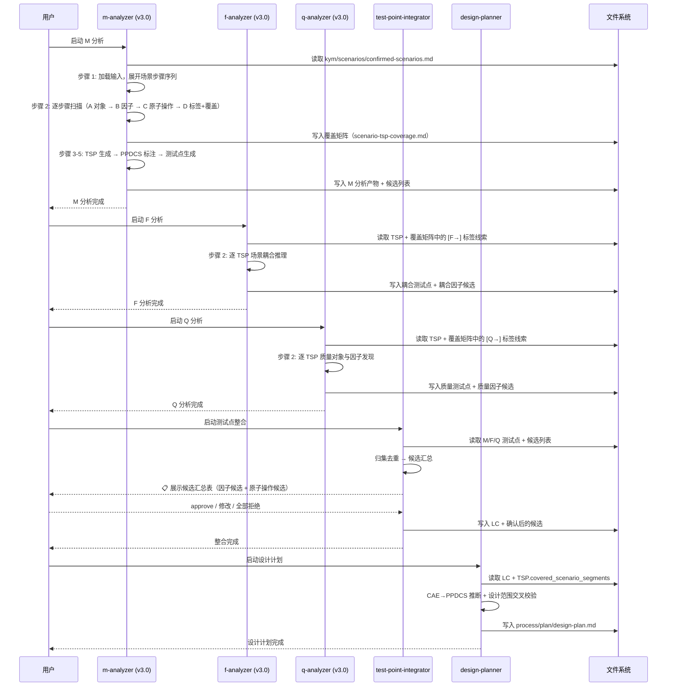

# 高层设计（HLD）：CR-012 ptm-tde MFQ 阶段改造（扩展范围）

> 基于 `mfq-analysis-step-by-step.md`（v3.0）+ REQUIREMENTS-ptm-tde.md（v7.0）+ USE-CASES-ptm-tde.md（v2.2）输出。
> 由 meta-po（代 hld-designer）在 solution-design 阶段生成。
> HLD 必须先通过 CP3 自动预检（`process/checks/CP3-HLD-CONSISTENCY-CR-012.md`），再经 CP3 人工确认（`checkpoints/CP3-HLD-REVIEW-CR-012.md`）后，方可进入 Story 拆解阶段。

---

## 修订记录

| 版本 | 日期 | 修订人 | 变更要点 |
|---|---|---|---|
| 1.0 | 2026-06-02 | meta-po（代 hld-designer） | 初始 HLD，覆盖 CR-012 扩展范围全部 7 项工作：路径迁移、M/F/Q v3.0 重写、候选汇总、Gate 增强、上下游适配 |
| 1.1 | 2026-06-02 | meta-po（代 hld-designer） | 补充 AGA-05（GATE-3 硬停止机制）、NFR 路径写入前置校验、候选汇总硬停止规则、确认选项视觉区分。来源于上一阶段测试发现的问题（GATE 自放行、目录漂移、自问自答等 8 项）的预防性设计 |
| 1.2 | 2026-06-03 | meta-po | 修正 M 分析器步骤数措辞：HLD 原写作"10 步"，实际实现为 7 步（含 4 子步骤），步骤 8-10（候选汇总）移至 test-point-integrator（与 AGA-01 决策一致）。同步修正 §1、§3、§4、§6、§8、§9 中的引用 |

---

## 1. 问题定义

### 问题陈述

当前 ptm-tde 的 MFQ 阶段（M/F/Q 三个分析器 + test-point-integrator + design-planner）存在三个问题：

1. **路径陈旧**：5 个 Skill 全部硬编码 `analysis/` 路径前缀，与 CR-010 建立的三阶段目录结构（`kym/` / `mfq/` / `ppdcs/`）不一致。用户读取 Skill 文档时会看到不存在的路径，造成困惑。
2. **方法论停留在 v2**：M 分析器仍是"逐模块功能分析"模式（7 步），缺少场景步骤驱动的逐步发现、测试对象关联度评估、因子/原子操作的"已有 vs 候选"区分、Scenario-TSP 覆盖矩阵等关键机制。F/Q 分析器也未建立 TSP 驱动的分析模式。
3. **缺乏候选汇总机制**：M/F/Q 分析各自发现的新因子和新原子操作分散在三处产出中，没有统一的候选汇总和用户批量确认流程，导致用户在三个独立环节重复做确认。

### 核心价值

- **一致性**：路径与三阶段框架对齐，用户不会看到过时路径
- **方法论升级**：场景步骤驱动 + TSP 驱动 + 候选区分，使分析过程更系统化、可追溯
- **效率提升**：候选批量确认替代逐项分散确认，减少用户中断次数

### 目标

| 优先级 | 目标 | 度量方式 |
|--------|------|---------|
| P0 | 5 个 Skill 路径全部迁移到新目录结构，旧路径零残留 | `grep -rn "analysis/" skills/{m,f,q}-analyzer/ skills/test-point-integrator/ skills/design-planner/` 返回 0 |
| P0 | M 分析器升级到 v3.0 方法论（7 步 + 4 子步骤，场景步骤驱动） | 13 项验收标准全部 PASS |
| P0 | M 分析器升级到 v3.0 方法论（7 步 + 4 子步骤，场景步骤驱动） | 13 项验收标准全部 PASS |
| P0 | F/Q 分析器改为逐 TSP 驱动模式 | 各 Skill 验收标准 PASS |
| P1 | 建立候选汇总与用户批量确认流程 | 候选汇总表格式清晰，确认选项完备 |
| P1 | MFQ Exit Gate 自检项编号统一为 M1-M7 + W1-W2 | gate-spec.md + checkpoint-manager SKILL.md 一致 |

### 成功标准

- [ ] 旧路径 `analysis/` 在 5 个 MFQ Skill 中零残留
- [ ] M 分析器 7 步完整（含 4 子步骤），输出覆盖矩阵 + 步骤标签 + 候选列表
- [ ] F 分析器 9 步流程完整，逐 TSP 驱动，消费 [F→] 标签
- [ ] Q 分析器 6 步流程完整，逐 TSP 驱动，消费 [Q→] 标签
- [ ] test-point-integrator 和 design-planner 适配新数据格式
- [ ] GATE-3 Checklist 使用 M1-M7 + W1-W2 编号

### 约束

| 类型 | 约束内容 |
|------|---------|
| 技术 | Claude Code Skill 文件格式（Markdown + YAML frontmatter），不涉及 Python/脚本修改 |
| 业务 | 方法论升级必须保持与 KYM 阶段（CR-011）和 PPDCS 阶段（CR-013）的接口兼容 |
| 资源 | meta-self-dev 模式，由 meta-po 编排子 agent 实施 |

### 非目标（Out of Scope）

- PPDCS 阶段的路径迁移和方法论升级（由 CR-013 处理）
- KYM 阶段的修改（CR-011 已完成）
- 公共因子库内容扩充（仅更新引用路径）
- Python 脚本或 MCP 服务开发
- 安装脚本更新

### 关键假设

- CR-010 建立的 `kym/` / `mfq/` / `ppdcs/` 三阶段目录结构已稳定
- gate-spec.md 的 GATE-3 MFQ Exit Gate 框架已就绪（CR-010 产出）
- CR-011 完成的 KYM 阶段 Skill（`kym` 和更新后的 `feature-parser`、`scenario-discovery`）输出格式不变
- 设计文档 `mfq-analysis-step-by-step.md` v3.0 的方法论已经用户审阅确认

### 缺失信息

| 优先级 | 缺失信息 | 影响范围 | 决策所需时限 |
|--------|---------|---------|------------|
| BLOCKING | 候选汇总功能是独立 Skill 还是内嵌到现有 Skill | §9 模块职责、Story 分解 | CP3 人工确认前 |
| REQUIRED | F/Q 分析器的 v3.0 步骤数是否严格按设计文档（F=9步, Q=6步）还是根据现有骨架调整 | §11 关键流程 | CP3 讨论中 |

---

## 2. 架构灰区与方案形成记录

> HLD 正式成文前必须先完成 Architecture Gray Areas 与 advisor discussion。

**CP3 讨论日志**：`process/discussions/CP3-HLD-DISCUSSION-LOG-CR-012.md`
**CP3 讨论恢复点**：`process/checks/CP3-DISCUSSION-CHECKPOINT-CR-012.json`

### Architecture Gray Areas

| 灰区 ID | 关键问题 | 为什么会影响架构 | 影响面 | 推荐讨论顺序 | canonical refs | 状态 |
|---|---|---|---|---|---|---|
| AGA-01 | 候选汇总功能：独立 Skill（candidate-integrator）vs 内嵌到 test-point-integrator | 影响模块边界、Skill 注册表、上下游消费链路、触发词设计 | 模块 / 文档 / 验证 | 1 | REQ-011 / 设计文档 §6 | selected: 方案 B（内嵌） |
| AGA-02 | M/F/Q 分析器重写策略：全量替换现有 SKILL.md vs 增量追加新步骤 | 影响实施风险、回退成本、Git 历史可读性 | 范围 / 模块 / 回退 | 2 | 当前 SKILL.md 结构完整（357/314/257 行） | selected: 方案 A（全量重写） |
| AGA-03 | 覆盖矩阵的存储格式与传递机制：独立 Markdown 文件 vs 嵌入 TSP YAML | 影响 test-point-integrator 和 coverage-checker 的消费方式 | 数据 / 验证 / 模块 | 3 | 设计文档 §2.3 实体 H / data-flow-spec.md | selected: 方案 A（独立文件） |
| AGA-04 | 步骤标签 [M]/[F→]/[Q→] 的传递方式：嵌入覆盖矩阵 vs 独立标签文件 | 影响 F/Q 分析器的启动步骤（加载线索的来源） | 数据 / 模块 | 4 | 设计文档 §2.3 实体 G | selected: 方案 A（嵌入覆盖矩阵） |
| AGA-05 | GATE-3 MFQ Exit Gate 的硬停止机制：Agent 可能自检后自行判定"全部通过"而跳过人工确认，如何防止？ | 影响 GATE-3 是否真正起到人工门控作用。无硬停止则 GATE-3 形同虚设，MFQ 阶段产物质量无法保证 | 安全 / 验证 / 模块（gate-spec + checkpoint-manager） | 5 | 上一阶段测试发现：GATE-2 自放行 + kym 自问自答（8 项问题 #1 #2） | selected: 方案 A（⛔ HARD-STOP） |

### Advisor Table

#### AGA-01：候选汇总的实现方式

| Option | Pros | Cons | Impact Surface | Recommendation | Assumptions / When to switch |
|---|---|---|---|---|---|
| A: 独立 Skill（candidate-integrator） | 职责单一，可独立演进；触发词独立，用户可单独调用 | 新增 1 个 Skill 维护成本；增加 Skill 注册表和 skill-references 条目；M/F/Q 三个分析器都需要向它输出候选 | 模块（+1 Skill）/ 文档（README + skill-references）/ 验证（+1 验收目标） | 不推荐 | 假设候选汇总逻辑足够复杂，值得独立维护。当候选汇总超过 50 行独立逻辑时切换 |
| **B: 内嵌到 test-point-integrator**（推荐） | 候选汇总与测试点归集天然关联；不新增 Skill；减少用户认知负担 | test-point-integrator 职责略微膨胀（+30 行） | 模块（test-point-integrator 增加 1 个步骤）/ 文档（无需新增注册） | **推荐** | 候选汇总逻辑 ≤ 50 行，可以内嵌。当逻辑膨胀到需要独立触发词时切换 |

#### AGA-02：M/F/Q 分析器重写策略

| Option | Pros | Cons | Impact Surface | Recommendation | Assumptions / When to switch |
|---|---|---|---|---|---|
| **A: 全量重写**（推荐） | 方法论完整一致；无新旧混杂导致的矛盾；Git diff 清晰（旧→新） | 实施风险较高（一次错误可能丢失旧版优点）；回退需要整体 revert | 范围（5 个 Skill 全文）/ 回退（整体 revert） | **推荐** | 当前 Skill 的 Gotchas、验收标准、前置条件等稳定章节可以复用。当发现旧版有不可替代的细节时，保留并融入新版 |
| B: 增量追加 | 风险低，保留验证过的旧版内容；每个步骤独立可测 | 可能出现新旧方法论矛盾的灰色区域；步骤编号不连续（如旧步骤 3 与新步骤 2b 并列）；维护者难以理解执行顺序 | 范围（5 个 Skill 部分章节）/ 维护（认知负担高） | 不推荐 | 仅当旧版 Skill 有大量未记录在设计文档中的隐性知识时考虑。当前设计文档 v3.0 已足够详细 |

#### AGA-03：覆盖矩阵的存储格式

| Option | Pros | Cons | Impact Surface | Recommendation | Assumptions / When to switch |
|---|---|---|---|---|---|
| **A: 独立 Markdown 文件**（推荐） | 人类可读；可独立版本控制；下游 Skill 可直接 grep/读取；与现有 `test-points.md` 等产出格式一致 | 需要明确的文件路径约定；下游 Skill 需要知道文件位置 | 数据（+1 文件）/ 模块（M 分析器生产，test-point-integrator + F/Q 消费） | **推荐** | 路径约定：`mfq/m-analysis/scenario-tsp-coverage.md` |
| B: 嵌入 TSP YAML | TSP 和覆盖信息在同一位置；减少文件碎片 | YAML 不适合展示双视角矩阵；下游消费需要 YAML 解析而非 Markdown 阅读 | 数据（TSP 格式变化）/ 模块（所有 TSP 消费者受影响） | 不推荐 | 仅当需要程序化消费覆盖矩阵而不需要人类阅读时考虑 |

#### AGA-04：步骤标签的传递方式

| Option | Pros | Cons | Impact Surface | Recommendation | Assumptions / When to switch |
|---|---|---|---|---|---|
| **A: 嵌入覆盖矩阵**（推荐） | 单一文件包含覆盖状态 + 标签；F/Q 分析器读取一个文件即可获得全部线索；设计文档 §2.3 已定义此格式 | 覆盖矩阵文件稍大（每个步骤一行） | 数据（覆盖矩阵末尾的 F/Q 线索汇总表）/ 模块（F/Q 分析器步骤 1） | **推荐** | 假设场景总数和步骤数在合理范围内（≤100 步骤） |
| B: 独立标签文件 | 标签与覆盖信息解耦；F/Q 可以只读取自己需要的部分 | 增加一个文件；需要维护覆盖矩阵和标签文件的一致性 | 数据（+1 文件）/ 验证（一致性检查） | 不推荐 | 仅当标签数量很大且需要独立版本控制时考虑 |

#### AGA-05：GATE-3 硬停止机制

| Option | Pros | Cons | Impact Surface | Recommendation | Assumptions / When to switch |
|---|---|---|---|---|---|
| **A: ⛔ HARD-STOP 标记 + 自检脚本校验**（推荐） | 在 gate-spec.md 和 checkpoint-manager SKILL.md 的 GATE-3 人工确认项中显式标注 `⛔ HARD-STOP：禁止 Agent 自行判定通过。必须等待用户回复 approve/修改/reject`；checkpoint-manager 自检脚本校验人工确认项是否已回填 | 需要修改 2 个文件；checkpoint-manager 脚本需要新增校验逻辑 | 安全（门控强制）/ 验证（CP3 precheck 可自动化）/ 模块（gate-spec + checkpoint-manager） | **推荐** | 假设 Agent 会遵循 SKILL.md 中的 HARD-STOP 约束。当平台 Agent 不遵循时，需要脚本层面的阻断 |
| B: 仅文档描述 | 改动量最小 | 纯文档约束无法阻止 AGI Agent 自行判定；上一阶段测试已证明 Agent 会绕过"等待用户确认" | 安全（门控弱）/ 验证（无法自动化校验） | 不推荐 | 仅当平台有原生硬中断 API 时才可接受文档级约束 |

### 方案形成输入与事后审查区分

| 类型 | 来源 | 影响的 HLD 章节 | 处理结果 | 说明 |
|---|---|---|---|---|
| 方案形成输入 | lane-architecture（meta-po 代） | §3 / §4 / §9 | adopted | AGA-01~04 全部采用推荐方案作为 HLD 设计基础 |
| 方案形成输入 | lane-product（设计文档 v3.0） | §11 / §9 | adopted | 场景步骤驱动 + TSP 驱动 + 候选汇总的设计来自设计文档 |

### Deferred Architecture Ideas

| ID | 想法 / 风险 / 扩展方向 | 来源 | 延后原因 | 触发切换或重启条件 |
|---|---|---|---|---|
| DAI-01 | 候选因子确认后自动回写到公共因子库 | AGA-01 | 公共因子库写回机制需要独立设计（涉及 CR-013 和因子库管理策略） | 因子候选数量积累到 >20 个时通过后续 CR 启动 |
| DAI-02 | 覆盖矩阵的自动化覆盖率计算脚本 | AGA-03 | 当前阶段覆盖矩阵为手动填写；自动化计算属于工具开发范围 | 覆盖矩阵行数 >100 时考虑自动化 |

---

## 3. 候选架构方案对比

### 方案 A：全量重写（推荐）

**核心思路**：以设计文档 v3.0 为蓝本，对 5 个 MFQ Skill 进行全量重写。M 分析器 7 步（含 4 子步骤），F 分析器 8→9 步，Q 分析器 5→6 步。路径一次性迁移。候选汇总（原设计文档 §6 的步骤 8-10）内嵌到 test-point-integrator。

| 维度 | 评估 |
|------|------|
| 优点 | 方法论完整一致；新旧无冲突；Skill 结构清晰，维护者能按"一个 Skill = 一个完整流程"理解；Git 历史干净 |
| 缺点 | 一次性改动量大（~600 行净增）；重写期间如果设计文档有歧义需要立即澄清 |
| 复杂度 | high |
| 实施成本 | 高（8 Stories / 4 Waves，~600 行净改动） |
| 可扩展性 | 高（v3.0 骨架预留了候选汇总、覆盖矩阵等扩展点） |
| 风险 | M 分析器重写最复杂（357→~500 行），可能遗漏旧版中未记录在设计文档中的隐性知识 |
| 适用前提 | 设计文档 v3.0 已充分覆盖所有旧版 Skill 的功能点 |

### 方案 B：增量演进

**核心思路**：保留现有 Skill 主体结构，在现有步骤中插入新子步骤（如 M 分析器步骤 2 增加子步骤 A/B/C/D），新增步骤追加到末尾。路径迁移独立进行。

| 维度 | 评估 |
|------|------|
| 优点 | 风险低；保留已验证的旧版内容；每步改动可独立验证 |
| 缺点 | 可能出现新旧方法论并存的矛盾；步骤编号可能不连续；维护者需要理解 v2→v3 的演进逻辑；长期维护成本高 |
| 复杂度 | medium |
| 实施成本 | 中（6 Stories / 3 Waves，~400 行改动） |
| 可扩展性 | 低（后续迭代继续追加会让 Skill 结构越来越难以理解） |
| 风险 | 新旧混杂导致后续 CR（如 CR-013）的接口理解出错 |
| 适用前提 | 需要旧版 Skill 中有大量隐性知识未被设计文档覆盖 |

### 方案对比矩阵

| 维度 | 方案 A（全量重写） | 方案 B（增量演进） |
|------|--------|--------|
| 实现难度 | ⭐⭐⭐ | ⭐⭐ |
| 方法论一致性 | ⭐⭐⭐ | ⭐⭐ |
| 可维护性 | ⭐⭐⭐ | ⭐ |
| 回退成本 | ⭐⭐（整体 revert） | ⭐⭐⭐（按 commit 回退） |
| 实施速度 | ⭐⭐ | ⭐⭐⭐ |
| 适配设计文档 v3.0 | ⭐⭐⭐ | ⭐⭐ |

**推荐方案**：方案 A（全量重写），理由：设计文档 v3.0 已提供逐步骤的详细处理逻辑，覆盖了旧版 Skill 的全部功能点，全量重写可以避免新旧混杂带来的长期维护问题。

---

## 4. 推荐方案总览

**复杂度模式**：`complex`

| 判定维度 | 依据 | 结论 |
|---------|------|------|
| 需求规模 | 31 条需求，其中 MFQ 相关 5 条（REQ-009~011 + REQ-030~031） | 中 |
| 涉及 Skill 数 | 5 个现有 Skill 重写 + 1 个功能内嵌 | 多（6） |
| 新增数据实体 | 2 个（覆盖矩阵 + 步骤标签） | 中 |
| Story 拆解 | 8 Stories / 4 Waves，必须分批 | 必须分批 |
| 文件冲突 | Wave A 的 012-01 和 012-02 无冲突；Wave B→C 串行 | 可控 |

**系统核心思路**：
> 以设计文档 v3.0 的"场景步骤驱动发现"模式统一替换 MFQ 阶段 5 个 Skill 的执行流程。M 分析器作为核心，逐场景步骤发现测试对象、匹配/候选因子、检查原子操作、打标签、建覆盖矩阵。F/Q 分析器从覆盖矩阵中消费标签线索，改为逐 TSP 驱动。候选汇总内嵌到 test-point-integrator 最后一步。

**关键架构风格**：管道过滤（Skill 之间通过 Markdown/YAML 文件传递数据实体）

**核心能力边界**：
- 做：M/F/Q 三个分析器的 v3.0 方法论升级；路径迁移到 `mfq/` / `kym/`；覆盖矩阵和步骤标签的生产与消费；候选汇总与批量确认；Gate 编号规范化
- 不做：Python/脚本开发；KYM 和 PPDCS 阶段修改；公共因子库内容扩充；候选自动回写

**关键依赖**：
- CR-010 产出的 `gate-spec.md`：提供 GATE-3 MFQ Exit Gate 框架
- CR-011 产出的 KYM Skill（`kym`、`feature-parser`、`scenario-discovery`）：提供场景输入（`confirmed-scenarios.md`）
- 设计文档 `mfq-analysis-step-by-step.md` v3.0：提供逐步骤处理逻辑

**适用条件**：
- CR-010 和 CR-011 均已完成（✅ 已满足）
- 设计文档 v3.0 已审阅确认（✅ 用户选择扩展范围即视为已确认）
- 候选汇总功能内嵌到 test-point-integrator（需 AGA-01 确认）

**产物形态**：
- 修改 Skill：5 个（m-analyzer, f-analyzer, q-analyzer, test-point-integrator, design-planner）
- 修改文档：3 个（gate-spec.md, checkpoint-manager SKILL.md, skill-references.md）
- 新建文件：0 个（候选汇总不独立建 Skill）
- 目标平台：Claude Code / Codex

---

## 5. 适用性矩阵

| 适用性维度 | 当前项目判断 | 推荐方案如何适配 | 不适配信号 | When to switch |
|---|---|---|---|---|
| 用户目标 | 方法论完整性优先于实施速度 | 全量重写保证 v3.0 方法论完整落地 | 用户要求快速上线、接受阶段性不一致 | 切换方案 B（增量） |
| 项目成熟度 | meta-self-dev，在已 delivered 基线上迭代 | 每个 Wave 独立可验证，失败可整体 revert | Wave 间出现不可预见的冲突 | 暂停后续 Wave，回溯 |
| 认知负担 | 维护者需要理解 v2→v3 的差异 | 全量重写后只需按一个完整流程理解 | 重写后的 Skill 超过 500 行 | 考虑拆分更细的 Skill |
| 验证条件 | grep 验证 + 文件存在性 + 格式检查 | 每个 Story 定义明确的 grep/格式验收 | 自动化验证工具不可用 | 人工逐项检查 |
| 回退成本 | Git revert 可整体回退 | 每个 Wave 独立 commit，可选择性 revert | 跨 Wave 的文件级依赖导致无法独立回退 | 合并 Wave 或改为全量单 commit |

### 优化 / 牺牲 / 切换条件

| 方案选择 | 优化了什么 | 牺牲了什么 | 接受理由 | 切换条件 |
|---|---|---|---|---|
| 方案 A（全量重写） | 方法论一致性、长期可维护性 | 实施速度、增量验证便利性 | 设计文档 v3.0 足够详细，重写风险可控 | 实施中发现设计文档有关键遗漏时切换方案 B |
| 候选汇总内嵌 | Skill 数量不膨胀、认知负担低 | test-point-integrator 职责略膨胀 | 候选汇总 ≤50 行，与测试点归集天然关联 | 候选汇总逻辑 >50 行时独立为 Skill |

---

## 6. Use Case → Architecture Traceability

| Use Case | 支撑模块 / 组件 | 关键流程 | 异常 / 失败路径 | 验证方式 | 备注 |
|---|---|---|---|---|---|
| UC-04（MFQ 分析与测试点生成） | m-analyzer → f-analyzer → q-analyzer → test-point-integrator → design-planner | M 分析 7 步（场景步骤驱动，含 4 子步骤）→ F 分析 9 步（逐 TSP 耦合）→ Q 分析 6 步（逐 TSP 质量）→ 整合为 LC + 候选汇总 → 设计计划 | M 分析中因子/原子操作全部为候选 → 标记 needs-confirmation；F 分析无耦合矩阵基线 → 仅场景推理；Q 分析维度全不相关 → 跳过 | 13 项 M 验收标准 + F/Q 各验收标准 + 全局 grep | CR-012 重点改造 |
| UC-03（场景发现与确认） | kym Skill → m-analyzer（消费 confirmed-scenarios.md） | KYM 产出场景 → M 分析步骤 1 加载 → 步骤 2 逐步骤扫描 | 场景缺少 atomic-ops → 生成原子操作候选 | M 分析步骤 1 校验场景完整性 | CR-012 只改消费路径（`kym/scenarios/`） |
| UC-05（设计计划生成） | design-planner → PPDCS 阶段 | LC → CAE→PPDCS 推断 → 设计计划 | 推断不确定 → 标记 confirmation_gaps | design-planner 适配 TSP.covered_scenario_segments | CR-012 适配，不重写 |

---

## 7. 关键场景模拟

> 至少用 2-3 个关键 UC 走通推荐架构。失败项必须先修正 HLD 或标为 BLOCKING。

| 模拟 ID | 场景 | 输入 / 前置条件 | 推荐架构执行路径 | 预期输出 | 失败 / 回退路径 | 结果 |
|---|---|---|---|---|---|---|
| SIM-01 | M 分析器 v3.0：用户启动 M 分析，场景 SCN-LOG-001 有 12 个步骤，其中 4 个纯 UI（显式排除） | `confirmed-scenarios.md` + `raw-requirements.md` + `mission-statement.md` | 步骤 1 加载 → 步骤 2 逐步骤扫描（子步骤 A 识别对象 → 子步骤 B 匹配因子 → 子步骤 C 检查原子操作 → 子步骤 D 打标签+覆盖映射）→ 步骤 3 生成 TSP → 步骤 4 PPDCS 标注 → 步骤 5 测试点生成 → 步骤 6 覆盖初检 → 步骤 7 输出 | 覆盖矩阵显示 8/8 步骤 covered（4 步骤 excluded），因子表区分"已有"和"候选"，原子操作候选列表生成 | 若步骤 1 发现场景链不完整 → 终止并提示用户先完成 KYM 阶段 | PASS |
| SIM-02 | F 分析器 v3.0：M 分析完成，覆盖矩阵中 SCN-LOG-001 Step 9 有 [F→外部] 标签 | M 分析产出（TSP 列表 + 覆盖矩阵）+ `confirmed-scenarios.md` + 耦合矩阵 Excel | 步骤 1 加载 TSP + F 线索 → 步骤 2 逐 TSP 场景耦合推理（优先展开 [F→外部] 标签）→ 步骤 3 代码依赖收集 → 步骤 4 三源合并 → 步骤 5 候选确认 → 步骤 6 耦合测试点生成 | 耦合测试点中 TSP-Mx 与外部日志服务器的交互被识别为顺序耦合，生成 CAE 测试点 | 若 [F→] 标签指向不存在的 TSP → 标记 confirmation_gap，不阻断流程 | PASS |
| SIM-03 | 候选汇总与确认：M/F/Q 分析完成，共产出 6 个因子候选 + 2 个原子操作候选 | M/F/Q 三源候选列表 | test-point-integrator 归集测试点 → 候选汇总步骤去重合并（按 factor_id）→ 展示候选汇总表 → 用户选择 approve/修改/全部拒绝 | 用户看到 2 张简洁表格（因子候选：名称+取值范围+来源；原子操作候选：名称+描述），统一确认 | 若三源中出现同名但不同取值域的因子候选 → 合并时保留差异，展示给用户决策 | PASS |

---

## 8. 系统架构图

```mermaid
graph TD
  subgraph KYM_Phase["KYM 阶段（CR-011 已完成）"]
    KYM_S["kym Skill"]
    FP_S["feature-parser"]
    SD_S["scenario-discovery"]
  end

  subgraph MFQ_Phase["MFQ 阶段（CR-012 改造目标）"]
    MA_S["m-analyzer<br/>7 步（4 子步骤）<br/>场景步骤驱动"]
    FA_S["f-analyzer<br/>8步→9步<br/>逐 TSP 驱动"]
    QA_S["q-analyzer<br/>5步→6步<br/>逐 TSP 驱动"]
    TPI_S["test-point-integrator<br/>+ 候选汇总"]
    DP_S["design-planner<br/>适配 TSP.segments"]
  end

  subgraph Data["数据实体（MFQ 阶段内部）"]
    CM["Scenario-TSP<br/>覆盖矩阵<br/>(新实体 H)"]
    ST["场景步骤标签<br/>[M]/[F→]/[Q→]<br/>(新实体 G)"]
    TSP["TSP 列表<br/>含 covered_segments"]
    TP_M["M 测试点"]
    TP_F["F 耦合测试点"]
    TP_Q["Q 质量测试点"]
    LC["逻辑用例 LC"]
    CAND["候选汇总<br/>因子候选 + 原子操作候选"]
  end

  subgraph Gates["门控"]
    G2["GATE-2<br/>KYM Exit"]
    G3["GATE-3<br/>MFQ Exit<br/>(CR-012 增强编号)"]
  end

  SD_S -->|confirmed-scenarios.md| MA_S
  KYM_S -->|mission-statement.md| MA_S
  MA_S -->|生产| CM
  MA_S -->|生产| ST
  MA_S -->|生产| TSP
  MA_S -->|生产| TP_M
  CM -->|F 线索 [F→]| FA_S
  ST -->|F 线索 [F→]| FA_S
  TSP -->|逐 TSP 驱动| FA_S
  FA_S -->|生产| TP_F
  CM -->|Q 线索 [Q→]| QA_S
  ST -->|Q 线索 [Q→]| QA_S
  TSP -->|逐 TSP 驱动| QA_S
  QA_S -->|生产| TP_Q
  TP_M --> TPI_S
  TP_F --> TPI_S
  TP_Q --> TPI_S
  CM --> TPI_S
  TPI_S -->|生产| LC
  TPI_S -->|生产| CAND
  LC --> DP_S
  TSP -->|covered_scenario_segments| DP_S
  G2 -->|通过后进入| MA_S
  MA_S --> G3
  FA_S --> G3
  QA_S --> G3
  TPI_S --> G3
  DP_S --> G3

  style MA_S fill:#ff9800,color:#fff
  style FA_S fill:#ff9800,color:#fff
  style QA_S fill:#ff9800,color:#fff
  style TPI_S fill:#ff9800,color:#fff
  style DP_S fill:#ff9800,color:#fff
  style CM fill:#4caf50,color:#fff
  style ST fill:#4caf50,color:#fff
  style CAND fill:#4caf50,color:#fff
```

---

## 9. 高层模块与职责划分

| 模块名称 | 类型 | 职责 | 输入 | 输出 | 依赖 |
|---------|------|------|------|------|------|
| m-analyzer | Skill | v3.0：场景步骤驱动的单功能分析（7 步，含 4 子步骤）。逐场景步骤发现测试对象、匹配/候选因子、检查原子操作、打标签 [M]/[F→]/[Q→]、建立 Scenario-TSP 覆盖矩阵、生成 PPDCS 标注和 CAE 测试点。候选汇总（原设计文档步骤 8-10）移至 test-point-integrator | `kym/scenarios/confirmed-scenarios.md`、`kym/mission-understanding/mission-statement.md`、`kym/feature-input/`、公共因子库、全局 atomic-ops | `mfq/m-analysis/test-points.md`、`mfq/m-analysis/ppdcs-annotation.md`、`mfq/m-analysis/test-objects-factors.md`、`mfq/m-analysis/scenario-tsp-coverage.md`（新）、`mfq/m-analysis/tsp/`、`mfq/m-analysis/candidate-factor-proposals.yaml`（新）、`mfq/m-analysis/candidate-atomic-ops.yaml`（新） | KYM 阶段 Skill、公共因子库 |
| f-analyzer | Skill | v3.0：逐 TSP 驱动的耦合分析（9 步）。消费覆盖矩阵中 [F→] 标签作为种子线索，逐 TSP 识别耦合关系、发现耦合对象/因子、三源合并、生成耦合测试点 | `mfq/m-analysis/tsp/`、`mfq/m-analysis/scenario-tsp-coverage.md`（F 线索）、`mfq/m-analysis/test-objects-factors.md`、耦合矩阵 Excel、`kym/scenarios/confirmed-scenarios.md` | `mfq/f-analysis/coupling-graph.yaml`、`mfq/f-analysis/coupling-test-points.md`、`mfq/f-analysis/tool-analysis.md`、耦合因子候选列表 | m-analyzer |
| q-analyzer | Skill | v3.0：逐 TSP 驱动的质量分析（6 步）。消费覆盖矩阵中 [Q→] 标签作为相关性的补充依据，逐 TSP 逐 HTSM 维度评估、发现质量对象/因子、生成质量测试点 | `mfq/m-analysis/tsp/`、`mfq/m-analysis/scenario-tsp-coverage.md`（Q 线索）、`mfq/m-analysis/test-objects-factors.md`、`kym/scenarios/confirmed-scenarios.md`、`kym/mission-understanding/mission-statement.md` | `mfq/q-analysis/quality-test-points.md`、`mfq/q-analysis/tool-analysis.md`、质量因子候选列表 | m-analyzer |
| test-point-integrator | Skill | v3.0：M/F/Q 测试点归集 + 覆盖检查 + LC 生成 + 拓扑绑定 + **候选汇总与用户确认**（新增） | `mfq/m-analysis/test-points.md` + `mfq/f-analysis/coupling-test-points.md` + `mfq/q-analysis/quality-test-points.md` + `mfq/m-analysis/scenario-tsp-coverage.md` + M/F/Q 候选列表 | `mfq/integration/logic-cases.md`、`mfq/integration/test-data.md`、`mfq/integration/tool-analysis.md`、`mfq/integration/coverage-matrix.md`、`mfq/candidates/factor-candidates.md`（新）、`mfq/candidates/atomic-op-candidates.md`（新） | m-analyzer, f-analyzer, q-analyzer |
| design-planner | Skill | v3.0：适配 TSP.covered_scenario_segments，交叉校验设计范围。CAE→PPDCS 推断与设计计划生成逻辑不变 | `mfq/integration/logic-cases.md`、`mfq/m-analysis/tsp/`（covered_scenario_segments）、`mfq/m-analysis/ppdcs-annotation.md` | `process/plan/design-plan.md` | test-point-integrator, m-analyzer |

**模块边界规则**：
- m-analyzer 负责生产覆盖矩阵和标签，但**不消费**它们（F/Q 分析器是消费者）
- f-analyzer 和 q-analyzer 依赖 m-analyzer 完成才能启动（消费 TSP 列表 + 覆盖矩阵）
- test-point-integrator 的候选汇总步骤消费 M/F/Q 三源的候选列表，内嵌在 integrator 最后一步，不独立为 Skill
- design-planner 输出到 `process/plan/`（跨阶段边界），不写到 `mfq/` 下

---

## 10. 技术选型与理由

| 选型类别 | 选择 | 备选方案 | 选择理由 | 风险 |
|---------|------|---------|---------|------|
| Skill 格式 | Markdown + YAML frontmatter | 纯 YAML / JSON | 与现有 ptm-tde 全部 Skill 保持一致 | 无 |
| 数据实体格式 | Markdown 表格（覆盖矩阵）+ YAML（候选列表） | 纯 YAML / JSON | Markdown 人类可读，YAML 便于程序消费和去重 | 手动维护覆盖矩阵可能格式不一致 |
| 路径约定 | `mfq/<analyzer-name>/` | 按数据实体类型分目录 | 与 CR-010 三阶段目录一致，按生产者分目录 | 无 |
| 候选汇总 | 内嵌 Markdown 表格 | 独立 YAML 文件 | 用户确认时需要人类可读格式 | 候选数量多时表格可读性下降 |
| 实施策略 | 全量重写（方案 A） | 增量追加（方案 B） | 设计文档 v3.0 足够详细 | 可能遗漏旧版隐性知识 |

---

## 11. 关键流程

### 主流程：MFQ 阶段 v3.0 端到端流程



### 扩展流程：候选全部为新的降级处理

> 当 M/F/Q 分析中某个测试点的因子全部为候选（source=new-candidate），该测试点的 fact_status 降级为 `needs-confirmation`，C 条件使用因子域引用（如 `@domain.普通`）而非具体值。在候选汇总确认前，这些测试点标记为 `[待确认]`；确认后由 test-point-integrator 回填具体取值。

### ⛔ 执行协议：硬停止规则（v1.1 新增）

> 基于上一阶段测试发现的 8 项问题（GATE 自放行、Skill 自答、目录漂移等），在 MFQ 阶段 Skill 中强制执行以下硬停止规则。

| 规则 ID | 适用场景 | 规则内容 | 违规示例 | 来源问题 |
|---------|---------|---------|---------|---------|
| STOP-01 | GATE-3 人工确认 | ⛔ HARD-STOP：禁止 Agent 在人工确认项上自行判定"通过"或"质量很高"。必须等待用户回复 `approve` / `修改: ...` / `reject`。未收到用户回复前不得推进到 PPDCS 阶段 | ❌ Agent 自检后输出"所有检查通过，进入下一阶段" | 问题 #1, #2 |
| STOP-02 | 候选汇总确认 | ⛔ HARD-STOP：禁止 Agent 自行判定候选因子/原子操作为"全部确认"。必须展示候选汇总表，等待用户选择确认选项。候选表必须使用 `( )` 单选标记区分选项 | ❌ Agent 判定"候选都合理"直接通过 | 问题 #2 |
| STOP-03 | Skill 调用链 | ⛔ HARD-STOP：禁止 Agent 绕过 Skill 直接生成 MFQ 产物（如直接输出 test-points.md）。M/F/Q 分析必须通过对应的 Skill 调用执行 | ❌ 用户说"分析策略路由" → Agent 直接输出 CAE 表格 | 问题 #3 |
| STOP-04 | 路径写入校验 | ⛔ HARD-STOP：Skill 写入产物前必须校验目标父目录存在且为目录。禁止 Agent 手动 mkdir 创建目录。目录锚点以项目根目录 README.md 为准 | ❌ Agent `mkdir -p process/kym/` 然后写入 | 问题 #5 |
| STOP-05 | 确认选项视觉区分 | 所有需要用户选择的环节，必须使用 `( )` 单选 / `[ ]` 多选 / `>>>` 开放式 三类标记区分，禁止纯数字列表 | ❌ `1. xxx 2. xxx 3. xxx` 无视觉区分 | 问题 #4 |

---

## 12. 非功能需求设计

| 质量特征 | 设计目标 | 实现手段 | 验证方式 |
|---------|---------|---------|---------|
| 可维护性 | 每个 Skill ≤ 500 行；步骤编号连续 | 全量重写保证结构清晰；M 分析器预计 ~500 行 | `wc -l` 统计 |
| 一致性 | 旧路径零残留；所有 Skill 使用统一路径前缀 | 一次性路径迁移（Wave A）；grep 验证 | `grep -rn "analysis/" skills/` 返回 0 |
| 可追溯性 | 覆盖矩阵双视角（场景→TSP + 目录→场景） | 设计文档 §2.3 格式 | 人工检查视角 A 和视角 B 数据一致性 |
| 可验证性 | 每个 Story 有明确的 grep/文件存在性验收标准 | Story 卡片中定义验收命令 | Story-level grep 验证 |
| 兼容性 | 不破坏 KYM 阶段的输出格式 | 只改 MFQ Skill 的消费路径，不改 KYM 产出 | CR-011 的 CP7 验证不受影响 |
| 易用性 | 候选汇总表简洁：因子只显示名称+取值范围+来源；确认选项使用 `( )` 单选标记区分，避免数字列表歧义 | 设计文档 §6.2 格式 + HLD v1.1 补充 | 用户确认候选汇总时可读性满足要求 |
| 安全性 | 路径写入前校验目标父目录存在且为目录（非普通文件）；禁止 Agent 手动 mkdir 创建目录；目录结构以 README.md 为锚点 | 每个 Skill 写入步骤前增加路径校验子步骤；父目录不存在或为普通文件时 fail fast | grep 检查 Skill 中是否有 `mkdir` 命令；Dry-run 写入验证 |
| 门控强制 | GATE-3 人工确认项标注 `⛔ HARD-STOP：禁止 Agent 自行判定通过。必须等待用户回复 approve/修改/reject` | gate-spec.md + checkpoint-manager SKILL.md GATE-3 章节增加 HARD-STOP 标记 | CP3 自检脚本校验人工确认稿是否已回填 |

---

## 13. 主要风险与应对

| 风险 ID | 风险描述 | 概率 | 影响 | 应对策略 | 触发信号 |
|---------|---------|------|------|---------|---------|
| R1 | M 分析器 v3.0 重写遗漏旧版中未在设计文档中记录的隐性知识 | 中 | 高 | 重写时对照旧版 SKILL.md 逐章检查；保留旧版作为参考直到 CP7 通过 | 用户发现 v3.0 缺失旧版功能 |
| R2 | F/Q 分析器的 TSP 驱动模式与现有 test-point-integrator 消费格式不兼容 | 低 | 中 | Wave D 的 STORY-012-06 专门做上下游适配；先完成 M/F/Q 重写再适配 | test-point-integrator 无法找到预期字段 |
| R3 | 8 个 Story 跨 4 个 Wave 实施周期长，中间可能被其他 CR 打断 | 低 | 低 | 每个 Wave 独立 commit，可暂停和恢复 | 用户发起新 CR 且与 CR-012 文件冲突 |
| R4 | 覆盖矩阵手动维护可能格式不一致 | 中 | 低 | 在 M 分析器 SKILL.md 中提供明确的模板和示例 | 人工验收时发现格式偏离 |
| R5 | ⛔ HARD-STOP 标记被 Agent 忽略，纯文档约束不足以阻止 AGI Agent 绕过门控 | 中 | 高 | 在 checkpoint-manager 自检脚本中增加人工确认回填校验（脚本级阻断）；在 gate-spec.md 中增加 HARD-STOP 标记（文档级约束）；双重防御 | GATE-3 人工确认稿未被回填但 Agent 继续推进 |

---

## 14. ADR 候选决策点

| ADR ID | 决策问题 | 建议决定 | 约束此决策的因素 |
|--------|---------|---------|---------------|
| ADR-012-01 | MFQ 阶段使用全量重写策略（方案 A） | 全量重写，以设计文档 v3.0 为蓝本 | 方法论一致性优先；设计文档足够详细；旧版无未记录的隐性知识 |
| ADR-012-02 | 候选汇总功能内嵌到 test-point-integrator | 内嵌，不独立建 Skill | 候选汇总 ≤50 行；与测试点归集天然关联；减少 Skill 数量 |
| ADR-012-03 | 覆盖矩阵使用独立 Markdown 文件 | 独立文件 `mfq/m-analysis/scenario-tsp-coverage.md` | 人类可读；与现有产出格式一致；下游可直接 grep/读取 |
| ADR-012-04 | 步骤标签嵌入覆盖矩阵而非独立文件 | 嵌入覆盖矩阵末尾的 F/Q 线索汇总表 | 单一文件减少碎片；F/Q 分析器一次读取即可获得全部线索 |
| ADR-012-05 | GATE-3 人工门控使用 ⛔ HARD-STOP 机制 | gate-spec.md 和 checkpoint-manager SKILL.md 的 GATE-3 人工确认项标注 HARD-STOP；checkpoint-manager 自检脚本校验人工确认稿是否已回填 | 上一阶段测试发现 Agent 会自行判定通过人工门控；纯文档约束不足以阻止 AGI Agent |

---

## 15. 分阶段落地建议

| 阶段 | 交付物 | 里程碑标志 | 前提条件 |
|------|--------|---------|---------|
| Wave A | 路径迁移（5 Skill）+ Gate 增强（2 文档） | 旧路径零残留；Gate 编号统一 | CR-010 closed |
| Wave B | M 分析器 v3.0 重写 | 12 项验收标准 PASS | Wave A 完成 |
| Wave C | F 分析器 + Q 分析器 v3.0 重写 | 各验收标准 PASS | Wave B 完成 |
| Wave D | 上下游适配 + 候选汇总 + 文档更新 | 全局 grep 验证通过；CR-012 close | Wave C 完成 |

---

## 16. 工作量粗估

| 类别 | Story 数 | 预计 Wave 数 | 粗估工作量 |
|------|---------|------------|---------|
| 路径迁移 + Gate 增强 | 2 | W1（Wave A） | S（~95 行） |
| M 分析器 v3.0 重写 | 1 | W2（Wave B） | M（~200 行） |
| F/Q 分析器 v3.0 重写 | 2 | W3（Wave C） | M（~270 行） |
| 上下游适配 + 文档 | 3 | W4（Wave D） | S-M（~110 行） |
| **合计** | **8** | **4 个 Wave** | **~675 行净改动** |

---

## 17. 待确认问题

| 问题 ID | 问题描述 | 优先级 | 影响范围 | 负责人 | 目标答复时间 |
|---------|---------|--------|---------|--------|------------|
| Q1 | 候选汇总内嵌到 test-point-integrator（方案 B），用户是否同意？ | BLOCKING | §9 模块职责、Story 分解 | 用户 | CP3 人工确认时 |
| Q2 | 全量重写策略（方案 A），用户是否同意？ | BLOCKING | §3 候选方案、§15 分阶段落地 | 用户 | CP3 人工确认时 |
| Q3 | F/Q 分析器步骤数是否严格按设计文档（F=9步, Q=6步）？当前分别是 8 步和 5 步 | REQUIRED | §9 模块职责、Story 卡片 | 用户 / 设计文档 | CP3 讨论中 |

---

## 18. HLD 自审记录

| 自审项 | 结果 | 证据 / 说明 |
|---|---|---|
| Architecture Gray Areas 已前置处理 | PASS | 5 个 AGA（v1.1 新增 AGA-05：GATE-3 硬停止），每个有 Advisor Table，推荐方案已确定 |
| Advisor table 已影响推荐方案 | PASS | AGA-01~05 的推荐方案直接决定了 §9 模块职责、§11 执行协议和 §3 方案对比 |
| 适用性矩阵完整 | PASS | §5 |
| Use Case → Architecture Traceability 完整 | PASS | §6，覆盖 UC-04/UC-03/UC-05 |
| 关键场景模拟通过 | PASS | §7，3 个 SIM 全部 PASS |
| 优化 / 牺牲 / 切换条件明确 | PASS | §5 末尾表格 |
| HLD / ADR / Risk / NFR 内部一致 | PASS | ADR-012-01~05 与 §3 推荐方案一致；R1-R4 覆盖主要风险；NFR 覆盖 8 维度（v1.1 新增安全性、门控强制）；§11 新增 STOP-01~05 执行协议 |
| 执行协议硬停止规则完整（v1.1 新增） | PASS | STOP-01~05 覆盖 GATE 门控、候选确认、Skill 调用链、路径校验、选项视觉区分 5 个维度 |

---

<!-- meta-po 填写：CP3 HLD 人工确认记录 -->
## CP3 确认记录

**CP3 自动预检结果**：`process/checks/CP3-HLD-CONSISTENCY-CR-012.md`  
**CP3 人工 checklist**：`checkpoints/CP3-HLD-REVIEW-CR-012.md`

**确认状态**：⬜ 待审核 → ✅ 已批准 / ❌ 需修改

**审核意见**：

**确认人**：
**确认时间**：
