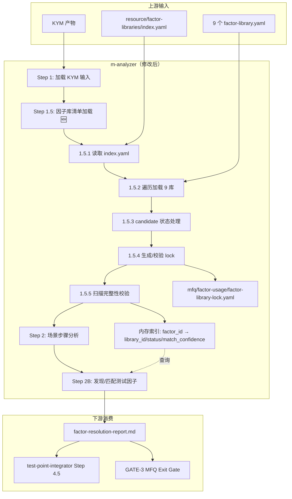
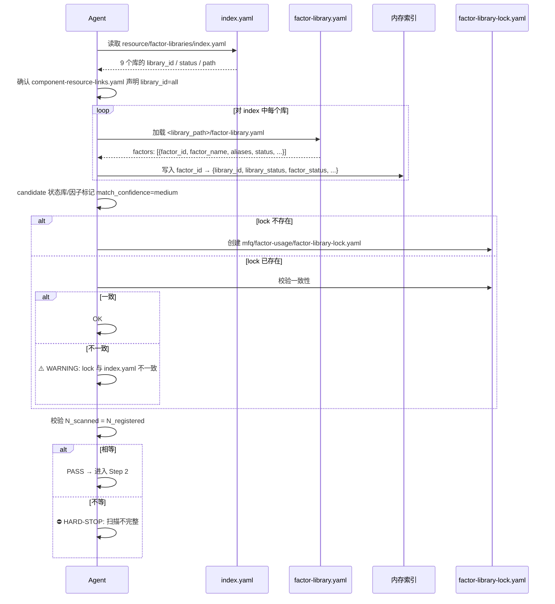

# 高层设计（HLD）：CR-017 — m-analyzer 因子库发现缺口修复

> 基于 CR-017 CR intake 文件（已 approved）+ m-analyzer v3.0 SKILL.md + test-point-integrator SKILL.md + gate-spec.md。
> 本 HLD 为 ptm-tde 主 HLD v7.1（`process/HLD-ptm-tde.md`）的配套增量设计，聚焦 m-analyzer 的因子库发现机制修复。

---

## 修订记录

| 版本 | 日期 | 修订人 | 变更要点 |
|---|---|---|---|
| 1.0 | 2026-06-06 | meta-se（hld-designer Skill） | 初始 HLD，覆盖问题定义、架构灰区、候选方案、推荐方案和 CP3 输入 |

---

## 1. 问题定义

### 问题陈述

m-analyzer v3.0 的公共因子库补充契约（SKILL.md §公共因子库补充契约 第 496-505 行）明确声明"提取测试因子前必须读取公共库"，但实际流程中**没有任何库发现机制**。Agent 被指向 `resource/factor-libraries/` 目录，但从未被告知需读取 `index.yaml` 来发现已注册的 9 个库，也未被告知需遍历所有子目录加载 `factor-library.yaml`。

**量化影响**：
- 9 个已安装因子库（1 active + 8 candidate），实际仅扫描了 **2 个**（22%）
- 35 个候选因子中 **18 个**（51%）与已有库重复
- `component-resource-links.yaml` 明确声明 `library_id: all`、`install_policy: required`，但消费端未实现"全量消费"

### 四层根因

| 层 | 根因 | 缺失点 |
|---|------|--------|
| 规范层 | 无库发现指令 | m-analyzer SKILL.md 全文零次提到 `index.yaml` |
| 架构层 | lock 文件缺失无回退 | 契约说"读取 lock 或选择库"，但"选择库"三字无定义 |
| 实现层 | 子目录枚举缺失 | Agent 未被指令遍历子目录加载 `factor-library.yaml` |
| 语义层 | candidate 状态被隐性排除 | 匹配规则只认 `active` 因子，8 个库 115 个因子均为 `candidate` |

### 核心价值

- 消除 18 个重复候选因子，m-analyzer 输出精度从 49%（17/35 真正新因子）提升到 >90%
- 下游 test-point-integrator 不再被大量假阳性候选淹没
- 为 CR-016（atomic-ops 发现）提供可复用 Step 1.5 资源发现设计模式

### 目标

| 优先级 | 目标 | 度量方式 |
|--------|------|---------|
| P0 | m-analyzer 能发现全部已注册因子库 | 扫描库数 = index.yaml 注册库数 |
| P0 | candidate 状态因子可匹配但置信度分级 | match_confidence=medium 的因子下游需显式确认 |
| P1 | 生成/校验 factor-library-lock.yaml | lock 文件存在且与 index.yaml 库版本一致 |
| P2 | GATE-3 新增因子库扫描完整性检查 | 自检自动通过或显式阻断 |

### 成功标准

- [ ] m-analyzer 运行后 `factor-resolution-report.md` 显示扫描库数 = 9
- [ ] `ngfw-ipv4-route` / `ngfw-dfx` / `ngfw-load-balance` 等 7 个未扫描库的因子被加载到内存索引
- [ ] 18 个重复候选因子不再生成，source 从 `new-candidate` 变为 `public-library`
- [ ] candidate 状态因子正确标记 `match_confidence=medium`
- [ ] 真正的新候选因子仍正常生成
- [ ] `factor-library-lock.yaml` 不存在时自动创建

### 约束

| 类型 | 约束内容 |
|------|---------|
| 技术 | 纯 SKILL.md 指令修改，不涉及代码开发；不修改任何 Python 脚本 |
| 业务 | 不修改现有因子库文件（`resource/factor-libraries/*/factor-library.yaml`） |
| 资源 | 不修改 index.yaml 中的库状态（active/candidate 由库 owner 管理） |

### 非目标（Out of Scope）

- 不修改因子库的 `candidate → active` 升级流程
- 不实现因子库定期同步机制（后续台账 T-01，P2 candidate）
- 不修改 `match_confidence` 在下游 test-point-integrator / PC 生成中的显式处理（后续台账 T-02，P2 candidate）
- 不涉及 atomic-ops CLI 集成（CR-016 范围）

### 关键假设

- `resource/factor-libraries/index.yaml` 是因子库注册的真相源
- `component-resource-links.yaml` 中 `library_id: all` 意图不变
- 9 个因子库的 `factor-library.yaml` 格式一致，可按统一 Schema 解析

### 缺失信息

| 优先级 | 缺失信息 | 影响范围 | 决策所需时限 |
|--------|---------|---------|------------|
| REQUIRED | 用户是否计划未来增加更多因子库（>9）？ | 影响是否需要按 domain 按需过滤（当前设计全量加载 <200 因子，可忽略性能） | CP3 人工确认前 |
| OPTIONAL | `index.yaml` 格式是否会变更（新增字段等）？ | 影响 Step 1.5 的解析健壮性设计 | 不阻塞，后续 CR 适配 |

---

## 2. 架构灰区与方案形成记录

> 本 CR 为增量修改，灰区聚焦在插入新步骤与现有流程的衔接点。Advisor 讨论由 meta-se 在 hld-designer 中完成（inline mode，单角色分析）。

**CP3 讨论日志**：`process/discussions/CP3-HLD-DISCUSSION-LOG-CR-017.md`
**CP3 讨论恢复点**：`process/checks/CP3-DISCUSSION-CHECKPOINT-CR-017.json`

### Architecture Gray Areas

| 灰区 ID | 关键问题 | 为什么会影响架构 | 影响面 | 推荐讨论顺序 | canonical refs | 状态 |
|---|---|---|---|---|---|---|
| AGA-01 | Step 1.5 插入位置：在 Step 1 之后、Step 2 之前，是否与 CR-016 的 atomic-ops 发现步骤冲突？ | CR-016 也需要一个类似的"资源清单加载"步骤（atomic-ops CLI 查询）。两者共享设计模式但加载不同资源。Step 1.5 的命名和结构需要为 CR-016 留出扩展点 | 模块 / 验证 | 1 | CR-017 §改进方案详述 / CR-016 §执行时间线 | proposed |
| AGA-02 | candidate 状态因子匹配后，Step 2B 的 source 字段如何区分"active 命中"和"candidate 命中"？ | 现有匹配规则只有命中/未命中二元判断。引入 match_confidence 字段需要 Step 2B 的子步骤输出格式变更 | 数据 / 下游消费 | 2 | CR-017 §Decision Brief CR017-DQ-02 / m-analyzer Step 2B | resolved（CR intake 已决定） |
| AGA-03 | factor-library-lock.yaml 首次生成 vs 后续校验的策略 | 首次运行时 lock 不存在需要创建；再次运行时 lock 已存在，需校验一致性。不一致时的处理策略（WARNING 继续 vs HARD-STOP）影响鲁棒性 | 验证 / 模块 | 3 | m-analyzer §公共因子库补充契约 line 498 | proposed |
| AGA-04 | test-point-integrator 的因子库反查（GATE-3 交叉验证）是在 Step 4.5 候选汇总之前还是之后执行？ | 反查结果可能影响候选汇总的优先级判定——若发现候选实际已在公共库中存在，应降级或移除 | 下游消费 / 验证 | 4 | CR-017 §修改文件清单 P1 / test-point-integrator Step 4.5 | proposed |

### Advisor Table

| Option | Pros | Cons | Impact Surface | Recommendation | Assumptions / When to switch |
|---|---|---|---|---|---|
| AGA-01: Step 1.5 命名 `因子库清单加载`，内部分为 1.5.1 读取库索引 + 1.5.2 遍历加载 + 1.5.3 candidate 处理 + 1.5.4 锁文件 + 1.5.5 完整性校验。CR-016 在此之后插入 Step 1.6 `原子操作清单加载` | 清晰的分步结构；CR-016 可直接复用 1.5 的模式并追加 atomic-ops 查询 | Step 编号从 7 个变为 8 个（+Step 1.5），极轻微增加认知负担 | 模块（m-analyzer 流程编排）/ 验证（Step 编号引用更新） | **推荐**：与 CR-016 的用户决策（加权分词重叠）和 CR-017 的 CR intake 决策一致 | Step 1.5 产出内存索引供 Step 2B/2C 使用；若未来有第三种资源需加载，插入 Step 1.7 |
| AGA-01 备选: 在 Step 2 内部叠加发现逻辑，不独立成步 | 不增加步骤数 | 因子库发现和原子操作发现混在 Step 2 开头，与 CR-016 耦合更紧，职责不清 | 模块 / 验证 | 不推荐：与已决策的"CR-017 先于 CR-016"顺序矛盾 | 仅当 CR-017 和 CR-016 合并为一个 CR 时考虑（已被 CR intake reject） |
| AGA-03: Lock 首次创建 + 变更 WARNING（不阻断） | 不阻断正常流程；lock 变更时有可见提示 | 可能忽略 lock 变更，导致跨会话因子库版本漂移未被发现 | 验证 | **推荐**：lock 是辅助校验工具，不应成为阻断点 | index.yaml checksum 机制成熟后可升级为 HARD-STOP |
| AGA-03 备选: Lock 变更 HARD-STOP | 确保版本一致性 | 因子库自身版本号暂为 0.1.0 且 checksum=pending，HARD-STOP 过于激进 | 验证 / 安全 | 不推荐：当前因子库成熟度不足以支撑严格锁校验 | 当所有库 version ≥ 1.0 且 checksum 非 pending 时切换 |
| AGA-04: 反查在候选汇总之前（Step 4.5.1.5 新增） | 在用户看到候选列表之前已完成去重，减少人工确认负担 | 增加 integrator 的 Step 4.5 执行时间 | 下游消费 / 验证 | **推荐**：反查结果影响优先级判定，应在去重合并之前完成 | 假设因子库内存索引可由 integrator 独立重建，或由 m-analyzer 透传 resolution-report |
| AGA-04 备选: 反查在候选汇总之后 | 不改变现有 Step 4.5 结构 | 用户先看到未去重的候选列表，再做反查修正，需要两轮交互 | 用户体验 | 不推荐：增加用户交互轮次，效率低 | — |

### 方案形成输入与事后审查区分

| 类型 | 来源 | 影响的 HLD 章节 | 处理结果 | 说明 |
|---|---|---|---|---|
| 方案形成输入 | CR-017 CR intake Decision Brief | §1 / §3 / §4 | adopted | CR017-DQ-01/02/03 已由用户 approved，直接作为设计输入 |
| 方案形成输入 | atomic-ops CLI 验证结果 | §1 约束 | adopted | P0+P1 已完成，CR-016 无阻塞，不影响 CR-017 独立推进 |
| 方案形成输入 | CR-016 共享设计模式 | §3 / §4.1 | adopted | Step 1.5 命名和结构为 CR-016 Step 1.6 留出扩展点 |

### Deferred Architecture Ideas

| ID | 想法 / 风险 / 扩展方向 | 来源 | 延后原因 | 触发切换或重启条件 |
|---|---|---|---|---|
| DAI-01 | 因子库定期同步机制（类似 `atomic-ops sync`） | CR-017 后续台账 T-01 | 当前库为静态快照，同步机制涉及仓库管理策略 | 当因子库数量 > 20 或跨团队维护时重启 |
| DAI-02 | match_confidence 在下游的显式处理 UI | CR-017 后续台账 T-02 | 当前仅在 m-analyzer 层面标记置信度，下游消费 UI 留待反馈驱动 | 用户反馈 medium 置信度项过多（>30% 候选总量）时启动 |
| DAI-03 | 按 domain 按需过滤因子库（而非全量加载） | 性能优化 | 当前 9 个库 <200 因子，全量加载可忽略 | 因子库数 > 20 或单库 > 500 因子时重启 |

---

## 3. 候选架构方案对比

### 方案 A：Step 1.5 因子库清单加载 + match_confidence 分级 + lock 文件（推荐）

**核心思路**：在 Step 1（加载 KYM 输入）和 Step 2（场景步骤分析）之间插入完整的因子库发现步骤。读取 index.yaml → 遍历全部 9 个库 → 加载 factor-library.yaml → 构建 factor_id → {library_id, status, ...} 内存索引。Step 2B 匹配时区分 active/candidate 置信度。首次运行自动生成 lock 文件，再次运行校验一致性并 WARNING。

| 维度 | 评估 |
|------|------|
| 优点 | ① 独立步骤职责清晰，CR-016 可复用模式插入 Step 1.6；② match_confidence 分级保留候选因子可发现性同时控制假阳性；③ lock 文件对齐契约声明（factor-library-lock.yaml） |
| 缺点 | ① Step 编号从 7 变为 8，跨文档引用需同步更新；② 全量加载 9 个库增加 m-analyzer 执行时间（<1 秒可忽略） |
| 复杂度 | low（纯指令修改，~60 行 SKILL.md 新增） |
| 实施成本 | 1 Story（M tier），修改 3 个文件（m-analyzer + test-point-integrator + gate-spec） |
| 可扩展性 | 高：Step 1.5 是通用资源发现模式，CR-016 追加 Step 1.6 即可 |
| 风险 | candidate 因子未经充分验证被大规模复用（缓解：match_confidence=medium 标记 + 下游显式确认） |
| 适用前提 | index.yaml 格式稳定；所有注册库的 factor-library.yaml 可解析 |

### 方案 B：最小修复 — 仅修正因子库查找路径描述

**核心思路**：不新增步骤，仅修改 Step 2B 的"查找顺序"描述——把当前的三层路径回退（`PTM_TEAM_RESOURCE_HOME/factor-libraries → ~/.ptm-team/resource/factor-libraries → resource/factor-libraries`）替换为明确的"读取 index.yaml → 遍历所有库 → 加载"指令。不引入 match_confidence 分级，不生成 lock 文件。

| 维度 | 评估 |
|------|------|
| 优点 | ① 修改量极小（~10 行）；② 不改变 Step 编号；③ 不增加 lock 文件管理负担 |
| 缺点 | ① 不解决 candidate 状态匹配问题——即使加载了 8 个 candidate 库，匹配规则仍只认 active 因子；② 缺少 lock 文件使"扫描完整性"无法自证；③ 为 CR-016 铺路程度有限 |
| 复杂度 | low |
| 实施成本 | ~10 行修改 |
| 可扩展性 | 低：CR-016 仍需独立设计资源发现步骤 |
| 风险 | 实际效果有限：加载了库但因匹配规则限制，大部分 candidate 因子仍无法命中 |
| 适用前提 | 用户接受"仅解决加载问题，不解决匹配问题"的折中 |

### 方案对比矩阵

| 维度 | 方案 A（推荐） | 方案 B（最小修复） |
|------|--------|--------|
| 实现难度 | ⭐⭐ | ⭐ |
| 修复完整度 | ⭐⭐⭐⭐⭐ | ⭐⭐ |
| 可维护性 | ⭐⭐⭐⭐ | ⭐⭐ |
| 可扩展性（为 CR-016 铺路） | ⭐⭐⭐⭐⭐ | ⭐⭐ |
| 向下兼容 | ✅（新逻辑是旧逻辑的超集） | ✅ |
| 适配 CR intake 决策 | ✅ 全部 3 项 DQ | ⚠️ DQ-02（match_confidence）未兑现 |

**推荐方案**：**方案 A**，理由：与 CR intake 已 approved 的 3 项决策完全一致，修复完整度高，为 CR-016 提供可复用设计模式，实施成本仍为 low-medium。

---

## 4. 推荐方案总览

**复杂度模式**：`standard`（3 文件、跨 Skill 协调、gate-spec 修改、新机制引入）

| 判定维度 | 依据 | 结论 |
|---------|------|------|
| 需求规模 | 1 个核心功能修改 + 2 个联动修改 | 小 |
| 角色数量 | 2 个 Skill + 1 个规范文档 | 少 |
| 状态流转 | Step 1.5 线性插入，无分支 | 简单 |
| 平台适配 | 纯 SKILL.md 指令修改 | 不适用 |
| Story 拆解 | 1 Story（M tier），1 Wave | 不须分批 |

**系统核心思路**：
> 在 m-analyzer 的 Step 1（加载 KYM 输入）和 Step 2（场景步骤分析）之间插入"因子库清单加载"步骤，通过读取 `index.yaml` 发现全部已注册因子库、遍历加载各库 `factor-library.yaml`、构建内存索引，使 Step 2B 的因子匹配能覆盖全部 9 个库。同时引入 `match_confidence` 分级（active→high / candidate→medium），在可发现性与需确认之间取得平衡。

**关键架构风格**：管道-过滤器增强（在现有 7 步线性管道中插入 1 个新步骤，不改变管道结构）

**核心能力边界**：
- 做：发现全部已注册因子库、candidate 因子可匹配但置信度分级、生成并校验 lock 文件、GATE-3 新增扫描完整性检查
- 不做：修改因子库文件内容、修改库升级流程、修改 factor-usage 目录结构、实现因子库同步

**关键依赖**：
- `resource/factor-libraries/index.yaml`：库注册真相源（静态文件，已就位）
- `resource/component-resource-links.yaml`：声明全量消费意图（已就位）
- 各库 `factor-library.yaml`：因子定义数据（9 个库均已就位）

**适用条件**：
- 适合当前项目成熟度（因子库 v0.1.x，index.yaml 格式稳定）
- 适合当前验证资源（通过 m-analyzer 运行后手动检查 factor-resolution-report.md 即可验证）
- 不适用条件：若 index.yaml 格式发生破坏性变更，需适配 Step 1.5 解析逻辑

**产物形态**：
- Agent 数量：0（不新增 Agent）
- Skill 数量：0（不新增 Skill，修改现有 2 个 Skill）
- 工具脚本：0
- 目标平台：Claude Code（不涉及跨平台适配）

### 与 ptm-tde 主 HLD 的关系

本 HLD 是 `process/HLD-ptm-tde.md` v7.1 的配套增量设计：
- 修改模块：m-analyzer（M 分析器）的 Step 1.5 + Step 2B
- 联动模块：test-point-integrator（Step 4.5 候选汇总前新增因子库反查）
- 规范更新：gate-spec.md（GATE-3 Checklist 新增 M8：因子库扫描完整性）
- 不改变主 HLD 中的架构图、模块边界、MFQ 三阶段流程
- ADR 新增 1 条（candidate 状态因子 match_confidence 分级策略），不修改已有 ADR

---

## 5. 适用性矩阵

| 适用性维度 | 当前项目判断 | 推荐方案如何适配 | 不适配信号 | When to switch |
|---|---|---|---|---|
| 用户目标 | 提升 M 分析精度，减少假阳性候选 | 方案 A 完整解决 | 若用户决定不启用 candidate 库 | 切换到方案 B（最小修复） |
| 项目成熟度 | 因子库 v0.1.x，checksum=pending | Lock 变更 WARNING 不阻断 | 因子库 ≥v1.0 后 | 可升级为 HARD-STOP |
| 认知负担 | m-analyzer SKILL.md 已 550+ 行 | Step 1.5 ~60 行，5 个子步骤清晰 | SKILL.md > 800 行 | 考虑抽取"资源加载"为独立子 Skill |
| 验证条件 | 通过运行 m-analyzer 检查 factor-resolution-report.md | 扫描库数 = index.yaml 注册数即可验证 | index.yaml 不可读 | 回退现有行为 + 输出 WARNING |
| 回退成本 | 回退仅需将 SKILL.md 恢复到 CR-017 前版本 | 低，git revert | — | — |

### 优化 / 牺牲 / 切换条件

| 方案选择 | 优化了什么 | 牺牲了什么 | 接受理由 | 切换条件 |
|---|---|---|---|---|
| 方案 A（推荐） | 因子发现完整度（9/9 库）、候选精度（消除 18 个假阳性） | 极轻微增加 m-analyzer 步骤数（7→8）和 SKILL.md 行数（+60） | value >> cost；同时为 CR-016 铺路 | 若用户后续反馈"太多 medium 置信度干扰"，可调整匹配阈值 |
| 方案 B（最小修复） | 修改量最小 | 不解决 candidate 匹配问题，不兑现 CR intake DQ-02 | 仅在用户改变决策的场景下 | — |

---

## 6. Use Case → Architecture Traceability

| Use Case | 支撑模块 | 关键流程 | 异常 / 失败路径 | 验证方式 | 备注 |
|---|---|---|---|---|---|
| UC-01：首次运行 m-analyzer（无 lock 文件） | m-analyzer Step 1.5 | Step 1 → Step 1.5（读取 index.yaml → 遍历 9 库 → 构建索引 → 创建 lock） → Step 2 | index.yaml 不可读 → 硬错误阻断 | 运行 m-analyzer 检查 factor-library-lock.yaml 已创建 | 主要场景 |
| UC-02：再次运行 m-analyzer（lock 已存在） | m-analyzer Step 1.5 | Step 1 → Step 1.5（校验 lock 一致性 → WARNING if 不一致 → 使用现有索引） → Step 2 | lock 校验不一致 → WARNING，继续 | 修改 index.yaml（模拟不一致）后运行，检查 WARNING | 边界场景 |
| UC-03：test-point-integrator 候选汇总（因子库反查） | test-point-integrator Step 4.5 | 读取候选列表 → 重建因子库索引 → 反查去重 → 调整优先级 → 用户确认 | candidate 库因子全未命中 → 与当前行为一致 | 构造含假阳性候选的测试项目，验证反查后候选列表减少 | 联动场景 |
| UC-04：GATE-3 扫描完整性检查 | gate-spec.md GATE-3 Checklist M8 | checkpoint-manager 读取 factor-resolution-report.md → 校验 N_scanned = N_registered | 不相等 → Hard Stop | 运行 checkpoint-manager GATE-3，检查 M8 自检结果 | 门控场景 |

---

## 7. 关键场景模拟

| 模拟 ID | 场景 | 输入 / 前置条件 | 推荐架构执行路径 | 预期输出 | 失败 / 回退路径 | 结果 |
|---|---|---|---|---|---|---|
| SIM-01 | 首次 m-analyzer 运行，9 个库就位 | KYM 产出完整，index.yaml 注册 9 个库（1 active + 8 candidate），lock 不存在 | Step 1 → Step 1.5.1（读 index.yaml，确认 9 个库）→ Step 1.5.2（遍历加载 9 个 factor-library.yaml）→ Step 1.5.3（标记 candidate 库）→ Step 1.5.4（创建 lock，N_scanned=9）→ Step 1.5.5（完整性校验 PASS：9=9）→ Step 2 | factor-resolution-report.md 显示 N_scanned=9；FAC-CAND-001 命中 ngfw-ipv4-route 的 FAC-RT-NEXT-HOP，source=public-library, match_confidence=medium | index.yaml 缺失 → 硬错误阻断："未找到 resource/factor-libraries/index.yaml，无法加载因子库" | PASS |
| SIM-02 | 候选因子命中 candidate 状态库 | KYM 产出涉及"下一跳类型"因子（FAC-CAND-001），ngfw-ipv4-route 库 status=candidate，含 FAC-RT-NEXT-HOP | Step 2B：候选因子"下一跳类型"在内存索引中匹配到 FAC-RT-NEXT-HOP（factor_status=candidate）→ 标记 source=public-library, match_confidence=medium → 不再生成 FAC-CAND-001 | candidate-factor-proposals.yaml 中无 FAC-CAND-001；factor-resolution-report.md 记录命中细节 | 若用户不接受 medium 置信度，可通过调整阈值或切换为"candidate 不匹配"策略 | PASS |
| SIM-03 | test-point-integrator 反查去重 | m-analyzer 产出含 5 个候选因子，其中 2 个实际在 candidate 库中存在 | integrator Step 4.5.1.5：重建索引 → 反查 5 个候选 → 发现 2 个命中 → 降级提示 → 候选汇总表为 3 个（非 5 个） | 用户看到的候选确认列表减少 2 项 | integrator 无法重建索引（index.yaml 不可读）→ Warning 并跳过反查，展示全部 5 个候选 | PASS |

---

## 8. 系统架构图

> 本 CR 不改变 ptm-tde 主架构。仅展示 m-analyzer 内部 Step 变更和数据流。



---

## 9. 高层模块与职责划分

| 模块名称 | 类型 | 职责 | 输入 | 输出 | 依赖 |
|---------|------|------|------|------|------|
| m-analyzer Step 1.5（新增） | Skill 步骤 | 发现全部已注册因子库，加载因子元数据，构建内存索引，管理 lock 文件 | `resource/factor-libraries/index.yaml` + 各库 `factor-library.yaml` | 内存索引 + `factor-library-lock.yaml` + 扫描完整性校验结果 | index.yaml 格式稳定性 |
| m-analyzer Step 2B（修改） | Skill 步骤 | 在内存索引中匹配候选因子，区分 active/candidate 置信度 | Step 1.5 内存索引 + Step 2A 候选因子列表 | 已有因子表（含 match_confidence）+ 因子候选列表 | Step 1.5 内存索引可用 |
| test-point-integrator Step 4.5.1.5（新增） | Skill 子步骤 | 候选汇总前去重——用因子库索引反查候选因子，已存在者降级/移除 | 候选列表 + index.yaml + factor-library.yaml | 去重后的候选汇总表 | m-analyzer factor-resolution-report 或独立重建索引 |
| gate-spec.md GATE-3 M8（新增） | 规范 | 检查 m-analyzer 扫描的库数是否等于 index.yaml 注册库数 | factor-resolution-report.md（N_scanned 字段） | PASS / FAIL（不等则阻断） | checkpoint-manager 执行 GATE-3 自检 |

**模块边界规则**：
- Step 1.5 只负责库发现和索引构建，不做因子匹配（匹配属于 Step 2B 职责）
- test-point-integrator 的反查只做去重和降级提示，不自行修改 factor_status（库归属由库 owner 管理）
- GATE-3 M8 只检查数量一致性，不检查因子语义质量（语义检查属于人工确认项）

---

## 10. 技术选型与理由

| 选型类别 | 选择 | 备选方案 | 选择理由 | 风险 |
|---------|------|---------|---------|------|
| 实现方式 | SKILL.md 指令新增 | Python 脚本 | 纯指令修改即可实现，不增加维护复杂度；Agent 可直接执行 YAML 解析和内存索引构建 | 依赖 Agent 的 YAML 解析能力（Claude 已验证可正确处理） |
| 索引结构 | 内存字典 factor_id → {library_id, library_status, factor_status, factor_group, ...} | 独立索引文件 | 内存索引足够（<200 因子），不需持久化；lock 文件已提供版本追踪 | 无 |
| match_confidence 粒度 | 2 级（high / medium） | 3 级（high / medium / low） | 当前 binary 区分（active/candidate）足够，增加 low 需额外决策标准 | 若未来新增更多库状态（如 deprecated），需扩展 |
| lock 校验策略 | WARNING 不阻断 | HARD-STOP | 因子库 v0.1.x 版本不稳定，阻断过于激进 | 生产化后需升级为 HARD-STOP |

---

## 11. 关键流程

### 主流程：m-analyzer Step 1.5 因子库清单加载



### 扩展流程：test-point-integrator 因子库反查

```
Step 4.5.1.5（新增）：因子库反查去重

1. 重建因子库索引（复用 m-analyzer Step 1.5 逻辑，或直接读取 factor-resolution-report.md）
2. 对每个候选因子：
   a. 在索引中按 factor_id / factor_name / aliases 检索
   b. 命中 → 标记 "已在公共库中存在"（library_id + factor_id），降级为 removable / low-priority
   c. 未命中 → 保留为候选
3. 输出反查结果表：哪些候选是真正的全新因子，哪些是扫描遗漏的已有因子
4. 继续现有 Step 4.5.2 去重合并流程
```

---

## 12. 非功能需求设计

| 质量特征 | 设计目标 | 实现手段 | 验证方式 |
|---------|---------|---------|---------|
| 可靠性 | index.yaml 不可读或格式错误时不崩溃 | Step 1.5.1 前置校验 → 硬错误阻断，输出明确错误信息 | 删除 index.yaml 后运行 m-analyzer |
| 可靠性 | 个别库 factor-library.yaml 解析失败不影响整体 | 逐库 try/catch，失败库跳过 + WARNING，不影响其他库 | 损坏一个库的 YAML 后运行 m-analyzer |
| 性能 | 全量 9 库加载 < 1 秒 | 纯内存操作，<200 因子 | 目视确认无延迟 |
| 可维护性 | 新增指令不超过 60 行 | 5 个子步骤清晰分段，每个子步骤职责单一 | 行数统计 |
| 向下兼容 | 不破坏现有 m-analyzer 流程 | 新逻辑是旧逻辑的超集（多扫 7 个库） | 回归测试通过 |

---

## 13. 主要风险与应对

| 风险 ID | 风险描述 | 概率 | 影响 | 应对策略 | 触发信号 |
|---------|---------|------|------|---------|---------|
| R1 | candidate 因子未经充分验证被大规模复用 | 中 | 中 | match_confidence=medium 标记 + 下游显式确认；用户可调整阈值 | 用户反馈 medium 置信度导致错误测试点 |
| R2 | index.yaml 格式变更导致 Step 1.5 解析失败 | 低 | 高 | Step 1.5.1 显式校验 index.yaml 结构；失败时阻断并提示 | index.yaml schema_version 变化 |
| R3 | 个别库的 factor-library.yaml 格式不一致 | 低 | 低 | 逐库解析，失败跳过并 WARNING；不影响其他库 | 特定库加载失败 |
| R4 | Step 1.5 增加 Agent token 消耗 | 低 | 低 | 内存索引紧凑（<200 条目），非全量文本输出 | 单次运行 token 消耗 > 预计 |
| R5 | 与 CR-016 Step 1.6 的文件修改冲突 | 低 | 低 | 修改不同区域（Step 1.5+2B vs Step 1.6+2C），顺序推进 | 合并冲突 |

---

## 14. ADR 候选决策点

| ADR ID | 决策问题 | 建议决定 | 约束此决策的因素 |
|--------|---------|---------|---------------|
| ADR-CR-017-01 | candidate 状态因子的 match_confidence 分级策略 | 使用 2 级置信度（active→high / candidate→medium），而非 1 级（不区分）或 3 级（增加 low） | ① CR intake DQ-02 已 approved；② 2 级足够表达 active/candidate 区分；③ 3 级需额外定义 low 的判定标准 |
| ADR-CR-017-02 | factor-library-lock.yaml 首次运行自动创建 vs 要求用户手动创建 | 首次运行自动创建，后续运行校验不一致时 WARNING 不阻断 | ① CR intake DQ-01 无外部依赖要求；② 自动创建降低使用门槛；③ 当前因子库 v0.1.x，严格 lock 阻断过早 |
| ADR-CR-017-03 | 扫描不完整（N_scanned < N_registered）的处理策略 | **HARD-STOP 阻断**，不等同于 N 为 0（index.yaml 不可读） | ① 因子库数量完整是 M 分析质量的基础保证；② 与 GATE-1 #3（atomic-ops 可用性检查）的硬停止原则一致 |

---

## 15. 分阶段落地建议

| 阶段 | 交付物 | 里程碑标志 | 前提条件 |
|------|--------|---------|---------|
| Phase 2（HLD）| 本 HLD 通过 CP3 人工确认 | CP3 approved | CR-017 CR intake approved ✅ |
| Phase 3（LLD）| 1 Story LLD 通过 CP5 | Story LLD 14 章节完整，CP5 自动预检 PASS | HLD approved |
| Phase 4（实施）| m-analyzer + test-point-integrator + gate-spec 修改完成 | CP6 + CP7 PASS | LLD approved |
| Phase 5（交付）| CP8 交付就绪 | CR-017 closed | CP6 + CP7 PASS |

---

## 16. 工作量粗估

| 类别 | Story 数 | 预计 Wave 数 | 粗估工作量 |
|------|---------|------------|---------|
| m-analyzer Step 1.5 + Step 2B 修改 | 1（M tier） | 1 | M（~60 行新增 + ~15 行修改） |
| test-point-integrator Step 4.5.1.5 反查 | 含在上述 Story | 1 | S（~25 行新增） |
| gate-spec.md GATE-3 M8 | 含在上述 Story | 1 | S（~8 行新增） |
| **合计** | **1 Story** | **1 Wave** | **M（~108 行净增）** |

> CR-016 在此之后推进，其 Step 1.6（atomic-ops 清单加载）复用本 CR 的 Step 1.5 设计模式。

---

## 17. 待确认问题

| 问题 ID | 问题描述 | 优先级 | 影响范围 | 负责人 | 目标答复时间 |
|---------|---------|--------|---------|--------|------------|
| Q1 | 是否接受"首次运行自动创建 lock 文件，后续不一致时 WARNING"的策略？还是要求 lock 变更时 HARD-STOP？ | REQUIRED | Step 1.5.4 锁文件行为 | user | CP3 人工确认前 |
| Q2 | 是否接受"match_confidence=medium 的因子在下游 test-point-integrator 候选汇总时仍展示但降级提示"？还是希望 medium 因子与 high 因子无区别对待？ | REQUIRED | test-point-integrator 候选汇总 UI | user | CP3 人工确认前 |
| Q3 | 是否需要在此 CR 中同时处理 `factor-library-lock.yaml` 的生成路径（`mfq/factor-usage/`）创建逻辑？当前目录由前序 Skill 或用户手动创建 | REQUIRED | 实施细节 | user | LLD 阶段前 |

---

## 18. HLD 自审记录

| 自审项 | 结果 | 证据 / 说明 |
|---|---|---|
| Architecture Gray Areas 已前置处理 | PASS | 4 个 AGA 全部完成 advisor table 分析（§2） |
| Advisor table 已影响推荐方案 | PASS | AGA-01/03/04 的推荐项直接映射到推荐方案 |
| 适用性矩阵完整 | PASS | §5 |
| Use Case → Architecture Traceability 完整 | PASS | 4 个 UC 全部追溯到具体模块和流程（§6） |
| 关键场景模拟通过 | PASS | 3 个 SIM 全部 PASS，覆盖主流程/边界/联动（§7） |
| 优化 / 牺牲 / 切换条件明确 | PASS | §5 末尾 |
| HLD / ADR / Risk / NFR 内部一致 | PASS | 3 个 ADR ↔ §13 风险应对 ↔ §4 推荐方案无矛盾 |
| 与 ptm-tde 主 HLD 无冲突 | PASS | §4「与 ptm-tde 主 HLD 的关系」确认不改变主架构 |
| 拆分信号评估 | N/A | 1 Story，<5 Story，1 产物（m-analyzer 增量），不触发任何拆分信号 |

---

<!-- meta-po 填写：CP3 HLD 人工确认记录 -->
## CP3 确认记录

**CP3 自动预检结果**：`process/checks/CP3-HLD-CONSISTENCY-CR-017.md`
**CP3 人工 checklist**：`checkpoints/CP3-HLD-REVIEW-CR-017.md`

**确认状态**：⬜ 待审核 → ✅ 已批准 / ❌ 需修改

**审核意见**：

**确认人**：
**确认时间**：
