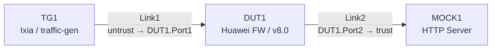
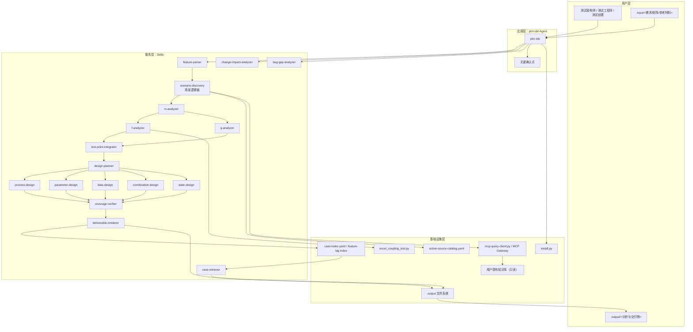
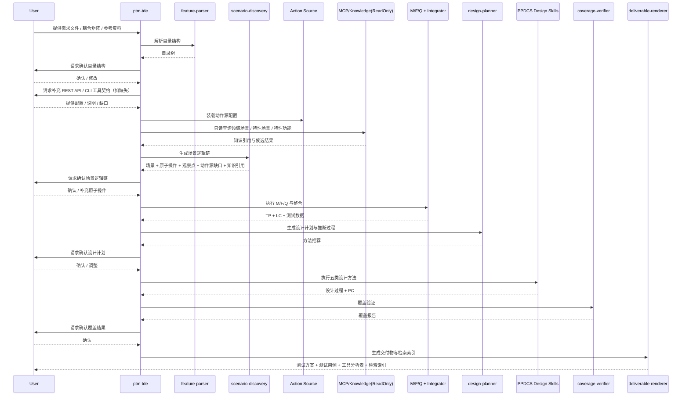
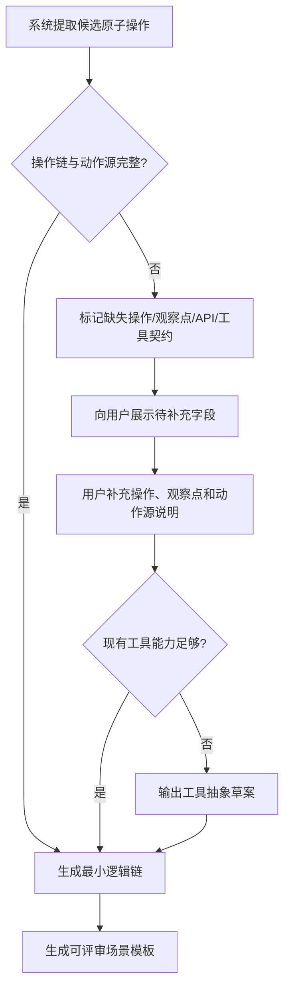
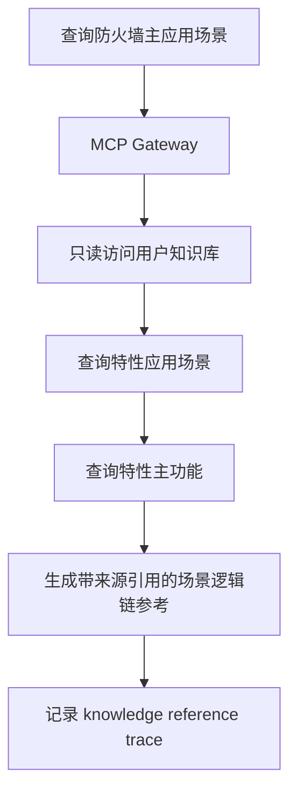
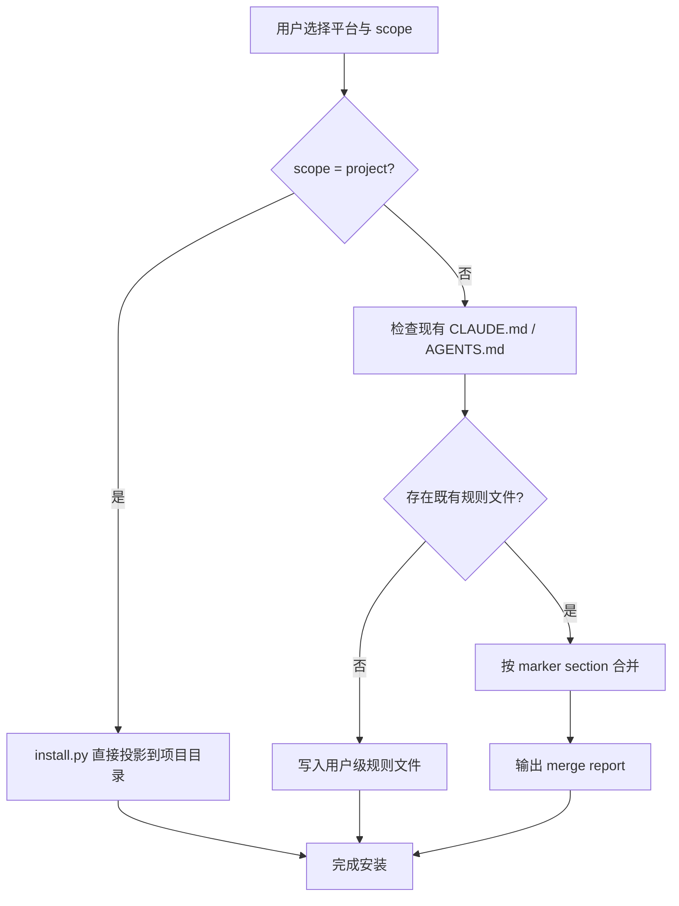
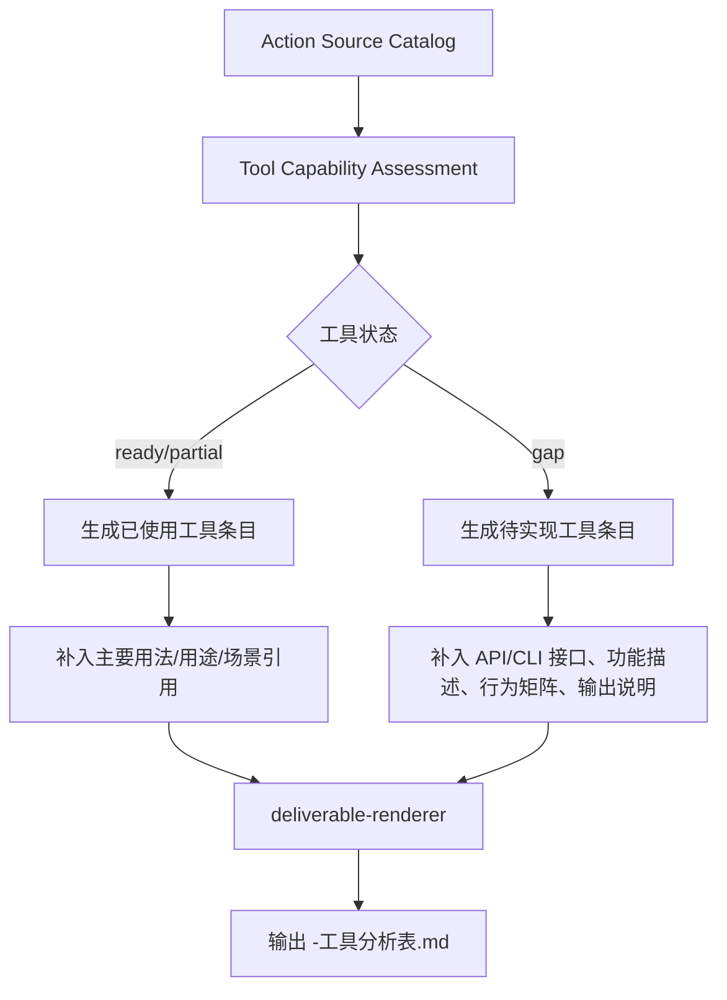

# 高层设计 v7.1：ptm-tde 测试用例设计 Agent

> **版本说明（v7.1，CR-008）**：在 v7.0 基础上以**最小变动**方式增量刷新，仅新增"场景组网建模（Topology Modeling）"小节与必要的追踪链补白：
> - 新增 §3.7 **场景组网建模**：Topology / Device / Port / Link 四级对象模型，固化 DUT / TG / MOCK / Switch 四类设备 kind 的属性矩阵、命名编号规则、Mermaid+YAML 同源双出规范、校验规则与确认产物清单；
> - 在 §6.1 场景逻辑链模型中新增 `topology_ref` 字段，在 §6.4 追踪链中补入 Topology 节点，在 §6.3 外部动作源模型中显式约束 `target` 必须可解析到 `DUT<n>` 或 `DUT<n>.Port<n>`；
> - 在 §8.2 场景逻辑链与动作源补充流程中补入"组网图确认"子环节，明确 Mermaid + YAML + 三张清单表为场景确认的必备产物；
> - 在 §13 分阶段落地建议中预埋 Topology 相关 Story 候选（模板、scenario-discovery 契约扩展、可选校验器、USE-CASES 组网样例）。
>
> **本次刷新不改动任何未受影响章节与既有设计对象**；REQ-028 已在 `REQUIREMENTS.md` / `USE-CASES.md` 同步落地，并由既有 STORY-03 / STORY-08 吸收最小必要增量。

> **版本说明（v7.0）**：v7 在 v6 的基础上，重点补入"工具分析表"正式交付模型，并进一步细化工具抽象粒度；当前设计边界为：  
> 1. 应用场景升级为**原子操作 - 观察点 - 最小逻辑链**模型；  
> 2. PPDCS 五类设计方法统一输出**完整分析过程**；  
> 3. 用例检索收敛为**需求 / 逻辑用例 / 功能分类标签**三类索引入口；  
> 4. 原子操作来源扩展为**用户提供的 REST API 配置 + CLI 化工具接口**；  
> 5. Claude Code / Codex 安装统一纳入 **project scope / user scope** 设计，并补入全局规则文件合并策略；  
> 6. 知识链路收敛为**只读 MCP 分阶段查询**，暂不承担知识入库、索引维护和知识写回；  
> 7. 最终交付件新增**工具分析表**，统一渲染"已使用工具 / 动作源"和"待实现工具 / 工具抽象"。

---

## 1. 问题定义

### 1.1 问题陈述

现有 ptm-tde 虽已具备 MFQ&PPDCS 分析和用例设计框架，但在当前目标下仍存在六类核心不足：

1. **平台目标过宽**：当前设计同时覆盖多个平台，但当前用户明确只需要 Claude Code 和 Codex 两个平台，继续保留额外平台会稀释设计和实现重点。
2. **应用场景粒度不足**：现有“原理 / 使用路径 / 测试数据叠加”三层结构仍偏概括，无法直接支撑“逻辑用例步骤”写作，缺少原子操作、观察点与状态变化链。
3. **设计过程可审计性不足**：PPDCS 五类方法虽已输出设计结果，但分析过程还不够完整，无法稳定回答“为什么是这个图 / 这组范围 / 这套组合策略”。
4. **缺少检索闭环**：产出测试方案和测试用例后，用户仍难以按需求、功能点或逻辑用例快速反查已有用例资产。
5. **外部动作源和知识边界尚不清晰**：当前设计没有把“用户提供的 REST API 配置 / CLI 工具能力”作为正式输入，也没有明确知识库只读查询边界，导致场景逻辑链、工具抽象和知识引用容易混在一起。
6. **工具分析交付物缺失**：现有设计虽然已有 Action Source 和 Tool Gap，但缺少面向交付评审的统一工具分析表，无法清楚回答“当前用到了哪些已有工具”以及“还需要实现哪些工具与接口”。

### 1.2 目标

| ID | 目标 | 度量方式 | 来源 |
|---|---|---|---|
| G1 | 支持 Claude Code 和 Codex 两个平台的安装与运行，并覆盖 project / user 两种安装范围 | 安装 dry-run 通过，project scope 可直接落地，user scope 具备明确合并策略 | REQ-001 |
| G2 | 将应用场景升级为可直接指导逻辑用例写作的逻辑链模型 | 每个场景都包含原子操作、观察点和最小逻辑路径 | REQ-005 ~ REQ-007 |
| G3 | 完成 M/F/Q 到 PPDCS 设计的完整追踪链 | `SR → Scenario Chain → Action Source → TP(CAE) → LC → PC` 可双向回链 | REQ-009 ~ REQ-019 |
| G4 | 五类 PPDCS 设计都输出完整分析过程 | 每种方法均具备图/表/范围/策略/数据分配 | REQ-012 ~ REQ-017 |
| G5 | 提供轻量用例检索能力 | 可按需求编号、逻辑用例编号和功能分类标签检索 | REQ-022 |
| G6 | 保持增量变更和问题单回溯能力 | 仅更新受影响资产，不改无关资产 | REQ-020 / REQ-021 |
| G7 | 建立只读知识引用与分阶段知识查询能力 | 能查询领域场景、特性场景和主功能，并保留来源与更新时间 | REQ-023 ~ REQ-025 |
| G8 | 在交付阶段输出可审阅的工具分析表 | 同时说明已使用工具和待实现工具的接口、用途、行为与适用场景 | REQ-026 / REQ-027 |

### 1.3 硬约束

| ID | 约束 | 类型 | 影响范围 |
|---|---|---|---|
| C1 | 仅支持 Claude Code 与 Codex | 平台 | 安装器、平台投影、验证范围 |
| C2 | 运行时必须遵守读 `.input/`、写 `.output/` 的目录隔离规则 | 安全 / 运行时 | 全部生成路径 |
| C3 | F 分析首版继续采用 Excel 基线 + 内存图模型，不引入 Neo4j | 技术 | F 分析数据底座 |
| C4 | MCP 需要与用户已搭建的知识库联合实现，但当前仅支持**只读查询契约**，不承担知识入库、远端索引维护或写回 | 技术 | 场景发现、知识引用、MCP 接口 |
| C5 | 当前试点领域仍以华为防火墙为主 | 业务 | 场景语义、耦合样例、设计示例 |
| C6 | 外部动作源需显式建模：REST API 由用户提供配置，测试工具需提供 CLI 化接口说明；不完整时必须触发补充或工具抽象 | 技术 | 场景发现、原子操作建模、工具抽象 |
| C7 | 最终交付必须区分“已使用工具”和“待实现工具”，且两者都要保留场景引用和接口/行为说明 | 交付 | renderer、工具分析表、设计评审 |

### 1.4 非目标

- 不实现自动化测试脚本生成
- 不实现测试执行调度、结果管理与缺陷生命周期管理
- 不做非防火墙领域的全面适配
- 不承担外部知识库的知识入库、远端索引维护或知识写回
### 1.5 关键假设

| ID | 假设 | 若不成立的影响 | 对策 |
|---|---|---|---|
| A1 | 被测特性的关键行为能被抽象为“原子操作 + 观察点 + 状态变化” | 场景无法稳定落成逻辑链 | 增加显式补充机制，由用户补齐操作和观察点 |
| A2 | 逻辑用例可由“最小逻辑链 + 测试数据叠加”逐步扩展 | 场景与用例会再次脱节 | 将最小逻辑链纳入场景和设计计划的共同输入 |
| A3 | 用例检索首版可依赖结构化字段过滤，无需引入全文搜索和复杂排序 | 检索结果噪声偏大 | 在交付环节强制产出需求编号、逻辑用例编号、功能分类标签和追踪索引 |
| A4 | 用户现有知识库已具备基础数据，可通过 MCP 接口完成只读查询联调 | 若接口能力不足，则知识引用链路无法按 HLD 落地 | 在 Story 阶段先实现统一只读契约与失败显式暴露策略 |
| A5 | 用户能够提供 REST API 配置、已有工具能力或 CLI 接口描述 | 原子操作无法稳定映射为可执行动作源 | 将缺口显式固化为工具抽象草案，由用户评审补齐 |
| A6 | 已使用工具和待实现工具都可以回链到场景链、测试对象/因子和交付物 | 工具分析表会沦为静态说明，无法支撑评审与后续变更影响分析 | 在动作源、工具 gap 和 renderer 三层统一保留 `scenario_refs / action_source_refs / factor_refs` |

### 1.6 已确认的补充约束

| ID | 已确认约束 | 级别 | 当前处理 |
|---|---|---|---|
| M1 | REST API 由用户提供配置；已有测试工具由用户提供接口与能力说明，需按 CLI 方式抽象 | medium | 作为场景链建模的正式输入；若缺失则触发补充或输出工具抽象草案 |
| M2 | Claude Code / Codex 的安装均由 `install.py` 托管，需兼容 project / user 两种安装范围 | medium | 架构保持“canonical source + installer projection”，并为 user scope 设计规则文件合并策略 |
| M3 | 检索不做复杂排序，仅保留需求、逻辑用例、功能分类标签三类检索入口 | low | HLD 中将检索模型和交付物索引字段收敛为轻量结构 |
| M4 | 知识库当前仅做只读查询，不承担知识入库、远端索引维护或写回 | high | 删除知识治理中的入库链路，保留 staged query + 来源引用 + 失败显式暴露 |
| M5 | 最终交付需新增工具分析表，并对已使用工具与待实现工具分别输出用途、接口、行为和适用场景 | high | 在 HLD 中新增工具分析模型，并由 renderer 统一渲染为正式交付件 |

---

## 2. HLD 拆分评估

### 2.1 判定信号检查

| 信号 | 结论 | 说明 |
|---|---|---|
| 核心产物 > 1 | 否 | 当前唯一核心产物仍是 `ptm-tde` Agent |
| 职责跨层 | 否 | 本次只设计 ptm-tde 自身，不涉及新的全局治理机制 |
| Story 数量超阈 | 是（预期） | 但 Story 将围绕同一 Agent 与同一数据模型展开 |
| ADR 明显分簇 | 否 | 场景逻辑链、知识引用、设计过程、检索能力共用同一追踪链和同一知识引用模型 |
| 交付顺序可独立 | 否 | 场景模板、知识引用、PPDCS 设计、检索索引强耦合，不能单独上线 |
| 评审者分派差异大 | 否 | 同一批评审者即可覆盖场景、设计、平台和交付 |

### 2.2 结论

**保持单份 HLD，不拆分。**

理由：

1. 当前所有变化都围绕同一核心产物 `ptm-tde` Agent。
2. “场景逻辑链模型”“动作源模型”“知识引用模型”“PPDCS 设计过程”“用例检索索引”共享同一条追踪链。
3. 若拆开，会造成场景模型、知识引用模型、设计模型和检索模型之间的大量双向引用。

---

## 3. 候选方案对比

### 3.1 方案总览

| 维度 | 方案 A（推荐）：单 Agent + 只读知识引用 + 动作源契约建模 + 独立检索 Skill | 方案 B：单 Agent + 宽检索 + 本地知识索引治理 |
|---|---|---|
| Agent 数量 | 1 | 1 |
| Skill 数量 | 17（新增 `case-retriever`） | 16（不新增 Skill） |
| 场景模型 | 原子操作 / 观察点 / 最小逻辑链 / 数据叠加 | 仅在场景文档中增强模板 |
| 动作源建模 | REST API 配置 + CLI 工具契约 + 工具抽象草案 | 默认从文档中隐式推断，不建正式契约 |
| 工具分析交付 | 独立工具分析表，区分已使用工具与待实现工具 | 工具信息散落在动作源目录与抽象草案中 |
| 知识治理 | 只读 staged query + 来源引用 | 本地知识索引 + 入库/刷新链路 |
| 检索实现 | 独立索引 + 轻量标签检索入口 | 扩展到关键字 / 全文 / 排序策略 |
| 结构清晰度 | 高 | 中 |
| 演进灵活性 | 高 | 低 |
| 初始实现成本 | 中 | 高 |
| 对用户可见性 | 强，用户可显式补充 API / 工具契约并使用轻量检索 | 中，知识和检索边界都更模糊 |

### 3.2 方案 A：单 Agent + 只读知识引用 + 动作源契约建模 + 独立检索 Skill（推荐）

**核心思路**：

1. 保持单 Agent 编排结构不变。
2. 升级 `scenario-discovery` 输出模型，使其产出“最小逻辑用例链”。
3. 把 **REST API 配置 / CLI 工具接口 / 工具方法说明** 作为正式动作源输入，纳入场景链建模。
4. `scenario-discovery` 采用 read-only staged query：领域场景 → 特性场景 → 特性功能。
5. 保持五类 PPDCS Skill 分工，但补全完整分析过程输出。
6. 新增 `case-retriever` 作为独立 Skill，消费轻量检索索引。
7. 在 `deliverable-renderer` 中统一渲染“工具分析表”，消费现有工具汇总和工具抽象草案。

**优点**：

- 场景、测试点、逻辑用例、物理用例和检索索引之间的边界清晰；
- 外部动作源、知识引用和场景链之间的关系清晰，可联合用户现有知识库推进 MCP 开发；
- 用户可以显式使用“用例检索”能力；
- 对“已有工具不支持当前特性测试”的场景有明确的工具抽象出口。
- 交付阶段可直接向评审者说明“当前依赖哪些工具、还缺哪些工具和接口”。

**缺点**：

- Skill 数量从 16 增至 17；
- user scope 的规则文件合并策略需要额外设计和验证。
- 交付层需要额外维护工具分析表的结构化字段和渲染模板。

### 3.3 方案 B：单 Agent + 宽检索 + 本地知识索引治理

**核心思路**：

1. 继续维护本地知识索引和入库/刷新链路。
2. 检索范围扩展为关键字、全文和排序策略。
3. 不把 REST API / 工具契约单独建模，主要依赖文本推断和交付层补充说明。

**优点**：

- 对复杂知识检索和全文检索更开放；
- 如果后续要做 RAG 类能力，结构上更接近。

**缺点**：

- 超出当前用户明确边界，知识入库和复杂检索都会造成过度设计；
- 工具契约未显式建模时，原子操作容易停留在“文本描述”而无法落成可执行接口；
- 实现和评审成本都更高。

---

### 3.7 场景组网建模（Topology Modeling，CR-008 新增）

> 定位：Topology 是**场景模型的子结构**，在场景发现阶段即固化为正式设计对象，作为 Scenario Chain / Action Source / 工具分析表 / PPDCS-State 建模的公共锚点。本节新增，不改动既有章节中的设计对象。

#### 3.7.1 对象模型（四级结构）

| 层级 | 对象 | 关键字段 | 说明 |
|---|---|---|---|
| L0 | `Topology` | `topology_id` / `scene_id` / `description` / `devices[]` / `links[]` / `review_status` | 一张组网图的顶层容器，归属某个 `scene_id` |
| L1 | `Device` | `device_id`（如 `DUT1`）/ `kind` / `display_name` / `attrs{}` / `ports[]` | 网元节点，`kind` ∈ {`DUT`, `TG`, `MOCK`, `Switch`} |
| L2 | `Port` | `port_id`（如 `DUT1.Port1`）/ `type` / `ip` / `vlan` / `zone` / `rate` / `state` | 每个设备含 1 个或多个端口；`state` 字段作为 PPDCS-State 的建模锚点 |
| L3 | `Link` | `link_id`（如 `Link1`）/ `endpoints[2]` / `media` / `bandwidth` | 两端点恰好各 1 个 Port，全局唯一 |

#### 3.7.2 设备 kind 枚举与属性矩阵

| kind | 角色语义 | 必填属性 | 可选属性 | 端口约束 |
|---|---|---|---|---|
| `DUT` | 被测防火墙 | `vendor` / `model` / `version` / `mgmt_ip` / `zone_map` | `ha_role` / `license` | **≥2 Port**（至少一进一出） |
| `TG` | 流量发生器 | `tool` / `mode` / `profile_ref` | `throughput` / `session_scale` | ≥1 Port |
| `MOCK` | 服务端/客户端模拟器 | `side`（`server`/`client`）/ `protocol` / `listen_port` | `payload_template` / `tls_profile` | ≥1 Port |
| `Switch` | 交换机 | `vendor` / `vlan_list` | `stp_mode` / `trunk_ports` | ≥2 Port |

#### 3.7.3 命名与编号规则

- **设备**：`<KIND><N>`，例如 `DUT1`、`TG1`、`MOCK1`、`Switch1`。多实例场景**强制编号**；单实例允许简写（如 `DUT`），但 **HLD/交付层必须使用全称版本**（即仍写 `DUT1`）。
- **端口**：`<DeviceID>.Port<N>`，例如 `DUT1.Port1`、`DUT1.Port2`。
- **链路**：`Link<N>`，全局唯一，不按设备分桶。
- **唯一性**：`device_id` / `port_id` / `link_id` 在同一 `topology_id` 内全局唯一。

#### 3.7.4 可视化规范（Mermaid + YAML 同源双出）

- **L1 逻辑拓扑**：以 Mermaid `flowchart` 呈现设备与链路的逻辑连接关系，**必出**。
- **YAML 结构化**：与 Mermaid 同源双出，作为校验器与下游追踪链的唯一数据源，**必出**。
- **L2 端口级子图**：按需追加 Mermaid `flowchart` 子图，展示端口 zone/vlan/state 细节；**不强制**。
- **Mermaid 最小示例（DUT + TG + MOCK 最小拓扑，L1 逻辑视图）**：



- **对应 YAML（结构化同源）**：

```yaml
topology_id: "TOPO-001"
scene_id: "SC-001"
description: "单 DUT 双端口，TG 注入流量穿过防火墙到 Mock HTTP Server"
devices:
  - device_id: "TG1"
    kind: "TG"
    attrs: { tool: "Ixia", mode: "stateful", profile_ref: ".input/tg/http-burst.yaml" }
    ports:
      - { port_id: "TG1.Port1", type: "ethernet", ip: "10.1.1.10/24", zone: "untrust", rate: "1G", state: "up" }
  - device_id: "DUT1"
    kind: "DUT"
    attrs: { vendor: "Huawei", model: "USG6000", version: "v8.0", mgmt_ip: "192.168.0.1",
             zone_map: { "Port1": "untrust", "Port2": "trust" } }
    ports:
      - { port_id: "DUT1.Port1", type: "ethernet", ip: "10.1.1.1/24", zone: "untrust", rate: "1G", state: "up" }
      - { port_id: "DUT1.Port2", type: "ethernet", ip: "10.2.1.1/24", zone: "trust",   rate: "1G", state: "up" }
  - device_id: "MOCK1"
    kind: "MOCK"
    attrs: { side: "server", protocol: "http", listen_port: 8080 }
    ports:
      - { port_id: "MOCK1.Port1", type: "ethernet", ip: "10.2.1.10/24", zone: "trust", rate: "1G", state: "up" }
links:
  - { link_id: "Link1", endpoints: ["TG1.Port1",   "DUT1.Port1"], media: "copper", bandwidth: "1G" }
  - { link_id: "Link2", endpoints: ["DUT1.Port2",  "MOCK1.Port1"], media: "copper", bandwidth: "1G" }
review_status: "draft"
```

#### 3.7.5 输出路径

- `.output/scenarios/<scene-id>/topology.mmd`（Mermaid 源）
- `.output/scenarios/<scene-id>/topology.yaml`（结构化源，校验器唯一数据源）

不得落入项目根目录，遵守 §10.4 目录隔离规则。

#### 3.7.6 校验规则（scenario-discovery 必须执行）

| 规则 ID | 规则 | 违反处理 |
|---|---|---|
| T-V1 | 每条 `Link.endpoints` 恰好 2 个 Port | 阻断，标记为 `topology-invalid` |
| T-V2 | 每个 Port 的 `port_id` 归属唯一 Device，不得被跨设备复用 | 阻断 |
| T-V3 | `kind=DUT` 的设备必须拥有 ≥2 Port | 阻断 |
| T-V4 | `device_id` / `port_id` / `link_id` 在同一 Topology 内全局唯一 | 阻断 |
| T-V5 | `attrs` 必填字段按 §3.7.2 属性矩阵对齐，缺失字段显式列入"待补充" | 标记 `needs-user-input` |

#### 3.7.7 确认产物与人工确认清单

**三张清单表 + 一张 Mermaid 图**（均由 scenario-discovery 在场景确认阶段产出）：

1. **设备清单表**：`device_id / kind / display_name / 关键 attrs 摘要`
2. **端口清单表**：`port_id / device_id / type / ip / zone / vlan / state`
3. **链路清单表**：`link_id / endpoint_a / endpoint_b / media / bandwidth`
4. **Mermaid L1 逻辑拓扑图**

**人工确认清单（4 项，meta-po 呈递用户）**：

- [ ] **设备角色确认**：DUT / TG / MOCK / Switch 的分配与业务语义是否正确
- [ ] **端口分区确认**：每个 Port 的 `zone` / `vlan` / `ip` 是否与被测特性预期一致
- [ ] **链路匹配确认**：Link 连线是否反映真实组网意图，两端 Port 的 zone/速率是否兼容
- [ ] **工具选型确认**：TG 的 `tool` 与 MOCK 的 `protocol/side` 是否匹配场景需求；如涉及待实现工具，是否已登记到工具分析表

#### 3.7.8 与既有追踪链 / 设计对象的映射关系（追踪链闭合）

| 关联对象 | 映射关系 | 落位章节 |
|---|---|---|
| **Scenario Chain**（§6.1） | 每条 `Scenario Chain` 的最小逻辑链新增字段 `topology_ref → topology_id`，将组网结构纳入追踪链节点 | §6.1 / §6.4 |
| **Action Source**（§6.3） | REST API / CLI 的 `target` 字段必须可解析到 `DUT<n>` 或 `DUT<n>.Port<n>`（解析失败触发补充流程） | §6.3 |
| **工具分析表**（§6.7） | TG 的 `attrs.tool`、MOCK 实现所依赖的工具，自动登记到工具分析表（`in-use` 或 `planned`），并回链 `topology_ref` | §6.7 |
| **PPDCS-State 法** | Port 的 `state` 字段作为 S-State 建模的状态锚点，链路上下游 Port `state` 变迁作为迁移事件来源 | §6 / state-design |

---

## 4. 推荐方案

**推荐方案 A。**

推荐理由：

1. **契合用户心智**：用户把“生成用例”和“检索用例”视为两种独立任务。
2. **边界收敛后更易落地**：保留单 Agent 主结构，只升级场景模型，并把知识能力收敛为只读引用链。
3. **追踪链更完整**：场景逻辑链、动作源契约和知识引用都成为正式对象，能直接连接到设计与检索。
4. **安装策略可控**：项目级安装可先落地，用户级安装通过显式合并策略逐步补齐。
5. **符合当前试点节奏**：只支持 Claude Code / Codex 后，可以把实现重点放到场景、动作源、设计过程和轻量检索质量上。

---

## 5. 系统架构



---

## 6. 核心数据模型

### 6.1 场景逻辑链模型（新增）

| 字段 | 含义 | 说明 |
|---|---|---|
| `scenario_id` | 场景编号 | 如 `SC-001` |
| `scenario_goal` | 场景目标 | 用户想完成的最小业务目标 |
| `principle` | 原理依据 | 为什么要测这条链 |
| `preconditions` | 前置条件 | 进入该链前必须成立的状态 |
| `atomic_operations` | 原子操作序列 | 形成最小逻辑用例的操作链 |
| `observation_points` | 观察点 | 每一步的可观测位置与预期状态 |
| `minimal_logic_chain` | 最小逻辑链 | 不叠加数据时的最小可执行路径 |
| `data_overlay_slots` | 数据叠加位 | 哪些节点允许叠加数据形成更多 LC |
| `topology_ref` | 组网引用（v7.1 新增，CR-008） | 指向 §3.7 场景组网建模中的 `topology_id`，打通 Scenario Chain 与 Topology 的追踪链 |
| `review_status` | 评审状态 | `draft / confirmed / needs-user-input` |

### 6.2 原子操作模型（新增）

| 字段 | 含义 |
|---|---|
| `op_id` | 原子操作编号 |
| `channel` | 操作通道：`ui / rest-api / cli / tool-method` |
| `actor` | 触发角色 |
| `target` | 操作对象 |
| `action` | 动作本身 |
| `input` | 参数、Body、命令或调用入参 |
| `observation_point` | 观察点名称 |
| `expected_state` | 预期状态变化 |
| `fallback_note` | 无法自动推断时的待补充说明 |

### 6.3 外部动作源模型（新增）

| 字段 | 含义 |
|---|---|
| `source_id` | 动作源编号 |
| `source_type` | `rest-api / cli-tool / tool-method` |
| `provider` | 提供者，如用户现有接口或测试工具 |
| `config_ref` | API 配置文件或工具说明引用 |
| `invoke_contract` | 请求参数 / CLI 命令 / 方法入参结构 |
| `observe_contract` | 响应、输出、日志或状态观察方式 |
| `main_usage` | 主要用法或典型调用方式 |
| `purpose` | 在当前特性测试中的用途 |
| `scenario_refs` | 已使用或候选适用场景引用 |
| `capability_status` | `ready / partial / gap` |
| `abstraction_note` | 当工具能力不足时输出的抽象说明 |

### 6.4 追踪链（v4.1，CR-008 增补 Topology 节点）

```text
SR（需求）
  → Scenario Chain（场景逻辑链，含 topology_ref）
      ↳ Topology（Device / Port / Link，§3.7）
  → Action Source（API / CLI Tool / Tool Method；target 可解析到 DUT<n>[.Port<n>]）
  → TP(C/A/E)（测试点）
  → LC（逻辑用例）
  → PC（物理用例）
  → CASE-INDEX（检索索引）
  → TOOL-ANALYSIS（工具分析表；TG/MOCK 所用工具自动登记）
```

### 6.5 检索索引模型（新增）

| 字段 | 含义 |
|---|---|
| `requirement_ids` | 对应需求编号，如 `REQ-013` |
| `feature_path` | 三级/四级/五级目录路径 |
| `feature_tags` | 功能分类标签 |
| `logic_case_id` | 逻辑用例编号 |
| `physical_case_id` | 物理用例编号 |
| `trace_refs` | 回链到场景 / TP / LC / PC 的引用 |

### 6.6 知识引用模型（新增）

| 字段 | 含义 |
|---|---|
| `knowledge_id` | 知识条目编号 |
| `knowledge_type` | `domain-scenario / feature-scenario / feature-function / reference-pattern` |
| `product_scope` | 产品或领域范围 |
| `feature_scope` | 特性范围 |
| `summary` | 知识摘要 |
| `source_ref` | 知识来源引用 |
| `queried_at` | 最近查询时间 |
| `availability_status` | `resolved / missing / unavailable` |
| `mcp_trace` | MCP 查询追踪信息 |

### 6.7 工具分析模型（新增）

| 字段 | 含义 |
|---|---|
| `tool_entry_id` | 工具分析项编号 |
| `tool_kind` | `in-use / planned` |
| `tool_name` | 工具名称或抽象工具名称 |
| `source_type` | `rest-api / cli-tool / tool-method / abstracted-cli / abstracted-api` |
| `main_usage` | 已使用工具的主要用法 |
| `purpose` | 在特性测试中的主要用途 |
| `scenario_refs` | 已使用场景或目标适用场景 |
| `action_source_refs` | 回链到 Action Source 的引用 |
| `factor_refs` | 覆盖的测试因子引用 |
| `interface_contract` | API/CLI 的输入输出接口说明 |
| `function_desc` | 功能描述 |
| `io_behavior_matrix` | 不同输入/输出条件下的处理逻辑 |
| `output_contract` | 输出内容与观察点说明 |
| `status` | `ready / partial / gap / planned` |

---

## 7. 模块职责

| 模块 | 职责 | 关键输入 | 关键输出 |
|---|---|---|---|
| `ptm-tde` Agent | 主编排、状态推进、关键确认点管理 | 用户指令、运行态文件 | 阶段调度、确认请求 |
| `install.py` | 统一托管 Claude / Codex 的 project / user 安装投影 | 平台、scope、目标目录 | 投影文件、合并结果、dry-run 预览 |
| `feature-parser` | 解析需求文件与目录结构 | 特性需求文件 | 三级~五级目录结构 |
| `scenario-discovery` | 生成场景逻辑链、原子操作、观察点与最小逻辑路径，并消费 REST API / CLI 工具契约 | 目录结构、参考资料、用户补充、动作源配置、知识引用 | 场景逻辑链稿、动作源缺口 |
| `m-analyzer` | PPDCS 标注与 CAE 测试点 | 目录、场景链 | PPDCS 标注、M 测试点 |
| `f-analyzer` | 三源耦合分析 | 场景、Excel、可选依赖 | 耦合测试点、耦合图 |
| `q-analyzer` | HTSM 质量属性分析 | 功能点、场景链 | Q 测试点 |
| `test-point-integrator` | M/F/Q 整合为逻辑用例 | 全部测试点 | LC、测试数据、覆盖关系 |
| `design-planner` | 输出完整方法推荐和分析路径 | LC、测试数据、PPDCS 信号 | 设计计划表 |
| `process-design` | P-Process 五步设计 | LC | 流程图、路径分析、PC |
| `parameter-design` | P-Parameter 五步设计 | LC | 判定表、规则分析、PC |
| `data-design` | D-Data 五步设计 | LC | 取值范围、等价类、PC |
| `combination-design` | C-Combination 五步设计 | LC | 因子/策略/组合结果、PC |
| `state-design` | S-State 五步设计 | LC | 状态图、迁移分析、PC |
| `coverage-verifier` | 双层覆盖检查 | 需求、TP、LC、PC | 覆盖报告 |
| `deliverable-renderer` | 交付物和索引生成 | 全部分析/设计结果 | 测试方案、测试用例、CASE-INDEX、工具分析表 |
| `case-retriever` | 用例检索 | CASE-INDEX、用户查询条件 | 匹配用例与追踪结果 |
| `change-impact-analyzer` | 需求变更增量分析 | CR、既有基线 | 影响范围、增量路径 |
| `bug-gap-analyzer` | 问题单盲区分析 | 问题单、既有基线 | 覆盖结论、补齐建议 |
| `mcp-query-client.py / MCP Gateway` | 只读查询知识库、转发查询契约 | 场景查询条件、知识查询条件 | 领域/特性/功能知识查询结果、失败状态 |

---

## 8. 关键流程

### 8.1 主分析流程



### 8.2 场景逻辑链与动作源补充流程

> **v7.1 补白（CR-008）**：场景确认阶段新增"组网图确认"子环节。scenario-discovery 在产出最小逻辑链的同时，必须在 `.output/scenarios/<scene-id>/` 下产出 `topology.mmd` + `topology.yaml`，并渲染**设备 / 端口 / 链路三张清单表**连同 Mermaid L1 逻辑拓扑图呈递用户确认（确认项见 §3.7.7）。最小逻辑链通过 `topology_ref` 回链到 Topology；Action Source 的 `target` 在此步骤完成到 `DUT<n>[.Port<n>]` 的解析校验，解析失败进入下方"标记缺失"分支。



### 8.3 用例检索流程


### 8.4 只读知识查询与 staged query 流程



### 8.5 安装与规则文件合并流程



### 8.6 工具分析表生成流程



---

## 9. 平台与文件布局

### 9.1 Canonical Source

- `agents/`：Agent canonical source
- `skills/`：Skill canonical source
- `rules/`：平台规则与全局说明
- `scripts/`：安装器与基础脚本
- `scripts/install.py`：统一托管 Claude / Codex 的 project / user 安装

### 9.2 目标平台投影

| 平台 | project scope | user scope | 说明 |
|---|---|---|---|
| Claude Code | `<project>/.claude/` | `~/.claude/` | user scope 存在既有 `CLAUDE.md` 时，按 marker section 合并而非直接覆盖 |
| Codex | Agent=`<project>/.codex/agents/*.toml`；Skill=`<project>/.agents/skills/<skill>/SKILL.md` | Agent=`~/.codex/agents/*.toml`；Skill=`~/.agents/skills/<skill>/SKILL.md` | 由安装器根据 Codex 约定生成投影；Subagent 与 Skill 使用不同官方发现根，模板/资产随 Skill 同树安装 |

### 9.3 新增输出目录

```text
.output/
  scenarios/
    scenario-chains.md
    scenario-knowledge-refs.md
    action-source-catalog.md
    tool-abstraction-brief.md
  integration/
    logic-cases.md
    design-plan.md
  design/<module>/<lc>/
    design-process.md
    physical-cases.md
  index/
    case-index.yaml
  delivery/
    <feature>-测试方案.md
    <feature>-测试用例.md
    <feature>-工具分析表.md
```

---

## 10. 非功能设计

### 10.1 可追溯性

- 所有核心对象必须保留编号和回链字段。
- 场景逻辑链成为正式追踪链节点，而不是注释性文档。
- 工具分析表中的每一行都必须能回链到 `scenario_refs / action_source_refs / factor_refs`。

### 10.2 可审计性

- 设计计划必须输出“为什么推荐该方法”的分析路径。
- 五类设计方法必须输出中间图、表、范围和策略。
- 工具抽象必须输出接口、行为矩阵和输出说明，不能只保留一句“需要开发工具”。

### 10.3 可扩展性

- 检索能力独立为 Skill，后续可扩展模糊匹配、相似用例推荐。
- 场景模板使用抽象原子操作类型，避免绑定单一交互界面。
- 动作源契约与用例索引分离，便于后续扩展更多 CLI 工具适配和 API 适配。

### 10.4 安全与边界

- 默认不改写 `.input/`。
- Excel 回写必须经过显式确认。
- 用户补充的原子操作只进入本次分析上下文，不自动回写源需求文档。
- 外部知识库访问保持只读；不得隐式写入、入库或刷新远端索引。
- user scope 安装时不得静默覆盖既有 `CLAUDE.md` / `AGENTS.md`。

### 10.5 知识新鲜度

- 知识引用必须保留来源、时间戳和可用性状态。
- `scenario-discovery` 使用知识引用时必须能区分“查询成功”“知识缺失”和“接口不可用”。
- 当知识库不可用时，优先提示用户补充领域知识或稍后重试，而不是静默伪造知识结果。

### 10.6 安装兼容性

- project scope 作为首个必须落地的安装范围，user scope 允许分阶段补齐。
- user scope 的规则文件合并必须输出 merge report，便于人工审阅。

---

## 11. 风险与应对

| 风险 | 影响 | 应对 |
|---|---|---|
| 场景链过细导致建模成本上升 | 用户确认成本上升 | 只要求“最小逻辑链”，其余通过数据叠加扩展 |
| 原子操作推断不稳定 | 场景无法直接驱动逻辑用例 | 引入缺口识别和用户补充机制 |
| REST API / CLI 工具契约不完整 | 动作源无法稳定落到场景链 | 把 API 配置和 CLI 契约作为正式输入，缺失时输出工具抽象草案 |
| 设计过程输出过长 | 交付物阅读成本上升 | 方案正文与设计详情分层组织，保留检索入口 |
| 检索索引字段不统一 | 检索命中率低 | 在交付阶段统一生成需求编号、逻辑用例编号、功能分类标签和追踪字段 |
| 工具行为描述不完整 | 工具分析表无法支持评审和后续实现 | 在工具 gap 模型中强制输出接口、功能、输入输出条件和处理逻辑 |
| 用户级安装与现有规则文件冲突 | 安装可能破坏既有环境 | 采用 marker section 合并并输出 merge report；若未落地则先限制为 project scope |
| 知识库只读查询失败 | 场景参考不足 | 显式区分“知识缺失”和“接口不可用”，允许用户手工补充领域知识 |

---

## 12. ADR 候选点

| ADR | 候选决策 | 备选项 |
|---|---|---|
| ADR-1 | 保持单 Agent 架构并新增 `case-retriever` Skill | 将检索能力并入交付层 |
| ADR-2 | 场景采用“原子操作 - 观察点 - 最小逻辑链”模型 | 保持旧三层场景结构不升级 |
| ADR-3 | 检索使用结构化 `case-index.yaml`，首版仅支持需求 / LC / 功能分类标签检索 | 继续扩展关键字、全文与复杂排序 |
| ADR-4 | 平台范围缩减为 Claude Code + Codex | 继续维持多平台并行支持 |
| ADR-5 | 知识治理采用“知识库 + MCP Gateway”的只读 staged query 结构 | 继续维护本地知识索引与入库链路 |
| ADR-6 | 安装由 `install.py` 统一托管，并采用“project scope 先落地、user scope 合并后补”策略 | 一次性同时强推 project / user 两种安装范围 |
| ADR-7 | REST API / CLI 工具契约作为正式动作源输入建模 | 仅从场景文档文本中隐式推断外部动作源 |
| ADR-8 | 工具分析表作为独立交付件渲染 | 仅保留 action-source-catalog 和 tool-abstraction-brief 两份中间文档 |

---

## 13. 分阶段落地建议

| Phase | 范围 | 说明 |
|---|---|---|
| P1 | 平台范围收缩 + project scope 安装 | 先把平台范围压到 Claude Code / Codex，并完成 project scope 投影 |
| P2 | user scope 安装与规则合并 | 为 `CLAUDE.md` / `AGENTS.md` 设计 marker section 合并和 merge report |
| P3 | 只读知识查询链路 | 接入 MCP 只读 staged query，并固化知识引用与失败状态 |
| P4 | 场景模板与动作源建模升级 | 重写 `scenario-discovery` 输出契约，引入 staged query、原子操作、REST API/CLI 契约和工具抽象草案 |
| P5 | 设计过程补全 | 重构 `design-planner` 和五类设计 Skill 输出结构 |
| P6 | 检索与交付增强 | 新增 `case-retriever`、`case-index.yaml`、功能分类标签字段和工具分析表 |
| P7 | 变更 / 问题单链路适配 | 让增量能力消费新的场景链、动作源、工具分析模型和用例索引模型 |
| P8 | **场景组网建模落地（CR-008，v7.1 新增）** | 落实 §3.7：产出模板、scenario-discovery 契约扩展、可选校验器与组网样例 |

**P8 Story 候选（仅登记，不在本次 HLD 内拆解；留待 HLD v7.1 确认后由 story-planning 正式拆 Story）：**

| 候选 | 名称 | 说明 | 优先级 |
|---|---|---|---|
| S-P8-1 | Topology 建模规范与模板 | 在 `skills/scenario-discovery/templates/` 下新增 `topology.yaml.tmpl` 与 `topology.mmd.tmpl`，对齐 §3.7.2 属性矩阵与 §3.7.3 命名规则 | 高 |
| S-P8-2 | `skills/scenario-discovery/SKILL.md` 产出契约扩展 | 将 §3.7.4~§3.7.7 的输出路径、三张清单表、Mermaid+YAML 同源双出、人工确认清单固化为 skill 产出契约 | 高 |
| S-P8-3 | Topology 校验器（可选） | 落实 §3.7.6 五条校验规则的自动化；MVP 阶段可合并入 scenario-discovery，不单独成 Skill | 中 |
| S-P8-4 | `USE-CASES.md` 组网样例补齐 | 由 meta-pm 在 HLD 确认后补 3 类组网样例：单 DUT 双端口 / 双 DUT HA / 带 Switch | 中 |

---

## 14. 非目标与相关设计关系

- 本 HLD **不**覆盖代码级实现、函数签名或字段级落盘格式。
- 本 HLD **不**拆出 companion HLD，因为当前所有变化共享同一追踪链和同一 Agent。
- 本 HLD **不**承担外部知识库入库、索引维护或知识写回。
- 后续 Story 拆解必须同时消费：平台范围、动作源模型、知识引用模型、场景链模型、设计过程模型、检索索引模型和工具分析模型。
