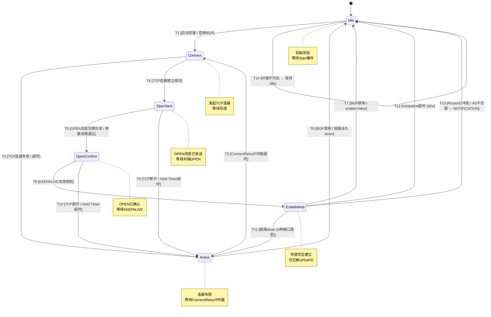

# BGP4+ 邻居状态机 — 状态图分析

> 生成时间: 2026-06-12 | 设计Skill: state-design
> 逻辑用例: LC-ST-001 | PPDCS 特征: S-State

---

## Design Context

| 字段 | 值 |
|------|-----|
| `recommended_feature` | S-State |
| `recommended_method` | 状态图法 (Chow's 0/1-switch) |
| `design_skill` | state-design |
| `primary_signal` | 邻居六态状态机的完整迁移 |
| `candidate_features` | S-State |
| `exclusion_reasons` | P-Process 不适用：虽有操作序列但核心是 BGP FSM 六态迁移，不是步骤流程；P-Parameter 不适用：接口类型等参数变化不改变状态拓扑结构 |
| `fact_status` | needs-confirmation (Hold Time=0 行为待确认) |
| `test_object_refs` | bgp6neighbor (BGP4+ 邻居状态机) |
| `factor_refs` | FAC-BGP6-NEIGHBOR-STATE, FAC-BGP6-KEEPALIVE, FAC-BGP6-DISCONNECT-MODE, FAC-BGP6-IF-TYPE |
| `scenario_refs` | S04 (IBGP建立), S05 (EBGP建立), S08 (断联与恢复) |
| `scenario_chain_refs` | S04/S05 normal_path + S08 normal_path/abnormal_path |
| `confirmation_gap_refs` | GAP-ST-001: Hold Time=0 行为；GAP-ST-002: 能力协商失败后状态 |

---

## State Model

### Mermaid 状态图

### 状态清单

| state_id | state_name | entry_conditions | exit_observations | trace_refs | confirmation_gap_refs | fact_status |
|----------|------------|------------------|-------------------|------------|-----------------------|-------------|
| S0 | Idle | BGP 禁用或初始状态；Keepalive超时后进入；NOTIFICATION后进入 | 无任何连接，等待 Start 事件 | TP-M3-001 | — | confirmed |
| S1 | Connect | BGP 启用后发起 TCP 连接 | TCP 三次握手中，等待连接完成或失败 | TP-M3-001 | — | confirmed |
| S2 | Active | TCP 连接失败或超时 | 等待 ConnectRetry 计时器超时后重试连接 | TP-M3-002 | — | confirmed |
| S3 | OpenSent | TCP 连接建立，已发送 OPEN 消息 | 等待对端 OPEN 消息，校验参数 | TP-M3-001 | — | confirmed |
| S4 | OpenConfirm | OPEN 消息协商成功 | 等待 KEEPALIVE 消息确认邻居存活 | TP-M3-001 | — | confirmed |
| S5 | Established | KEEPALIVE 确认，邻居完全建立 | 可交换 UPDATE 消息，路由正常通告和学习 | TP-M3-001 | — | confirmed |

---

## Transition Table

| transition_id | from | to | event | guard | effect | trace_refs | confirmation_gap_refs | fact_status |
|---------------|------|----|-------|-------|--------|------------|-----------------------|-------------|
| T1 | S0 (Idle) | S1 (Connect) | 启用BGP / Start事件 | BGP enable=true, 邻居已配置 | 发起 TCP 连接 (目标端口 179) | TP-M3-001 | — | confirmed |
| T2 | S1 (Connect) | S2 (Active) | TCP连接失败 / 超时 | TCP三次握手失败或超时 | 进入 Active 等待重试 | TP-M3-002 | — | confirmed |
| T3 | S2 (Active) | S1 (Connect) | ConnectRetry计时器超时 | ConnectRetry 计时器到期 | 重新发起 TCP 连接 | TP-M3-002 | — | confirmed |
| T4 | S1 (Connect) | S3 (OpenSent) | TCP连接建立成功 | TCP 连接 ESTABLISHED | 发送 OPEN 消息 | TP-M3-001 | — | confirmed |
| T5 | S3 (OpenSent) | S4 (OpenConfirm) | OPEN消息协商成功 | OPEN 参数协商通过 (AS/Version/Hold Time/Capabilities) | 发送 KEEPALIVE | TP-M3-001 | — | confirmed |
| T6 | S4 (OpenConfirm) | S5 (Established) | 收到KEEPALIVE | KEEPALIVE 消息收到 | 邻居完全建立，可交换 UPDATE | TP-M3-001 | — | confirmed |
| T7 | S5 (Established) | S0 (Idle) | BGP禁用 | PUT bgpconfig enable=false | 发送 NOTIFICATION，关闭 TCP | TP-M3-004 | — | confirmed |
| T8 | S2 (Active) | S0 (Idle) | BGP禁用 / 永久链路失效 | enable=false 或 接口被删除 | 停止重试，回到 Idle | TP-M3-004 | — | confirmed |
| T9 | S3 (OpenSent) | S2 (Active) | TCP断开 / Hold Timer超时 | Hold Timer 在 OpenSent 阶段超时 | 关闭 TCP，进入 Active 重试 | — | — | confirmed |
| T10 | S4 (OpenConfirm) | S2 (Active) | TCP断开 / Hold Timer超时 | Hold Timer 在 OpenConfirm 阶段超时 | 关闭 TCP，进入 Active 重试 | — | — | confirmed |
| T11 | S5 (Established) | S2 (Active) | 链路down (5种接口类型) | 接口物理/逻辑 down: 物理口/admin\ down, 子接口/VLAN\ down, 聚合口/成员全\ down, 隧道口/tunnel\ down, BVI口/bridge\ down | 邻居检测到链路故障，进入 Active 等待恢复 | TP-M3-005 | — | confirmed |
| T12 | S5 (Established) | S0 (Idle) | Keepalive超时 (180s) | Hold Timer=180s 内未收到任何 Keepalive | 邻居断开，进入 Idle | TP-M3-003 | — | confirmed |
| T13 | S5 (Established) | S0 (Idle) | 参数冲突 / NOTIFICATION | RouterID 冲突 或 AS号不匹配 或 能力协商失败 | 发送 NOTIFICATION 错误码，关闭连接 | TP-M3-001 (扩展), LC-ST-001 P15/P16 | — | confirmed |
| T14 | S0 (Idle) | S0 (Idle) | 对端不可达 | 邻居 IPv6 不可达 (路由表中无条目) | 保持 Idle，不发起连接 (或取决于实现直接失败) | TP-M3-002 | — | confirmed |
| T15 | S5 (Established) | S0 (Idle) | 接口IP变更 | DUT1 修改接口 IPv6 地址 | 邻居检测到源IP变化 → 断开 → 用新IP重建 | LC-ST-001 P7 | — | confirmed |
| T16 | S5 (Established) | S0 (Idle) | 删除邻居使用的IP | 从接口上删除邻居使用的 IPv6 地址 | 邻居断开 → Idle | LC-ST-001 P9 | — | confirmed |
| T17 | S5 (Established) | S2 (Active) | 链路恢复 | 接口 up: admin\ up / VLAN\ up / 成员\ up / tunnel重建 / bridge\ up | TCP重建 → 重新走 OpenSent→OpenConfirm→Established | TP-M3-005 | — | confirmed |
| T18 | S0 (Idle) | S1 (Connect) | 链路恢复后重连 | 从 T11/T17 后接口恢复 | 自动发起 TCP 连接 | TP-M3-005 | — | confirmed |

---

## State Path Selection

### 迁移路径

| state_path_id | transition_sequence | path_type | guard_summary | scenario_chain_refs | trace_refs | confirmation_gap_refs | fact_status |
|---------------|--------------------|-----------|---------------|---------------------|------------|-----------------------|-------------|
| SP-01 | T1→T4→T5→T6: Idle→Connect→OpenSent→OpenConfirm→Established | 主生命周期 | 正向路径: TCP成功 + OPEN协商 + KEEPALIVE确认 | S04/S05 normal_path | TP-M3-001 | — | confirmed |
| SP-02 | T1→T2→T3→T4→T5→T6: Idle→Connect→Active→Connect→OpenSent→OpenConfirm→Established | 主生命周期(含回退) | Connect失败后 Active重试成功 | S04 normal_path + S08 abnormal_path | TP-M3-002 | — | confirmed |
| SP-03 | T1→T4→T5→T6→T11→T18: Established→Active→Established | 物理口回退恢复 | admin down → Active → admin up → 重建 | S08 步骤4→5 | TP-M3-005 | — | confirmed |
| SP-04 | T1→T4→T5→T6→T11→T18: Established→Active→Established (子接口) | 子接口回退恢复 | VLAN down → Active → VLAN up → 重建 | LC-ST-001 P4 子接口 | TP-M3-005 | — | confirmed |
| SP-05 | T1→T4→T5→T6→T11→T18: Established→Active→Established (聚合口) | 聚合口回退恢复 | 成员口全down → Active → 任一恢复 → 重建 | LC-ST-001 P4 聚合口 | TP-M3-005 | — | confirmed |
| SP-06 | T1→T4→T5→T6→T11→T18: Established→Active→Established (隧道口) | 隧道口回退恢复 | tunnel down → Active → tunnel重建 → 重建 | LC-ST-001 P4 隧道口 | TP-M3-005 | — | confirmed |
| SP-07 | T1→T4→T5→T6→T11→T18: Established→Active→Established (BVI口) | BVI口回退恢复 | bridge down → Active → bridge up → 重建 | LC-ST-001 P4 BVI口 | TP-M3-005 | — | confirmed |
| SP-08 | SP-01→T7: Established→Idle | 主动断联 | enable=false → NOTIFICATION → Idle | S08 步骤2 | TP-M3-004 | — | confirmed |
| SP-09 | SP-01→T12: Established→Idle (Keepalive超时) | 异常回退 | Hold Timer=180s 超时 | S08 步骤6 | TP-M3-003 | — | confirmed |
| SP-10 | SP-01→T7→T1→T4→T5→T6: Established→Idle→Established | 断联恢复 | enable=false→true → 重建 | S08 步骤2→3 | TP-M3-004 | — | confirmed |
| SP-11 | SP-01→T12→T1→T4→T5→T6: Established→Idle→Established (Keepalive恢复) | 超时恢复 | Hold 超时→Idle→解除阻断→重建 | S08 abnormal_path keepalive全部丢失 | TP-M3-003 | — | confirmed |
| SP-12 | SP-01→T13: Established→Idle (RouterID冲突) | 非法迁移 | RouterID相同 → Bad BGP Identifier → NOTIFICATION | LC-ST-001 P15 | — | confirmed |
| SP-13 | SP-01→T13: Established→Idle (AS不匹配) | 非法迁移 | AS号不匹配 → Bad Peer AS → NOTIFICATION | LC-ST-001 P16 | — | confirmed |
| SP-14 | SP-01→T15: Established→Idle (IP变更) | 边界迁移 | 接口IPv6地址变更 → 断开 → 用新IP重建 | LC-ST-001 P7 | — | confirmed |
| SP-15 | SP-01→T16: Established→Idle (删除IP) | 边界迁移 | 删除接口IPv6地址 → 邻居断开 | LC-ST-001 P9 | — | confirmed |
| SP-16 | Hold Time协商: DUT1=180s, DUT2=90s → min=90s | 边界守卫 | Hold Time 取 min(180,90)=90s | LC-ST-001 P10 | — | confirmed |
| SP-17 | Hold Time协商: DUT1=30s, DUT2=360s → min=30s | 边界守卫 | Hold Time 取 min(30,360)=30s | LC-ST-001 P11 | — | confirmed |
| SP-18 | Hold Time=0 [待确认] | 边界守卫 | DUT1 Hold Time=0 → [待确认] DUT2侧行为 | LC-ST-001 P12 | GAP-ST-001 | needs-confirmation |
| SP-19 | 能力协商: 一端无MP-BGP IPv6 → 邻居建立但无IPv6路由 | 边界迁移 | 能力协商失败不阻断邻居建立 | LC-ST-001 P13 | — | confirmed |
| SP-20 | 能力协商: 4字节AS → 一方不支持 → 回退2字节或断开 | 边界迁移 | AS4能力协商 | LC-ST-001 P14 | GAP-ST-002 | needs-confirmation |
| SP-21 | 单接口多IP: 邻居通过IP1建立 → 切换IP2 → 重建 | 边界迁移 | PUT bgp6neighbor 更新 IP → 用新IP重新协商 | LC-ST-001 P8 | — | confirmed |

---

## Guard Conditions & Data Overlay

### 守卫条件数据映射

| state_path_id | transition_id | factor_ref | td_ref | value_set | guard_expectation | data_overlay_set | status |
|---------------|---------------|------------|--------|-----------|-------------------|------------------|--------|
| SP-01 | T1,T4,T5,T6 | 邻居状态 | TD-ST-001 | 六态顺序迁移 | pass (正向全部成功) | OVL-ST-01 | ready |
| SP-02 | T2,T3 | 对端可达性 | TD-ST-002 | 对端不可达 | pass (Active/Connect循环) | OVL-ST-02 | ready |
| SP-03 | T11,T18 | 接口类型=物理口 | TD-ST-IF01 | GE0_1 admin down→up | pass (重建Established) | OVL-ST-IF01 | ready |
| SP-04 | T11,T18 | 接口类型=子接口 | TD-ST-IF02 | GE0_1.100 VLAN down→up | pass (重建Established) | OVL-ST-IF02 | ready |
| SP-05 | T11,T18 | 接口类型=聚合口 | TD-ST-IF03 | bond0 成员全down→任一恢复 | pass (重建Established) | OVL-ST-IF03 | ready |
| SP-06 | T11,T18 | 接口类型=隧道口 | TD-ST-IF04 | tunnel0 down→重建 | pass (重建Established) | OVL-ST-IF04 | ready |
| SP-07 | T11,T18 | 接口类型=BVI口 | TD-ST-IF05 | bvi1 bridge down→up | pass (重建Established) | OVL-ST-IF05 | ready |
| SP-08 | T7 | BGP使能 | TD-ST-003 | enable=false | pass (进入Idle) | OVL-ST-03 | ready |
| SP-09 | T12 | Keepalive | TD-ST-004 | 全部丢失, Hold=180s | pass (超时后Idle) | OVL-ST-04 | ready |
| SP-10 | T7→T1 | BGP使能 | TD-ST-005 | enable=true | pass (重建Established) | OVL-ST-05 | ready |
| SP-12 | T13 | RouterID | TD-ST-006 | DUT1=1.1.1.1, DUT2=1.1.1.1 | fail (NOTIFICATION) | OVL-ST-06 | ready |
| SP-13 | T13 | AS号 | TD-ST-007 | DUT1 neighbor AS=100, DUT2 actual AS=200 | fail (NOTIFICATION) | OVL-ST-07 | ready |
| SP-16 | T5 | Hold Time协商 | TD-ST-008 | DUT1=180s, DUT2=90s → min=90s | pass (协商成功, Keepalive=30s) | OVL-ST-08 | ready |
| SP-17 | T5 | Hold Time协商 | TD-ST-009 | DUT1=30s, DUT2=360s → min=30s | pass (协商成功, Keepalive=10s) | OVL-ST-09 | ready |
| SP-18 | T5 | Hold Time=0 | TD-ST-010 | DUT1=0, DUT2=180s | [待确认] | OVL-ST-10 | needs-confirmation |
| SP-19 | T5 | 能力协商 | TD-ST-011 | DUT1声明MP-BGP IPv6, DUT2不声明 | pass (邻居建立但无IPv6路由交换) | OVL-ST-11 | ready |
| SP-20 | T5 | 能力协商 | TD-ST-012 | DUT1声明4-Octet AS, DUT2不声明 | [待确认] | OVL-ST-12 | needs-confirmation |
| SP-21 | T15 | 单接口多IP | TD-ST-013 | IP1=2001:db8:1::1, IP2=2001:db8:2::1 → 切换IP2 | pass (用新IP重建) | OVL-ST-13 | ready |

### 数据叠加层定义

| overlay_id | 描述 | 关键参数 | 预期结果 |
|------------|------|---------|---------|
| OVL-ST-01 | 正向全路径 | 对端IPv6可达 | Idle→Connect→OpenSent→OpenConfirm→Established |
| OVL-ST-02 | Active回退 | 对端IPv6不可达 | Idle→Connect→Active→Connect→Active...循环 |
| OVL-ST-IF01~05 | 5种接口类型链路down/up | 各接口类型down→up | Established→Active→Established |
| OVL-ST-03 | BGP禁用 | enable=false | Established→Idle |
| OVL-ST-04 | Keepalive超时 | Hold=180s, 阻断keepalive | Established→Idle (180s后) |
| OVL-ST-05 | BGP重新启用 | enable=true | Idle→Established (完整路径) |
| OVL-ST-06 | RouterID冲突 | 两端相同RouterID | Established→Idle (NOTIFICATION) |
| OVL-ST-07 | AS不匹配 | 邻居AS≠对端实际AS | Established→Idle (NOTIFICATION) |
| OVL-ST-08 | Hold Time协商(90s) | min(180,90)=90s, Keepalive=30s | 正常Established |
| OVL-ST-09 | Hold Time协商(30s) | min(30,360)=30s, Keepalive=10s | 正常Established (可能频繁重建) |
| OVL-ST-10 | Hold Time=0 | DUT1=0 | [待确认] |
| OVL-ST-11 | MP-BGP能力协商 | 一端不支持IPv6 | 邻居建立但无IPv6路由 |
| OVL-ST-12 | 4字节AS协商 | 一端不支持 | [待确认] |
| OVL-ST-13 | 单接口多IP切换 | 切换邻居绑定IP | 用新IP重建 |

---

## PC Derivation Summary

| physical_case_id | logic_case_id | state_path_id | data_overlay_set | coverage_goal |
|-----------------|---------------|---------------|------------------|---------------|
| PC-ST-001-01 | LC-ST-001 | SP-01 | OVL-ST-01 | 主生命周期: 六态正向 |
| PC-ST-001-02 | LC-ST-001 | SP-02 | OVL-ST-02 | 主生命周期: Active回退 |
| PC-ST-001-03 | LC-ST-001 | SP-03 | OVL-ST-IF01 | 回退恢复: 物理口链路 |
| PC-ST-001-04 | LC-ST-001 | SP-04 | OVL-ST-IF02 | 回退恢复: 子接口链路 |
| PC-ST-001-05 | LC-ST-001 | SP-05 | OVL-ST-IF03 | 回退恢复: 聚合口链路 |
| PC-ST-001-06 | LC-ST-001 | SP-06 | OVL-ST-IF04 | 回退恢复: 隧道口链路 |
| PC-ST-001-07 | LC-ST-001 | SP-07 | OVL-ST-IF05 | 回退恢复: BVI口链路 |
| PC-ST-001-08 | LC-ST-001 | SP-08 | OVL-ST-03 | 异常回退: BGP禁用 |
| PC-ST-001-09 | LC-ST-001 | SP-09 | OVL-ST-04 | 异常回退: Keepalive超时 |
| PC-ST-001-10 | LC-ST-001 | SP-10 | OVL-ST-05 | 恢复路径: 禁用后重建 |
| PC-ST-001-11 | LC-ST-001 | SP-11 | OVL-ST-04→OVL-ST-05 | 恢复路径: 超时后重建 |
| PC-ST-001-12 | LC-ST-001 | SP-12 | OVL-ST-06 | 非法迁移: RouterID冲突 |
| PC-ST-001-13 | LC-ST-001 | SP-13 | OVL-ST-07 | 非法迁移: AS不匹配 |
| PC-ST-001-14 | LC-ST-001 | SP-16 | OVL-ST-08 | 边界守卫: Hold Time协商min |
| PC-ST-001-15 | LC-ST-001 | SP-17 | OVL-ST-09 | 边界守卫: Hold Time极端值 |
| PC-ST-001-16 | LC-ST-001 | SP-18 | OVL-ST-10 | 边界守卫: Hold Time=0 [待确认] |
| PC-ST-001-17 | LC-ST-001 | SP-19 | OVL-ST-11 | 边界迁移: 能力协商MP-BGP |
| PC-ST-001-18 | LC-ST-001 | SP-20 | OVL-ST-12 | 边界迁移: 4字节AS [待确认] |
| PC-ST-001-19 | LC-ST-001 | SP-14 | — | 边界迁移: 接口IP变更 |
| PC-ST-001-20 | LC-ST-001 | SP-15 | — | 边界迁移: 删除接口IP |
| PC-ST-001-21 | LC-ST-001 | SP-21 | OVL-ST-13 | 边界迁移: 单接口多IP切换 |

---

## Uncertain Facts / Confirmation Gaps

| gap_id | 描述 | 影响范围 | fact_status |
|--------|------|---------|-------------|
| GAP-ST-001 | Hold Time=0 的行为：双方都不发送 Keepalive 还是仅 DUT2 侧使用默认值 180s？ | SP-18, T5 守卫 | needs-confirmation |
| GAP-ST-002 | 4字节 AS 号能力协商：仅一方声明时协商失败断开还是回退到 2 字节 AS？ | SP-20, T5 守卫 | needs-confirmation |
| GAP-ST-003 | 单接口多 IPv6 地址场景中，新增第三个 IPv6 地址是否影响现有邻居？P8 描述"不受影响"但需确认 | SP-21 | needs-confirmation |
