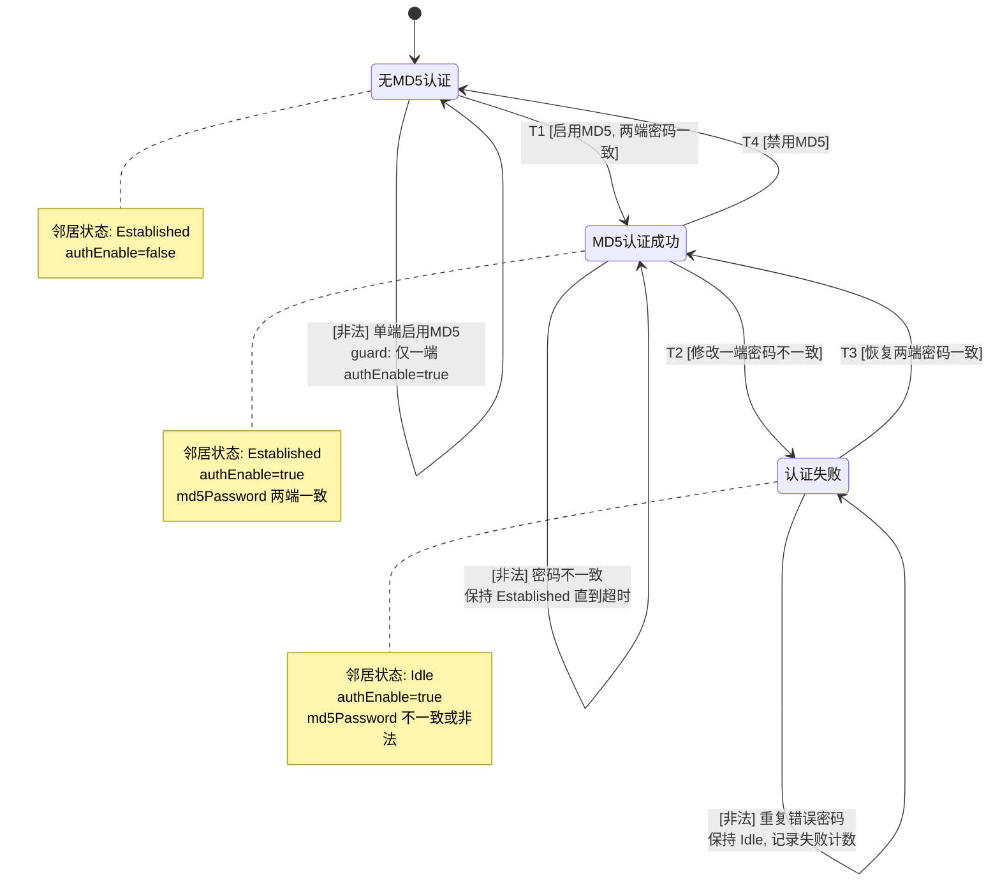

# BGP4+ MD5 认证邻居 — 状态图分析

> 生成时间: 2026-06-12 | 设计Skill: state-design
> 逻辑用例: LC-BPG-004 | PPDCS 特征: S-State + D-Data

---

## Design Context

| 字段 | 值 |
|------|-----|
| `recommended_feature` | S-State |
| `recommended_method` | 状态图法 (Chow's 0/1-switch) |
| `design_skill` | state-design |
| `primary_signal` | MD5 认证启用/禁用导致的邻居状态迁移 |
| `candidate_features` | S-State, D-Data |
| `exclusion_reasons` | P-Parameter 不适用：核心是认证状态间迁移而非参数遍历；P-Process 不适用：虽有步骤序列但关键是状态转换而非流程编排 |
| `fact_status` | needs-confirmation (部分守卫条件待确认) |
| `test_object_refs` | bgp6neighbor (MD5 认证邻居) |
| `factor_refs` | FAC-BGP6-MD5-ENABLE, FAC-BGP6-MD5-PASSWORD |
| `scenario_refs` | S07 (BGP4+ MD5认证邻居) |
| `scenario_chain_refs` | S07 normal_path + abnormal_path |
| `confirmation_gap_refs` | GAP-MD5-001: 密码修改后重新协商的超时机制是否为立即触发；GAP-MD5-002: 密码错误后重试次数/间隔 |

---

## State Model

### Mermaid 状态图

### 状态清单

| state_id | state_name | entry_conditions | exit_observations | trace_refs | confirmation_gap_refs | fact_status |
|----------|------------|------------------|-------------------|------------|-----------------------|-------------|
| S0 | 无MD5认证 | BGP4+ 邻居建立，authEnable=false；或从 MD5 认证成功态禁用 MD5 | 邻居 Established，MD5 未启用 | TP-M1-016 | — | confirmed |
| S1 | MD5认证成功 | 两端同时启用 MD5 且密码一致；或从认证失败态恢复密码一致 | 邻居 Established + MD5 认证，TCP MD5 Signature Option 生效 | TP-M1-016, TP-Q-SEC-001 | — | confirmed |
| S2 | 认证失败 | 一端密码不一致导致认证失败；或密码非法值（空/空格/超长） | 邻居 Idle，无法建立 TCP 连接（MD5 校验失败） | TP-M1-017, TP-M1-018, TP-Q-SEC-001 | GAP-MD5-001 | needs-confirmation |

---

## Transition Table

| transition_id | from | to | event | guard | effect | trace_refs | confirmation_gap_refs | fact_status |
|---------------|------|----|-------|-------|--------|------------|-----------------------|-------------|
| T1 | S0 (无MD5认证) | S1 (MD5认证成功) | 两端同时启用 MD5 | `authEnable=true` && `md5Password两端完全一致` && `密码符合规范(1~32字符, 无空格)` | 邻居保持 Established，TCP 报文带 MD5 签名 | TP-M1-016, S07-OP2 | — | confirmed |
| T2 | S1 (MD5认证成功) | S2 (认证失败) | 修改一端密码不一致 | `md5Password(DUT1) != md5Password(DUT2)` | 邻居 Hold Timer 超时后断开，进入 Idle；或立即检测到不一致 | TP-M1-017, S07-OP3 | GAP-MD5-001: 超时机制为立即触发还是等待 Hold Timer | needs-confirmation |
| T3 | S2 (认证失败) | S1 (MD5认证成功) | 恢复两端密码一致 | `md5Password两端再次一致` && `密码符合规范` | 邻居重新建立，从 Idle 回到 Established | TP-M1-016, S07-OP4 | — | confirmed |
| T4 | S1 (MD5认证成功) | S0 (无MD5认证) | 两端同时禁用 MD5 | `authEnable=false` | 邻居保持 Established，TCP 报文不再带 MD5 签名 | TP-M1-016 | — | confirmed |
| T5 (非法) | S0 (无MD5认证) | S0 (无MD5认证) | 仅一端启用 MD5 | `authEnable(DUT1)=true, authEnable(DUT2)=false` | 邻居保持 Established（无 MD5 端不验证），或断开（取决于实现） | TP-Q-SEC-001 | [待确认] 单端 MD5 行为 | needs-confirmation |
| T6 (非法) | S1 (MD5认证成功) | S1 (MD5认证成功) | 修改密码但尚未超时 | 密码已不一致但 Hold Timer 未到 | 邻居暂时保持 Established，超时后断开 | Bug#219237 | — | confirmed |
| T7 (非法) | S0 (无MD5认证) | S2 (认证失败) | 使用非法密码启用 MD5 | `md5Password=""` 或 `含空格` 或 `>32字符` | API 返回错误，邻居不进入 MD5 模式 | TP-M1-018, TP-Q-SEC-002 | — | confirmed |

---

## State Path Selection

### 迁移路径

| state_path_id | transition_sequence | path_type | guard_summary | scenario_chain_refs | trace_refs | confirmation_gap_refs | fact_status |
|---------------|--------------------|-----------|---------------|---------------------|------------|-----------------------|-------------|
| SP-01 | T1: S0→S1 | 主生命周期 | 两端密码一致 | S07 步骤1→2 | TP-M1-016 | — | confirmed |
| SP-02 | T1→T2: S0→S1→S2 | 异常回退 | 先一致建立，后一端改错 | S07 步骤1→2→4 | TP-M1-017 | GAP-MD5-001 | needs-confirmation |
| SP-03 | T1→T2→T3: S0→S1→S2→S1 | 恢复路径 | 建立→不一致→恢复一致 | S07 步骤1→2→4→5 | TP-M1-016, S07-OP4 | — | confirmed |
| SP-04 | T1→T4: S0→S1→S0 | 禁用回退 | 启用后禁用 MD5 | S07 exit_action | TP-M1-016 | — | confirmed |
| SP-05 | S0: 非法密码边界 | 边界守卫 | 空/空格/超长密码直接拒绝 | S07 abnormal_path | TP-M1-018 | — | confirmed |
| SP-06 | S0: 单端 MD5 | 非法迁移 | 仅一端启用 MD5 | — | TP-Q-SEC-001 | [待确认] | needs-confirmation |
| SP-07 | S1→S1: 密码不一致但未超时 | 边界守卫 | Keepalive 期间状态保持 | Bug#219237 | TP-M1-017 | — | confirmed |
| SP-08 | S0: 特殊字符合法 | 边界守卫 | 密码含 `!@#$%^&*()` 应正常建立 | S07 abnormal_path | TP-M1-018 | — | confirmed |
| SP-09 | S0: 大小写不一致 | 边界守卫 | `"Abc" != "abc"` 认证失败 | S07 abnormal_path | TP-M1-018 | — | confirmed |

---

## Guard Conditions & Data Overlay

### 守卫条件数据映射

| state_path_id | transition_id | factor_ref | td_ref | value_set | guard_expectation | data_overlay_set | status |
|---------------|---------------|------------|--------|-----------|-------------------|------------------|--------|
| SP-01 | T1 | MD5开关 | TD-MD5-001 | `enable` | pass | OVL-01 | ready |
| SP-01 | T1 | MD5密码 | TD-MD5-002 | `"TestPass123"` (两端一致) | pass | OVL-01 | ready |
| SP-02 | T2 | MD5密码 | TD-MD5-003 | DUT1=`"TestPass123"`, DUT2=`"WrongPass"` | fail (认证不通过) | OVL-02 | needs-confirmation |
| SP-03 | T3 | MD5密码 | TD-MD5-004 | 恢复为 `"TestPass123"` (两端一致) | pass | OVL-03 | ready |
| SP-04 | T4 | MD5开关 | TD-MD5-005 | `disable` | pass | OVL-04 | ready |
| SP-05 | T7 | MD5密码(空) | TD-MD5-B01 | `""` | fail (API拒绝) | OVL-B01 | ready |
| SP-05 | T7 | MD5密码(空格) | TD-MD5-B02 | `"abc 123"` | fail (API拒绝) | OVL-B02 | ready |
| SP-05 | T7 | MD5密码(超长) | TD-MD5-B03 | `33字符` | fail (API拒绝, 最长32) | OVL-B03 | ready |
| SP-08 | T1 | MD5密码(特殊) | TD-MD5-B04 | `"!@#$%^&*()"` | pass (特殊字符合法) | OVL-B04 | ready |
| SP-09 | T1 | MD5密码(大小写) | TD-MD5-B05 | DUT1=`"Abc123"`, DUT2=`"abc123"` | fail | OVL-B05 | ready |
| SP-06 | T5 | MD5开关 | TD-MD5-B06 | DUT1=`enable`, DUT2=`disable` | fail (单端MD5异常) | OVL-B06 | needs-confirmation |

### 数据叠加层定义

| overlay_id | 描述 | 密码值列表 | 预期守卫结果 |
|------------|------|----------|------------|
| OVL-01 | 正常密码一致 | `"TestPass123"` | pass |
| OVL-02 | 密码不一致 | `"TestPass123"` vs `"WrongPass"` | fail |
| OVL-03 | 密码恢复一致 | `"WrongPass"` → `"TestPass123"` | pass |
| OVL-04 | 禁用MD5 | authEnable=false | pass |
| OVL-B01 | 空密码 | `""` | fail |
| OVL-B02 | 含空格 | `"abc 123"` | fail |
| OVL-B03 | 超长密码 | 33字符 | fail |
| OVL-B04 | 特殊字符 | `"!@#$%^&*()"` | pass |
| OVL-B05 | 大小写不一致 | `"Abc123"` vs `"abc123"` | fail |
| OVL-B06 | 单端MD5 | 一端enable, 一端disable | fail |

---

## PC Derivation Summary

| physical_case_id | logic_case_id | state_path_id | data_overlay_set | coverage_goal |
|-----------------|---------------|---------------|------------------|---------------|
| PC-BPG-004-01 | LC-BPG-004 | SP-01 | OVL-01 | 主生命周期: 无MD5→启用MD5成功 |
| PC-BPG-004-02 | LC-BPG-004 | SP-02 | OVL-02 | 异常回退: 密码不一致导致断开 |
| PC-BPG-004-03 | LC-BPG-004 | SP-03 | OVL-03 | 恢复路径: 密码恢复后重建 |
| PC-BPG-004-04 | LC-BPG-004 | SP-04 | OVL-04 | 禁用回退: MD5禁用后恢复无认证 |
| PC-BPG-004-05 | LC-BPG-004 | SP-05 | OVL-B01 | 边界守卫: 空密码 |
| PC-BPG-004-06 | LC-BPG-004 | SP-05 | OVL-B02 | 边界守卫: 含空格密码 |
| PC-BPG-004-07 | LC-BPG-004 | SP-05 | OVL-B03 | 边界守卫: 超长密码 |
| PC-BPG-004-08 | LC-BPG-004 | SP-08 | OVL-B04 | 边界守卫: 特殊字符合法 |
| PC-BPG-004-09 | LC-BPG-004 | SP-09 | OVL-B05 | 边界守卫: 大小写不一致 |
| PC-BPG-004-10 | LC-BPG-004 | SP-06 | OVL-B06 | 非法迁移: 单端MD5 [待确认] |

---

## Uncertain Facts / Confirmation Gaps

| gap_id | 描述 | 影响范围 | fact_status |
|--------|------|---------|-------------|
| GAP-MD5-001 | 修改一端密码不一致后，邻居断开的触发机制是立即还是等待 Hold Timer 超时？Bug#219237 涉及"邻居不超时重建" | T2 迁移守卫条件 | needs-confirmation |
| GAP-MD5-002 | 密码错误后重试次数和重试间隔是否有限制？ | T6 非法迁移路径 | needs-confirmation |
| GAP-MD5-003 | 单端启用 MD5 时行为：邻居保持无MD5 还是断开？ | T5 非法迁移路径 | needs-confirmation |
| GAP-03 (已解决) | MD5 密码长度上限是 32（接口文档）还是 64（方案设计） | 边界守卫 | resolved: 32字符为准 |
