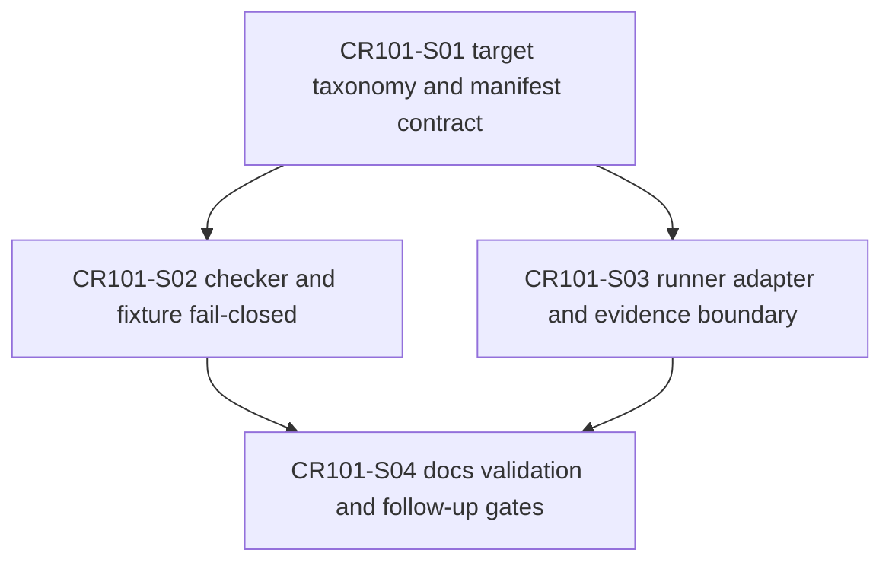

# CR101 Story Backlog

## 范围边界

CR101 只推进离线设计、schema、fixture、checker、package layout、evidence redaction 与本地测试设计。CP5 批准前不得实现；CP5 批准后也不授权真实 NAS、凭据、QMT/MiniQMT/XtQuant/gateway runtime、simulation/live、交易或 publish。

## Story 总览

| Story ID | 标题 | LLD 策略 | Wave | 依赖 | 状态 |
|---|---|---|---|---|---|
| CR101-S01-target-taxonomy-manifest-contract | Target taxonomy and manifest contract realignment | full-lld | CR101-W1-CONTRACT | 无 | lld-ready-for-review |
| CR101-S02-package-checker-fixture-fail-closed | Package checker and fixture fail-closed realignment | full-lld | CR101-W2-CHECKER-EVIDENCE | CR101-S01 | lld-ready-for-review |
| CR101-S03-runner-adapter-evidence-boundary | Runner adapter and evidence boundary realignment | full-lld | CR101-W2-CHECKER-EVIDENCE | CR101-S01 | lld-ready-for-review |
| CR101-S04-docs-validation-and-follow-up-gates | Docs, validation matrix, and follow-up authorization gates | full-lld | CR101-W3-DOCS-GATES | CR101-S01, CR101-S02, CR101-S03 | lld-ready-for-review |

## Story 详情

### CR101-S01 Target taxonomy and manifest contract realignment

目标是把策略包 manifest 从历史 `miniqmt_runner` delivery target 假设迁移到 target + adapter 双边界：

- `delivery_targets[]` 当前唯一 implemented target 为 `qmt_terminal_direct`。
- `execution_adapters[]` 表达 runner 到 broker/gateway 的 adapter，其中 MiniQMT 只作为 gateway / broker adapter contract。
- future target 可保留 schema slot，但 `implemented=false` 且不得生成 runtime ready 语义。
- `miniqmt_runner` 不得作为 delivery target 出现在新 manifest、fixture 或 package layout 中。

验收标准：

- 新 manifest contract 能表达 `qmt_terminal_direct` 和 MiniQMT adapter 的双边界。
- `StrategyPackage.to_adapter_payload()` 或等价 contract 不直接要求 QMT/MiniQMT runtime。
- manifest schema 中所有 runtime / NAS / credential / trade / publish authorization flag 必须 false。
- runner core 直接 import `xtquant` / QMT SDK 计数保持 0。

### CR101-S02 Package checker and fixture fail-closed realignment

目标是把 CR100 fake exchange、package checker 和 negative fixtures 从 `qmt_terminal` + `miniqmt_runner` 双 target 硬编码迁移到 CR101 contract。

验收标准：

- checker 至少覆盖 8 类失败：schema、target missing、adapter missing、permission nonfalse、checksum、path escape、sensitive filename、forbidden counter。
- 历史 `miniqmt_runner` delivery target 必须 fail closed，并给出迁移提示。
- fake exchange 仍保持本地离线，不访问真实 NAS，不 publish。
- 测试只使用临时目录和脱敏 fixture。

### CR101-S03 Runner adapter and evidence boundary realignment

目标是在 runner adapter / evidence 层明确 target 与 execution adapter 字段，避免把 MiniQMT adapter 误读为 strategy runner host。

验收标准：

- adapter payload / registry / evidence summary 可记录 `delivery_target_id` 与 `execution_adapter_id`。
- readonly gateway 保持 allowlist 和 fake transport 默认路径；缺 authorization_ref 时仍 fail closed。
- evidence redaction 对 token、secret、password、account、raw_positions、raw_orders、qmt_log、credential 等敏感字段命中为 0。
- forbidden operation counters 全部为 0，且测试覆盖非零时阻断。

### CR101-S04 Docs, validation matrix, and follow-up authorization gates

目标是把设计、验证、用户说明和后续 gate 收口，防止离线 ready 被误读为真实系统 ready。

验收标准：

- 文档明确 CR101 只声明离线 contract / package readiness，不声明真实 NAS/QMT/MiniQMT/gateway ready。
- 后续 gate 至少列出 QMT direct-run real validation、MiniQMT gateway adapter real validation、NAS real exchange、order-write / simulation-live 四类候选。
- CP7/CP8 预期允许 READY_WITH_RISK，但必须保留不授权清单和 residual risk。
- 不新增真实运行脚本，不读取 `.env` / 凭据 / 账户 / 原始日志。

## 依赖 DAG

## 文件所有权摘要

| Story | Primary owner | Shared / merge owner | Forbidden |
|---|---|---|---|
| CR101-S01 | `trading/strategy_runner/package_loader.py` | manifest fixture contract docs; merge owner for schema names | `.env`, credentials, runtime launchers, NAS paths |
| CR101-S02 | `trading/strategy_runner/package_exchange.py`, `tests/test_cr100_package_exchange.py` | checker fixture directories; merge after S01 contract | real NAS, publish, mounted shares |
| CR101-S03 | `trading/strategy_runner/adapters.py`, `trading/strategy_runner/evidence.py`, `trading/strategy_runner/readonly_gateway.py` | CR091 / CR098 tests; merge after S01 contract | QMT/MiniQMT/XtQuant SDK import or runtime start |
| CR101-S04 | `docs/qmt/*CR101*`, `process/checks/*CR101*`, `process/checkpoints/*CR101*` | release / quality docs if implementation changes require them | real runtime logs, account data, credentials |

## 不授权范围

- 不访问、列取、读取、复制、写入、挂载、发布或删除真实 NAS。
- 不读取 `.env`、凭据、token、secret、账号、账户、资金、持仓、委托、成交或原始日志。
- 不启动、连接、安装或运行 QMT / MiniQMT / XtQuant / gateway runtime。
- 不执行 submit/cancel、buy/sell、simulation/live。
- 不执行 provider fetch、lake write、catalog publish。
