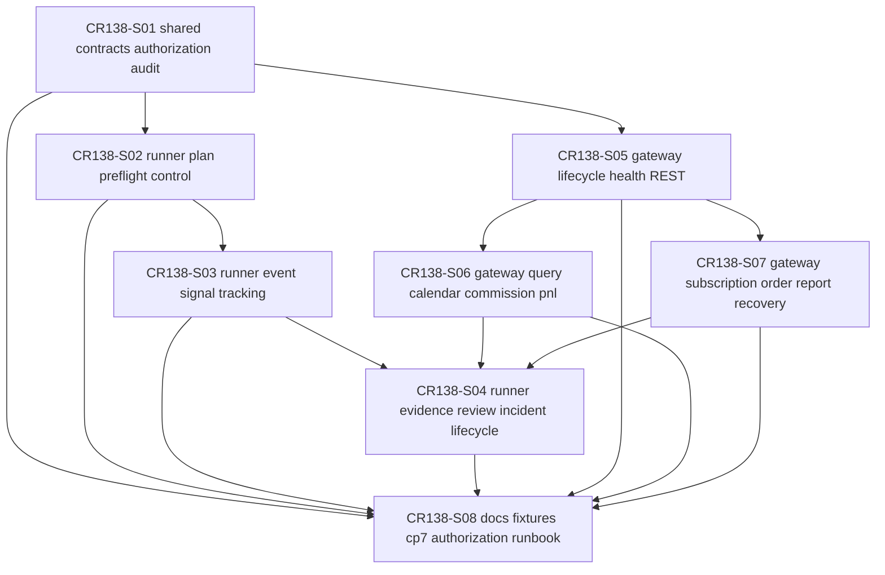

# CR138 Story Backlog

## 范围边界

CR138 CP4 只完成 Story planning、Feature Design Matrix、Feature 级设计、Story 卡片、DAG / Wave 和 CP4 自动预检。CP5 批准前不得实现；本 CP4 不授权 runtime、QMT、MiniQMT、XtQuant、凭据、账户 / 行情 / 订单读取、submit/cancel、simulation/live、NAS、provider/lake/catalog 或 Git remote 写入。

## Story 总览

| Story ID | 标题 | Owner Feature | LLD 策略 | Wave | 依赖 | 状态 |
|---|---|---|---|---|---|---|
| CR138-S01-shared-contracts-authorization-audit | Shared contracts, authorization, and audit boundary | FEAT-07 / FEAT-11 / FEAT-12 / FEAT-06 | full-lld | CR138-W1-SHARED-CONTRACTS | 无 | lld-ready-for-review |
| CR138-S02-runner-plan-preflight-control | Runner run plan, preflight, and command control | FEAT-11 | full-lld | CR138-W2-CONTROL-SHELL | CR138-S01 | lld-ready-for-review |
| CR138-S05-gateway-lifecycle-health-rest-contract | Gateway lifecycle, health, capabilities, REST contract, and change plan | FEAT-12 | full-lld | CR138-W2-CONTROL-SHELL | CR138-S01 | lld-ready-for-review |
| CR138-S03-runner-event-signal-rebalance-tracking | Runner event, signal, rebalance, run tracking, and ops summary | FEAT-11 / FEAT-06 | full-lld | CR138-W3-OPERATIONAL-FLOWS | CR138-S01, CR138-S02 | lld-ready-for-review |
| CR138-S06-gateway-query-calendar-commission-pnl | Gateway query service for calendar, commission, and PnL | FEAT-12 / FEAT-06 / FEAT-07 | full-lld | CR138-W3-OPERATIONAL-FLOWS | CR138-S01, CR138-S05 | lld-ready-for-review |
| CR138-S07-gateway-subscription-order-report-recovery | Gateway subscription, order report, and recovery boundary | FEAT-12 / FEAT-06 / FEAT-07 | full-lld | CR138-W3-OPERATIONAL-FLOWS | CR138-S01, CR138-S05 | lld-ready-for-review |
| CR138-S04-runner-evidence-review-incident-lifecycle | Runner evidence, review, incident, and lifecycle change | FEAT-11 / FEAT-08 / FEAT-07 | full-lld | CR138-W4-REVIEW-DOCS-GUARDRAILS | CR138-S02, CR138-S03, CR138-S06, CR138-S07 | lld-ready-for-review |
| CR138-S08-docs-fixtures-cp7-authorization-runbook | Docs, fixtures, CP7 guardrails, and authorization runbook | FEAT-08 / FEAT-07 / FEAT-11 / FEAT-12 | full-lld | CR138-W4-REVIEW-DOCS-GUARDRAILS | CR138-S01..S07 | lld-ready-for-review |

## Story 详情

### CR138-S01 Shared contracts, authorization, and audit boundary

目标是冻结 Runner / Gateway / OMS / Safety 共享合同：RunnerCommand、GatewayCommand、GatewayEvent、ExecutionReport、AuthorizationRecord、AuditRecord、idempotency_key 和 request_id。它是后续所有 Story 的 contract 前置。

验收标准：

- Runner 与 Gateway 之间所有命令 / 事件均有 audit_id 或 request_id。
- 未授权 runtime、account、market、order、submit/cancel 时必须 fail-closed。
- GatewayHealth / CapabilitySnapshot 不得升级为账户 / 行情 / 订单 / 交易授权。
- shared contract 不导入 xtquant，不读取 `.env`，不启动服务。

### CR138-S02 Runner run plan, preflight, and command control

目标是定义 RunPlan、RunPlanBatch、PreflightResult、BatchPreflightResult、RunnerCommand 和 Runner 控制面入口，支撑 UC-33 / UC-34 / UC-35，并吸收 CR137 后续 offline batch run 计划。

验收标准：

- RunPlan 可表达 strategy_id、strategy_version、data_release、target_date、mode_request 和 authorization_ref。
- RunPlanBatch 可表达 batch_id、多个 RunPlan ref、batch policy 和 aggregate status，且不自动运行。
- Preflight / BatchPreflight 覆盖 admission、data release、gateway health、runtime authorization 和 blocked reasons。
- 缺授权时 RunnerCommand 状态为 blocked，adapter_calls=0。
- Runner 不直接调用 QMT / MiniQMT / XtQuant。

### CR138-S05 Gateway lifecycle, health, capabilities, REST contract, and change plan

目标是冻结 Gateway lifecycle、health、capabilities、session boundary、REST-only P0 协议面和 Gateway ChangePlan dry-run，支撑 UC-44 / UC-50。

验收标准：

- REST-only P0 覆盖 health、capabilities、query、subscription management、event pull、audit 和 change plan。
- SSE / WebSocket、gRPC、FIX 均后置，不进入 P0 route registry。
- Health pass 不等于 runtime / account / market / order authorization。
- 不启动真实 Gateway、不绑定端口、不连接 QMT。
- GatewayChangePlan 只做 config diff dry-run / compatibility / rollback target required；`apply_allowed=false`。

### CR138-S03 Runner event, signal, rebalance, run tracking, and ops summary

目标是定义事件 / 信号接入、幂等、再平衡计划、RunState、ExecutionReport 消费路径和本地 redacted OpsSummary / CLI Summary / BatchOpsSummary，支撑 UC-35..UC-39。

验收标准：

- 重复 event_id / idempotency_key 返回 duplicate / skip。
- Rebalance 只产生 OrderIntentDraft / OrderIntent，不提交真实订单。
- risk fail、no auth、gateway degraded 均不会触发 adapter call。
- RunState 能表达 running / degraded / paused / manual_takeover。
- CLI summary 只读取本地 RunState / redacted refs / no-real-operation counters，runtime_calls=0。
- BatchOpsSummary 只读取本地 RunPlanBatch / RunState / registry refs，runtime_calls=0。

### CR138-S06 Gateway query service for calendar, commission, and PnL

目标是冻结 FEAT-12 Query Service，覆盖 TradingCalendar、TradingWindow、CommissionSchedule、CostEstimate、PnLSnapshot 和 ReturnSummary，支撑 UC-34 / UC-41 / UC-45。

验收标准：

- 交易日历优先本地参考数据；缺失时 unavailable，不推断为交易日。
- 佣金 / 费用模型标注 source=configured / broker_confirmed / estimated / unavailable。
- 账户级 PnL、资金、持仓、委托、成交查询必须有 account_readonly 授权并脱敏。
- QMT 不支持对应查询时返回 unavailable_with_reason，不伪造 broker facts。

### CR138-S07 Gateway subscription, order report, and recovery boundary

目标是定义 market subscription、GatewayCommand、ExecutionReport、RecoveryPlan 和 hard-reject 边界，支撑 UC-46..UC-48。

验收标准：

- market_readonly 未授权时 subscription blocked。
- submit/cancel 未授权时 GatewayCommand hard_rejected，adapter_calls=0。
- ExecutionReport 支持 unknown / stale / rejected 等异常状态。
- Gateway degraded / unavailable 时 Runner 不自动重发订单，不自动解除 kill switch。

### CR138-S04 Runner evidence, review, incident, and lifecycle change

目标是定义 RunEvidence、ReviewSummary、IncidentRecord、RecoveryPlan 消费和 StrategyChangePlan，支撑 UC-40..UC-43。

验收标准：

- RunEvidence 只输出 redacted summary 和 evidence refs，不复制原始日志。
- ReviewSummary 能回链 run_id、audit_id、GatewayAuditRecord 和 follow-up candidate。
- IncidentRecord 能表达 manual_takeover / recovery / unresolved。
- StrategyChangePlan 必须包含 rollback_target；缺失时 blocked。

### CR138-S08 Docs, fixtures, CP7 guardrails, and authorization runbook

目标是把 CR138 的 fixture、验证矩阵、runbook、CP7 / CP8 不授权声明和按需 runtime_authorization 路径收口。

验收标准：

- 文档明确 CP4 / CP5 / CP6 / CP7 默认不授权真实 runtime。
- fixture 覆盖 Runner/Gateway/Safety/OMS 的主要 happy / failure path。
- no-real-operation counters 对 QMT runtime、account、market、order、submit/cancel、NAS、provider/lake/catalog、Git remote 均为 0。
- 后续 runtime_authorization gate 模板包含 action scope、运行窗口、脱敏、回滚和审计。

## 依赖 DAG

## 文件所有权摘要

| Story | Primary owner | Shared / merge owner | Forbidden |
|---|---|---|---|
| CR138-S01 | `trading/runner_control_contracts.py`、`trading/qmt_gateway_contracts.py` | FEAT-07 auth / redaction contract；merge owner for shared enums | `.env`、xtquant import、runtime launchers |
| CR138-S02 | `trading/runner_control_plane.py`、`trading/runner_control_cli.py` | `trading/strategy_runner/*` read-only refs | QMT native calls、account / quote / order reads |
| CR138-S05 | `trading/qmt_gateway_service.py`、`trading/qmt_gateway_config.py` | REST route registry / qmt_auth / redaction | service start / port bind / QMT connect |
| CR138-S03 | `trading/runner_control_plane.py`、`trading/runner_control_cli.py` | `trading/oms.py`、`trading/pretrade_risk.py` | submit/cancel、adapter call without authorization |
| CR138-S06 | `trading/qmt_gateway_service.py`、`trading/reconciliation.py` | `trading/oms.py` fee / cost refs | real account read without runtime_authorization |
| CR138-S07 | `trading/qmt_gateway_service.py`、`trading/qmt_gateway_gates.py` | `trading/kill_switch.py`、`trading/oms.py` | market subscription / order write without authorization |
| CR138-S04 | `trading/runner_control_plane.py` | `trading/strategy_runner/evidence_index.py`、docs | raw log copy、sensitive evidence |
| CR138-S08 | `docs/`、`process/checks/`、`tests/test_cr138_*` | CP7 / CP8 docs and launch messages | any runtime execution |

## 不授权范围

- 不读取 `.env`、token、secret、账号、账户、资金、持仓、委托、成交、session、cookie 或原始日志。
- 不启动、连接、安装或运行 QMT / MiniQMT / XtQuant / gateway runtime。
- 不查询真实账户、行情、订单或成交；不订阅真实行情。
- 不执行 submit/cancel、buy/sell、simulation/live。
- 不访问、列取、挂载、读取、复制、写入、发布或删除真实 NAS。
- 不执行 provider fetch、lake write、catalog publish 或 Git remote 写入。
