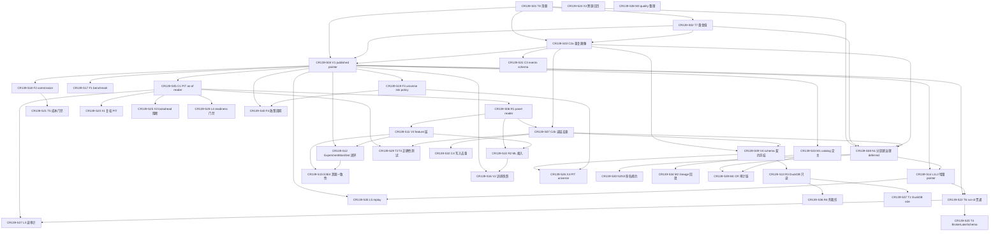

# CR139 Strategy Data Foundation Story Backlog

## 范围边界

CR139 CP4 只完成 Story planning、Story 卡片、DAG / Wave / 文件所有权与 CP4 自动预检。CP5 全量人工门禁通过前不得实现；本 CP4 不授权 LLD 写作（CP5）、实现、runtime、NAS、QMT、trading、provider-lake-catalog 写入、物理分区迁移执行（Wave1 N1 后置到基线冻结之后）、Git remote write。CP4 通过仅意味着 Story 可进入 CP5 LLD 写作，不等于授权实现。

Story 拆分原则：按 Wave1 P0（MVP）优先，覆盖全 45 项整改（REQ-201..245），分 Wave。每个 Story 可独立验收、文件所有权不冲突。聚合规则：同 Owner Feature、同代码触点簇、强契约耦合的相邻整改项可聚合（如 E1/E2/E5 ExperimentManifest 闭环、L1/L2 增量+pointer、T2/T3 正确性测试、N2/N3 命名规约）；文件所有权冲突的项必须拆开（如 readers.py 被 C1/R1/C2b/V4/R3/V2/X3/L3/L4/R4 多 Story 触及，按函数切片 + merge_order 串行合并）。

机械核验：45 项整改 1:1 映射 REQ-201..245，类别 (a)=6/(b)=7/(c)=12/(d1)=6/(d2)=14，逐项点数 6+7+12+6+14=45。Wave 分布 W1=7 REQ / W2=32 REQ / W3=6 REQ，合计 45。Story 覆盖 45 REQ 不遗漏。

## lld_policy 来源与判定

lld_policy 严格遵循 `docs/design/FEATURE-DESIGN-MATRIX.md` v1.13 §Feature 归属表逐项判定（真相源），不按类别粗粒度推断。聚合 Story 取所含 REQ 的最高 lld 级别（full-lld 优先）。判定规则：d1 纯新建=full-lld；d2 既有合同闭环=technical-note；a 已设计未实现=technical-note（消费既有 HLD-DATA-LAKE 契约）；c 范围扩展=full-lld；b 设计过期=full-lld（C2 结构性去重）/ technical-note（命名/整理类）。REQ-211 M4 虽为 c 但 MATRIX 逐项标 technical-note（审计链字段补全低风险），以 MATRIX 为准。

## Story 总览

| Story ID | 标题 | Owner Feature | lld_policy | Wave | REQ 覆盖 | 依赖 | 状态 |
|---|---|---|---|---|---|---|---|
| CR139-S01 | T8 整改对象自动化清册 | FEAT-02 | full-lld | W1 | 213 | 无 | lld-pending |
| CR139-S02 | T7 整改回归基线+黄金值快照 | FEAT-02 | full-lld | W1 | 212 | S01 | lld-pending |
| CR139-S03 | C2a 重复画像 | FEAT-02 读侧 | full-lld | W1 | 205(C2a) | S01,S02 | lld-pending |
| CR139-S04 | V1 published pointer/read selector | FEAT-02 写/读 | technical-note | W1 | 232 | S01,S02,S03 | lld-pending |
| CR139-S05 | C1 PIT as-of reader | FEAT-02 读侧 | technical-note | W1 | 204 | S04 | lld-pending |
| CR139-S06 | R1 统一 panel reader | FEAT-02 读侧/03 | full-lld | W1 | 214 | S05 | lld-pending |
| CR139-S07 | C2b 读层去重 | FEAT-02 读侧 | full-lld | W1 | 205(C2b) | S06 | lld-pending |
| CR139-S08 | N1 run_id 分区键治理 | FEAT-02 写侧 | full-lld | W1 | 201 | S01,S02,S03,S07 | lld-pending(deferred-exec) |
| CR139-S09 | V4 schema 演进+实盘契约冻结 | FEAT-02/03 | full-lld | W2 | 220 | S01,S02,S03,S07 | lld-pending |
| CR139-S10 | R2 ML 接入 lake 废除旁路 | FEAT-03 | full-lld | W2 | 215 | S06,S11 | lld-pending |
| CR139-S11 | V3 feature/label/artifact 层 | FEAT-03 | full-lld | W2 | 219 | S06 | lld-pending |
| CR139-S12 | ExperimentManifest 闭环（E1+E2+E5） | FEAT-03/11 | full-lld | W2 | 221,222,225 | S04,S11 | lld-pending |
| CR139-S13 | R3 DuckDB 只读 adapter | FEAT-02 读侧 | technical-note | W2 | 216 | S09 | lld-pending |
| CR139-S14 | L1+L2 日级增量+pointer 前移 | FEAT-02 写侧 | technical-note | W2 | 243,244 | S04,S08 | lld-pending |
| CR139-S15 | E3+E4 label 泄漏+离线在线一致性 | FEAT-03 | full-lld | W2 | 223,224 | S11,S12 | lld-pending |
| CR139-S16 | V2 训练快照+training cutoff | FEAT-03 | full-lld | W2 | 218 | S04,S10 | lld-pending |
| CR139-S17 | F1 版本化 benchmark+risk-free curve | FEAT-02 | technical-note | W2 | 236 | S04 | lld-pending |
| CR139-S18 | F2 版本化 commission/费用/滑点 | FEAT-12 | technical-note | W2 | 237 | S04 | lld-pending |
| CR139-S19 | F3 版本化 universe/risk policy | FEAT-14 | technical-note | W2 | 238 | S04 | lld-pending |
| CR139-S20 | T4 BrokerLakeSchema 闭环实盘写+审计链 | FEAT-06 | full-lld | W2 | 240 | S22 | lld-pending |
| CR139-S21 | T5 CommissionSchedule 前置成本门禁 | FEAT-12 | technical-note | W2 | 241 | S18 | lld-pending |
| CR139-S22 | T6 数据 run-id 贯通（跨边界） | FEAT-02 写侧/11/06 | technical-note | W2 | 242 | S04,S14 | lld-pending |
| CR139-S23 | X1 复权因子 PIT 校验 | FEAT-02 写侧 | full-lld | W2 | 229 | S05 | lld-pending |
| CR139-S24 | X2 跨源交易日历/时区一致性 | FEAT-02 写侧 | full-lld | W2 | 230 | 无 | lld-pending |
| CR139-S25 | X3 decision_time lookahead 阻断 | FEAT-02 读侧 | technical-note | W2 | 235 | S05 | lld-pending |
| CR139-S26 | X4 PIT universe 成分链 | FEAT-14 | technical-note | W2 | 231 | S09,S19 | lld-pending |
| CR139-S27 | L3 读审计 log+run-id 贯通 | FEAT-02 读侧/11 | full-lld | W2 | 233 | S05,S22 | lld-pending |
| CR139-S28 | L4 readiness 读前强制门禁 | FEAT-02 读侧/14 | technical-note | W2 | 234 | S05 | lld-pending |
| CR139-S29 | T2+T3 PIT/去重正确性回归测试 | FEAT-02 读侧 | full-lld | W2 | 226,227 | S05,S07 | lld-pending |
| CR139-S30 | N2+N3 run_id 命名规约统一 | FEAT-02 写侧 | technical-note | W2 | 202,203 | S08 | lld-pending |
| CR139-S31 | C3 events schema 修复 | FEAT-02 写侧 | technical-note | W2 | 206 | S01,S02,S03 | lld-pending |
| CR139-S32 | C4 写入去重保证 | FEAT-02 写侧 | technical-note | W2 | 207 | S07 | lld-pending |
| CR139-S33 | M1 catalog/manifest 定主 | FEAT-02 写侧 | technical-note | W2 | 208 | S04 | lld-pending |
| CR139-S34 | M2 lineage_checksum 回填 | FEAT-02 写侧 | technical-note | W2 | 209 | S33 | lld-pending |
| CR139-S35 | L5 replay 接通 published as_of 重放 | FEAT-02 读侧 | technical-note | W3 | 245 | S04,S14 | lld-pending |
| CR139-S36 | R4 列裁剪/谓词下推 | FEAT-02 读侧 | technical-note | W3 | 217 | S13 | lld-pending |
| CR139-S37 | T1 DuckDB 只读 e2e 测试 | FEAT-02 读侧 | technical-note | W3 | 228 | S13 | lld-pending |
| CR139-S38 | M3 quality/ 分区整理 | FEAT-02 写侧 | technical-note | W3 | 210 | 无 | lld-pending |
| CR139-S39 | M4 CR→数据审计链 | FEAT-02 写侧 | technical-note | W3 | 211 | S08,S33 | lld-pending |
| CR139-S40 | F4 版本化政策周期/shortability | FEAT-03 | technical-note | W3 | 239 | S04,S19 | lld-pending |

lld_policy 汇总：full-lld 17 个（S01,S02,S03,S06,S07,S08,S09,S10,S11,S12,S15,S16,S20,S23,S24,S27,S29）；technical-note 23 个。

## Story 详情

### Wave 1 — 冻结基线 + 信任基础（P0，解锁回测）

#### CR139-S01 T8 整改对象自动化清册
d1 纯新建（full-lld）。一行命令输出全 dataset 行数/覆盖/重复键/pit_status/published/lineage 缺失情况。Wave1 基线门第 1 步。代码触点：新清册脚本（`scripts/lake_inventory.py` 或 `market_data/remediation_inventory.py`）。依赖：无。
验收：执行清册命令扫描全 dataset，输出行数/覆盖/重复键/pit_status/published/lineage 缺失情况；17→N dataset 全覆盖。

#### CR139-S02 T7 整改回归基线+黄金值快照
d1 纯新建（full-lld）。整改前后跑下游因子/回测黄金值快照对比，差异归因（结构修复 vs 历史数据变化）。Wave1 基线门第 2 步。代码触点：新黄金值机制（`market_data/remediation_baseline.py` 或 `tests/golden/`）。依赖：S01（清册对象作为基线对象）。
验收：整改前冻结黄金值快照；整改后跑对比输出差异归因报告，100% 归因到"结构修复"或"历史数据变化"二者之一。

#### CR139-S03 C2a 重复画像
b 设计过期（full-lld，C2 结构性）。38 run_id 分区里哪些 `(symbol,trade_date)` 重复、来自哪些 run。Wave1 基线门第 3 步。代码触点：`readers.py:375/409` 只读分析（重复画像函数，不写去重层）。依赖：S01,S02（基线冻结后画像）。
验收：画像输出重复键清单 + 来源 run_id；与 S01 清册交叉核对。
【基线门：S01/S02/S03 verified 后以下结构性变更才可开始（REQ-247）】

#### CR139-S04 V1 published pointer / read selector
a 已设计未实现（technical-note，消费 HLD-DATA-LAKE §5/§17.4 契约）。canonical → published + catalog current pointer 固定；reader 只消费已发布 current truth。四道 P0 防线之一。代码触点：`publish.py:605`、`catalog.py`、`cli.py`。依赖：S01,S02,S03（基线门硬依赖）。
验收：candidate/gold/published promote 后 catalog current pointer 固定；reader 只读 published（未发布行=0）；validate pass 不自动前移 pointer（SM-27 非法转换阻断）。

#### CR139-S05 C1 PIT as-of reader
a 已设计未实现（technical-note，消费 HLD-DATA-LAKE §17.7.1/§14 契约）。实现 `read_panel_as_of`，读财报/估值按 `available_at <= as_of` 取最新。四道 P0 防线之一。代码触点：`readers.py` 新增 `read_panel_as_of`、`catalog.py` 物化 `pit_status`。依赖：S04（published selector 契约）。
验收：读 financial_pit/market_cap 时 as_of=T 只返回 available_at<=T 的最新记录；构造"未来财报"用例断言读不到（0 条泄漏）。

#### CR139-S06 R1 统一 panel reader
c 范围扩展（full-lld）。新增 `read_panel(datasets, as_of)`，复用 `read_dataset` published 门禁，输出价格×财务×估值×行业统一 as-of 宽表。四道 P0 防线之一。跨边界：owner=FEAT-02 读侧，FEAT-03 ML 消费。代码触点：`readers.py:2728` 复用、新增 panel 聚合。依赖：S05（PIT as-of 契约）。
验收：多 dataset read_panel(as_of) 输出统一 as-of 宽表且只含 published 数据（未发布行=0）。

#### CR139-S07 C2b 读层去重
b 设计过期（full-lld，C2 结构性）。读层去重按 source_run_id 取最新版本。代码触点：`readers.py:375/409` 去重层（与 C2a 切片分离）。依赖：S06（panel reader 读路径）。
验收：canonical 38 run_id 分区读层去重后 `(symbol,trade_date)` 唯一（重复键=0）。

#### CR139-S08 N1 run_id 分区键治理（deferred-execution）
c 范围扩展（full-lld）。新数据用 `dataset/schema_version/` + current + archive；catalog 元数据加 `triggered_by_cr`；存量 run_id 按 D3 不重命名。物理分区迁移后置到基线冻结之后（REQ-247/248）。代码触点：`lake_layout.py`、`cli.py:1871`、`normalization.py:808`。依赖：S01,S02,S03（基线门）+ S07（去重就位后迁移更安全）。
验收：新数据写入使用 dataset/schema_version 分区，不含 run_id 长期分区键；catalog 含 triggered_by_cr；存量 run_id 不主动改名。状态：lld-pending，dev_gate=deferred-until-baseline-verified（实现延迟到 S01/S02/S03 verified 后；CP4 不授权物理分区迁移执行）。

### Wave 2 — 接入与规模（P1，解锁 ML + 模拟盘）

#### CR139-S09 V4 schema 演进+实盘契约冻结
c 范围扩展（full-lld）。定义 schema 演进规则 + reader 兼容回退；模拟盘前 SchemaContractFreeze.status=frozen（HIGH3，从 Wave3 移入 Wave2）。代码触点：`engine/contracts.py`、`readers.py` 兼容回退切片。依赖：S01,S02,S03（基线门）+ S07（reader 读路径）。
验收：schema 变更按演进规则分级（兼容/破坏）reader 兼容回退；模拟盘前契约冻结；reader 兼容回退覆盖率=100% schema 变更类型。

#### CR139-S10 R2 ML 接入 lake 废除旁路
c 范围扩展（full-lld）。ML 接入 `read_panel_as_of`，废除 `--data-dir`/`load_local_frames` 旁路（FD-48 硬禁止）。代码触点：`experiments/run_experiment_15_*.py`、`run_experiment_23_29_*.py:132`。依赖：S06（R1 panel reader）+ S11（V3 feature 层）—— 依赖顺序 R1→V3→R2（HLD Gotchas#4）。
验收：ML 实验加载数据走 read_panel_as_of，旁路调用次数=0。

#### CR139-S11 V3 feature/label/artifact 层
c 范围扩展（full-lld）。新增 `features/` 子层带版本 + schema；feature/label/artifact 审计链；保留切换独立 feature store 条件（DEF-139-01）。代码触点：新模块（`market_data/features/` 或 `features/`）、`lake_layout.py` 新增 features/ 子目录。依赖：S06（panel reader，feature 消费 panel）。
验收：feature 计算持久化写入版本化 features/ 层，schema 可追溯；切换条件 DEF-139-01 记录。

#### CR139-S12 ExperimentManifest 闭环（E1+E2+E5）
聚合 E1（c full-lld）+ E2（c full-lld）+ E5（d2 technical-note）→ Story 取 full-lld。ExperimentManifest 闭环 published release + lineage（E1）；模型 artifact hash 引用 dataset snapshot（E2）；split cutoff 冻结入 ExperimentManifest 与 embargo 统一（E5）。代码触点：`engine/research_manifest.py:152`、`engine/strategy_admission_package.py:127`。依赖：S04（V1 published release）+ S11（V3 feature 层，artifact 引用 dataset snapshot）。
验收：ExperimentManifest 引用 published dataset snapshot + as_of + split + lineage；模型 artifact 带 hash 引用 dataset snapshot；split cutoff 入 ExperimentManifest 与 embargo 统一。

#### CR139-S13 R3 DuckDB 只读 adapter
a 已设计未实现（technical-note，消费 HLD-DATA-LAKE §17.6/§17.7 契约）。D4 只读引擎，parquet 仍是存储；护栏已就位，实现 adapter。代码触点：`duckdb_query.py`、`pyproject.toml`（引入依赖需 CP5 批准）、`readers.py` adapter 接入切片。依赖：S09（V4 schema 稳定，DuckDB 查询需 schema 稳定）。
验收：DuckDB adapter 只读查询返回结果且不写持久事实源（FD-49）；parquet 仍是存储；`.duckdb` 持久事实源、DuckDB 写 lake、DuckDB 替代 catalog/manifest 均为违规。

#### CR139-S14 L1+L2 日级增量+pointer 前移
聚合 L1（d2 technical-note）+ L2（d2 technical-note）→ technical-note。L1 增量刷新计划接通真实日级 append 执行链（available_at 盖戳+幂等写+当日去重）；L2 published pointer 接通真实前移执行（每日 promote→current pointer 前移+门禁）。代码触点：`incremental.py:248`、`publish.py:605`、`normalization.py`、`cli.py`。依赖：S04（V1 pointer 契约）+ S08（N1 分区路径，增量写入路径）。
验收：日级增量 append 幂等+当日去重+available_at 盖戳；每日 promote 后 current pointer 前移+门禁通过。

#### CR139-S15 E3+E4 label 泄漏+离线在线一致性
聚合 E3（d2 technical-note）+ E4（d1 full-lld）→ full-lld。E3 统一既有泄漏审计到 data release + cutoff gate；E4 训练特征与实盘特征同 schema 同计算校验，不一致阻断。代码触点：`engine/factor_model_validation.py:561/376`、`engine/factor_robustness.py:53`、新一致性校验模块。依赖：S11（V3 feature 层）+ S12（ExperimentManifest cutoff gate）。
验收：label 泄漏检查统一接入 data release + cutoff gate；离线/在线特征同 schema 同计算，不一致阻断。

#### CR139-S16 V2 训练快照+training cutoff
c 范围扩展（full-lld）。ML 只读 published 快照，training cutoff 固定可复现。代码触点：`readers.py` published-only 切片、ML 脚本。依赖：S04（V1 published 快照）+ S10（R2 ML 接入）。
验收：ML 训练读数据只读 published 快照，cutoff 固定可复现。

#### CR139-S17 F1 版本化 benchmark+risk-free curve
d2 既有合同闭环（technical-note）。既有 `benchmarks.py:99/114` BenchmarkCoverage/BenchmarkDefinition 基础上补版本化 benchmark 与无风险利率曲线事实源 + release 闭环（复用 V1 pointer 语义，AGA-5 E1）。代码触点：`market_data/benchmarks.py:99/114`。依赖：S04（V1 release 闭环）。
验收：benchmark 版本化带 version + effective_from + release_id + risk-free curve。

#### CR139-S18 F2 版本化 commission/费用/滑点
d2 既有合同闭环（technical-note）。既有 `qmt_gateway_contracts.py:997` CommissionSchedule 基础上补版本化佣金/费用/滑点模型事实源 + release 闭环。代码触点：`trading/qmt_gateway_contracts.py:997`。依赖：S04（V1 release 闭环）。
验收：CommissionSchedule 版本化带 version + effective_from + release_id。

#### CR139-S19 F3 版本化 universe/risk policy
d2 既有合同闭环（technical-note）。既有 `mature_multifactor_framework.py:228` PortfolioRiskPolicy 基础上补版本化 universe policy + risk policy 事实源（退市/ST/容量约束）+ release 闭环。代码触点：`engine/mature_multifactor_framework.py:228`。依赖：S04（V1 release 闭环）。
验收：PortfolioRiskPolicy 版本化，universe/risk policy 带 version + release 闭环 + 退市/ST/容量约束。

#### CR139-S20 T4 BrokerLakeSchema 闭环实盘写+审计链
c 范围扩展（full-lld）。既有 `broker_lake.py:64` schema 接通实盘写 + 订单/成交/持仓审计链。代码触点：`trading/broker_lake.py` schema registry。依赖：S22（T6 run-id 贯通，broker event 关联 run-id）。
验收：BrokerLakeSchema 实盘写时订单/成交/持仓审计链闭环（CP4/CP5 不授权实盘写执行，只设计契约）。

#### CR139-S21 T5 CommissionSchedule 前置成本门禁
d2 既有合同闭环（technical-note）。既有 `qmt_gateway_contracts.py:997` 接通成本/滑点/成交可得性前置门禁。代码触点：`trading/qmt_gateway_contracts.py:997`（与 S18 F2 file-conflict，F2 先）。依赖：S18（F2 版本化 commission 事实源，T5 消费）。
验收：回测/实盘成本门禁前置，成本/滑点/成交可得性前置阻断。

#### CR139-S22 T6 数据 run-id 贯通（跨边界）
d2 既有合同闭环（technical-note）。数据 run-id 贯穿既有 RunEvidenceIndex / broker event。跨边界：owner=FEAT-02 写侧（run-id 生成，publish 时写入 lineage），消费方=FEAT-11 RunEvidenceIndex + FEAT-06 broker event（只读，FD-51 禁止断链静默成功）。代码触点：生成侧 `publish.py`/`manifest.py`（与 V1/L2 file-conflict）；消费侧 `trading/strategy_runner/evidence_index.py:19`。依赖：S04（V1 publish 生成 run-id）+ S14（L1/L2 增量带 run-id）。
验收：数据→研究→执行同 run-id 贯穿 RunEvidenceIndex/broker event；断链标注断点，伪造贯通次数=0。

#### CR139-S23 X1 复权因子 PIT 校验
d1 纯新建（full-lld）。除权除息事件按 PIT 应用；复权因子本身 PIT 正确性校验；复权断点回归测试。代码触点：`normalization.py` 复权切片、CR017 复权。依赖：S05（C1 PIT 语义）。
验收：除权除息事件按 PIT 应用，复权因子时点正确；复权断点回归通过。

#### CR139-S24 X2 跨源交易日历/时区一致性
d1 纯新建（full-lld）。跨源（tushare/jqdata/QMT）交易日历对齐校验；时区归一。代码触点：`trade_calendar`、跨源。依赖：无强依赖（独立校验）。
验收：跨源交易日历对齐一致；时区归一。

#### CR139-S25 X3 decision_time lookahead 阻断
d2 既有合同闭环（technical-note）。既有 `readers.py:227/1790` decision_time 部分支持，加强制 lookahead 阻断门禁（信号时刻 vs available_at）。代码触点：`readers.py` decision_time 切片。依赖：S05（C1 reader，门禁嵌入读路径）。
验收：信号时刻 vs available_at lookahead 违规时阻断。

#### CR139-S26 X4 PIT universe 成分链
d2 既有合同闭环（technical-note）。既有 `contracts.py:270` survivorship_bias_note 已识别，补按时点构建 PIT universe 成分链（index_members snapshot）。代码触点：`engine/contracts.py:270`（与 S09 V4 file-conflict，V4 先）。依赖：S09（V4 contracts.py schema）+ S19（F3 universe policy 版本化）。
验收：index_members 按时点构建 PIT universe 成分链，消除固定成分快照偏差。

#### CR139-S27 L3 读审计 log+run-id 贯通
d1 纯新建（full-lld）。新增 reader 读审计 log，与既有 RunEvidenceIndex 同 run-id 贯通。跨边界：owner=FEAT-02 读侧（读审计 log），消费方=FEAT-11 RunEvidenceIndex。代码触点：`readers.py` 读审计 hook 切片、新 audit 模块。依赖：S05（C1 reader hook）+ S22（T6 run-id 贯通）。
验收：reader 读完成时读审计 log 与 RunEvidenceIndex 同 run-id 贯通。

#### CR139-S28 L4 readiness 读前强制门禁
d2 既有合同闭环（technical-note）。既有 `readiness.py:462 build_readiness_matrix` 前置为读前强制 gate（coverage/新鲜度/PIT），不通过阻断。跨边界：owner=FEAT-02 读侧，消费方=FEAT-14 模拟盘。代码触点：`market_data/readiness.py:462`、`readers.py` gate 调用切片。依赖：S05（C1 reader 前置 gate）。
验收：读前 readiness gate 不通过时阻断（coverage/新鲜度/PIT）。

#### CR139-S29 T2+T3 PIT/去重正确性回归测试
聚合 T2（c full-lld）+ T3（c full-lld）→ full-lld。T2 构造"未来财报"用例断言 as-of reader 读不到；T3 断言 `(symbol,trade_date)` 唯一。代码触点：新测试 `tests/test_cr139_pit_correctness.py`、`tests/test_cr139_dedup_correctness.py`。依赖：S05（C1 PIT）+ S07（C2b 去重）。
验收：未来财报 fixture as-of read 读不到；重复键 fixture 去重 read 后唯一。

#### CR139-S30 N2+N3 run_id 命名规约统一
聚合 N2（b technical-note）+ N3（b technical-note）→ technical-note。N2 新 run 统一 `run-<purpose>-<window>-<source>-<YYYYMMDD>` + 修 unknown bug；N3 新规约不放 CR 编号，存量不主动改名。代码触点：run_id 生成处（`normalization.py`/`lake_layout.py`，与 S08 N1 file-conflict，N1 先）。依赖：S08（N1 分区规约）。
验收：新 run 命名符合统一前缀规约，无 unknown run_id；新路径不含 CR 编号；存量路径保留。

#### CR139-S31 C3 events schema 修复
b 设计过期（technical-note）。events schema 全 null 类型修复，修写入侧类型推断，重跑 events。代码触点：`normalization.py` events 分支切片。依赖：S01,S02,S03（基线门，结构性变更）。
验收：events 数据集 schema 类型非全 null，字段类型正确。

#### CR139-S32 C4 写入去重保证
b 设计过期（technical-note）。写 canonical 前按主键去重或写入后校验唯一。代码触点：`normalization.py` 写入去重切片、`validation.py`。依赖：S07（C2b 读层去重语义对应）。
验收：写 canonical 主键重复时去重或校验失败阻断。

#### CR139-S33 M1 catalog/manifest 定主
b 设计过期（technical-note）。catalog 为主、manifest 为派生。代码触点：`catalog.py`（与 S04 V1 file-conflict，V1 先）、`manifest.py`。依赖：S04（V1 pointer 契约，catalog 为主语义）。
验收：catalog 与 manifest 一致性校验，catalog 为真相源，manifest 派生。

#### CR139-S34 M2 lineage_checksum 回填
a 已设计未实现（technical-note，消费 HLD-DATA-LAKE §17.7.1 契约）。写 canonical 时回填 lineage_checksum（raw→canonical 闭合）。代码触点：`manifest.py`（与 S33 M1 file-conflict）、`normalization.py`（与 N1/C3/C4/X1/L1 file-conflict）。依赖：S33（M1 catalog/manifest 定主，lineage 写入路径）。
验收：写 canonical 完成时 lineage_checksum 非缺失（17/17 缺失→0 缺失）。

### Wave 3 — 实盘与运维（P2）

#### CR139-S35 L5 replay 接通 published as_of 重放
d2 既有合同闭环（technical-note）。既有 `replay.py:215`、`cli.py cmd_p0_replay` 接通 published as_of 单日快照重放。代码触点：`market_data/replay.py:215`、`cli.py`（与 N1/V1/L1 file-conflict）。依赖：S04（V1 published as_of）+ S14（L1/L2 增量，replay 基础）。
验收：published as_of replay 单日快照重放，不触发 provider。

#### CR139-S36 R4 列裁剪/谓词下推
a 已设计未实现（technical-note，消费 HLD-DATA-LAKE §17.6 契约）。DuckDB 接入自然解决；过渡期 reader 支持下推。代码触点：`readers.py` 列裁剪切片。依赖：S13（R3 DuckDB 接入）。
验收：查询指定列/谓词时下推生效。

#### CR139-S37 T1 DuckDB 只读 e2e 测试
a 已设计未实现（technical-note）。adapter 实现后补 e2e 只读测试。代码触点：`tests/test_cr014_duckdb_*.py`。依赖：S13（R3 adapter 实现）。
验收：DuckDB adapter e2e 只读测试通过且无写入。

#### CR139-S38 M3 quality/ 分区整理
b 设计过期（technical-note）。quality/ 按数据集/日期分区；smoke/probe 进 `_scratch/` + 保留策略。代码触点：质量报告写入处。依赖：无强依赖。
验收：quality/ 按数据集/日期分区，smoke/probe 隔离到 _scratch/。

#### CR139-S39 M4 CR→数据审计链
c 范围扩展（technical-note，MATRIX 逐项标）。catalog 加 `triggered_by_cr`、`run_lineage`。代码触点：`catalog.py`（与 S04 V1/S33 M1 file-conflict）。依赖：S08（N1 triggered_by_cr 字段）+ S33（M1 catalog 定主）。
验收：catalog 查询可追溯 triggered_by_cr 与 run_lineage。

#### CR139-S40 F4 版本化政策周期/shortability
d2 既有合同闭环（technical-note）。既有 `factor_model_validation.py:444` policy_cycle_coverage、`config/policy_cycles.yaml` 基础上补版本化政策周期 + shortability 事实源 + release 闭环。代码触点：`engine/factor_model_validation.py:444`（与 S15 E3/E4 file-conflict，E3/E4 先）、`config/policy_cycles.yaml`。依赖：S04（V1 release 闭环）+ S19（F3 policy 版本化参照）。
验收：政策周期版本化带 version + release 闭环 + shortability。

## 依赖 DAG

## 文件所有权矩阵

> 同一文件被多 Story 触及时，按 merge_order 串行合并（CR138 模式：merge_owner + file-conflict 依赖）。readers.py 是冲突最密集文件（10 Story 触及），按函数切片 + merge_order 串行合并。AGA-1 A1 的代价（HLD Gotchas#1 提示 CP5 读写冲突）。

| 文件 | 触及 Story | merge_order（契约先行） | 所有权切片 |
|---|---|---|---|
| `market_data/readers.py` | S05 C1, S06 R1, S07 C2b, S09 V4, S13 R3, S16 V2, S25 X3, S27 L3, S28 L4, S36 R4 | S05→S06→S07→S09→S25→S27→S28→S13→S16→S36 | read_panel_as_of / read_panel 聚合 / 去重层 / 兼容回退 / adapter 接入 / published-only / lookahead 阻断 / 读审计 hook / readiness gate 调用 / 列裁剪 |
| `market_data/publish.py` | S04 V1, S14 L2, S22 T6 | S04→S14→S22 | pointer 固定 / pointer 真实前移 / run-id 生成写入 lineage |
| `market_data/catalog.py` | S04 V1, S33 M1, S39 M4 | S04→S33→S39 | current pointer / manifest 派生化 / triggered_by_cr+run_lineage |
| `market_data/normalization.py` | S08 N1, S14 L1, S22 T6, S23 X1, S31 C3, S32 C4, S34 M2 | S08→S31→S32→S34→S14→S23→S22 | 分区路径 / events 分支 / 写入去重 / lineage 回填 / 增量盖戳 / 复权 PIT / run-id 生成 |
| `market_data/lake_layout.py` | S08 N1, S11 V3, S30 N2 | S08→S11→S30 | 分区路径 / features/ 子目录 / run_id 前缀 |
| `market_data/cli.py` | S08 N1, S04 V1, S14 L1, S35 L5 | S08→S04→S14→S35 | :1871 分区命令 / promote 命令 / 增量命令 / cmd_p0_replay |
| `trading/qmt_gateway_contracts.py` | S18 F2, S21 T5 | S18→S21 | 版本化 commission / 成本门禁 |
| `engine/contracts.py` | S09 V4, S26 X4 | S09→S26 | schema 演进 / PIT universe 成分链 |
| `engine/factor_model_validation.py` | S15 E3, S40 F4 | S15→S40 | label 泄漏 :561/376 / 政策周期 :444 |
| `engine/research_manifest.py` | S12 E1 | S12 独占 | ExperimentManifest 闭环 |
| `engine/strategy_admission_package.py` | S12 E2 | S12 独占 | artifact hash |
| `trading/broker_lake.py` | S20 T4 | S20 独占 | BrokerLakeSchema 审计链 |
| `trading/strategy_runner/evidence_index.py` | S22 T6 (消费侧) | S22 独占（消费侧） | run-id 关联 |
| `market_data/readiness.py` | S28 L4 | S28 独占 | readiness gate |
| `market_data/replay.py` | S35 L5 | S35 独占 | replay |
| `market_data/incremental.py` | S14 L1 | S14 独占 | 增量 append |
| `market_data/manifest.py` | S33 M1, S34 M2 | S33→S34 | 定主 / lineage_checksum |
| `market_data/duckdb_query.py` | S13 R3 | S13 独占 | DuckDB adapter |
| `market_data/benchmarks.py` | S17 F1 | S17 独占 | 版本化 benchmark |
| `engine/mature_multifactor_framework.py` | S19 F3 | S19 独占 | 版本化 universe/risk policy |
| `market_data/validation.py` | S32 C4 | S32 独占 | 写入校验 |
| `config/policy_cycles.yaml` | S40 F4 | S40 独占 | 政策周期配置 |
| `pyproject.toml` | S13 R3 (引入 DuckDB 依赖) | S13 独占（CP5 批准才引入） | 依赖声明 |
| `tests/test_cr014_duckdb_*.py` | S37 T1 | S37 独占 | e2e 测试 |
| 新清册/黄金值/测试脚本 | S01, S02, S29 | 各自独占 | 新文件 |

跨边界项 owner/consumer（显式标注）：

| 跨边界项 | owner Story (生成侧) | consumer Story (消费侧) | 贯通契约 |
|---|---|---|---|
| T6 run-id | S22（FEAT-02 写侧生成） | S20 T4（FEAT-06 broker event）, S27 L3（FEAT-11 RunEvidenceIndex） | run-id 单向贯通，消费方只读，FD-51 禁止断链静默成功 |
| R1 panel reader | S06（FEAT-02 读侧） | S10 R2（FEAT-03 ML）, S11 V3（FEAT-03 feature） | panel reader owner 读侧，FEAT-03 只读消费 |
| L3 读审计 log | S27（FEAT-02 读侧） | S22 T6（FEAT-11 run-id 关联） | 读审计 log owner 读侧，FEAT-11 run-id 关联 |
| L4 readiness gate | S28（FEAT-02 读侧） | FEAT-14 模拟盘消费 | readiness gate owner 读侧 |
| F1-F4 config_facts release | S17/S18/S19/S40（FEAT-02/12/14/03 各自） | 各配置消费方 | release 闭环复用 V1 pointer 语义（AGA-5 E1） |

## 不授权范围

CP4 不授权：LLD 写作（CP5）/ 实现 / runtime / NAS / QMT / trading / provider-lake-catalog 写入 / 物理分区迁移执行（Wave1 N1 后置到基线冻结之后，CP4 只设计不执行）/ published pointer 前移执行 / broker lake 实盘写 / Git remote write / 真实 lake 写入。CP4 通过仅意味着 Story 可进入 CP5 LLD 写作，不等于授权实现。后续必要验证按 action scope、运行窗口、脱敏、回滚和审计范围单独授权。
