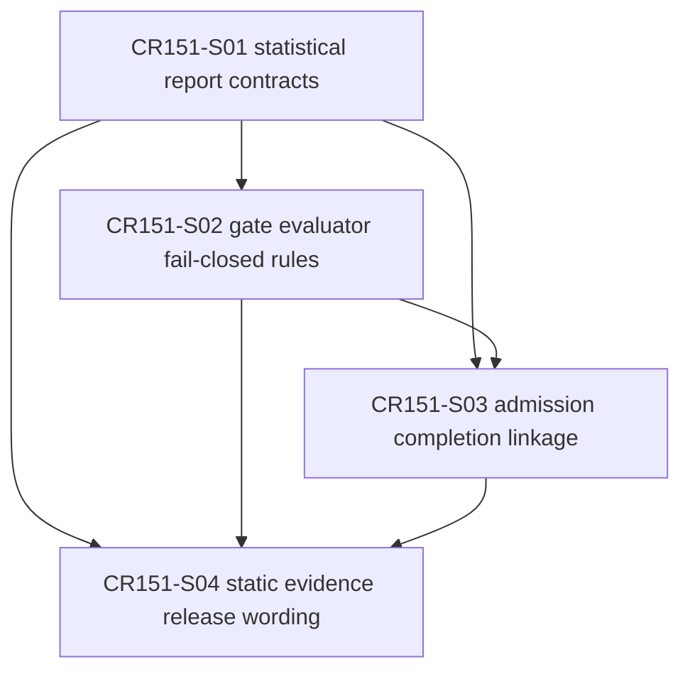

# CR151 Story Backlog

## Scope Boundary

CR151 CP4 only completes Story planning, Feature Design Matrix updates, Feature index updates, Story cards, DAG / Wave planning and CP4 automatic precheck. CP5 approval is required before implementation. This CP4 does not authorize real lake/NAS/provider/QMT/runtime/simulation/live/trading/broker/credential/external framework/Git remote/catalog pointer operations.

## Story Overview

| Story ID | Title | Owner Feature | LLD Policy | Wave | Depends On | Status |
|---|---|---|---|---|---|---|
| CR151-S01-statistical-report-contracts | Statistical report contracts | FEAT-03 | full-lld | CR151-W1-CONTRACTS | none | lld-ready-for-review |
| CR151-S02-gate-evaluator-fail-closed-rules | Gate evaluator and fail-closed rules | FEAT-03 / FEAT-07 | full-lld | CR151-W2-GATE-EVALUATOR | CR151-S01 | lld-ready-for-review |
| CR151-S03-admission-completion-linkage | Admission and completion linkage | FEAT-03 | full-lld | CR151-W3-LINKAGE | CR151-S01, CR151-S02 | lld-ready-for-review |
| CR151-S04-static-evidence-release-wording | Static evidence and release wording | FEAT-03 / FEAT-08 | technical-note | CR151-W4-EVIDENCE | CR151-S01, CR151-S02, CR151-S03 | lld-ready-for-review |

## Story Details

### CR151-S01 Statistical report contracts

Freeze the metadata-only report contracts for Wave A statistical admission: multiple testing/FDR, robust factor statistics, walk-forward/OOS validation, PBO/DSR overfit risk and the aggregate gate object.

Acceptance criteria:

- Defines JSON-safe typed structures or dataclasses for all five Wave A objects.
- Reuses existing research/admission anchors; does not create parallel `ResearchDatasetSpec` or `BacktestRunSpec`.
- Exposes report-level validation issues for missing candidate family, missing OOS fold, missing trial count and invalid threshold configuration.
- Does not read `.env`, lake, NAS, provider, QMT, broker, external frameworks or Git remote.

### CR151-S02 Gate evaluator and fail-closed rules

Implement the deterministic aggregate gate policy over S01 report contracts.

Acceptance criteria:

- Covers `PASS`, `FAIL`, `NEEDS_REVIEW` and `BLOCKED`.
- Mandatory evidence missing returns `BLOCKED`, not `NEEDS_REVIEW`.
- Nonzero forbidden operation counters return `BLOCKED`.
- Threshold failures with available evidence return `FAIL`; borderline evidence returns `NEEDS_REVIEW`.
- Fixture tests cover at least one path per status.

### CR151-S03 Admission and completion linkage

Link the statistical gate summary/ref into the existing multifactor admission/completion chain without changing runtime authorization semantics.

Acceptance criteria:

- CR150 completion map or CR151 linkage helper can reference the statistical gate report.
- Missing statistical gate produces `statistical_admission_gate_missing` or equivalent linkage gap.
- `StrategyAdmissionPackage` may carry statistical gate refs and blocked reasons.
- Statistical `PASS` never becomes simulation, paper, live, broker, QMT or trading readiness.
- Existing CR150 static-only release history remains unchanged.

### CR151-S04 Static evidence and release wording

Close process evidence, CP7/CP8 wording and release boundary for CR151.

Acceptance criteria:

- Return/evidence/release artifacts state `effective_validation_mode=static-only`.
- Evidence indexes record no real lake/NAS/provider/QMT/runtime/simulation/live/trading/broker/credential/external framework/Git remote operations.
- Wave B deferred items remain explicit: extended factor diagnostics, regime-aware validation, factor correlation clustering/de-duplication, capacity/impact, IR/TE/Active Share and PIT universe audit.
- CP8 release wording does not claim real performance, production turnover or runtime readiness.

## Dependency DAG

## File Ownership Summary

| Story | Primary owner | Shared / merge owner | Forbidden |
|---|---|---|---|
| CR151-S01 | `engine/strategy_admission_statistical_gate.py`, `tests/test_cr151_strategy_admission_statistical_gate.py` | S01 owns new contract skeleton and status enum | `.env`, real data, provider, QMT, broker, external framework imports |
| CR151-S02 | `engine/strategy_admission_statistical_gate.py`, `tests/test_cr151_strategy_admission_statistical_gate.py` | S02 owns evaluator policy after S01 contracts freeze | hiding mandatory missing evidence as `NEEDS_REVIEW` |
| CR151-S03 | `engine/mature_multifactor_research.py`, `engine/strategy_admission_package.py`, `tests/test_cr150_multifactor_framework_completion.py`, `tests/test_cr151_strategy_admission_statistical_gate.py` | S03 merge owner for CR150 linkage changes | changing CR150 historical release decision or runtime authorization |
| CR151-S04 | `process/returns/*`, `process/evidence/*`, `docs/release/*`, CP7/CP8 artifacts | S04 owns wording/evidence consolidation | claiming runtime evidence or real strategy performance |

## Not Authorized

- No `.env`, token, secret, account, session or credential read.
- No real lake, NAS, provider, catalog pointer or Git remote access.
- No QMT / MiniQMT / xtquant runtime, broker read/write, account query, market query, submit/cancel, simulation, paper, live or trading.
- No external framework clone, install or run.
- No source implementation before CP5 approval.
